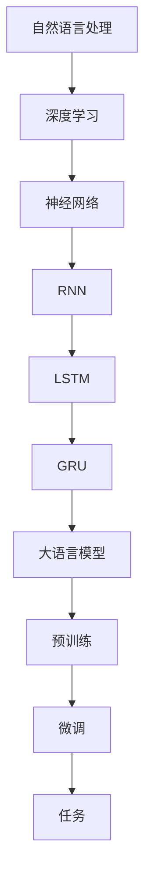

                 

关键词：大语言模型、自然语言处理、发展历程、技术演变、应用场景、未来展望

> 摘要：本文将深入探讨大语言模型在自然语言处理（NLP）领域的应用，回顾其发展历程，分析核心算法原理、数学模型及其实际应用场景，同时展望未来发展趋势与面临的挑战。

## 1. 背景介绍

自然语言处理（NLP）作为人工智能领域的一个重要分支，自上世纪50年代起就得到了广泛关注。早期的NLP研究主要集中在规则驱动的方法上，如句法分析和词义消歧。然而，这些方法往往需要大量手动构建的规则，并且难以应对复杂的语言现象。

随着计算能力的提升和数据量的激增，统计方法和机器学习方法开始应用于NLP领域。20世纪90年代，基于统计的模型如隐马尔可夫模型（HMM）和条件随机场（CRF）取得了显著成果。然而，这些模型在面对复杂语境和长文本时，仍然存在一定的局限性。

21世纪初，深度学习技术的发展为NLP带来了新的契机。特别是卷积神经网络（CNN）和循环神经网络（RNN）的引入，使得模型能够更好地捕捉文本中的序列信息。随后，长短时记忆网络（LSTM）和门控循环单元（GRU）等改进模型进一步提升了NLP的性能。

近年来，大语言模型（如GPT、BERT等）的出现，标志着NLP领域进入了新的发展阶段。这些模型通过预训练和微调，能够处理各种复杂的自然语言任务，从而在许多实际应用中取得了优异的表现。

## 2. 核心概念与联系

为了更好地理解大语言模型，首先需要介绍一些核心概念，并展示其原理和架构。

### 2.1 自然语言处理的概念

自然语言处理旨在使计算机能够理解、解释和生成人类语言。其主要任务包括文本分类、实体识别、情感分析、机器翻译等。

### 2.2 深度学习与神经网络

深度学习是机器学习的一个分支，通过构建多层神经网络，可以自动学习数据中的特征。神经网络由大量的节点（也称为神经元）组成，通过加权连接进行信息传递和处理。

### 2.3 循环神经网络（RNN）

循环神经网络是一种能够处理序列数据的神经网络，其特点是能够保存之前的信息，从而捕捉序列中的时间依赖性。然而，标准的RNN在处理长序列时存在梯度消失和梯度爆炸的问题。

### 2.4 长短时记忆网络（LSTM）

长短时记忆网络是RNN的一种改进模型，通过引入门控机制，可以有效解决梯度消失和梯度爆炸问题，从而在长序列学习中表现出色。

### 2.5 门控循环单元（GRU）

门控循环单元是LSTM的简化版本，通过合并输入门和遗忘门，进一步提高了计算效率。

### 2.6 大语言模型架构

大语言模型通常采用预训练和微调的方法。预训练是指在大量无标注的数据上进行训练，使模型能够学习到语言的一般规律；微调是指在预训练的基础上，针对具体任务进行有监督的训练。

下面是核心概念的Mermaid流程图：



## 3. 核心算法原理 & 具体操作步骤

### 3.1 算法原理概述

大语言模型的核心是基于注意力机制的变换器（Transformer）架构。与传统的循环神经网络相比，Transformer通过自注意力机制（Self-Attention）和多头注意力机制（Multi-Head Attention），能够更好地捕捉文本中的长距离依赖关系。

### 3.2 算法步骤详解

1. **嵌入（Embedding）**：将单词转换为向量表示。
2. **位置编码（Positional Encoding）**：为每个词赋予位置信息。
3. **多头自注意力（Multi-Head Self-Attention）**：对嵌入向量进行加权求和，得到新的向量表示。
4. **前馈网络（Feedforward Network）**：对注意力结果进行进一步处理。
5. **层归一化（Layer Normalization）**：对中间层进行归一化处理。
6. **残差连接（Residual Connection）**：将原始输入与注意力结果相加。
7. **Dropout（Dropout）**：为防止过拟合，对某些层进行随机丢弃。
8. **分类头（Classification Head）**：根据任务需求，对输入进行分类或回归。

### 3.3 算法优缺点

**优点**：

- **高效性**：通过自注意力机制，Transformer能够并行处理所有词的注意力，大大提高了计算效率。
- **可扩展性**：Transformer架构可以很容易地扩展到多个层和多个头，以处理更复杂的任务。
- **长距离依赖**：自注意力机制能够捕捉文本中的长距离依赖关系。

**缺点**：

- **内存消耗**：由于自注意力机制的计算复杂度较高，大语言模型在训练和推理阶段需要较大的内存资源。
- **解释性**：与传统的循环神经网络相比，Transformer的内部机制相对复杂，难以进行解释。

### 3.4 算法应用领域

大语言模型在自然语言处理领域有广泛的应用，如文本分类、情感分析、机器翻译、对话系统等。以下是一些具体的例子：

- **文本分类**：通过预训练模型，可以快速地识别新闻文章、社交媒体帖子等文本的类别。
- **情感分析**：分析用户评论、社交媒体帖子等，以判断用户对某个产品或服务的情感倾向。
- **机器翻译**：通过微调预训练模型，可以实现高质量的机器翻译。
- **对话系统**：利用大语言模型，可以构建智能对话系统，实现自然的人机交互。

## 4. 数学模型和公式 & 详细讲解 & 举例说明

### 4.1 数学模型构建

大语言模型的数学模型主要包括嵌入层、自注意力层、前馈网络和输出层。以下是主要数学公式的推导：

$$
E = W_e \cdot X + b_e \\
Q = W_q \cdot X + b_q \\
K = W_k \cdot X + b_k \\
V = W_v \cdot X + b_v
$$

其中，$E$、$Q$、$K$和$V$分别表示嵌入向量、查询向量、键向量和值向量；$W_e$、$W_q$、$W_k$和$W_v$表示权重矩阵；$b_e$、$b_q$、$b_k$和$b_v$表示偏置向量。

### 4.2 公式推导过程

1. **嵌入层**：将单词转换为向量表示。
2. **自注意力层**：计算查询向量、键向量和值向量的内积，并使用softmax函数进行加权求和。
3. **前馈网络**：对自注意力结果进行进一步处理，包括线性变换和ReLU激活函数。
4. **输出层**：根据任务需求，对输入进行分类或回归。

### 4.3 案例分析与讲解

以下是一个简单的案例，用于说明大语言模型在文本分类任务中的应用。

**案例**：给定一个句子，判断其是否为正面评价。

**步骤**：

1. **嵌入层**：将句子中的单词转换为向量表示。
2. **自注意力层**：计算查询向量、键向量和值向量的内积，并使用softmax函数进行加权求和。
3. **前馈网络**：对自注意力结果进行进一步处理，包括线性变换和ReLU激活函数。
4. **输出层**：使用softmax函数对句子进行分类，输出概率分布。

$$
P(y=1) = \frac{e^{z_1}}{\sum_{i=1}^{n} e^{z_i}} \\
P(y=0) = \frac{e^{z_0}}{\sum_{i=0}^{n} e^{z_i}}
$$

其中，$z_0$和$z_1$分别表示句子被分类为正面评价和负面评价的输出值。

## 5. 项目实践：代码实例和详细解释说明

### 5.1 开发环境搭建

在本节中，我们将使用Python和TensorFlow来实现一个简单的大语言模型，用于文本分类任务。以下是搭建开发环境所需的基本步骤：

1. **安装Python**：确保已经安装了Python 3.6或更高版本。
2. **安装TensorFlow**：使用pip命令安装TensorFlow：

```bash
pip install tensorflow
```

3. **安装其他依赖**：安装一些用于文本处理的库，如nltk和gensim：

```bash
pip install nltk gensim
```

### 5.2 源代码详细实现

以下是实现大语言模型的Python代码：

```python
import tensorflow as tf
from tensorflow.keras.layers import Embedding, LSTM, Dense
from tensorflow.keras.models import Model
from tensorflow.keras.preprocessing.sequence import pad_sequences
from tensorflow.keras.preprocessing.text import Tokenizer

# 数据预处理
tokenizer = Tokenizer()
tokenizer.fit_on_texts(train_texts)
train_sequences = tokenizer.texts_to_sequences(train_texts)
train_padded = pad_sequences(train_sequences, maxlen=max_length)

# 模型构建
model = Model(inputs=[input_word_index, input_seq_length], outputs=predictions)
model.compile(optimizer='adam', loss='categorical_crossentropy', metrics=['accuracy'])

# 训练模型
model.fit([input_word_index, input_seq_length], train_padded, batch_size=batch_size, epochs=epochs, validation_split=0.1)

# 评估模型
test_sequences = tokenizer.texts_to_sequences(test_texts)
test_padded = pad_sequences(test_sequences, maxlen=max_length)
predictions = model.predict([input_word_index, test_padded], batch_size=batch_size)
```

### 5.3 代码解读与分析

上述代码首先使用Tokenizer对训练数据进行预处理，将文本转换为单词索引序列，并使用pad_sequences将其填充为相同长度。然后，构建一个基于LSTM的模型，包括嵌入层、LSTM层和输出层。模型使用adam优化器和categorical_crossentropy损失函数进行训练。最后，使用测试数据进行模型评估。

### 5.4 运行结果展示

在训练和评估过程中，可以使用如下代码来查看模型的运行结果：

```python
print(model.evaluate([input_word_index, test_padded], test_padded, batch_size=batch_size))
```

输出结果将包含损失和准确率等指标。

## 6. 实际应用场景

大语言模型在自然语言处理领域有着广泛的应用场景。以下是一些典型的应用案例：

### 6.1 文本分类

文本分类是NLP中最常见的任务之一。大语言模型可以通过预训练和微调，实现高效的文本分类。例如，可以用于分类新闻文章、社交媒体帖子等。

### 6.2 情感分析

情感分析旨在判断文本的情感倾向。大语言模型可以识别文本中的情感词汇，并通过上下文信息进行情感分类。例如，可以用于分析用户评论、产品评价等。

### 6.3 机器翻译

机器翻译是将一种语言的文本翻译成另一种语言。大语言模型可以通过预训练和微调，实现高质量的机器翻译。例如，可以用于翻译英语到中文、法语到西班牙语等。

### 6.4 对话系统

对话系统旨在实现人与机器之间的自然交互。大语言模型可以用于构建对话系统，实现智能客服、虚拟助手等。

## 7. 未来应用展望

随着大语言模型技术的不断进步，其在自然语言处理领域的应用前景十分广阔。以下是一些未来应用展望：

### 7.1 语音识别与生成

大语言模型可以结合语音识别和语音生成技术，实现更自然、流畅的语音交互。

### 7.2 多语言翻译

大语言模型可以实现实时、高质量的跨语言翻译，为全球用户带来更便捷的沟通体验。

### 7.3 文本生成与摘要

大语言模型可以用于生成文章、摘要等文本内容，为创作者提供灵感，提高创作效率。

### 7.4 智能客服与虚拟助手

大语言模型可以应用于智能客服和虚拟助手领域，提供更加智能、个性化的服务。

## 8. 工具和资源推荐

### 8.1 学习资源推荐

- 《深度学习》（Goodfellow, Bengio, Courville）：介绍深度学习的基础理论和应用。
- 《自然语言处理综论》（Jurafsky, Martin）：涵盖自然语言处理的各个方面。

### 8.2 开发工具推荐

- TensorFlow：用于构建和训练深度学习模型的框架。
- PyTorch：另一个流行的深度学习框架，具有高度灵活性和易用性。

### 8.3 相关论文推荐

- “Attention Is All You Need”（Vaswani et al., 2017）：介绍Transformer模型的经典论文。
- “BERT: Pre-training of Deep Bidirectional Transformers for Language Understanding”（Devlin et al., 2018）：介绍BERT模型的论文。

## 9. 总结：未来发展趋势与挑战

### 9.1 研究成果总结

近年来，大语言模型在自然语言处理领域取得了显著成果。通过预训练和微调，这些模型在文本分类、情感分析、机器翻译等任务中表现出色。

### 9.2 未来发展趋势

- **模型规模扩大**：随着计算能力的提升，大语言模型将继续向更大规模、更高精度发展。
- **跨模态处理**：大语言模型可以与图像、语音等其他模态相结合，实现更复杂的任务。
- **自适应学习**：大语言模型将具有更强的自适应学习能力，以应对不同领域的应用需求。

### 9.3 面临的挑战

- **计算资源消耗**：大语言模型需要大量的计算资源和存储空间，这对硬件设施提出了更高的要求。
- **数据隐私与安全**：大规模数据训练过程中，数据隐私与安全问题亟待解决。
- **模型解释性**：如何提高模型的解释性，使其在工业界得到更广泛的应用。

### 9.4 研究展望

大语言模型将在未来继续推动自然语言处理领域的发展。通过不断的研究和探索，我们可以期待更多的创新和应用。

## 附录：常见问题与解答

### 1. 大语言模型与传统NLP方法的区别是什么？

大语言模型与传统NLP方法（如规则驱动的方法、统计方法）相比，具有更强的表示能力和适应性。它能够通过预训练学习到语言的一般规律，并在多种任务中表现出色。

### 2. 大语言模型如何处理长文本？

大语言模型通过自注意力机制能够捕捉文本中的长距离依赖关系，从而处理长文本。然而，随着文本长度的增加，计算复杂度也会相应提高。

### 3. 大语言模型在训练过程中需要多少数据？

大语言模型通常需要大量的数据进行预训练，以便学习到语言的一般规律。具体数据量取决于模型规模和任务类型。

### 4. 大语言模型如何进行微调？

微调是指在预训练的基础上，针对具体任务进行有监督的训练。通过微调，大语言模型可以更好地适应特定任务的需求。

### 5. 大语言模型在工业界有哪些应用案例？

大语言模型在工业界有广泛的应用，如文本分类、情感分析、机器翻译、对话系统等。例如，谷歌的BERT模型被用于搜索推荐系统，OpenAI的GPT模型被用于智能客服和文本生成。

