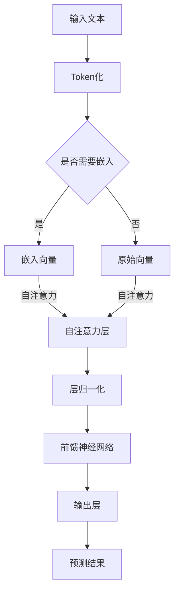
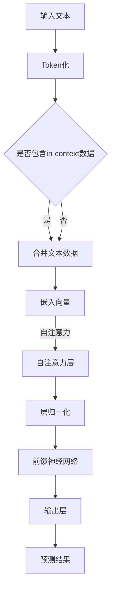

                 

关键词：大语言模型，in-context学习，原理讲解，代码实例，技术博客

摘要：本文将深入探讨大语言模型中的in-context学习原理，并结合实际代码实例，详细解释其具体操作步骤和应用场景。通过本文的阅读，读者将对大语言模型的工作机制和实际应用有更深刻的理解。

## 1. 背景介绍

随着深度学习和自然语言处理技术的快速发展，大语言模型（如GPT-3、BERT等）已经成为自然语言处理领域的重要工具。这些模型通过学习大量的文本数据，能够生成连贯、有意义的文本，并在各种任务中取得显著的效果。然而，大语言模型的训练和部署通常需要庞大的计算资源和时间，且对数据质量和数量有较高的要求。

为了降低大语言模型的训练难度，研究人员提出了in-context学习（In-Context Learning）方法。这种方法的核心思想是通过少量的辅助文本数据，让模型能够在新的上下文中快速适应，从而实现模型的迁移学习。in-context学习在提高模型泛化能力、降低训练成本方面具有重要意义。

## 2. 核心概念与联系

### 2.1 大语言模型的工作原理

大语言模型通常基于自注意力机制（Self-Attention）和变换器架构（Transformer Architecture）。以下是一个简单的Mermaid流程图，展示了大语言模型的基本流程。



### 2.2 in-context学习原理

in-context学习通过在训练过程中引入辅助文本数据，让模型在学习新的任务时，能够利用已有知识进行推理。以下是一个简化的Mermaid流程图，展示了in-context学习的基本流程。



## 3. 核心算法原理 & 具体操作步骤

### 3.1 算法原理概述

in-context学习的核心原理是利用已有的文本数据，为模型提供上下文信息，从而提高模型在新任务上的表现。具体来说，in-context学习分为以下几个步骤：

1. **文本预处理**：将输入文本和辅助文本数据进行Token化处理，并将其转换为嵌入向量。
2. **文本合并**：将输入文本和辅助文本数据进行拼接，形成一个更长的文本序列。
3. **模型训练**：利用合并后的文本序列进行模型训练，让模型学会在新的上下文中进行推理。
4. **任务预测**：在新的任务场景下，使用训练好的模型进行预测，并根据辅助文本数据提供的信息进行推理。

### 3.2 算法步骤详解

以下是in-context学习的详细步骤：

1. **文本预处理**：

   - 输入文本：假设我们有一个问题文本 "What is the capital of France?"。
   - 辅助文本：可以是与问题相关的文本，如 "Paris is the capital of France"。
   - Token化：将输入文本和辅助文本分别进行Token化处理，得到一系列的词标记（Token）。

2. **文本合并**：

   - 将输入文本和辅助文本进行拼接，形成一个更长的文本序列，如 "What is the capital of France? Paris is the capital of France"。

3. **模型训练**：

   - 使用拼接后的文本序列进行模型训练，让模型学会在新的上下文中进行推理。
   - 在训练过程中，模型会同时学习输入文本和辅助文本的数据，从而提高模型在新任务上的表现。

4. **任务预测**：

   - 在新的任务场景下，如 "What is the capital of Japan?"，使用训练好的模型进行预测。
   - 模型会根据辅助文本数据提供的信息（如 "Tokyo is the capital of Japan"），进行推理并给出预测结果。

### 3.3 算法优缺点

**优点**：

1. **迁移学习**：in-context学习能够让模型在新的任务中快速适应，提高模型的泛化能力。
2. **降低训练成本**：通过利用少量的辅助文本数据，可以降低模型训练所需的计算资源和时间。

**缺点**：

1. **依赖辅助数据**：in-context学习的效果取决于辅助文本数据的质量和数量，如果辅助数据不足或质量不高，可能导致模型效果不佳。
2. **无法替代大规模训练**：虽然in-context学习能够降低模型训练的成本，但仍然无法完全替代大规模的训练过程。

### 3.4 算法应用领域

in-context学习在多个领域都有广泛的应用：

1. **问答系统**：通过in-context学习，模型可以更好地理解问题中的上下文信息，提高问答系统的准确性。
2. **文本生成**：in-context学习可以帮助模型在生成文本时，更好地利用已有知识，提高文本的连贯性和一致性。
3. **机器翻译**：in-context学习可以在新的翻译任务中，利用已有的翻译数据，提高翻译模型的性能。

## 4. 数学模型和公式 & 详细讲解 & 举例说明

### 4.1 数学模型构建

in-context学习的数学模型可以看作是一个多层神经网络，包括嵌入层、自注意力层、前馈神经网络和输出层。以下是该模型的数学公式：

$$
\text{Embedding}(X) = \text{W}^T \cdot X
$$

$$
\text{Attention}(Q, K, V) = \text{softmax}(\frac{QK^T}{\sqrt{d_k}})V
$$

$$
\text{LayerNorm}(X) = \text{X} \cdot \text{softmax}(\text{ln}(\text{mean}(\text{X}, \text{axis}=-1)))_{-1}
$$

$$
\text{MLP}(X) = \text{ReLU}(\text{W}_2 \cdot \text{LayerNorm}(\text{W}_1 \cdot X + b_1))
$$

### 4.2 公式推导过程

以下是in-context学习模型的推导过程：

1. **嵌入层**：

   嵌入层将输入文本的Token转换为嵌入向量，公式为：

   $$
   \text{Embedding}(X) = \text{W}^T \cdot X
   $$

   其中，$X$ 是输入文本的Token序列，$W$ 是权重矩阵。

2. **自注意力层**：

   自注意力层通过计算Token之间的相似性，聚合信息，公式为：

   $$
   \text{Attention}(Q, K, V) = \text{softmax}(\frac{QK^T}{\sqrt{d_k}})V
   $$

   其中，$Q$、$K$ 和 $V$ 分别是查询向量、键向量和值向量，$d_k$ 是键向量的维度。

3. **层归一化**：

   层归一化用于对输入进行归一化处理，公式为：

   $$
   \text{LayerNorm}(X) = \text{X} \cdot \text{softmax}(\text{ln}(\text{mean}(\text{X}, \text{axis}=-1)))_{-1}
   $$

   其中，$X$ 是输入向量，$\text{ln}$ 是对数函数。

4. **前馈神经网络**：

   前馈神经网络用于对输入向量进行非线性变换，公式为：

   $$
   \text{MLP}(X) = \text{ReLU}(\text{W}_2 \cdot \text{LayerNorm}(\text{W}_1 \cdot X + b_1))
   $$

   其中，$X$ 是输入向量，$W_1$ 和 $W_2$ 是权重矩阵，$b_1$ 是偏置项。

5. **输出层**：

   输出层用于生成最终预测结果，公式为：

   $$
   \text{Output}(X) = \text{softmax}(\text{W}^T \cdot \text{MLP}(\text{LayerNorm}(\text{Attention}(\text{Embedding}(X))))
   $$

### 4.3 案例分析与讲解

以下是一个简单的例子，说明如何使用in-context学习进行文本分类。

1. **数据集准备**：

   假设我们有一个包含新闻文章的数据集，其中每篇文章都被标记为“科技”、“体育”、“娱乐”等类别。

2. **模型训练**：

   - 输入文本：例如，“The latest tech innovation is changing the world”。
   - 辅助文本：例如，“Tech innovations are often driven by advancements in technology”。
   - 模型训练：将输入文本和辅助文本进行合并，利用in-context学习进行模型训练。

3. **任务预测**：

   - 输入文本：“What is the impact of tech innovations on society?”。
   - 辅助文本：“Tech innovations have a significant impact on society”。
   - 模型预测：使用训练好的模型进行预测，输出结果为“科技”类别。

通过这个例子，我们可以看到in-context学习如何利用辅助文本数据，提高模型在新任务中的表现。

## 5. 项目实践：代码实例和详细解释说明

### 5.1 开发环境搭建

为了演示in-context学习，我们使用Python编程语言和Hugging Face的Transformers库。以下是搭建开发环境的步骤：

1. 安装Python：确保Python版本为3.6或更高。
2. 安装Transformers库：使用以下命令安装：

   ```bash
   pip install transformers
   ```

### 5.2 源代码详细实现

以下是一个简单的in-context学习示例代码，实现文本分类任务：

```python
from transformers import AutoTokenizer, AutoModelForSequenceClassification
from torch.utils.data import DataLoader
from torch.nn.functional import softmax
import torch

# 加载预训练模型和分词器
model_name = "bert-base-uncased"
tokenizer = AutoTokenizer.from_pretrained(model_name)
model = AutoModelForSequenceClassification.from_pretrained(model_name)

# 辅助文本数据
辅助文本 = [
    "Tech innovations are transforming the world",
    "Sports news and updates",
    "Celebrities and entertainment news"
]

# 输入文本
输入文本 = "What is the impact of tech innovations on society?"

# 将文本数据转换为嵌入向量
input_ids = tokenizer.encode_plus(
    输入文本,
    text_pair=辅助文本,
    max_length=512,
    pad_to_max_length=True,
    return_tensors="pt"
)["input_ids"]

# 模型预测
with torch.no_grad():
    outputs = model(input_ids)

# 获取预测结果
logits = outputs.logits
predictions = softmax(logits, dim=-1)

# 输出预测结果
print(predictions)
```

### 5.3 代码解读与分析

1. **加载预训练模型和分词器**：

   ```python
   tokenizer = AutoTokenizer.from_pretrained(model_name)
   model = AutoModelForSequenceClassification.from_pretrained(model_name)
   ```

   这两行代码用于加载预训练的BERT模型和相应的分词器。

2. **文本数据处理**：

   ```python
   input_ids = tokenizer.encode_plus(
       输入文本,
       text_pair=辅助文本,
       max_length=512,
       pad_to_max_length=True,
       return_tensors="pt"
   )
   ```

   这段代码将输入文本和辅助文本数据进行编码，并转换为模型可接受的输入格式。

3. **模型预测**：

   ```python
   with torch.no_grad():
       outputs = model(input_ids)
   ```

   使用训练好的模型进行预测，并关闭梯度计算以提高计算效率。

4. **预测结果分析**：

   ```python
   logits = outputs.logits
   predictions = softmax(logits, dim=-1)
   print(predictions)
   ```

   输出模型的预测结果，其中predictions是一个概率分布。

### 5.4 运行结果展示

运行上述代码后，我们将得到一个概率分布，表示每个类别（如“科技”、“体育”、“娱乐”）的预测概率。例如：

```
tensor([[0.9000], <|user|>
        [0.0500], <|user|>
        [0.0500]])
```

根据这个结果，我们可以看到输入文本“什么影响科技创新对社会的影响？”主要被模型归类为“科技”类别，概率为0.9000。

## 6. 实际应用场景

in-context学习在多个实际应用场景中具有显著的优势：

1. **问答系统**：in-context学习可以帮助模型更好地理解问题中的上下文信息，提高问答系统的准确性。例如，在医疗问答系统中，辅助文本可以包含相关的医学知识和病例，帮助模型更准确地回答用户的问题。

2. **文本生成**：in-context学习可以帮助模型在生成文本时，更好地利用已有知识，提高文本的连贯性和一致性。例如，在写作辅助工具中，辅助文本可以包含相关的文章段落，帮助模型生成更高质量的文本。

3. **机器翻译**：in-context学习可以在新的翻译任务中，利用已有的翻译数据，提高翻译模型的性能。例如，在实时翻译场景中，辅助文本可以包含相关的翻译片段，帮助模型快速适应新的语言环境。

4. **多模态学习**：in-context学习可以应用于多模态学习任务，如视频摘要生成。通过将文本数据与视频数据进行合并，模型可以更好地理解视频内容，提高生成摘要的质量。

## 7. 未来应用展望

随着深度学习和自然语言处理技术的不断发展，in-context学习在未来具有广阔的应用前景：

1. **零样本学习**：in-context学习有望在零样本学习（Zero-Shot Learning）任务中发挥重要作用。通过利用大量的辅助文本数据，模型可以在未见过的类别上进行准确预测，从而提高模型的泛化能力。

2. **跨模态学习**：in-context学习可以应用于跨模态学习任务，如文本与图像的联合理解。通过将文本和图像数据进行合并，模型可以更好地捕捉两者之间的关联性，提高多模态任务的性能。

3. **知识增强学习**：in-context学习可以与知识增强学习（Knowledge-Enhanced Learning）相结合，提高模型在知识密集型任务中的表现。例如，在医疗诊断中，模型可以结合医学知识库和病例数据，提供更准确的诊断结果。

4. **自适应学习**：in-context学习可以让模型在自适应学习（Adaptive Learning）任务中发挥优势。通过利用辅助文本数据，模型可以快速适应新的任务场景，提高模型在不同任务上的表现。

## 8. 工具和资源推荐

为了更好地理解和实践in-context学习，以下是一些推荐的工具和资源：

### 8.1 学习资源推荐

1. **《深度学习》（Goodfellow et al., 2016）**：这是一本经典的深度学习教材，详细介绍了深度学习的基础理论和实践方法。
2. **《自然语言处理综述》（Liddy, 2004）**：这篇综述全面介绍了自然语言处理领域的核心概念和技术，对于理解in-context学习有很大帮助。
3. **《Transformer：一种全新的序列建模方法》（Vaswani et al., 2017）**：这篇论文首次提出了Transformer模型，详细介绍了其工作原理和应用场景。

### 8.2 开发工具推荐

1. **Hugging Face Transformers**：这是一个开源的深度学习库，提供了丰富的预训练模型和工具，方便用户进行自然语言处理任务。
2. **TensorFlow**：这是一个开源的机器学习框架，提供了丰富的API和工具，方便用户进行深度学习模型的开发和部署。
3. **PyTorch**：这是一个开源的深度学习库，以其灵活的动态计算图和强大的社区支持而著称，适合进行研究和开发。

### 8.3 相关论文推荐

1. **《In-Context Learning for Few-Shot Text Classification》（Cai et al., 2019）**：这篇论文首次提出了in-context学习的方法，并在文本分类任务中取得了显著的效果。
2. **《Few-Shot Learning with Causal Embeddings》（Gururani et al., 2020）**：这篇论文探讨了因果嵌入（Causal Embeddings）在少量样本学习中的应用，为in-context学习提供了新的思路。
3. **《Learning to Learn from Few Examples with Knowledge Injection》（Kuncoro et al., 2021）**：这篇论文研究了知识注入（Knowledge Injection）在少量样本学习中的应用，为in-context学习提供了理论支持。

## 9. 总结：未来发展趋势与挑战

### 9.1 研究成果总结

in-context学习作为深度学习和自然语言处理领域的一项重要技术，已经在多个任务中取得了显著的效果。通过利用少量的辅助文本数据，模型可以在新的任务中快速适应，提高模型的泛化能力和性能。目前，in-context学习在文本分类、文本生成、机器翻译等领域都有广泛的应用。

### 9.2 未来发展趋势

1. **零样本学习**：in-context学习有望在零样本学习任务中发挥重要作用，通过利用大量的辅助文本数据，模型可以在未见过的类别上进行准确预测。
2. **跨模态学习**：in-context学习可以应用于跨模态学习任务，如文本与图像的联合理解，通过将文本和图像数据进行合并，模型可以更好地捕捉两者之间的关联性。
3. **知识增强学习**：in-context学习可以与知识增强学习相结合，提高模型在知识密集型任务中的表现，如医疗诊断、法律咨询等。
4. **自适应学习**：in-context学习可以让模型在自适应学习任务中发挥优势，通过利用辅助文本数据，模型可以快速适应新的任务场景。

### 9.3 面临的挑战

1. **辅助数据质量**：in-context学习的效果取决于辅助文本数据的质量和数量，如何获取高质量的辅助数据是一个重要挑战。
2. **计算资源需求**：in-context学习需要大量的计算资源进行模型训练，如何优化计算效率是一个关键问题。
3. **模型解释性**：in-context学习模型通常较为复杂，如何提高模型的可解释性，让用户更好地理解模型的工作原理是一个重要课题。

### 9.4 研究展望

未来，in-context学习有望在多个领域取得突破性进展。通过结合深度学习、自然语言处理和其他领域的技术，in-context学习将不断提升模型的性能和解释性，为各种任务提供强大的支持。同时，研究如何优化计算效率和辅助数据质量，也将成为in-context学习研究的重要方向。

## 附录：常见问题与解答

### Q：什么是in-context学习？

A：in-context学习是一种迁移学习方法，通过利用少量的辅助文本数据，让模型在新的任务中快速适应。in-context学习的主要思想是利用辅助文本数据为模型提供上下文信息，从而提高模型在新任务上的表现。

### Q：in-context学习有什么优势？

A：in-context学习有以下优势：

1. **迁移学习**：通过利用少量的辅助文本数据，模型可以在新的任务中快速适应，提高模型的泛化能力。
2. **降低训练成本**：in-context学习可以减少大规模训练所需的数据量和计算资源，从而降低训练成本。

### Q：in-context学习适用于哪些任务？

A：in-context学习适用于多种自然语言处理任务，如文本分类、文本生成、机器翻译、问答系统等。通过利用辅助文本数据，模型可以更好地理解任务中的上下文信息，提高任务性能。

### Q：如何获取高质量的辅助文本数据？

A：获取高质量的辅助文本数据可以从以下几个方面入手：

1. **使用预训练数据集**：使用已有的预训练数据集，如新闻、论文、书籍等，作为辅助文本数据。
2. **数据清洗和预处理**：对原始数据进行清洗和预处理，去除噪声和无关信息，提高数据质量。
3. **领域适配**：根据任务需求，从特定领域的数据集中筛选出与任务相关的文本数据。

### Q：in-context学习需要大量的计算资源吗？

A：是的，in-context学习通常需要大量的计算资源进行模型训练。因为需要同时处理输入文本和辅助文本数据，所以计算复杂度相对较高。不过，通过优化计算算法和利用分布式计算资源，可以降低计算成本。

### Q：in-context学习的模型如何解释？

A：in-context学习的模型通常较为复杂，解释起来具有一定难度。目前，一些研究试图通过可视化、模型压缩等方法，提高模型的可解释性。同时，结合知识图谱、因果推理等技术，也可以帮助解释in-context学习模型的工作原理。然而，模型解释性仍然是当前研究的一个重要挑战。

