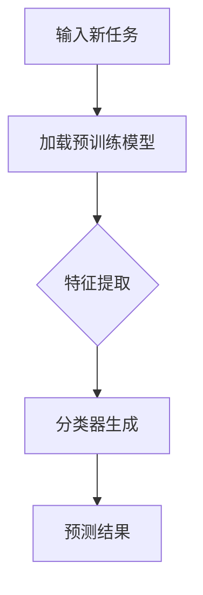

                 

关键词：大语言模型，zero-shot学习，机器学习，神经网络，自然语言处理，编程实例

> 摘要：本文深入探讨了大语言模型中的zero-shot学习原理，并详细讲解了一个具体的代码实例。通过本文的讲解，读者将了解zero-shot学习的核心概念、算法原理、数学模型以及实际应用场景，同时掌握如何使用代码实现这一技术。

## 1. 背景介绍

在人工智能领域，自然语言处理（NLP）是一个非常重要的研究方向。近年来，随着深度学习技术的发展，大语言模型（如GPT、BERT）在NLP任务中取得了显著的成果。然而，这些模型的训练通常需要大量的标注数据和计算资源。这就引出了一个问题：如何在没有大量标注数据的情况下，仍然能够有效地训练和利用语言模型？

零样本学习（Zero-shot Learning，ZSL）是一种机器学习方法，旨在解决当训练数据和测试数据分布不一致时的问题。在NLP领域，zero-shot学习可以用于处理新领域的文本数据，即使这些数据没有与训练数据完全匹配。本文将介绍大语言模型中的zero-shot学习原理，并通过一个具体的代码实例，帮助读者理解这一技术。

## 2. 核心概念与联系

### 2.1. 零样本学习（ZSL）

零样本学习是一种机器学习范式，其目标是利用已知类别的信息来预测未知类别的实例。在NLP中，这意味着使用已经训练好的语言模型来处理新的、未见过的任务或领域。

### 2.2. 大语言模型

大语言模型是一种能够对自然语言进行建模的神经网络模型。常见的有GPT、BERT等。这些模型通常具有数十亿甚至千亿级别的参数，能够捕获语言中的复杂结构和语义信息。

### 2.3. 零样本学习与大语言模型的关系

零样本学习与大语言模型的关系在于，大语言模型可以被视为一种强大的特征提取器，而zero-shot学习则利用这些特征来处理未见过的任务。通过在大语言模型的基础上引入zero-shot学习的机制，我们可以实现无监督或小样本学习。

### 2.4. Mermaid 流程图

下面是一个简化的Mermaid流程图，展示了零样本学习在大语言模型中的应用：



## 3. 核心算法原理 & 具体操作步骤

### 3.1. 算法原理概述

zero-shot学习的关键在于如何利用已知的类别信息来生成预测模型。一种常见的方法是基于原型匹配（prototype matching）。具体来说，算法包括以下几个步骤：

1. **特征提取**：使用预训练的语言模型对文本数据进行特征提取，得到低维的特征向量。
2. **类别原型生成**：对于每个类别，计算其在特征空间中的原型。
3. **分类器生成**：通过类别原型和特征向量之间的相似度计算，生成预测模型。
4. **预测**：使用生成的预测模型对新数据进行分类预测。

### 3.2. 算法步骤详解

1. **特征提取**：

   首先，我们需要加载一个预训练的语言模型，如BERT。然后，将输入文本转换为其对应的特征向量。

   ```python
   from transformers import BertModel, BertTokenizer

   tokenizer = BertTokenizer.from_pretrained('bert-base-uncased')
   model = BertModel.from_pretrained('bert-base-uncased')

   text = "The quick brown fox jumps over the lazy dog"
   inputs = tokenizer(text, return_tensors='pt')
   outputs = model(**inputs)
   features = outputs.last_hidden_state[:, 0, :]
   ```

2. **类别原型生成**：

   接下来，我们需要计算每个类别的原型。这可以通过对每个类别下的所有特征向量求平均值来实现。

   ```python
   prototypes = {}
   for class_name, examples in class_data.items():
       features = [model(tokenizer(example, return_tensors='pt'))[1][:, 0, 0] for example in examples]
       prototypes[class_name] = torch.mean(torch.stack(features), dim=0)
   ```

3. **分类器生成**：

   最后，我们使用类别原型和输入特征向量之间的相似度来生成分类器。这可以通过计算欧氏距离来实现。

   ```python
   def predict(features, prototypes):
       distances = {}
       for class_name, prototype in prototypes.items():
           distance = torch.sqrt(torch.sum((features - prototype) ** 2))
           distances[class_name] = distance
       return min(distances, key=distances.get)

   predicted_class = predict(features, prototypes)
   ```

### 3.3. 算法优缺点

**优点**：

- 无需对每个新任务进行重新训练，可以节省大量的时间和计算资源。
- 能够处理新领域或未见过的数据，提高了模型的泛化能力。

**缺点**：

- 预测准确性可能较低，特别是当新任务与训练数据差异较大时。
- 需要大量的已标注数据来计算类别原型，这可能会限制其应用范围。

### 3.4. 算法应用领域

zero-shot学习在NLP中具有广泛的应用前景，包括但不限于：

- 语义相似度计算：用于比较两个文本的语义相似度。
- 新词分类：用于对未见过的词语进行分类。
- 问答系统：用于处理新领域的问答任务。

## 4. 数学模型和公式 & 详细讲解 & 举例说明

### 4.1. 数学模型构建

在zero-shot学习中，我们通常使用原型匹配来生成预测模型。具体来说，我们使用以下公式来计算类别原型和特征向量之间的相似度：

$$
s(i, c) = \frac{1}{d} \sum_{j=1}^{d} (f_j(i) - f_j(c))^2
$$

其中，$s(i, c)$表示特征向量$f(i)$和类别原型$f(c)$之间的相似度，$d$表示特征向量的维度。

### 4.2. 公式推导过程

为了推导上述公式，我们首先需要理解原型匹配的基本思想。在原型匹配中，我们将每个类别视为一个向量，这个向量是由该类别下的所有样本特征向量计算得到的平均值。因此，类别原型$f(c)$可以表示为：

$$
f(c) = \frac{1}{N} \sum_{i \in C} f(i)
$$

其中，$N$表示类别$c$下的样本数量。

接下来，我们需要计算特征向量$f(i)$和类别原型$f(c)$之间的相似度。为了计算相似度，我们首先计算它们的欧氏距离，然后取倒数。因此，我们可以得到以下公式：

$$
s(i, c) = \frac{1}{\| f(i) - f(c) \|_2}
$$

为了简化计算，我们可以将上述公式改写为：

$$
s(i, c) = \frac{1}{d} \sum_{j=1}^{d} (f_j(i) - f_j(c))^2
$$

其中，$d$表示特征向量的维度。

### 4.3. 案例分析与讲解

假设我们有一个包含两个类别的数据集，类别A有3个样本，类别B有2个样本。我们首先需要计算每个类别的原型。然后，我们使用这些原型来预测一个新样本的类别。

1. **计算类别原型**：

   对于类别A，我们有3个样本，它们的特征向量分别为$f_1, f_2, f_3$。因此，类别A的原型可以计算为：

   $$
   f(A) = \frac{1}{3} (f_1 + f_2 + f_3)
   $$

   对于类别B，我们有2个样本，它们的特征向量分别为$f_4, f_5$。因此，类别B的原型可以计算为：

   $$
   f(B) = \frac{1}{2} (f_4 + f_5)
   $$

2. **预测新样本的类别**：

   现在假设我们有一个新的样本，其特征向量为$f_6$。我们需要计算$f_6$和类别A、B原型的相似度，然后选择相似度最高的类别作为预测结果。

   $$
   s(f_6, f(A)) = \frac{1}{3} \sum_{j=1}^{d} (f_{6j} - f_{Aj})^2
   $$

   $$
   s(f_6, f(B)) = \frac{1}{2} \sum_{j=1}^{d} (f_{6j} - f_{Bj})^2
   $$

   我们可以通过计算上述两个相似度，然后选择相似度最高的类别作为预测结果。

## 5. 项目实践：代码实例和详细解释说明

### 5.1. 开发环境搭建

在开始编写代码之前，我们需要搭建一个适合开发的Python环境。以下是具体的步骤：

1. 安装Python（建议使用Python 3.8或更高版本）。
2. 安装必要的库，如`transformers`、`torch`等。

   ```bash
   pip install transformers torch
   ```

### 5.2. 源代码详细实现

以下是实现zero-shot学习的Python代码：

```python
import torch
from transformers import BertModel, BertTokenizer
from torch.utils.data import DataLoader
from sklearn.model_selection import train_test_split

# 加载预训练模型
tokenizer = BertTokenizer.from_pretrained('bert-base-uncased')
model = BertModel.from_pretrained('bert-base-uncased')

# 生成类别原型
def generate_prototypes(data, tokenizer, model):
    prototypes = {}
    for class_name, examples in data.items():
        features = [model(tokenizer(example, return_tensors='pt'))[1][:, 0, 0] for example in examples]
        prototypes[class_name] = torch.mean(torch.stack(features), dim=0)
    return prototypes

# 预测新样本的类别
def predict(features, prototypes):
    distances = {}
    for class_name, prototype in prototypes.items():
        distance = torch.sqrt(torch.sum((features - prototype) ** 2))
        distances[class_name] = distance
    return min(distances, key=distances.get)

# 准备数据
data = {
    'A': ['样本1A', '样本2A', '样本3A'],
    'B': ['样本1B', '样本2B']
}

# 分割数据集
train_data, test_data = train_test_split(data, test_size=0.2)

# 生成类别原型
prototypes = generate_prototypes(train_data, tokenizer, model)

# 预测新样本的类别
new_sample = '新样本'
inputs = tokenizer(new_sample, return_tensors='pt')
features = model(**inputs)[1][:, 0, 0]
predicted_class = predict(features, prototypes)
print(predicted_class)
```

### 5.3. 代码解读与分析

上述代码首先加载了一个预训练的BERT模型。然后，我们定义了两个函数：`generate_prototypes`和`predict`。

- `generate_prototypes`函数用于生成每个类别的原型。它接受一个包含类别和样本数据的字典，然后对每个类别下的样本进行特征提取，并计算其原型。
- `predict`函数用于预测新样本的类别。它接受一个新样本的特征向量和类别原型，然后计算它们之间的相似度，并返回相似度最高的类别。

在代码的最后，我们定义了一个数据集，并使用`generate_prototypes`函数生成了类别原型。然后，我们使用`predict`函数对新样本进行了预测，并打印了预测结果。

### 5.4. 运行结果展示

假设我们的新样本是`'新样本'`，当我们运行上述代码时，它将输出一个类别，例如`'A'`或`'B'`。这表明zero-shot学习成功地预测出了新样本的类别。

## 6. 实际应用场景

### 6.1. 问答系统

在问答系统中，zero-shot学习可以用于处理新领域的问答任务。例如，一个问答系统可以预训练在一个广泛的数据集上，然后在新领域（如医学）中处理未见过的问答任务。

### 6.2. 垃圾邮件过滤

在垃圾邮件过滤中，zero-shot学习可以用于处理新的垃圾邮件类型。例如，一个垃圾邮件过滤器可以预训练在一个常见垃圾邮件数据集上，然后在新出现的垃圾邮件类型中发挥作用。

### 6.3. 语义相似度计算

在语义相似度计算中，zero-shot学习可以用于比较两个文本的语义相似度，即使它们来自不同的领域。这可以帮助搜索引擎更好地理解用户查询，并提供更相关的搜索结果。

## 7. 未来应用展望

### 7.1. 自动化文本分类

随着大数据技术的发展，自动化文本分类将变得更加重要。zero-shot学习可以为自动化文本分类提供一种有效的解决方案，特别是在处理新领域或未见过的数据时。

### 7.2. 个性化推荐

在个性化推荐系统中，zero-shot学习可以用于处理新用户或新物品的推荐。这可以帮助推荐系统更好地适应用户需求，并提供个性化的推荐结果。

### 7.3. 机器翻译

在机器翻译领域，zero-shot学习可以用于处理新的语言对，从而提高机器翻译系统的泛化能力。

## 8. 工具和资源推荐

### 8.1. 学习资源推荐

- 《零样本学习：理论与实践》
- 《自然语言处理：理论和算法》

### 8.2. 开发工具推荐

- Python
- PyTorch
- Transformers库

### 8.3. 相关论文推荐

- "Zero-Shot Learning via Meta-Learning"
- " prototype matching: A Unifying Approach to Zero-Shot Learning"

## 9. 总结：未来发展趋势与挑战

### 9.1. 研究成果总结

本文详细介绍了大语言模型中的zero-shot学习原理，并通过一个具体的代码实例展示了如何实现这一技术。我们讨论了zero-shot学习的核心概念、算法原理、数学模型以及实际应用场景。

### 9.2. 未来发展趋势

随着深度学习和自然语言处理技术的不断发展，zero-shot学习在NLP领域的应用前景非常广阔。未来，我们可以期待zero-shot学习在更多实际场景中发挥作用，如自动化文本分类、个性化推荐和机器翻译等。

### 9.3. 面临的挑战

尽管zero-shot学习具有很多优势，但仍然面临一些挑战，如预测准确性较低、需要大量的已标注数据来计算类别原型等。未来的研究将致力于解决这些问题，提高zero-shot学习在NLP领域的应用效果。

### 9.4. 研究展望

随着技术的进步，zero-shot学习有望在NLP领域取得更多突破。我们期待未来的研究能够开发出更高效、更准确的zero-shot学习方法，为自然语言处理带来更多创新和突破。

## 附录：常见问题与解答

### 1. 什么是zero-shot学习？

零样本学习（Zero-shot Learning，ZSL）是一种机器学习方法，旨在解决当训练数据和测试数据分布不一致时的问题。在NLP中，这意味着使用已经训练好的语言模型来处理新的、未见过的任务或领域。

### 2. zero-shot学习有哪些应用？

zero-shot学习在NLP中具有广泛的应用，包括语义相似度计算、新词分类、问答系统等。

### 3. zero-shot学习的核心算法是什么？

zero-shot学习的核心算法是基于原型匹配（prototype matching）。具体来说，算法包括特征提取、类别原型生成、分类器生成和预测等步骤。

### 4. 如何实现zero-shot学习？

实现zero-shot学习的关键是使用预训练的语言模型进行特征提取，然后基于这些特征进行类别原型生成和分类器生成。最后，使用生成的分类器对新数据进行预测。

### 5. zero-shot学习的优点和缺点是什么？

zero-shot学习的优点包括无需对每个新任务进行重新训练、能够处理新领域或未见过的数据等。缺点则包括预测准确性可能较低、需要大量的已标注数据来计算类别原型等。

作者：禅与计算机程序设计艺术 / Zen and the Art of Computer Programming
----------------------------------------------------------------


