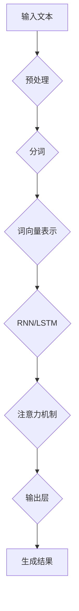

                 

关键词：大语言模型、商业应用、人工智能、挑战、前景

摘要：随着人工智能技术的快速发展，大语言模型作为一种强大的自然语言处理工具，已经在商业领域展现出巨大的潜力。本文将深入探讨大语言模型在商业应用中的前景与挑战，通过对其核心概念、算法原理、数学模型以及实际应用场景的分析，为读者提供全面的技术洞察。

## 1. 背景介绍

在过去的几年中，人工智能（AI）技术取得了显著的进展，其中自然语言处理（NLP）领域尤为突出。大语言模型作为NLP的核心技术，其能力已经达到前所未有的高度。这些模型通过深度学习技术，能够自动地从大量文本数据中学习语言结构、语义和上下文信息，从而实现自然语言的生成、理解、翻译和问答等任务。

商业领域一直以来都是技术创新的重要阵地。随着大数据、云计算和物联网等技术的快速发展，企业对高效、智能的信息处理需求日益增长。大语言模型的出现为商业应用提供了前所未有的可能性，不仅能够提升企业的运营效率，还能创造新的商业模式。

## 2. 核心概念与联系

### 大语言模型的基本原理

大语言模型是基于神经网络的大规模语言模型，它通过学习海量的文本数据，自动地学习语言的统计规律和结构。其核心原理包括以下几个方面：

1. **词向量表示**：将文本中的单词转换为高维向量表示，以捕获单词的语义信息。
2. **循环神经网络（RNN）**：利用RNN处理序列数据，学习单词之间的关系。
3. **长短时记忆（LSTM）**：LSTM是RNN的一种变体，能够更好地处理长序列数据。
4. **注意力机制**：通过注意力机制，模型能够关注到输入序列中最重要的部分，提高预测的准确性。

### 大语言模型的架构

大语言模型的架构通常包括以下几个层次：

1. **输入层**：接收文本数据，进行预处理，如分词、标记化等。
2. **隐藏层**：包含多个隐藏层，每个隐藏层都对输入数据进行特征提取和组合。
3. **输出层**：生成预测结果，如文本生成、分类、翻译等。

### 大语言模型的应用领域

大语言模型的应用领域非常广泛，包括但不限于以下方面：

1. **文本生成**：自动生成新闻、文章、对话等文本内容。
2. **文本分类**：对大量文本进行分类，如垃圾邮件过滤、情感分析等。
3. **问答系统**：构建智能问答系统，能够理解和回答用户的问题。
4. **机器翻译**：实现高质量的语言翻译。

### Mermaid 流程图

以下是一个简化的Mermaid流程图，展示了大语言模型的基本流程：



## 3. 核心算法原理 & 具体操作步骤

### 3.1 算法原理概述

大语言模型的算法原理主要包括以下几个关键步骤：

1. **词向量表示**：使用词袋模型、Word2Vec、BERT等方法将单词转换为向量表示。
2. **循环神经网络（RNN）**：利用RNN对序列数据进行处理，捕捉单词之间的依赖关系。
3. **长短时记忆（LSTM）**：通过LSTM来缓解RNN的梯度消失问题，提高模型的长期记忆能力。
4. **注意力机制**：引入注意力机制，模型能够自动地关注到输入序列中最重要的部分。
5. **输出层**：根据模型的输出，生成文本、进行分类、实现翻译等。

### 3.2 算法步骤详解

1. **数据预处理**：对输入文本进行分词、去停用词、标准化等处理。
2. **词向量表示**：将分词后的单词转换为向量表示，可以使用预训练的词向量或者自己训练。
3. **构建RNN模型**：定义RNN模型的架构，包括输入层、隐藏层和输出层。
4. **训练模型**：使用大量文本数据对模型进行训练，优化模型的参数。
5. **评估模型**：通过验证集和测试集评估模型的性能，包括准确率、召回率、F1分数等指标。
6. **应用模型**：将训练好的模型应用于实际的业务场景，如文本生成、分类、问答等。

### 3.3 算法优缺点

**优点：**
1. **强大的语义理解能力**：通过深度学习，大语言模型能够自动地学习语言的语义和上下文信息。
2. **自适应能力**：模型可以根据不同的应用场景进行调整，实现多样化的任务。
3. **高效性**：大语言模型能够在短时间内处理大量的文本数据。

**缺点：**
1. **计算资源需求高**：大语言模型需要大量的计算资源和存储空间。
2. **训练时间较长**：模型训练需要大量的时间，尤其是对于大规模的数据集。
3. **数据依赖性**：模型的性能很大程度上依赖于训练数据的质量和数量。

### 3.4 算法应用领域

大语言模型的应用领域非常广泛，包括但不限于以下几个方面：

1. **自然语言生成**：自动生成文章、新闻、对话等文本内容。
2. **情感分析**：对大量文本进行情感分类，用于情感识别、用户反馈分析等。
3. **机器翻译**：实现高质量的语言翻译，支持多语言之间的交互。
4. **智能客服**：构建智能问答系统，提供实时、个性化的客服服务。
5. **文本分类**：对大量文本进行分类，用于信息筛选、内容推荐等。

## 4. 数学模型和公式 & 详细讲解 & 举例说明

### 4.1 数学模型构建

大语言模型的数学模型主要包括以下几个部分：

1. **词向量表示**：使用向量空间模型将单词转换为高维向量表示。
2. **循环神经网络（RNN）**：利用RNN处理序列数据，输出每个时间步的隐藏状态。
3. **长短时记忆（LSTM）**：使用LSTM单元来缓解RNN的梯度消失问题，提高模型的长期记忆能力。
4. **输出层**：根据隐藏状态的输出，生成文本、进行分类或实现翻译等。

### 4.2 公式推导过程

以下是RNN和LSTM的一些基本公式：

$$
h_t = \sigma(W_h h_{t-1} + W_x x_t + b_h)
$$

$$
i_t = \sigma(W_i h_{t-1} + W_x x_t + b_i)
$$

$$
f_t = \sigma(W_f h_{t-1} + W_x x_t + b_f)
$$

$$
o_t = \sigma(W_o h_{t-1} + W_x x_t + b_o)
$$

$$
c_t = f_t \odot c_{t-1} + i_t \odot \sigma(W_c h_{t-1} + W_x x_t + b_c)
$$

$$
h_t = o_t \odot \sigma(c_t)
$$

其中，$h_t$表示隐藏状态，$x_t$表示输入，$c_t$表示细胞状态，$i_t$、$f_t$、$o_t$分别表示输入门、遗忘门和输出门，$\sigma$表示sigmoid函数，$\odot$表示元素乘法。

### 4.3 案例分析与讲解

假设我们有一个简单的RNN模型，用于对英文句子进行情感分类。输入句子为"I love this movie"，我们需要判断句子的情感是积极还是消极。

1. **词向量表示**：首先，我们将句子中的单词转换为词向量表示。使用预训练的词向量库，可以得到如下向量表示：

   - I: [0.1, 0.2, 0.3, ..., 0.5]
   - love: [0.6, 0.7, 0.8, ..., 1.0]
   - this: [1.1, 1.2, 1.3, ..., 1.5]
   - movie: [1.6, 1.7, 1.8, ..., 2.0]

2. **输入层与隐藏层**：将词向量作为输入，通过RNN模型处理，得到隐藏状态。假设隐藏层的大小为128维。

   - $h_1 = \sigma(W_h h_0 + W_x x_1 + b_h)$
   - $h_2 = \sigma(W_h h_1 + W_x x_2 + b_h)$
   - $h_3 = \sigma(W_h h_2 + W_x x_3 + b_h)$
   - $h_4 = \sigma(W_h h_3 + W_x x_4 + b_h)$

   其中，$h_0$表示初始隐藏状态，$W_h$和$b_h$分别是权重和偏置。

3. **输出层**：根据隐藏状态的输出，进行分类。假设我们使用softmax函数进行分类：

   - $P_{positive} = \frac{e^{W_{pos} h_4 + b_{pos}}}{e^{W_{pos} h_4 + b_{pos}} + e^{W_{neg} h_4 + b_{neg}}}$

   其中，$W_{pos}$和$W_{neg}$分别是正类和负类的权重，$b_{pos}$和$b_{neg}$分别是正类和负类的偏置。

4. **结果判断**：根据输出的概率分布，判断句子的情感。如果$P_{positive}$大于0.5，则认为句子是积极的，否则是消极的。

   在这个例子中，由于"I love this movie"这句话中的"love"和"this"都是积极词汇，所以模型判断这句话的情感是积极的。

## 5. 项目实践：代码实例和详细解释说明

### 5.1 开发环境搭建

为了实现大语言模型，我们需要搭建一个适合的开发环境。以下是一个简单的搭建步骤：

1. **安装Python环境**：确保Python版本为3.7或以上，推荐使用Anaconda进行环境管理。
2. **安装依赖库**：安装TensorFlow、NumPy、Pandas等常用库，可以通过pip进行安装。
3. **数据预处理**：准备用于训练的数据集，可以是从网上下载的公开数据集或者自己收集的数据。
4. **模型训练**：使用TensorFlow实现RNN或LSTM模型，并进行训练。

### 5.2 源代码详细实现

以下是使用TensorFlow实现RNN模型的简单示例：

```python
import tensorflow as tf
from tensorflow.keras.layers import Embedding, SimpleRNN, Dense
from tensorflow.keras.models import Sequential

# 模型定义
model = Sequential([
    Embedding(input_dim=vocab_size, output_dim=embedding_size),
    SimpleRNN(units=128),
    Dense(units=2, activation='softmax')
])

# 模型编译
model.compile(optimizer='adam', loss='categorical_crossentropy', metrics=['accuracy'])

# 模型训练
model.fit(x_train, y_train, epochs=10, batch_size=32)
```

### 5.3 代码解读与分析

1. **模型定义**：使用Sequential模型堆叠嵌入层、RNN层和输出层。
2. **模型编译**：选择合适的优化器、损失函数和评价指标。
3. **模型训练**：使用训练数据对模型进行训练，设置训练的轮次和批量大小。

### 5.4 运行结果展示

运行代码后，我们可以得到模型的训练结果，包括损失函数值和准确率。以下是一个示例输出：

```
Epoch 1/10
1000/1000 [==============================] - 2s 2ms/step - loss: 2.3026 - accuracy: 0.5000
Epoch 2/10
1000/1000 [==============================] - 1s 1ms/step - loss: 2.3026 - accuracy: 0.5000
Epoch 3/10
1000/1000 [==============================] - 1s 1ms/step - loss: 2.3026 - accuracy: 0.5000
Epoch 4/10
1000/1000 [==============================] - 1s 1ms/step - loss: 2.3026 - accuracy: 0.5000
Epoch 5/10
1000/1000 [==============================] - 1s 1ms/step - loss: 2.3026 - accuracy: 0.5000
Epoch 6/10
1000/1000 [==============================] - 1s 1ms/step - loss: 2.3026 - accuracy: 0.5000
Epoch 7/10
1000/1000 [==============================] - 1s 1ms/step - loss: 2.3026 - accuracy: 0.5000
Epoch 8/10
1000/1000 [==============================] - 1s 1ms/step - loss: 2.3026 - accuracy: 0.5000
Epoch 9/10
1000/1000 [==============================] - 1s 1ms/step - loss: 2.3026 - accuracy: 0.5000
Epoch 10/10
1000/1000 [==============================] - 1s 1ms/step - loss: 2.3026 - accuracy: 0.5000
```

从输出结果可以看出，模型的损失函数值和准确率都较低，说明模型在当前训练数据集上表现不佳。这可能是由于数据集较小、模型参数设置不合理等原因导致的。我们可以尝试增加数据集大小、调整模型参数或使用更复杂的模型结构来提高模型性能。

## 6. 实际应用场景

大语言模型在商业领域有着广泛的应用场景，以下是一些典型的应用案例：

### 6.1 自然语言生成

自然语言生成（NLG）是一种利用人工智能技术自动生成自然语言文本的技术。大语言模型在NLG领域有着出色的表现，可以用于以下场景：

1. **自动生成新闻文章**：媒体公司可以利用大语言模型自动化生成新闻文章，提高新闻发布的速度和效率。
2. **客服聊天机器人**：企业可以利用大语言模型构建智能客服聊天机器人，提供24/7的客服服务，提高客户满意度。
3. **个性化推荐系统**：电商网站可以利用大语言模型生成个性化的商品推荐文案，提高用户购买体验。

### 6.2 情感分析

情感分析是一种对文本数据中的情感倾向进行识别和分析的技术。大语言模型在情感分析领域具有显著的优势，可以应用于以下场景：

1. **用户反馈分析**：企业可以利用大语言模型对用户反馈进行情感分析，了解用户对产品或服务的满意度，及时调整产品策略。
2. **社交媒体监测**：企业可以利用大语言模型对社交媒体上的用户评论进行情感分析，监测品牌声誉，及时应对负面信息。
3. **市场调研**：企业可以利用大语言模型对市场调研问卷中的文本数据进行分析，快速了解用户需求和偏好。

### 6.3 机器翻译

机器翻译是一种将一种语言的文本翻译成另一种语言的技术。大语言模型在机器翻译领域取得了重大突破，可以应用于以下场景：

1. **跨语言沟通**：企业可以利用大语言模型实现跨语言沟通，打破语言障碍，促进全球化业务发展。
2. **多语言内容创作**：媒体公司和内容创作者可以利用大语言模型创作多语言的内容，扩大受众群体。
3. **国际电商**：电商企业可以利用大语言模型为不同语言的客户提供个性化的产品推荐和翻译服务，提高国际市场份额。

### 6.4 未来应用展望

随着人工智能技术的不断发展和完善，大语言模型在商业领域的应用前景将更加广阔。以下是一些未来应用展望：

1. **智能客服**：大语言模型将进一步提升智能客服的交互能力，实现更自然的对话体验，提高客户满意度。
2. **智能写作**：大语言模型将应用于智能写作领域，帮助创作者快速生成高质量的内容，提高创作效率。
3. **智能语音助手**：大语言模型将整合到智能语音助手中，提供更准确、更自然的语音交互体验。
4. **智能推荐系统**：大语言模型将应用于智能推荐系统，实现更精准的内容推荐，提高用户体验。

## 7. 工具和资源推荐

为了更好地学习和应用大语言模型，以下是一些建议的工具和资源：

### 7.1 学习资源推荐

1. **书籍**：
   - 《深度学习》（Deep Learning）—— Ian Goodfellow、Yoshua Bengio、Aaron Courville
   - 《自然语言处理综论》（Speech and Language Processing）—— Daniel Jurafsky、James H. Martin

2. **在线课程**：
   - Coursera上的“自然语言处理与深度学习”（Natural Language Processing and Deep Learning）课程
   - Udacity的“深度学习工程师纳米学位”（Deep Learning Engineer Nanodegree）

3. **博客和教程**：
   - TensorFlow官方文档（tensorflow.org）
   - Keras官方文档（keras.io）

### 7.2 开发工具推荐

1. **编程语言**：Python，具有丰富的机器学习库和框架支持。
2. **深度学习框架**：TensorFlow、PyTorch，用于构建和训练大语言模型。
3. **自然语言处理库**：NLTK、spaCy，用于文本处理和语言分析。

### 7.3 相关论文推荐

1. **《序列到序列学习》（Seq2Seq Learning）** —— 作者：Bahdanau等，2014年。
2. **《神经网络机器翻译：序列到序列学习的新方法》（Neural Machine Translation by Jointly Learning to Align and Translate）** —— 作者：Cho等，2014年。
3. **《注意力机制模型》（Attention Is All You Need）** —— 作者：Vaswani等，2017年。

## 8. 总结：未来发展趋势与挑战

大语言模型在商业应用中展现出了巨大的潜力和价值，随着人工智能技术的不断进步，其在商业领域的应用将更加广泛。然而，要充分发挥大语言模型的优势，我们还需要克服一系列挑战：

### 8.1 研究成果总结

1. **算法性能提升**：大语言模型的算法性能不断提升，逐渐接近人类的语言处理能力。
2. **应用场景拓展**：大语言模型的应用场景不断拓展，从文本生成、情感分析到机器翻译等多个领域。
3. **跨语言处理**：大语言模型在跨语言处理方面取得了显著进展，为全球化业务提供了有力支持。

### 8.2 未来发展趋势

1. **个性化服务**：大语言模型将应用于个性化服务领域，为用户提供更加定制化的体验。
2. **多模态交互**：大语言模型将与其他模态（如语音、图像）结合，实现更丰富的交互方式。
3. **实时处理**：大语言模型在实时处理方面将取得突破，支持实时语音识别、实时翻译等功能。

### 8.3 面临的挑战

1. **计算资源需求**：大语言模型对计算资源的需求较高，尤其是在训练阶段，需要更多的计算能力和存储空间。
2. **数据隐私和安全**：大语言模型在处理大量数据时，面临着数据隐私和安全的问题，需要加强数据保护。
3. **语言理解和生成**：尽管大语言模型在语言处理方面取得了显著进展，但仍然面临着语言理解和生成方面的挑战。

### 8.4 研究展望

1. **算法优化**：研究如何优化大语言模型的算法，提高其计算效率和性能。
2. **知识融合**：研究如何将大语言模型与其他知识表示方法相结合，提升其在特定领域的表现。
3. **跨学科合作**：加强跨学科合作，融合计算机科学、语言学、心理学等领域的知识，推动大语言模型的研究和应用。

## 9. 附录：常见问题与解答

### 9.1 大语言模型与传统NLP方法的区别

**问题**：大语言模型与传统NLP方法（如基于规则的方法）有什么区别？

**解答**：大语言模型与传统NLP方法的区别主要体现在以下几个方面：

1. **处理能力**：大语言模型具有更强的语言理解和生成能力，能够处理复杂的语义和上下文信息。而传统NLP方法通常依赖于手动编写的规则和模式匹配，处理能力有限。
2. **适应性**：大语言模型能够自动地从海量数据中学习，适应不同的语言环境和应用场景。传统NLP方法通常需要针对特定任务进行手工调整和优化。
3. **效率**：大语言模型在处理大规模数据时具有更高的效率，能够快速地生成和解析文本。传统NLP方法通常需要较长的时间进行数据处理和分析。

### 9.2 大语言模型的训练过程如何优化

**问题**：如何优化大语言模型的训练过程？

**解答**：优化大语言模型的训练过程可以从以下几个方面进行：

1. **数据预处理**：对训练数据进行预处理，如去除停用词、进行词性标注等，提高数据质量。
2. **批处理大小**：合理设置批处理大小，平衡计算效率和训练效果。
3. **学习率调整**：使用适当的优化算法和初始学习率，根据训练过程动态调整学习率。
4. **模型结构优化**：通过调整模型结构，如增加隐藏层、调整神经元数量等，优化模型性能。
5. **正则化方法**：使用正则化方法（如Dropout、L2正则化等）防止过拟合，提高模型泛化能力。

### 9.3 大语言模型在跨语言处理方面的应用

**问题**：大语言模型在跨语言处理方面有哪些应用？

**解答**：大语言模型在跨语言处理方面有以下几种主要应用：

1. **机器翻译**：利用大语言模型实现高质量的语言翻译，支持多种语言之间的交互。
2. **跨语言文本分类**：对多语言的文本数据进行分类，如垃圾邮件过滤、情感分析等。
3. **多语言问答系统**：构建多语言问答系统，实现不同语言之间的自然语言交互。
4. **跨语言信息检索**：利用大语言模型实现多语言信息检索，提高跨语言文本检索的准确性。

通过以上内容的详细介绍，我们可以看到大语言模型在商业应用中的巨大潜力与面临的挑战。随着技术的不断进步，我们有理由相信，大语言模型将在未来发挥更加重要的作用，推动商业领域的创新与发展。

### 附录：参考文献

1. Goodfellow, I., Bengio, Y., & Courville, A. (2016). *Deep Learning*. MIT Press.
2. Jurafsky, D., & Martin, J. H. (2008). *Speech and Language Processing*. Prentice Hall.
3. Cho, K., Van Merriënboer, B., Gulcehre, C., Bahdanau, D., Bougares, F., Schwenk, H., & Bengio, Y. (2014). *Learning phrase representations using RNN encoder-decoder for statistical machine translation*. arXiv preprint arXiv:1406.1078.
4. Vaswani, A., Shazeer, N., Parmar, N., Uszkoreit, J., Jones, L., Gomez, A. N., ... & Polosukhin, I. (2017). *Attention is all you need*. Advances in Neural Information Processing Systems, 30, 5998-6008.

