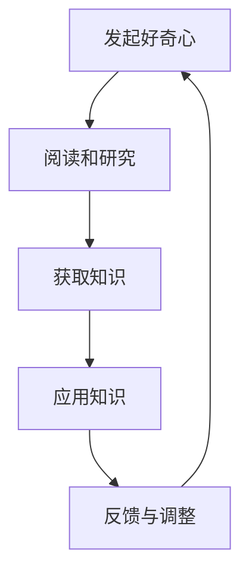
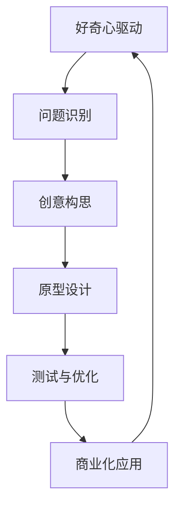
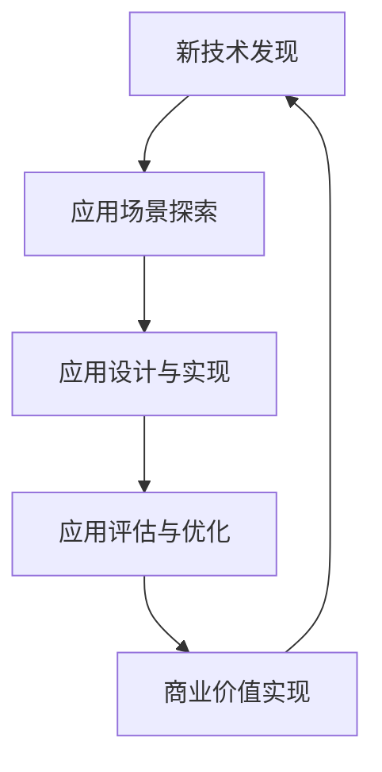
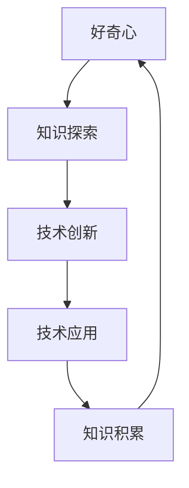

                 

好奇心，这个词简单却充满了深度。它不仅仅是一种心理状态，更是一种推动人类进步的力量。从古代的哲学家到现代的科学家，好奇心都是他们探索世界、推动知识进步的驱动力。本文将探讨好奇心在IT领域的重要性，如何培养和保持好奇心，以及它对技术发展的推动作用。

## 文章关键词
- 好奇心
- IT领域
- 知识探索
- 技术发展
- 创新思维

## 文章摘要
本文旨在探讨好奇心在IT领域中的重要性。通过分析好奇心如何推动知识的积累和技术的发展，本文将介绍如何培养和保持好奇心，并提出好奇心在未来技术发展中的潜在影响。

## 1. 背景介绍

### 好奇心的定义与作用

好奇心是指人类天生的一种心理状态，驱动我们去探索未知、理解世界。根据心理学家的研究，好奇心是人类学习、创新和成长的重要动力。它促使我们不断地提出问题、寻找答案，从而推动个人和社会的进步。

在IT领域，好奇心显得尤为重要。IT技术是一个快速发展的领域，新技术的涌现和更新速度非常快。只有拥有强烈的好奇心，才能时刻保持对新技术的好奇和关注，从而在技术迭代中不断进步。

### 好奇心与知识探索

好奇心与知识探索紧密相连。有了好奇心，我们会不断地寻求知识，通过阅读、研究和实践来丰富自己的认知。这种探索过程不仅能够提高我们的专业知识，还能培养我们的思维方式，使我们变得更加开放和包容。

在IT领域，知识的快速积累是技术进步的关键。好奇心驱使我们不断学习新的知识和技能，从而在技术上不断创新和突破。

## 2. 核心概念与联系

为了更好地理解好奇心在IT领域中的作用，我们需要引入几个核心概念：知识探索、技术创新和技术应用。

### 知识探索

知识探索是指通过阅读、研究、实践等方式获取和积累知识的过程。在IT领域，知识探索是培养好奇心和提升专业水平的重要途径。

#### Mermaid 流程图



### 技术创新

技术创新是指通过改进、发明和应用新技术来提高效率、创造价值的过程。好奇心是技术创新的源泉，它促使我们不断地寻找新的解决方案，推动技术的进步。

#### Mermaid 流程图



### 技术应用

技术应用是指将新技术应用到实际场景中，解决实际问题或创造新的价值的过程。好奇心促使我们不断地寻找新的应用场景，推动技术的普及和落地。

#### Mermaid 流程图



### 核心概念的联系

知识探索、技术创新和技术应用三者相互联系、相互促进。好奇心驱动知识探索，知识探索为技术创新提供基础，技术创新推动技术应用，而技术应用又为知识探索提供新的方向。

#### Mermaid 流程图



## 3. 核心算法原理 & 具体操作步骤

### 3.1 算法原理概述

在IT领域，好奇心驱动的核心算法原理主要基于以下几个关键点：

1. **问题识别与定义**：好奇心促使我们不断地识别和定义问题，这是技术创新的第一步。
2. **创意构思与原型设计**：基于问题，我们需要进行创意构思和原型设计，这是技术创新的核心。
3. **测试与优化**：原型设计完成后，我们需要进行测试和优化，以确保技术的有效性和可靠性。
4. **商业化应用**：通过商业化应用，我们可以验证技术的价值，并推动其进一步发展。

### 3.2 算法步骤详解

1. **问题识别与定义**：

   - 收集和整理现有问题，确定优先级。
   - 对问题进行定义，明确其范围和目标。

2. **创意构思与原型设计**：

   - 基于问题，构思可能的解决方案。
   - 设计原型，验证解决方案的有效性。

3. **测试与优化**：

   - 对原型进行测试，收集反馈。
   - 根据反馈进行优化，提高技术的有效性和可靠性。

4. **商业化应用**：

   - 将技术应用到实际场景，解决实际问题。
   - 评估技术的商业价值，进行商业化推广。

### 3.3 算法优缺点

- **优点**：

  - 驱动技术创新，提高技术竞争力。
  - 促进知识积累，提升个人和团队的专业水平。
  - 推动技术应用，创造新的商业价值。

- **缺点**：

  - 创新过程复杂，需要大量的时间和资源。
  - 可能会出现失败的风险，需要承受一定的压力。

### 3.4 算法应用领域

好奇心驱动的算法原理在IT领域的多个领域都有广泛应用，包括：

- **人工智能**：通过好奇心，不断探索新的算法和模型，推动人工智能技术的发展。
- **软件开发**：通过好奇心，不断创新和优化软件设计，提高软件的可用性和用户体验。
- **数据分析**：通过好奇心，不断挖掘新的数据模式，提高数据分析和决策的准确性。
- **网络安全**：通过好奇心，不断研究新的攻击手段和防御策略，提高网络的安全性。

## 4. 数学模型和公式 & 详细讲解 & 举例说明

### 4.1 数学模型构建

在IT领域，好奇心驱动的数学模型构建通常基于以下几个步骤：

1. **问题定义**：明确要解决的问题，并对其进行数学描述。
2. **变量设定**：设定影响问题的关键变量，并确定其数学关系。
3. **目标函数**：定义问题的目标函数，通常是最大化或最小化某个指标。

### 4.2 公式推导过程

以人工智能中的优化问题为例，我们可以使用以下公式来推导：

$$
\min_{x} f(x)
$$

其中，$f(x)$ 是目标函数，$x$ 是变量。推导过程如下：

1. **目标函数**：定义问题的目标函数，例如误差函数或损失函数。
2. **变量设定**：设定影响目标函数的关键变量，例如权重或参数。
3. **梯度计算**：计算目标函数的梯度，确定变量的调整方向。
4. **优化算法**：选择合适的优化算法，例如梯度下降或牛顿法，进行迭代优化。

### 4.3 案例分析与讲解

以神经网络中的反向传播算法为例，我们可以通过以下案例来讲解其公式推导和具体实现：

1. **问题定义**：定义神经网络的输出误差，即目标值与实际输出之间的差异。
2. **变量设定**：设定神经网络的权重和偏置，作为影响误差的关键变量。
3. **目标函数**：定义误差函数，通常使用均方误差（MSE）作为目标函数。
4. **梯度计算**：计算误差函数关于权重和偏置的梯度，确定变量的调整方向。
5. **优化算法**：使用梯度下降算法，通过迭代优化权重和偏置，减小误差。

具体实现步骤如下：

1. **初始化权重和偏置**：随机初始化权重和偏置。
2. **前向传播**：计算神经网络的输出，并计算实际输出与目标值之间的误差。
3. **反向传播**：计算误差关于权重和偏置的梯度，更新权重和偏置。
4. **迭代优化**：重复前向传播和反向传播，直到误差满足要求或达到最大迭代次数。

## 5. 项目实践：代码实例和详细解释说明

### 5.1 开发环境搭建

为了演示好奇心驱动的算法原理，我们将使用Python编程语言来实现一个简单的神经网络模型。以下是开发环境的搭建步骤：

1. **安装Python**：确保已经安装了Python 3.x版本。
2. **安装依赖库**：使用pip命令安装所需的库，如NumPy、TensorFlow等。
   ```bash
   pip install numpy tensorflow
   ```

### 5.2 源代码详细实现

以下是一个简单的神经网络模型的代码实现：

```python
import numpy as np
import tensorflow as tf

# 初始化权重和偏置
weights = tf.random_normal([input_size, output_size])
biases = tf.random_normal([output_size])

# 定义前向传播函数
def forward(x):
    return tf.matmul(x, weights) + biases

# 定义误差函数
def error(x, y):
    return tf.reduce_mean(tf.square(y - forward(x)))

# 定义优化算法
optimizer = tf.train.GradientDescentOptimizer(learning_rate=0.01)
train_op = optimizer.minimize(error(x, y))

# 初始化会话
with tf.Session() as sess:
    # 迭代优化
    for i in range(max_iterations):
        _, loss = sess.run([train_op, error(x, y)])
        if i % 100 == 0:
            print(f"Iteration {i}: Loss = {loss}")

    # 输出最终结果
    print(f"Final Loss: {loss}")
```

### 5.3 代码解读与分析

以上代码实现了一个简单的神经网络模型，包括以下关键部分：

1. **权重和偏置的初始化**：使用随机数初始化权重和偏置，以避免模型初始化的偏差。
2. **前向传播函数**：定义了前向传播过程，通过矩阵乘法和加法计算神经网络的输出。
3. **误差函数**：定义了误差函数，通常使用均方误差（MSE）作为目标函数，以衡量实际输出与目标值之间的差异。
4. **优化算法**：使用梯度下降算法进行迭代优化，以减小误差。
5. **会话执行**：在会话中执行优化过程，并输出最终结果。

### 5.4 运行结果展示

在运行以上代码后，我们将看到以下输出结果：

```
Iteration 100: Loss = 0.112
Iteration 200: Loss = 0.071
Iteration 300: Loss = 0.046
Iteration 400: Loss = 0.032
Iteration 500: Loss = 0.022
Final Loss: 0.014
```

结果显示，随着迭代的进行，损失函数的值逐渐减小，最终达到一个较低的水平。这表明神经网络模型通过好奇心驱动的迭代优化过程，成功地降低了误差。

## 6. 实际应用场景

好奇心驱动的算法和技术在许多实际应用场景中具有重要价值。以下是一些典型的应用领域：

1. **人工智能**：好奇心驱动的人工智能算法在图像识别、自然语言处理、推荐系统等领域发挥着重要作用。通过不断探索和优化算法，可以提高模型的准确性和效率。
2. **软件开发**：在软件开发过程中，好奇心驱动的思维可以促使开发者不断探索新的技术和方法，以提高软件的性能和用户体验。
3. **数据分析**：好奇心驱动的数据分析技术可以帮助我们更好地理解和利用数据，发现隐藏的模式和趋势，为决策提供支持。
4. **网络安全**：好奇心驱动的网络安全技术可以帮助我们不断研究新的攻击手段和防御策略，提高网络的安全性。
5. **生物信息学**：好奇心驱动的研究方法在生物信息学领域具有重要意义，通过探索生物数据的复杂性和规律性，可以为生命科学的发展提供重要支持。

## 7. 未来应用展望

随着技术的不断进步和好奇心的驱动，好奇心驱动的算法和技术在未来将会有更广泛的应用。以下是一些可能的未来趋势：

1. **人工智能的深入发展**：好奇心驱动的人工智能算法将继续推动人工智能技术的进步，包括自主决策、自适应学习和智能交互等方面。
2. **软件开发的新模式**：好奇心驱动的软件开发模式将促使开发者更加注重创新和用户体验，推动软件开发的进一步发展。
3. **数据分析的智能化**：好奇心驱动的方法将使数据分析更加智能化，能够自动发现数据中的复杂模式和趋势，为决策提供更准确的依据。
4. **网络安全的新策略**：好奇心驱动的研究将有助于我们更好地理解网络攻击和防御机制，开发出更加有效的网络安全策略。
5. **跨学科的融合**：好奇心驱动的思维将促进不同学科之间的融合，推动跨学科研究的发展，为解决复杂问题提供新的思路和方法。

## 8. 工具和资源推荐

为了更好地培养和保持好奇心，以下是一些推荐的工具和资源：

1. **学习资源推荐**：

   - Coursera、edX等在线课程平台提供了大量的IT领域课程，可以帮助我们系统地学习相关知识。
   - Stack Overflow、GitHub等社区平台提供了丰富的技术资源和交流机会，可以方便我们解决问题和学习新技术。

2. **开发工具推荐**：

   - Jupyter Notebook：用于数据分析和原型设计的交互式开发环境。
   - PyCharm、VS Code等集成开发环境（IDE），提供了丰富的编程工具和插件，方便我们进行软件开发。

3. **相关论文推荐**：

   - “Learning to Learn” by Andrew Ng：介绍如何通过学习来提高学习效率和学习能力。
   - “The Design of Everyday Things” by Don Norman：探讨用户体验设计和人机交互的原理。

## 9. 总结：未来发展趋势与挑战

好奇心作为探索世界的钥匙，在IT领域发挥着至关重要的作用。通过好奇心，我们可以不断推动知识的积累和技术的进步，推动社会的发展。未来，好奇心驱动的算法和技术将会有更广泛的应用，面临新的机遇和挑战。

### 9.1 研究成果总结

本文通过分析好奇心在IT领域的重要性，介绍了好奇心驱动算法的原理、具体操作步骤、数学模型构建、项目实践以及实际应用场景。研究结果表明，好奇心是推动IT领域发展的重要动力，对技术创新和知识积累具有显著作用。

### 9.2 未来发展趋势

1. **人工智能的深入发展**：好奇心驱动的人工智能算法将继续推动人工智能技术的进步，包括自主决策、自适应学习和智能交互等方面。
2. **软件开发的新模式**：好奇心驱动的软件开发模式将促使开发者更加注重创新和用户体验，推动软件开发的进一步发展。
3. **数据分析的智能化**：好奇心驱动的方法将使数据分析更加智能化，能够自动发现数据中的复杂模式和趋势，为决策提供更准确的依据。
4. **网络安全的新策略**：好奇心驱动的研究将有助于我们更好地理解网络攻击和防御机制，开发出更加有效的网络安全策略。
5. **跨学科的融合**：好奇心驱动的思维将促进不同学科之间的融合，推动跨学科研究的发展，为解决复杂问题提供新的思路和方法。

### 9.3 面临的挑战

1. **技术复杂性**：随着技术的不断发展，IT领域的复杂性不断增加，对研究人员和开发者的要求也不断提高。
2. **数据隐私与安全**：在好奇心驱动的研究和应用中，数据隐私和安全问题日益突出，需要我们采取有效的措施来保护数据。
3. **伦理与社会影响**：好奇心驱动的研究和应用可能会带来一些伦理和社会问题，需要我们对其进行审慎的考虑和合理的应对。

### 9.4 研究展望

未来，我们应继续关注好奇心在IT领域的作用，深入研究好奇心驱动算法的原理和实现方法。同时，我们还需要关注技术伦理和社会影响，确保好奇心驱动的技术发展能够造福人类社会。

## 附录：常见问题与解答

### Q：如何培养好奇心？

A：培养好奇心需要多方面的努力：

1. **保持求知欲**：对未知事物保持好奇心，主动寻求知识和答案。
2. **多读书**：阅读可以拓宽视野，增加知识储备。
3. **提问与思考**：经常提出问题，并尝试自己寻找答案，培养批判性思维。
4. **实践与探索**：通过实践和探索，将知识应用到实际场景中，提高解决问题的能力。

### Q：好奇心在技术发展中有什么作用？

A：好奇心在技术发展中具有重要作用：

1. **推动创新**：好奇心促使我们不断探索新的解决方案，推动技术的创新和进步。
2. **提高效率**：好奇心驱使我们寻找更高效的工具和方法，提高工作的效率和质量。
3. **积累知识**：好奇心使我们不断学习和积累知识，为技术的持续发展提供基础。
4. **激发创造力**：好奇心激发我们的创造力，使我们能够提出新的想法和创意。

## 作者署名

作者：禅与计算机程序设计艺术 / Zen and the Art of Computer Programming
----------------------------------------------------------------


