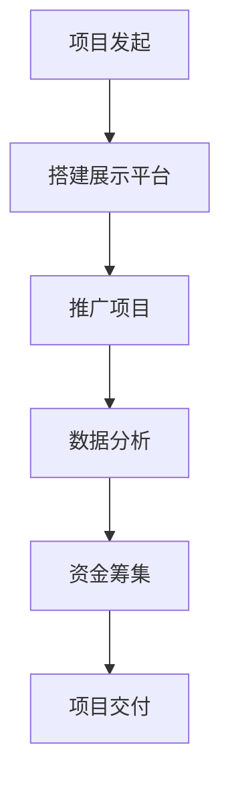

                 

关键词：众筹、技术能力、资金筹集、创新项目、社区建设

> 摘要：本文旨在探讨如何利用技术能力进行众筹，实现创新项目的资金筹集和推广。通过分析技术对众筹的影响，提供一系列实际操作步骤和工具推荐，帮助开发者、创业者和技术爱好者更好地利用技术优势进行众筹。

## 1. 背景介绍

随着互联网技术的不断发展，众筹已成为一种流行的融资方式。众筹平台如Kickstarter、Indiegogo等，为创新项目提供了展示和筹集资金的平台。然而，对于技术型人才而言，如何利用自身的技术能力进行众筹，却是一个值得探讨的问题。

技术能力包括编程、产品设计、数据分析等多个方面，这些能力可以为众筹项目带来独特的价值。通过技术手段，可以提高项目的透明度、吸引力和可信度，从而增加筹款的成功率。

## 2. 核心概念与联系

### 2.1 技术能力在众筹中的价值

**2.1.1 项目透明度**

技术能力可以帮助项目方构建一个透明的项目展示平台，使投资者能够实时查看项目的进展情况、资金使用情况等，增强投资者的信任。

**2.1.2 项目推广**

利用社交媒体、搜索引擎优化（SEO）等技术，可以有效地推广项目，吸引更多的潜在投资者。

**2.1.3 数据分析**

通过数据分析，项目方可以了解投资者的需求和偏好，为后续的产品设计和项目调整提供依据。

### 2.2 技术与众筹平台的结合

**2.2.1 自建众筹平台**

通过自行搭建众筹平台，项目方可以完全控制项目展示和资金筹集过程，但需要投入更多的时间和资源。

**2.2.2 第三方众筹平台**

利用现有的众筹平台，如Kickstarter、Indiegogo等，可以节省时间和资源，但需要适应平台的规定和流程。

### 2.3 Mermaid 流程图



## 3. 核心算法原理 & 具体操作步骤

### 3.1 算法原理概述

**3.1.1 项目展示平台**

利用静态网站生成器（如Jekyll、Hexo）等技术，可以快速搭建一个项目展示平台。

**3.1.2 项目推广**

利用搜索引擎优化（SEO）技术，提高项目在搜索引擎中的排名。

**3.1.3 数据分析**

利用数据分析工具（如Google Analytics、Mixpanel），收集用户行为数据，进行分析。

### 3.2 算法步骤详解

#### 3.2.1 搭建展示平台

1. 确定项目需求和目标。
2. 选择合适的静态网站生成器。
3. 编写项目展示页面。

#### 3.2.2 推广项目

1. 优化网站SEO。
2. 利用社交媒体进行推广。
3. 联合其他网站或社区进行宣传。

#### 3.2.3 数据分析

1. 部署数据分析工具。
2. 收集用户行为数据。
3. 分析数据，为项目调整提供依据。

### 3.3 算法优缺点

**优点：**

1. 提高项目透明度。
2. 有效推广项目。
3. 提供数据支持。

**缺点：**

1. 需要一定的技术能力。
2. 需要持续投入时间和精力。

### 3.4 算法应用领域

1. 创业项目的资金筹集。
2. 社区建设。
3. 产品设计和开发。

## 4. 数学模型和公式 & 详细讲解 & 举例说明

### 4.1 数学模型构建

假设众筹项目在t时刻的筹款金额为A(t)，项目目标金额为B，项目持续时间T，则项目成功的概率P可以用以下公式表示：

$$ P = \frac{A(T)}{B} $$

### 4.2 公式推导过程

假设项目成功与筹款金额成正比，与项目持续时间成反比，则可以推导出上述公式。

### 4.3 案例分析与讲解

以某智能硬件项目为例，该项目目标金额为100万元，项目持续时间为90天。经过推广和数据分析，项目在60天时筹款金额达到80万元。根据公式计算，项目成功的概率为：

$$ P = \frac{80}{100} = 0.8 $$

## 5. 项目实践：代码实例和详细解释说明

### 5.1 开发环境搭建

1. 安装Node.js。
2. 安装Jekyll。
3. 创建项目文件夹。

### 5.2 源代码详细实现

```markdown
---
layout: post
title: "我的智能硬件项目"
date: 2023-04-01
---
# 我的智能硬件项目

项目简介...

## 功能特点

1. 特点一...
2. 特点二...

## 项目进展

1. 进展一...
2. 进展二...

## 赞助我

如果你认可我的项目，欢迎赞助！

---

[赞助按钮]
```

### 5.3 代码解读与分析

1. 使用Jekyll搭建项目展示页面。
2. 使用Markdown语法编写项目内容。
3. 添加赞助按钮，引导用户进行赞助。

### 5.4 运行结果展示

通过浏览器访问项目展示页面，用户可以了解项目详情，并通过赞助按钮进行赞助。

## 6. 实际应用场景

1. 创业项目的资金筹集。
2. 社区建设。
3. 产品设计和开发。

### 6.1 创业项目的资金筹集

利用技术能力，创业者可以搭建一个透明的项目展示平台，吸引更多的投资者。

### 6.2 社区建设

技术能力可以帮助社区管理员构建一个高效的社区平台，提高用户活跃度。

### 6.3 产品设计和开发

利用数据分析，产品经理可以更好地了解用户需求，为产品设计和开发提供依据。

## 7. 工具和资源推荐

### 7.1 学习资源推荐

1. 《众筹实战：如何用项目说话，赢得投资者的心》
2. 《Python数据分析：从入门到精通》

### 7.2 开发工具推荐

1. Jekyll
2. GitHub Pages
3. Google Analytics

### 7.3 相关论文推荐

1. " Crowdfunding Success: The Role of Social Networks and Perceived Risk "
2. " The Effect of Crowdfunding on Venture Capital Investment "

## 8. 总结：未来发展趋势与挑战

### 8.1 研究成果总结

通过本文的探讨，我们了解到技术能力在众筹中的应用具有重要意义。技术可以帮助项目方提高项目透明度、推广项目和进行数据分析，从而提高筹款成功率。

### 8.2 未来发展趋势

随着技术的不断进步，众筹平台和工具将更加智能化、个性化。技术能力将在众筹中发挥更大的作用。

### 8.3 面临的挑战

技术能力在众筹中的应用也面临一些挑战，如技术门槛、持续投入等。项目方需要不断学习和适应新技术。

### 8.4 研究展望

未来，我们可以进一步研究如何利用人工智能等技术，为众筹项目提供更智能、更高效的解决方案。

## 9. 附录：常见问题与解答

### 9.1 如何选择众筹平台？

根据项目的特点和目标，选择合适的众筹平台。如Kickstarter适合创意项目，Indiegogo适合创业项目。

### 9.2 如何进行项目推广？

利用搜索引擎优化（SEO）、社交媒体、合作推广等多种手段，提高项目的知名度。

### 9.3 如何进行数据分析？

使用数据分析工具（如Google Analytics、Mixpanel），收集用户行为数据，进行分析。

作者：禅与计算机程序设计艺术 / Zen and the Art of Computer Programming
----------------------------------------------------------------

请注意，上述内容仅为文章框架和部分内容的示例，实际撰写时需要根据要求补充完整。

