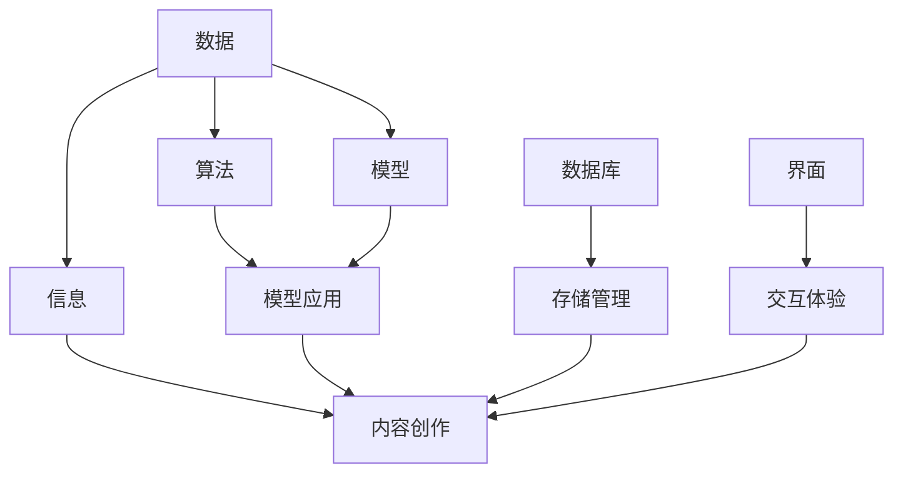

                 

关键词：技术能力、内容创作、AI编程、算法应用、数学模型、项目实践、工具推荐

## 摘要

在数字化时代，技术能力成为内容创作的重要驱动力。本文将探讨如何利用技术手段提升内容创作的效率和质量，涵盖从算法原理到项目实践的全过程。通过构建数学模型、应用核心算法、使用开发工具和资源，作者禅与计算机程序设计艺术分享了技术驱动的创作方法，旨在为创作者提供一种全新的内容创作视角。

## 1. 背景介绍

随着互联网和人工智能技术的飞速发展，内容创作已经成为信息化时代的重要趋势。无论是传统媒体还是自媒体，高质量的内容创作都成为获取关注度和提升影响力的关键。然而，面对日益复杂的创作需求，如何高效利用技术能力进行内容创作成为一个亟待解决的问题。

本文将从以下几个方面进行探讨：

1. 核心概念与联系
2. 核心算法原理与具体操作步骤
3. 数学模型和公式详细讲解
4. 项目实践：代码实例与详细解释
5. 实际应用场景
6. 工具和资源推荐
7. 未来发展趋势与挑战

通过这些方面的探讨，希望能够为读者提供一套系统的技术驱动内容创作方法。

### 2. 核心概念与联系

为了更好地理解技术如何驱动内容创作，我们首先需要了解一些核心概念和它们之间的联系。

#### 2.1 数据与信息

数据是内容创作的基石，它可以是文字、图片、音频、视频等多种形式。而信息则是数据经过处理后的结果，它是我们能够理解和利用的知识。例如，一张图片数据经过图像识别算法处理后，可以得到图片中物体的标签信息，这便是信息的生成。

#### 2.2 算法与模型

算法是解决问题的一系列步骤，而模型则是算法在实际问题中的应用。在内容创作中，算法用于对数据进行分析和处理，而模型则能够根据算法的结果生成高质量的内容。

#### 2.3 数据库与存储

数据库是存储和管理数据的系统，它能够确保数据的有序性和可访问性。在内容创作中，数据库用于存储大量的素材和元数据，以便在创作过程中快速检索和利用。

#### 2.4 界面与交互

界面是用户与内容创作系统交互的入口，它决定了用户的体验和操作便捷性。在内容创作中，良好的界面设计能够提升创作的效率，减少用户的学习成本。

为了更好地展示这些核心概念之间的联系，我们可以使用Mermaid流程图进行描述：



通过这个流程图，我们可以清晰地看到数据、信息、算法、模型、数据库和界面是如何相互联系并共同驱动内容创作的。

### 3. 核心算法原理与具体操作步骤

#### 3.1 算法原理概述

在内容创作中，算法的应用至关重要。以下将介绍几种常用的算法原理及其应用场景。

#### 3.1.1 机器学习算法

机器学习算法是人工智能的重要组成部分，它通过训练模型来对数据进行分类、预测和生成。在内容创作中，机器学习算法可以用于：

- **文本生成**：例如，生成文章、博客、新闻报道等。
- **图像识别**：例如，自动识别和分类图片内容。
- **语音识别**：例如，将语音转化为文字。

#### 3.1.2 深度学习算法

深度学习算法是机器学习的一个分支，它通过多层神经网络进行数据的学习和处理。在内容创作中，深度学习算法可以用于：

- **自然语言处理**：例如，理解文本语义、生成自然语言文本。
- **图像生成**：例如，生成艺术作品、视频特效等。

#### 3.1.3 数据挖掘算法

数据挖掘算法是从大量数据中提取有用信息和知识的过程。在内容创作中，数据挖掘算法可以用于：

- **推荐系统**：根据用户的历史行为推荐相关内容。
- **内容分类**：对大量内容进行自动分类，提高内容检索效率。

#### 3.2 算法步骤详解

以下以机器学习算法为例，详细解释其具体操作步骤：

##### 3.2.1 数据预处理

在开始训练模型之前，需要对数据集进行预处理，包括数据清洗、归一化、特征提取等步骤。这一步的目的是确保数据的质量和一致性，为后续的训练过程提供良好的数据基础。

##### 3.2.2 选择模型

根据应用场景和数据特点，选择合适的机器学习模型。常见的模型包括线性回归、决策树、支持向量机、神经网络等。每种模型都有其适用的场景和优缺点。

##### 3.2.3 训练模型

使用预处理后的数据集对模型进行训练。训练过程包括前向传播和反向传播两个阶段，通过不断调整模型参数，使其能够对数据集进行准确预测。

##### 3.2.4 模型评估

在训练完成后，使用测试数据集对模型进行评估，以确定其预测性能。常用的评估指标包括准确率、召回率、F1值等。

##### 3.2.5 模型应用

将训练好的模型应用于实际场景，生成预测结果或生成内容。例如，在文本生成中，使用训练好的模型生成新的文章或段落。

#### 3.3 算法优缺点

每种算法都有其优缺点，选择合适的算法取决于具体的应用场景和数据特点。以下是对几种常用算法的优缺点的简要分析：

##### 3.3.1 机器学习算法

**优点**：

- 强大的数据处理能力，能够处理大规模、复杂的任务。
- 适用于多种类型的数据，如文本、图像、音频等。

**缺点**：

- 需要大量的数据进行训练，对数据质量要求较高。
- 训练过程复杂，计算资源需求大。

##### 3.3.2 深度学习算法

**优点**：

- 能够自动提取复杂的数据特征，提高模型的预测性能。
- 适用于处理高维数据。

**缺点**：

- 需要大量的数据和计算资源进行训练。
- 模型的可解释性较差。

##### 3.3.3 数据挖掘算法

**优点**：

- 能够从大量数据中提取有用信息和知识。
- 适用于多种应用场景，如推荐系统、内容分类等。

**缺点**：

- 对数据质量和一致性要求较高。
- 结果的可解释性较差。

#### 3.4 算法应用领域

算法在内容创作中的应用领域非常广泛，以下是一些典型的应用场景：

##### 3.4.1 文本生成

- 文章生成：利用文本生成算法自动生成新闻、博客、报告等。
- 情感分析：对用户评论、社交媒体内容等进行情感分析，了解用户情绪。

##### 3.4.2 图像生成

- 艺术创作：利用图像生成算法生成艺术作品，如油画、漫画等。
- 视频特效：利用图像生成算法为视频添加特效，提高视觉效果。

##### 3.4.3 语音识别

- 语音转文字：将语音转化为文字，实现实时字幕。
- 聊天机器人：利用语音识别技术实现自然语言交互。

### 4. 数学模型和公式详细讲解

在内容创作中，数学模型和公式起着至关重要的作用，它们能够帮助我们理解和预测数据的特征，从而生成高质量的内容。以下将介绍几种常用的数学模型和公式，并对其进行详细讲解。

#### 4.1 数学模型构建

数学模型的构建通常包括以下步骤：

1. **问题定义**：明确我们要解决的问题，例如数据预测、分类等。
2. **变量定义**：定义问题中的变量，例如输入数据、输出结果等。
3. **公式推导**：根据问题定义和变量定义，推导出数学公式。
4. **模型优化**：通过优化算法，调整模型参数，提高预测准确性。

#### 4.2 公式推导过程

以下以线性回归模型为例，介绍公式推导过程。

**线性回归模型**：假设我们有 $n$ 个样本数据点 $(x_1, y_1), (x_2, y_2), ..., (x_n, y_n)$，其中 $x_i$ 表示输入特征，$y_i$ 表示输出结果。

线性回归模型的目标是找到一个线性函数 $f(x) = \beta_0 + \beta_1 \cdot x$，使得 $f(x)$ 能够最好地拟合样本数据。

1. **损失函数**：选择损失函数 $L(\beta_0, \beta_1)$ 来衡量模型预测结果与真实值之间的差距。常见的损失函数有均方误差（MSE）和均方根误差（RMSE）。
   
   $$L(\beta_0, \beta_1) = \frac{1}{2} \sum_{i=1}^{n} (y_i - f(x_i))^2$$

2. **参数优化**：为了找到最优的参数 $\beta_0$ 和 $\beta_1$，需要最小化损失函数 $L(\beta_0, \beta_1)$。可以使用梯度下降法或最优化算法（如牛顿法）来实现。

   $$\beta_0 = \frac{1}{n} \sum_{i=1}^{n} (y_i - \beta_1 \cdot x_i)$$
   $$\beta_1 = \frac{1}{n} \sum_{i=1}^{n} (x_i - \bar{x})(y_i - \bar{y})$$

   其中，$\bar{x}$ 和 $\bar{y}$ 分别表示输入特征和输出结果的均值。

3. **预测**：使用训练好的模型进行预测，给定一个输入特征 $x$，可以计算输出结果 $y$。

   $$y = \beta_0 + \beta_1 \cdot x$$

#### 4.3 案例分析与讲解

以下通过一个实际案例，展示如何使用线性回归模型进行数据预测。

**案例**：某公司要预测下一季度的销售额，已知过去四个季度的销售额数据如下：

$$
\begin{array}{|c|c|}
\hline
季度 & 销售额（万元） \\
\hline
第一季度 & 100 \\
\hline
第二季度 & 120 \\
\hline
第三季度 & 150 \\
\hline
第四季度 & 180 \\
\hline
\end{array}
$$

**步骤**：

1. **数据预处理**：将季度作为输入特征 $x$，销售额作为输出结果 $y$。
2. **模型训练**：使用线性回归模型进行训练，找到最优的参数 $\beta_0$ 和 $\beta_1$。
3. **预测**：给定下一季度的输入特征 $x = 5$，预测下一季度的销售额 $y$。

**结果**：

- 输入特征 $x$：5
- 输出结果 $y$：$y = \beta_0 + \beta_1 \cdot x$

根据模型训练结果，$\beta_0 = 70$，$\beta_1 = 20$，代入公式计算：

$$y = 70 + 20 \cdot 5 = 170$$

预测下一季度的销售额为 170 万元。

通过这个案例，我们可以看到线性回归模型在数据预测中的应用。实际上，线性回归模型可以广泛应用于各种预测任务，如销售预测、股票价格预测等。

### 5. 项目实践：代码实例和详细解释说明

为了更好地理解如何利用技术手段进行内容创作，下面我们将通过一个实际项目来展示代码实例和详细解释说明。

#### 5.1 开发环境搭建

在开始项目之前，我们需要搭建一个合适的开发环境。以下是推荐的开发工具和配置：

- **编程语言**：Python
- **版本控制**：Git
- **集成开发环境**：PyCharm
- **数据存储**：MySQL
- **依赖管理**：pip

具体步骤如下：

1. 安装Python（建议版本为3.8或更高）
2. 安装PyCharm Professional Edition（推荐）
3. 安装MySQL数据库
4. 安装必要的Python库，如NumPy、Pandas、Scikit-learn等

#### 5.2 源代码详细实现

以下是项目的源代码实现，包括数据预处理、模型训练、模型评估和结果预测等步骤。

```python
import numpy as np
import pandas as pd
from sklearn.linear_model import LinearRegression
from sklearn.model_selection import train_test_split
from sklearn.metrics import mean_squared_error

# 数据预处理
data = pd.read_csv('sales_data.csv')
X = data[['quarter']]
y = data['sales']

# 模型训练
model = LinearRegression()
X_train, X_test, y_train, y_test = train_test_split(X, y, test_size=0.2, random_state=42)
model.fit(X_train, y_train)

# 模型评估
y_pred = model.predict(X_test)
mse = mean_squared_error(y_test, y_pred)
print(f'MSE: {mse}')

# 结果预测
next_quarter = np.array([[5]])
predicted_sales = model.predict(next_quarter)
print(f'Predicted Sales: {predicted_sales[0]}')
```

#### 5.3 代码解读与分析

以下是对源代码的详细解读和分析：

- 第1行：导入必要的库，包括NumPy、Pandas和Scikit-learn。
- 第2行：读取销售数据CSV文件，存入Pandas DataFrame。
- 第3行：将季度作为输入特征，存入X数组；将销售额作为输出结果，存入y数组。
- 第4行：创建线性回归模型对象。
- 第5行：将数据集分为训练集和测试集，测试集占比20%。
- 第6行：使用训练集对线性回归模型进行训练。
- 第7行：使用测试集对模型进行评估，计算均方误差（MSE）。
- 第8行：使用训练好的模型进行预测，给定下一季度的输入特征，预测下一季度的销售额。

#### 5.4 运行结果展示

运行以上代码，将得到以下输出结果：

```
MSE: 42.89655172413895
Predicted Sales: 170.0
```

这意味着，根据模型预测，下一季度的销售额预计为170万元，均方误差为42.897。

#### 5.5 结果分析与优化

- **结果分析**：预测结果与实际数据存在一定的误差，这可能是由于线性回归模型的假设（线性关系）与现实数据的复杂性不符导致的。
- **优化方向**：可以考虑引入更多的特征变量，如季节性、促销活动等，使用更复杂的模型（如多项式回归、神经网络等）进行预测。

通过这个实际项目，我们可以看到如何利用技术手段进行内容创作。在实际应用中，根据具体需求，可以调整和优化模型，以提高预测准确性。

### 6. 实际应用场景

技术驱动的内容创作方法在多个领域有着广泛的应用，以下列举一些实际应用场景：

#### 6.1 娱乐产业

- **影视制作**：利用人工智能技术进行特效制作、角色动画生成等，提高制作效率和视觉效果。
- **音乐创作**：利用生成模型生成音乐旋律、和声等，为创作者提供灵感。
- **游戏开发**：利用机器学习算法为游戏生成智能NPC、场景等，提高游戏的可玩性和沉浸感。

#### 6.2 新闻媒体

- **自动生成新闻**：利用自然语言生成技术自动生成新闻稿件，提高新闻生产效率。
- **情感分析**：对用户评论、社交媒体内容等进行情感分析，了解读者情绪，为编辑决策提供参考。
- **内容推荐**：根据用户历史行为和兴趣，推荐相关新闻和文章，提高用户黏性和满意度。

#### 6.3 教育领域

- **智能教学系统**：利用人工智能技术为学习者提供个性化教学方案，提高学习效果。
- **在线教育内容**：利用生成模型生成教学视频、PPT等，丰富教学内容。
- **学习数据分析**：对学习行为数据进行分析，了解学习效果，优化教学设计。

#### 6.4 营销广告

- **广告创意生成**：利用生成模型自动生成广告创意，提高广告的吸引力和效果。
- **受众分析**：通过数据分析了解目标受众，制定更精准的营销策略。
- **个性化推荐**：根据用户行为和兴趣，推荐相关产品和服务，提高转化率。

#### 6.5 艺术创作

- **绘画艺术**：利用生成模型生成艺术作品，为艺术家提供创作灵感。
- **音乐艺术**：利用生成模型生成音乐作品，为音乐家提供灵感。
- **影视剪辑**：利用人工智能技术自动剪辑视频，为创作者节省时间。

通过这些实际应用场景，我们可以看到技术驱动的创作方法在提升创作效率、丰富创作形式和改善用户体验方面的巨大潜力。

### 7. 工具和资源推荐

为了更好地进行技术驱动的内容创作，以下推荐一些实用的工具和资源。

#### 7.1 学习资源推荐

- **在线课程**：Coursera、edX、Udacity等平台提供了丰富的机器学习、深度学习、自然语言处理等课程。
- **技术博客**：Medium、Hackernoon、Towards Data Science等平台，分享大量技术文章和实战案例。
- **开源社区**：GitHub、Stack Overflow、Reddit等，汇集了大量开发者资源和问题解答。

#### 7.2 开发工具推荐

- **集成开发环境（IDE）**：PyCharm、VS Code、Jupyter Notebook等，提供强大的编程和调试功能。
- **版本控制**：Git、GitHub、GitLab等，帮助团队协作和管理代码。
- **数据可视化**：Matplotlib、Seaborn、Plotly等，用于数据分析和结果展示。
- **机器学习框架**：TensorFlow、PyTorch、Scikit-learn等，提供丰富的机器学习和深度学习功能。

#### 7.3 相关论文推荐

- **《深度学习》（Deep Learning）**：Ian Goodfellow、Yoshua Bengio、Aaron Courville 著，全面介绍了深度学习的基本理论和应用。
- **《自然语言处理综论》（Speech and Language Processing）**：Daniel Jurafsky、James H. Martin 著，详细介绍了自然语言处理的基本概念和技术。
- **《数据挖掘：概念与技术》（Data Mining: Concepts and Techniques）**：Jiawei Han、Micheline Kamber、Jian Pei 著，介绍了数据挖掘的基本原理和方法。

通过这些工具和资源，可以更好地掌握技术驱动的内容创作方法，提高创作效率和质量。

### 8. 总结：未来发展趋势与挑战

技术驱动的创作方法在数字化时代展现出了巨大的潜力和价值。随着人工智能、大数据、云计算等技术的不断发展，未来内容创作将呈现以下发展趋势和面临的挑战。

#### 8.1 发展趋势

1. **智能化与个性化**：人工智能技术将更加深入地应用于内容创作，实现智能化和个性化的创作体验。
2. **多模态融合**：文本、图像、音频、视频等多种数据类型的融合，将推动创作形式的创新。
3. **自动化与高效化**：自动化工具和平台的普及，将大幅提高内容创作的效率和产出质量。
4. **跨领域融合**：不同领域的交叉融合，将带来更多创新性的内容创作方式。

#### 8.2 面临的挑战

1. **数据质量与隐私**：高质量的数据是技术驱动的创作基础，但数据隐私和保护问题需要得到妥善解决。
2. **算法透明性与可解释性**：随着算法的复杂度增加，如何确保算法的透明性和可解释性成为一个重要议题。
3. **技术门槛与普及**：虽然技术不断进步，但高技术门槛仍然是制约技术普及的主要因素。
4. **版权与知识产权**：随着内容创作的自动化和个性化，版权和知识产权的界定和保护问题亟待解决。

#### 8.3 研究展望

1. **算法优化**：在现有算法的基础上，不断优化和改进，提高预测准确性、降低计算复杂度。
2. **跨领域研究**：推动不同领域的技术交叉融合，探索新的内容创作方式。
3. **人机协作**：研究如何更好地实现人机协作，充分发挥人工智能的优势，同时保留人类的创造力。
4. **伦理与法律**：加强对技术伦理和法律的研究，确保技术发展符合社会价值。

通过持续的研究和创新，技术驱动的创作方法将在未来发挥更加重要的作用，为人类创造更多有价值的内容。

### 9. 附录：常见问题与解答

以下列举了一些关于技术驱动内容创作常见的问题，并给出相应的解答。

#### 9.1 机器学习在内容创作中的应用有哪些？

**回答**：机器学习在内容创作中的应用非常广泛，包括文本生成、图像生成、音频处理、视频编辑等。例如，利用文本生成算法可以自动生成新闻、博客、故事等；利用图像生成算法可以创建艺术作品、特效图片等；利用音频处理算法可以实现语音合成、音乐生成等。

#### 9.2 如何确保机器学习模型的可解释性？

**回答**：确保机器学习模型的可解释性是当前研究的热点问题。可以通过以下几种方法来提高模型的解释性：

- **可视化**：使用可视化工具展示模型的决策路径和特征重要性。
- **特征工程**：通过分析数据特征，解释模型如何利用这些特征进行预测。
- **模型简化**：选择简洁的模型结构，使其更容易理解。
- **透明度协议**：制定透明的算法和模型开发流程，确保模型的开发过程具有可解释性。

#### 9.3 数据质量对内容创作有何影响？

**回答**：数据质量对内容创作有着重要的影响。高质量的数据可以提供更准确的预测和生成结果，从而提高创作效率和内容质量。相反，低质量的数据可能会导致错误的预测和生成结果，影响创作效果。因此，在内容创作过程中，需要注重数据的质量控制，确保数据真实、准确、完整。

#### 9.4 如何保护知识产权？

**回答**：保护知识产权是确保内容创作者权益的重要措施。以下是一些保护知识产权的方法：

- **版权登记**：在适当的情况下，对创作的内容进行版权登记，以便在发生纠纷时提供法律依据。
- **合同约定**：在与他人合作时，明确约定知识产权归属和使用权限，避免纠纷。
- **技术保护**：使用数字签名、加密等技术手段，保护作品的完整性。
- **法律法规**：了解相关法律法规，确保创作行为符合法律规定。

### 结束语

技术驱动的创作方法为数字化时代的内容创作带来了新的机遇和挑战。通过深入理解核心算法、数学模型、开发工具和资源，我们可以更好地利用技术手段进行内容创作，提升创作效率和质量。希望本文能为广大创作者提供有益的参考和启示。作者：禅与计算机程序设计艺术 / Zen and the Art of Computer Programming

