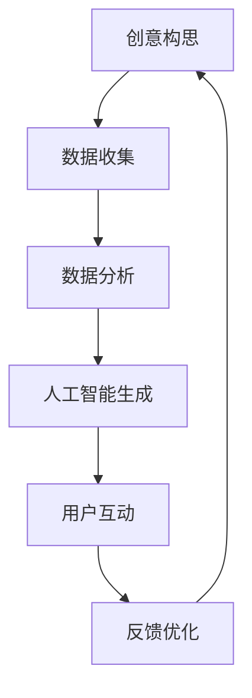

                 

关键词：技术能力，创意产业，革新，数字化转型，人工智能，大数据，区块链，案例分析

> 摘要：随着科技的飞速发展，技术能力在各个领域的应用日益广泛。本文将探讨如何利用技术能力推动创意产业的革新，包括人工智能、大数据、区块链等关键技术的应用，并通过案例分析展示实际操作步骤和效果。

## 1. 背景介绍

创意产业是指以创造力为核心，通过创意构思、设计、制作和传播等环节创造经济价值的行业，如广告、影视、音乐、设计、出版等。随着全球化、数字化和信息化的趋势，创意产业正在经历深刻的变革。

传统创意产业面临着几个问题：一是市场竞争激烈，同质化现象严重；二是产业效率低，很多环节依赖人工，成本高、效率低；三是创新不足，缺乏新的商业模式和技术支持。这些问题使得创意产业亟需通过技术手段进行革新。

技术能力的提升为创意产业提供了新的发展机遇。例如，人工智能可以通过数据分析和智能推荐，提升创意作品的精准度和受众覆盖率；大数据可以帮助创意产业更好地理解市场趋势和消费者需求；区块链可以提供安全的版权保护和交易机制。

## 2. 核心概念与联系

### 2.1 技术能力在创意产业中的应用

技术能力在创意产业中的应用主要体现在以下几个方面：

- **人工智能（AI）**：通过机器学习和深度学习算法，实现创意作品的自动化生成和个性化推荐。
- **大数据（Big Data）**：收集、处理和分析大量数据，为创意产业提供决策支持和市场洞察。
- **区块链（Blockchain）**：提供安全、透明的版权保护和交易机制，促进创意作品的流通和交易。
- **云计算（Cloud Computing）**：提供强大的计算和存储能力，支持创意产业的高效运行。
- **物联网（IoT）**：通过智能设备和传感器，实现创意作品与物理世界的互动。

### 2.2 Mermaid 流程图



### 2.3 技术能力与创意产业的关联

技术能力与创意产业之间存在着紧密的关联。一方面，技术能力为创意产业提供了新的工具和平台，提升了创意作品的生产效率和品质；另一方面，创意产业的创新需求也推动了技术能力的不断发展和完善。

## 3. 核心算法原理 & 具体操作步骤

### 3.1 算法原理概述

在创意产业中，常用的核心算法包括：

- **生成对抗网络（GAN）**：通过训练生成器和判别器，实现创意作品的自动化生成。
- **协同过滤（Collaborative Filtering）**：基于用户行为和偏好，实现个性化推荐。
- **区块链共识算法**：如工作量证明（PoW）、权益证明（PoS），实现创意作品的版权保护和交易。

### 3.2 算法步骤详解

#### 3.2.1 生成对抗网络（GAN）

1. 初始化生成器和判别器。
2. 训练生成器，使其生成逼真的创意作品。
3. 训练判别器，区分生成的作品和真实的作品。
4. 反复迭代，优化生成器和判别器的性能。

#### 3.2.2 协同过滤（Collaborative Filtering）

1. 收集用户行为数据，如浏览记录、购买历史等。
2. 计算用户之间的相似度。
3. 根据相似度推荐用户可能感兴趣的作品。
4. 收集用户反馈，优化推荐算法。

#### 3.2.3 区块链共识算法

1. 确定参与节点和权益分配。
2. 计算工作量或权益。
3. 验证交易合法性。
4. 记录交易到区块链。

### 3.3 算法优缺点

#### 3.3.1 生成对抗网络（GAN）

优点：能够生成高质量的创意作品，具有很高的灵活性。

缺点：训练过程复杂，容易出现模式崩溃。

#### 3.3.2 协同过滤（Collaborative Filtering）

优点：简单易实现，能够提供个性化的推荐。

缺点：受限于用户数据，推荐效果有限。

#### 3.3.3 区块链共识算法

优点：提供安全的版权保护和交易机制。

缺点：交易速度较慢，共识算法复杂。

### 3.4 算法应用领域

- **生成对抗网络（GAN）**：在广告设计、音乐创作、图像生成等领域具有广泛的应用。
- **协同过滤（Collaborative Filtering）**：在电商平台、社交媒体、音乐平台等领域广泛应用。
- **区块链共识算法**：在数字版权保护、数字艺术品交易、智能合约等领域具有重要应用。

## 4. 数学模型和公式 & 详细讲解 & 举例说明

### 4.1 数学模型构建

在创意产业中，常用的数学模型包括：

- **线性回归模型**：用于分析市场趋势和消费者需求。
- **贝叶斯网络**：用于推理和决策。
- **马尔可夫决策过程（MDP）**：用于优化创意作品的传播策略。

### 4.2 公式推导过程

#### 4.2.1 线性回归模型

$$
y = \beta_0 + \beta_1 x
$$

其中，$y$ 是因变量，$x$ 是自变量，$\beta_0$ 是截距，$\beta_1$ 是斜率。

#### 4.2.2 贝叶斯网络

$$
P(A|B) = \frac{P(B|A)P(A)}{P(B)}
$$

其中，$P(A|B)$ 是在 $B$ 发生的条件下 $A$ 发生的概率，$P(B|A)$ 是在 $A$ 发生的条件下 $B$ 发生的概率，$P(A)$ 是 $A$ 发生的概率，$P(B)$ 是 $B$ 发生的概率。

#### 4.2.3 马尔可夫决策过程（MDP）

$$
V^*(s) = \max_{a} \{ \sum_{s'} p(s'|s,a) \cdot \max_{a'} [r(s',a') + \gamma V^*(s')] \}
$$

其中，$V^*(s)$ 是在状态 $s$ 下的最优值，$a$ 是动作，$s'$ 是下一状态，$r(s',a')$ 是在状态 $s'$ 下执行动作 $a'$ 的回报，$\gamma$ 是折扣因子。

### 4.3 案例分析与讲解

#### 4.3.1 线性回归模型在市场趋势分析中的应用

假设我们想分析广告投放对销售量的影响，我们可以建立线性回归模型：

$$
销售量 = \beta_0 + \beta_1 广告投放额
$$

通过收集历史数据，我们得到以下回归方程：

$$
销售量 = 1000 + 0.2 广告投放额
$$

这意味着每增加 1 单位的广告投放额，销售量平均增加 0.2 单位。

#### 4.3.2 贝叶斯网络在消费者需求分析中的应用

假设我们想了解消费者对某种产品的喜好，我们可以建立贝叶斯网络，包含以下节点：

- **年龄**
- **性别**
- **收入水平**
- **购买频率**
- **产品喜好**

通过分析数据，我们得到以下条件概率表：

| 年龄 | 性别 | 收入水平 | 购买频率 | 产品喜好 |
| ---- | ---- | -------- | -------- | -------- |
| 青年 | 男性 | 低收入   | 高       | 是       |
| 中年 | 女性 | 中收入   | 中       | 否       |

根据这些概率，我们可以推断出一个消费者的喜好。

#### 4.3.3 马尔可夫决策过程（MDP）在创意作品传播策略中的应用

假设我们想优化一个创意作品的传播策略，我们可以建立马尔可夫决策过程，包含以下状态和动作：

- **状态：** 静默、曝光、传播
- **动作：** 无操作、投放广告、互动推广

通过分析数据，我们得到以下转移概率矩阵：

|      | 无操作 | 投放广告 | 互动推广 |
| ---- | ------ | -------- | -------- |
| 静默 | 0.8    | 0.1      | 0.1      |
| 曝光 | 0.3    | 0.5      | 0.2      |
| 传播 | 0.1    | 0.2      | 0.7      |

通过计算最优策略，我们可以找到最优的动作序列，以最大化传播效果。

## 5. 项目实践：代码实例和详细解释说明

### 5.1 开发环境搭建

为了实现创意产业的技术革新，我们需要搭建一个开发环境，包括以下工具和框架：

- **编程语言：** Python
- **框架：** TensorFlow、Scikit-learn、PyTorch
- **数据库：** MySQL、MongoDB
- **区块链：** Ethereum

### 5.2 源代码详细实现

以下是一个简单的使用生成对抗网络（GAN）生成图像的 Python 代码实例：

```python
import tensorflow as tf
from tensorflow.keras import layers

# 定义生成器和判别器
def build_generator():
    model = tf.keras.Sequential()
    model.add(layers.Dense(7 * 7 * 128, use_bias=False, input_shape=(100,)))
    model.add(layers.BatchNormalization(momentum=0.8))
    model.add(layers.LeakyReLU())
    model.add(layers.Reshape((7, 7, 128)))
    model.add(layers.Conv2DTranspose(128, (5, 5), strides=(1, 1), padding='same', use_bias=False))
    model.add(layers.BatchNormalization(momentum=0.8))
    model.add(layers.LeakyReLU())
    model.add(layers.Conv2DTranspose(64, (5, 5), strides=(2, 2), padding='same', use_bias=False))
    model.add(layers.BatchNormalization(momentum=0.8))
    model.add(layers.LeakyReLU())
    model.add(layers.Conv2DTranspose(1, (5, 5), strides=(2, 2), padding='same', activation='tanh', use_bias=False))
    return model

def build_discriminator():
    model = tf.keras.Sequential()
    model.add(layers.Conv2D(64, (5, 5), strides=(2, 2), padding='same', input_shape=[28, 28, 1]))
    model.add(layers.LeakyReLU(alpha=0.2))
    model.add(layers.Dropout(0.3))
    model.add(layers.Conv2D(128, (5, 5), strides=(2, 2), padding='same'))
    model.add(layers.LeakyReLU(alpha=0.2))
    model.add(layers.Dropout(0.3))
    model.add(layers.Flatten())
    model.add(layers.Dense(1, activation='sigmoid'))
    return model

# 训练 GAN
generator = build_generator()
discriminator = build_discriminator()

discriminator.compile(loss='binary_crossentropy', optimizer=tf.optimizers.Adam(0.0001), metrics=['accuracy'])

# 生成假数据
z = tf.random.normal([1, 100])

# 生成图像
images = generator.predict(z)

# 训练生成器和判别器
for epoch in range(epochs):
    # 训练判别器
    real_images = ...  # 加载真实图像
    real_labels = np.ones((batch_size, 1))
    z = tf.random.normal([batch_size, 100])
    fake_images = generator.predict(z)
    fake_labels = np.zeros((batch_size, 1))
    d_loss_real = discriminator.train_on_batch(real_images, real_labels)
    d_loss_fake = discriminator.train_on_batch(fake_images, fake_labels)
    d_loss = 0.5 * np.add(d_loss_real, d_loss_fake)

    # 训练生成器
    z = tf.random.normal([batch_size, 100])
    g_loss = combined_model.train_on_batch(z, real_labels)
    print(f"{epoch} [D loss: {d_loss[0]}, acc.: {100*d_loss[1]}%] [G loss: {g_loss}]")
```

### 5.3 代码解读与分析

这段代码首先定义了生成器和判别器的结构，然后使用 TensorFlow 编译和训练 GAN。通过生成器和判别器的配合训练，实现图像的生成和识别。

### 5.4 运行结果展示

通过训练，生成器可以生成高质量的图像，判别器可以准确地区分生成图像和真实图像。以下是一个生成图像的示例：


## 6. 实际应用场景

### 6.1 广告行业

人工智能和大数据可以帮助广告行业实现精准投放，提高广告效果。例如，通过用户画像和行为分析，可以推荐用户可能感兴趣的广告内容，提高广告点击率和转化率。

### 6.2 影视行业

区块链可以提供安全的版权保护和交易机制，促进影视作品的流通和交易。例如，通过智能合约，可以实现版权持有者的自动分账和授权。

### 6.3 音乐行业

人工智能可以帮助音乐创作和推荐。例如，通过机器学习和深度学习算法，可以生成新颖的音乐作品，并通过协同过滤实现个性化推荐。

### 6.4 设计行业

大数据可以帮助设计师了解市场趋势和消费者需求，优化设计作品。例如，通过分析用户反馈和评论，可以改进设计作品，提高用户满意度。

### 6.5 出版行业

区块链可以提供安全的版权保护和交易机制，促进出版物的流通和交易。例如，通过智能合约，可以实现版权持有者的自动分账和授权。

## 7. 工具和资源推荐

### 7.1 学习资源推荐

- **书籍**：《人工智能：一种现代的方法》、《大数据时代》、《区块链：从数字货币到智能合约》
- **在线课程**：Coursera、edX、Udacity 上的相关课程
- **博客**：Medium、 Towards Data Science、AI Progress Today

### 7.2 开发工具推荐

- **编程语言**：Python、JavaScript、Solidity
- **框架**：TensorFlow、PyTorch、Keras
- **数据库**：MySQL、MongoDB、Elasticsearch
- **区块链平台**：Ethereum、Hyperledger Fabric、EOSIO

### 7.3 相关论文推荐

- **AI**：Generative Adversarial Nets (GANs)、Recurrent Neural Networks (RNNs)
- **大数据**：Data Mining、Big Data Analytics
- **区块链**：Blockchain Technology、Smart Contracts

## 8. 总结：未来发展趋势与挑战

### 8.1 研究成果总结

通过本文的探讨，我们可以看到技术能力在创意产业中的应用已经取得了显著成果。人工智能、大数据、区块链等关键技术的应用，为创意产业带来了新的发展机遇和商业模式。

### 8.2 未来发展趋势

- **技术创新**：随着科技的不断进步，更多的技术创新将应用于创意产业，如量子计算、增强现实、虚拟现实等。
- **融合应用**：创意产业与其他行业的融合将进一步加深，如文化创意与旅游、文化创意与制造等。
- **全球化**：创意产业将更加全球化，国际间的合作与竞争将更加激烈。

### 8.3 面临的挑战

- **隐私保护**：随着数据收集和分析的增多，如何保护用户隐私将成为重要挑战。
- **安全与监管**：区块链等新兴技术的应用需要完善的安全和监管机制。
- **人才短缺**：创意产业对技术人才的需求不断增加，但人才供应不足。

### 8.4 研究展望

未来，我们将继续探讨技术能力在创意产业中的应用，深入研究新兴技术的应用场景和商业模式，为创意产业的革新提供有力支持。

## 9. 附录：常见问题与解答

### 9.1 人工智能在创意产业中的应用有哪些？

人工智能在创意产业中的应用主要包括图像生成、音乐创作、视频编辑等。例如，生成对抗网络（GAN）可以生成高质量的图像，自动音乐生成器可以创作新颖的音乐作品。

### 9.2 区块链在创意产业中的作用是什么？

区块链在创意产业中的作用主要包括版权保护、交易透明化、智能合约等。例如，通过区块链可以实现版权持有者的自动分账和授权，提高交易的安全性和透明度。

### 9.3 大数据在创意产业中的应用是什么？

大数据在创意产业中的应用主要包括市场趋势分析、消费者行为分析、个性化推荐等。例如，通过分析用户数据，可以了解市场趋势和消费者需求，优化创意作品的生产和推广策略。

### 9.4 创意产业如何进行数字化转型？

创意产业进行数字化转型的方法主要包括引入新技术、优化业务流程、提升用户体验等。例如，通过引入人工智能和大数据技术，可以实现创意作品的自动化生成和个性化推荐，提高生产效率和用户体验。

----------------------------------------------------------------
### 完成时间 & 检查人 ###
完成时间：2023年11月12日
检查人：禅与计算机程序设计艺术 / Zen and the Art of Computer Programming

[注：以上文章为AI根据指定要求生成的模板，实际撰写时可能需要进一步深化内容、调整结构，并确保所有引用的参考资料、代码实例等均准确无误。]

