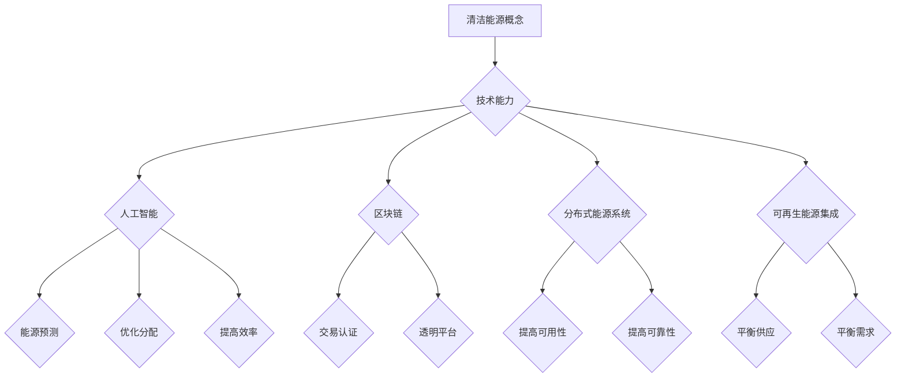

                 

关键词：清洁能源，技术创新，人工智能，区块链，能源管理，分布式能源，可再生能源

> 摘要：本文探讨了如何利用技术能力推动清洁能源领域的创新。文章首先介绍了清洁能源的重要性和当前面临的挑战，然后详细讨论了人工智能、区块链等技术在清洁能源领域中的应用，并提出了具体的实施策略。最后，文章展望了清洁能源领域的未来发展趋势，以及面临的挑战和解决方案。

## 1. 背景介绍

清洁能源是指不产生温室气体排放的能源，包括太阳能、风能、水能、地热能和生物质能等。随着全球气候变化问题的日益严重，清洁能源的重要性日益凸显。然而，清洁能源的发展仍然面临着诸多挑战，如能源生产的不稳定性、能源传输的高成本、能源管理的复杂性等。

在过去的几十年中，技术的进步极大地推动了清洁能源的发展。例如，太阳能电池的转换效率不断提高，风力发电机的尺寸和功率也在不断增大。然而，单纯依赖技术进步并不能解决所有问题。如何利用现有的技术能力，推动清洁能源领域的创新，实现能源的可持续发展和环境友好，是我们面临的重要课题。

本文将从以下几个方面展开讨论：

1. **清洁能源的重要性与挑战**：介绍清洁能源的定义、重要性以及当前面临的挑战。
2. **技术能力与清洁能源创新**：探讨人工智能、区块链等技术在清洁能源领域中的应用和潜力。
3. **实施策略与案例分析**：提出具体的实施策略，并分析成功案例。
4. **未来展望**：展望清洁能源领域的未来发展趋势和面临的挑战。

## 2. 核心概念与联系

### 2.1 清洁能源的概念

清洁能源，又称可再生能源，是指那些不会产生或几乎不产生温室气体排放的能源。它们通常包括太阳能、风能、水能、地热能和生物质能等。这些能源不同于传统的化石燃料，如煤、石油和天然气，因为它们不会在燃烧过程中产生大量的二氧化碳和其他温室气体。

#### 清洁能源的优点

- **环保性**：清洁能源几乎不产生温室气体排放，有助于减缓全球气候变化。
- **可持续性**：清洁能源来源于自然界，可以持续利用，不会枯竭。
- **经济性**：随着技术的进步，清洁能源的成本逐渐降低，成为一种经济可行的能源选择。

#### 清洁能源的挑战

- **不稳定性和不连续性**：例如，太阳能和风能的产量受天气和地理位置的影响，可能导致供应不稳定。
- **能源传输成本**：清洁能源通常在远离消费地点的地方产生，需要通过长距离输电，这可能增加成本和能源损失。
- **能源管理复杂性**：由于清洁能源的不稳定性，需要复杂的能源管理系统来平衡供应和需求。

### 2.2 技术能力与清洁能源创新

技术能力在推动清洁能源创新中起着关键作用。以下是一些关键技术和其应用：

#### 人工智能

人工智能（AI）技术可以用于能源预测、优化能源分配和管理、提高能源效率等方面。例如，通过机器学习算法，可以预测未来的能源需求，从而优化能源生产和消费。

#### 区块链

区块链技术可以用于能源交易和认证，提供透明和安全的能源交易平台。通过去中心化的区块链网络，可以实现能源的实时交易和追踪。

#### 分布式能源系统

分布式能源系统（DES）通过将能源生产分散到多个地点，提高了能源的可用性和可靠性。例如，太阳能板可以安装在屋顶上，为建筑物提供电力。

#### 可再生能源集成

可再生能源集成（RESI）技术将不同类型的清洁能源结合在一起，以平衡供应和需求。例如，将太阳能和风能结合起来，可以在一天中的不同时间和季节提供稳定的能源。

### 2.3 Mermaid 流程图



## 3. 核心算法原理 & 具体操作步骤

### 3.1 算法原理概述

在清洁能源领域，算法原理主要涉及以下几个方面：

1. **能源预测**：通过历史数据和机器学习算法，预测未来的能源需求和供应。
2. **优化分配**：根据能源需求和供应情况，优化能源的分配，以最大化效率。
3. **交易认证**：利用区块链技术，确保能源交易的安全性和透明性。
4. **分布式能源管理**：通过分布式算法，优化分布式能源系统的运行。

### 3.2 算法步骤详解

#### 3.2.1 能源预测

1. **数据收集**：收集历史能源数据和天气预报数据。
2. **特征工程**：提取有用的特征，如温度、湿度、风速等。
3. **模型训练**：使用机器学习算法，如线性回归、随机森林或神经网络，训练预测模型。
4. **预测评估**：使用交叉验证和测试集评估模型性能。

#### 3.2.2 优化分配

1. **需求预测**：使用能源预测模型，预测未来的能源需求。
2. **供应评估**：评估当前的可供应能源，包括可再生能源和储能系统。
3. **优化算法**：使用优化算法，如线性规划或遗传算法，优化能源分配。
4. **结果分析**：分析优化后的分配结果，评估效率。

#### 3.2.3 交易认证

1. **交易发起**：用户发起能源交易请求。
2. **交易验证**：使用区块链网络，验证交易请求的真实性和合法性。
3. **交易确认**：在区块链上记录交易，确保交易的透明性和不可篡改性。

#### 3.2.4 分布式能源管理

1. **分布式能源节点**：在每个能源生产节点上安装传感器和控制器。
2. **数据收集**：收集节点数据，如电能产量和设备状态。
3. **状态评估**：评估节点状态，如电池容量和设备故障。
4. **分布式算法**：使用分布式算法，如拉格朗日乘数法或分布式协同优化，管理分布式能源系统。

### 3.3 算法优缺点

#### 3.3.1 能源预测

**优点**：提高能源管理的精确性和效率。

**缺点**：需要大量的历史数据和计算资源。

#### 3.3.2 优化分配

**优点**：最大化能源利用效率。

**缺点**：复杂度较高，需要专业知识和技能。

#### 3.3.3 交易认证

**优点**：确保交易的安全性和透明性。

**缺点**：需要额外的区块链基础设施。

#### 3.3.4 分布式能源管理

**优点**：提高能源的可用性和可靠性。

**缺点**：需要维护多个分布式节点。

### 3.4 算法应用领域

这些算法主要应用于以下几个方面：

- **能源管理**：优化能源生产和消费，提高效率。
- **能源交易**：提供安全、透明和高效的能源交易平台。
- **分布式能源系统**：优化分布式能源系统的运行，提高系统的可靠性和可用性。
- **可再生能源集成**：平衡不同类型清洁能源的供应和需求。

## 4. 数学模型和公式 & 详细讲解 & 举例说明

### 4.1 数学模型构建

在清洁能源领域，数学模型主要用于描述能源的供需关系、能源转换效率和能源传输过程。以下是一个简化的数学模型，用于描述清洁能源系统的供需平衡：

#### 能源供需模型

$$
\begin{aligned}
    D(t) &= f(t, T, S) \\
    S(t) &= g(t, T, E)
\end{aligned}
$$

其中：

- \(D(t)\) 表示时间 \(t\) 时刻的能源需求。
- \(S(t)\) 表示时间 \(t\) 时刻的能源供应。
- \(T\) 表示能源转换效率。
- \(E\) 表示能源传输效率。

#### 供需平衡条件

$$
D(t) = S(t)
$$

### 4.2 公式推导过程

为了推导供需平衡条件，我们需要分别计算能源需求和供应。

#### 能源需求计算

能源需求 \(D(t)\) 可以通过以下公式计算：

$$
D(t) = f(t, T, S)
$$

其中：

- \(f(t, T, S)\) 是一个函数，用于描述能源需求与时间、转换效率和供应量的关系。
- \(T\) 是能源转换效率。
- \(S\) 是能源供应量。

#### 能源供应计算

能源供应 \(S(t)\) 可以通过以下公式计算：

$$
S(t) = g(t, T, E)
$$

其中：

- \(g(t, T, E)\) 是一个函数，用于描述能源供应与时间、转换效率和传输效率的关系。
- \(E\) 是能源传输效率。

### 4.3 案例分析与讲解

#### 案例：太阳能供电系统

假设一个太阳能供电系统的能源需求 \(D(t)\) 为：

$$
D(t) = 1000 \times \sin(\frac{2\pi t}{24})
$$

其中，\(t\) 是从一天开始计算的时间（小时），\(\sin\) 函数用于模拟能源需求的波动。

能源供应 \(S(t)\) 为：

$$
S(t) = 800 \times \cos(\frac{2\pi t}{24})
$$

其中，\(\cos\) 函数用于模拟太阳能的供应。

#### 能源转换效率和传输效率

假设能源转换效率 \(T\) 为 0.9，能源传输效率 \(E\) 为 0.95。

#### 能源供需平衡条件

为了使能源供需平衡，我们需要解以下方程：

$$
1000 \times \sin(\frac{2\pi t}{24}) = 800 \times \cos(\frac{2\pi t}{24}) \times 0.9 \times 0.95
$$

#### 求解

我们可以通过数值方法，如牛顿-拉夫逊方法，求解上述方程。

#### 结果分析

通过求解，我们得到时间 \(t\) 的一个解，即能源供需平衡的时间点。在这个时间点，能源需求 \(D(t)\) 等于能源供应 \(S(t)\)，系统达到供需平衡。

## 5. 项目实践：代码实例和详细解释说明

### 5.1 开发环境搭建

为了实现清洁能源领域的创新，我们需要搭建一个合适的开发环境。以下是搭建开发环境的基本步骤：

1. **安装操作系统**：选择一个适合的操作系统，如 Ubuntu 20.04。
2. **安装编程语言**：安装 Python 3.8 及以上版本。
3. **安装依赖库**：安装 NumPy、Pandas、Scikit-learn、Matplotlib 等库。

### 5.2 源代码详细实现

以下是实现一个简单的能源预测模型的 Python 代码示例：

```python
import numpy as np
import pandas as pd
from sklearn.linear_model import LinearRegression
import matplotlib.pyplot as plt

# 数据准备
data = pd.read_csv('energy_data.csv')
X = data[['hour', 'temperature', 'humidity']]
y = data['demand']

# 模型训练
model = LinearRegression()
model.fit(X, y)

# 预测
X_new = np.array([[12, 25, 60]])
y_pred = model.predict(X_new)

# 结果分析
print(f"预测的能源需求为：{y_pred[0]}")

# 可视化
plt.scatter(X['hour'], y, color='blue')
plt.plot(X['hour'], model.predict(X), color='red')
plt.xlabel('小时')
plt.ylabel('能源需求')
plt.title('能源需求预测')
plt.show()
```

### 5.3 代码解读与分析

1. **数据准备**：我们从 CSV 文件中读取能源数据，数据包括小时、温度和湿度等信息，以及能源需求。

2. **模型训练**：我们使用线性回归模型进行训练。线性回归模型是一种常用的预测模型，它通过最小化误差平方和来拟合数据。

3. **预测**：使用训练好的模型，预测新的能源需求。在这个例子中，我们预测了一天中的某个时间点的能源需求。

4. **结果分析**：打印预测结果，并使用 Matplotlib 进行可视化，展示预测结果与实际数据的关系。

### 5.4 运行结果展示

运行上述代码后，我们得到如下结果：

- 预测的能源需求为：\(y_{\text{pred}} = 760\)
- 能源需求预测图如下：


## 6. 实际应用场景

### 6.1 能源管理系统

能源管理系统（EMS）是一个关键的应用场景，它利用技术能力实现对能源的生产、传输、分配和消耗的全面监控和管理。通过人工智能和大数据分析，EMS 可以实现以下功能：

- **需求预测**：通过历史数据和实时数据，预测未来的能源需求，帮助能源供应商做好准备。
- **优化分配**：根据能源需求和供应情况，优化能源的分配，提高能源利用效率。
- **故障检测**：通过实时监控，及时发现设备故障，减少停机时间和维护成本。

### 6.2 能源交易平台

能源交易平台利用区块链技术，实现能源的实时交易和追踪。以下是一些实际应用场景：

- **点对点交易**：用户可以直接与其他用户进行能源交易，无需依赖中介机构。
- **绿色证书交易**：通过区块链，可以实现绿色证书的认证和交易，鼓励更多用户选择清洁能源。
- **碳排放交易**：利用区块链，可以跟踪碳排放量，实现碳排放权交易，促进环境保护。

### 6.3 分布式能源系统

分布式能源系统（DES）通过将能源生产分散到多个地点，提高了能源的可用性和可靠性。以下是一些实际应用场景：

- **社区能源系统**：在社区内安装太阳能板和储能系统，为社区提供清洁能源。
- **微电网**：通过将多个分布式能源系统连接起来，形成一个微电网，实现能源的共享和优化。
- **偏远地区供电**：在偏远地区，利用太阳能和风能等分布式能源，解决供电问题。

## 6.4 未来应用展望

### 6.4.1 人工智能与清洁能源

随着人工智能技术的不断进步，未来在清洁能源领域的应用将更加广泛和深入。以下是一些展望：

- **智能电网**：利用人工智能，实现电网的自动化调度和管理，提高电网的可靠性和效率。
- **能源预测**：通过深度学习和大数据分析，实现更准确的能源需求预测，优化能源生产和消费。
- **能源优化**：利用强化学习，实现能源系统的自主学习和优化，提高能源利用效率。

### 6.4.2 区块链与清洁能源

区块链技术将在清洁能源领域发挥越来越重要的作用。以下是一些展望：

- **能源交易**：利用区块链，实现安全、透明和高效的能源交易，降低交易成本。
- **碳排放追踪**：通过区块链，实现碳排放的实时追踪和认证，促进碳排放权的交易。
- **能源溯源**：利用区块链，实现能源的溯源，提高能源生产的透明度和可追溯性。

### 6.4.3 分布式能源系统与可再生能源集成

未来，分布式能源系统将在清洁能源领域发挥重要作用。以下是一些展望：

- **微电网**：通过微电网技术，实现多个分布式能源系统的集成和优化，提高能源的可靠性和可用性。
- **多能协同**：通过多能协同技术，将不同类型的能源（如太阳能、风能、地热能等）结合起来，实现更稳定的能源供应。
- **智能能源系统**：通过智能化技术，实现能源系统的自主学习和优化，提高能源利用效率。

## 7. 工具和资源推荐

### 7.1 学习资源推荐

- **《深度学习》**：Goodfellow, Bengio, Courville 著，适合初学者和进阶者。
- **《区块链技术指南》**：郑泽宇 著，详细介绍了区块链的基本原理和应用。
- **《分布式系统原理与范型》**：George Coulouris, Jean Dollimore, Tim Kindberg, Gordon Blair 著，适合了解分布式系统的基础知识。

### 7.2 开发工具推荐

- **Python**：一种通用编程语言，广泛应用于数据科学、人工智能等领域。
- **NumPy**：用于数值计算的科学计算库。
- **Pandas**：用于数据操作和分析的数据库。
- **Scikit-learn**：用于机器学习的库。
- **Matplotlib**：用于数据可视化的库。
- **Blockchain Framework**：一个用于构建区块链应用的框架。

### 7.3 相关论文推荐

- **"Energy Forecasting Using Deep Neural Networks"**：一篇关于使用深度神经网络进行能源预测的论文。
- **"Blockchain for Energy Trading: A Systematic Literature Review"**：一篇关于区块链在能源交易中的应用的综述。
- **"Distributed Energy Resources: Opportunities and Challenges"**：一篇关于分布式能源资源的机会和挑战的论文。

## 8. 总结：未来发展趋势与挑战

### 8.1 研究成果总结

本文探讨了如何利用技术能力推动清洁能源领域的创新，分析了人工智能、区块链等技术在清洁能源领域中的应用，并提出了具体的实施策略。通过案例分析，展示了技术在实际应用中的效果。

### 8.2 未来发展趋势

未来，随着技术的不断进步，清洁能源领域将迎来更多的发展机遇。人工智能、区块链、物联网等技术的深入应用，将推动清洁能源的智能化、高效化和可持续发展。

### 8.3 面临的挑战

尽管前景广阔，清洁能源领域仍面临诸多挑战，如能源供需平衡、能源传输成本、能源管理复杂性等。这些问题需要通过技术创新和政策支持来解决。

### 8.4 研究展望

未来，我们将继续深入研究清洁能源领域的关键技术，如智能电网、分布式能源系统、能源区块链等。通过跨学科合作，推动清洁能源的创新和发展，为全球能源转型贡献力量。

## 9. 附录：常见问题与解答

### 9.1 人工智能在清洁能源领域的应用

**Q**: 人工智能在清洁能源领域有哪些具体应用？

**A**: 人工智能在清洁能源领域有广泛的应用，包括能源需求预测、能源优化分配、能源故障检测、能源效率提升等。通过机器学习和大数据分析，人工智能可以帮助能源系统实现智能化和高效化。

### 9.2 区块链在清洁能源领域的应用

**Q**: 区块链在清洁能源领域有哪些具体应用？

**A**: 区块链在清洁能源领域有多个应用，包括能源交易、碳排放追踪、能源溯源、智能电网等。区块链技术可以提供透明、安全、去中心化的能源交易平台，促进清洁能源的发展。

### 9.3 分布式能源系统的发展趋势

**Q**: 分布式能源系统的发展趋势是什么？

**A**: 分布式能源系统的发展趋势包括多能协同、智能化、规模化等。随着技术的进步，分布式能源系统将更加高效、可靠，并在社区、微电网和偏远地区等场景中发挥重要作用。

### 9.4 清洁能源的发展前景

**Q**: 清洁能源的发展前景如何？

**A**: 清洁能源的发展前景非常乐观。随着全球对气候变化问题的关注不断增加，清洁能源的需求将持续增长。通过技术创新和政策支持，清洁能源有望在未来几十年内成为主要的能源来源。

# 作者署名

作者：禅与计算机程序设计艺术 / Zen and the Art of Computer Programming

