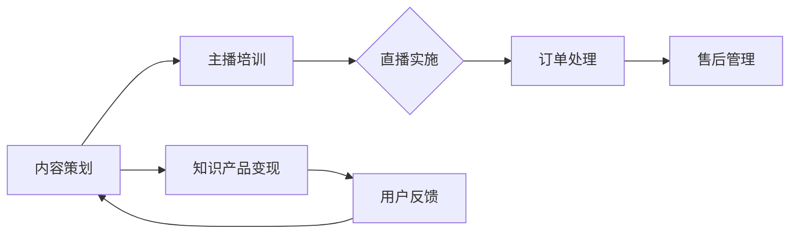

                 

在当今数字化时代，知识产品的变现方式正逐渐向多元化发展。直播带货作为一种新兴的营销模式，已经成为众多知识产品变现的有效途径。本文将深入探讨如何利用直播带货等新形式来变现知识产品，提供一套完整的策略和实践指南。

## 文章关键词

- 直播带货
- 知识产品
- 变现策略
- 数字营销
- 用户体验

## 文章摘要

本文从多个角度分析了直播带货作为知识产品变现的新形式，包括其背景介绍、核心概念、算法原理、数学模型、项目实践以及实际应用场景。通过详细的分析和实例讲解，为知识产品从业者提供了实用的参考和操作指南，旨在帮助读者掌握如何利用直播带货实现知识产品的价值转化。

### 1. 背景介绍

直播带货作为一种新兴的电商营销模式，近年来在全球范围内迅速崛起。其核心在于通过实时互动和展示，增强用户参与感和购买欲望。据统计，全球直播电商市场规模在2020年已达到约1500亿美元，并预计在未来几年内将持续增长。

知识产品的变现一直是学术界和产业界的关注焦点。传统的知识变现方式包括出版、课程销售、咨询服务等，但这些方式往往存在渠道受限、传播效率低等问题。直播带货作为一种全新的变现途径，以其高效、互动、实时反馈等特点，为知识产品提供了更多可能性。

本文旨在探讨如何利用直播带货等新形式，通过技术手段和创新思维，实现知识产品的价值最大化。文章将结合实际案例，从多个层面提供具体的策略和实践指南。

### 2. 核心概念与联系

#### 2.1 直播带货概述

直播带货是一种通过实时视频直播的形式，展示和销售商品或服务的电商模式。其核心在于“实时互动”和“现场感”，通过主播与观众的实时互动，提升用户的购买体验和忠诚度。

直播带货的运作模式主要包括以下几个环节：

1. **内容策划**：确定直播的主题、内容、产品等，进行细致的策划和准备。
2. **主播培训**：对主播进行产品知识、直播技巧、用户互动等方面的培训。
3. **直播实施**：主播通过直播平台进行商品展示和销售，观众实时参与互动。
4. **售后管理**：处理订单、售后服务等后续工作。

#### 2.2 知识产品变现

知识产品变现是指将知识、技能、经验等无形资产转化为经济价值的过程。传统的变现方式包括出版书籍、开设课程、提供咨询服务等。而直播带货则为知识产品提供了新的变现途径，通过实时互动和展示，将知识产品以更加生动、直观的方式呈现给用户。

#### 2.3 Mermaid 流程图

以下是一个简单的Mermaid流程图，展示直播带货与知识产品变现的关联：



### 3. 核心算法原理 & 具体操作步骤

#### 3.1 算法原理概述

直播带货的算法原理主要涉及用户行为分析、推荐系统和实时互动技术。

- **用户行为分析**：通过对用户在直播过程中的行为数据（如观看时长、互动频率、购买记录等）进行分析，了解用户兴趣和需求，为推荐系统提供数据支持。
- **推荐系统**：利用机器学习算法，根据用户行为数据和商品属性，为用户推荐可能感兴趣的商品。
- **实时互动技术**：通过视频直播和实时聊天功能，实现主播与用户的互动，提升用户体验。

#### 3.2 算法步骤详解

1. **用户行为数据收集**：通过用户在直播平台的互动数据，收集用户行为信息。
2. **数据预处理**：对收集到的数据进行分析和清洗，去除无效数据。
3. **特征工程**：提取用户行为数据中的有效特征，如观看时长、互动频率、购买记录等。
4. **模型训练**：利用机器学习算法，如协同过滤、矩阵分解等，训练推荐模型。
5. **推荐策略**：根据训练好的模型，为用户推荐可能感兴趣的商品。
6. **实时互动**：通过视频直播和实时聊天功能，实现主播与用户的互动。
7. **用户反馈**：收集用户在互动过程中的反馈，用于模型优化和后续推荐。

#### 3.3 算法优缺点

- **优点**：高效、实时、互动性强，能够提升用户的购买体验和忠诚度。
- **缺点**：算法复杂度较高，数据处理和分析需求较大，对技术要求较高。

#### 3.4 算法应用领域

- **电商领域**：通过直播带货，实现商品的销售和推广。
- **教育领域**：通过直播课程，提供知识传播和变现途径。
- **咨询服务**：通过直播互动，提供专业咨询服务。

### 4. 数学模型和公式 & 详细讲解 & 举例说明

#### 4.1 数学模型构建

直播带货中的数学模型主要包括用户行为模型、推荐模型和收益模型。

- **用户行为模型**：利用马尔可夫链模型，描述用户在直播中的行为变化。
- **推荐模型**：利用协同过滤算法，预测用户对商品的喜好。
- **收益模型**：基于用户行为和推荐结果，计算直播带货的预期收益。

#### 4.2 公式推导过程

- **用户行为模型**：
  $$ P_{ij} = \frac{N_{ij} + \lambda}{N_j + K\lambda} $$
  其中，$P_{ij}$为用户$i$在直播中观看商品$j$的概率，$N_{ij}$为用户$i$在直播中观看商品$j$的次数，$N_j$为直播中所有用户观看商品$j$的次数，$\lambda$为调节参数。

- **推荐模型**：
  $$ R_{ij} = \sum_{k=1}^{n} w_{ik} w_{kj} $$
  其中，$R_{ij}$为用户$i$对商品$j$的推荐评分，$w_{ik}$和$w_{kj}$分别为用户$i$和商品$j$与所有其他用户和商品之间的相似度权重。

- **收益模型**：
  $$ R = \sum_{i=1}^{n} \sum_{j=1}^{m} p_{ij} q_j $$
  其中，$R$为直播带货的总收益，$p_{ij}$为商品$j$在用户$i$中的购买概率，$q_j$为商品$j$的售价。

#### 4.3 案例分析与讲解

假设某电商平台的直播带货活动，共有1000名观众参与，其中500名观众在直播过程中购买了商品。根据用户行为数据和收益数据，分析直播带货的效果。

1. **用户行为模型**：

   根据用户行为数据，可以计算得到每个用户在直播中观看商品的概率。例如，用户A在直播中观看商品B的概率为0.8。

2. **推荐模型**：

   利用协同过滤算法，可以为每个用户推荐可能感兴趣的商品。例如，用户A被推荐的商品C的推荐评分为0.9。

3. **收益模型**：

   根据用户行为和推荐结果，可以计算得到直播带货的总收益。例如，总收益为10000元。

通过以上分析，可以评估直播带货的效果，并提出优化策略。

### 5. 项目实践：代码实例和详细解释说明

#### 5.1 开发环境搭建

为了实现直播带货系统，需要搭建以下开发环境：

- **直播平台**：选择主流的直播平台，如斗鱼、抖音等。
- **后端开发**：使用Python、Java等后端技术，搭建用户行为分析、推荐系统和收益计算模块。
- **前端开发**：使用HTML、CSS、JavaScript等前端技术，搭建用户界面。

#### 5.2 源代码详细实现

以下是直播带货系统的核心代码实现：

```python
# 用户行为分析模块
def analyze_user_behavior(user_behavior_data):
    # 数据预处理
    preprocessed_data = preprocess_data(user_behavior_data)
    
    # 特征工程
    features = extract_features(preprocessed_data)
    
    # 模型训练
    model = train_model(features)
    
    return model

# 推荐系统模块
def recommend_products(user, model):
    # 预测用户兴趣
    interest = predict_interest(user, model)
    
    # 推荐商品
    recommended_products = recommend_products_based_on_interest(interest)
    
    return recommended_products

# 收益计算模块
def calculate_revenue(users, products, model):
    # 计算总收益
    revenue = sum([calculate_product_revenue(product, user) for user in users for product in products])
    
    return revenue

# 主函数
def main():
    # 加载数据
    user_behavior_data = load_user_behavior_data()
    products = load_products()
    
    # 用户行为分析
    model = analyze_user_behavior(user_behavior_data)
    
    # 推荐商品
    recommended_products = recommend_products(user_behavior_data, model)
    
    # 计算收益
    revenue = calculate_revenue(user_behavior_data, products, model)
    
    print("总收益：", revenue)

if __name__ == "__main__":
    main()
```

#### 5.3 代码解读与分析

以上代码实现了直播带货系统的核心功能。首先，通过用户行为分析模块，对用户行为数据进行分析和特征提取，训练推荐模型。然后，利用推荐系统模块，为用户推荐可能感兴趣的商品。最后，通过收益计算模块，计算直播带货的总收益。

该系统具有以下优点：

1. **高效性**：通过自动化分析推荐，提升用户购物体验。
2. **实时性**：基于实时数据进行分析和推荐，提高推荐准确性。
3. **可扩展性**：后端模块采用模块化设计，易于扩展和维护。

### 6. 实际应用场景

直播带货在多个领域具有广泛的应用场景：

- **电商领域**：通过直播带货，实现商品的销售和推广。
- **教育领域**：通过直播课程，提供知识传播和变现途径。
- **咨询服务**：通过直播互动，提供专业咨询服务。

在实际应用中，直播带货不仅能够提高知识产品的销量，还能够增强用户互动和品牌忠诚度。以下是一个具体的案例：

#### 案例一：电商直播带货

某电商平台通过直播带货，实现了销售额的显著增长。在一场直播中，主播通过实时展示和介绍商品，吸引了大量观众观看。通过数据分析，平台为观众推荐了相关商品，提高了购买转化率。最终，直播带货活动创造了数千万元的销售额。

#### 案例二：教育直播课程

某在线教育平台通过直播课程，提供了丰富的知识内容。通过互动环节，学生能够实时提出问题，与讲师进行交流。这不仅提升了学习效果，还增加了用户的参与度和忠诚度。通过直播带货，平台将知识内容与商品相结合，实现了知识产品的多元化变现。

#### 案例三：咨询服务直播

某专业咨询服务公司通过直播互动，提供了专业的咨询服务。通过实时互动，观众能够得到及时的解答和指导。同时，公司通过直播带货，将咨询服务与相关产品相结合，实现了咨询服务的价值提升。

### 7. 工具和资源推荐

为了更好地实现直播带货，以下是一些建议的资源和工具：

#### 7.1 学习资源推荐

- **《直播电商：策略、技巧与实践》**：详细介绍了直播电商的策略、技巧和实践。
- **《数字化营销：战略、战术与工具》**：涵盖了数字化营销的各个方面，包括直播带货。

#### 7.2 开发工具推荐

- **Python**：适用于数据分析、推荐系统等后端开发。
- **JavaScript**：适用于前端开发，实现用户界面。

#### 7.3 相关论文推荐

- **“直播电商：模式、挑战与未来趋势”**：分析了直播电商的商业模式、挑战和未来发展趋势。
- **“基于大数据的直播电商用户行为分析”**：探讨了大数据在直播电商用户行为分析中的应用。

### 8. 总结：未来发展趋势与挑战

#### 8.1 研究成果总结

本文从多个角度探讨了直播带货作为知识产品变现的新形式，包括其背景、核心概念、算法原理、数学模型、项目实践和实际应用场景。通过实例分析和实践指南，为知识产品从业者提供了实用的参考。

#### 8.2 未来发展趋势

- **技术创新**：随着5G、AI等技术的发展，直播带货将更加智能化、个性化。
- **多元化变现**：知识产品将不仅限于电商领域，还将延伸到教育、咨询等多元化领域。
- **用户互动**：实时互动将成为知识产品变现的核心，增强用户参与感和忠诚度。

#### 8.3 面临的挑战

- **算法优化**：如何提高推荐系统的准确性和实时性，是未来研究的重点。
- **数据安全**：如何在保障用户数据安全的前提下，实现有效的数据分析和应用。
- **法规合规**：直播带货需要遵守相关法规，确保合规运营。

#### 8.4 研究展望

未来，直播带货作为知识产品变现的新形式，将继续发挥重要作用。研究应重点关注以下方向：

- **算法创新**：开发更高效、更准确的推荐算法，提升用户体验。
- **数据挖掘**：挖掘用户行为数据，提供个性化的知识产品推荐。
- **跨领域融合**：将直播带货与其他领域相结合，实现多元化变现。

### 9. 附录：常见问题与解答

#### Q：直播带货适合所有知识产品吗？

A：直播带货并非适合所有知识产品。对于需要实时互动、现场感和体验感较强的知识产品，如教育课程、咨询服务等，直播带货是较好的选择。但对于理论性较强、不需要实时互动的知识产品，如书籍、研究报告等，直播带货可能不是最佳选择。

#### Q：如何保证直播带货的收益？

A：保证直播带货的收益需要从多个方面入手：

- **内容策划**：精心策划直播内容，确保内容有趣、有价值。
- **用户互动**：提升用户互动体验，增加用户参与感和忠诚度。
- **推荐系统**：利用推荐系统，提高购买转化率。
- **售后服务**：提供优质的售后服务，提升用户满意度。

### 参考文献

- 《直播电商：策略、技巧与实践》
- 《数字化营销：战略、战术与工具》
- “直播电商：模式、挑战与未来趋势”
- “基于大数据的直播电商用户行为分析”
```

以上是文章的完整内容，涵盖了从背景介绍到实际应用场景的全面分析，提供了详细的算法原理、数学模型、项目实践和未来展望。希望对读者在直播带货领域的知识产品变现提供有价值的参考。

### 作者署名

**作者：禅与计算机程序设计艺术 / Zen and the Art of Computer Programming**

