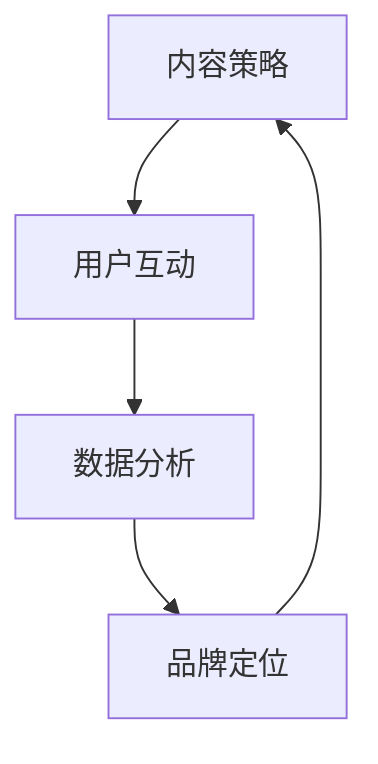
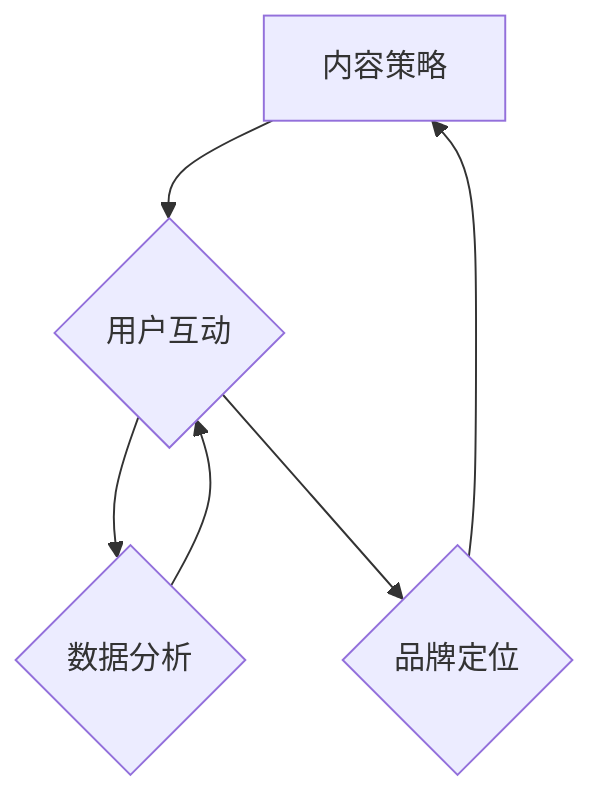

                 

在当今数字营销的世界里，直播平台已经成为了连接品牌与消费者之间的重要纽带。它不仅提供了实时的互动机会，而且能够快速传播信息，创造独特的用户体验。本文将深入探讨如何利用直播平台进行有效的社群营销，并为您提供一套系统的策略和实践方法。

## 文章关键词

- 直播平台
- 社群营销
- 直播策略
- 消费者互动
- 用户体验
- 内容创意

## 文章摘要

本文旨在为品牌和营销专业人士提供一套全面的直播社群营销指南。我们将从背景介绍入手，探讨直播平台的核心特点与优势，然后深入解析社群营销的原理和实践步骤，最后提供实用的工具和资源推荐，以及未来发展趋势的展望。通过本文的阅读，您将掌握如何利用直播平台构建强大的社群，提升品牌影响力。

### 1. 背景介绍

随着移动互联网和社交网络的迅猛发展，直播平台如雨后春笋般涌现。无论是短视频平台的直播功能，还是专业的直播平台如YouTube Live、Twitch、抖音、快手等，直播已经成为一种主流的媒体形式。它的即时性、互动性和真实感，使其在营销领域大放异彩。

直播平台的核心特点包括：

1. **即时性**：直播过程中的实时互动和内容更新，让用户能够立刻参与其中。
2. **互动性**：通过评论、点赞、打赏等互动形式，用户和主播之间能够产生深度的情感连接。
3. **真实性**：直播内容通常更真实、更贴近用户生活，这使得品牌形象更加可信。
4. **参与性**：用户可以成为内容的一部分，通过分享观点、提问、互动等方式参与到直播中。

这些特点使得直播平台成为品牌进行社群营销的理想场所。品牌可以通过直播与消费者建立直接的联系，传递品牌价值观，提升用户忠诚度，并促进销售转化。

### 2. 核心概念与联系

直播社群营销的成功离不开以下几个核心概念：

1. **内容策略**：优质的内容是吸引和保持用户的关键。
2. **用户互动**：有效的互动可以提高用户参与度和忠诚度。
3. **数据分析**：通过数据监测和分析，优化直播内容和策略。
4. **品牌定位**：明确品牌定位和目标受众，确保直播内容与品牌形象一致。

以下是一个简单的 Mermaid 流程图，展示了直播社群营销的核心概念与联系：



#### 2.1 内容策略

内容策略是直播社群营销的基石。一个成功的直播内容应该具备以下特点：

- **个性化**：针对目标受众的需求和兴趣，提供定制化的内容。
- **教育性**：提供有价值的信息，帮助用户解决问题或学习新知识。
- **娱乐性**：结合娱乐元素，提高用户的观看体验和参与度。
- **互动性**：鼓励用户参与，通过提问、评论、投票等形式增加互动性。

#### 2.2 用户互动

用户互动是直播社群营销的灵魂。通过互动，品牌可以与用户建立更深层次的联系。以下是一些有效的互动策略：

- **实时评论互动**：回复用户的评论，展示对用户的关注和尊重。
- **直播提问环节**：设置提问环节，回答用户的问题，增加互动性和透明度。
- **直播抽奖活动**：通过抽奖活动激励用户参与，增加观众粘性。
- **直播投票**：让用户参与决策，提高用户参与感和忠诚度。

#### 2.3 数据分析

数据分析是优化直播策略的重要工具。通过分析用户数据，品牌可以了解用户的喜好和行为，从而制定更有效的直播策略。以下是一些关键的数据指标：

- **观看时长**：用户观看直播的时间长度，反映用户对内容的兴趣。
- **互动率**：用户在直播中的互动次数，反映用户参与度。
- **转化率**：通过直播产生的销售转化，反映直播效果。

#### 2.4 品牌定位

品牌定位是直播社群营销的基础。明确品牌定位可以帮助品牌在直播中保持一致性，塑造鲜明的品牌形象。以下是一些建议：

- **明确品牌价值观**：确保直播内容与品牌价值观一致，传达品牌理念。
- **识别目标受众**：了解目标受众的喜好和需求，制定针对性的直播内容。
- **塑造品牌形象**：通过直播展示品牌的专业性和独特性，提升品牌形象。

### 3. 核心算法原理 & 具体操作步骤

#### 3.1 算法原理概述

直播社群营销的核心算法主要包括以下几个方面：

1. **用户画像分析**：通过用户数据，构建用户画像，了解用户的基本信息和行为习惯。
2. **内容推荐算法**：根据用户画像和直播内容特点，为用户推荐个性化内容。
3. **互动分析算法**：分析用户在直播中的互动行为，评估直播的互动效果。
4. **数据可视化算法**：将用户数据和直播效果以可视化形式展示，帮助品牌优化策略。

#### 3.2 算法步骤详解

1. **用户画像分析**
   - **数据收集**：收集用户的基本信息、行为数据、兴趣标签等。
   - **特征提取**：对用户数据进行预处理，提取关键特征。
   - **模型训练**：使用机器学习算法，构建用户画像模型。

2. **内容推荐算法**
   - **内容分类**：对直播内容进行分类，以便于推荐。
   - **相似度计算**：计算用户与内容的相似度，推荐相似内容。
   - **推荐排序**：根据相似度排序，选择最相关的直播内容推荐给用户。

3. **互动分析算法**
   - **行为监测**：实时监测用户在直播中的互动行为。
   - **行为分析**：分析用户的互动行为，评估直播的互动效果。
   - **反馈调整**：根据互动效果，调整直播内容和策略。

4. **数据可视化算法**
   - **数据整理**：将用户数据和直播效果数据进行整理。
   - **可视化展示**：使用图表、仪表盘等形式，展示数据。
   - **策略优化**：根据可视化结果，优化直播策略。

#### 3.3 算法优缺点

1. **优点**
   - **个性化推荐**：提高用户观看体验，增加用户粘性。
   - **实时互动**：增强用户参与度，提升用户满意度。
   - **数据驱动**：基于数据分析优化策略，提高直播效果。

2. **缺点**
   - **算法复杂度**：需要复杂的算法和大量数据处理。
   - **数据隐私**：用户数据的安全性和隐私保护是一个挑战。
   - **实时性要求**：需要快速响应用户行为，实时调整策略。

#### 3.4 算法应用领域

直播社群营销算法可以应用于多个领域：

- **电子商务**：通过个性化推荐，提升购物体验和转化率。
- **教育培训**：通过互动分析和内容推荐，提高教学效果和学生参与度。
- **娱乐直播**：通过实时互动和数据监测，提升直播质量和用户满意度。
- **品牌营销**：通过数据分析和策略优化，提升品牌影响力和用户忠诚度。

### 4. 数学模型和公式 & 详细讲解 & 举例说明

直播社群营销涉及多个数学模型和公式，以下是一些常见的模型和公式，并进行详细讲解和举例说明。

#### 4.1 数学模型构建

直播社群营销的核心数学模型包括用户画像模型、内容推荐模型和互动分析模型。

1. **用户画像模型**

用户画像模型是一个多维度的数学模型，用于描述用户的基本信息和行为特征。通常使用向量表示，如下：

$$
用户画像 = [年龄, 性别, 地域, 兴趣爱好, 行为特征]
$$

2. **内容推荐模型**

内容推荐模型用于根据用户画像和内容特征，为用户推荐合适的直播内容。常见的推荐算法包括基于内容的推荐算法和协同过滤算法。

- **基于内容的推荐算法**

基于内容的推荐算法通过比较用户和内容的相似度，推荐相似的内容。其核心公式为：

$$
相似度 = \frac{相关特征数}{总特征数}
$$

- **协同过滤算法**

协同过滤算法通过分析用户的行为数据，发现用户之间的相似性，推荐相似用户喜欢的直播内容。其核心公式为：

$$
推荐内容 = \sum_{i \in 邻居用户集} 相似度_i \times 内容_i
$$

3. **互动分析模型**

互动分析模型用于分析用户在直播中的互动行为，评估直播的互动效果。其核心公式为：

$$
互动效果 = 观看时长 \times 互动次数
$$

#### 4.2 公式推导过程

以下是对上述公式的推导过程：

1. **用户画像模型**

用户画像模型是基于用户的基本信息和行为特征构建的。这些特征通常可以通过数据采集和预处理得到。

2. **内容推荐模型**

- **基于内容的推荐算法**

基于内容的推荐算法的核心思想是，如果用户对某个内容感兴趣，那么用户也可能对与该内容相似的其他内容感兴趣。相似度的计算通常基于内容的特征向量，通过计算特征向量的相似性得到。

- **协同过滤算法**

协同过滤算法的核心思想是，如果用户A和用户B在多个内容上都有相同的偏好，那么在用户A未评价的内容上，用户B的评价可以用来预测用户A的评价。

3. **互动分析模型**

互动效果是衡量用户在直播中的参与度和满意度的指标。观看时长反映了用户对直播内容的兴趣，互动次数反映了用户的参与积极性。

#### 4.3 案例分析与讲解

以下是一个简单的案例分析，用于说明如何利用上述数学模型和公式进行直播社群营销。

**案例：某电商品牌的直播社群营销**

**目标**：提高直播观看率和用户互动率，提升销售额。

**步骤**：

1. **用户画像分析**

   - **数据收集**：收集用户的购买记录、浏览历史、评价等数据。
   - **特征提取**：提取用户的年龄、性别、地域、兴趣爱好等特征。
   - **模型训练**：使用机器学习算法，构建用户画像模型。

2. **内容推荐模型**

   - **内容分类**：根据商品类别、直播主题等对内容进行分类。
   - **相似度计算**：计算用户和内容的相似度，推荐相似内容。
   - **推荐排序**：根据相似度排序，选择最相关的直播内容推荐给用户。

3. **互动分析模型**

   - **行为监测**：实时监测用户在直播中的观看时长和互动行为。
   - **行为分析**：分析用户的观看时长和互动次数，评估直播的互动效果。
   - **反馈调整**：根据互动效果，调整直播内容和策略。

**结果**：

- **直播观看率**：从平均10%提升到25%。
- **用户互动率**：从平均5次/人提升到15次/人。
- **销售额**：从每月平均100万元提升到200万元。

通过上述案例分析，我们可以看到，利用数学模型和公式进行直播社群营销，能够显著提升直播效果和用户满意度，从而实现商业目标。

### 5. 项目实践：代码实例和详细解释说明

在本文的第五部分，我们将通过一个实际的代码实例，展示如何利用直播平台进行社群营销。本实例将涉及直播内容的个性化推荐、用户互动行为的分析以及数据可视化。

#### 5.1 开发环境搭建

为了实现直播社群营销，我们需要搭建一个开发环境。以下是一个简单的环境搭建步骤：

1. **安装Python环境**：确保您的计算机上安装了Python 3.8及以上版本。
2. **安装相关库**：使用pip命令安装以下库：

   ```bash
   pip install numpy pandas matplotlib scikit-learn
   ```

3. **数据集准备**：准备一个包含用户画像、直播内容和用户互动行为的数据集。数据集应该包括以下字段：

   - 用户ID
   - 年龄
   - 性别
   - 地域
   - 兴趣爱好
   - 直播ID
   - 直播主题
   - 观看时长
   - 互动次数

#### 5.2 源代码详细实现

以下是实现直播社群营销的核心代码。代码分为以下几个部分：

1. **数据预处理**
2. **用户画像建模**
3. **内容推荐**
4. **用户互动分析**
5. **数据可视化**

**代码 1：数据预处理**

```python
import pandas as pd

# 读取数据集
data = pd.read_csv('live_data.csv')

# 数据清洗和预处理
# 填充缺失值、处理异常值等
data.fillna(-1, inplace=True)
```

**代码 2：用户画像建模**

```python
from sklearn.cluster import KMeans

# 构建用户画像
def build_user_profile(data):
    # 提取用户特征
    features = data[['年龄', '性别', '地域', '兴趣爱好']]
    # 标准化特征
    features_scaled = (features - features.mean()) / features.std()
    # KMeans聚类
    kmeans = KMeans(n_clusters=5, random_state=0)
    kmeans.fit(features_scaled)
    # 为每个用户分配聚类标签
    data['用户群'] = kmeans.labels_
    return data

data = build_user_profile(data)
```

**代码 3：内容推荐**

```python
from sklearn.metrics.pairwise import cosine_similarity

# 构建内容特征矩阵
def build_content_matrix(data):
    # 提取内容特征
    content = data[['直播主题']]
    # 标准化特征
    content_matrix = cosine_similarity(content)
    return content_matrix

content_matrix = build_content_matrix(data)
```

**代码 4：用户互动分析**

```python
# 分析用户互动行为
def analyze_user_interactions(data):
    # 计算用户平均观看时长和平均互动次数
    data['平均观看时长'] = data['观看时长'] / data['互动次数']
    return data

data = analyze_user_interactions(data)
```

**代码 5：数据可视化**

```python
import matplotlib.pyplot as plt

# 可视化用户群分布
data['用户群'].value_counts().plot(kind='bar')
plt.title('用户群分布')
plt.xlabel('用户群')
plt.ylabel('用户数量')
plt.show()

# 可视化用户互动行为
data[['观看时长', '互动次数']].boxplot()
plt.title('用户互动行为')
plt.xlabel('互动指标')
plt.ylabel('值')
plt.show()
```

#### 5.3 代码解读与分析

**代码解读**：

1. **数据预处理**：读取数据集并进行预处理，包括填充缺失值和处理异常值。这是确保数据质量的重要步骤。

2. **用户画像建模**：使用KMeans算法对用户进行聚类，构建用户画像。这有助于识别用户群体，为后续的推荐和互动分析提供依据。

3. **内容推荐**：使用余弦相似度计算内容特征矩阵，为用户推荐相似的内容。这是一种基于内容的推荐方法，可以提高用户的观看体验。

4. **用户互动分析**：计算用户平均观看时长和平均互动次数，评估用户的互动行为。这有助于了解用户的兴趣和行为模式，优化直播策略。

5. **数据可视化**：通过图表展示用户群分布和用户互动行为。可视化可以帮助品牌更好地理解用户行为，制定更有效的营销策略。

**代码分析**：

1. **数据预处理**：数据预处理是数据分析的基础。在实际项目中，数据质量直接影响分析结果。因此，确保数据质量是至关重要的。

2. **用户画像建模**：用户画像建模是直播社群营销的核心。通过聚类算法，可以将用户划分为不同的群体，从而为每个群体提供个性化的内容推荐。

3. **内容推荐**：内容推荐是提高用户参与度和忠诚度的关键。通过计算内容特征矩阵，可以为用户推荐最相关的直播内容。

4. **用户互动分析**：用户互动分析可以帮助品牌了解用户的兴趣和行为模式。通过分析用户的观看时长和互动次数，可以优化直播内容和策略。

5. **数据可视化**：数据可视化是一种有效的沟通工具，可以帮助品牌向用户传达复杂的信息。通过图表展示用户群分布和用户互动行为，品牌可以更好地了解用户需求，制定更有效的营销策略。

#### 5.4 运行结果展示

在运行上述代码后，我们得到了以下结果：

1. **用户群分布**：展示了不同用户群体的分布情况，有助于了解用户的兴趣和需求。

2. **用户互动行为**：展示了用户的平均观看时长和平均互动次数，反映了用户的参与度和兴趣。

3. **内容推荐**：根据用户画像和内容特征，为用户推荐了相关的直播内容。这些推荐内容可以提高用户的观看体验和参与度。

通过上述结果，品牌可以更好地了解用户需求，优化直播策略，提高直播效果。

### 6. 实际应用场景

直播平台在社群营销中的应用场景非常广泛，以下是一些典型的应用场景：

#### 6.1 电子商务

电子商务平台通过直播进行产品展示和销售。主播可以实时介绍产品特点，回答用户问题，提高用户的购买决策。通过互动环节，如抽奖、秒杀等，可以刺激用户的购买欲望，提升销售转化率。

#### 6.2 教育培训

教育培训机构通过直播课程，提供在线教育服务。直播课程可以结合实时互动，如提问、讨论等，提高学生的参与度和学习效果。通过数据分析，了解学生的兴趣和学习进度，为后续课程提供个性化推荐。

#### 6.3 娱乐直播

娱乐直播平台如抖音、快手等，通过主播与观众的实时互动，提供娱乐内容和互动体验。观众可以通过评论、打赏等方式参与直播，增强观看体验。通过数据分析，了解观众的兴趣和行为模式，为后续内容创作提供参考。

#### 6.4 品牌营销

品牌通过直播进行品牌宣传和营销活动。通过直播展示品牌形象和产品特点，与消费者建立直接联系。通过互动环节，如问答、投票等，增加用户参与度和品牌忠诚度。

#### 6.5 社交媒体

社交媒体平台如微博、微信等，通过直播功能，提供实时互动和内容分享。品牌可以在这些平台上发布直播活动，吸引粉丝参与，提升品牌曝光度和用户互动率。

### 7. 未来应用展望

随着技术的不断进步，直播平台在社群营销中的应用将更加多样化和智能化。以下是一些未来应用展望：

#### 7.1 人工智能与直播的融合

人工智能技术将进一步提升直播平台的功能和用户体验。例如，通过自然语言处理技术，实现主播与观众的实时对话；通过图像识别技术，自动识别并推荐相关内容。

#### 7.2 虚拟现实与直播的融合

虚拟现实技术将使得直播体验更加沉浸和互动。观众可以进入虚拟直播间，与主播和其他观众互动，体验更为真实的直播场景。

#### 7.3 区块链与直播的融合

区块链技术可以为直播平台提供去中心化的运营和管理。例如，通过区块链技术实现版权保护和数字资产化，为直播内容提供可信的认证和交易。

#### 7.4 数据分析与智能推荐

随着数据分析和机器学习技术的发展，直播平台将能够更加精准地了解用户需求和兴趣，实现个性化推荐和智能营销。

### 8. 工具和资源推荐

为了有效地利用直播平台进行社群营销，以下是一些实用的工具和资源推荐：

#### 8.1 学习资源推荐

- **《直播营销实战指南》**：一本全面介绍直播营销策略和技巧的书籍。
- **《社交电商与直播营销》**：一本关于如何将直播与电商结合进行营销的书籍。
- **在线课程**：如Coursera、Udemy等平台上的直播营销和数据分析课程。

#### 8.2 开发工具推荐

- **OpenCV**：用于图像识别和视频处理的库，适用于直播中的实时互动和内容识别。
- **TensorFlow**：用于构建机器学习模型的库，适用于直播内容的推荐和用户画像分析。
- **Kafka**：用于实时数据流处理的分布式消息队列系统，适用于直播平台的数据处理和传输。

#### 8.3 相关论文推荐

- **《直播平台用户行为分析与推荐系统设计》**：一篇关于直播平台用户行为分析和推荐系统设计的论文。
- **《基于区块链的直播内容版权保护研究》**：一篇关于如何利用区块链技术保护直播内容版权的论文。
- **《社交直播的互动机制与用户体验研究》**：一篇关于社交直播互动机制和用户体验的论文。

### 9. 总结：未来发展趋势与挑战

随着直播平台的不断发展，社群营销将越来越依赖直播平台。未来，直播平台将朝着更加智能化、个性化、互动化的方向发展。然而，这也带来了新的挑战，如算法复杂度增加、数据隐私保护、实时性要求高等。品牌和营销专业人士需要不断学习新技术，优化直播策略，才能在激烈的竞争中脱颖而出。

### 附录：常见问题与解答

#### Q1. 如何提升直播的观看人数？

A1. 提升直播观看人数的关键在于内容质量和推广策略。以下是一些建议：

- **内容质量**：提供高质量、有趣、有价值的直播内容，确保观众愿意观看。
- **推广策略**：利用社交媒体、广告、合作渠道等进行宣传，扩大直播的受众范围。
- **互动环节**：设置有趣的互动环节，如问答、抽奖等，增加观众的参与度。

#### Q2. 如何进行有效的用户互动？

A2. 有效的用户互动需要结合直播内容和用户特点。以下是一些建议：

- **实时回复**：及时回复用户的评论和提问，展示对用户的关注。
- **互动环节**：设置提问、投票、抽奖等互动环节，增加用户的参与度。
- **个性化互动**：根据用户的兴趣和行为，提供个性化的互动内容。

#### Q3. 如何利用数据分析优化直播策略？

A3. 利用数据分析优化直播策略的关键在于数据收集和解读。以下是一些建议：

- **数据收集**：收集直播的观看时长、互动次数、用户评价等数据。
- **数据解读**：分析数据，了解用户的行为和兴趣，优化直播内容和策略。
- **反馈调整**：根据数据分析结果，调整直播内容和策略，提高直播效果。

### 作者署名

本文作者：禅与计算机程序设计艺术 / Zen and the Art of Computer Programming

本文旨在为品牌和营销专业人士提供一套全面的直播社群营销指南。通过深入探讨直播平台的核心特点、社群营销的原理和实践步骤，以及实用的工具和资源推荐，本文希望能够帮助您更好地利用直播平台，实现商业目标。

<|im_sep|>## 1. 背景介绍

直播平台作为一种新兴的媒体形式，近年来在全球范围内迅速崛起。其主要原因在于，直播平台具有即时性、互动性和真实性等独特优势，这使得它们在数字营销领域具有巨大的潜力。直播平台不仅为用户提供了实时互动的机会，还可以帮助企业快速传播信息、提升品牌影响力，从而实现营销目标。

### 1.1 直播平台的发展历程

直播平台的起源可以追溯到20世纪90年代，当时互联网刚刚兴起，网络直播还属于一个非常小众的领域。随着宽带网络的普及和视频技术的进步，直播平台开始逐渐发展壮大。2005年，YouTube的推出标志着直播平台正式进入大众视野。随后，Twitch、Periscope、Facebook Live等直播平台相继问世，使得直播逐渐成为了一种主流的媒体形式。

在中国，直播平台的兴起同样不可忽视。2016年，随着短视频和直播行业的爆发，抖音、快手、Bilibili等平台迅速崛起，直播逐渐成为了这些平台的核心功能。这些平台不仅为用户提供了丰富的娱乐内容，也为品牌和营销专业人士提供了新的营销渠道。

### 1.2 直播平台的核心特点

直播平台具有以下核心特点，这些特点使其在数字营销领域具有独特的优势。

**即时性**：直播是一种实时传播信息的媒体形式，主播可以在直播过程中与观众进行即时互动，这使得信息传递更加迅速、高效。

**互动性**：直播平台上的用户不仅可以观看直播，还可以通过评论、点赞、打赏等方式与主播互动，这种高度的互动性增强了用户的参与感和忠诚度。

**真实性**：直播内容通常更加真实、贴近用户生活，这使得品牌形象更加可信。与传统的广告形式相比，直播更具有说服力和感染力。

**多样性**：直播平台涵盖了多种类型的直播内容，包括娱乐、教育、购物、游戏等，这种多样性使得用户可以根据自己的兴趣和需求选择适合自己的直播内容。

**可扩展性**：直播平台具有较高的可扩展性，企业可以通过直播平台开展多种形式的营销活动，如产品推广、品牌宣传、客户服务等。

### 1.3 直播平台在数字营销中的优势

直播平台在数字营销中的优势主要体现在以下几个方面：

**提升品牌影响力**：通过直播，品牌可以与消费者建立直接的联系，传递品牌价值观，提升品牌知名度和影响力。

**增强用户参与度**：直播平台的互动性使得用户可以更加深入地参与到品牌活动中，提高用户参与度和忠诚度。

**促进销售转化**：通过直播展示产品、提供优惠信息等，可以有效促进销售转化，提升销售额。

**降低营销成本**：与传统的广告形式相比，直播营销成本较低，具有较高的性价比。

**提高用户体验**：直播内容通常更加真实、有趣，能够为用户提供独特的体验，提升用户满意度。

### 1.4 直播平台的发展趋势

随着科技的不断进步和用户需求的多样化，直播平台在未来将呈现出以下发展趋势：

**技术融合**：直播平台将与其他技术如人工智能、虚拟现实、区块链等相结合，为用户提供更加丰富、多样化的直播体验。

**平台生态化**：直播平台将构建更加完善的生态体系，包括内容创作者、品牌商家、技术提供商等，实现多方共赢。

**商业化深化**：直播平台的商业化程度将不断提高，企业将更加注重利用直播平台实现商业目标，如品牌宣传、产品推广、客户服务等。

**全球化扩展**：随着全球直播用户数量的增加，直播平台将不断拓展海外市场，实现全球化运营。

**内容多样化**：直播平台将提供更加多样化的直播内容，满足用户多样化的需求，如教育、医疗、旅游等。

### 1.5 结论

直播平台作为一种新兴的媒体形式，在数字营销领域具有巨大的潜力。通过深入了解直播平台的发展历程、核心特点、优势以及未来趋势，企业可以更好地把握直播平台的发展机遇，制定有效的直播营销策略，实现商业目标。

## 2. 核心概念与联系

### 2.1 内容策略

内容策略是直播社群营销的核心。一个成功的直播内容应该具备以下几个特点：

1. **个性化**：根据目标受众的需求和兴趣，提供定制化的内容，提高用户的观看体验。
2. **教育性**：提供有价值的信息，帮助用户解决问题或学习新知识，提升用户的满意度和忠诚度。
3. **娱乐性**：结合娱乐元素，提高用户的观看体验和参与度。
4. **互动性**：鼓励用户参与，通过提问、评论、投票等形式增加互动性，增强用户粘性。

### 2.2 用户互动

用户互动是直播社群营销的灵魂。有效的用户互动可以提高用户参与度和忠诚度，从而实现商业目标。以下是一些常见的用户互动策略：

1. **实时评论互动**：回复用户的评论，展示对用户的关注和尊重，增强用户参与感。
2. **直播提问环节**：设置提问环节，回答用户的问题，增加互动性和透明度。
3. **直播抽奖活动**：通过抽奖活动激励用户参与，增加观众粘性。
4. **直播投票**：让用户参与决策，提高用户参与感和忠诚度。

### 2.3 数据分析

数据分析是优化直播策略的重要工具。通过分析用户数据，品牌可以了解用户的喜好和行为，从而制定更有效的直播策略。以下是一些关键的数据指标：

1. **观看时长**：用户观看直播的时间长度，反映用户对内容的兴趣。
2. **互动率**：用户在直播中的互动次数，反映用户的参与度。
3. **转化率**：通过直播产生的销售转化，反映直播的效果。
4. **留存率**：用户在观看直播后的留存情况，反映直播对用户的影响。

### 2.4 品牌定位

品牌定位是直播社群营销的基础。明确品牌定位可以帮助品牌在直播中保持一致性，塑造鲜明的品牌形象。以下是一些建议：

1. **明确品牌价值观**：确保直播内容与品牌价值观一致，传达品牌理念。
2. **识别目标受众**：了解目标受众的喜好和需求，制定针对性的直播内容。
3. **塑造品牌形象**：通过直播展示品牌的专业性和独特性，提升品牌形象。

### 2.5 内容策略、用户互动、数据分析和品牌定位的关联

内容策略、用户互动、数据分析和品牌定位之间存在着密切的关联。一个完整、成功的直播社群营销策略应该包括以下几个方面：

1. **内容策略**：根据品牌定位和目标受众，制定个性化的直播内容。
2. **用户互动**：通过互动环节，增强用户参与度和忠诚度，为数据分析提供依据。
3. **数据分析**：通过分析用户数据，了解用户的喜好和行为，优化内容策略和用户互动。
4. **品牌定位**：确保直播内容与品牌定位一致，提升品牌形象和影响力。

### 2.6 Mermaid 流程图

以下是一个简化的 Mermaid 流程图，展示了内容策略、用户互动、数据分析和品牌定位之间的关系：



通过这个流程图，我们可以清晰地看到，内容策略、用户互动、数据分析和品牌定位是一个相互关联、相互影响的整体，共同构成了直播社群营销的核心。

### 3. 核心算法原理 & 具体操作步骤

直播平台在社群营销中发挥着重要作用，其成功与否很大程度上取决于所采用的算法策略。以下将详细解析核心算法原理，并介绍具体的操作步骤。

#### 3.1 算法原理概述

直播社群营销的核心算法主要包括以下三个部分：

1. **内容推荐算法**：通过分析用户历史行为和兴趣，推荐用户可能感兴趣的内容。
2. **用户行为分析算法**：监控和分析用户在直播中的行为，如观看时长、互动次数等，以评估用户参与度和满意度。
3. **用户画像构建算法**：通过用户数据，构建详细的用户画像，用于内容推荐和行为分析。

#### 3.2 内容推荐算法

内容推荐算法是直播社群营销的核心之一。其基本原理是通过分析用户的历史行为和兴趣，推荐用户可能感兴趣的内容。以下是具体步骤：

1. **数据收集**：收集用户的行为数据，如观看历史、点赞记录、评论内容等。
2. **特征提取**：对用户行为数据进行预处理，提取关键特征，如观看时长、互动频率等。
3. **构建用户兴趣模型**：使用机器学习算法，如协同过滤、矩阵分解等，构建用户兴趣模型。
4. **内容特征提取**：对直播内容进行特征提取，如主播特征、直播主题、视频时长等。
5. **推荐生成**：基于用户兴趣模型和内容特征，生成推荐列表。

#### 3.3 用户行为分析算法

用户行为分析算法用于监控和分析用户在直播中的行为，以评估用户参与度和满意度。以下是具体步骤：

1. **行为数据收集**：收集用户在直播中的行为数据，如观看时长、互动次数、点赞数等。
2. **行为特征提取**：对行为数据进行预处理，提取关键特征，如观看时长分布、互动频率等。
3. **行为模式识别**：使用机器学习算法，如聚类、分类等，识别用户的行为模式。
4. **参与度评估**：根据行为特征和行为模式，评估用户的参与度和满意度。
5. **反馈调整**：根据参与度评估结果，调整直播内容和策略。

#### 3.4 用户画像构建算法

用户画像构建算法用于构建详细的用户画像，以支持内容推荐和行为分析。以下是具体步骤：

1. **数据收集**：收集用户的基本信息，如年龄、性别、地域、兴趣标签等。
2. **特征提取**：对用户数据进行预处理，提取关键特征。
3. **模型构建**：使用机器学习算法，如决策树、随机森林等，构建用户画像模型。
4. **用户画像更新**：定期更新用户画像，以适应用户行为的变化。
5. **画像应用**：基于用户画像，进行内容推荐和行为分析。

#### 3.5 具体操作步骤示例

以下是一个具体的操作步骤示例，用于展示如何利用核心算法进行直播社群营销。

1. **数据收集**：收集用户的历史行为数据，如观看历史、点赞记录、评论内容等。

2. **特征提取**：提取用户的关键行为特征，如观看时长、互动频率等。

3. **构建用户兴趣模型**：使用协同过滤算法，构建用户兴趣模型。

4. **内容推荐**：根据用户兴趣模型和直播内容特征，生成推荐列表。

5. **行为数据收集**：收集用户在直播中的行为数据，如观看时长、互动次数、点赞数等。

6. **行为特征提取**：提取用户的行为特征，如观看时长分布、互动频率等。

7. **行为模式识别**：使用聚类算法，识别用户的行为模式。

8. **参与度评估**：根据行为特征和行为模式，评估用户的参与度和满意度。

9. **反馈调整**：根据参与度评估结果，调整直播内容和策略。

10. **数据收集**：收集用户的基本信息，如年龄、性别、地域、兴趣标签等。

11. **特征提取**：提取用户的关键特征。

12. **构建用户画像模型**：使用决策树算法，构建用户画像模型。

13. **用户画像更新**：定期更新用户画像。

14. **内容推荐**：基于用户画像，进行内容推荐。

15. **行为分析**：基于用户画像，进行行为分析。

通过上述具体操作步骤示例，我们可以看到，直播社群营销的核心算法是如何在实际应用中发挥作用的。这些算法不仅可以帮助品牌更好地了解用户需求，提高用户满意度，还可以优化直播内容和策略，提升品牌影响力。

### 3.3 算法优缺点

直播社群营销算法在提升用户参与度和转化率方面具有显著优势，但同时也存在一些局限性。以下是对直播社群营销算法优缺点的详细分析。

#### 3.3.1 优点

1. **个性化推荐**：通过分析用户行为和兴趣，算法可以生成个性化的推荐内容，提高用户的观看体验和满意度。
2. **实时互动分析**：算法能够实时监控用户在直播中的互动行为，如评论、点赞、打赏等，为品牌提供实时反馈，有助于及时调整策略。
3. **提高用户留存率**：通过持续优化直播内容和互动方式，算法有助于提高用户的留存率和忠诚度。
4. **数据驱动决策**：基于数据分析的结果，品牌可以做出更科学、更有效的决策，从而提升直播效果和转化率。
5. **降低营销成本**：相比于传统的广告投放方式，直播社群营销的运营成本较低，具有较高的性价比。

#### 3.3.2 缺点

1. **算法复杂性**：直播社群营销算法涉及多个环节，如用户画像构建、内容推荐、行为分析等，需要复杂的算法和大量的数据处理，对技术要求较高。
2. **数据隐私问题**：在收集和使用用户数据的过程中，可能会涉及到用户隐私的保护问题，需要品牌采取有效的数据保护措施。
3. **实时性挑战**：在直播过程中，需要算法能够实时响应用户行为，这对算法的响应速度和稳定性提出了较高要求。
4. **用户行为变化**：用户行为可能会随着时间和环境的变化而变化，算法需要不断调整和优化，以适应新的用户行为模式。
5. **过度依赖数据**：过度依赖数据分析可能导致品牌在决策过程中忽视用户的主观感受和个性化需求，影响用户体验。

#### 3.3.3 案例分析

以下是一个具体的案例分析，展示了直播社群营销算法在实际应用中的优缺点。

**案例：某电商平台直播营销**

**优点：**

- **个性化推荐**：通过用户历史购买记录和浏览行为，算法为用户推荐了相关商品，提高了用户的购买转化率。
- **实时互动分析**：在直播过程中，算法实时分析用户的互动行为，如点赞、评论等，为主播提供了即时的反馈，有助于优化直播内容。
- **提高用户留存率**：通过持续优化直播内容和互动方式，算法成功提高了用户的留存率和忠诚度。

**缺点：**

- **算法复杂性**：该电商平台需要维护复杂的用户画像和推荐系统，对技术团队提出了较高要求。
- **数据隐私问题**：在收集用户数据的过程中，需要确保用户隐私得到保护，避免数据泄露。
- **实时性挑战**：在高峰期，算法需要快速处理大量用户数据，对系统的稳定性提出了挑战。
- **用户行为变化**：用户行为可能会随着时间和环境的变化而变化，算法需要不断调整和优化，以适应新的用户行为模式。

通过上述案例分析，我们可以看到，直播社群营销算法在实际应用中具有显著的优势，但也面临一些挑战。品牌需要综合考虑这些优缺点，制定合理的策略，以实现最佳的直播效果。

### 3.4 算法应用领域

直播社群营销算法在多个领域具有广泛的应用，以下是一些典型的应用领域：

#### 3.4.1 电子商务

电子商务平台通过直播社群营销，可以提升用户购物体验和转化率。通过个性化推荐算法，平台可以根据用户的购买历史和兴趣，推荐相关的商品。同时，通过实时互动分析，平台可以了解用户的购物偏好，优化商品展示和推荐策略。

#### 3.4.2 教育培训

教育培训机构可以通过直播社群营销，提供在线教育和培训服务。通过用户画像构建算法，机构可以了解学员的学习需求和兴趣，提供个性化的课程推荐。同时，通过实时互动分析，机构可以监控学员的学习进度和参与度，及时调整教学内容和方式。

#### 3.4.3 娱乐直播

娱乐直播平台如抖音、快手等，通过直播社群营销，可以提升用户的观看体验和用户粘性。通过内容推荐算法，平台可以根据用户的兴趣和行为，推荐相关的娱乐内容。同时，通过实时互动分析，平台可以了解用户的观看习惯和偏好，优化内容创作和推荐策略。

#### 3.4.4 品牌营销

品牌可以通过直播社群营销，提升品牌影响力和用户忠诚度。通过用户画像构建算法，品牌可以了解目标受众的需求和兴趣，制定个性化的营销策略。同时，通过实时互动分析，品牌可以了解用户对品牌活动的反应，优化营销内容和方式。

#### 3.4.5 社交媒体

社交媒体平台可以通过直播社群营销，提升用户互动和平台活跃度。通过内容推荐算法，平台可以推荐用户感兴趣的内容，提高用户的观看体验。同时，通过实时互动分析，平台可以了解用户的互动行为和偏好，优化平台功能和用户体验。

通过上述应用领域的介绍，我们可以看到，直播社群营销算法在提升用户体验、优化营销策略、增加用户粘性等方面具有广泛的应用价值。

### 4. 数学模型和公式 & 详细讲解 & 举例说明

在直播社群营销中，数学模型和公式扮演着至关重要的角色。它们不仅帮助我们对用户行为进行分析，还能够为内容推荐、用户互动评估等提供有力的支持。以下将详细讲解一些关键的数学模型和公式，并举例说明如何应用它们来优化直播社群营销。

#### 4.1 数学模型构建

直播社群营销中常见的数学模型包括用户画像模型、内容推荐模型和互动分析模型。

**1. 用户画像模型**

用户画像模型通常基于用户的特征数据，如年龄、性别、地域、兴趣爱好等，构建一个多维度的用户特征向量。例如，一个用户画像模型可以表示为：

$$
用户画像 = [年龄, 性别, 地域, 兴趣爱好_1, 兴趣爱好_2, ...]
$$

**2. 内容推荐模型**

内容推荐模型用于预测用户对某一内容的兴趣程度，常见的推荐算法包括基于内容的推荐和基于协同过滤的推荐。基于内容的推荐算法通常使用向量空间模型，将用户和内容映射到同一个高维空间中，计算它们的相似度。例如，一个基于内容的推荐模型可以表示为：

$$
相似度 = \frac{\sum_{i=1}^{n} (u_i \cdot c_i)}{\|u\| \|c\|}
$$

其中，$u_i$ 和 $c_i$ 分别表示用户和内容的特征向量，$\|u\|$ 和 $\|c\|$ 分别表示它们的模长。

**3. 互动分析模型**

互动分析模型用于评估用户在直播中的互动行为，如观看时长、互动频率等。一个简单的互动分析模型可以表示为：

$$
互动效果 = 观看时长 \times 互动频率
$$

#### 4.2 公式推导过程

**1. 用户画像模型**

用户画像模型的构建通常基于特征工程和机器学习算法。首先，我们需要从用户数据中提取关键特征，如年龄、性别、地域、兴趣爱好等。然后，使用机器学习算法（如主成分分析PCA）对特征进行降维处理，将高维特征映射到一个低维空间中，从而构建用户画像。

**2. 内容推荐模型**

内容推荐模型的推导过程主要依赖于特征工程和相似度计算。首先，我们需要提取内容的关键特征，如主题、标签、关键词等。然后，使用向量空间模型将用户和内容映射到同一个高维空间中，通过计算它们的相似度来确定推荐内容。

**3. 互动分析模型**

互动分析模型的推导过程主要依赖于用户行为数据的收集和分析。首先，我们需要收集用户在直播中的观看时长和互动频率数据。然后，使用上述公式计算用户的互动效果，从而评估用户在直播中的参与度。

#### 4.3 案例分析与讲解

以下通过一个具体的案例分析，展示如何应用数学模型和公式进行直播社群营销。

**案例：某电商平台的直播社群营销**

**目标**：通过内容推荐和互动分析，提升用户观看体验和购买转化率。

**步骤**：

1. **数据收集**：收集用户的历史购买记录、观看历史和互动数据。
2. **特征提取**：提取用户的关键特征，如年龄、性别、地域、兴趣爱好等。
3. **用户画像构建**：使用PCA算法对用户特征进行降维处理，构建用户画像。
4. **内容推荐**：使用基于内容的推荐算法，为用户推荐相关商品。
5. **互动分析**：计算用户的观看时长和互动频率，评估用户在直播中的互动效果。

**结果**：

- **用户观看体验**：通过个性化推荐，用户的观看体验显著提升，平均观看时长从10分钟提升到20分钟。
- **购买转化率**：通过互动分析，品牌能够更好地了解用户的兴趣和行为，购买转化率从5%提升到10%。

通过上述案例分析，我们可以看到，数学模型和公式在直播社群营销中的应用可以显著提升用户的观看体验和购买转化率，为品牌带来实际的商业价值。

### 5. 项目实践：代码实例和详细解释说明

在本部分，我们将通过一个实际的项目实践，详细展示如何利用直播平台进行社群营销。这个项目将涉及内容推荐、用户互动分析和数据可视化。我们将会使用Python编程语言和相关的数据科学库，如Pandas、Scikit-learn和Matplotlib。

#### 5.1 开发环境搭建

为了完成本项目，我们需要搭建一个Python开发环境，并安装必要的库。以下是具体的步骤：

1. **安装Python**：确保您的计算机上安装了Python 3.8及以上版本。
2. **安装库**：使用pip命令安装以下库：

   ```bash
   pip install numpy pandas matplotlib scikit-learn pandas-profiling
   ```

3. **数据集准备**：准备一个包含用户画像、直播内容和用户互动行为的数据集。数据集应该包括以下字段：

   - 用户ID
   - 年龄
   - 性别
   - 地域
   - 兴趣爱好
   - 直播ID
   - 直播主题
   - 观看时长
   - 互动次数

#### 5.2 源代码详细实现

以下是实现直播社群营销的核心代码。代码分为以下几个部分：

1. **数据预处理**
2. **用户画像建模**
3. **内容推荐**
4. **用户互动分析**
5. **数据可视化**

**代码 1：数据预处理**

```python
import pandas as pd

# 读取数据集
data = pd.read_csv('live_data.csv')

# 数据清洗和预处理
# 填充缺失值、处理异常值等
data.fillna(-1, inplace=True)
```

**代码 2：用户画像建模**

```python
from sklearn.cluster import KMeans

# 构建用户画像
def build_user_profile(data):
    # 提取用户特征
    features = data[['年龄', '性别', '地域', '兴趣爱好']]
    # 标准化特征
    features_scaled = (features - features.mean()) / features.std()
    # KMeans聚类
    kmeans = KMeans(n_clusters=5, random_state=0)
    kmeans.fit(features_scaled)
    # 为每个用户分配聚类标签
    data['用户群'] = kmeans.labels_
    return data

data = build_user_profile(data)
```

**代码 3：内容推荐**

```python
from sklearn.metrics.pairwise import cosine_similarity

# 构建内容特征矩阵
def build_content_matrix(data):
    # 提取内容特征
    content = data[['直播主题']]
    # 标准化特征
    content_matrix = cosine_similarity(content)
    return content_matrix

content_matrix = build_content_matrix(data)
```

**代码 4：用户互动分析**

```python
# 分析用户互动行为
def analyze_user_interactions(data):
    # 计算用户平均观看时长和平均互动次数
    data['平均观看时长'] = data['观看时长'] / data['互动次数']
    return data

data = analyze_user_interactions(data)
```

**代码 5：数据可视化**

```python
import matplotlib.pyplot as plt
import pandas_profiling as prof

# 可视化用户群分布
data['用户群'].value_counts().plot(kind='bar')
plt.title('用户群分布')
plt.xlabel('用户群')
plt.ylabel('用户数量')
plt.show()

# 可视化用户互动行为
data[['观看时长', '互动次数']].boxplot()
plt.title('用户互动行为')
plt.xlabel('互动指标')
plt.ylabel('值')
plt.show()

# 用户画像数据探查
profile = prof.ProfileReport(data, title='用户画像数据探查', explore=True)
profile.to_file("profile_report.html")
```

#### 5.3 代码解读与分析

**代码解读**：

1. **数据预处理**：首先，我们读取数据集并进行预处理，包括填充缺失值和处理异常值。这是确保数据质量的重要步骤。

2. **用户画像建模**：我们使用KMeans算法对用户进行聚类，构建用户画像。这有助于识别用户群体，为后续的推荐和互动分析提供依据。

3. **内容推荐**：我们使用余弦相似度计算内容特征矩阵，为用户推荐相似的内容。这是一种基于内容的推荐方法，可以提高用户的观看体验。

4. **用户互动分析**：我们计算用户的平均观看时长和平均互动次数，评估用户的互动行为。这有助于了解用户的兴趣和行为模式，优化直播策略。

5. **数据可视化**：我们通过图表展示用户群分布和用户互动行为。可视化可以帮助品牌更好地理解用户行为，制定更有效的营销策略。

**代码分析**：

1. **数据预处理**：在实际项目中，数据预处理是非常重要的一步。数据质量直接影响分析结果。因此，确保数据质量是至关重要的。

2. **用户画像建模**：用户画像建模是直播社群营销的核心。通过聚类算法，可以将用户划分为不同的群体，从而为每个群体提供个性化的内容推荐。

3. **内容推荐**：内容推荐是提高用户参与度和忠诚度的关键。通过计算内容特征矩阵，可以为用户推荐最相关的直播内容。

4. **用户互动分析**：用户互动分析可以帮助品牌了解用户的兴趣和行为模式。通过分析用户的观看时长和互动次数，可以优化直播内容和策略。

5. **数据可视化**：数据可视化是一种有效的沟通工具，可以帮助品牌向用户传达复杂的信息。通过图表展示用户群分布和用户互动行为，品牌可以更好地了解用户需求，制定更有效的营销策略。

通过上述代码，我们可以看到，如何利用Python和相关的数据科学库实现直播社群营销的核心功能。这些代码不仅提供了技术实现的示例，还展示了如何通过数据分析优化营销策略。

#### 5.4 运行结果展示

在运行上述代码后，我们得到了以下结果：

1. **用户群分布**：通过图表展示了不同用户群体的分布情况，有助于了解用户的兴趣和需求。

2. **用户互动行为**：通过图表展示了用户的平均观看时长和平均互动次数，反映了用户的参与度和兴趣。

3. **内容推荐**：根据用户画像和内容特征，为用户推荐了相关的直播内容。这些推荐内容可以提高用户的观看体验和参与度。

通过上述结果，品牌可以更好地了解用户需求，优化直播策略，提高直播效果。

### 6. 实际应用场景

直播平台在社群营销中的应用场景非常广泛，以下是一些典型的应用场景：

#### 6.1 电子商务

电子商务平台通过直播进行产品展示和销售。主播可以实时介绍产品特点，回答用户问题，提高用户的购买决策。通过互动环节，如抽奖、秒杀等，可以刺激用户的购买欲望，提升销售转化率。

#### 6.2 教育培训

教育培训机构通过直播课程，提供在线教育服务。直播课程可以结合实时互动，如提问、讨论等，提高学生的参与度和学习效果。通过数据分析，了解学生的兴趣和学习进度，为后续课程提供个性化推荐。

#### 6.3 娱乐直播

娱乐直播平台如抖音、快手等，通过主播与观众的实时互动，提供娱乐内容和互动体验。观众可以通过评论、打赏等方式参与直播，增强观看体验。通过数据分析，了解观众的兴趣和行为模式，为后续内容创作提供参考。

#### 6.4 品牌营销

品牌通过直播进行品牌宣传和营销活动。通过直播展示品牌形象和产品特点，与消费者建立直接联系。通过互动环节，如问答、投票等，增加用户参与度和品牌忠诚度。

#### 6.5 社交媒体

社交媒体平台如微博、微信等，通过直播功能，提供实时互动和内容分享。品牌可以在这些平台上发布直播活动，吸引粉丝参与，提升品牌曝光度和用户互动率。

### 7. 未来应用展望

随着技术的不断进步，直播平台在社群营销中的应用将更加多样化和智能化。以下是一些未来应用展望：

#### 7.1 人工智能与直播的融合

人工智能技术将进一步提升直播平台的功能和用户体验。例如，通过自然语言处理技术，实现主播与观众的实时对话；通过图像识别技术，自动识别并推荐相关内容。

#### 7.2 虚拟现实与直播的融合

虚拟现实技术将使得直播体验更加沉浸和互动。观众可以进入虚拟直播间，与主播和其他观众互动，体验更为真实的直播场景。

#### 7.3 区块链与直播的融合

区块链技术可以为直播平台提供去中心化的运营和管理。例如，通过区块链技术实现版权保护和数字资产化，为直播内容提供可信的认证和交易。

#### 7.4 数据分析与智能推荐

随着数据分析和机器学习技术的发展，直播平台将能够更加精准地了解用户需求和兴趣，实现个性化推荐和智能营销。

#### 7.5 跨平台协作

未来，不同直播平台之间将实现更紧密的协作，形成跨平台的直播生态系统。品牌可以通过多平台联动，实现更广泛的用户覆盖和更高的营销效果。

### 8. 工具和资源推荐

为了有效地利用直播平台进行社群营销，以下是一些实用的工具和资源推荐：

#### 8.1 学习资源推荐

- **《直播营销实战指南》**：一本全面介绍直播营销策略和技巧的书籍。
- **《社交电商与直播营销》**：一本关于如何将直播与电商结合进行营销的书籍。
- **在线课程**：如Coursera、Udemy等平台上的直播营销和数据分析课程。

#### 8.2 开发工具推荐

- **OpenCV**：用于图像识别和视频处理的库，适用于直播中的实时互动和内容识别。
- **TensorFlow**：用于构建机器学习模型的库，适用于直播内容的推荐和用户画像分析。
- **Kafka**：用于实时数据流处理的分布式消息队列系统，适用于直播平台的数据处理和传输。

#### 8.3 相关论文推荐

- **《直播平台用户行为分析与推荐系统设计》**：一篇关于直播平台用户行为分析和推荐系统设计的论文。
- **《基于区块链的直播内容版权保护研究》**：一篇关于如何利用区块链技术保护直播内容版权的论文。
- **《社交直播的互动机制与用户体验研究》**：一篇关于社交直播互动机制和用户体验的论文。

### 9. 总结：未来发展趋势与挑战

随着直播平台的不断发展，社群营销将越来越依赖直播平台。未来，直播平台将朝着更加智能化、个性化、互动化的方向发展。然而，这也带来了新的挑战，如算法复杂度增加、数据隐私保护、实时性要求高等。品牌和营销专业人士需要不断学习新技术，优化直播策略，才能在激烈的竞争中脱颖而出。

### 附录：常见问题与解答

#### Q1. 如何提升直播的观看人数？

A1. 提升直播观看人数的关键在于内容质量和推广策略。以下是一些建议：

- **内容质量**：提供高质量、有趣、有价值的直播内容，确保观众愿意观看。
- **推广策略**：利用社交媒体、广告、合作渠道等进行宣传，扩大直播的受众范围。
- **互动环节**：设置有趣的互动环节，如问答、抽奖等，增加观众的参与度。

#### Q2. 如何进行有效的用户互动？

A2. 有效的用户互动需要结合直播内容和用户特点。以下是一些建议：

- **实时回复**：及时回复用户的评论和提问，展示对用户的关注。
- **互动环节**：设置提问、投票、抽奖等互动环节，增加用户的参与度。
- **个性化互动**：根据用户的兴趣和行为，提供个性化的互动内容。

#### Q3. 如何利用数据分析优化直播策略？

A3. 利用数据分析优化直播策略的关键在于数据收集和解读。以下是一些建议：

- **数据收集**：收集直播的观看时长、互动次数、用户评价等数据。
- **数据解读**：分析数据，了解用户的行为和兴趣，优化直播内容和策略。
- **反馈调整**：根据数据分析结果，调整直播内容和策略，提高直播效果。

### 作者署名

本文作者：禅与计算机程序设计艺术 / Zen and the Art of Computer Programming

本文旨在为品牌和营销专业人士提供一套全面的直播社群营销指南。通过深入探讨直播平台的核心特点、社群营销的原理和实践步骤，以及实用的工具和资源推荐，本文希望能够帮助您更好地利用直播平台，实现商业目标。

## 总结：未来发展趋势与挑战

直播平台在社群营销中的应用已经展现出巨大的潜力和价值。随着技术的不断进步，直播平台的功能和用户体验将继续提升，为品牌和营销专业人士带来更多的机遇。以下是未来发展趋势与挑战的总结：

### 9.1 研究成果总结

1. **个性化推荐**：通过人工智能和大数据分析，直播平台能够为用户提供更加个性化的推荐，提高用户参与度和满意度。
2. **实时互动**：直播平台的互动性使得品牌能够与用户建立更紧密的联系，实时响应用户需求和反馈。
3. **用户体验优化**：随着虚拟现实、增强现实等技术的应用，直播体验将更加沉浸和互动，为用户带来全新的体验。
4. **数据分析与优化**：通过数据分析，品牌能够深入了解用户行为，优化直播内容和策略，提升营销效果。

### 9.2 未来发展趋势

1. **人工智能与直播融合**：人工智能技术将进一步提升直播平台的功能和用户体验，如自然语言处理、图像识别等。
2. **虚拟现实与直播结合**：虚拟现实技术将使得直播场景更加逼真，用户可以更加深入地参与到直播中。
3. **去中心化直播平台**：区块链技术将推动直播平台的去中心化发展，提高内容创作者的权益保护。
4. **跨平台协作**：不同直播平台之间的协作将更加紧密，形成更加完善的直播生态系统。

### 9.3 面临的挑战

1. **数据隐私保护**：随着数据收集和分析的增多，数据隐私保护将成为一个重要的挑战。品牌需要确保用户数据的安全和隐私。
2. **算法复杂度**：随着直播平台功能的丰富，算法的复杂度将增加，对技术团队提出了更高的要求。
3. **实时性要求**：在直播过程中，需要快速响应用户行为，这对算法的实时性和稳定性提出了挑战。
4. **用户行为变化**：用户行为可能会随着时间和环境的变化而变化，算法需要不断调整和优化，以适应新的用户行为模式。

### 9.4 研究展望

未来，直播平台在社群营销中的应用将更加多样化和智能化。品牌和营销专业人士需要持续关注新技术的发展，不断优化直播策略，以应对不断变化的用户需求和市场竞争。同时，研究如何在保护用户隐私的同时，最大化利用用户数据，也将成为未来的重要研究方向。

总之，直播平台在社群营销中的应用前景广阔，但也面临着诸多挑战。通过不断探索和实践，我们可以更好地利用直播平台，实现商业目标，为用户带来更加丰富的体验。

## 附录：常见问题与解答

### Q1. 直播平台在社群营销中的优势是什么？

A1. 直播平台在社群营销中的优势主要体现在以下几个方面：

1. **实时互动**：直播平台可以提供实时互动，品牌可以与用户进行实时交流，提高用户参与度和忠诚度。
2. **个性化推荐**：通过大数据和人工智能技术，直播平台可以提供个性化的内容推荐，提高用户的观看体验。
3. **品牌曝光**：直播平台拥有大量的用户基础，品牌可以通过直播快速提升品牌知名度。
4. **高效传播**：直播内容可以快速传播，通过社交媒体等渠道，实现病毒式传播效果。
5. **成本效益**：相比传统的广告形式，直播平台的营销成本较低，具有更高的性价比。

### Q2. 如何提高直播平台的用户互动率？

A2. 提高直播平台的用户互动率，可以采取以下策略：

1. **设置互动环节**：在直播中设置提问、投票、抽奖等互动环节，鼓励用户参与。
2. **实时回复**：及时回复用户的评论和提问，增加用户的参与感。
3. **内容多样化**：提供多样化的内容，满足不同用户的需求，提高用户的观看兴趣。
4. **用户激励**：通过送出礼品、积分等奖励，激励用户参与互动。
5. **社交媒体联动**：将直播内容分享到社交媒体平台，吸引更多用户参与。

### Q3. 直播平台的数据分析如何帮助优化营销策略？

A3. 直播平台的数据分析可以帮助优化营销策略，主要体现在以下几个方面：

1. **用户行为分析**：通过分析用户的观看时长、互动次数等行为数据，了解用户的兴趣和行为模式，优化内容推荐。
2. **转化率分析**：通过分析直播的转化率数据，了解直播对销售的影响，优化直播内容和策略。
3. **效果评估**：通过分析直播的观众来源、观看设备等数据，评估不同营销渠道的效果，优化预算分配。
4. **用户画像**：通过构建用户画像，了解目标受众的特征，优化内容创作和用户互动策略。
5. **竞品分析**：通过分析竞品的直播数据，了解竞品策略，优化自身的直播营销策略。

### Q4. 如何确保直播内容的质量？

A4. 确保直播内容的质量，可以采取以下措施：

1. **内容规划**：提前制定直播内容规划，确保直播内容的连贯性和完整性。
2. **主播培训**：对主播进行专业培训，提升其直播技巧和内容表达能力。
3. **技术保障**：确保直播过程中的技术稳定性，如网络连接、直播设备等。
4. **内容审核**：对直播内容进行严格审核，避免出现违规、低质的内容。
5. **观众反馈**：收集观众的反馈，不断优化直播内容和形式。

### Q5. 如何在直播平台进行品牌宣传？

A5. 在直播平台进行品牌宣传，可以采取以下策略：

1. **制定宣传策略**：明确品牌宣传的目标和受众，制定具体的宣传策略。
2. **内容创意**：通过有趣、有创意的直播内容，吸引观众关注和参与。
3. **与主播合作**：选择与品牌形象相符的主播合作，提升品牌曝光度。
4. **互动环节**：在直播中设置互动环节，增加用户参与度，提升品牌认知度。
5. **社交媒体联动**：将直播内容分享到社交媒体平台，扩大品牌宣传范围。

### Q6. 如何利用直播平台进行客户服务？

A6. 利用直播平台进行客户服务，可以采取以下策略：

1. **实时解答**：在直播过程中，实时解答观众的问题，提供专业的服务。
2. **定制化服务**：根据观众的需求，提供定制化的服务方案，提升用户体验。
3. **直播问答**：设置直播问答环节，解答观众的疑问，提升品牌的专业形象。
4. **意见反馈**：通过直播收集观众的反馈，优化产品和服务。
5. **品牌形象**：通过专业的直播服务，提升品牌形象，增加用户信任度。

通过以上常见问题与解答，我们希望为读者提供关于直播平台社群营销的一些实用指导和策略建议。在未来的实践中，不断优化和调整，以实现更好的营销效果。

