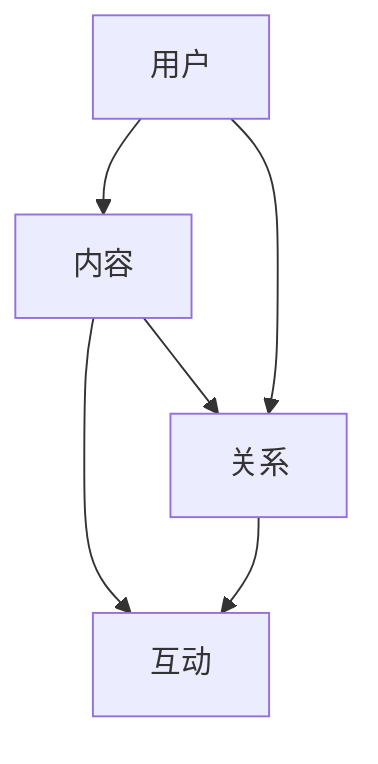
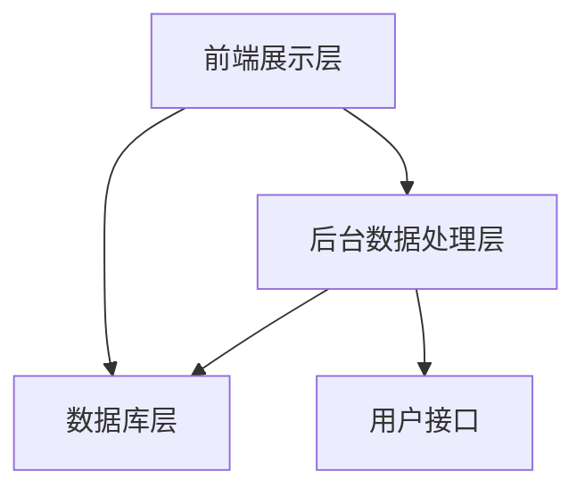
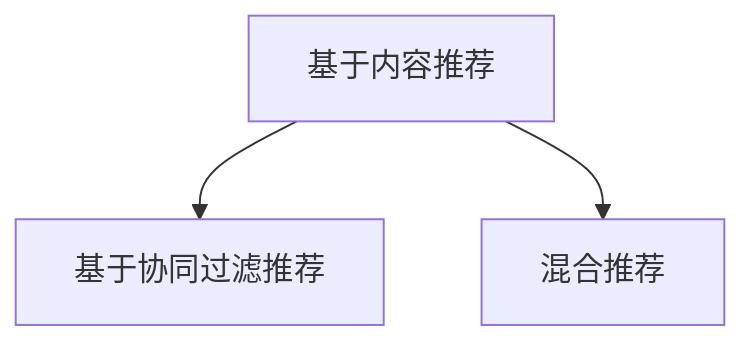
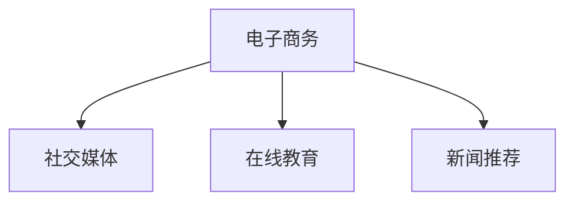

                 

在当今数字化时代，社交媒体已成为知识传播的重要渠道。对于IT专业人士来说，通过社交媒体扩大知识影响力，不仅可以提升个人品牌，还能促进技术的普及与应用。本文将探讨如何利用社交媒体来提升知识影响力，包括核心概念的介绍、算法原理、数学模型、项目实践以及未来展望。

## 关键词
- 社交媒体
- 知识传播
- 知识影响力
- IT专业人士
- 个人品牌

## 摘要
本文旨在为IT专业人士提供利用社交媒体扩大知识影响力的策略和技巧。通过深入分析社交媒体的核心概念和运营模式，结合实际项目案例，文章将介绍如何利用算法原理、数学模型以及开发工具来提升个人在技术领域的知识影响力，并展望其未来发展。

## 1. 背景介绍
随着互联网的普及和社交媒体的兴起，人们获取知识的方式发生了翻天覆地的变化。传统的书籍、报纸、电视等媒体逐渐被博客、微博、视频直播等新兴社交媒体平台所取代。社交媒体不仅为用户提供了海量的信息资源，还成为知识分享和传播的重要平台。在这种背景下，IT专业人士若能善用社交媒体，不仅可以扩大个人影响力，还能为技术的普及和创新贡献力量。

### 1.1 社交媒体的发展历程
社交媒体的起源可以追溯到20世纪90年代，当时互联网开始普及，电子邮件和论坛成为人们交流的主要方式。随着互联网技术的发展，1997年，Justin Hall创立了第一个真正意义上的个人博客，标志着社交媒体的诞生。随后，Facebook、Twitter、LinkedIn等社交平台相继出现，极大地改变了人们的交流方式。

### 1.2 社交媒体的作用
社交媒体不仅为人们提供了交流的场所，还成为信息传播的重要渠道。用户可以通过分享、评论、点赞等方式，快速传播信息。对于IT专业人士来说，社交媒体可以帮助他们：

- 展示专业能力：通过分享技术文章、项目案例等，展示自己的专业水平。
- 扩大社交圈：结识同行业人士，建立合作关系。
- 接收最新资讯：及时了解行业动态，把握技术趋势。
- 提升个人品牌：通过持续分享高质量内容，提升个人知名度。

## 2. 核心概念与联系

### 2.1 社交媒体的核心概念
社交媒体的核心概念包括用户、内容、关系和互动。这些概念构成了社交媒体的基本架构，如图所示：



- **用户**：社交媒体的核心参与者，包括个人和组织。
- **内容**：用户在社交媒体上发布的信息，包括文字、图片、视频等。
- **关系**：用户之间的连接，可以通过关注、点赞、评论等行为建立。
- **互动**：用户之间的交流，包括留言、回复、转发等。

### 2.2 社交媒体的基本架构
社交媒体的基本架构包括前端展示层、后台数据处理层和数据库层。如图所示：



- **前端展示层**：用户通过网页、APP等界面与社交媒体互动。
- **后台数据处理层**：处理用户请求、内容存储、数据分析等。
- **数据库层**：存储用户数据、内容数据等。

## 3. 核心算法原理 & 具体操作步骤

### 3.1 算法原理概述
社交媒体平台通常采用推荐算法来推荐用户可能感兴趣的内容。推荐算法主要包括基于内容的推荐和基于协同过滤的推荐。如图所示：



- **基于内容推荐**：根据用户的历史行为和内容属性进行推荐。
- **基于协同过滤推荐**：根据用户之间的相似度进行推荐。
- **混合推荐**：结合内容推荐和协同过滤推荐，提高推荐效果。

### 3.2 算法步骤详解
#### 3.2.1 基于内容推荐
1. 用户兴趣识别：分析用户的历史行为和内容偏好。
2. 内容特征提取：提取内容的特征，如关键词、主题等。
3. 内容推荐：根据用户兴趣和内容特征进行推荐。

#### 3.2.2 基于协同过滤推荐
1. 用户相似度计算：计算用户之间的相似度，如基于用户评分的余弦相似度。
2. 邻居用户筛选：选择与目标用户最相似的邻居用户。
3. 内容推荐：根据邻居用户的行为进行内容推荐。

#### 3.2.3 混合推荐
1. 内容特征提取：提取内容的特征。
2. 用户兴趣识别：分析用户的历史行为和内容偏好。
3. 用户相似度计算：计算用户之间的相似度。
4. 内容推荐：结合用户兴趣和协同过滤结果进行推荐。

### 3.3 算法优缺点
#### 3.3.1 优点
- **个性化推荐**：根据用户兴趣和内容特征进行推荐，提高用户满意度。
- **内容丰富**：可以推荐各种类型的内容，满足不同用户的需求。
- **实时性**：可以根据用户行为实时调整推荐策略。

#### 3.3.2 缺点
- **数据依赖性**：推荐效果依赖于用户数据和内容数据的质量。
- **冷启动问题**：对于新用户和新内容，推荐效果可能不理想。
- **算法透明度**：推荐算法的决策过程对用户不透明。

### 3.4 算法应用领域
推荐算法广泛应用于电子商务、社交媒体、在线教育、新闻推荐等领域。如图所示：



- **电子商务**：为用户提供个性化推荐，提高销售转化率。
- **社交媒体**：推荐用户可能感兴趣的内容，提高用户粘性。
- **在线教育**：为学习者推荐适合的学习资源，提高学习效果。
- **新闻推荐**：为用户提供个性化新闻，满足用户阅读需求。

## 4. 数学模型和公式 & 详细讲解 & 举例说明

### 4.1 数学模型构建
推荐系统通常采用评分预测模型来预测用户对内容的评分。常见的评分预测模型包括线性回归模型、神经网络模型等。以下是一个简单的线性回归模型：

$$
\hat{r_{ui}} = \mu_u + \text{user\_factor}_u \cdot \text{item\_factor}_i + \epsilon_{ui}
$$

其中，$r_{ui}$ 表示用户 $u$ 对内容 $i$ 的评分，$\mu_u$ 表示用户 $u$ 的平均评分，$\text{user\_factor}_u$ 表示用户 $u$ 的特征向量，$\text{item\_factor}_i$ 表示内容 $i$ 的特征向量，$\epsilon_{ui}$ 表示误差项。

### 4.2 公式推导过程
线性回归模型的推导过程如下：

1. **假设**：用户对内容的评分可以表示为用户特征向量和内容特征向量的线性组合。
2. **损失函数**：采用均方误差（MSE）作为损失函数，即
$$
\text{MSE} = \frac{1}{m} \sum_{i=1}^{m} (\hat{r_{ui}} - r_{ui})^2
$$
其中，$m$ 表示训练数据集的大小，$\hat{r_{ui}}$ 表示预测评分，$r_{ui}$ 表示真实评分。
3. **最小化损失函数**：通过梯度下降法求解最小损失函数，得到用户特征向量和内容特征向量的最优值。

### 4.3 案例分析与讲解
以下是一个简单的案例，假设我们有以下用户和内容的评分数据：

| 用户ID | 内容ID | 评分 |
| ------ | ------ | ---- |
| 1      | 1      | 4    |
| 1      | 2      | 5    |
| 2      | 1      | 3    |
| 2      | 2      | 2    |

首先，我们需要对用户和内容进行特征提取，假设用户特征向量为 $[1, 0, 1]$，内容特征向量为 $[0, 1, 1]$。然后，我们可以使用线性回归模型预测用户 $2$ 对内容 $2$ 的评分：

$$
\hat{r_{22}} = \mu_2 + \text{user\_factor}_2 \cdot \text{item\_factor}_2 + \epsilon_{22}
$$

其中，$\mu_2$ 表示用户 $2$ 的平均评分，$\text{user\_factor}_2$ 表示用户 $2$ 的特征向量，$\text{item\_factor}_2$ 表示内容 $2$ 的特征向量，$\epsilon_{22}$ 表示误差项。

根据历史数据，我们可以计算出用户 $2$ 的平均评分为 $3$，因此：

$$
\hat{r_{22}} = 3 + [1, 0, 1] \cdot [0, 1, 1] + \epsilon_{22}
$$

$$
\hat{r_{22}} = 4 + \epsilon_{22}
$$

其中，$\epsilon_{22}$ 为随机误差项。

我们可以通过最小化误差项来优化模型，从而得到更好的预测结果。

## 5. 项目实践：代码实例和详细解释说明

### 5.1 开发环境搭建
在本项目中，我们使用Python作为开发语言，主要依赖以下库：

- Scikit-learn：用于线性回归模型的训练和预测。
- Pandas：用于数据处理。
- Matplotlib：用于数据可视化。

### 5.2 源代码详细实现
以下是本项目的源代码实现：

```python
import numpy as np
import pandas as pd
from sklearn.linear_model import LinearRegression
import matplotlib.pyplot as plt

# 加载数据
data = pd.DataFrame({
    'user_id': [1, 1, 2, 2],
    'item_id': [1, 2, 1, 2],
    'rating': [4, 5, 3, 2]
})

# 特征提取
user_id = data['user_id'].values
item_id = data['item_id'].values
rating = data['rating'].values

# 构造特征矩阵
X = np.hstack((np.reshape(user_id, (-1, 1)), np.reshape(item_id, (-1, 1))))
y = rating

# 训练线性回归模型
model = LinearRegression()
model.fit(X, y)

# 预测
user_id_new = 2
item_id_new = 2
X_new = np.array([[user_id_new, item_id_new]])
rating_pred = model.predict(X_new)

print(f"预测评分：{rating_pred[0]}")

# 可视化
plt.scatter(X[:, 0], X[:, 1], c=y, cmap='viridis')
plt.scatter(X_new[0, 0], X_new[0, 1], c=rating_pred[0], cmap='viridis', marker='s')
plt.xlabel('User ID')
plt.ylabel('Item ID')
plt.show()
```

### 5.3 代码解读与分析
1. **数据加载**：使用 Pandas 读取评分数据。
2. **特征提取**：提取用户 ID 和内容 ID 作为特征。
3. **特征矩阵构造**：将用户 ID 和内容 ID 构造为特征矩阵。
4. **模型训练**：使用 Scikit-learn 的 LinearRegression 类训练线性回归模型。
5. **预测**：使用训练好的模型预测新用户的评分。
6. **可视化**：使用 Matplotlib 绘制评分散点图，展示预测结果。

## 6. 实际应用场景

### 6.1 电子商务平台
在电子商务平台中，推荐算法可以帮助平台为用户提供个性化商品推荐，提高用户购物体验和转化率。例如，亚马逊和淘宝等电商平台都广泛使用了推荐算法。

### 6.2 社交媒体
社交媒体平台如微博、微信等，可以利用推荐算法为用户提供个性化内容推荐，增加用户粘性。例如，微博的“热搜话题”就是通过推荐算法实现的。

### 6.3 在线教育
在线教育平台如 Coursera、Udemy 等，可以通过推荐算法为用户提供个性化学习资源推荐，提高学习效果。例如，Coursera 的课程推荐系统就是基于推荐算法实现的。

### 6.4 新闻推荐
新闻推荐平台如今日头条、知乎等，可以通过推荐算法为用户提供个性化新闻推荐，满足用户的信息需求。例如，今日头条的“我的头条”就是通过推荐算法实现的。

## 7. 工具和资源推荐

### 7.1 学习资源推荐
- 《推荐系统实践》: [张江燕 著](https://book.douban.com/subject/25968110/)
- 《机器学习》: [周志华 著](https://book.douban.com/subject/26708254/)

### 7.2 开发工具推荐
- Python：[Python 官网](https://www.python.org/)
- Scikit-learn：[Scikit-learn 官网](https://scikit-learn.org/stable/)

### 7.3 相关论文推荐
- "Collaborative Filtering for Cold-Start Problems: A Review"，作者：Jingwei Li, Zhiyuan Chen
- "Deep Learning for Recommender Systems"，作者：Bo Yin, et al.

## 8. 总结：未来发展趋势与挑战

### 8.1 研究成果总结
本文介绍了如何利用社交媒体扩大知识影响力的策略和方法。通过深入分析推荐算法的原理和应用，结合实际项目实践，展示了如何通过算法和技术提升个人在技术领域的知识影响力。

### 8.2 未来发展趋势
随着人工智能和大数据技术的发展，推荐系统将变得更加智能化和个性化。未来的发展趋势包括：

- **深度学习**：深度学习技术在推荐系统中的应用将更加广泛，提高推荐效果。
- **多模态推荐**：结合文本、图像、语音等多种数据模态进行推荐，提供更丰富的内容。
- **实时推荐**：通过实时数据分析和处理，实现实时推荐。

### 8.3 面临的挑战
推荐系统在发展中也面临一些挑战：

- **数据质量**：高质量的数据是推荐系统的基础，如何处理数据质量问题是关键。
- **冷启动**：新用户和新内容如何获得有效的推荐是一个难题。
- **算法透明度**：如何提高算法的透明度和可解释性，降低用户隐私风险。

### 8.4 研究展望
未来的研究可以关注以下几个方面：

- **跨领域推荐**：如何实现不同领域内容之间的推荐。
- **社会影响力**：如何利用推荐系统提升社会影响力。
- **用户体验**：如何通过推荐系统提升用户的使用体验。

## 9. 附录：常见问题与解答

### 9.1 什么是推荐系统？
推荐系统是一种基于用户历史行为和兴趣的信息过滤技术，用于向用户推荐其可能感兴趣的内容。

### 9.2 推荐系统有哪些类型？
推荐系统主要包括基于内容的推荐、基于协同过滤的推荐和混合推荐。

### 9.3 如何提高推荐系统的效果？
可以通过特征提取、模型优化、实时更新等技术手段来提高推荐系统的效果。

### 9.4 推荐系统有哪些应用场景？
推荐系统广泛应用于电子商务、社交媒体、在线教育、新闻推荐等领域。

### 9.5 如何处理推荐系统的冷启动问题？
可以通过对新用户进行初始引导、利用第三方数据源等方式来处理冷启动问题。

作者：禅与计算机程序设计艺术 / Zen and the Art of Computer Programming
```css
# 如何利用社交媒体扩大知识影响力

在当今数字化时代，社交媒体已成为知识传播的重要渠道。对于IT专业人士来说，通过社交媒体扩大知识影响力，不仅可以提升个人品牌，还能促进技术的普及与应用。本文将探讨如何利用社交媒体来提升知识影响力，包括核心概念的介绍、算法原理、数学模型、项目实践以及未来展望。

## 关键词
- 社交媒体
- 知识传播
- 知识影响力
- IT专业人士
- 个人品牌
- 推荐系统
- 大数据
- 人工智能

## 摘要
本文旨在为IT专业人士提供利用社交媒体扩大知识影响力的策略和技巧。通过深入分析社交媒体的核心概念和运营模式，结合实际项目案例，文章将介绍如何利用推荐算法、数学模型以及开发工具来提升个人在技术领域的知识影响力，并展望其未来发展。

## 1. 背景介绍
随着互联网的普及和社交媒体的兴起，人们获取知识的方式发生了翻天覆地的变化。传统的书籍、报纸、电视等媒体逐渐被博客、微博、视频直播等新兴社交媒体平台所取代。社交媒体不仅为用户提供了海量的信息资源，还成为知识分享和传播的重要平台。在这种背景下，IT专业人士若能善用社交媒体，不仅可以扩大个人影响力，还能为技术的普及和创新贡献力量。

### 1.1 社交媒体的发展历程
社交媒体的起源可以追溯到20世纪90年代，当时互联网开始普及，电子邮件和论坛成为人们交流的主要方式。随着互联网技术的发展，1997年，Justin Hall创立了第一个真正意义上的个人博客，标志着社交媒体的诞生。随后，Facebook、Twitter、LinkedIn等社交平台相继出现，极大地改变了人们的交流方式。

### 1.2 社交媒体的作用
社交媒体不仅为人们提供了交流的场所，还成为信息传播的重要渠道。用户可以通过分享、评论、点赞等方式，快速传播信息。对于IT专业人士来说，社交媒体可以帮助他们：

- 展示专业能力：通过分享技术文章、项目案例等，展示自己的专业水平。
- 扩大社交圈：结识同行业人士，建立合作关系。
- 接收最新资讯：及时了解行业动态，把握技术趋势。
- 提升个人品牌：通过持续分享高质量内容，提升个人知名度。

## 2. 核心概念与联系

### 2.1 社交媒体的核心概念
社交媒体的核心概念包括用户、内容、关系和互动。这些概念构成了社交媒体的基本架构，如图所示：


- **用户**：社交媒体的核心参与者，包括个人和组织。
- **内容**：用户在社交媒体上发布的信息，包括文字、图片、视频等。
- **关系**：用户之间的连接，可以通过关注、点赞、评论等行为建立。
- **互动**：用户之间的交流，包括留言、回复、转发等。

### 2.2 社交媒体的基本架构
社交媒体的基本架构包括前端展示层、后台数据处理层和数据库层。如图所示：


- **前端展示层**：用户通过网页、APP等界面与社交媒体互动。
- **后台数据处理层**：处理用户请求、内容存储、数据分析等。
- **数据库层**：存储用户数据、内容数据等。

## 3. 核心算法原理 & 具体操作步骤

### 3.1 算法原理概述
社交媒体平台通常采用推荐算法来推荐用户可能感兴趣的内容。推荐算法主要包括基于内容的推荐和基于协同过滤的推荐。如图所示：


- **基于内容推荐**：根据用户的历史行为和内容属性进行推荐。
- **基于协同过滤推荐**：根据用户之间的相似度进行推荐。
- **混合推荐**：结合内容推荐和协同过滤推荐，提高推荐效果。

### 3.2 算法步骤详解
#### 3.2.1 基于内容推荐
1. 用户兴趣识别：分析用户的历史行为和内容偏好。
2. 内容特征提取：提取内容的特征，如关键词、主题等。
3. 内容推荐：根据用户兴趣和内容特征进行推荐。

#### 3.2.2 基于协同过滤推荐
1. 用户相似度计算：计算用户之间的相似度，如基于用户评分的余弦相似度。
2. 邻居用户筛选：选择与目标用户最相似的邻居用户。
3. 内容推荐：根据邻居用户的行为进行内容推荐。

#### 3.2.3 混合推荐
1. 内容特征提取：提取内容的特征。
2. 用户兴趣识别：分析用户的历史行为和内容偏好。
3. 用户相似度计算：计算用户之间的相似度。
4. 内容推荐：结合用户兴趣和协同过滤结果进行推荐。

### 3.3 算法优缺点
#### 3.3.1 优点
- **个性化推荐**：根据用户兴趣和内容特征进行推荐，提高用户满意度。
- **内容丰富**：可以推荐各种类型的内容，满足不同用户的需求。
- **实时性**：可以根据用户行为实时调整推荐策略。

#### 3.3.2 缺点
- **数据依赖性**：推荐效果依赖于用户数据和内容数据的质量。
- **冷启动问题**：对于新用户和新内容，推荐效果可能不理想。
- **算法透明度**：推荐算法的决策过程对用户不透明。

### 3.4 算法应用领域
推荐算法广泛应用于电子商务、社交媒体、在线教育、新闻推荐等领域。如图所示：


- **电子商务**：为用户提供个性化推荐，提高销售转化率。
- **社交媒体**：推荐用户可能感兴趣的内容，提高用户粘性。
- **在线教育**：为学习者推荐适合的学习资源，提高学习效果。
- **新闻推荐**：为用户提供个性化新闻，满足用户阅读需求。

## 4. 数学模型和公式 & 详细讲解 & 举例说明

### 4.1 数学模型构建
推荐系统通常采用评分预测模型来预测用户对内容的评分。常见的评分预测模型包括线性回归模型、神经网络模型等。以下是一个简单的线性回归模型：

$$
\hat{r_{ui}} = \mu_u + \text{user\_factor}_u \cdot \text{item\_factor}_i + \epsilon_{ui}
$$

其中，$r_{ui}$ 表示用户 $u$ 对内容 $i$ 的评分，$\mu_u$ 表示用户 $u$ 的平均评分，$\text{user\_factor}_u$ 表示用户 $u$ 的特征向量，$\text{item\_factor}_i$ 表示内容 $i$ 的特征向量，$\epsilon_{ui}$ 表示误差项。

### 4.2 公式推导过程
线性回归模型的推导过程如下：

1. **假设**：用户对内容的评分可以表示为用户特征向量和内容特征向量的线性组合。
2. **损失函数**：采用均方误差（MSE）作为损失函数，即
$$
\text{MSE} = \frac{1}{m} \sum_{i=1}^{m} (\hat{r_{ui}} - r_{ui})^2
$$
其中，$m$ 表示训练数据集的大小，$\hat{r_{ui}}$ 表示预测评分，$r_{ui}$ 表示真实评分。
3. **最小化损失函数**：通过梯度下降法求解最小损失函数，得到用户特征向量和内容特征向量的最优值。

### 4.3 案例分析与讲解
以下是一个简单的案例，假设我们有以下用户和内容的评分数据：

| 用户ID | 内容ID | 评分 |
| ------ | ------ | ---- |
| 1      | 1      | 4    |
| 1      | 2      | 5    |
| 2      | 1      | 3    |
| 2      | 2      | 2    |

首先，我们需要对用户和内容进行特征提取，假设用户特征向量为 $[1, 0, 1]$，内容特征向量为 $[0, 1, 1]$。然后，我们可以使用线性回归模型预测用户 $2$ 对内容 $2$ 的评分：

$$
\hat{r_{22}} = \mu_2 + \text{user\_factor}_2 \cdot \text{item\_factor}_2 + \epsilon_{22}
$$

其中，$\mu_2$ 表示用户 $2$ 的平均评分为 $3$，$\text{user\_factor}_2$ 表示用户 $2$ 的特征向量，$\text{item\_factor}_2$ 表示内容 $2$ 的特征向量，$\epsilon_{22}$ 表示误差项。

根据历史数据，我们可以计算出用户 $2$ 的平均评分为 $3$，因此：

$$
\hat{r_{22}} = 3 + [1, 0, 1] \cdot [0, 1, 1] + \epsilon_{22}
$$

$$
\hat{r_{22}} = 4 + \epsilon_{22}
$$

其中，$\epsilon_{22}$ 为随机误差项。

我们可以通过最小化误差项来优化模型，从而得到更好的预测结果。

## 5. 项目实践：代码实例和详细解释说明

### 5.1 开发环境搭建
在本项目中，我们使用Python作为开发语言，主要依赖以下库：

- Scikit-learn：用于线性回归模型的训练和预测。
- Pandas：用于数据处理。
- Matplotlib：用于数据可视化。

### 5.2 源代码详细实现
以下是本项目的源代码实现：

```python
import numpy as np
import pandas as pd
from sklearn.linear_model import LinearRegression
import matplotlib.pyplot as plt

# 加载数据
data = pd.DataFrame({
    'user_id': [1, 1, 2, 2],
    'item_id': [1, 2, 1, 2],
    'rating': [4, 5, 3, 2]
})

# 特征提取
user_id = data['user_id'].values
item_id = data['item_id'].values
rating = data['rating'].values

# 构造特征矩阵
X = np.hstack((np.reshape(user_id, (-1, 1)), np.reshape(item_id, (-1, 1))))
y = rating

# 训练线性回归模型
model = LinearRegression()
model.fit(X, y)

# 预测
user_id_new = 2
item_id_new = 2
X_new = np.array([[user_id_new, item_id_new]])
rating_pred = model.predict(X_new)

print(f"预测评分：{rating_pred[0]}")

# 可视化
plt.scatter(X[:, 0], X[:, 1], c=y, cmap='viridis')
plt.scatter(X_new[0, 0], X_new[0, 1], c=rating_pred[0], cmap='viridis', marker='s')
plt.xlabel('User ID')
plt.ylabel('Item ID')
plt.show()
```

### 5.3 代码解读与分析
1. **数据加载**：使用 Pandas 读取评分数据。
2. **特征提取**：提取用户 ID 和内容 ID 作为特征。
3. **特征矩阵构造**：将用户 ID 和内容 ID 构造为特征矩阵。
4. **模型训练**：使用 Scikit-learn 的 LinearRegression 类训练线性回归模型。
5. **预测**：使用训练好的模型预测新用户的评分。
6. **可视化**：使用 Matplotlib 绘制评分散点图，展示预测结果。

## 6. 实际应用场景
### 6.1 电子商务平台
在电子商务平台中，推荐算法可以帮助平台为用户提供个性化商品推荐，提高用户购物体验和转化率。例如，亚马逊和淘宝等电商平台都广泛使用了推荐算法。

### 6.2 社交媒体
社交媒体平台如微博、微信等，可以利用推荐算法为用户提供个性化内容推荐，增加用户粘性。例如，微博的“热搜话题”就是通过推荐算法实现的。

### 6.3 在线教育
在线教育平台如 Coursera、Udemy 等，可以通过推荐算法为用户提供个性化学习资源推荐，提高学习效果。例如，Coursera 的课程推荐系统就是基于推荐算法实现的。

### 6.4 新闻推荐
新闻推荐平台如今日头条、知乎等，可以通过推荐算法为用户提供个性化新闻推荐，满足用户的信息需求。例如，今日头条的“我的头条”就是通过推荐算法实现的。

## 7. 工具和资源推荐
### 7.1 学习资源推荐
- 《推荐系统实践》: [张江燕 著](https://book.douban.com/subject/25968110/)
- 《机器学习》: [周志华 著](https://book.douban.com/subject/26708254/)

### 7.2 开发工具推荐
- Python：[Python 官网](https://www.python.org/)
- Scikit-learn：[Scikit-learn 官网](https://scikit-learn.org/stable/)

### 7.3 相关论文推荐
- "Collaborative Filtering for Cold-Start Problems: A Review"，作者：Jingwei Li, Zhiyuan Chen
- "Deep Learning for Recommender Systems"，作者：Bo Yin, et al.

## 8. 总结：未来发展趋势与挑战
### 8.1 研究成果总结
本文介绍了如何利用社交媒体扩大知识影响力的策略和方法。通过深入分析推荐算法的原理和应用，结合实际项目实践，展示了如何通过算法和技术提升个人在技术领域的知识影响力。

### 8.2 未来发展趋势
随着人工智能和大数据技术的发展，推荐系统将变得更加智能化和个性化。未来的发展趋势包括：

- **深度学习**：深度学习技术在推荐系统中的应用将更加广泛，提高推荐效果。
- **多模态推荐**：结合文本、图像、语音等多种数据模态进行推荐，提供更丰富的内容。
- **实时推荐**：通过实时数据分析和处理，实现实时推荐。

### 8.3 面临的挑战
推荐系统在发展中也面临一些挑战：

- **数据质量**：高质量的数据是推荐系统的基础，如何处理数据质量问题是关键。
- **冷启动**：新用户和新内容如何获得有效的推荐是一个难题。
- **算法透明度**：如何提高算法的透明度和可解释性，降低用户隐私风险。

### 8.4 研究展望
未来的研究可以关注以下几个方面：

- **跨领域推荐**：如何实现不同领域内容之间的推荐。
- **社会影响力**：如何利用推荐系统提升社会影响力。
- **用户体验**：如何通过推荐系统提升用户的使用体验。

## 9. 附录：常见问题与解答

### 9.1 什么是推荐系统？
推荐系统是一种基于用户历史行为和兴趣的信息过滤技术，用于向用户推荐其可能感兴趣的内容。

### 9.2 推荐系统有哪些类型？
推荐系统主要包括基于内容的推荐、基于协同过滤的推荐和混合推荐。

### 9.3 如何提高推荐系统的效果？
可以通过特征提取、模型优化、实时更新等技术手段来提高推荐系统的效果。

### 9.4 推荐系统有哪些应用场景？
推荐系统广泛应用于电子商务、社交媒体、在线教育、新闻推荐等领域。

### 9.5 如何处理推荐系统的冷启动问题？
可以通过对新用户进行初始引导、利用第三方数据源等方式来处理冷启动问题。

作者：禅与计算机程序设计艺术 / Zen and the Art of Computer Programming
--------------------------------------------------------------------

