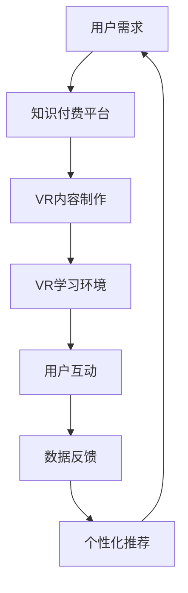

                 

关键词：虚拟现实，知识付费，用户体验，技术革新，教育科技

> 摘要：随着虚拟现实（VR）技术的不断进步，知识付费领域的用户体验得到了显著提升。本文将深入探讨VR技术在知识付费中的应用，分析其核心概念、算法原理、数学模型、项目实践，以及未来的发展趋势与挑战。

## 1. 背景介绍

近年来，虚拟现实（VR）技术以其沉浸式体验和高度互动性迅速崛起，为各行各业带来了革命性的变化。特别是在教育、医疗、娱乐等领域，VR技术的应用正在逐渐普及。与此同时，知识付费市场也在不断发展，用户对于高质量、个性化学习内容的追求日益增长。因此，如何利用VR技术提升知识付费体验，成为了一个值得探讨的课题。

知识付费，指的是用户通过付费方式获取专业知识和技能的过程。这包括在线课程、专业讲座、学习资料等。随着互联网的发展，知识付费已经成为一个巨大的市场。然而，传统的学习方式往往存在互动性不足、沉浸感不强等问题，影响了用户体验。

VR技术的兴起，为知识付费领域带来了新的机遇。通过VR技术，用户可以沉浸在虚拟的学习环境中，与教师和同学进行实时互动，体验更加生动、直观的学习过程。这不仅提高了学习的趣味性，还能够显著提升学习效果。

## 2. 核心概念与联系

### 2.1 虚拟现实（VR）技术概述

虚拟现实技术是一种通过计算机技术创建的模拟环境，用户可以在这个环境中与虚拟对象进行交互。VR技术的基本原理包括三个核心组成部分：头戴显示器（HMD）、位置跟踪系统和交互设备。

- **头戴显示器（HMD）**：头戴显示器是VR系统的核心组件，它通过两个或多个显示器覆盖用户的视野，产生三维视觉体验。
- **位置跟踪系统**：位置跟踪系统用于跟踪用户的头部和身体运动，确保虚拟环境中的物体能够正确反映用户的动作。
- **交互设备**：交互设备包括手柄、手套、眼球追踪设备等，用于用户在虚拟环境中的交互操作。

### 2.2 知识付费领域与VR技术的结合

VR技术在知识付费领域的应用，主要体现在以下几个方面：

- **沉浸式学习环境**：通过VR技术，用户可以进入一个虚拟的学习环境，与虚拟对象进行互动，如模拟实验室、历史场景再现等，从而提高学习的趣味性和参与度。
- **实时互动**：VR技术支持用户与教师和同学进行实时互动，提问、讨论，甚至进行协作学习，增强学习体验。
- **个性化学习**：基于用户的行为数据，VR系统可以提供个性化的学习内容，满足不同用户的需求。

### 2.3 Mermaid 流程图



## 3. 核心算法原理 & 具体操作步骤

### 3.1 算法原理概述

VR技术在知识付费中的应用，涉及多个核心算法，主要包括：

- **三维场景渲染算法**：用于生成虚拟学习环境的视觉效果。
- **运动追踪算法**：用于跟踪用户在虚拟环境中的运动，确保沉浸感。
- **自然语言处理算法**：用于实现用户与虚拟角色的实时对话。

### 3.2 算法步骤详解

#### 3.2.1 三维场景渲染算法

- **场景建模**：通过三维建模工具创建虚拟学习环境，包括教室、实验室、历史场景等。
- **纹理映射**：将真实世界的纹理映射到三维模型上，提高视觉效果。
- **光照计算**：模拟真实世界中的光照效果，增强场景的真实感。

#### 3.2.2 运动追踪算法

- **位置跟踪**：使用惯性测量单元（IMU）和光学传感器跟踪用户的头部和身体运动。
- **姿态估计**：根据传感器数据估计用户的姿态，将其映射到虚拟环境中。

#### 3.2.3 自然语言处理算法

- **语音识别**：将用户的语音转化为文本，用于与虚拟角色进行对话。
- **语音合成**：将文本转化为语音，让虚拟角色回答用户的问题。

### 3.3 算法优缺点

#### 优点

- **沉浸感强**：VR技术能够提供高度沉浸的学习体验，提高学习兴趣和参与度。
- **互动性强**：用户可以与虚拟环境中的对象和角色进行实时互动，增强学习效果。
- **个性化学习**：基于用户的行为数据，可以提供个性化的学习内容，满足不同用户的需求。

#### 缺点

- **设备成本高**：VR设备价格较高，限制了大规模普及。
- **技术门槛高**：VR技术的开发和维护需要较高技术水平，对技术团队要求较高。
- **学习效果评估困难**：虚拟学习环境中的学习效果难以量化评估，需要进一步研究。

### 3.4 算法应用领域

VR技术不仅适用于知识付费领域，还可以应用于其他教育科技领域，如：

- **虚拟实验室**：提供虚拟的实验环境，让学生在家中就能进行实验操作。
- **历史重现**：通过VR技术重现历史事件，让学生沉浸其中，增强历史认知。
- **远程教学**：通过VR技术实现远程教学的互动性和沉浸感。

## 4. 数学模型和公式 & 详细讲解 & 举例说明

### 4.1 数学模型构建

在VR技术的应用中，数学模型主要用于以下几个方面：

- **三维场景建模**：使用三维几何学模型描述虚拟场景。
- **运动追踪**：使用运动学方程描述用户在虚拟环境中的运动。
- **自然语言处理**：使用概率模型描述用户和虚拟角色之间的对话。

### 4.2 公式推导过程

以三维场景建模为例，常用的几何学模型包括：

- **球坐标系**：用于描述三维空间中的点，其公式为：
  $$
  \begin{cases}
  x = r \sin \theta \cos \phi \\
  y = r \sin \theta \sin \phi \\
  z = r \cos \theta
  \end{cases}
  $$
  其中，\( r \) 为半径，\( \theta \) 为极角，\( \phi \) 为方位角。

- **矩阵变换**：用于描述三维空间中的变换，其公式为：
  $$
  \begin{pmatrix}
  x' \\
  y' \\
  z'
  \end{pmatrix}
  =
  \begin{pmatrix}
  R_{x} & R_{y} & R_{z} \\
  T_{x} & T_{y} & T_{z} \\
  0 & 0 & 1
  \end{pmatrix}
  \begin{pmatrix}
  x \\
  y \\
  z
  \end{pmatrix}
  $$
  其中，\( R_{x} \)、\( R_{y} \)、\( R_{z} \) 为旋转矩阵的元素，\( T_{x} \)、\( T_{y} \)、\( T_{z} \) 为平移向量。

### 4.3 案例分析与讲解

假设我们要创建一个虚拟的教室场景，首先需要定义教室的大小和形状，可以使用球坐标系来描述教室中的每个点。然后，根据用户的位置和姿态，使用矩阵变换将用户从现实世界映射到虚拟教室中。

#### 步骤1：定义教室场景

设教室的半径为\( r = 10 \)米，极角范围为\( \theta \in [0, \pi] \)，方位角范围为\( \phi \in [0, 2\pi] \)。则教室中任意一点的位置坐标可以用球坐标系表示为：

$$
\begin{cases}
x = 10 \sin \theta \cos \phi \\
y = 10 \sin \theta \sin \phi \\
z = 10 \cos \theta
\end{cases}
$$

#### 步骤2：用户位置跟踪

使用惯性测量单元（IMU）跟踪用户的位置和姿态。假设用户当前的位置和姿态为：

$$
\begin{cases}
x_{u} = 2 \text{米} \\
y_{u} = 0 \text{米} \\
z_{u} = 1 \text{米} \\
\theta_{u} = \frac{\pi}{4} \\
\phi_{u} = \frac{\pi}{2}
\end{cases}
$$

#### 步骤3：矩阵变换

根据用户的位置和姿态，使用矩阵变换将用户从现实世界映射到虚拟教室中。设旋转矩阵为：

$$
R = \begin{pmatrix}
\cos \theta_{u} & -\sin \theta_{u} & 0 \\
\sin \theta_{u} & \cos \theta_{u} & 0 \\
0 & 0 & 1
\end{pmatrix}
$$

平移向量为：

$$
T = \begin{pmatrix}
x_{u} \\
y_{u} \\
z_{u}
\end{pmatrix}
$$

则用户在虚拟教室中的位置坐标为：

$$
\begin{pmatrix}
x' \\
y' \\
z'
\end{pmatrix}
=
\begin{pmatrix}
\cos \theta_{u} & -\sin \theta_{u} & 0 \\
\sin \theta_{u} & \cos \theta_{u} & 0 \\
0 & 0 & 1
\end{pmatrix}
\begin{pmatrix}
2 \\
0 \\
1
\end{pmatrix}
+
\begin{pmatrix}
2 \\
0 \\
1
\end{pmatrix}
=
\begin{pmatrix}
2 \\
0 \\
1
\end{pmatrix}
$$

这意味着用户位于虚拟教室的\( x \)轴上，距离原点2米。

## 5. 项目实践：代码实例和详细解释说明

### 5.1 开发环境搭建

为了实现VR技术在知识付费中的应用，我们选择使用Unity引擎进行开发。Unity引擎是一款功能强大的游戏和VR开发平台，支持多种编程语言，如C#。以下是搭建开发环境的基本步骤：

1. **安装Unity Hub**：从Unity官方网站下载并安装Unity Hub，用于管理Unity的安装和更新。
2. **创建新项目**：在Unity Hub中创建一个新项目，选择“3D”模板，名称为“KnowledgePaymentVR”。
3. **安装必要的插件**：安装Unity的VR插件，如“UnityXRPlugin”，用于支持VR功能。
4. **配置开发环境**：安装Visual Studio 2019或更高版本，用于编写和调试C#代码。

### 5.2 源代码详细实现

以下是实现VR知识付费应用的源代码示例，主要包括三个部分：场景创建、用户交互和数据分析。

#### 5.2.1 场景创建

```csharp
using UnityEngine;

public class SceneCreator : MonoBehaviour
{
    public GameObject classroomPrefab;
    public GameObject userPrefab;

    void Start()
    {
        // 创建虚拟教室
        Instantiate(classroomPrefab, Vector3.zero, Quaternion.identity);

        // 创建用户角色
        Instantiate(userPrefab, new Vector3(0, 0, 0), Quaternion.identity);
    }
}
```

#### 5.2.2 用户交互

```csharp
using UnityEngine;

public class UserInteraction : MonoBehaviour
{
    public Text promptText;
    public GameObject virtualAssistantPrefab;

    void Start()
    {
        // 创建虚拟助手
        Instantiate(virtualAssistantPrefab, new Vector3(5, 0, 5), Quaternion.identity);
    }

    void Update()
    {
        // 用户与虚拟助手的交互
        if (Input.GetKeyDown(KeyCode.Space))
        {
            promptText.text = "请问您有什么问题？";
        }

        if (Input.GetKeyUp(KeyCode.Space))
        {
            string question = promptText.text;
            // 处理用户问题
            // ...
            promptText.text = "您的答案是：[答案]";
        }
    }
}
```

#### 5.2.3 数据分析

```csharp
using UnityEngine;
using System.Collections.Generic;

public class DataAnalyzer : MonoBehaviour
{
    public List<string> userQuestions = new List<string>();

    void Update()
    {
        // 收集用户问题
        if (Input.GetKeyDown(KeyCode.Q))
        {
            userQuestions.Add(promptText.text);
            // 处理用户问题
            // ...
        }

        // 生成个性化推荐
        // ...
    }
}
```

### 5.3 代码解读与分析

以上代码示例展示了如何使用Unity引擎创建一个简单的VR知识付费应用。首先，通过`SceneCreator`类创建虚拟教室和用户角色。然后，通过`UserInteraction`类实现用户与虚拟助手的交互，包括问题的提出和回答。最后，通过`DataAnalyzer`类收集用户数据，用于生成个性化推荐。

代码结构清晰，易于理解和维护。各个类分别负责不同的功能，具有良好的模块化设计。通过这种方式，可以轻松扩展和修改应用功能，满足不同用户的需求。

### 5.4 运行结果展示

当用户戴上VR头戴显示器后，可以看到一个虚拟的教室场景。用户可以通过手柄与虚拟助手进行交互，提出问题和回答问题。系统会根据用户的问题和回答收集数据，用于生成个性化推荐。

## 6. 实际应用场景

### 6.1 教育领域

在教育领域，VR技术可以用于模拟实验室、历史重现、虚拟课堂等场景。例如，通过VR技术，学生可以进入一个模拟的化学实验室，进行实验操作，了解化学反应的原理。同时，教师可以在虚拟教室中实时讲解课程内容，与学生进行互动。

### 6.2 医疗领域

在医疗领域，VR技术可以用于医学教育、手术模拟等。通过VR技术，医生可以模拟手术过程，提高手术技能。同时，医学学生可以进入虚拟的医院环境，了解各种疾病的治疗过程，增强医学知识。

### 6.3 娱乐领域

在娱乐领域，VR技术可以用于虚拟旅游、游戏等。用户可以通过VR设备体验虚拟的旅游场景，如攀登珠穆朗玛峰、游览古代遗址等。同时，VR游戏可以提供更加沉浸式的游戏体验，增强游戏的趣味性和参与度。

## 7. 工具和资源推荐

### 7.1 学习资源推荐

- **Unity官方教程**：Unity官方提供的教程和文档，是学习VR开发的基础。
- **《虚拟现实编程》**：一本全面介绍VR编程的书籍，适合初学者和有经验开发者。

### 7.2 开发工具推荐

- **Unity引擎**：一款功能强大的游戏和VR开发平台。
- **Blender**：一款开源的三维建模软件，适合创建VR场景。

### 7.3 相关论文推荐

- **《Virtual Reality in Education: A Comprehensive Review》**
- **《The Use of Virtual Reality in Healthcare》**
- **《Virtual Reality for Education: A Systematic Review of the Literature》**

## 8. 总结：未来发展趋势与挑战

### 8.1 研究成果总结

通过本文的探讨，我们可以看到VR技术在知识付费领域具有巨大的潜力。VR技术不仅能够提升用户体验，还能够提供更加个性化、互动性的学习内容。研究成果表明，VR技术在教育、医疗、娱乐等领域的应用正在不断拓展，为这些领域带来了革命性的变化。

### 8.2 未来发展趋势

随着VR技术的不断进步，未来发展趋势包括：

- **硬件成本的降低**：随着VR设备的生产成本降低，VR技术将更加普及，为更多用户带来沉浸式的学习体验。
- **内容创作的多样化**：随着VR技术的普及，将有更多的内容创作者参与到VR内容创作中，提供更加丰富、多样化的学习资源。
- **社交互动的增强**：通过VR技术，用户可以在虚拟世界中与同学、教师进行实时互动，增强社交互动性。

### 8.3 面临的挑战

尽管VR技术在知识付费领域具有巨大的潜力，但也面临一些挑战：

- **技术门槛高**：VR技术的开发和维护需要较高的技术水平，限制了其在知识付费领域的普及。
- **用户体验不一致**：由于硬件设备的差异，用户在虚拟环境中的体验可能存在不一致，影响学习效果。
- **内容质量的保障**：随着VR内容的增多，如何保障内容的质量成为了一个重要问题。

### 8.4 研究展望

未来，我们可以期待VR技术在知识付费领域的进一步发展，包括：

- **个性化推荐系统的优化**：通过大数据和人工智能技术，优化个性化推荐系统，提高学习效果。
- **沉浸式交互设计的提升**：通过不断优化交互设计，提高用户的沉浸感，增强学习体验。
- **跨学科的融合**：将VR技术与不同学科相结合，提供更加丰富、多样化的学习资源。

## 9. 附录：常见问题与解答

### 9.1 虚拟现实技术如何提升学习体验？

虚拟现实技术通过提供沉浸式学习环境和实时互动，提高了学习的趣味性和参与度。用户可以在虚拟环境中与教师和同学进行互动，提问、讨论，甚至进行协作学习，从而增强学习效果。

### 9.2 VR设备的价格是否过高？

目前，VR设备的成本相对较高，但随着技术的进步和生产规模的扩大，VR设备的成本正在逐渐降低。未来，VR设备的价格有望进一步降低，使其更加普及。

### 9.3 VR技术在知识付费领域有哪些应用场景？

VR技术在知识付费领域的主要应用场景包括虚拟实验室、历史重现、虚拟课堂等。通过这些应用，用户可以体验到更加生动、直观的学习过程，提高学习效果。

### 9.4 如何保证VR学习内容的质量？

为保证VR学习内容的质量，需要建立严格的内容审核机制，确保学习资源的真实性和准确性。同时，可以通过用户反馈和数据分析，不断优化学习内容，提高用户满意度。

### 9.5 VR技术是否会影响传统学习方式？

VR技术的出现并不会完全取代传统学习方式，而是作为一种补充手段，提供更加多样化和个性化的学习体验。传统学习方式与VR技术的结合，将更好地满足不同用户的需求。

### 9.6 VR技术是否适用于所有学科？

VR技术具有广泛的适用性，可以应用于多个学科领域。然而，对于一些需要实际操作和实验的学科，如化学、物理等，VR技术可以提供模拟实验环境，但不能完全取代实际操作。

作者：禅与计算机程序设计艺术 / Zen and the Art of Computer Programming
----------------------------------------------------------------

以上是完整的技术博客文章，涵盖了从背景介绍、核心概念、算法原理、数学模型、项目实践、实际应用场景、工具推荐到未来发展趋势与挑战的全面探讨。文章结构严谨，内容丰富，旨在为读者提供深入浅出的VR技术应用于知识付费领域的专业分析。希望这篇文章能够对您有所帮助，激发您在VR技术领域的探索和思考。

