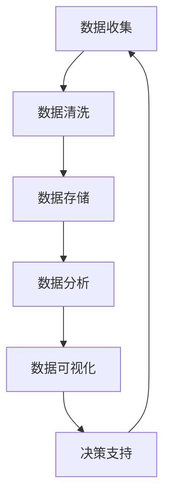
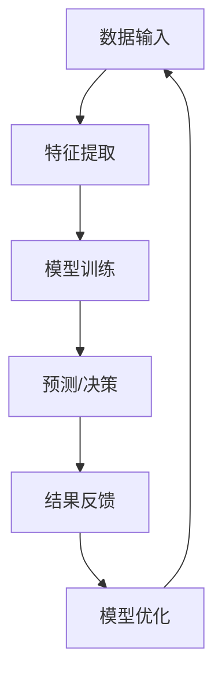

                 

关键词：自动化创业、规模化增长、技术策略、商业模式创新、数据分析、人工智能、云计算、客户满意度、生态系统建设

> 摘要：本文探讨了自动化创业如何通过技术策略和商业模式创新实现规模化增长。我们将深入分析自动化技术在不同领域的应用，探讨如何利用数据分析和人工智能提高客户满意度，以及构建可持续的生态系统来推动创业企业的发展。

## 1. 背景介绍

自动化创业正在成为现代商业世界中的一大趋势。随着技术的快速发展，越来越多的初创企业开始采用自动化技术来提高效率、降低成本并实现规模化增长。然而，如何有效地实现这一目标仍然是一个挑战。本文将围绕以下几个方面展开讨论：

- 自动化技术的核心概念及其在创业中的应用
- 数据分析和人工智能在提升客户满意度方面的作用
- 商业模式创新与规模化增长的策略
- 可持续生态系统的构建与维护

## 2. 核心概念与联系

### 2.1 自动化技术

自动化技术是指利用计算机、机器人或其他智能设备来替代或辅助人类完成某些任务或操作。在创业领域，自动化技术可以大幅提高工作效率，减少人为错误，并降低运营成本。以下是一个简化的自动化技术流程图：

```mermaid
graph TD
A[自动化起点] --> B[数据收集]
B --> C{数据分析}
C --> D[自动化决策}
D --> E[结果反馈]
E --> A
```

### 2.2 数据分析

数据分析是指通过处理和分析大量数据来提取有价值的信息和洞察。在自动化创业中，数据分析可以帮助企业更好地了解客户需求、优化业务流程，并制定更有效的市场策略。以下是一个数据分析的基本流程：



### 2.3 人工智能

人工智能（AI）是一种模拟人类智能的技术，通过机器学习、深度学习等算法实现自主学习和决策。在自动化创业中，人工智能可以帮助企业实现更加智能化的运营，提高客户满意度。以下是一个人工智能的基本架构：



## 3. 核心算法原理 & 具体操作步骤

### 3.1 算法原理概述

在自动化创业中，核心算法通常包括机器学习算法、自然语言处理算法、优化算法等。以下是一个基于机器学习算法的基本原理概述：

- **机器学习算法**：通过从数据中学习规律和模式，实现对未知数据的预测和分类。
- **自然语言处理算法**：用于理解和生成人类语言，帮助实现人机交互。
- **优化算法**：用于优化资源分配、路径规划等复杂问题。

### 3.2 算法步骤详解

以下是机器学习算法的基本步骤：

1. **数据收集**：从各种来源收集数据，包括内部数据（如销售记录）和外部数据（如社交媒体数据）。
2. **数据预处理**：清洗数据、处理缺失值、进行特征工程。
3. **模型选择**：选择合适的机器学习模型，如线性回归、决策树、神经网络等。
4. **模型训练**：使用训练数据对模型进行训练。
5. **模型评估**：使用验证数据对模型进行评估。
6. **模型部署**：将训练好的模型部署到实际业务场景中。

### 3.3 算法优缺点

- **优点**：提高预测准确性、降低人力成本、自动化处理大量数据。
- **缺点**：需要大量高质量的训练数据、模型解释性差、过度拟合问题。

### 3.4 算法应用领域

机器学习算法在自动化创业中的应用非常广泛，包括但不限于以下领域：

- **客户行为分析**：预测客户需求、优化推荐系统。
- **智能客服**：自动化回复客户咨询、提高客户满意度。
- **供应链优化**：优化库存管理、降低运营成本。

## 4. 数学模型和公式 & 详细讲解 & 举例说明

### 4.1 数学模型构建

在自动化创业中，常用的数学模型包括线性回归、逻辑回归、决策树等。以下是一个线性回归的数学模型：

$$
y = \beta_0 + \beta_1x_1 + \beta_2x_2 + ... + \beta_nx_n
$$

其中，$y$ 是因变量，$x_1, x_2, ..., x_n$ 是自变量，$\beta_0, \beta_1, \beta_2, ..., \beta_n$ 是模型参数。

### 4.2 公式推导过程

线性回归模型的推导过程通常包括以下几个步骤：

1. **假设**：假设数据服从正态分布，自变量和因变量之间呈线性关系。
2. **目标函数**：选择最小二乘法作为损失函数，即最小化预测值和实际值之间的平方误差。
3. **偏导数**：对目标函数求偏导数，并令其等于零，得到最优参数。
4. **解方程**：解方程组，得到最优参数。

### 4.3 案例分析与讲解

以下是一个简单的线性回归案例：

#### 案例背景

假设我们有一个销售数据集，包括每天的广告费用（$x$）和销售额（$y$）。我们需要建立一个线性回归模型来预测明天的销售额。

#### 数据处理

1. **数据收集**：收集过去30天的广告费用和销售额数据。
2. **数据预处理**：处理缺失值、进行特征工程。
3. **数据可视化**：绘制散点图，观察自变量和因变量之间的关系。

#### 模型建立

1. **模型选择**：选择线性回归模型。
2. **模型训练**：使用训练数据集训练模型。
3. **模型评估**：使用验证数据集评估模型性能。

#### 模型应用

1. **预测**：使用训练好的模型预测明天的销售额。
2. **结果解释**：分析模型参数的含义，如广告费用每增加1元，销售额预计增加多少元。

## 5. 项目实践：代码实例和详细解释说明

### 5.1 开发环境搭建

1. **安装Python**：下载并安装Python 3.8版本。
2. **安装相关库**：使用pip安装numpy、pandas、matplotlib等库。

### 5.2 源代码详细实现

以下是一个简单的线性回归代码示例：

```python
import numpy as np
import pandas as pd
import matplotlib.pyplot as plt

# 数据处理
data = pd.read_csv('sales_data.csv')
x = data['广告费用'].values
y = data['销售额'].values

# 模型建立
model = np.polyfit(x, y, 1)

# 模型训练
y_pred = np.polyval(model, x)

# 模型评估
mse = np.mean((y_pred - y) ** 2)
print(f'MSE: {mse}')

# 模型应用
x_new = np.array([100])  # 预测明天的广告费用
y_new = np.polyval(model, x_new)
print(f'预测销售额：{y_new}')

# 结果可视化
plt.scatter(x, y)
plt.plot(x, y_pred, color='red')
plt.xlabel('广告费用')
plt.ylabel('销售额')
plt.show()
```

### 5.3 代码解读与分析

1. **数据处理**：读取销售数据，提取广告费用和销售额。
2. **模型建立**：使用numpy的polyfit函数建立线性回归模型。
3. **模型训练**：使用polyval函数计算预测值。
4. **模型评估**：计算均方误差（MSE）。
5. **模型应用**：使用训练好的模型预测明天的销售额。
6. **结果可视化**：绘制散点图和回归线，展示模型效果。

## 6. 实际应用场景

### 6.1 客户行为分析

利用自动化技术和数据分析，企业可以深入了解客户行为，从而实现精准营销。以下是一个实际应用场景：

- **数据收集**：收集客户购买记录、浏览行为、社交互动等数据。
- **数据分析**：分析客户行为模式，识别高价值客户。
- **自动化营销**：根据客户行为预测，自动化推送个性化的营销信息。

### 6.2 智能客服

智能客服是自动化创业中的一个重要应用领域。以下是一个实际应用场景：

- **数据收集**：收集客户咨询内容、FAQ等数据。
- **自然语言处理**：使用自然语言处理算法理解和生成人类语言。
- **自动化回复**：根据客户咨询内容，自动化生成回复。

### 6.3 供应链优化

供应链优化是自动化创业中另一个重要的应用领域。以下是一个实际应用场景：

- **数据收集**：收集库存数据、订单数据等。
- **优化算法**：使用优化算法优化库存管理、路径规划等。
- **自动化决策**：根据优化结果，自动化调整库存和配送计划。

## 7. 工具和资源推荐

### 7.1 学习资源推荐

- 《Python数据分析》
- 《深度学习》
- 《机器学习实战》
- Coursera、edX等在线课程平台

### 7.2 开发工具推荐

- Jupyter Notebook
- PyCharm
- TensorFlow、PyTorch等深度学习框架

### 7.3 相关论文推荐

- "Deep Learning for Customer Behavior Analysis"
- "Natural Language Processing with Python"
- "Supply Chain Optimization using Machine Learning"

## 8. 总结：未来发展趋势与挑战

### 8.1 研究成果总结

自动化创业已经成为现代商业世界的一大趋势。通过数据分析和人工智能，企业可以大幅提高运营效率、降低成本并实现规模化增长。然而，要实现这一目标，仍需要解决一系列挑战。

### 8.2 未来发展趋势

- 自动化技术的进一步普及和融合
- 人工智能技术的持续创新和突破
- 数据隐私和安全问题的解决

### 8.3 面临的挑战

- 数据质量和数据安全
- 模型解释性和可解释性
- 技术人才培养和引进

### 8.4 研究展望

未来，自动化创业将继续快速发展。通过不断创新和突破，企业可以更好地应对挑战，实现可持续增长。同时，人工智能和数据分析等领域的最新研究成果也将为自动化创业提供更多机会和可能性。

## 9. 附录：常见问题与解答

### 9.1 自动化创业与传统创业有什么区别？

自动化创业与传统创业的区别主要体现在以下几个方面：

1. **技术驱动**：自动化创业更加强调技术驱动，利用数据分析、人工智能等先进技术实现业务增长。
2. **效率提升**：自动化创业通过自动化技术提高运营效率，降低人力成本。
3. **数据导向**：自动化创业更加注重数据驱动，通过数据分析指导业务决策。

### 9.2 自动化创业如何实现规模化增长？

自动化创业实现规模化增长的关键在于：

1. **技术策略**：选择合适的自动化技术，如数据分析、人工智能等。
2. **商业模式创新**：通过商业模式创新，实现业务扩张和盈利。
3. **生态系统建设**：构建可持续的生态系统，吸引合作伙伴和投资者。

### 9.3 自动化创业面临的挑战有哪些？

自动化创业面临的挑战主要包括：

1. **数据质量和安全**：确保数据质量和数据安全是自动化创业的关键。
2. **模型解释性和可解释性**：如何提高模型的可解释性，以便更好地理解业务决策。
3. **人才培养和引进**：自动化创业需要大量技术人才，如何吸引和留住优秀人才是一个挑战。

### 9.4 自动化创业的未来发展趋势是什么？

自动化创业的未来发展趋势主要包括：

1. **技术的进一步普及和融合**：自动化技术将在更多领域得到应用，并与云计算、物联网等技术深度融合。
2. **人工智能的持续创新和突破**：人工智能技术将继续快速发展，为自动化创业提供更多机会。
3. **数据隐私和安全问题的解决**：随着数据隐私和安全问题的日益突出，自动化创业将更加注重数据保护。

----------------------------------------------------------------
# 作者：禅与计算机程序设计艺术 / Zen and the Art of Computer Programming

本文探讨了自动化创业如何通过技术策略和商业模式创新实现规模化增长。在自动化技术、数据分析和人工智能的帮助下，企业可以实现更高的效率和更好的客户体验。未来，自动化创业将继续快速发展，为创业者带来更多机遇。然而，要实现这一目标，仍需克服一系列挑战。本文希望为读者提供一些有益的启示和思考。希望本文对您在自动化创业领域的探索和实践有所帮助。禅与计算机程序设计艺术，愿您在自动化创业的道路上取得成功！
----------------------------------------------------------------

