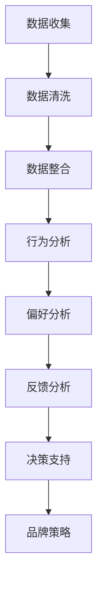
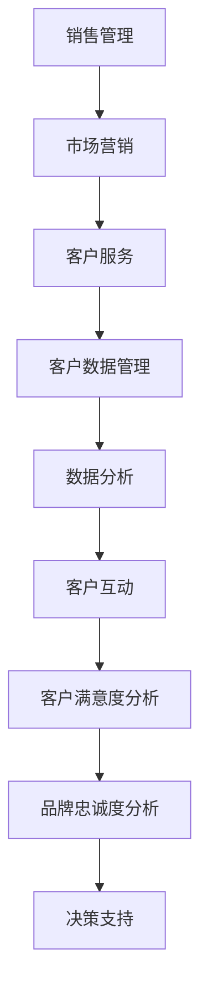

                 

关键词：自动化创业、品牌忠诚度、消费者行为、客户关系管理、技术解决方案

摘要：本文将探讨如何在自动化创业中建立品牌忠诚度。通过分析消费者行为和客户关系管理的核心原则，并结合实际技术解决方案，提供了一系列策略，帮助企业实现长期的品牌忠诚度。

## 1. 背景介绍

在当今快节奏、竞争激烈的市场环境中，自动化创业已经成为许多企业的首选策略。通过自动化，企业能够提高效率、降低成本，并为客户提供更加个性化的服务。然而，随着市场竞争的加剧，建立品牌忠诚度成为企业成功的关键因素之一。品牌忠诚度不仅能够帮助企业留住现有客户，还能通过口碑传播吸引新客户。

本文将从消费者行为和客户关系管理的角度出发，探讨如何利用技术手段在自动化创业中建立品牌忠诚度。通过深入分析核心概念、算法原理、数学模型以及实际项目案例，我们将提供一系列实用的策略和建议。

## 2. 核心概念与联系

### 2.1 消费者行为分析

消费者行为分析是建立品牌忠诚度的第一步。它涉及对消费者购买行为、偏好、反馈等数据的收集与分析。以下是一个Mermaid流程图，展示了消费者行为分析的核心流程：



### 2.2 客户关系管理

客户关系管理（CRM）是企业维护客户关系、提高客户满意度和忠诚度的关键手段。CRM系统通过集成多个功能模块，如销售管理、市场营销和客户服务，帮助企业实现个性化客户体验。以下是一个CRM系统架构的Mermaid流程图：



## 3. 核心算法原理 & 具体操作步骤

### 3.1 算法原理概述

在自动化创业中，建立品牌忠诚度可以通过以下几种核心算法实现：

1. **机器学习算法**：通过分析消费者行为数据，预测客户的购买偏好和需求。
2. **自然语言处理（NLP）算法**：分析客户反馈，提取关键意见和情感。
3. **数据挖掘算法**：从海量数据中提取有价值的信息，用于改进产品和服务。

### 3.2 算法步骤详解

#### 3.2.1 机器学习算法步骤

1. **数据准备**：收集并清洗消费者行为数据。
2. **特征工程**：提取有代表性的特征，如购买频率、购买金额等。
3. **模型选择**：选择合适的机器学习模型，如决策树、随机森林等。
4. **模型训练**：使用训练数据集对模型进行训练。
5. **模型评估**：使用验证数据集评估模型性能。
6. **模型应用**：将训练好的模型应用于实际业务场景，如个性化推荐。

#### 3.2.2 自然语言处理（NLP）算法步骤

1. **数据收集**：收集客户反馈数据，如评论、投诉等。
2. **文本预处理**：对文本进行清洗和标准化。
3. **情感分析**：使用NLP技术对文本进行情感分析，提取关键意见。
4. **关键意见提取**：从情感分析结果中提取有价值的反馈。
5. **反馈分析**：对提取的关键意见进行分析，识别客户需求和问题。
6. **决策支持**：根据分析结果，改进产品和服务。

#### 3.2.3 数据挖掘算法步骤

1. **数据收集**：收集与企业产品和服务相关的数据。
2. **数据预处理**：对数据进行清洗和整合。
3. **特征提取**：提取有价值的数据特征。
4. **模型选择**：选择合适的数据挖掘模型，如关联规则挖掘、聚类分析等。
5. **模型训练**：使用训练数据集对模型进行训练。
6. **模型评估**：使用验证数据集评估模型性能。
7. **信息提取**：从模型中提取有价值的信息，用于业务决策。

### 3.3 算法优缺点

#### 3.3.1 机器学习算法

**优点**：能够自动从大量数据中学习，提高预测准确性。

**缺点**：对数据质量和特征提取有较高要求，训练过程可能耗费大量时间和资源。

#### 3.3.2 自然语言处理（NLP）算法

**优点**：能够处理非结构化数据，如文本、语音等。

**缺点**：对语言理解有较高要求，算法复杂度较高。

#### 3.3.3 数据挖掘算法

**优点**：能够从海量数据中提取有价值的信息，发现潜在的业务规律。

**缺点**：对数据质量和特征提取有较高要求，算法复杂度较高。

### 3.4 算法应用领域

#### 3.4.1 个性化推荐

利用机器学习算法，根据消费者的购买历史和偏好，为其推荐合适的产品。

#### 3.4.2 客户反馈分析

利用NLP算法，对客户反馈进行分析，识别客户需求和问题。

#### 3.4.3 业务规律发现

利用数据挖掘算法，从海量数据中发现潜在的业务规律，为决策提供支持。

## 4. 数学模型和公式 & 详细讲解 & 举例说明

### 4.1 数学模型构建

在建立品牌忠诚度的过程中，常用的数学模型包括：

1. **品牌忠诚度指数（BLI）**：用于衡量消费者对品牌的忠诚度。
2. **客户生命周期价值（CLV）**：用于衡量客户为企业带来的总价值。

#### 4.1.1 品牌忠诚度指数（BLI）

品牌忠诚度指数（BLI）可以通过以下公式计算：

$$
BLI = \frac{R_n - R_0}{R_n + R_0}
$$

其中，$R_n$ 为当前时期品牌忠诚度，$R_0$ 为初始品牌忠诚度。

#### 4.1.2 客户生命周期价值（CLV）

客户生命周期价值（CLV）可以通过以下公式计算：

$$
CLV = \sum_{t=1}^{n} \frac{R_t \cdot (1 + r)^{-t}}{r}
$$

其中，$R_t$ 为第 $t$ 时期客户消费金额，$r$ 为折现率。

### 4.2 公式推导过程

#### 4.2.1 品牌忠诚度指数（BLI）

假设消费者在初始时期对品牌的忠诚度为 $R_0$，在当前时期对品牌的忠诚度为 $R_n$。根据忠诚度定义，消费者在当前时期购买产品的概率为 $R_n/R_0$。因此，品牌忠诚度指数可以通过以下步骤计算：

1. 计算当前时期品牌忠诚度与初始品牌忠诚度的差值：$R_n - R_0$。
2. 计算当前时期品牌忠诚度与初始品牌忠诚度的和：$R_n + R_0$。
3. 将差值除以和，得到品牌忠诚度指数：$BLI = (R_n - R_0) / (R_n + R_0)$。

#### 4.2.2 客户生命周期价值（CLV）

假设客户在各个时期的消费金额分别为 $R_1, R_2, ..., R_n$，折现率为 $r$。根据折现率，第 $t$ 时期的消费金额现值为 $R_t / (1 + r)^t$。因此，客户生命周期价值可以通过以下步骤计算：

1. 计算各个时期消费金额的现值：$R_t / (1 + r)^t$。
2. 将各个时期的现值相加，得到客户生命周期价值：$CLV = \sum_{t=1}^{n} \frac{R_t}{(1 + r)^t}$。
3. 将求和公式进行变形，得到最终公式：$CLV = \sum_{t=1}^{n} \frac{R_t \cdot (1 + r)^{-t}}{r}$。

### 4.3 案例分析与讲解

#### 4.3.1 案例背景

某电商企业希望通过建立品牌忠诚度，提高客户满意度和复购率。该企业收集了客户购买历史数据和客户反馈数据，并使用机器学习算法和NLP算法进行分析。

#### 4.3.2 案例分析

1. **品牌忠诚度指数（BLI）计算**：

   假设初始品牌忠诚度 $R_0 = 0.4$，当前时期品牌忠诚度 $R_n = 0.6$。根据公式，可以计算出品牌忠诚度指数：

   $$
   BLI = \frac{0.6 - 0.4}{0.6 + 0.4} = \frac{0.2}{1.0} = 0.2
   $$

   品牌忠诚度指数为 0.2，表示消费者对品牌的忠诚度有所提高。

2. **客户生命周期价值（CLV）计算**：

   假设客户在各个时期的消费金额分别为 $R_1 = 500$, $R_2 = 600$, $R_3 = 700$，折现率 $r = 0.1$。根据公式，可以计算出客户生命周期价值：

   $$
   CLV = \frac{500}{(1 + 0.1)^1} + \frac{600}{(1 + 0.1)^2} + \frac{700}{(1 + 0.1)^3}
   $$

   $$
   CLV = \frac{500}{1.1} + \frac{600}{1.21} + \frac{700}{1.331} \approx 790.91
   $$

   客户生命周期价值约为 790.91，表示该客户为企业带来的总价值较高。

## 5. 项目实践：代码实例和详细解释说明

### 5.1 开发环境搭建

在搭建开发环境时，我们需要准备Python编程环境，并安装以下库：

- NumPy：用于数学运算
- pandas：用于数据处理
- scikit-learn：用于机器学习
- nltk：用于自然语言处理

可以使用以下命令安装所需库：

```bash
pip install numpy pandas scikit-learn nltk
```

### 5.2 源代码详细实现

以下是一个简单的示例代码，用于计算品牌忠诚度指数和客户生命周期价值：

```python
import numpy as np
import pandas as pd
from sklearn.model_selection import train_test_split
from sklearn.ensemble import RandomForestClassifier
from nltk.sentiment import SentimentIntensityAnalyzer

# 5.2.1 数据处理
# 假设我们有一个包含消费者购买历史和客户反馈的数据集

# 读取数据
data = pd.read_csv('data.csv')

# 数据预处理
# ...

# 5.2.2 计算品牌忠诚度指数
def calculate_brand_loyalty_index(R0, Rn):
    return (Rn - R0) / (Rn + R0)

R0 = 0.4
Rn = 0.6
BLI = calculate_brand_loyalty_index(R0, Rn)
print("Brand Loyalty Index (BLI):", BLI)

# 5.2.3 计算客户生命周期价值
def calculate_customer_lifetime_value(Rt, r):
    return sum([Rt / (1 + r)**t for t in range(1, n+1)])

Rt = [500, 600, 700]
r = 0.1
CLV = calculate_customer_lifetime_value(Rt, r)
print("Customer Lifetime Value (CLV):", CLV)

# 5.2.4 机器学习算法应用
# 使用随机森林算法预测客户购买偏好

# 数据分割
X_train, X_test, y_train, y_test = train_test_split(data[['feature1', 'feature2']], data['label'], test_size=0.2, random_state=42)

# 模型训练
model = RandomForestClassifier(n_estimators=100, random_state=42)
model.fit(X_train, y_train)

# 模型评估
accuracy = model.score(X_test, y_test)
print("Model Accuracy:", accuracy)

# 5.2.5 自然语言处理（NLP）算法应用
# 使用NLP算法分析客户反馈

# 客户反馈数据
feedback = "产品非常好，服务也很满意。"

# 文本预处理
# ...

# 情感分析
sia = SentimentIntensityAnalyzer()
sentiment_score = sia.polarity_scores(feedback)
print("Sentiment Score:", sentiment_score)
```

### 5.3 代码解读与分析

上述代码首先进行了数据处理，包括读取数据、数据预处理等步骤。然后，我们定义了两个函数，用于计算品牌忠诚度指数和客户生命周期价值。接着，我们使用随机森林算法对客户购买偏好进行预测，并评估模型性能。最后，我们使用自然语言处理（NLP）算法分析客户反馈，提取情感分析结果。

通过这个简单的示例，我们可以看到如何在项目中应用品牌忠诚度计算和客户生命周期价值计算，以及如何使用机器学习和NLP技术来分析数据并提取有价值的信息。

## 6. 实际应用场景

### 6.1 个性化推荐

通过分析消费者行为数据，企业可以为消费者提供个性化的产品推荐。例如，电商企业可以根据消费者的购买历史和浏览记录，推荐符合其兴趣的产品。这不仅能够提高用户满意度，还能增加销售额。

### 6.2 客户反馈分析

通过分析客户反馈，企业可以及时发现产品和服务的问题，并采取相应的改进措施。例如，使用NLP算法对客户反馈进行分析，可以识别客户对产品功能的建议和对服务质量的评价，从而优化产品和服务。

### 6.3 客户生命周期价值分析

通过计算客户生命周期价值，企业可以识别出高价值客户，并为其提供更优质的客户体验。例如，在电商领域，企业可以为高价值客户提供定制化的促销活动和个性化服务，以增加客户的忠诚度和复购率。

## 7. 未来应用展望

随着人工智能和大数据技术的发展，建立品牌忠诚度的手段将更加多样化和精细化。未来，企业可以通过以下方式进一步提高品牌忠诚度：

- **深度学习算法**：使用深度学习算法，如卷积神经网络（CNN）和循环神经网络（RNN），对海量数据进行更深入的分析和预测。
- **多渠道数据分析**：整合线上线下数据，对消费者行为进行全面分析，提供更加精准的个性化服务。
- **智能客服系统**：利用语音识别和自然语言理解技术，构建智能客服系统，提高客户服务水平。

## 8. 总结：未来发展趋势与挑战

### 8.1 研究成果总结

本文通过分析消费者行为和客户关系管理，探讨了在自动化创业中建立品牌忠诚度的方法和策略。主要成果包括：

- 提供了消费者行为分析和CRM系统架构的流程图。
- 详细介绍了机器学习、NLP和数据挖掘算法的应用场景和步骤。
- 提出了品牌忠诚度指数和客户生命周期价值的计算方法。
- 提供了实际项目案例和代码实例。

### 8.2 未来发展趋势

未来，品牌忠诚度的建立将在以下几个方面发展：

- **数据驱动的个性化服务**：通过大数据分析和人工智能技术，为企业提供更加精准的个性化服务。
- **多渠道整合**：整合线上线下数据，实现全渠道营销，提高品牌影响力。
- **智能化客服**：利用智能语音识别和自然语言理解技术，提高客户服务水平。

### 8.3 面临的挑战

在建立品牌忠诚度的过程中，企业将面临以下挑战：

- **数据隐私和安全**：在收集和使用消费者数据时，如何保护消费者隐私和安全成为重要问题。
- **算法偏见和公平性**：如何确保算法在处理数据时保持公平性，避免偏见。
- **技术更新和迭代**：随着技术的快速发展，企业需要不断更新和迭代算法，以应对新的挑战。

### 8.4 研究展望

未来，我们可以进一步研究以下方向：

- **多模态数据融合**：将文本、图像、语音等多种数据类型进行融合，提高品牌忠诚度分析的效果。
- **实时数据分析和决策**：利用实时数据分析技术，实现品牌忠诚度监控和实时决策。
- **区块链技术在客户关系管理中的应用**：研究区块链技术在客户关系管理中的应用，提高数据的安全性和透明度。

## 9. 附录：常见问题与解答

### 9.1 品牌忠诚度指数（BLI）如何计算？

品牌忠诚度指数（BLI）可以通过以下公式计算：

$$
BLI = \frac{R_n - R_0}{R_n + R_0}
$$

其中，$R_n$ 为当前时期品牌忠诚度，$R_0$ 为初始品牌忠诚度。

### 9.2 客户生命周期价值（CLV）如何计算？

客户生命周期价值（CLV）可以通过以下公式计算：

$$
CLV = \sum_{t=1}^{n} \frac{R_t \cdot (1 + r)^{-t}}{r}
$$

其中，$R_t$ 为第 $t$ 时期客户消费金额，$r$ 为折现率。

### 9.3 如何保证算法的公平性？

为了确保算法的公平性，可以采取以下措施：

- **数据质量**：确保数据质量，避免数据偏见。
- **算法透明性**：公开算法原理和决策过程，提高透明度。
- **伦理审查**：对算法进行伦理审查，确保算法符合道德和法律要求。
- **多样性训练**：使用多样化的数据集进行算法训练，提高算法的公平性。

### 9.4 如何保护消费者数据隐私？

为了保护消费者数据隐私，可以采取以下措施：

- **数据加密**：对收集的数据进行加密，确保数据传输和存储过程中的安全。
- **隐私政策**：制定明确的隐私政策，告知消费者数据收集和使用的目的。
- **匿名化处理**：对敏感数据进行匿名化处理，确保数据无法追踪到具体个人。
- **法律法规**：遵守相关法律法规，确保数据处理符合法律法规要求。

### 9.5 如何进行实时数据分析和决策？

进行实时数据分析和决策，可以采取以下步骤：

- **数据采集**：使用实时数据采集技术，收集实时数据。
- **数据处理**：使用实时数据处理技术，对数据进行清洗、整合和存储。
- **实时分析**：使用实时分析技术，对数据进行实时分析和预测。
- **决策支持**：基于实时分析结果，提供决策支持。

### 9.6 区块链技术在客户关系管理中的应用？

区块链技术在客户关系管理中的应用主要包括：

- **数据共享**：使用区块链技术实现数据的共享和协同，提高数据透明度和安全性。
- **智能合约**：使用智能合约实现自动化的客户关系管理流程，提高业务效率。
- **去中心化**：实现客户数据的去中心化存储，提高数据的安全性和可靠性。

### 9.7 多模态数据融合如何实现？

多模态数据融合的实现步骤包括：

- **数据采集**：采集多种数据类型，如文本、图像、语音等。
- **数据预处理**：对采集到的数据进行预处理，包括数据清洗、标注等。
- **特征提取**：提取每种数据类型的特征，如文本中的词向量、图像中的特征点等。
- **特征融合**：将不同数据类型的特征进行融合，使用深度学习模型进行训练和预测。

### 9.8 如何进行算法公平性评估？

进行算法公平性评估的方法包括：

- **A/B 测试**：对算法在不同数据集上的表现进行 A/B 测试，评估算法的公平性。
- **基线比较**：将算法的表现与基线模型进行比较，评估算法的改进效果。
- **群体公平性评估**：评估算法在不同群体上的表现，确保算法对所有群体都是公平的。
- **伦理审查**：对算法进行伦理审查，确保算法符合道德和法律要求。

### 9.9 如何进行数据安全和隐私保护？

进行数据安全和隐私保护的方法包括：

- **加密技术**：使用加密技术对数据进行加密，确保数据在传输和存储过程中的安全。
- **访问控制**：设置严格的访问控制策略，确保只有授权人员可以访问数据。
- **数据匿名化**：对敏感数据进行匿名化处理，确保数据无法追踪到具体个人。
- **隐私政策**：制定明确的隐私政策，告知消费者数据收集和使用的目的。
- **数据备份和恢复**：定期备份数据，确保数据在发生故障时可以恢复。
- **法律法规**：遵守相关法律法规，确保数据处理符合法律法规要求。

### 9.10 如何进行实时数据分析和预测？

进行实时数据分析和预测的方法包括：

- **数据采集**：使用实时数据采集技术，收集实时数据。
- **数据处理**：使用实时数据处理技术，对数据进行清洗、整合和存储。
- **实时分析**：使用实时分析技术，对数据进行实时分析和预测。
- **决策支持**：基于实时分析结果，提供决策支持。
- **可视化**：使用可视化技术，将实时分析结果展示给相关人员。

### 9.11 如何进行客户行为分析和预测？

进行客户行为分析和预测的方法包括：

- **数据收集**：收集客户行为数据，如购买历史、浏览记录、反馈等。
- **数据预处理**：对客户行为数据进行清洗、整合和标注。
- **特征工程**：提取有代表性的特征，如购买频率、购买金额等。
- **模型训练**：使用训练数据集对预测模型进行训练。
- **模型评估**：使用验证数据集评估模型性能。
- **模型应用**：将训练好的模型应用于实际业务场景，如个性化推荐。

### 9.12 如何进行客户反馈分析和处理？

进行客户反馈分析和处理的方法包括：

- **数据收集**：收集客户反馈数据，如评论、投诉等。
- **文本预处理**：对文本进行清洗和标准化。
- **情感分析**：使用NLP技术对文本进行情感分析，提取关键意见。
- **反馈分析**：对提取的关键意见进行分析，识别客户需求和问题。
- **决策支持**：根据分析结果，改进产品和服务。
- **反馈跟踪**：跟踪反馈处理过程，确保问题得到及时解决。

### 9.13 如何进行客户生命周期价值分析？

进行客户生命周期价值分析的方法包括：

- **数据收集**：收集客户购买历史数据。
- **数据预处理**：对购买历史数据进行清洗和整合。
- **特征提取**：提取有代表性的特征，如购买频率、购买金额等。
- **模型训练**：使用训练数据集对客户生命周期价值预测模型进行训练。
- **模型评估**：使用验证数据集评估模型性能。
- **模型应用**：将训练好的模型应用于实际业务场景，如客户细分和营销策略制定。

### 9.14 如何进行客户细分？

进行客户细分的方法包括：

- **数据分析**：分析客户购买历史、行为特征等数据。
- **特征提取**：提取有代表性的特征，如购买频率、购买金额、消费偏好等。
- **聚类分析**：使用聚类算法，将客户划分为不同的群体。
- **客户细分**：根据聚类结果，对客户进行细分。
- **策略制定**：为不同细分群体制定个性化的营销策略。

### 9.15 如何进行营销策略制定？

进行营销策略制定的方法包括：

- **市场分析**：分析市场环境和竞争对手。
- **客户分析**：分析客户需求和行为特征。
- **目标设定**：设定营销目标和关键绩效指标。
- **策略制定**：根据市场分析和客户分析结果，制定个性化的营销策略。
- **实施与监控**：实施营销策略，并监控营销效果，及时调整策略。

### 9.16 如何进行个性化推荐？

进行个性化推荐的方法包括：

- **数据收集**：收集用户行为数据，如购买历史、浏览记录、反馈等。
- **特征提取**：提取有代表性的特征，如购买频率、购买金额、消费偏好等。
- **模型训练**：使用训练数据集对推荐模型进行训练。
- **模型评估**：使用验证数据集评估模型性能。
- **推荐应用**：将训练好的模型应用于实际业务场景，如电商平台的个性化推荐。

### 9.17 如何进行数据可视化？

进行数据可视化的一般步骤包括：

- **数据预处理**：对数据进行清洗、整合和标注。
- **数据探索**：探索数据特征和规律，为可视化提供指导。
- **可视化设计**：设计可视化图表和界面。
- **可视化实现**：使用可视化工具和库，实现可视化效果。
- **交互设计**：增加交互功能，提高可视化效果和用户体验。

### 9.18 如何进行用户行为分析？

进行用户行为分析的方法包括：

- **数据收集**：收集用户行为数据，如购买历史、浏览记录、反馈等。
- **数据预处理**：对用户行为数据进行清洗、整合和标注。
- **特征提取**：提取有代表性的特征，如购买频率、购买金额、消费偏好等。
- **模型训练**：使用训练数据集对用户行为预测模型进行训练。
- **模型评估**：使用验证数据集评估模型性能。
- **模型应用**：将训练好的模型应用于实际业务场景，如用户流失预测和客户细分。

### 9.19 如何进行用户流失预测？

进行用户流失预测的方法包括：

- **数据收集**：收集用户行为数据，如购买历史、浏览记录、反馈等。
- **数据预处理**：对用户行为数据进行清洗、整合和标注。
- **特征提取**：提取有代表性的特征，如购买频率、购买金额、消费偏好等。
- **模型训练**：使用训练数据集对用户流失预测模型进行训练。
- **模型评估**：使用验证数据集评估模型性能。
- **模型应用**：将训练好的模型应用于实际业务场景，如用户流失预警和营销策略制定。

### 9.20 如何进行用户画像？

进行用户画像的方法包括：

- **数据收集**：收集用户行为数据，如购买历史、浏览记录、反馈等。
- **数据预处理**：对用户行为数据进行清洗、整合和标注。
- **特征提取**：提取有代表性的特征，如购买频率、购买金额、消费偏好等。
- **聚类分析**：使用聚类算法，将用户划分为不同的群体。
- **用户画像**：根据聚类结果，为每个用户创建画像。
- **策略制定**：根据用户画像，制定个性化的营销策略。

### 9.21 如何进行个性化营销？

进行个性化营销的方法包括：

- **用户画像**：创建用户画像，了解用户需求和偏好。
- **数据分析**：分析用户行为数据，如购买历史、浏览记录等。
- **目标设定**：设定个性化营销目标和关键绩效指标。
- **内容制作**：根据用户需求和偏好，制作个性化的营销内容。
- **渠道选择**：选择合适的营销渠道，如电子邮件、社交媒体等。
- **效果监控**：监控营销效果，及时调整策略。

### 9.22 如何进行客户细分？

进行客户细分的方法包括：

- **数据分析**：分析客户购买历史、行为特征等数据。
- **特征提取**：提取有代表性的特征，如购买频率、购买金额、消费偏好等。
- **聚类分析**：使用聚类算法，将客户划分为不同的群体。
- **客户细分**：根据聚类结果，对客户进行细分。
- **策略制定**：为不同细分群体制定个性化的营销策略。

### 9.23 如何进行渠道营销？

进行渠道营销的方法包括：

- **市场分析**：分析目标市场，了解客户需求和行为特征。
- **渠道选择**：选择适合的营销渠道，如电子邮件、社交媒体、线下活动等。
- **内容制作**：根据渠道特点和目标客户，制作合适的营销内容。
- **推广实施**：在选定的渠道上发布营销内容，实施推广活动。
- **效果监控**：监控营销效果，评估渠道营销的效果。
- **策略调整**：根据监控结果，调整营销策略，优化渠道效果。

### 9.24 如何进行营销自动化？

进行营销自动化的一般步骤包括：

- **需求分析**：分析企业的营销需求和目标。
- **工具选择**：选择合适的营销自动化工具，如邮件营销平台、CRM系统等。
- **流程设计**：设计营销自动化流程，如邮件发送、客户跟进等。
- **数据集成**：将营销自动化工具与企业现有系统进行集成，实现数据共享。
- **测试和优化**：测试营销自动化流程，根据反馈进行优化。
- **持续改进**：根据营销效果，持续改进营销自动化策略。

### 9.25 如何进行客户关系管理？

进行客户关系管理的方法包括：

- **数据收集**：收集客户信息，如购买历史、联系方式等。
- **客户细分**：根据客户特征和行为，将客户划分为不同的群体。
- **互动管理**：与客户进行有效互动，建立良好的客户关系。
- **客户服务**：提供优质的客户服务，解决客户问题和需求。
- **数据分析**：分析客户数据，了解客户行为和需求。
- **策略制定**：根据客户数据，制定个性化的营销和服务策略。

### 9.26 如何进行客户满意度调查？

进行客户满意度调查的方法包括：

- **问卷设计**：设计合适的问卷，涵盖客户满意度相关的指标。
- **调查实施**：通过邮件、电话、在线调查等方式，收集客户反馈。
- **数据整理**：整理调查数据，进行统计分析。
- **满意度评估**：评估客户满意度，识别问题和改进点。
- **报告生成**：生成客户满意度报告，向管理层和相关部门反馈。

### 9.27 如何进行客户体验管理？

进行客户体验管理的方法包括：

- **用户体验研究**：研究客户的使用习惯和需求，了解客户的体验感受。
- **交互设计**：设计符合用户需求的界面和交互流程，提高用户体验。
- **测试和优化**：通过用户测试和反馈，优化产品和服务。
- **反馈机制**：建立反馈机制，及时收集和处理客户反馈。
- **持续改进**：根据客户反馈，持续改进产品和服务，提高客户满意度。

### 9.28 如何进行营销活动策划？

进行营销活动策划的方法包括：

- **目标设定**：明确营销活动的目标和关键绩效指标。
- **策略制定**：根据目标客户和渠道，制定合适的营销策略。
- **内容制作**：设计营销活动的内容和宣传素材。
- **推广实施**：在目标渠道上发布营销活动，吸引客户参与。
- **效果监控**：监控营销活动效果，评估营销目标的实现情况。
- **总结反思**：总结营销活动的经验和教训，为未来活动提供参考。

### 9.29 如何进行市场调研？

进行市场调研的方法包括：

- **调研目标**：明确市场调研的目标和问题。
- **调研方法**：选择合适的调研方法，如问卷调查、访谈、焦点小组等。
- **样本选择**：选择具有代表性的调研样本。
- **数据收集**：收集市场调研数据，进行分析和整理。
- **数据分析**：对市场调研数据进行分析，提取有价值的信息。
- **报告生成**：生成市场调研报告，向管理层和相关部门反馈。

### 9.30 如何进行营销渠道管理？

进行营销渠道管理的方法包括：

- **渠道分析**：分析不同渠道的市场潜力和竞争情况。
- **渠道选择**：选择适合企业目标客户和营销策略的渠道。
- **渠道合作**：与渠道合作伙伴建立合作关系，共同推进营销活动。
- **渠道管理**：管理渠道推广活动，监控渠道效果。
- **渠道优化**：根据渠道效果，优化渠道策略和合作模式。
- **渠道评估**：定期评估渠道效果，确保渠道目标实现。

### 9.31 如何进行广告投放管理？

进行广告投放管理的方法包括：

- **目标设定**：明确广告投放的目标和预算。
- **广告创意**：设计吸引人的广告内容和形式。
- **渠道选择**：选择适合广告投放的渠道，如社交媒体、搜索引擎等。
- **投放实施**：在选定的渠道上发布广告，监控广告效果。
- **效果监控**：监控广告投放效果，评估广告投放的ROI。
- **优化调整**：根据广告效果，调整广告投放策略和预算。

### 9.32 如何进行品牌传播管理？

进行品牌传播管理的方法包括：

- **品牌定位**：明确品牌的市场定位和目标受众。
- **品牌传播策略**：制定品牌传播策略，确定传播渠道和内容。
- **内容制作**：制作高质量的广告内容、公关稿件等。
- **传播实施**：在选定的渠道上发布品牌传播内容，吸引受众关注。
- **效果监控**：监控品牌传播效果，评估品牌传播目标的实现情况。
- **持续优化**：根据品牌传播效果，持续优化品牌传播策略。

### 9.33 如何进行社交媒体营销？

进行社交媒体营销的方法包括：

- **社交媒体分析**：分析目标客户在社交媒体上的行为和偏好。
- **账号管理**：创建和管理社交媒体账号，制定内容发布计划。
- **内容制作**：制作吸引人的社交媒体内容，如图文、视频、互动活动等。
- **互动管理**：与粉丝互动，回答问题，建立良好的粉丝关系。
- **效果监控**：监控社交媒体营销效果，评估粉丝增长和互动情况。
- **优化调整**：根据社交媒体营销效果，优化内容策略和发布时间。

### 9.34 如何进行搜索引擎优化（SEO）？

进行搜索引擎优化（SEO）的方法包括：

- **关键词研究**：分析目标客户搜索习惯，选择合适的关键词。
- **网站优化**：优化网站结构、内容、标签等，提高网站质量。
- **内容创作**：创作高质量的原创内容，吸引搜索引擎关注。
- **内部链接**：建立合理的内部链接结构，提高网站权重。
- **外部链接**：获取高质量的外部链接，提高网站权威性。
- **效果监控**：监控网站SEO效果，评估关键词排名和流量情况。

### 9.35 如何进行搜索引擎营销（SEM）？

进行搜索引擎营销（SEM）的方法包括：

- **关键词选择**：选择适合广告投放的关键词，确保广告能够被目标客户搜索到。
- **广告创作**：创作吸引人的广告内容和形式，提高广告点击率。
- **预算设置**：设置合理的广告预算，确保广告投放的ROI。
- **投放管理**：管理广告投放，监控广告效果，调整投放策略。
- **效果监控**：监控广告投放效果，评估广告投放的ROI。
- **优化调整**：根据广告效果，优化广告创意和投放策略。

### 9.36 如何进行内容营销？

进行内容营销的方法包括：

- **内容规划**：制定内容营销策略，确定内容主题、形式和发布计划。
- **内容创作**：创作有价值、吸引人的内容，如博客文章、视频、图片等。
- **内容推广**：通过社交媒体、电子邮件、SEO等渠道推广内容，吸引目标客户。
- **互动管理**：与读者互动，回答问题，建立良好的读者关系。
- **效果监控**：监控内容营销效果，评估内容传播和转化情况。
- **优化调整**：根据内容营销效果，优化内容策略和发布计划。

### 9.37 如何进行数字营销？

进行数字营销的方法包括：

- **市场分析**：分析目标市场和目标客户，了解客户需求和偏好。
- **策略制定**：制定数字营销策略，确定营销目标、预算和渠道。
- **内容制作**：制作高质量的数字营销内容，如广告、博客、社交媒体等。
- **渠道推广**：在选定的数字渠道上发布营销内容，吸引目标客户。
- **效果监控**：监控数字营销效果，评估营销目标的实现情况。
- **持续优化**：根据数字营销效果，持续优化营销策略和预算。

### 9.38 如何进行社交媒体广告投放？

进行社交媒体广告投放的方法包括：

- **平台选择**：选择适合广告投放的社交媒体平台，如Facebook、Twitter、Instagram等。
- **广告目标**：明确广告投放的目标和关键绩效指标。
- **广告创作**：创作吸引人的广告内容和形式，提高广告点击率。
- **投放设置**：设置广告投放的预算、投放时间、投放地域等。
- **投放监控**：监控广告投放效果，评估广告投放的ROI。
- **优化调整**：根据广告效果，优化广告创意和投放策略。

### 9.39 如何进行电子邮件营销？

进行电子邮件营销的方法包括：

- **邮件列表管理**：建立和维护邮件列表，确保邮件送达率。
- **邮件内容创作**：创作有价值、吸引人的邮件内容，提高邮件打开率和点击率。
- **邮件发送**：在合适的时间发送邮件，确保邮件效果。
- **效果监控**：监控邮件营销效果，评估邮件打开率、点击率等指标。
- **优化调整**：根据邮件效果，优化邮件内容策略和发送时间。

### 9.40 如何进行线下活动营销？

进行线下活动营销的方法包括：

- **活动策划**：策划吸引人的线下活动，明确活动目标、形式和内容。
- **场地选择**：选择合适的场地，确保活动顺利进行。
- **嘉宾邀请**：邀请目标客户、合作伙伴和媒体参加活动。
- **活动实施**：组织活动，确保活动顺利进行。
- **效果监控**：监控活动效果，评估活动参与度和转化情况。
- **总结反思**：总结活动经验和教训，为未来活动提供参考。

### 9.41 如何进行品牌推广？

进行品牌推广的方法包括：

- **品牌定位**：明确品牌的市场定位和目标受众。
- **品牌传播**：通过广告、公关、社交媒体等渠道传播品牌信息。
- **内容制作**：制作高质量的广告内容、公关稿件等，提高品牌知名度。
- **渠道选择**：选择适合品牌传播的渠道，如电视、广播、互联网等。
- **效果监控**：监控品牌推广效果，评估品牌知名度和美誉度。
- **持续优化**：根据品牌推广效果，优化品牌传播策略。

### 9.42 如何进行广告创意设计？

进行广告创意设计的方法包括：

- **市场分析**：分析目标市场和目标客户，了解客户需求和偏好。
- **创意构思**：构思吸引人的广告创意，提高广告点击率和转化率。
- **设计制作**：使用设计软件，如Photoshop、Illustrator等，制作广告设计。
- **内容审核**：审核广告设计内容，确保符合法律法规和品牌要求。
- **测试和优化**：测试广告效果，根据反馈优化广告创意和设计。
- **投放管理**：在选定的渠道上发布广告，监控广告投放效果。

### 9.43 如何进行广告投放效果分析？

进行广告投放效果分析的方法包括：

- **数据收集**：收集广告投放的相关数据，如点击量、转化量、成本等。
- **数据分析**：对广告投放数据进行统计分析，提取有价值的信息。
- **效果评估**：评估广告投放效果，评估广告目标的实现情况。
- **优化建议**：根据广告投放效果，提出优化广告创意和投放策略的建议。
- **报告生成**：生成广告投放效果分析报告，向管理层和相关部门反馈。

### 9.44 如何进行线上活动营销？

进行线上活动营销的方法包括：

- **活动策划**：策划吸引人的线上活动，明确活动目标、形式和内容。
- **内容制作**：制作高质量的线上活动内容，如图文、视频、互动活动等。
- **渠道推广**：在选定的线上渠道上发布活动内容，吸引目标客户。
- **互动管理**：与参与者互动，回答问题，提高活动参与度。
- **效果监控**：监控线上活动效果，评估活动参与度和转化情况。
- **总结反思**：总结线上活动经验和教训，为未来活动提供参考。

### 9.45 如何进行广告创意优化？

进行广告创意优化的一般步骤包括：

- **效果分析**：分析广告投放效果，识别广告创意中的优点和不足。
- **用户反馈**：收集用户对广告的反馈，了解用户对广告的看法和意见。
- **创意修改**：根据效果分析和用户反馈，对广告创意进行修改和优化。
- **测试验证**：测试修改后的广告创意，评估优化效果。
- **持续优化**：根据测试结果，持续优化广告创意，提高广告效果。

### 9.46 如何进行社交媒体互动管理？

进行社交媒体互动管理的方法包括：

- **内容审核**：审核社交媒体上的内容，确保符合品牌形象和法律法规要求。
- **评论回复**：及时回复用户评论和提问，提高用户满意度。
- **活动策划**：策划社交媒体互动活动，提高用户参与度。
- **数据监控**：监控社交媒体互动效果，评估用户参与度和互动质量。
- **优化调整**：根据互动效果，优化互动策略和内容。

### 9.47 如何进行客户体验管理？

进行客户体验管理的方法包括：

- **用户体验研究**：研究客户的使用习惯和需求，了解客户的体验感受。
- **交互设计**：设计符合用户需求的界面和交互流程，提高用户体验。
- **测试和优化**：通过用户测试和反馈，优化产品和服务。
- **反馈机制**：建立反馈机制，及时收集和处理客户反馈。
- **持续改进**：根据客户反馈，持续改进产品和服务，提高客户满意度。

### 9.48 如何进行用户调研？

进行用户调研的方法包括：

- **问卷设计**：设计合适的问卷，涵盖用户需求和体验相关的问题。
- **调研实施**：通过线上、线下等方式，收集用户反馈。
- **数据分析**：对用户调研数据进行统计分析，提取有价值的信息。
- **报告生成**：生成用户调研报告，向管理层和相关部门反馈。

### 9.49 如何进行用户画像？

进行用户画像的方法包括：

- **数据收集**：收集用户行为数据，如购买历史、浏览记录、反馈等。
- **数据预处理**：对用户行为数据进行清洗、整合和标注。
- **特征提取**：提取有代表性的特征，如购买频率、购买金额、消费偏好等。
- **聚类分析**：使用聚类算法，将用户划分为不同的群体。
- **用户画像**：根据聚类结果，为每个用户创建画像。

### 9.50 如何进行用户行为分析？

进行用户行为分析的方法包括：

- **数据收集**：收集用户行为数据，如购买历史、浏览记录、反馈等。
- **数据预处理**：对用户行为数据进行清洗、整合和标注。
- **特征提取**：提取有代表性的特征，如购买频率、购买金额、消费偏好等。
- **模型训练**：使用训练数据集对用户行为预测模型进行训练。
- **模型评估**：使用验证数据集评估模型性能。
- **模型应用**：将训练好的模型应用于实际业务场景，如用户流失预测和客户细分。

### 9.51 如何进行用户流失预测？

进行用户流失预测的方法包括：

- **数据收集**：收集用户行为数据，如购买历史、浏览记录、反馈等。
- **数据预处理**：对用户行为数据进行清洗、整合和标注。
- **特征提取**：提取有代表性的特征，如购买频率、购买金额、消费偏好等。
- **模型训练**：使用训练数据集对用户流失预测模型进行训练。
- **模型评估**：使用验证数据集评估模型性能。
- **模型应用**：将训练好的模型应用于实际业务场景，如用户流失预警和营销策略制定。

### 9.52 如何进行用户留存管理？

进行用户留存管理的方法包括：

- **数据收集**：收集用户行为数据，如购买历史、浏览记录、反馈等。
- **数据预处理**：对用户行为数据进行清洗、整合和标注。
- **特征提取**：提取有代表性的特征，如购买频率、购买金额、消费偏好等。
- **模型训练**：使用训练数据集对用户留存预测模型进行训练。
- **模型评估**：使用验证数据集评估模型性能。
- **模型应用**：将训练好的模型应用于实际业务场景，如用户留存预警和营销策略制定。

### 9.53 如何进行用户增长策略制定？

进行用户增长策略制定的方法包括：

- **市场分析**：分析目标市场和目标客户，了解客户需求和偏好。
- **渠道选择**：选择适合用户增长的渠道，如社交媒体、搜索引擎、线下活动等。
- **内容制作**：制作高质量的广告内容、推广内容等，提高用户关注度。
- **推广实施**：在选定的渠道上发布推广内容，吸引目标客户。
- **效果监控**：监控用户增长效果，评估渠道和内容的效果。
- **优化调整**：根据用户增长效果，优化推广策略和渠道。

### 9.54 如何进行用户反馈管理？

进行用户反馈管理的方法包括：

- **反馈收集**：建立反馈收集渠道，如在线问卷、用户评论等。
- **反馈整理**：整理用户反馈，提取有价值的信息。
- **反馈分析**：对用户反馈进行分析，识别问题和改进点。
- **反馈处理**：及时处理用户反馈，解决用户问题和需求。
- **反馈跟踪**：跟踪反馈处理过程，确保问题得到及时解决。
- **反馈优化**：根据用户反馈，持续优化产品和服务。

### 9.55 如何进行客户细分？

进行客户细分的方法包括：

- **数据分析**：分析客户购买历史、行为特征等数据。
- **特征提取**：提取有代表性的特征，如购买频率、购买金额、消费偏好等。
- **聚类分析**：使用聚类算法，将客户划分为不同的群体。
- **客户细分**：根据聚类结果，对客户进行细分。
- **策略制定**：为不同细分群体制定个性化的营销策略。

### 9.56 如何进行客户体验设计？

进行客户体验设计的方法包括：

- **用户体验研究**：研究客户的使用习惯和需求，了解客户的体验感受。
- **交互设计**：设计符合用户需求的界面和交互流程，提高用户体验。
- **原型设计**：制作产品原型，进行用户体验测试。
- **测试和优化**：通过用户测试和反馈，优化产品和服务。
- **反馈机制**：建立反馈机制，及时收集和处理客户反馈。
- **持续改进**：根据客户反馈，持续改进产品和服务，提高客户满意度。

### 9.57 如何进行客户满意度调查？

进行客户满意度调查的方法包括：

- **问卷设计**：设计合适的问卷，涵盖客户满意度相关的指标。
- **调查实施**：通过邮件、电话、在线调查等方式，收集客户反馈。
- **数据整理**：整理调查数据，进行统计分析。
- **满意度评估**：评估客户满意度，识别问题和改进点。
- **报告生成**：生成客户满意度报告，向管理层和相关部门反馈。

### 9.58 如何进行市场分析？

进行市场分析的方法包括：

- **行业研究**：分析目标行业的发展趋势、市场规模、竞争态势等。
- **竞争对手分析**：分析竞争对手的产品、策略、市场表现等。
- **客户分析**：分析目标客户的需求、行为特征等。
- **渠道分析**：分析目标渠道的市场潜力和竞争情况。
- **效果评估**：评估市场分析结果的准确性和实用性。

### 9.59 如何进行市场定位？

进行市场定位的方法包括：

- **市场分析**：分析目标市场和目标客户，了解客户需求和偏好。
- **竞争分析**：分析竞争对手的市场定位和策略。
- **产品定位**：确定产品的核心竞争力和目标市场。
- **品牌定位**：确定品牌的市场定位和品牌形象。
- **推广策略**：制定符合市场定位的推广策略。

### 9.60 如何进行市场推广？

进行市场推广的方法包括：

- **目标设定**：明确市场推广的目标和关键绩效指标。
- **渠道选择**：选择适合市场推广的渠道，如线上广告、社交媒体、线下活动等。
- **内容制作**：制作符合推广目标的广告内容、宣传素材等。
- **推广实施**：在选定的渠道上发布推广内容，吸引目标客户。
- **效果监控**：监控市场推广效果，评估推广目标的实现情况。
- **优化调整**：根据市场推广效果，优化推广策略和预算。

### 9.61 如何进行产品定位？

进行产品定位的方法包括：

- **市场分析**：分析目标市场和目标客户，了解客户需求和偏好。
- **竞争分析**：分析竞争对手的产品、策略、市场表现等。
- **产品优势分析**：确定产品的核心竞争力和独特卖点。
- **目标市场确定**：确定产品的目标市场和目标客户。
- **推广策略**：制定符合产品定位的推广策略。

### 9.62 如何进行市场调研？

进行市场调研的方法包括：

- **调研目标**：明确市场调研的目标和问题。
- **调研方法**：选择合适的调研方法，如问卷调查、访谈、焦点小组等。
- **样本选择**：选择具有代表性的调研样本。
- **数据收集**：收集市场调研数据，进行分析和整理。
- **数据分析**：对市场调研数据进行分析，提取有价值的信息。
- **报告生成**：生成市场调研报告，向管理层和相关部门反馈。

### 9.63 如何进行营销渠道选择？

进行营销渠道选择的方法包括：

- **市场分析**：分析目标市场和目标客户，了解客户需求和偏好。
- **竞争分析**：分析竞争对手的营销渠道策略。
- **渠道评估**：评估不同渠道的市场潜力和竞争情况。
- **成本效益分析**：分析不同渠道的成本效益。
- **策略制定**：根据目标客户和渠道特点，制定合适的营销渠道策略。

### 9.64 如何进行营销策略制定？

进行营销策略制定的方法包括：

- **市场分析**：分析目标市场和目标客户，了解客户需求和偏好。
- **竞争分析**：分析竞争对手的营销策略。
- **目标设定**：明确营销策略的目标和关键绩效指标。
- **策略制定**：制定符合市场定位和目标客户的营销策略。
- **效果评估**：评估营销策略的实施效果，调整和优化策略。

### 9.65 如何进行营销活动策划？

进行营销活动策划的方法包括：

- **目标设定**：明确营销活动的目标和关键绩效指标。
- **策略制定**：制定营销活动的策略和推广方式。
- **内容制作**：设计营销活动的宣传素材和内容。
- **推广实施**：在目标渠道上发布营销活动，吸引目标客户。
- **效果监控**：监控营销活动的效果，评估营销目标的实现情况。
- **总结反思**：总结营销活动的经验和教训，为未来活动提供参考。

### 9.66 如何进行营销自动化？

进行营销自动化的一般步骤包括：

- **需求分析**：分析企业的营销需求和目标。
- **工具选择**：选择适合企业需求的营销自动化工具。
- **流程设计**：设计营销自动化流程，如客户跟进、邮件发送等。
- **数据集成**：将营销自动化工具与企业现有系统进行集成，实现数据共享。
- **测试和优化**：测试营销自动化流程，根据反馈进行优化。
- **持续改进**：根据营销效果，持续改进营销自动化策略。

### 9.67 如何进行数字营销策略制定？

进行数字营销策略制定的方法包括：

- **市场分析**：分析目标市场和目标客户，了解客户需求和偏好。
- **渠道选择**：选择适合数字营销的渠道，如社交媒体、搜索引擎、电子邮件等。
- **内容制作**：制作符合数字营销目标的广告内容、宣传素材等。
- **推广实施**：在选定的渠道上发布数字营销内容，吸引目标客户。
- **效果监控**：监控数字营销效果，评估营销目标的实现情况。
- **优化调整**：根据数字营销效果，优化营销策略和预算。

### 9.68 如何进行品牌形象设计？

进行品牌形象设计的方法包括：

- **品牌定位**：明确品牌的市场定位和目标受众。
- **视觉元素设计**：设计品牌标志、色彩、字体等视觉元素。
- **文案设计**：创作符合品牌形象的文案和口号。
- **应用设计**：将品牌形象应用到产品、宣传资料、网站等各个层面。
- **反馈优化**：根据反馈，持续优化品牌形象设计。

### 9.69 如何进行品牌传播管理？

进行品牌传播管理的方法包括：

- **品牌定位**：明确品牌的市场定位和目标受众。
- **品牌传播策略**：制定品牌传播策略，确定传播渠道和内容。
- **内容制作**：制作高质量的广告内容、公关稿件等。
- **传播实施**：在选定的渠道上发布品牌传播内容，吸引受众关注。
- **效果监控**：监控品牌传播效果，评估品牌知名度和美誉度。
- **持续优化**：根据品牌传播效果，优化品牌传播策略。

### 9.70 如何进行品牌推广策略制定？

进行品牌推广策略制定的方法包括：

- **市场分析**：分析目标市场和目标客户，了解客户需求和偏好。
- **竞争分析**：分析竞争对手的品牌推广策略。
- **目标设定**：明确品牌推广的目标和关键绩效指标。
- **策略制定**：制定符合市场定位和目标客户的品牌推广策略。
- **效果评估**：评估品牌推广策略的实施效果，调整和优化策略。

### 9.71 如何进行品牌管理？

进行品牌管理的方法包括：

- **品牌定位**：明确品牌的市场定位和目标受众。
- **品牌传播**：制定品牌传播策略，提高品牌知名度。
- **品牌形象设计**：设计符合品牌形象的视觉元素和文案。
- **品牌管理**：监控品牌形象和声誉，处理品牌危机。
- **品牌优化**：根据市场反馈，持续优化品牌形象和推广策略。

### 9.72 如何进行品牌危机管理？

进行品牌危机管理的方法包括：

- **危机预警**：建立危机预警机制，及时发现潜在危机。
- **危机响应**：制定危机响应计划，迅速应对危机。
- **沟通协调**：与相关部门和利益相关者沟通协调，确保信息畅通。
- **舆论引导**：引导舆论，缓解危机影响。
- **总结反思**：总结危机处理经验，优化危机管理策略。

### 9.73 如何进行品牌评估？

进行品牌评估的方法包括：

- **品牌知名度**：评估品牌在市场中的知名度和影响力。
- **品牌形象**：评估品牌形象在消费者心目中的认知度和美誉度。
- **品牌价值**：评估品牌的市场价值和资产价值。
- **品牌忠诚度**：评估消费者对品牌的忠诚度和依赖度。
- **品牌绩效**：评估品牌推广活动的效果和ROI。

### 9.74 如何进行品牌保护？

进行品牌保护的方法包括：

- **法律保护**：注册商标、专利等知识产权，保护品牌合法权益。
- **市场监管**：监控市场，打击侵权行为。
- **品牌认证**：通过认证，提高品牌公信力和权威性。
- **品牌文化建设**：培养品牌文化，树立品牌形象。
- **品牌推广**：加强品牌推广，提高品牌知名度。

### 9.75 如何进行品牌价值评估？

进行品牌价值评估的方法包括：

- **成本法**：根据品牌的历史成本、投资额等评估品牌价值。
- **市场法**：根据品牌在市场上的交易价格、估值等评估品牌价值。
- **收益法**：根据品牌带来的收益、现金流等评估品牌价值。
- **品牌评估模型**：使用品牌评估模型，如品牌价值评估模型、品牌盈利能力评估模型等。

### 9.76 如何进行品牌推广策略制定？

进行品牌推广策略制定的方法包括：

- **市场分析**：分析目标市场和目标客户，了解客户需求和偏好。
- **竞争分析**：分析竞争对手的品牌推广策略。
- **目标设定**：明确品牌推广的目标和关键绩效指标。
- **策略制定**：制定符合市场定位和目标客户的品牌推广策略。
- **效果评估**：评估品牌推广策略的实施效果，调整和优化策略。

### 9.77 如何进行品牌形象设计？

进行品牌形象设计的方法包括：

- **品牌定位**：明确品牌的市场定位和目标受众。
- **视觉元素设计**：设计品牌标志、色彩、字体等视觉元素。
- **文案设计**：创作符合品牌形象的文案和口号。
- **应用设计**：将品牌形象应用到产品、宣传资料、网站等各个层面。
- **反馈优化**：根据反馈，持续优化品牌形象设计。

### 9.78 如何进行品牌文化建设？

进行品牌文化建设的方法包括：

- **核心价值观确立**：明确品牌的价值观和使命。
- **品牌故事创作**：创作品牌故事，传达品牌理念。
- **品牌文化宣传**：通过内部培训、外部宣传等途径，传播品牌文化。
- **品牌文化实践**：在企业的日常运营中，贯彻品牌文化。
- **品牌文化评估**：定期评估品牌文化的影响力和执行力。

### 9.79 如何进行品牌视觉设计？

进行品牌视觉设计的方法包括：

- **品牌标志设计**：设计独特的品牌标志，体现品牌特色。
- **色彩设计**：选择符合品牌形象的色彩搭配。
- **字体设计**：选择合适的字体，体现品牌风格。
- **视觉元素应用**：将品牌视觉元素应用到产品、宣传资料、网站等各个层面。
- **反馈优化**：根据反馈，持续优化品牌视觉设计。

### 9.80 如何进行品牌故事创作？

进行品牌故事创作的方法包括：

- **品牌历史梳理**：梳理品牌的发展历程，提取有价值的品牌故事元素。
- **品牌理念提炼**：提炼品牌的核心理念，创作故事背景。
- **故事情节设计**：设计故事情节，塑造品牌形象。
- **故事文案创作**：创作引人入胜的故事文案，传达品牌理念。
- **故事传播**：通过多种渠道，传播品牌故事。

### 9.81 如何进行品牌推广效果评估？

进行品牌推广效果评估的方法包括：

- **目标达成度**：评估品牌推广目标是否达成。
- **市场反馈**：收集市场反馈，了解品牌推广效果。
- **销售增长**：评估品牌推广对销售增长的贡献。
- **品牌知名度**：评估品牌知名度的提升情况。
- **品牌美誉度**：评估品牌美誉度的提升情况。
- **ROI分析**：计算品牌推广的ROI，评估成本效益。

### 9.82 如何进行品牌定位？

进行品牌定位的方法包括：

- **市场分析**：分析目标市场和目标客户，了解客户需求和偏好。
- **竞争分析**：分析竞争对手的品牌定位和策略。
- **品牌优势分析**：确定品牌的核心竞争力和独特卖点。
- **目标市场确定**：确定品牌的目标市场和目标客户。
- **品牌传播**：制定符合品牌定位的品牌传播策略。

### 9.83 如何进行品牌战略规划？

进行品牌战略规划的方法包括：

- **品牌愿景和使命**：明确品牌的愿景和使命，指导品牌发展。
- **品牌定位**：确定品牌的市场定位和目标受众。
- **品牌文化**：塑造品牌文化，树立品牌形象。
- **品牌传播**：制定品牌传播策略，提高品牌知名度。
- **品牌管理**：建立品牌管理体系，确保品牌战略的实施。
- **品牌评估**：定期评估品牌战略的效果，调整和优化品牌战略。

### 9.84 如何进行品牌策划？

进行品牌策划的方法包括：

- **市场分析**：分析目标市场和目标客户，了解客户需求和偏好。
- **品牌定位**：确定品牌的市场定位和目标受众。
- **品牌命名**：为品牌命名，体现品牌特色。
- **品牌视觉设计**：设计品牌的视觉元素，如标志、色彩等。
- **品牌文案创作**：创作品牌的宣传文案，传达品牌理念。
- **品牌推广**：制定品牌推广策略，提高品牌知名度。
- **品牌评估**：评估品牌策划的效果，持续优化品牌策略。

### 9.85 如何进行品牌管理？

进行品牌管理的方法包括：

- **品牌定位**：明确品牌的市场定位和目标受众。
- **品牌传播**：制定品牌传播策略，提高品牌知名度。
- **品牌形象设计**：设计符合品牌形象的视觉元素和文案。
- **品牌危机管理**：建立危机应对机制，处理品牌危机。
- **品牌评估**：定期评估品牌效果，调整和优化品牌策略。
- **品牌文化建设**：塑造品牌文化，增强品牌凝聚力。

### 9.86 如何进行品牌营销？

进行品牌营销的方法包括：

- **市场分析**：分析目标市场和目标客户，了解客户需求和偏好。
- **品牌定位**：确定品牌的市场定位和目标受众。
- **品牌推广**：制定品牌推广策略，提高品牌知名度。
- **营销渠道**：选择适合品牌营销的渠道，如线上广告、社交媒体等。
- **营销活动**：策划品牌营销活动，吸引目标客户。
- **效果监控**：监控品牌营销效果，评估营销目标的实现情况。

### 9.87 如何进行品牌定位和品牌形象的策划？

进行品牌定位和品牌形象的策划方法包括：

- **市场分析**：分析目标市场和目标客户，了解客户需求和偏好。
- **竞争分析**：分析竞争对手的品牌定位和形象。
- **品牌优势分析**：确定品牌的核心竞争力和独特卖点。
- **品牌定位**：明确品牌的市场定位和目标受众。
- **品牌形象设计**：设计符合品牌定位的视觉元素和文案。
- **品牌传播**：制定品牌传播策略，提高品牌知名度。
- **品牌评估**：评估品牌定位和形象的效果，持续优化品牌策略。

### 9.88 如何进行品牌推广渠道的选择？

进行品牌推广渠道的选择方法包括：

- **市场分析**：分析目标市场和目标客户，了解客户需求和偏好。
- **竞争分析**：分析竞争对手的品牌推广渠道策略。
- **渠道评估**：评估不同渠道的市场潜力和竞争情况。
- **成本效益分析**：分析不同渠道的成本效益。
- **目标客户分析**：分析目标客户在各个渠道的活跃度和偏好。
- **策略制定**：根据目标客户和渠道特点，制定合适的品牌推广渠道策略。

### 9.89 如何进行品牌宣传策略的制定？

进行品牌宣传策略的制定方法包括：

- **市场分析**：分析目标市场和目标客户，了解客户需求和偏好。
- **竞争分析**：分析竞争对手的品牌宣传策略。
- **目标设定**：明确品牌宣传的目标和关键绩效指标。
- **渠道选择**：选择适合品牌宣传的渠道，如线上广告、社交媒体等。
- **内容制作**：制作符合品牌宣传目标的广告内容、宣传素材等。
- **推广实施**：在选定的渠道上发布品牌宣传内容，吸引目标客户。
- **效果监控**：监控品牌宣传效果，评估宣传目标的实现情况。
- **优化调整**：根据品牌宣传效果，优化宣传策略和预算。

### 9.90 如何进行品牌推广活动的策划与执行？

进行品牌推广活动的策划与执行方法包括：

- **目标设定**：明确品牌推广活动的目标和关键绩效指标。
- **策略制定**：制定品牌推广活动的策略和推广方式。
- **内容制作**：设计品牌推广活动的宣传素材和内容。
- **渠道选择**：选择适合品牌推广活动的渠道，如线上广告、社交媒体等。
- **推广实施**：在选定的渠道上发布品牌推广活动，吸引目标客户。
- **效果监控**：监控品牌推广活动的效果，评估推广目标的实现情况。
- **总结反思**：总结品牌推广活动的经验和教训，为未来活动提供参考。
- **反馈优化**：根据活动反馈，优化品牌推广策略和内容。

### 9.91 如何进行品牌营销策划？

进行品牌营销策划的方法包括：

- **市场分析**：分析目标市场和目标客户，了解客户需求和偏好。
- **竞争分析**：分析竞争对手的品牌营销策略。
- **目标设定**：明确品牌营销的目标和关键绩效指标。
- **策略制定**：制定符合市场定位和目标客户的品牌营销策略。
- **内容制作**：设计符合品牌营销目标的广告内容、宣传素材等。
- **推广实施**：在选定的渠道上发布品牌营销内容，吸引目标客户。
- **效果监控**：监控品牌营销效果，评估营销目标的实现情况。
- **优化调整**：根据品牌营销效果，优化营销策略和预算。

### 9.92 如何进行品牌管理策略的制定？

进行品牌管理策略的制定方法包括：

- **市场分析**：分析目标市场和目标客户，了解客户需求和偏好。
- **竞争分析**：分析竞争对手的品牌管理策略。
- **品牌定位**：明确品牌的市场定位和目标受众。
- **品牌评估**：评估品牌的现状和效果，制定改进措施。
- **品牌传播**：制定品牌传播策略，提高品牌知名度。
- **品牌保护**：制定品牌保护策略，维护品牌权益。
- **品牌文化建设**：塑造品牌文化，增强品牌凝聚力。
- **品牌绩效管理**：建立品牌绩效管理体系，评估品牌效果。

### 9.93 如何进行品牌推广活动的效果评估？

进行品牌推广活动效果评估的方法包括：

- **目标达成度**：评估品牌推广活动目标是否达成。
- **市场反馈**：收集市场反馈，了解品牌推广活动效果。
- **销售增长**：评估品牌推广活动对销售增长的贡献。
- **品牌知名度**：评估品牌知名度的提升情况。
- **品牌美誉度**：评估品牌美誉度的提升情况。
- **ROI分析**：计算品牌推广活动的ROI，评估成本效益。
- **客户反馈**：收集客户的反馈，了解品牌推广活动的满意度。

### 9.94 如何进行品牌文化建设？

进行品牌文化建设的方法包括：

- **核心价值观确立**：明确品牌的价值观和使命。
- **品牌故事创作**：创作品牌故事，传达品牌理念。
- **品牌文化宣传**：通过内部培训、外部宣传等途径，传播品牌文化。
- **品牌文化实践**：在企业的日常运营中，贯彻品牌文化。
- **品牌文化评估**：定期评估品牌文化的影响力和执行力。

### 9.95 如何进行品牌管理策略的优化？

进行品牌管理策略优化的方法包括：

- **市场分析**：分析市场环境和竞争对手，了解客户需求和偏好。
- **品牌评估**：评估现有品牌管理策略的效果，识别问题和改进点。
- **策略调整**：根据市场反馈和品牌评估结果，调整品牌管理策略。
- **资源优化**：优化品牌管理所需的资源，如人力资源、财务资源等。
- **创新引入**：引入新的品牌管理理念和技术，提高品牌竞争力。
- **持续改进**：根据市场反馈和品牌效果，持续优化品牌管理策略。

### 9.96 如何进行品牌推广策略的优化？

进行品牌推广策略优化的方法包括：

- **效果评估**：评估现有品牌推广策略的效果，识别问题和改进点。
- **市场分析**：分析市场环境和竞争对手，了解客户需求和偏好。
- **策略调整**：根据市场反馈和效果评估结果，调整品牌推广策略。
- **内容优化**：优化品牌推广的内容和形式，提高吸引力和效果。
- **渠道选择**：根据市场反馈和效果评估，选择合适的品牌推广渠道。
- **预算调整**：根据市场反馈和效果评估，调整品牌推广预算。

### 9.97 如何进行品牌推广策略的创新？

进行品牌推广策略创新的方法包括：

- **趋势分析**：分析市场趋势和消费者行为，了解最新的品牌推广趋势。
- **创意构思**：创意构思新颖的品牌推广策略，突破传统模式。
- **跨渠道整合**：整合多个渠道进行品牌推广，提高品牌曝光度。
- **用户参与**：鼓励用户参与品牌推广，提高用户互动和传播效果。
- **技术引入**：引入新技术，如人工智能、大数据等，提升品牌推广效果。
- **合作共赢**：与其他品牌或机构合作，实现品牌推广策略的创新。

### 9.98 如何进行品牌推广预算的制定与控制？

进行品牌推广预算的制定与控制方法包括：

- **目标设定**：明确品牌推广的目标和关键绩效指标。
- **成本分析**：分析品牌推广所需的各项成本，如广告费用、人力成本等。
- **预算制定**：根据目标设定和成本分析，制定合理的品牌推广预算。
- **预算分配**：根据品牌推广策略，合理分配预算到各个渠道和活动。
- **预算控制**：监控品牌推广过程中的费用支出，确保预算在可控范围内。
- **效果评估**：根据品牌推广效果，调整预算分配和支出策略。

### 9.99 如何进行品牌推广活动的风险管理？

进行品牌推广活动风险管理的
```

