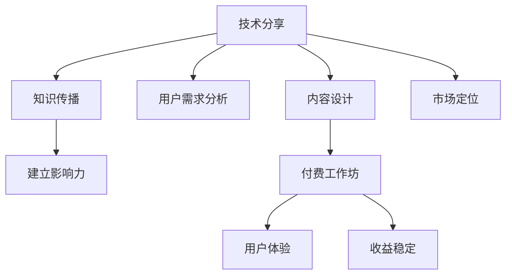

                 

关键词：技术分享、付费工作坊、转化策略、市场定位、内容设计、用户参与

> 摘要：在信息技术飞速发展的今天，如何将技术分享转化为有价值的付费工作坊，成为了许多技术专家和知识传播者面临的重要课题。本文将探讨这一过程的策略、市场定位、内容设计、用户参与等方面，旨在为读者提供一套完整的实践指南。

## 1. 背景介绍

### 技术分享的现状

随着互联网的普及和社交媒体的发展，技术分享已经成为一种重要的知识传播方式。无论是在线课程、博客文章，还是GitHub上的开源项目，技术分享都在帮助人们学习新技能、解决问题，甚至推动技术革新。然而，技术分享并不是单向的，它也成为了知识传播者获得影响力、建立个人品牌的有效途径。

### 付费工作坊的优势

相较于传统的免费分享，付费工作坊具有以下优势：

- **收益稳定**：付费模式为知识传播者提供了持续的收入来源。
- **用户体验**：付费工作坊通常提供更高质量的内容和互动体验。
- **知识深度**：付费工作坊可以深入探讨特定领域的技术细节，而不仅仅是表面的知识普及。

## 2. 核心概念与联系

为了更好地理解如何将技术分享转化为付费工作坊，我们需要明确以下几个核心概念：

- **技术分享**：以博客、在线课程、GitHub项目等形式，将技术知识传播给他人。
- **付费工作坊**：针对特定技术主题，为参与者提供深入学习和实践的机会，通常以付费形式进行。
- **市场定位**：明确目标受众，了解他们的需求和偏好。
- **内容设计**：设计适合工作坊的主题、内容和形式。
- **用户参与**：激发用户的参与热情，提高工作坊的互动性和实用性。

下面是一个简化的 Mermaid 流程图，展示了这些核心概念之间的关系：

## 3. 核心算法原理 & 具体操作步骤

### 3.1 算法原理概述

将技术分享转化为付费工作坊的过程，可以看作是一种基于市场需求的算法优化。该算法的核心原理包括以下几个方面：

- **需求分析**：通过市场调研和用户反馈，了解目标受众的需求。
- **内容设计**：根据需求分析结果，设计出能够满足用户需求的工作坊内容。
- **用户体验**：提供高质量的内容和服务，提高用户的满意度和参与度。
- **收益优化**：通过定价策略和营销手段，实现收益最大化。

### 3.2 算法步骤详解

1. **需求分析**
   - **市场调研**：通过问卷调查、用户访谈、社交媒体分析等手段，收集用户的需求信息。
   - **数据分析**：对收集到的数据进行分析，识别出用户最关注的技术主题和痛点。

2. **内容设计**
   - **主题确定**：根据需求分析结果，确定工作坊的主题和内容。
   - **内容规划**：设计工作坊的课时安排、课程内容、实践环节等。

3. **用户体验**
   - **课程讲授**：采用互动式教学，提高用户的参与度和学习效果。
   - **实践环节**：提供实际操作的机会，帮助用户将知识转化为技能。

4. **收益优化**
   - **定价策略**：根据成本和市场需求，设定合理的价格。
   - **营销推广**：通过线上线下多种渠道，进行工作坊的推广。

### 3.3 算法优缺点

**优点：**
- **收益稳定**：通过付费模式，为知识传播者提供了稳定的收入来源。
- **用户体验**：高质量的内容和服务，提高了用户的满意度和参与度。
- **知识深度**：深入探讨特定领域的技术细节，满足用户对深度学习的需求。

**缺点：**
- **市场风险**：市场需求的不确定性，可能导致工作坊的收益不稳定。
- **内容重复**：由于技术更新迅速，内容设计可能面临重复和更新的挑战。

### 3.4 算法应用领域

- **IT技术**：包括软件开发、人工智能、网络安全等领域。
- **数据分析**：包括数据挖掘、大数据处理、机器学习等领域。
- **云计算**：包括云架构设计、云计算服务、云安全等领域。

## 4. 数学模型和公式 & 详细讲解 & 举例说明

### 4.1 数学模型构建

为了更深入地理解如何将技术分享转化为付费工作坊，我们可以构建一个简单的数学模型。该模型包括以下几个关键变量：

- \( D \)：市场需求量（单位：人）
- \( P \)：价格（单位：元）
- \( C \)：成本（单位：元）
- \( R \)：收益（单位：元）

收益 \( R \) 可以通过以下公式计算：

\[ R = D \times P - C \]

其中，\( D \) 和 \( P \) 需要通过市场需求分析和定价策略来确定。

### 4.2 公式推导过程

为了推导收益 \( R \) 的公式，我们可以从以下几个步骤进行分析：

1. **市场需求量 \( D \)**：市场需求量受多个因素影响，如用户数量、市场需求趋势、竞争对手等。我们可以通过市场调研和数据分析来估计 \( D \)。

2. **价格 \( P \)**：价格受成本、市场竞争、用户需求等影响。通过成本分析和定价策略，我们可以确定一个合理的价格 \( P \)。

3. **成本 \( C \)**：成本包括内容制作成本、授课成本、场地租赁成本等。通过对各项成本进行详细估算，我们可以得到总成本 \( C \)。

4. **收益 \( R \)**：根据市场需求量 \( D \) 和价格 \( P \)，我们可以计算出收益 \( R \)。具体计算方法如下：

\[ R = D \times P - C \]

### 4.3 案例分析与讲解

假设我们计划举办一场关于“Python 数据分析”的付费工作坊。通过市场调研和数据分析，我们得到以下信息：

- **市场需求量 \( D \)**：预计有 100 人参加。
- **价格 \( P \)**：每人参

