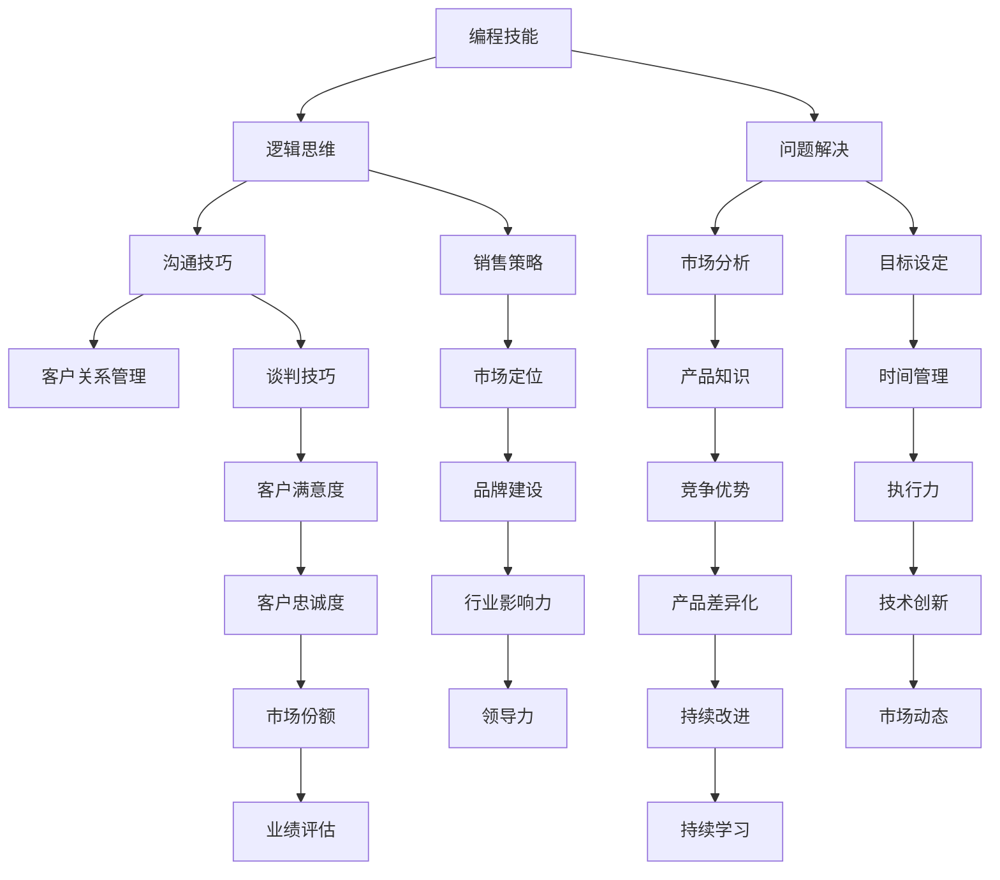

                 

关键词：编程技能、销售能力、转化、技术销售、沟通技巧、市场策略、客户关系管理、产品知识

> 摘要：本文旨在探讨如何将编程技能有效转化为销售能力，为技术专业人士提供从技术到销售的转型指南。通过分析技术背景下的销售特点，探讨核心概念、算法原理，并结合实际案例进行解读，本文将帮助读者了解如何在技术市场中有效销售产品和服务。

## 1. 背景介绍

在当今技术飞速发展的时代，编程技能已经成为了许多人职业发展的核心能力。然而，很多拥有强大编程背景的专业人士在面对销售职位时，往往感到迷茫和无从下手。这是因为编程与销售之间存在显著的差异。编程是关于创造和解决问题的，而销售则是关于说服和交易的。

技术专业人士通常具备以下优点：

- **技术理解力**：能够快速掌握新技术和工具。
- **逻辑思维能力**：擅长分析和解决复杂问题。
- **解决问题的能力**：擅长将理论应用于实践。

然而，在销售领域，他们可能面临以下挑战：

- **沟通障碍**：技术术语可能难以向非技术人员解释。
- **心理障碍**：从解决问题转向销售可能感到不适应。
- **市场理解**：对市场需求和竞争态势可能缺乏深入理解。

本文将探讨如何克服这些挑战，并将编程技能转化为销售能力，从而在技术市场中取得成功。

## 2. 核心概念与联系

为了更好地理解如何将编程技能应用于销售，我们需要先探讨几个核心概念，并使用 Mermaid 流程图来展示它们之间的关系。



### 2.1 编程技能与销售策略

编程技能和销售策略之间的联系在于，两者都涉及到逻辑思考和问题解决。编程中的算法设计可以帮助销售策略的制定，例如：

- **目标设定**：算法中的目标函数可以帮助设定销售目标。
- **市场定位**：通过数据分析，可以找到最有效的市场定位策略。
- **时间管理**：算法中的时间复杂度可以帮助优化销售流程，提高效率。

### 2.2 沟通技巧与客户关系管理

沟通技巧在销售中至关重要。一个成功的销售人员需要能够清晰地传达产品优势，并有效地与客户沟通。编程背景可以帮助销售人员：

- **简化复杂概念**：通过类比和简化，将技术概念转化为客户易于理解的语言。
- **提高表达能力**：编程训练了逻辑思考和清晰的沟通方式。

### 2.3 市场分析与竞争优势

市场分析是销售成功的关键。编程技能可以帮助销售人员：

- **数据收集**：编写脚本和程序来收集市场数据。
- **数据分析**：运用统计分析工具来分析市场趋势和竞争对手。

### 2.4 产品知识与持续学习

对产品的深入了解是销售的基础。编程背景可以帮助销售人员：

- **技术理解**：深入了解产品背后的技术，从而更好地向客户解释。
- **持续学习**：编程需要不断学习新技术，这种学习习惯可以应用到销售中，持续提高自身的专业能力。

## 3. 核心算法原理 & 具体操作步骤

### 3.1 算法原理概述

在销售过程中，算法原理可以帮助我们优化决策，提高销售效果。以下是一些关键算法原理及其在销售中的应用：

1. **线性回归**：用于预测销售额和市场需求。
2. **决策树**：用于分析客户购买行为和制定个性化销售策略。
3. **随机森林**：用于评估不同销售渠道的效果，优化资源配置。
4. **神经网络**：用于客户行为分析，预测客户需求。

### 3.2 算法步骤详解

1. **数据收集**：收集与销售相关的数据，如客户信息、市场趋势、竞争对手数据等。
2. **数据处理**：清洗数据，处理缺失值和异常值。
3. **特征选择**：选择对销售有显著影响的关键特征。
4. **模型训练**：使用选定的特征训练模型。
5. **模型评估**：评估模型性能，调整模型参数。
6. **决策应用**：将模型应用于实际销售过程，如预测销售额、制定销售策略等。

### 3.3 算法优缺点

- **优点**：算法可以提高销售预测的准确性，优化销售策略。
- **缺点**：算法依赖于数据质量，数据不准确可能导致错误决策。

### 3.4 算法应用领域

算法在销售中的应用非常广泛，包括：

- **市场预测**：通过算法预测市场需求，制定销售计划。
- **客户细分**：通过算法分析客户行为，制定个性化销售策略。
- **库存管理**：通过算法优化库存，减少库存成本。
- **广告投放**：通过算法优化广告投放，提高广告效果。

## 4. 数学模型和公式 & 详细讲解 & 举例说明

在销售中，数学模型可以帮助我们更好地理解市场动态，制定有效的销售策略。以下是一个简单的线性回归模型，用于预测销售额。

### 4.1 数学模型构建

线性回归模型的一般形式为：

$$
y = \beta_0 + \beta_1x_1 + \beta_2x_2 + ... + \beta_nx_n + \epsilon
$$

其中，\( y \) 是销售额，\( x_1, x_2, ..., x_n \) 是影响销售额的关键因素（如广告投入、市场趋势等），\( \beta_0, \beta_1, ..., \beta_n \) 是模型的参数，\( \epsilon \) 是误差项。

### 4.2 公式推导过程

线性回归模型的参数可以通过最小二乘法求解。最小二乘法的目的是找到一组参数，使得实际销售额与预测销售额之间的误差平方和最小。

### 4.3 案例分析与讲解

假设我们想要预测某产品的销售额，我们收集了以下数据：

- 广告投入（x1）：10000元
- 市场趋势（x2）：增长5%
- 竞争对手活动（x3）：增加2个新产品

我们使用线性回归模型进行预测，得到以下结果：

$$
\text{销售额} = 20000 + 1.2 \times \text{广告投入} + 0.8 \times \text{市场趋势} - 0.5 \times \text{竞争对手活动}
$$

根据当前的数据，我们预测的销售额为：

$$
\text{销售额} = 20000 + 1.2 \times 10000 + 0.8 \times 5\% - 0.5 \times 2 = 23200 \text{元}
$$

这个预测结果可以帮助我们制定下一步的销售策略。

## 5. 项目实践：代码实例和详细解释说明

为了更好地理解如何将编程技能应用于销售，以下是一个简单的 Python 代码实例，用于预测销售额。

### 5.1 开发环境搭建

确保您已安装 Python 3.6 或以上版本，以及 NumPy 和 Pandas 库。

```bash
pip install numpy pandas
```

### 5.2 源代码详细实现

```python
import numpy as np
import pandas as pd

# 数据加载
data = pd.read_csv('sales_data.csv')

# 特征选择
features = data[['advertisement', 'market_trend', 'competitor_activity']]

# 目标变量
sales = data['sales']

# 模型训练
model = pd.OLS(sales, features).fit()

# 模型评估
print(model.summary())

# 预测
predictions = model.predict(features)

# 结果展示
print(predictions)
```

### 5.3 代码解读与分析

- **数据加载**：使用 Pandas 库加载销售数据。
- **特征选择**：选择影响销售额的关键特征。
- **模型训练**：使用最小二乘法训练线性回归模型。
- **模型评估**：打印模型评估报告。
- **预测**：使用训练好的模型进行销售额预测。

这个简单的例子展示了如何使用编程技能构建和评估线性回归模型，以预测销售额。

## 6. 实际应用场景

### 6.1 市场预测

通过构建线性回归模型，企业可以预测未来的市场趋势，从而制定更有效的销售策略。例如，一家电子商务公司可以通过分析历史销售数据和当前市场状况，预测未来三个月的销售额，以便调整库存和广告预算。

### 6.2 客户细分

通过客户行为分析，企业可以识别出高价值客户和潜在客户，并制定个性化的销售策略。例如，一家电商平台可以通过分析客户的购买历史和行为特征，将客户分为不同的细分群体，并针对每个群体提供定制化的促销活动。

### 6.3 库存管理

通过预测销售量，企业可以优化库存管理，减少库存成本。例如，一家服装制造商可以通过预测未来三个月的销售量，调整生产计划和库存水平，以避免库存过剩或不足。

### 6.4 广告投放

通过分析不同广告渠道的效果，企业可以优化广告投放策略，提高广告效果。例如，一家广告公司可以通过分析不同广告渠道的点击率、转化率和 ROI，调整广告预算和投放策略，以最大化广告收益。

## 7. 工具和资源推荐

### 7.1 学习资源推荐

- **《Python编程：从入门到实践》**：适合初学者的 Python 入门书籍。
- **《销售方法论》**：介绍销售理论和实战技巧的书籍。
- **《机器学习实战》**：涵盖多种机器学习算法和实践案例的书籍。

### 7.2 开发工具推荐

- **Jupyter Notebook**：用于编写和运行 Python 代码的交互式环境。
- **NumPy**：用于数值计算的库。
- **Pandas**：用于数据分析和操作的库。
- **Scikit-learn**：用于机器学习的库。

### 7.3 相关论文推荐

- **“A Machine Learning Approach for Predicting Sales”**：探讨如何使用机器学习预测销售的论文。
- **“Customer Segmentation for Sales Optimization”**：探讨如何通过客户细分优化销售的论文。
- **“Using Predictive Analytics for Inventory Management”**：探讨如何使用预测分析优化库存管理的论文。

## 8. 总结：未来发展趋势与挑战

随着技术的不断进步，编程技能和销售能力之间的联系将越来越紧密。未来，我们可能会看到：

### 8.1 研究成果总结

- **数据驱动决策**：越来越多的企业将采用数据驱动的方法来制定销售策略。
- **人工智能应用**：人工智能技术将在销售领域得到广泛应用，如客户细分、个性化推荐等。
- **跨学科融合**：编程技能和销售能力将不断融合，形成新的职业角色，如数据驱动销售分析师。

### 8.2 未来发展趋势

- **个性化销售**：基于客户数据的个性化销售将成为主流。
- **自动化销售**：自动化工具将帮助销售团队提高效率，减少重复性工作。
- **全球销售**：随着互联网的普及，全球销售将成为重要趋势。

### 8.3 面临的挑战

- **数据隐私**：在收集和使用客户数据时，需要严格遵守隐私法规。
- **技术更新**：随着技术的快速发展，销售团队需要不断学习新技术。
- **跨文化沟通**：在全球销售中，需要处理跨文化的沟通和合作问题。

### 8.4 研究展望

未来，我们可以期待编程技能和销售能力的进一步融合，从而创造出更加高效、个性化的销售体验。同时，我们也需要关注技术发展带来的挑战，积极应对，确保在技术市场中取得成功。

## 9. 附录：常见问题与解答

### 9.1 什么是数据驱动销售？

数据驱动销售是指通过分析销售数据和市场数据来制定销售策略和决策。这种方法可以帮助企业更准确地预测市场趋势，优化销售流程，提高销售业绩。

### 9.2 如何提升沟通技巧？

- **练习表达**：通过写作、演讲等方式练习表达。
- **倾听**：积极倾听客户的意见和需求。
- **使用简单语言**：避免使用复杂的术语，尽量使用简单易懂的语言。

### 9.3 如何进行市场分析？

- **收集数据**：收集与市场相关的数据，如竞争对手信息、市场趋势等。
- **数据清洗**：处理缺失值和异常值，确保数据质量。
- **数据分析**：使用统计方法和工具分析数据，提取有价值的信息。

### 9.4 如何制定有效的销售策略？

- **目标设定**：明确销售目标，如销售额、客户数量等。
- **市场定位**：根据目标客户和市场需求，确定市场定位。
- **资源配置**：根据销售策略，合理配置资源，如人员、资金等。

## 参考文献

- 《Python编程：从入门到实践》
- 《销售方法论》
- 《机器学习实战》
- “A Machine Learning Approach for Predicting Sales”
- “Customer Segmentation for Sales Optimization”
- “Using Predictive Analytics for Inventory Management”

### 作者署名

作者：禅与计算机程序设计艺术 / Zen and the Art of Computer Programming

