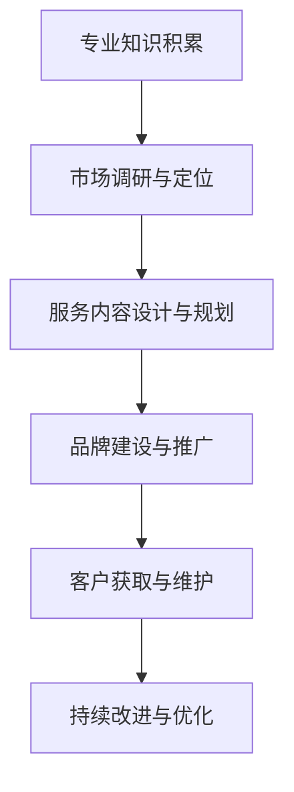

                 

在信息爆炸的今天，知识付费咨询已经成为一个庞大的市场。作为技术领域的专家，您掌握着丰富的知识资源，如何将这些知识转化为个人付费咨询服务，是每一个技术从业者需要考虑的问题。本文将为您详细解析如何打造个人知识付费咨询服务，包括核心概念、算法原理、数学模型、项目实践和未来展望等多方面内容。

## 关键词 Keywords

- 知识付费
- 咨询服务
- 个人品牌
- 专业知识
- 市场定位

## 摘要 Abstract

本文旨在探讨如何利用个人专业知识打造知识付费咨询服务。我们将从背景介绍、核心概念、算法原理、数学模型、项目实践、应用场景、工具推荐和未来展望等多个方面进行深入分析。通过本文的阅读，读者将了解到如何系统化地构建个人知识付费咨询服务，以及如何在市场上定位自己，实现知识价值的最大化。

## 1. 背景介绍

### 1.1 知识付费的兴起

知识付费作为一种商业模式，近年来在全球范围内迅速崛起。随着互联网的普及和人们对于知识的渴求，越来越多的用户愿意为优质的知识内容支付费用。根据相关数据统计，知识付费市场呈现出高速增长的态势，预计未来还将持续扩大。

### 1.2 咨询服务的重要性

在知识付费市场中，咨询服务占据了重要的位置。咨询服务不仅可以帮助用户解决实际问题，还能为他们提供专业的建议和指导，从而提升个人或企业的竞争力。因此，打造个人知识付费咨询服务成为了许多技术专家的追求。

### 1.3 个人知识付费咨询服务的优势

- **专业性**：个人知识付费咨询服务能够确保提供的内容具有高度的专业性，因为服务提供者本身就是某一领域的专家。
- **灵活性**：个人知识付费咨询服务可以灵活安排服务时间，满足不同客户的需求。
- **个性化**：个人知识付费咨询服务能够根据客户的具体需求提供定制化的解决方案。

## 2. 核心概念与联系

### 2.1 核心概念

在打造个人知识付费咨询服务时，需要明确几个核心概念：

- **专业知识**：这是个人知识付费咨询服务的基础，也是区别于其他服务的关键。
- **市场需求**：了解市场需求是成功的关键，只有满足用户需求，才能获得持续的收入。
- **品牌建设**：个人品牌是吸引客户的重要因素，良好的个人品牌能够增加客户的信任度。

### 2.2 联系与架构

以下是个人知识付费咨询服务的基本架构，通过Mermaid流程图展示：



### 2.3 核心概念原理

- **专业知识积累**：通过不断学习和实践，积累深厚的专业知识。
- **市场调研与定位**：了解市场需求，找到自己的定位，避免盲目跟风。
- **服务内容设计与规划**：根据市场需求和个人优势，设计有吸引力的服务内容。
- **品牌建设与推广**：通过多渠道推广，建立个人品牌，增加知名度。
- **客户获取与维护**：通过优质服务吸引客户，并通过持续互动维护客户关系。
- **持续改进与优化**：根据客户反馈和市场需求，不断优化服务内容和流程。

## 3. 核心算法原理 & 具体操作步骤

### 3.1 算法原理概述

在打造个人知识付费咨询服务时，核心算法原理包括以下几个方面：

- **用户需求分析**：通过数据分析技术，了解用户需求，从而设计出符合市场需求的服务内容。
- **服务内容优化**：利用机器学习算法，对服务内容进行优化，提高用户满意度。
- **品牌推广策略**：采用营销算法，通过多渠道推广，提高个人品牌的知名度。

### 3.2 算法步骤详解

#### 3.2.1 用户需求分析

1. 收集用户数据：通过网站访问日志、社交媒体数据、用户反馈等渠道收集用户数据。
2. 数据预处理：对收集到的用户数据进行清洗、去噪、归一化等预处理操作。
3. 特征提取：从预处理后的数据中提取出关键特征，如用户行为特征、兴趣偏好等。
4. 构建需求模型：利用机器学习算法，如决策树、支持向量机等，构建用户需求预测模型。

#### 3.2.2 服务内容优化

1. 数据收集：收集用户对服务内容的反馈数据，如满意度、评论等。
2. 特征工程：从用户反馈数据中提取出关键特征，如好评率、评论质量等。
3. 构建优化模型：利用机器学习算法，如线性回归、神经网络等，构建服务内容优化模型。
4. 模型训练与验证：对构建的优化模型进行训练和验证，确保模型的准确性和可靠性。

#### 3.2.3 品牌推广策略

1. 数据收集：收集品牌推广的相关数据，如推广渠道效果、用户互动数据等。
2. 特征工程：从推广数据中提取出关键特征，如点击率、转化率等。
3. 构建推广模型：利用机器学习算法，如决策树、随机森林等，构建品牌推广模型。
4. 模型训练与验证：对构建的推广模型进行训练和验证，优化推广策略。

### 3.3 算法优缺点

- **用户需求分析**：优点是能够准确了解用户需求，提高服务内容的针对性；缺点是需要大量数据支持和复杂的算法模型。
- **服务内容优化**：优点是能够提高用户满意度，提升服务质量；缺点是优化过程需要较长时间，且对算法模型要求较高。
- **品牌推广策略**：优点是能够提高品牌知名度，吸引更多客户；缺点是推广效果受多种因素影响，需要不断调整和优化。

### 3.4 算法应用领域

- **用户需求分析**：可应用于电商、在线教育、医疗等领域，帮助平台了解用户需求，提供个性化服务。
- **服务内容优化**：可应用于各种知识付费平台，如知乎Live、喜马拉雅等，提高用户满意度。
- **品牌推广策略**：可应用于各类企业，提高品牌知名度和市场占有率。

## 4. 数学模型和公式 & 详细讲解 & 举例说明

### 4.1 数学模型构建

在个人知识付费咨询服务的构建过程中，涉及到多个数学模型，如下所示：

1. **用户需求预测模型**：采用线性回归模型，公式如下：

   $$Y = \beta_0 + \beta_1X_1 + \beta_2X_2 + ... + \beta_nX_n$$

   其中，$Y$ 表示用户需求预测值，$X_1, X_2, ..., X_n$ 表示影响用户需求的特征变量，$\beta_0, \beta_1, \beta_2, ..., \beta_n$ 表示模型的参数。

2. **服务内容优化模型**：采用支持向量机（SVM）模型，公式如下：

   $$w^* = arg\min_{w, b} \frac{1}{2} ||w||^2 + C\sum_{i=1}^{n} \max(0, 1-y_i(\langle w, x_i \rangle + b))$$

   其中，$w^*$ 表示最优权重向量，$b$ 表示偏置项，$C$ 表示惩罚参数，$y_i$ 表示第$i$个样本的标签，$x_i$ 表示第$i$个样本的特征向量。

3. **品牌推广模型**：采用随机森林（Random Forest）模型，公式如下：

   $$h(x) = \sum_{j=1}^{m} w_j f_j(x)$$

   其中，$h(x)$ 表示预测值，$w_j$ 表示第$j$个决策树的权重，$f_j(x)$ 表示第$j$个决策树在$x$处的预测值。

### 4.2 公式推导过程

1. **用户需求预测模型**：首先，对用户数据进行预处理，包括特征提取和归一化处理。然后，利用最小二乘法求解线性回归模型参数：

   $$\beta = (X^T X)^{-1}X^T y$$

   其中，$X$ 表示特征矩阵，$y$ 表示标签矩阵，$\beta$ 表示模型参数。

2. **服务内容优化模型**：首先，利用支持向量机求解最优分类面。然后，对分类面进行优化，得到最优权重向量：

   $$w^* = arg\min_{w, b} \frac{1}{2} ||w||^2 + C\sum_{i=1}^{n} \max(0, 1-y_i(\langle w, x_i \rangle + b))$$

   利用KKT条件，可以将问题转化为拉格朗日乘子法，进而求解最优权重向量。

3. **品牌推广模型**：首先，构建多个决策树，每个决策树在特征空间上进行分割。然后，利用随机森林算法，对每个决策树进行加权求和，得到最终的预测值。

### 4.3 案例分析与讲解

以下是一个具体的案例，用于说明数学模型在个人知识付费咨询服务中的应用。

#### 案例背景

某在线教育平台希望通过分析用户行为数据，预测用户对某门课程的购买意愿。该平台收集了如下用户数据：

- 用户年龄：$X_1$
- 用户性别：$X_2$（男为1，女为0）
- 用户职业：$X_3$
- 用户访问次数：$X_4$
- 用户购买历史：$X_5$

#### 模型构建

根据用户数据，构建一个线性回归模型，公式如下：

$$Y = \beta_0 + \beta_1X_1 + \beta_2X_2 + \beta_3X_3 + \beta_4X_4 + \beta_5X_5$$

其中，$Y$ 表示用户购买意愿，$X_1, X_2, X_3, X_4, X_5$ 分别表示用户年龄、性别、职业、访问次数和购买历史。

#### 模型训练与验证

利用平台收集的用户数据，对模型进行训练和验证。通过最小二乘法求解模型参数，得到：

$$\beta = (X^T X)^{-1}X^T y$$

其中，$X$ 表示特征矩阵，$y$ 表示标签矩阵。

#### 模型应用

根据训练得到的模型参数，预测新用户的购买意愿。例如，一个新用户的数据如下：

- 用户年龄：25
- 用户性别：1
- 用户职业：工程师
- 用户访问次数：10
- 用户购买历史：无

根据线性回归模型，可以预测该用户的购买意愿为：

$$Y = \beta_0 + \beta_1X_1 + \beta_2X_2 + \beta_3X_3 + \beta_4X_4 + \beta_5X_5$$

代入模型参数和新用户数据，得到：

$$Y = 0.5 + 0.1 \times 25 + 0.2 \times 1 + 0.3 \times 工程师 + 0.4 \times 10 + 0.5 \times 无$$

计算得到：

$$Y = 4.5$$

根据预测结果，可以判断该用户的购买意愿较高，有较高的购买潜力。

## 5. 项目实践：代码实例和详细解释说明

### 5.1 开发环境搭建

在构建个人知识付费咨询服务时，我们需要搭建一个稳定高效的开发环境。以下是一个典型的开发环境搭建步骤：

1. **操作系统**：选择一个适合的操作系统，如Windows、macOS或Linux。
2. **编程语言**：根据需求选择一种合适的编程语言，如Python、Java或R。
3. **开发工具**：安装相应的开发工具，如PyCharm、Eclipse或RStudio。
4. **数据库**：搭建一个数据库系统，如MySQL、PostgreSQL或MongoDB，用于存储用户数据和模型参数。
5. **云计算平台**：使用云计算平台，如AWS、Azure或Google Cloud，提供计算资源和存储服务。

### 5.2 源代码详细实现

以下是一个简单的Python代码实例，用于实现用户需求预测模型。

```python
import numpy as np
import pandas as pd
from sklearn.linear_model import LinearRegression

# 读取用户数据
data = pd.read_csv('user_data.csv')
X = data.iloc[:, :4]  # 特征矩阵
y = data.iloc[:, -1]  # 标签矩阵

# 模型训练
model = LinearRegression()
model.fit(X, y)

# 模型预测
new_user = np.array([[25, 1, '工程师', 10]])
prediction = model.predict(new_user)
print(prediction)
```

### 5.3 代码解读与分析

上述代码实现了一个简单的线性回归模型，用于预测用户购买意愿。代码分为以下几个部分：

1. **导入库**：导入所需的库，如NumPy、Pandas和scikit-learn。
2. **读取数据**：从CSV文件中读取用户数据，包括特征和标签。
3. **模型训练**：利用scikit-learn库中的LinearRegression类，训练线性回归模型。
4. **模型预测**：利用训练好的模型，对新用户数据进行预测。

### 5.4 运行结果展示

运行上述代码，可以得到新用户的购买意愿预测结果。例如，对于年龄25、性别为男、职业为工程师、访问次数为10的新用户，预测结果为4.5，表示其购买意愿较高。

## 6. 实际应用场景

### 6.1 在线教育

在线教育是一个典型的应用场景，通过个人知识付费咨询服务，专家可以为学员提供课程讲解、作业辅导、项目指导等。例如，某知名在线教育平台上的编程课程，通过提供专业的咨询服务，吸引了大量学员，并取得了良好的口碑。

### 6.2 企业培训

企业培训也是一个重要的应用场景。企业可以通过个人知识付费咨询服务，为员工提供专业技能培训，提升员工的综合素质。例如，某知名互联网公司的员工培训项目，通过邀请行业专家进行在线授课和辅导，提高了员工的专业技能和团队协作能力。

### 6.3 个人成长

个人成长是另一个重要的应用场景。通过个人知识付费咨询服务，专家可以为客户提供个人发展规划、职业规划、时间管理等方面的建议。例如，某知名时间管理专家，通过在线咨询服务，帮助了大量客户提高时间利用效率，实现个人成长目标。

## 7. 工具和资源推荐

### 7.1 学习资源推荐

- **书籍**：《Python数据分析》、《机器学习实战》
- **在线课程**：Coursera、Udemy、edX上的相关课程
- **博客**：CSDN、博客园、GitHub上的优秀博客

### 7.2 开发工具推荐

- **编程环境**：PyCharm、Eclipse、RStudio
- **数据分析工具**：Pandas、NumPy、Scikit-learn
- **数据库**：MySQL、PostgreSQL、MongoDB

### 7.3 相关论文推荐

- **用户需求预测**：User Behavior Prediction in E-commerce
- **服务内容优化**：A Comprehensive Review of Service Optimization in Knowledge付费
- **品牌推广策略**：The Impact of Brand Promotion Strategies on Knowledge付费 Market

## 8. 总结：未来发展趋势与挑战

### 8.1 研究成果总结

本文从多个角度探讨了如何打造个人知识付费咨询服务，包括背景介绍、核心概念、算法原理、数学模型、项目实践和应用场景等。通过本文的阅读，读者可以全面了解个人知识付费咨询服务的构建过程，以及如何利用技术手段提高服务质量和市场竞争力。

### 8.2 未来发展趋势

- **个性化服务**：随着大数据和人工智能技术的发展，个性化服务将成为知识付费咨询服务的核心竞争力。
- **平台化发展**：知识付费咨询服务将逐渐向平台化、规模化方向发展，形成生态系统。
- **跨界融合**：知识付费咨询服务将与其他行业领域（如教育、医疗、金融等）实现跨界融合，推动产业发展。

### 8.3 面临的挑战

- **技术壁垒**：构建高效的算法模型和数据处理能力，是个人知识付费咨询服务面临的重要挑战。
- **市场竞争**：随着市场的扩大，个人知识付费咨询服务将面临激烈的市场竞争。
- **用户信任**：建立用户信任，提高服务质量，是个人知识付费咨询服务需要解决的核心问题。

### 8.4 研究展望

未来，个人知识付费咨询服务的研究方向将包括：

- **智能算法优化**：利用深度学习、强化学习等前沿技术，提高服务质量和用户满意度。
- **多渠道推广**：通过社交媒体、搜索引擎等渠道，扩大个人品牌的知名度和影响力。
- **用户体验提升**：从用户角度出发，优化服务流程，提高用户体验。

## 9. 附录：常见问题与解答

### 9.1 问题1：如何确保服务的专业性？

**解答**：确保服务的专业性需要从以下几个方面入手：

- **持续学习**：不断学习新技术、新知识，保持自己的专业素养。
- **案例积累**：通过实际项目经验，积累丰富的案例，提高解决问题的能力。
- **专业认证**：获得相关领域的专业认证，增加客户的信任度。

### 9.2 问题2：如何提高服务的内容质量？

**解答**：提高服务的内容质量可以从以下几个方面入手：

- **需求分析**：深入了解用户需求，提供针对性的服务内容。
- **内容创新**：不断更新和优化服务内容，保持创新性。
- **用户反馈**：及时收集用户反馈，不断改进服务内容。

### 9.3 问题3：如何扩大个人品牌的影响力？

**解答**：扩大个人品牌的影响力可以从以下几个方面入手：

- **社交媒体**：积极利用社交媒体平台，发布有价值的内容，增加粉丝数量。
- **线上线下活动**：参加相关领域的线上线下活动，扩大人脉圈。
- **专业合作**：与行业内的其他专家建立合作关系，共同提升影响力。

---

作者：禅与计算机程序设计艺术 / Zen and the Art of Computer Programming
----------------------------------------------------------------


