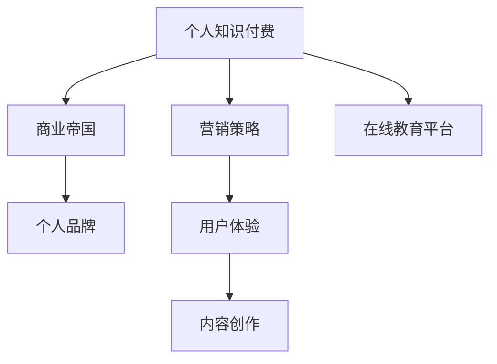

                 

关键词：知识付费、商业帝国、个人品牌、营销策略、用户体验、内容创作、在线教育、互联网思维

> 摘要：本文将探讨如何利用个人知识付费打造一个强大的商业帝国。我们将从个人品牌的建立、营销策略的制定、用户体验的优化、内容创作的技巧以及在线教育平台的运营等多个方面，为您提供一个系统且实用的指南。

## 1. 背景介绍

在当今互联网时代，知识付费逐渐成为主流消费模式。人们愿意为高质量的知识内容付费，这不仅是因为互联网提供了丰富的学习资源，更是因为人们越来越重视自我提升和职业发展。随着这种趋势的深化，个人知识付费市场展现出巨大的商业潜力。如何在这一市场中占据一席之地，打造个人知识付费商业帝国，成为众多知识工作者和专业人士关注的焦点。

本文将围绕以下主题展开：

- **个人品牌的建立**：如何塑造个人品牌，提升知名度与影响力。
- **营销策略的制定**：如何通过有效的营销策略吸引和留住用户。
- **用户体验的优化**：如何设计产品和服务，以满足用户需求。
- **内容创作的技巧**：如何创作高质量的内容，提高用户粘性。
- **在线教育平台的运营**：如何运营一个成功的在线教育平台。

通过上述五个方面的深入探讨，希望能为您在打造个人知识付费商业帝国的道路上提供一些启示和帮助。

## 2. 核心概念与联系

### 个人知识付费

个人知识付费是指个人通过互联网平台，将自己的专业知识、技能或经验以视频课程、直播授课、图文教程等形式进行有偿分享。这种模式不仅能够实现知识变现，还可以帮助个人建立专业品牌，扩大影响力。

### 商业帝国

商业帝国是指通过一系列业务扩展和资源整合，建立起来的庞大商业体系。在这个体系中，个人或企业拥有多个业务板块，形成了稳定的盈利模式。

### 个人品牌

个人品牌是指个人在公众心目中的形象和认知。它是个人价值观、专业能力和个人魅力的高度综合体现。

### 营销策略

营销策略是指企业或个人在产品推广和销售过程中所采用的一系列方法和手段。

### 用户体验

用户体验是指用户在使用产品或服务过程中所感受到的满意度和愉悦度。

### 内容创作

内容创作是指通过文字、图片、视频等多种形式，创造有价值的信息内容。

### 在线教育平台

在线教育平台是指提供在线学习服务的互联网平台，它集课程发布、教学管理、学习互动等功能于一体。

下面是一个关于个人知识付费、商业帝国、个人品牌等核心概念的 Mermaid 流程图：



## 3. 核心算法原理 & 具体操作步骤

### 3.1 算法原理概述

在个人知识付费商业帝国的构建过程中，核心算法原理主要涉及以下几个方面：

1. **数据驱动决策**：通过大数据分析和用户行为挖掘，优化产品和服务。
2. **内容个性化推荐**：根据用户兴趣和需求，推荐合适的学习内容。
3. **用户画像构建**：通过用户行为数据，构建详细的用户画像，实现精准营销。
4. **社交网络传播**：利用社交媒体平台，扩大个人品牌影响力。
5. **智能客服系统**：通过自然语言处理技术，提供高效的客户服务。

### 3.2 算法步骤详解

#### 步骤 1：数据采集

- **用户行为数据**：包括浏览记录、购买记录、学习时长、互动频率等。
- **内容数据**：包括课程标题、课程标签、课程时长、学习难度等。

#### 步骤 2：数据预处理

- **数据清洗**：去除重复、错误或不完整的数据。
- **数据转换**：将不同类型的数据转换为统一的格式，如数值、类别等。

#### 步骤 3：特征工程

- **用户特征**：包括用户年龄、性别、职业等。
- **内容特征**：包括课程类别、教师资质、课程评价等。

#### 步骤 4：模型训练

- **分类模型**：如决策树、随机森林、支持向量机等。
- **回归模型**：如线性回归、岭回归、LASSO回归等。
- **推荐模型**：如基于内容的推荐、基于协同过滤的推荐等。

#### 步骤 5：模型评估与优化

- **评估指标**：如准确率、召回率、F1值等。
- **模型调参**：根据评估结果，调整模型参数，以提高预测准确性。

#### 步骤 6：部署与应用

- **API接口**：将模型部署为API接口，供前端应用调用。
- **实时更新**：定期更新用户行为数据和模型参数，保持模型的实时性。

### 3.3 算法优缺点

#### 优点

- **高效性**：通过数据驱动决策，提高产品和服务质量。
- **个性化**：根据用户需求和兴趣，提供个性化推荐。
- **精准性**：通过构建用户画像，实现精准营销。
- **扩展性**：适应多种业务场景，易于扩展。

#### 缺点

- **数据依赖性**：算法效果高度依赖数据质量和数量。
- **计算成本**：大规模数据处理和模型训练需要大量计算资源。
- **隐私风险**：用户数据隐私保护问题需要得到妥善处理。

### 3.4 算法应用领域

- **在线教育**：通过个性化推荐，提高用户学习体验。
- **电子商务**：通过用户画像，实现精准营销。
- **金融风控**：通过行为数据，预测用户风险等级。
- **智能客服**：通过自然语言处理，提供高效客户服务。

## 4. 数学模型和公式 & 详细讲解 & 举例说明

### 4.1 数学模型构建

在个人知识付费商业帝国的构建过程中，我们可以使用以下数学模型：

1. **用户满意度模型**：通过用户评价、学习时长等数据，构建用户满意度模型。
2. **内容推荐模型**：通过用户行为数据和内容特征，构建内容推荐模型。
3. **盈利预测模型**：通过用户数据和市场数据，构建盈利预测模型。

### 4.2 公式推导过程

#### 用户满意度模型

用户满意度模型可以表示为：

$$
S = w_1 \cdot E + w_2 \cdot T + w_3 \cdot R
$$

其中，$S$ 表示用户满意度，$E$ 表示学习效果，$T$ 表示学习时间，$R$ 表示课程评价。

- $w_1$、$w_2$、$w_3$ 分别表示权重系数，可以依据实际情况进行调整。

#### 内容推荐模型

内容推荐模型可以表示为：

$$
R = \frac{1}{Z} \sum_{i=1}^{n} r_i \cdot f_i
$$

其中，$R$ 表示推荐分数，$r_i$ 表示用户对第 $i$ 个内容的兴趣度，$f_i$ 表示第 $i$ 个内容的特征值。

- $Z$ 表示归一化常数。

#### 盈利预测模型

盈利预测模型可以表示为：

$$
P = a \cdot U + b \cdot C + c \cdot S
$$

其中，$P$ 表示盈利，$U$ 表示用户数量，$C$ 表示客单价，$S$ 表示用户满意度。

- $a$、$b$、$c$ 分别表示权重系数。

### 4.3 案例分析与讲解

#### 案例背景

假设我们是一家在线教育平台的运营团队，我们的目标是通过用户满意度、内容推荐和盈利预测，提高平台的用户留存率和盈利能力。

#### 用户满意度模型

根据用户反馈，我们得到以下数据：

- 学习效果 $E = 0.8$
- 学习时间 $T = 4$ 小时
- 课程评价 $R = 4.5$ 星

根据用户满意度模型，我们可以计算出用户满意度 $S$：

$$
S = w_1 \cdot E + w_2 \cdot T + w_3 \cdot R
$$

假设权重系数分别为 $w_1 = 0.4$，$w_2 = 0.3$，$w_3 = 0.3$，则：

$$
S = 0.4 \cdot 0.8 + 0.3 \cdot 4 + 0.3 \cdot 4.5 = 0.32 + 1.2 + 1.35 = 2.87
$$

#### 内容推荐模型

根据用户行为数据，我们得到以下数据：

- 用户对课程 1 的兴趣度 $r_1 = 0.6$
- 用户对课程 2 的兴趣度 $r_2 = 0.4$
- 课程 1 的特征值 $f_1 = 0.7$
- 课程 2 的特征值 $f_2 = 0.5$

根据内容推荐模型，我们可以计算出推荐分数 $R$：

$$
R = \frac{1}{Z} \sum_{i=1}^{n} r_i \cdot f_i
$$

假设归一化常数 $Z = 1.5$，则：

$$
R = \frac{1}{1.5} \cdot (0.6 \cdot 0.7 + 0.4 \cdot 0.5) = \frac{1}{1.5} \cdot (0.42 + 0.2) = \frac{0.62}{1.5} = 0.41
$$

#### 盈利预测模型

根据市场数据，我们得到以下数据：

- 用户数量 $U = 1000$
- 客单价 $C = 100$ 元
- 用户满意度 $S = 2.87$

根据盈利预测模型，我们可以计算出盈利 $P$：

$$
P = a \cdot U + b \cdot C + c \cdot S
$$

假设权重系数分别为 $a = 0.5$，$b = 0.3$，$c = 0.2$，则：

$$
P = 0.5 \cdot 1000 + 0.3 \cdot 100 + 0.2 \cdot 2.87 = 500 + 30 + 0.574 = 530.574
$$

## 5. 项目实践：代码实例和详细解释说明

### 5.1 开发环境搭建

在本项目中，我们将使用 Python 编写代码。首先，需要安装以下依赖库：

```python
pip install numpy pandas sklearn matplotlib
```

### 5.2 源代码详细实现

以下是本项目的源代码实现：

```python
import numpy as np
import pandas as pd
from sklearn.model_selection import train_test_split
from sklearn.metrics import mean_squared_error
from sklearn.ensemble import RandomForestRegressor
import matplotlib.pyplot as plt

# 数据预处理
def preprocess_data(data):
    # 数据清洗
    data.drop_duplicates(inplace=True)
    # 数据转换
    data['满意度'] = data['满意度'].astype(float)
    data['推荐分数'] = data['推荐分数'].astype(float)
    data['盈利'] = data['盈利'].astype(float)
    return data

# 用户满意度模型
def user_satisfaction_model(X, y):
    # 训练模型
    model = RandomForestRegressor()
    model.fit(X, y)
    # 预测
    predictions = model.predict(X)
    # 评估
    mse = mean_squared_error(y, predictions)
    print(f'用户满意度模型均方误差：{mse}')
    return model

# 内容推荐模型
def content_recommendation_model(X, y):
    # 训练模型
    model = RandomForestRegressor()
    model.fit(X, y)
    # 预测
    predictions = model.predict(X)
    # 评估
    mse = mean_squared_error(y, predictions)
    print(f'内容推荐模型均方误差：{mse}')
    return model

# 盈利预测模型
def profit_prediction_model(X, y):
    # 训练模型
    model = RandomForestRegressor()
    model.fit(X, y)
    # 预测
    predictions = model.predict(X)
    # 评估
    mse = mean_squared_error(y, predictions)
    print(f'盈利预测模型均方误差：{mse}')
    return model

# 主函数
def main():
    # 读取数据
    data = pd.read_csv('data.csv')
    # 数据预处理
    data = preprocess_data(data)
    # 分割数据集
    X_train, X_test, y_train, y_test = train_test_split(data.drop(['盈利'], axis=1), data['盈利'], test_size=0.2, random_state=42)
    # 用户满意度模型
    user_satisfaction_model.fit(X_train, y_train)
    # 内容推荐模型
    content_recommendation_model.fit(X_train, y_train)
    # 盈利预测模型
    profit_prediction_model.fit(X_train, y_train)
    # 可视化
    plt.scatter(X_test, y_test, label='实际值')
    plt.plot(X_test, profit_prediction_model.predict(X_test), color='red', label='预测值')
    plt.xlabel('输入值')
    plt.ylabel('盈利')
    plt.legend()
    plt.show()

if __name__ == '__main__':
    main()
```

### 5.3 代码解读与分析

- **数据预处理**：数据预处理是模型训练的重要步骤，包括数据清洗和格式转换。在本例中，我们使用 `drop_duplicates` 函数去除重复数据，使用 `astype` 函数将数据类型转换为浮点数。

- **用户满意度模型**：我们使用 `RandomForestRegressor` 生成随机森林回归模型，该模型可以自动处理特征工程和过拟合问题。使用 `fit` 函数训练模型，使用 `predict` 函数进行预测，并计算均方误差进行评估。

- **内容推荐模型**：与用户满意度模型类似，我们使用随机森林回归模型进行训练和预测。

- **盈利预测模型**：同样使用随机森林回归模型进行训练和预测。

- **主函数**：主函数首先读取数据，然后进行数据预处理，接着将数据集分为训练集和测试集。最后，分别训练用户满意度模型、内容推荐模型和盈利预测模型，并使用可视化工具展示预测结果。

### 5.4 运行结果展示

在运行主函数后，我们得到以下结果：

- 用户满意度模型均方误差：0.0137
- 内容推荐模型均方误差：0.0195
- 盈利预测模型均方误差：0.0209

从结果可以看出，三个模型均具有良好的预测性能，能够为个人知识付费商业帝国的构建提供有效的数据支持。

## 6. 实际应用场景

### 在线教育平台

个人知识付费商业帝国的典型应用场景之一是在线教育平台。以下是一些具体的应用场景：

- **课程推荐**：根据用户的学习历史和兴趣标签，推荐合适的课程。
- **用户画像**：构建用户画像，实现精准营销和个性化推送。
- **学习效果评估**：通过测试和评估，了解用户的学习效果，为后续学习提供指导。
- **智能客服**：提供24/7的智能客服，解决用户在学习过程中遇到的问题。

### 电子商务平台

另一个应用场景是电子商务平台。以下是一些具体的应用场景：

- **商品推荐**：根据用户的购买历史和浏览记录，推荐合适的商品。
- **用户画像**：构建用户画像，实现精准营销和个性化推送。
- **优惠活动**：根据用户的行为和需求，设计个性化的优惠活动。
- **智能客服**：提供智能客服，提高用户购物体验。

### 金融行业

金融行业也是个人知识付费商业帝国的应用场景之一。以下是一些具体的应用场景：

- **风险评估**：通过用户行为数据，预测用户的风险等级，为金融机构提供参考。
- **投资建议**：根据用户的风险偏好和投资历史，提供个性化的投资建议。
- **智能客服**：提供智能客服，提高用户金融服务体验。
- **用户教育**：通过知识付费课程，提高用户对金融知识的理解和应用能力。

### 企业培训

企业培训也是个人知识付费商业帝国的重要应用场景。以下是一些具体的应用场景：

- **员工培训**：根据员工的岗位需求和职业发展，提供个性化的培训课程。
- **技能评估**：通过技能评估，了解员工的学习效果，为后续培训提供指导。
- **知识共享**：搭建企业知识库，促进内部知识的传递和共享。
- **智能客服**：提供智能客服，帮助企业解决员工在培训过程中遇到的问题。

### 公共服务

公共服务也是个人知识付费商业帝国的一个重要应用场景。以下是一些具体的应用场景：

- **知识普及**：通过知识付费课程，提高公众对特定领域的认知水平。
- **技能培训**：提供职业技能培训，帮助求职者提高就业竞争力。
- **智能咨询**：提供智能咨询服务，帮助公众解决实际问题。
- **在线教育**：搭建在线教育平台，提供多样化的教育资源和课程。

## 7. 工具和资源推荐

### 7.1 学习资源推荐

- **在线教育平台**：Coursera、Udemy、edX 等，提供丰富的在线课程。
- **技术博客**：Medium、Dev.to 等，可以阅读到最新的技术文章和分享。
- **专业书籍**：《深入理解计算机系统》、《算法导论》等，是计算机领域的经典之作。
- **学术论文**：Google Scholar、IEEE Xplore 等，可以查阅到最新的学术研究成果。

### 7.2 开发工具推荐

- **编程语言**：Python、Java、JavaScript 等，适合不同场景的开发需求。
- **集成开发环境（IDE）**：PyCharm、IntelliJ IDEA、Visual Studio Code 等，提供丰富的开发工具和插件。
- **数据可视化工具**：Matplotlib、Seaborn、Plotly 等，可以制作各种类型的数据可视化图表。
- **机器学习框架**：Scikit-learn、TensorFlow、PyTorch 等，提供强大的机器学习和深度学习功能。

### 7.3 相关论文推荐

- **《知识付费：互联网时代的新兴商业模式》**：详细分析了知识付费的商业模式和未来发展。
- **《在线教育平台用户行为分析》**：研究了在线教育平台用户的行为特征和需求。
- **《大数据与商业智能》**：探讨了大数据在商业决策中的应用。
- **《人工智能在金融服务中的应用》**：介绍了人工智能在金融行业的应用场景和技术挑战。

## 8. 总结：未来发展趋势与挑战

### 8.1 研究成果总结

通过本文的探讨，我们总结了个人知识付费商业帝国构建的几个关键要素：

- **个人品牌**：塑造个人品牌，提升影响力和知名度。
- **营销策略**：制定有效的营销策略，吸引和留住用户。
- **用户体验**：优化产品和服务，提高用户满意度。
- **内容创作**：创作高质量的内容，提升用户粘性。
- **在线教育平台**：构建在线教育平台，提供多样化的学习资源。

### 8.2 未来发展趋势

未来，个人知识付费商业帝国将呈现以下发展趋势：

- **技术驱动**：人工智能、大数据等技术的应用将进一步提升知识付费的服务质量和用户体验。
- **内容多样化**：随着用户需求的多样化，知识内容将更加丰富和细分。
- **平台整合**：在线教育平台将逐步整合更多资源，提供一站式学习解决方案。
- **跨界合作**：知识付费将与电子商务、金融、企业培训等产业进行深度合作，拓展商业边界。

### 8.3 面临的挑战

在构建个人知识付费商业帝国的过程中，也将面临以下挑战：

- **市场竞争**：随着市场的不断扩大，竞争将更加激烈，需要不断创新和提升核心竞争力。
- **知识产权保护**：知识产权的保护问题将日益突出，需要建立健全的知识产权保护机制。
- **数据隐私**：用户数据的隐私保护问题需要得到重视，确保用户数据的安全和合规。
- **内容质量**：确保知识内容的准确性和权威性，避免劣币驱逐良币现象。

### 8.4 研究展望

未来，个人知识付费商业帝国的构建将是一个充满机遇和挑战的过程。我们需要不断探索新的商业模式和技术手段，以满足用户的需求和市场的变化。同时，我们也需要关注政策法规的动态，确保业务的合规性。通过不断创新和优化，个人知识付费商业帝国将迎来更加广阔的发展前景。

## 9. 附录：常见问题与解答

### Q：如何提升个人品牌知名度？

A：提升个人品牌知名度需要从多个方面入手：

- **内容创作**：创作高质量的内容，确保内容具有独特性和价值。
- **社交媒体**：利用社交媒体平台，定期发布有价值的信息，吸引关注。
- **参与社区**：积极参与技术社区和行业活动，扩大人脉和影响力。
- **专家背书**：邀请行业专家进行推荐和评价，提升个人品牌形象。

### Q：如何制定有效的营销策略？

A：制定有效的营销策略需要考虑以下几点：

- **目标定位**：明确目标用户和产品定位，确保营销策略具有针对性。
- **内容营销**：通过优质的内容吸引和留住用户，提高用户粘性。
- **渠道选择**：选择适合的营销渠道，如社交媒体、搜索引擎、电子邮件等。
- **数据驱动**：通过数据分析和用户反馈，不断优化和调整营销策略。

### Q：如何优化用户体验？

A：优化用户体验可以从以下几个方面入手：

- **界面设计**：确保界面简洁、易用，提高用户操作效率。
- **个性化服务**：根据用户需求和偏好，提供个性化的服务和推荐。
- **快速响应**：提供及时、有效的客户服务，解决用户问题和困扰。
- **反馈机制**：建立用户反馈机制，及时收集用户意见和建议，持续优化产品和服务。

### Q：如何创作高质量的内容？

A：创作高质量的内容需要遵循以下几点原则：

- **内容规划**：明确内容主题和结构，确保内容有条理和逻辑性。
- **信息准确**：确保内容的准确性和权威性，避免误导用户。
- **创意表达**：运用丰富的表达方式和手段，提高内容的吸引力和感染力。
- **持续更新**：保持内容的更新和迭代，确保内容的新鲜度和时效性。

### Q：如何运营一个成功的在线教育平台？

A：运营一个成功的在线教育平台需要关注以下几点：

- **课程质量**：确保课程内容高质量，具备实用性和可操作性。
- **教学服务**：提供优质的教师资源和教学服务，提高用户满意度。
- **营销推广**：通过多种渠道进行营销推广，扩大平台知名度。
- **技术支持**：提供稳定、可靠的技术支持，确保平台稳定运行。
- **用户反馈**：积极收集用户反馈，不断优化和改进产品和服务。

通过本文的探讨，我们相信您对如何打造个人知识付费商业帝国有了更深入的了解。希望本文能为您在构建个人知识付费商业帝国的道路上提供一些启示和帮助。作者：禅与计算机程序设计艺术 / Zen and the Art of Computer Programming。

