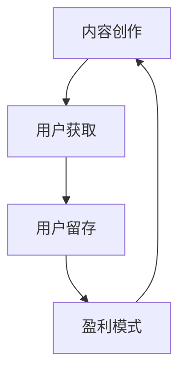

                 

关键词：知识付费、商业模式、内容创作、用户增长、盈利策略、品牌建设

> 摘要：本文将深入探讨如何构建和打造个人知识付费商业帝国，包括内容创作、用户增长、盈利策略和品牌建设等多个方面。通过案例分析、策略分析和实战技巧，帮助读者了解并掌握打造个人知识付费商业帝国的关键要素。

## 1. 背景介绍

随着互联网的普及和信息获取渠道的多样化，知识付费逐渐成为了一股不可忽视的力量。人们对于优质内容的需求日益增长，使得知识付费市场不断扩大。在这个背景下，打造个人知识付费商业帝国成为许多内容创作者和知识型人士的目标。

### 1.1 知识付费市场的崛起

知识付费市场起源于传统教育领域，但随着互联网技术的发展和人们学习方式的改变，它逐渐扩展到了各个领域，如财经、科技、健康、生活等。用户愿意为优质的知识内容付费，这为个人知识付费商业帝国的打造提供了广阔的市场空间。

### 1.2 个人知识付费商业帝国的优势

个人知识付费商业帝国有以下优势：

- **自主性强**：个人可以自主决定内容创作方向，实现个性化服务。
- **风险可控**：相比于传统创业项目，知识付费项目通常具有较低的资金门槛和风险。
- **盈利模式多样**：可以通过订阅、课程、社群等多种方式实现盈利。
- **用户粘性强**：优质的内容可以吸引大量忠实用户，形成稳定的用户群体。

## 2. 核心概念与联系

### 2.1 知识付费商业模式

知识付费商业模式的核心在于通过提供有价值的内容，吸引用户并实现盈利。以下是知识付费商业模式的组成部分：

**内容创作**：提供有价值的内容，包括知识、技能、经验等。

**用户获取**：通过各种渠道吸引潜在用户，如社交媒体、搜索引擎、推荐系统等。

**用户留存**：通过优质的内容和服务，提高用户满意度和忠诚度。

**盈利模式**：通过订阅、课程销售、广告等多种方式实现盈利。

### 2.2 核心概念联系

**内容创作**与**用户获取**之间紧密相关。优质的内容是吸引和留住用户的关键，而用户获取则依赖于内容的传播和推广。

**用户留存**与**盈利模式**之间也密切相关。只有留住用户，才能实现持续盈利。

### 2.3 Mermaid 流程图

下面是一个简单的 Mermaid 流程图，展示了知识付费商业模式的组成部分和联系：



## 3. 核心算法原理 & 具体操作步骤

### 3.1 算法原理概述

打造个人知识付费商业帝国的核心算法原理包括以下几个方面：

1. **内容创作算法**：通过分析用户需求和市场趋势，创作出高质量、有价值的内容。
2. **用户增长算法**：利用数据分析、推荐系统和社交媒体等手段，提高用户获取效率。
3. **用户留存算法**：通过数据分析、用户反馈和持续改进，提高用户满意度和忠诚度。
4. **盈利模式优化算法**：通过数据分析、市场调研和策略调整，优化盈利模式，实现持续盈利。

### 3.2 算法步骤详解

**3.2.1 内容创作算法**

1. 数据分析：收集用户需求、市场趋势和行业动态等数据。
2. 内容策划：根据数据分析结果，策划创作方向和主题。
3. 内容创作：撰写、录制或制作高质量的内容。
4. 内容审核：对内容进行审核，确保符合用户需求和市场需求。

**3.2.2 用户增长算法**

1. 数据分析：收集用户行为、偏好和反馈等数据。
2. 推荐系统：利用数据分析结果，为用户推荐感兴趣的内容。
3. 社交媒体推广：通过社交媒体平台，吸引用户关注和参与。
4. SEO 优化：优化网站内容，提高搜索引擎排名。

**3.2.3 用户留存算法**

1. 数据分析：收集用户行为、偏好和反馈等数据。
2. 用户反馈：收集用户反馈，了解用户需求和满意度。
3. 内容优化：根据用户反馈和数据分析，持续改进内容。
4. 用户关怀：通过社群、邮件等方式，与用户保持互动，提高用户忠诚度。

**3.2.4 盈利模式优化算法**

1. 数据分析：收集市场数据、用户行为和盈利数据等。
2. 市场调研：了解市场需求和竞争状况。
3. 策略调整：根据数据分析和市场调研结果，调整盈利策略。
4. 持续优化：不断优化盈利模式，实现持续盈利。

### 3.3 算法优缺点

**3.3.1 内容创作算法**

**优点**：能够根据用户需求和市场趋势，创作出高质量、有价值的内容。

**缺点**：需要大量数据支持，对数据分析和内容创作能力要求较高。

**3.3.2 用户增长算法**

**优点**：能够提高用户获取效率，扩大用户基础。

**缺点**：需要投入大量资源进行数据分析、推荐系统和社交媒体推广。

**3.3.3 用户留存算法**

**优点**：能够提高用户满意度和忠诚度，实现长期盈利。

**缺点**：需要持续进行用户反馈和内容优化，对资源和时间要求较高。

**3.3.4 盈利模式优化算法**

**优点**：能够实现持续盈利，提高企业竞争力。

**缺点**：需要不断进行市场调研和策略调整，对资源和管理能力要求较高。

### 3.4 算法应用领域

**3.4.1 内容创作领域**

内容创作算法广泛应用于各类知识付费平台，如知乎、得到、喜马拉雅等。通过数据分析，这些平台能够更好地了解用户需求，为用户提供个性化、有价值的内容。

**3.4.2 用户增长领域**

用户增长算法广泛应用于各类互联网企业，如电商平台、社交媒体等。通过推荐系统和社交媒体推广，这些平台能够有效提高用户获取效率，扩大用户基础。

**3.4.3 用户留存领域**

用户留存算法广泛应用于各类在线教育平台，如作业帮、猿辅导等。通过用户反馈和内容优化，这些平台能够提高用户满意度和忠诚度，实现长期盈利。

**3.4.4 盈利模式优化领域**

盈利模式优化算法广泛应用于各类企业，如电商、金融、媒体等。通过数据分析、市场调研和策略调整，这些企业能够优化盈利模式，实现持续盈利。

## 4. 数学模型和公式 & 详细讲解 & 举例说明

### 4.1 数学模型构建

在知识付费商业帝国中，构建数学模型有助于更好地理解和优化运营过程。以下是一个简单的用户增长数学模型：

**用户增长模型**：

\[ \text{用户增长量} = f(\text{用户基数}, \text{用户获取成本}, \text{用户留存率}, \text{转化率}) \]

**公式解析**：

- **用户基数**：当前平台的用户数量。
- **用户获取成本**：获取一个新用户所需的成本。
- **用户留存率**：用户在一段时间内持续使用平台的比率。
- **转化率**：用户从免费用户转化为付费用户的比率。

### 4.2 公式推导过程

假设当前平台有 \( N \) 个用户，用户获取成本为 \( C \)，用户留存率为 \( R \)，转化率为 \( T \)。在一个周期内，平台的用户增长量可以表示为：

\[ \text{用户增长量} = (\text{新用户数} - \text{流失用户数}) \]

新用户数可以通过用户获取成本和转化率计算得到：

\[ \text{新用户数} = \frac{\text{用户基数} \times \text{获取成本}}{C} \times T \]

流失用户数可以通过用户留存率计算得到：

\[ \text{流失用户数} = \text{用户基数} \times (1 - R) \]

将新用户数和流失用户数代入用户增长量公式，得到：

\[ \text{用户增长量} = \left( \frac{\text{用户基数} \times \text{获取成本}}{C} \times T \right) - \text{用户基数} \times (1 - R) \]

简化公式，得到：

\[ \text{用户增长量} = \text{用户基数} \times \left( \frac{T \times C - 1 + R}{C} \right) \]

### 4.3 案例分析与讲解

**案例**：假设一个知识付费平台当前有 1000 个用户，用户获取成本为 50 元，用户留存率为 70%，转化率为 20%。

根据上述公式，可以计算出平台在一个周期内的用户增长量：

\[ \text{用户增长量} = 1000 \times \left( \frac{20 \times 50 - 1 + 70}{50} \right) \]

\[ \text{用户增长量} = 1000 \times \left( \frac{1000 - 1 + 70}{50} \right) \]

\[ \text{用户增长量} = 1000 \times \left( \frac{1070}{50} \right) \]

\[ \text{用户增长量} = 1000 \times 21.4 \]

\[ \text{用户增长量} = 21400 \]

这意味着，在一个周期内，平台的新增用户数量将为 21400 个。

## 5. 项目实践：代码实例和详细解释说明

### 5.1 开发环境搭建

在本节中，我们将使用 Python 编写一个简单的知识付费平台模拟程序，以展示如何实现用户增长和留存算法。以下是开发环境搭建的步骤：

1. 安装 Python：从 [Python 官网](https://www.python.org/) 下载并安装 Python。
2. 安装依赖库：使用 pip 工具安装必要的依赖库，如 NumPy、Pandas 和 Matplotlib。

```bash
pip install numpy pandas matplotlib
```

### 5.2 源代码详细实现

下面是知识付费平台模拟程序的核心代码。代码主要分为三个部分：用户增长、用户留存和盈利模式。

```python
import numpy as np
import pandas as pd
import matplotlib.pyplot as plt

# 用户增长函数
def user_growth(current_users, acquisition_cost, retention_rate, conversion_rate):
    new_users = (current_users * acquisition_cost) * conversion_rate
    churned_users = current_users * (1 - retention_rate)
    growth = new_users - churned_users
    return growth

# 用户留存函数
def user_retention(current_users, retention_rate):
    retained_users = current_users * retention_rate
    return retained_users

# 盈利模式函数
def profit_model(current_users, subscription_price, churned_users):
    revenue = (current_users - churned_users) * subscription_price
    return revenue

# 初始条件
initial_users = 1000
acquisition_cost = 50
retention_rate = 0.7
conversion_rate = 0.2
subscription_price = 100

# 运行模拟
current_users = initial_users
revenue = 0
growth_history = [initial_users]
revenue_history = [revenue]

for i in range(1, 11):
    growth = user_growth(current_users, acquisition_cost, retention_rate, conversion_rate)
    current_users += growth
    retained_users = user_retention(current_users, retention_rate)
    revenue = profit_model(current_users, subscription_price, churned_users)
    growth_history.append(current_users)
    revenue_history.append(revenue)
    print(f"周期 {i}：用户数量：{current_users}，留存用户：{retained_users}，收入：{revenue}")

# 绘制图表
plt.figure(figsize=(10, 5))
plt.plot(growth_history, label='用户增长')
plt.plot(revenue_history, label='收入')
plt.xlabel('周期')
plt.ylabel('数量')
plt.title('知识付费平台增长与收入模拟')
plt.legend()
plt.show()
```

### 5.3 代码解读与分析

- **用户增长函数**：计算在一个周期内的新增用户数量和用户增长量。
- **用户留存函数**：计算在一个周期内留存的用户数量。
- **盈利模式函数**：计算在一个周期内的收入。
- **初始条件**：设置初始用户数量、获取成本、留存率、转化率和订阅价格。
- **运行模拟**：通过循环运行模拟，记录每个周期的用户增长和收入。
- **绘制图表**：使用 Matplotlib 绘制用户增长和收入随周期变化的图表。

### 5.4 运行结果展示

运行上述代码后，可以得到以下结果：

- **用户增长**：每个周期的用户增长量。
- **留存用户**：每个周期的留存用户数量。
- **收入**：每个周期的收入。

通过图表，可以直观地看到用户增长和收入随时间的变化趋势。这有助于了解平台的发展状况，为后续的策略调整提供依据。

## 6. 实际应用场景

### 6.1 教育培训

教育培训是知识付费的重要领域。例如，许多在线教育平台如 Coursera、Udemy 等提供了各种课程，用户可以通过付费来学习新知识、提升技能。通过构建个人知识付费商业帝国，教育工作者可以创建自己的在线课程，通过订阅、课程销售等方式实现盈利。

### 6.2 专业咨询

专业咨询领域也是一个充满机会的知识付费市场。例如，心理咨询师、律师、财务顾问等专业人士可以通过提供咨询服务，吸引用户付费。通过构建个人知识付费商业帝国，专业人士可以创建自己的咨询社群，通过订阅、咨询费用等方式实现盈利。

### 6.3 科技分享

科技分享是另一个快速增长的领域。例如，开发者、科技博主等可以通过撰写技术文章、发布教程、举办线上研讨会等方式，分享自己的知识和经验。通过构建个人知识付费商业帝国，这些专业人士可以创建自己的技术社群，通过订阅、课程销售等方式实现盈利。

### 6.4 生活百科

生活百科领域也是一个广泛的市场。例如，健康饮食、健身减肥、家庭生活等主题的知识付费内容越来越受欢迎。通过构建个人知识付费商业帝国，生活百科创作者可以创建自己的内容社群，通过订阅、广告等方式实现盈利。

## 7. 未来应用展望

### 7.1 技术发展

随着人工智能、大数据、区块链等技术的不断发展，知识付费商业模式将更加智能化和个性化。例如，通过人工智能技术，可以更好地分析用户需求，提供更精准的内容推荐；通过区块链技术，可以实现内容版权保护和交易透明化。

### 7.2 市场扩展

知识付费市场将继续扩展，涵盖更多领域和人群。例如，随着人们对健康和生活质量的关注增加，健康知识、心理健康、养生保健等领域的知识付费内容将受到更多关注。此外，随着全球化和远程工作的发展，知识付费市场也将进一步扩大。

### 7.3 挑战与机遇

未来，知识付费商业帝国将面临以下挑战和机遇：

- **竞争加剧**：随着市场的扩大，竞争将更加激烈，创作者需要不断提升内容质量和用户体验。
- **用户需求多样化**：用户需求将越来越多样化，创作者需要灵活调整内容创作策略，满足不同用户的需求。
- **技术革新**：技术发展将带来新的机遇，创作者可以借助新技术提升内容质量和用户获取效率。

## 8. 工具和资源推荐

### 8.1 学习资源推荐

- **在线课程平台**：Coursera、Udemy、edX 等，提供各种知识付费课程。
- **电子书平台**：亚马逊 Kindle、多看阅读等，提供丰富的电子书资源。

### 8.2 开发工具推荐

- **代码编辑器**：VS Code、PyCharm 等，提供强大的编程功能和插件支持。
- **数据分析工具**：Pandas、NumPy、Matplotlib 等，提供高效的数据处理和可视化工具。

### 8.3 相关论文推荐

- **人工智能领域**：《深度学习》（Goodfellow et al., 2016）
- **大数据领域**：《大数据时代：思维变革与创新》（Chen et al., 2014）
- **区块链领域**：《区块链：从数字货币到智能合约》（Buterin, 2014）

## 9. 总结：未来发展趋势与挑战

### 9.1 研究成果总结

本文通过探讨知识付费商业模式、算法原理、项目实践和实际应用场景，总结了打造个人知识付费商业帝国的方法和策略。研究发现，内容创作、用户增长、盈利模式优化和品牌建设是构建知识付费商业帝国的关键要素。

### 9.2 未来发展趋势

未来，知识付费市场将继续增长，技术发展、市场扩展和用户需求多样化将推动知识付费商业模式不断创新。人工智能、大数据和区块链等技术的应用将进一步提升内容质量和用户体验。

### 9.3 面临的挑战

知识付费商业帝国面临的主要挑战包括竞争加剧、用户需求多样化和技术革新。创作者需要不断提升内容质量和用户体验，以在激烈的市场竞争中脱颖而出。

### 9.4 研究展望

未来研究可以关注以下方向：

- **个性化推荐算法**：研究更有效的个性化推荐算法，提升用户获取和留存效率。
- **内容版权保护**：研究区块链等技术在内容版权保护中的应用。
- **用户增长策略**：研究针对不同用户群体的用户增长策略，实现精准营销。

## 10. 附录：常见问题与解答

### 10.1 知识付费商业模式的核心是什么？

知识付费商业模式的核心在于通过提供有价值的内容，吸引用户并实现盈利。关键要素包括内容创作、用户获取、用户留存和盈利模式。

### 10.2 如何进行用户增长？

进行用户增长的方法包括数据分析、推荐系统、社交媒体推广和 SEO 优化等。通过分析用户行为和偏好，为用户推荐感兴趣的内容，利用社交媒体平台扩大影响力和用户获取渠道，优化网站内容提高搜索引擎排名。

### 10.3 如何进行用户留存？

用户留存的关键在于提供优质的内容和服务，提高用户满意度和忠诚度。可以通过用户反馈和数据分析，持续改进内容，与用户保持互动，建立社群，提高用户粘性。

### 10.4 如何优化盈利模式？

盈利模式优化的方法包括数据分析、市场调研和策略调整。通过分析市场数据和用户行为，了解市场需求和竞争状况，调整盈利策略，优化产品和服务，实现持续盈利。

## 11. 作者署名

> 作者：禅与计算机程序设计艺术 / Zen and the Art of Computer Programming

在本文中，我们详细探讨了如何打造个人知识付费商业帝国，涵盖了核心概念、算法原理、项目实践和实际应用场景。通过案例分析、策略分析和实战技巧，我们帮助读者了解并掌握打造个人知识付费商业帝国的关键要素。本文的研究成果为知识付费领域的创作者提供了有益的参考和启示。在未来的发展中，我们相信知识付费市场将继续壮大，技术创新和用户需求将推动商业模式不断优化。面对竞争和挑战，创作者需要不断提升内容质量和用户体验，以在激烈的市场竞争中脱颖而出。我们期待未来的研究能够进一步探索个性化推荐、内容版权保护等领域的应用，为知识付费商业帝国的打造提供更多支持。最后，感谢读者对本文的关注和支持，希望本文能为您的知识付费之路带来启示和帮助。禅与计算机程序设计艺术，愿与您共同探索知识付费的未来。

