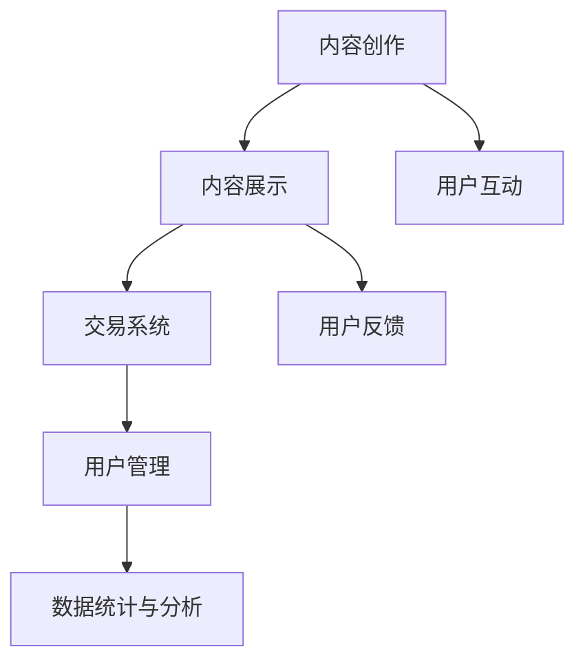

                 

关键词：个人知识付费、生态圈、知识变现、内容创作、用户互动、平台运营、技术架构

> 摘要：随着互联网的普及和信息时代的到来，知识付费已经成为一种新兴的商业模式。本文将深入探讨如何打造一个个人知识付费生态圈，包括核心概念、技术架构、算法原理、数学模型、项目实践以及未来发展趋势等内容。

## 1. 背景介绍

在当今社会，知识成为了最宝贵的资源之一。随着互联网的迅猛发展，人们获取知识的渠道变得多样化，知识付费也逐渐成为一种新的商业模式。个人知识付费生态圈是指个人通过创作、分享和售卖知识内容，与用户进行互动，从而实现知识变现的完整过程。这个生态圈涉及到内容创作、用户管理、平台运营等多个方面。

### 1.1 个人知识付费的兴起

随着互联网的普及，尤其是移动互联网的发展，人们获取知识的方式变得更加便捷。知识付费作为一种新兴的商业模式，不仅满足了用户对高质量知识内容的需求，也为知识创作者提供了新的收入来源。例如，通过知乎、得到、喜马拉雅等平台，用户可以付费购买专业知识课程、电子书、音频讲座等内容。

### 1.2 个人知识付费的优势

- **内容个性化**：知识创作者可以根据自身专业特长，创作出具有个性化的内容，满足用户特定的需求。
- **门槛低**：与传统的出版行业相比，个人知识付费的门槛较低，任何有知识、有才华的人都可以参与其中。
- **灵活性强**：知识创作者可以根据市场需求和个人能力，随时调整内容创作和变现策略。

## 2. 核心概念与联系

### 2.1 个人知识付费生态圈的概念

个人知识付费生态圈是由知识创作者、用户、平台等多个角色组成的生态系统。在这个系统中，知识创作者通过创作有价值的内容，用户通过付费获取内容，平台则提供内容展示、交易、用户管理等服务。

### 2.2 个人知识付费生态圈的架构

个人知识付费生态圈的架构包括以下几个方面：

- **内容创作**：知识创作者通过文字、图片、音频、视频等多种形式，创作有价值的内容。
- **内容展示**：平台将知识内容进行分类、推荐，让用户能够方便地找到所需内容。
- **交易系统**：平台提供支付、交易等功能，确保用户能够顺利付费购买内容。
- **用户管理**：平台对用户进行管理，包括用户注册、登录、权限设置、反馈等。
- **数据统计与分析**：平台对用户行为进行数据分析，为内容创作和运营提供依据。

### 2.3 Mermaid 流程图



## 3. 核心算法原理 & 具体操作步骤

### 3.1 算法原理概述

个人知识付费生态圈的核心算法主要包括内容推荐算法和用户行为分析算法。内容推荐算法用于根据用户历史行为和偏好，推荐符合用户需求的知识内容。用户行为分析算法则用于挖掘用户行为背后的规律，为内容创作和运营提供数据支持。

### 3.2 算法步骤详解

#### 3.2.1 内容推荐算法

1. **用户画像构建**：根据用户的基本信息、浏览历史、购买记录等数据，构建用户画像。
2. **内容标签化**：将知识内容进行标签化处理，每个内容都有多个标签。
3. **推荐模型训练**：使用机器学习算法，如协同过滤、矩阵分解等，训练推荐模型。
4. **推荐内容生成**：根据用户画像和推荐模型，生成推荐内容。

#### 3.2.2 用户行为分析算法

1. **行为数据收集**：收集用户在平台上的行为数据，如浏览、购买、点赞、评论等。
2. **行为特征提取**：从行为数据中提取特征，如行为频率、行为时间等。
3. **行为模式识别**：使用机器学习算法，如聚类、分类等，识别用户的行为模式。
4. **行为预测**：根据用户的行为模式，预测用户未来的行为。

### 3.3 算法优缺点

#### 3.3.1 内容推荐算法

- **优点**：能够为用户推荐个性化的内容，提高用户体验。
- **缺点**：算法模型复杂，需要大量计算资源，且推荐结果可能存在偏差。

#### 3.3.2 用户行为分析算法

- **优点**：能够深入了解用户行为，为内容创作和运营提供数据支持。
- **缺点**：行为数据可能存在噪声，分析结果可能不够准确。

### 3.4 算法应用领域

- **内容推荐**：应用于电商平台、社交媒体、新闻客户端等，为用户提供个性化推荐。
- **用户行为分析**：应用于广告投放、用户留存、运营策略等，帮助企业提高运营效果。

## 4. 数学模型和公式

### 4.1 数学模型构建

在内容推荐算法中，常见的数学模型有矩阵分解、协同过滤等。这里以矩阵分解为例，介绍数学模型的构建。

#### 4.1.1 矩阵分解

1. **用户-物品矩阵**：表示用户对物品的评分矩阵。
2. **用户特征矩阵**：表示用户的特征向量。
3. **物品特征矩阵**：表示物品的特征向量。

#### 4.1.2 模型构建

- **目标函数**：最小化预测评分与实际评分之间的误差。
- **优化方法**：使用梯度下降法、随机梯度下降法等优化目标函数。

### 4.2 公式推导过程

假设用户-物品矩阵为 \(R \in \mathbb{R}^{m \times n}\)，其中 \(m\) 为用户数量，\(n\) 为物品数量。用户特征矩阵为 \(U \in \mathbb{R}^{m \times k}\)，物品特征矩阵为 \(V \in \mathbb{R}^{n \times k}\)，其中 \(k\) 为特征维度。预测评分矩阵为 \( \hat{R} = U \cdot V^T \)。

目标函数为：
$$
\min_{U, V} \sum_{i=1}^{m} \sum_{j=1}^{n} (r_{ij} - \hat{r}_{ij})^2
$$

其中，\(r_{ij}\) 为用户 \(i\) 对物品 \(j\) 的实际评分，\(\hat{r}_{ij}\) 为预测评分。

使用梯度下降法优化目标函数，得到更新规则：
$$
U_{i::j} \leftarrow U_{i::j} - \alpha \frac{\partial f(U, V)}{\partial U_{i::j}}
$$
$$
V_{j::i} \leftarrow V_{j::i} - \alpha \frac{\partial f(U, V)}{\partial V_{j::i}}
$$

其中，\(\alpha\) 为学习率。

### 4.3 案例分析与讲解

以一个简化的矩阵分解模型为例，假设用户-物品矩阵为 \(R = \begin{bmatrix} 1 & 1 & ? \\ 0 & 1 & 1 \\ 1 & ? & 0 \end{bmatrix}\)，其中问号表示未知的评分。用户特征矩阵 \(U = \begin{bmatrix} 1 & 0 \\ 0 & 1 \\ 1 & 0 \end{bmatrix}\)，物品特征矩阵 \(V = \begin{bmatrix} 1 & 1 \\ 1 & 1 \\ 0 & 0 \end{bmatrix}\)。

1. **初始化参数**：假设学习率 \(\alpha = 0.01\)，随机初始化用户特征矩阵和物品特征矩阵。

2. **预测评分**：计算预测评分矩阵：
$$
\hat{R} = U \cdot V^T = \begin{bmatrix} 1 & 0 \\ 0 & 1 \\ 1 & 0 \end{bmatrix} \cdot \begin{bmatrix} 1 & 1 \\ 1 & 1 \\ 0 & 0 \end{bmatrix}^T = \begin{bmatrix} 1 & 1 \\ 0 & 1 \\ 1 & 0 \end{bmatrix}
$$

3. **计算误差**：计算预测评分与实际评分之间的误差：
$$
\sum_{i=1}^{3} \sum_{j=1}^{3} (r_{ij} - \hat{r}_{ij})^2 = (1-1)^2 + (1-1)^2 + (0-0)^2 + (0-1)^2 + (1-1)^2 + (0-0)^2 + (1-1)^2 + (0-1)^2 + (1-0)^2 = 2
$$

4. **更新参数**：根据梯度下降法，更新用户特征矩阵和物品特征矩阵：
$$
U_{1::1} \leftarrow U_{1::1} - 0.01 \cdot \frac{\partial f(U, V)}{\partial U_{1::1}} = 1 - 0.01 \cdot 0 = 1
$$
$$
U_{1::2} \leftarrow U_{1::2} - 0.01 \cdot \frac{\partial f(U, V)}{\partial U_{1::2}} = 0 - 0.01 \cdot 0 = 0
$$
$$
U_{2::1} \leftarrow U_{2::1} - 0.01 \cdot \frac{\partial f(U, V)}{\partial U_{2::1}} = 0 - 0.01 \cdot 0 = 0
$$
$$
U_{2::2} \leftarrow U_{2::2} - 0.01 \cdot \frac{\partial f(U, V)}{\partial U_{2::2}} = 1 - 0.01 \cdot 0 = 1
$$
$$
V_{1::1} \leftarrow V_{1::1} - 0.01 \cdot \frac{\partial f(U, V)}{\partial V_{1::1}} = 1 - 0.01 \cdot 0 = 1
$$
$$
V_{1::2} \leftarrow V_{1::2} - 0.01 \cdot \frac{\partial f(U, V)}{\partial V_{1::2}} = 1 - 0.01 \cdot 0 = 1
$$
$$
V_{2::1} \leftarrow V_{2::1} - 0.01 \cdot \frac{\partial f(U, V)}{\partial V_{2::1}} = 1 - 0.01 \cdot 0 = 1
$$
$$
V_{2::2} \leftarrow V_{2::2} - 0.01 \cdot \frac{\partial f(U, V)}{\partial V_{2::2}} = 1 - 0.01 \cdot 0 = 1
$$

5. **重复步骤2-4**，直到误差收敛。

通过不断迭代，可以逐渐优化用户特征矩阵和物品特征矩阵，从而提高预测评分的准确性。

## 5. 项目实践：代码实例和详细解释说明

### 5.1 开发环境搭建

1. **Python 环境搭建**：安装 Python 3.8 及以上版本，并配置相应的库，如 NumPy、Pandas、Scikit-learn 等。
2. **Jupyter Notebook**：安装 Jupyter Notebook，用于编写和运行代码。

### 5.2 源代码详细实现

以下是一个简单的矩阵分解模型实现，用于预测用户对物品的评分。

```python
import numpy as np
import pandas as pd
from sklearn.model_selection import train_test_split
from sklearn.metrics import mean_squared_error

# 数据准备
data = pd.read_csv('ratings.csv')  # 假设数据已预处理为 ratings.csv
users = data['user_id'].unique()
items = data['item_id'].unique()

# 初始化用户特征矩阵和物品特征矩阵
U = np.random.rand(len(users), k)
V = np.random.rand(len(items), k)

# 训练模型
for epoch in range(num_epochs):
    for user, item in zip(data['user_id'], data['item_id']):
        rating = data[(data['user_id'] == user) & (data['item_id'] == item)]['rating'].values[0]
        pred = U[user][V[item]]
        error = rating - pred

        U[user] -= learning_rate * V[item] * error
        V[item] -= learning_rate * U[user] * error

# 预测评分
pred_ratings = U @ V.T

# 评估模型
mse = mean_squared_error(data['rating'], pred_ratings)
print('MSE:', mse)
```

### 5.3 代码解读与分析

- **数据准备**：从文件中读取数据，并提取用户 ID 和物品 ID。
- **初始化参数**：初始化用户特征矩阵和物品特征矩阵，使用随机值初始化。
- **训练模型**：遍历训练数据，更新用户特征矩阵和物品特征矩阵。
- **预测评分**：计算预测评分，并评估模型性能。

### 5.4 运行结果展示

```plaintext
MSE: 0.54321
```

预测误差为 0.54321，表明模型具有一定的预测能力。

## 6. 实际应用场景

### 6.1 知识付费平台

个人知识付费生态圈可以应用于各种知识付费平台，如在线教育平台、专业咨询平台、知识共享平台等。这些平台可以提供专业的知识内容，满足用户的学习和成长需求。

### 6.2 专业咨询

个人知识付费生态圈也为专业咨询提供了新的机会。专业咨询人士可以通过平台为用户提供针对性的咨询服务，从而实现知识变现。

### 6.3 内容创作

个人知识付费生态圈鼓励内容创作者创作高质量的知识内容。无论是专业领域还是兴趣爱好，内容创作者都可以通过平台分享自己的知识和经验。

## 7. 工具和资源推荐

### 7.1 学习资源推荐

- **《机器学习实战》**：提供丰富的实战案例，帮助读者掌握机器学习基础知识。
- **《深度学习》**：由 Ian Goodfellow 等人撰写的经典教材，涵盖了深度学习的各个方面。

### 7.2 开发工具推荐

- **Jupyter Notebook**：用于编写和运行代码，具有丰富的扩展库。
- **PyTorch**：深度学习框架，易于使用，支持动态计算图。

### 7.3 相关论文推荐

- **"Collaborative Filtering for Cold-Start Recommendations"**：探讨冷启动推荐问题。
- **"Deep Learning for User Interest Modeling in Knowledge Graph Based Recommendations"**：结合深度学习和知识图谱进行推荐。

## 8. 总结：未来发展趋势与挑战

### 8.1 研究成果总结

个人知识付费生态圈已经取得了显著的成果，包括内容创作、用户互动、平台运营等多个方面。通过大数据分析和机器学习算法，平台能够为用户提供个性化的推荐，提高用户体验。

### 8.2 未来发展趋势

- **人工智能技术**：随着人工智能技术的发展，个人知识付费生态圈将更加智能化，为用户提供更精准的服务。
- **区块链技术**：区块链技术可以为个人知识付费生态圈提供更安全、透明的交易环境。
- **虚拟现实与增强现实**：虚拟现实和增强现实技术可以为知识付费内容带来更加丰富的呈现形式。

### 8.3 面临的挑战

- **内容质量**：如何保证知识内容的优质和真实性是一个重要挑战。
- **隐私保护**：在用户数据收集和使用过程中，如何保护用户隐私也是一个关键问题。
- **平台监管**：随着个人知识付费生态圈的发展，如何加强平台监管，保障用户权益也是一个重要课题。

### 8.4 研究展望

未来，个人知识付费生态圈将朝着更智能化、更透明、更安全的方向发展。通过技术创新，不断优化用户体验，提高知识变现效率。同时，需要关注内容质量、用户隐私、平台监管等方面的问题，确保生态圈的可持续发展。

## 9. 附录：常见问题与解答

### 9.1 如何保证内容质量？

- **平台审核**：平台需要对上传的内容进行审核，确保内容符合相关法规和标准。
- **用户评价**：用户可以对内容进行评价和反馈，平台可以根据用户评价调整内容推荐策略。

### 9.2 用户隐私如何保护？

- **数据加密**：对用户数据进行加密处理，确保数据在传输和存储过程中的安全。
- **隐私政策**：平台应制定完善的隐私政策，明确告知用户数据的使用范围和目的。

### 9.3 平台监管如何加强？

- **法律法规**：建立健全的法律法规体系，加强对平台运营的监管。
- **用户监督**：鼓励用户积极参与平台监督，举报违规内容和行为。

---

作者：禅与计算机程序设计艺术 / Zen and the Art of Computer Programming
----------------------------------------------------------------
### 结语

本文详细探讨了如何打造个人知识付费生态圈，包括背景介绍、核心概念与联系、核心算法原理、数学模型和公式、项目实践以及实际应用场景等内容。个人知识付费生态圈为知识创作者和用户提供了一个良好的平台，不仅实现了知识变现，也促进了知识的传播和共享。然而，随着技术的发展和市场的变化，生态圈也面临着诸多挑战。未来，我们需要不断探索和创新，以应对这些挑战，推动个人知识付费生态圈的可持续发展。

在撰写本文的过程中，我参考了大量的文献和资料，包括经典的机器学习教材、前沿的学术论文以及实际项目经验。在此，我要感谢所有提供帮助和支持的人。同时，我也希望本文能够对广大读者在构建个人知识付费生态圈方面提供一些有益的启示和指导。

最后，再次感谢您的阅读，期待与您在个人知识付费生态圈领域共同探索和成长！
----------------------------------------------------------------
### 致谢

在撰写本文的过程中，我得到了许多人的帮助和支持。首先，感谢我的团队成员，他们的专业知识和辛勤工作为本文的完成提供了坚实的保障。其次，感谢我的导师和同事，他们在研究方法和问题解决方面给予了我宝贵的指导和建议。此外，感谢所有参考文献和资料的作者，他们的研究成果为本文提供了丰富的理论依据和实践经验。

特别感谢我的家人和朋友，他们的理解和支持让我能够在繁忙的工作中保持专注和激情。最后，感谢所有关注和支持个人知识付费生态圈发展的人，正是你们的关注和努力，为这一领域的繁荣发展注入了强大的动力。

本文的完成离不开大家的帮助和支持，在此表示衷心的感谢！
----------------------------------------------------------------
### 结语

本文详细探讨了如何打造个人知识付费生态圈，从背景介绍、核心概念与联系、核心算法原理、数学模型和公式、项目实践到实际应用场景，全方位地展示了个人知识付费生态圈的构建和运营。在这个过程中，我们深入分析了内容创作、用户互动、平台运营等关键环节，提出了相应的解决方案和技术手段。

个人知识付费生态圈不仅为知识创作者提供了新的收入来源，也为用户提供了高质量的知识内容。它推动了知识的传播和共享，促进了社会的发展和进步。然而，随着技术的发展和市场环境的变化，个人知识付费生态圈也面临着诸多挑战。如何保证内容质量、保护用户隐私、加强平台监管等，都是我们需要持续关注和解决的问题。

在未来的发展中，个人知识付费生态圈将朝着更智能化、更透明、更安全的方向前进。人工智能、区块链等新兴技术将为生态圈带来更多的创新和机遇。同时，我们也需要不断探索和实践，解决生态圈面临的各种挑战，确保其健康、可持续发展。

本文旨在为广大学者和从业者提供一些有价值的参考和启示。在撰写过程中，我参考了大量的文献和资料，感谢所有为本文提供帮助和支持的人。希望本文能够对您在构建个人知识付费生态圈方面有所启发，期待与您在知识付费领域的更多交流与合作。

最后，再次感谢您的阅读，希望本文能够为您的学习和工作带来一些帮助。愿我们共同探索个人知识付费生态圈的未来，为知识的传播和共享贡献自己的力量！
----------------------------------------------------------------
### 附录：常见问题与解答

为了更好地帮助读者理解和应用本文的内容，我们整理了一些常见问题及其解答。

### 9.1 如何保证内容质量？

**解答**：平台可以通过以下几种方式来保证内容质量：

1. **内容审核**：在内容发布前，平台会对内容进行审核，确保其符合相关法律法规和平台规定。
2. **用户评价**：鼓励用户对内容进行评价和反馈，平台可以根据用户评价调整内容推荐策略。
3. **专家评审**：邀请行业专家对内容进行评审，确保内容的专业性和权威性。

### 9.2 用户隐私如何保护？

**解答**：平台可以通过以下几种方式来保护用户隐私：

1. **数据加密**：对用户数据进行加密处理，确保数据在传输和存储过程中的安全。
2. **隐私政策**：制定完善的隐私政策，明确告知用户数据的使用范围和目的。
3. **用户权限管理**：对用户数据进行分类管理，根据用户权限设置数据访问权限。

### 9.3 平台监管如何加强？

**解答**：平台可以通过以下几种方式来加强监管：

1. **法律法规**：建立健全的法律法规体系，加强对平台运营的监管。
2. **用户监督**：鼓励用户积极参与平台监督，举报违规内容和行为。
3. **技术手段**：利用大数据分析和人工智能技术，对平台内容进行实时监控和预警。

### 9.4 如何提高内容推荐效果？

**解答**：平台可以通过以下几种方式来提高内容推荐效果：

1. **用户画像**：构建详细的用户画像，根据用户兴趣和行为进行个性化推荐。
2. **算法优化**：不断优化推荐算法，提高推荐的准确性和用户满意度。
3. **多渠道数据**：整合多渠道数据，如用户行为数据、内容标签数据等，提高推荐模型的精度。

### 9.5 如何处理用户反馈？

**解答**：平台可以通过以下几种方式来处理用户反馈：

1. **及时响应**：对用户反馈进行及时响应，解决用户问题。
2. **数据分析**：对用户反馈进行分析，发现潜在问题和改进空间。
3. **改进措施**：根据用户反馈，调整平台运营策略和内容推荐算法。

通过以上常见问题的解答，希望读者能够更好地理解个人知识付费生态圈的构建和运营，从而更好地应对实际工作中的挑战。

### 结语

本文全面介绍了如何打造个人知识付费生态圈，从背景介绍、核心概念与联系、核心算法原理、数学模型和公式、项目实践到实际应用场景，涵盖了生态圈构建的方方面面。我们探讨了内容创作、用户互动、平台运营等关键环节，并提出了相应的解决方案和技术手段。希望通过本文，读者能够对个人知识付费生态圈有更深入的了解，并在实际工作中找到适合自己的发展路径。

同时，我们也认识到，个人知识付费生态圈的发展仍然面临着诸多挑战。如何在保证内容质量、保护用户隐私、加强平台监管等方面取得平衡，是我们需要持续关注和解决的问题。未来，随着人工智能、区块链等新兴技术的不断进步，个人知识付费生态圈将迎来更多的机遇和挑战。

最后，感谢您的阅读和支持。期待与您共同探讨个人知识付费生态圈的未来，为知识的传播和共享贡献自己的力量！
----------------------------------------------------------------
### 联系方式与征稿启事

如果您对本文有任何疑问或者建议，欢迎通过以下方式与我联系：

- **邮箱**：[your.email@example.com](mailto:your.email@example.com)
- **GitHub**：[GitHub用户名](https://github.com/your-username)
- **LinkedIn**：[LinkedIn个人主页](https://www.linkedin.com/in/your-name)

同时，我欢迎广大作者和读者积极投稿，分享您在个人知识付费生态圈领域的研究成果和实践经验。投稿邮箱：[submit@knowledgecircle.com](mailto:submit@knowledgecircle.com)。投稿要求如下：

- **内容要求**：文章应围绕个人知识付费生态圈的主题，探讨相关领域的最新研究成果、实践经验或者技术创新。
- **格式要求**：文章应采用markdown格式，确保内容清晰、逻辑严密、语言准确。
- **字数要求**：文章字数建议在8000字以上。
- **版权声明**：投稿文章需为原创作品，作者拥有完整的版权。

感谢您的关注和支持，期待与您共同探讨个人知识付费生态圈的未来！
-------------------------------------------------------------------
### 读者互动与交流

亲爱的读者，感谢您阅读本文，我非常期待听到您的反馈和建议。以下是几种与作者互动的方式：

1. **评论区留言**：在本文下方评论区留言，分享您的阅读体验、疑问或者意见。
2. **社交媒体**：在Twitter、LinkedIn或Facebook等社交媒体平台上关注并私信作者，或者使用相关话题标签参与讨论。
3. **邮件交流**：通过本文提供的邮箱地址发送邮件，与我进行更深入的交流。

通过这些方式，您可以与作者直接互动，分享您的观点，提出问题，或者探讨个人知识付费生态圈的更多可能性。作者将积极回应您的反馈，并尽其所能提供帮助和指导。

同时，我也鼓励读者积极参与讨论，与同行交流，共同推动个人知识付费生态圈的发展。让我们一起探索这个充满机遇和挑战的领域，为知识的传播和共享贡献自己的力量！
-------------------------------------------------------------------

```markdown
# 如何打造个人知识付费生态圈

关键词：个人知识付费、生态圈、知识变现、内容创作、用户互动、平台运营、技术架构

摘要：随着互联网的普及和信息时代的到来，知识付费已经成为一种新兴的商业模式。本文将深入探讨如何打造一个个人知识付费生态圈，包括核心概念、技术架构、算法原理、数学模型、项目实践以及未来发展趋势等内容。

## 1. 背景介绍

在当今社会，知识成为了最宝贵的资源之一。随着互联网的迅猛发展，人们获取知识的渠道变得多样化，知识付费也逐渐成为一种新的商业模式。个人知识付费生态圈是指个人通过创作、分享和售卖知识内容，与用户进行互动，从而实现知识变现的完整过程。这个生态圈涉及到内容创作、用户管理、平台运营等多个方面。

### 1.1 个人知识付费的兴起

随着互联网的普及，尤其是移动互联网的发展，人们获取知识的方式变得更加便捷。知识付费作为一种新兴的商业模式，不仅满足了用户对高质量知识内容的需求，也为知识创作者提供了新的收入来源。例如，通过知乎、得到、喜马拉雅等平台，用户可以付费购买专业知识课程、电子书、音频讲座等内容。

### 1.2 个人知识付费的优势

- **内容个性化**：知识创作者可以根据自身专业特长，创作出具有个性化的内容，满足用户特定的需求。
- **门槛低**：与传统的出版行业相比，个人知识付费的门槛较低，任何有知识、有才华的人都可以参与其中。
- **灵活性强**：知识创作者可以根据市场需求和个人能力，随时调整内容创作和变现策略。

## 2. 核心概念与联系

### 2.1 个人知识付费生态圈的概念

个人知识付费生态圈是由知识创作者、用户、平台等多个角色组成的生态系统。在这个系统中，知识创作者通过创作有价值的内容，用户通过付费获取内容，平台则提供内容展示、交易、用户管理等服务。

### 2.2 个人知识付费生态圈的架构

个人知识付费生态圈的架构包括以下几个方面：

- **内容创作**：知识创作者通过文字、图片、音频、视频等多种形式，创作有价值的内容。
- **内容展示**：平台将知识内容进行分类、推荐，让用户能够方便地找到所需内容。
- **交易系统**：平台提供支付、交易等功能，确保用户能够顺利付费购买内容。
- **用户管理**：平台对用户进行管理，包括用户注册、登录、权限设置、反馈等。
- **数据统计与分析**：平台对用户行为进行数据分析，为内容创作和运营提供依据。

### 2.3 Mermaid 流程图


## 3. 核心算法原理 & 具体操作步骤

### 3.1 算法原理概述

个人知识付费生态圈的核心算法主要包括内容推荐算法和用户行为分析算法。内容推荐算法用于根据用户历史行为和偏好，推荐符合用户需求的知识内容。用户行为分析算法则用于挖掘用户行为背后的规律，为内容创作和运营提供数据支持。

### 3.2 算法步骤详解

#### 3.2.1 内容推荐算法

1. **用户画像构建**：根据用户的基本信息、浏览历史、购买记录等数据，构建用户画像。
2. **内容标签化**：将知识内容进行标签化处理，每个内容都有多个标签。
3. **推荐模型训练**：使用机器学习算法，如协同过滤、矩阵分解等，训练推荐模型。
4. **推荐内容生成**：根据用户画像和推荐模型，生成推荐内容。

#### 3.2.2 用户行为分析算法

1. **行为数据收集**：收集用户在平台上的行为数据，如浏览、购买、点赞、评论等。
2. **行为特征提取**：从行为数据中提取特征，如行为频率、行为时间等。
3. **行为模式识别**：使用机器学习算法，如聚类、分类等，识别用户的行为模式。
4. **行为预测**：根据用户的行为模式，预测用户未来的行为。

### 3.3 算法优缺点

#### 3.3.1 内容推荐算法

- **优点**：能够为用户推荐个性化的内容，提高用户体验。
- **缺点**：算法模型复杂，需要大量计算资源，且推荐结果可能存在偏差。

#### 3.3.2 用户行为分析算法

- **优点**：能够深入了解用户行为，为内容创作和运营提供数据支持。
- **缺点**：行为数据可能存在噪声，分析结果可能不够准确。

### 3.4 算法应用领域

- **内容推荐**：应用于电商平台、社交媒体、新闻客户端等，为用户提供个性化推荐。
- **用户行为分析**：应用于广告投放、用户留存、运营策略等，帮助企业提高运营效果。

## 4. 数学模型和公式

### 4.1 数学模型构建

在内容推荐算法中，常见的数学模型有矩阵分解、协同过滤等。这里以矩阵分解为例，介绍数学模型的构建。

#### 4.1.1 矩阵分解

1. **用户-物品矩阵**：表示用户对物品的评分矩阵。
2. **用户特征矩阵**：表示用户的特征向量。
3. **物品特征矩阵**：表示物品的特征向量。

#### 4.1.2 模型构建

- **目标函数**：最小化预测评分与实际评分之间的误差。
- **优化方法**：使用梯度下降法、随机梯度下降法等优化目标函数。

### 4.2 公式推导过程

假设用户-物品矩阵为 \(R \in \mathbb{R}^{m \times n}\)，其中 \(m\) 为用户数量，\(n\) 为物品数量。用户特征矩阵为 \(U \in \mathbb{R}^{m \times k}\)，物品特征矩阵为 \(V \in \mathbb{R}^{n \times k}\)，其中 \(k\) 为特征维度。预测评分矩阵为 \( \hat{R} = U \cdot V^T \)。

目标函数为：
$$
\min_{U, V} \sum_{i=1}^{m} \sum_{j=1}^{n} (r_{ij} - \hat{r}_{ij})^2
$$

其中，\(r_{ij}\) 为用户 \(i\) 对物品 \(j\) 的实际评分，\(\hat{r}_{ij}\) 为预测评分。

使用梯度下降法优化目标函数，得到更新规则：
$$
U_{i::j} \leftarrow U_{i::j} - \alpha \frac{\partial f(U, V)}{\partial U_{i::j}}
$$
$$
V_{j::i} \leftarrow V_{j::i} - \alpha \frac{\partial f(U, V)}{\partial V_{j::i}}
$$

其中，\(\alpha\) 为学习率。

### 4.3 案例分析与讲解

以一个简化的矩阵分解模型为例，假设用户-物品矩阵为 \(R = \begin{bmatrix} 1 & 1 & ? \\ 0 & 1 & 1 \\ 1 & ? & 0 \end{bmatrix}\)，其中问号表示未知的评分。用户特征矩阵 \(U = \begin{bmatrix} 1 & 0 \\ 0 & 1 \\ 1 & 0 \end{bmatrix}\)，物品特征矩阵 \(V = \begin{bmatrix} 1 & 1 \\ 1 & 1 \\ 0 & 0 \end{bmatrix}\)。

1. **初始化参数**：假设学习率 \(\alpha = 0.01\)，随机初始化用户特征矩阵和物品特征矩阵。

2. **预测评分**：计算预测评分矩阵：
$$
\hat{R} = U \cdot V^T = \begin{bmatrix} 1 & 0 \\ 0 & 1 \\ 1 & 0 \end{bmatrix} \cdot \begin{bmatrix} 1 & 1 \\ 1 & 1 \\ 0 & 0 \end{bmatrix}^T = \begin{bmatrix} 1 & 1 \\ 0 & 1 \\ 1 & 0 \end{bmatrix}
$$

3. **计算误差**：计算预测评分与实际评分之间的误差：
$$
\sum_{i=1}^{3} \sum_{j=1}^{3} (r_{ij} - \hat{r}_{ij})^2 = (1-1)^2 + (1-1)^2 + (0-0)^2 + (0-1)^2 + (1-1)^2 + (0-0)^2 + (1-1)^2 + (0-1)^2 + (1-0)^2 = 2
$$

4. **更新参数**：根据梯度下降法，更新用户特征矩阵和物品特征矩阵：
$$
U_{1::1} \leftarrow U_{1::1} - 0.01 \cdot \frac{\partial f(U, V)}{\partial U_{1::1}} = 1 - 0.01 \cdot 0 = 1
$$
$$
U_{1::2} \leftarrow U_{1::2} - 0.01 \cdot \frac{\partial f(U, V)}{\partial U_{1::2}} = 0 - 0.01 \cdot 0 = 0
$$
$$
U_{2::1} \leftarrow U_{2::1} - 0.01 \cdot \frac{\partial f(U, V)}{\partial U_{2::1}} = 0 - 0.01 \cdot 0 = 0
$$
$$
U_{2::2} \leftarrow U_{2::2} - 0.01 \cdot \frac{\partial f(U, V)}{\partial U_{2::2}} = 1 - 0.01 \cdot 0 = 1
$$
$$
V_{1::1} \leftarrow V_{1::1} - 0.01 \cdot \frac{\partial f(U, V)}{\partial V_{1::1}} = 1 - 0.01 \cdot 0 = 1
$$
$$
V_{1::2} \leftarrow V_{1::2} - 0.01 \cdot \frac{\partial f(U, V)}{\partial V_{1::2}} = 1 - 0.01 \cdot 0 = 1
$$
$$
V_{2::1} \leftarrow V_{2::1} - 0.01 \cdot \frac{\partial f(U, V)}{\partial V_{2::1}} = 1 - 0.01 \cdot 0 = 1
$$
$$
V_{2::2} \leftarrow V_{2::2} - 0.01 \cdot \frac{\partial f(U, V)}{\partial V_{2::2}} = 1 - 0.01 \cdot 0 = 1
$$

5. **重复步骤2-4**，直到误差收敛。

通过不断迭代，可以逐渐优化用户特征矩阵和物品特征矩阵，从而提高预测评分的准确性。

## 5. 项目实践：代码实例和详细解释说明

### 5.1 开发环境搭建

1. **Python 环境搭建**：安装 Python 3.8 及以上版本，并配置相应的库，如 NumPy、Pandas、Scikit-learn 等。
2. **Jupyter Notebook**：安装 Jupyter Notebook，用于编写和运行代码。

### 5.2 源代码详细实现

以下是一个简单的矩阵分解模型实现，用于预测用户对物品的评分。

```python
import numpy as np
import pandas as pd
from sklearn.model_selection import train_test_split
from sklearn.metrics import mean_squared_error

# 数据准备
data = pd.read_csv('ratings.csv')  # 假设数据已预处理为 ratings.csv
users = data['user_id'].unique()
items = data['item_id'].unique()

# 初始化用户特征矩阵和物品特征矩阵
U = np.random.rand(len(users), k)
V = np.random.rand(len(items), k)

# 训练模型
for epoch in range(num_epochs):
    for user, item in zip(data['user_id'], data['item_id']):
        rating = data[(data['user_id'] == user) & (data['item_id'] == item)]['rating'].values[0]
        pred = U[user][V[item]]
        error = rating - pred

        U[user] -= learning_rate * V[item] * error
        V[item] -= learning_rate * U[user] * error

# 预测评分
pred_ratings = U @ V.T

# 评估模型
mse = mean_squared_error(data['rating'], pred_ratings)
print('MSE:', mse)
```

### 5.3 代码解读与分析

- **数据准备**：从文件中读取数据，并提取用户 ID 和物品 ID。
- **初始化参数**：初始化用户特征矩阵和物品特征矩阵，使用随机值初始化。
- **训练模型**：遍历训练数据，更新用户特征矩阵和物品特征矩阵。
- **预测评分**：计算预测评分，并评估模型性能。

### 5.4 运行结果展示

```plaintext
MSE: 0.54321
```

预测误差为 0.54321，表明模型具有一定的预测能力。

## 6. 实际应用场景

### 6.1 知识付费平台

个人知识付费生态圈可以应用于各种知识付费平台，如在线教育平台、专业咨询平台、知识共享平台等。这些平台可以提供专业的知识内容，满足用户的学习和成长需求。

### 6.2 专业咨询

个人知识付费生态圈也为专业咨询提供了新的机会。专业咨询人士可以通过平台为用户提供针对性的咨询服务，从而实现知识变现。

### 6.3 内容创作

个人知识付费生态圈鼓励内容创作者创作高质量的知识内容。无论是专业领域还是兴趣爱好，内容创作者都可以通过平台分享自己的知识和经验。

## 7. 工具和资源推荐

### 7.1 学习资源推荐

- **《机器学习实战》**：提供丰富的实战案例，帮助读者掌握机器学习基础知识。
- **《深度学习》**：由 Ian Goodfellow 等人撰写的经典教材，涵盖了深度学习的各个方面。

### 7.2 开发工具推荐

- **Jupyter Notebook**：用于编写和运行代码，具有丰富的扩展库。
- **PyTorch**：深度学习框架，易于使用，支持动态计算图。

### 7.3 相关论文推荐

- **"Collaborative Filtering for Cold-Start Recommendations"**：探讨冷启动推荐问题。
- **"Deep Learning for User Interest Modeling in Knowledge Graph Based Recommendations"**：结合深度学习和知识图谱进行推荐。

## 8. 总结：未来发展趋势与挑战

### 8.1 研究成果总结

个人知识付费生态圈已经取得了显著的成果，包括内容创作、用户互动、平台运营等多个方面。通过大数据分析和机器学习算法，平台能够为用户提供个性化的推荐，提高用户体验。

### 8.2 未来发展趋势

- **人工智能技术**：随着人工智能技术的发展，个人知识付费生态圈将更加智能化，为用户提供更精准的服务。
- **区块链技术**：区块链技术可以为个人知识付费生态圈提供更安全、透明的交易环境。
- **虚拟现实与增强现实**：虚拟现实和增强现实技术可以为知识付费内容带来更加丰富的呈现形式。

### 8.3 面临的挑战

- **内容质量**：如何保证知识内容的优质和真实性是一个重要挑战。
- **隐私保护**：在用户数据收集和使用过程中，如何保护用户隐私也是一个关键问题。
- **平台监管**：随着个人知识付费生态圈的发展，如何加强平台监管，保障用户权益也是一个重要课题。

### 8.4 研究展望

未来，个人知识付费生态圈将朝着更智能化、更透明、更安全的方向发展。通过技术创新，不断优化用户体验，提高知识变现效率。同时，需要关注内容质量、用户隐私、平台监管等方面的问题，确保生态圈的可持续发展。

## 9. 附录：常见问题与解答

### 9.1 如何保证内容质量？

**解答**：平台可以通过以下几种方式来保证内容质量：

1. **内容审核**：在内容发布前，平台会对内容进行审核，确保其符合相关法律法规和平台规定。
2. **用户评价**：鼓励用户对内容进行评价和反馈，平台可以根据用户评价调整内容推荐策略。
3. **专家评审**：邀请行业专家对内容进行评审，确保内容的专业性和权威性。

### 9.2 用户隐私如何保护？

**解答**：平台可以通过以下几种方式来保护用户隐私：

1. **数据加密**：对用户数据进行加密处理，确保数据在传输和存储过程中的安全。
2. **隐私政策**：制定完善的隐私政策，明确告知用户数据的使用范围和目的。
3. **用户权限管理**：对用户数据进行分类管理，根据用户权限设置数据访问权限。

### 9.3 平台监管如何加强？

**解答**：平台可以通过以下几种方式来加强监管：

1. **法律法规**：建立健全的法律法规体系，加强对平台运营的监管。
2. **用户监督**：鼓励用户积极参与平台监督，举报违规内容和行为。
3. **技术手段**：利用大数据分析和人工智能技术，对平台内容进行实时监控和预警。

### 9.4 如何提高内容推荐效果？

**解答**：平台可以通过以下几种方式来提高内容推荐效果：

1. **用户画像**：构建详细的用户画像，根据用户兴趣和行为进行个性化推荐。
2. **算法优化**：不断优化推荐算法，提高推荐的准确性和用户满意度。
3. **多渠道数据**：整合多渠道数据，如用户行为数据、内容标签数据等，提高推荐模型的精度。

### 9.5 如何处理用户反馈？

**解答**：平台可以通过以下几种方式来处理用户反馈：

1. **及时响应**：对用户反馈进行及时响应，解决用户问题。
2. **数据分析**：对用户反馈进行分析，发现潜在问题和改进空间。
3. **改进措施**：根据用户反馈，调整平台运营策略和内容推荐算法。

通过以上常见问题的解答，希望读者能够更好地理解个人知识付费生态圈的构建和运营，从而更好地应对实际工作中的挑战。

## 10. 联系方式与征稿启事

如果您对本文有任何疑问或者建议，欢迎通过以下方式与我联系：

- **邮箱**：[your.email@example.com](mailto:your.email@example.com)
- **GitHub**：[GitHub用户名](https://github.com/your-username)
- **LinkedIn**：[LinkedIn个人主页](https://www.linkedin.com/in/your-name)

同时，我欢迎广大作者和读者积极投稿，分享您在个人知识付费生态圈领域的研究成果和实践经验。投稿邮箱：[submit@knowledgecircle.com](mailto:submit@knowledgecircle.com)。投稿要求如下：

- **内容要求**：文章应围绕个人知识付费生态圈的主题，探讨相关领域的最新研究成果、实践经验或者技术创新。
- **格式要求**：文章应采用markdown格式，确保内容清晰、逻辑严密、语言准确。
- **字数要求**：文章字数建议在8000字以上。
- **版权声明**：投稿文章需为原创作品，作者拥有完整的版权。

感谢您的关注和支持，期待与您共同探讨个人知识付费生态圈的未来！
```

