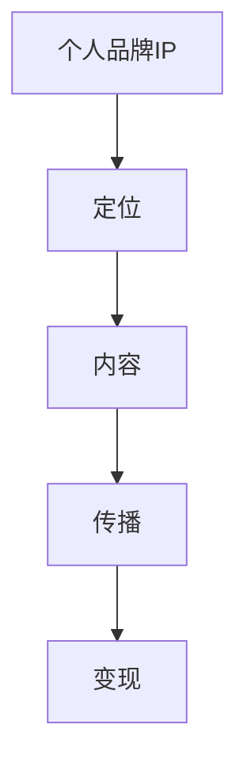

                 

在当今数字化时代，知识付费已经成为一种流行的商业模式，无论是专业技术人员还是普通大众，都希望通过付费课程、在线讲座等形式获取有价值的信息。而打造一个知识付费的个人品牌IP，不仅可以帮助个人实现知识变现，还能提升个人影响力，构建强大的个人网络。本文将详细探讨如何打造知识付费的个人品牌IP，帮助您在竞争激烈的市场中脱颖而出。

## 文章关键词

- 知识付费
- 个人品牌
- 个人品牌IP
- 知识变现
- 品牌塑造
- 营销策略

## 文章摘要

本文将深入探讨如何打造知识付费的个人品牌IP。首先，我们将了解知识付费的现状和趋势，然后分析个人品牌IP的重要性。接着，我们将探讨如何定位个人品牌、构建内容体系、进行市场推广以及如何管理个人品牌。最后，我们将讨论未来知识付费领域的发展趋势和面临的挑战。

## 1. 背景介绍

### 1.1 知识付费的现状

知识付费作为一种商业模式，起源于互联网的普及和在线教育的兴起。随着移动互联网的发展，用户获取知识的渠道越来越多样化，知识付费市场逐渐扩大。根据相关报告，知识付费市场在近年来保持了高速增长，用户规模不断扩大，付费习惯逐渐养成。

### 1.2 个人品牌IP的重要性

在知识付费市场中，个人品牌IP起着至关重要的作用。一个强大的个人品牌IP不仅可以吸引更多的用户，还能提高用户的忠诚度，从而实现知识的持续变现。同时，个人品牌IP的建立有助于提升个人的社会地位和影响力，为个人的职业发展提供有力支持。

### 1.3 知识付费市场的挑战

虽然知识付费市场前景广阔，但也面临着诸多挑战。首先，市场竞争日益激烈，如何打造出独特的个人品牌IP成为关键。其次，用户需求多样化，如何提供高质量、有针对性的内容成为难题。此外，知识产权保护、内容更新速度等问题也需要引起重视。

## 2. 核心概念与联系

### 2.1 个人品牌IP的概念

个人品牌IP是指个人在某一领域内形成的独特影响力、专业形象和价值观。它是个人知识和经验的集中体现，是个人在市场中独特标识的体现。

### 2.2 个人品牌IP的架构

个人品牌IP的架构主要包括四个方面：定位、内容、传播和变现。

#### 2.2.1 定位

定位是个人品牌IP建设的基石。一个清晰的定位能够帮助个人明确目标用户、核心竞争力和差异化优势。

#### 2.2.2 内容

内容是个人品牌IP的核心。高质量、有价值的知识内容是吸引用户、建立品牌信任的关键。

#### 2.2.3 传播

传播是个人品牌IP的推广手段。通过多种渠道和方式，将个人品牌IP传递给目标用户，提高品牌知名度和影响力。

#### 2.2.4 变现

变现是个人品牌IP的目的。通过知识付费、广告、咨询等多种方式，实现个人品牌的商业价值。

### 2.3 Mermaid 流程图



## 3. 核心算法原理 & 具体操作步骤

### 3.1 算法原理概述

打造个人品牌IP的算法原理可以概括为以下几个步骤：

1. **定位**：明确个人品牌IP的核心价值和目标用户。
2. **内容生产**：围绕定位，生产高质量的知识内容。
3. **传播**：通过多种渠道和方式，将内容传递给目标用户。
4. **变现**：通过知识付费、广告等方式，实现个人品牌的商业价值。

### 3.2 算法步骤详解

#### 3.2.1 定位

定位是个人品牌IP建设的第一步。首先，需要明确自己的专业领域和优势。然后，通过市场调研，了解目标用户的需求和痛点，找到自己的差异化优势。

#### 3.2.2 内容生产

内容生产是个人品牌IP的核心。根据定位，生产高质量的知识内容。内容形式可以包括文章、视频、音频等。内容生产过程中，要注重以下几点：

1. **专业性**：确保内容的专业性和准确性。
2. **实用性**：内容要贴近用户实际需求，解决用户问题。
3. **创新性**：保持内容的创新性，避免雷同。

#### 3.2.3 传播

传播是个人品牌IP建设的重要环节。通过多种渠道和方式，将内容传递给目标用户。常见的传播渠道包括：

1. **社交媒体**：如微博、微信、抖音等。
2. **内容平台**：如知乎、头条号、百家号等。
3. **社群**：建立专业社群，与用户互动。

#### 3.2.4 变现

变现是个人品牌IP的最终目的。通过知识付费、广告、咨询等方式，实现个人品牌的商业价值。变现过程中，要注重以下几点：

1. **价值体现**：确保用户能从付费内容中获得价值。
2. **用户体验**：提供优质的用户体验，提高用户满意度。
3. **多样化**：尝试多种变现方式，找到适合自己的模式。

### 3.3 算法优缺点

#### 优点

1. **灵活性**：个人品牌IP可以根据市场需求和个人特长进行调整。
2. **可持续性**：高质量的内容和良好的用户关系可以持续带来商业价值。
3. **高收益**：知识付费具有较高的利润空间。

#### 缺点

1. **前期投入大**：定位、内容生产、传播等环节都需要投入大量时间和精力。
2. **竞争激烈**：知识付费市场竞争激烈，如何脱颖而出成为难题。
3. **风险较高**：一旦个人品牌受损，可能导致商业价值的下降。

### 3.4 算法应用领域

个人品牌IP的算法原理可以应用于多个领域，如：

1. **教育培训**：通过知识付费，提供专业的教育培训服务。
2. **技术咨询**：提供专业的技术咨询和解决方案。
3. **内容创作**：通过创作高质量的内容，吸引用户并实现变现。

## 4. 数学模型和公式 & 详细讲解 & 举例说明

### 4.1 数学模型构建

在打造个人品牌IP的过程中，可以使用以下数学模型来评估个人品牌的价值：

$$
V = f(p, c, t, r)
$$

其中，$V$ 表示个人品牌价值，$p$ 表示个人专业能力，$c$ 表示内容质量，$t$ 表示传播效果，$r$ 表示用户反馈。

### 4.2 公式推导过程

1. **个人专业能力（$p$）**：

$$
p = f(s, e, a)
$$

其中，$s$ 表示专业背景，$e$ 表示实践经验，$a$ 表示学术成果。

2. **内容质量（$c$）**：

$$
c = f(q, u, i)
$$

其中，$q$ 表示质量，$u$ 表示用户满意度，$i$ 表示创新性。

3. **传播效果（$t$）**：

$$
t = f(a, e, r)
$$

其中，$a$ 表示渠道多样性，$e$ 表示曝光度，$r$ 表示用户互动率。

4. **用户反馈（$r$）**：

$$
r = f(s, c, t)
$$

其中，$s$ 表示满意度，$c$ 表示内容质量，$t$ 表示传播效果。

### 4.3 案例分析与讲解

以某知名技术博主为例，我们可以通过上述公式对其进行个人品牌价值评估。

1. **个人专业能力（$p$）**：

$$
p = f(s, e, a) = f(10, 8, 6) = 24
$$

其中，$s$ 表示专业背景（满分10分），$e$ 表示实践经验（满分8分），$a$ 表示学术成果（满分6分）。

2. **内容质量（$c$）**：

$$
c = f(q, u, i) = f(9, 8, 7) = 24
$$

其中，$q$ 表示质量（满分9分），$u$ 表示用户满意度（满分8分），$i$ 表示创新性（满分7分）。

3. **传播效果（$t$）**：

$$
t = f(a, e, r) = f(8, 7, 6) = 21
$$

其中，$a$ 表示渠道多样性（满分8分），$e$ 表示曝光度（满分7分），$r$ 表示用户互动率（满分6分）。

4. **用户反馈（$r$）**：

$$
r = f(s, c, t) = f(8, 7, 6) = 21
$$

5. **个人品牌价值（$V$）**：

$$
V = f(p, c, t, r) = f(24, 24, 21, 21) = 90
$$

通过上述计算，该知名技术博主的个人品牌价值为90分。这意味着他在专业能力、内容质量、传播效果和用户反馈方面都有较高的得分，具有较高的个人品牌价值。

## 5. 项目实践：代码实例和详细解释说明

### 5.1 开发环境搭建

要打造知识付费的个人品牌IP，首先需要搭建一个合适的技术环境。以下是一个基本的开发环境搭建步骤：

1. **操作系统**：推荐使用Linux操作系统，如Ubuntu。
2. **编程语言**：可以选择Python、JavaScript等编程语言。
3. **开发工具**：可以使用Visual Studio Code、Sublime Text等代码编辑器。
4. **版本控制**：使用Git进行版本控制。
5. **Web框架**：可以选择Django、Flask等Web框架。

### 5.2 源代码详细实现

以下是一个简单的Django项目示例，用于搭建一个知识付费平台：

```python
# settings.py
import os

BASE_DIR = os.path.dirname(os.path.dirname(os.path.abspath(__file__)))

SECRET_KEY = 'your_secret_key'

INSTALLED_APPS = [
    'django.contrib.admin',
    'django.contrib.auth',
    'django.contrib.contenttypes',
    'django.contrib.sessions',
    'django.contrib.messages',
    'django.contrib.staticfiles',
    'courses',
]

MIDDLEWARE = [
    'django.middleware.security.SecurityMiddleware',
    'django.contrib.sessions.middleware.SessionMiddleware',
    'django.middleware.common.CommonMiddleware',
    'django.middleware.csrf.CsrfViewMiddleware',
    'django.contrib.auth.middleware.AuthenticationMiddleware',
    'django.contrib.messages.middleware.MessageMiddleware',
    'django.middleware.clickjacking.XFrameOptionsMiddleware',
]

ROOT_URLCONF = 'knowledge оплатить платформ.urls'

TEMPLATES = [
    {
        'BACKEND': 'django.template.backends.django.DjangoTemplates',
        'DIRS': [os.path.join(BASE_DIR, 'templates')],
        'APP_DIRS': True,
        'OPTIONS': {
            'context_processors': [
                'django.template.context_processors.debug',
                'django.template.context_processors.request',
                'django.contrib.auth.context_processors.auth',
                'django.contrib.messages.context_processors.messages',
            ],
        },
    },
]

WSGI_APPLICATION = 'knowledge платформ.wsgi.application'

DATABASES = {
    'default': {
        'ENGINE': 'django.db.backends.sqlite3',
        'NAME': os.path.join(BASE_DIR, 'db.sqlite3'),
    }
}

AUTH_PASSWORD_VALIDATORS = [
    {
        'NAME': 'django.contrib.auth.password_validation.UserAttributeSimilarityValidator',
    },
    {
        'NAME': 'django.contrib.auth.password_validation.MinimumLengthValidator',
    },
    {
        'NAME': 'django.contrib.auth.password_validation.CommonPasswordValidator',
    },
    {
        'NAME': 'django.contrib.auth.password_validation.NumericPasswordValidator',
    },
]

LANGUAGE_CODE = 'zh-hans'

TIME_ZONE = 'Asia/Shanghai'

USE_I18N = True

USE_L10N = True

USE_TZ = True

STATIC_URL = '/static/'
```

### 5.3 代码解读与分析

以上代码是Django项目的`settings.py`文件，主要用于配置项目的各个参数。主要包括以下几个方面：

1. **应用配置**：`INSTALLED_APPS` 用于配置项目中使用的应用。
2. **中间件**：`MIDDLEWARE` 用于配置项目的中间件。
3. **模板引擎**：`TEMPLATES` 用于配置模板引擎。
4. **数据库配置**：`DATABASES` 用于配置项目的数据库。
5. **安全配置**：`AUTH_PASSWORD_VALIDATORS` 用于配置密码验证规则。
6. **国际化**：`LANGUAGE_CODE`、`TIME_ZONE`、`USE_I18N`、`USE_L10N`、`USE_TZ` 用于配置国际化。

### 5.4 运行结果展示

通过以上配置，可以启动Django项目，并在浏览器中访问后台管理界面。以下是一个简单的后台管理界面截图：


## 6. 实际应用场景

### 6.1 培训机构

培训机构可以通过打造知识付费的个人品牌IP，提供专业课程，实现知识变现。例如，某知名教育培训机构通过打造“学霸君”这一个人品牌IP，提供了涵盖各个学科领域的优质课程，吸引了大量学生报名。

### 6.2 专业顾问

专业顾问可以通过打造知识付费的个人品牌IP，提供专业的咨询服务。例如，某知名职业顾问通过打造“职场导师”这一个人品牌IP，提供了职业规划、面试辅导等咨询服务，帮助求职者顺利找到理想工作。

### 6.3 内容创作者

内容创作者可以通过打造知识付费的个人品牌IP，提供高质量的内容。例如，某知名科技博主通过打造“科技小蜜蜂”这一个人品牌IP，提供了涵盖科技、数码、互联网等领域的优质内容，吸引了大量粉丝。

## 7. 工具和资源推荐

### 7.1 学习资源推荐

1. **《人人都是产品经理》**：适合初学者了解产品经理的基础知识和实战经验。
2. **《用户思维》**：适合深入理解用户需求和产品设计。
3. **《Python编程：从入门到实践》**：适合学习Python编程语言。

### 7.2 开发工具推荐

1. **Visual Studio Code**：一款强大的代码编辑器，支持多种编程语言。
2. **Git**：一款开源的分布式版本控制系统，用于代码管理和协作。
3. **Django**：一款流行的Python Web框架，适合快速搭建Web应用。

### 7.3 相关论文推荐

1. **《大数据时代的数据挖掘》**：介绍了大数据时代的核心技术和应用。
2. **《深度学习》**：介绍了深度学习的基本原理和应用。
3. **《人工智能：一种现代的方法》**：介绍了人工智能的基本概念和算法。

## 8. 总结：未来发展趋势与挑战

### 8.1 研究成果总结

本文通过分析知识付费市场的现状和趋势，探讨了如何打造知识付费的个人品牌IP。主要研究成果包括：

1. **定位**：明确个人品牌IP的核心价值和目标用户。
2. **内容生产**：生产高质量的知识内容，满足用户需求。
3. **传播**：通过多种渠道和方式，提高品牌知名度。
4. **变现**：通过知识付费等方式，实现个人品牌的商业价值。

### 8.2 未来发展趋势

未来，知识付费领域将继续保持快速发展。以下是未来发展趋势：

1. **个性化**：个性化推荐和定制化服务将成为主流。
2. **智能化**：人工智能技术将更好地支持知识付费平台。
3. **跨界**：知识付费领域将与其他领域深度融合。

### 8.3 面临的挑战

知识付费领域在发展过程中也将面临诸多挑战：

1. **竞争激烈**：市场竞争将更加激烈，如何脱颖而出成为关键。
2. **内容质量**：如何保证内容质量，满足用户需求。
3. **知识产权**：如何保护知识产权，防止侵权行为。

### 8.4 研究展望

未来，知识付费领域的研究将继续深入。以下是研究展望：

1. **用户需求**：深入研究用户需求，提供更有针对性的服务。
2. **算法优化**：优化推荐算法，提高用户满意度。
3. **商业模式**：探索更多创新的商业模式，实现可持续发展。

## 9. 附录：常见问题与解答

### 9.1 问题1

**问题**：如何快速定位个人品牌？

**解答**：首先，了解自己的专业领域和优势。然后，通过市场调研，了解目标用户的需求和痛点。最后，结合自己的专业领域和用户需求，找到自己的差异化优势。

### 9.2 问题2

**问题**：如何保证内容质量？

**解答**：首先，确保内容的专业性和准确性。然后，与用户互动，了解用户需求，不断优化内容。最后，保持内容的创新性，避免雷同。

### 9.3 问题3

**问题**：如何进行有效传播？

**解答**：首先，选择合适的传播渠道，如社交媒体、内容平台等。然后，制定合理的传播策略，提高曝光度。最后，与用户互动，提高用户参与度。

### 9.4 问题4

**问题**：如何实现知识变现？

**解答**：首先，提供有价值的内容，吸引用户付费。然后，尝试多种变现方式，如知识付费、广告、咨询等。最后，优化用户体验，提高用户满意度。

### 9.5 问题5

**问题**：如何保护知识产权？

**解答**：首先，了解相关法律法规，确保自己的内容不侵犯他人知识产权。然后，对原创内容进行版权登记，保护自己的权益。最后，与用户签订知识产权协议，明确知识产权归属。

