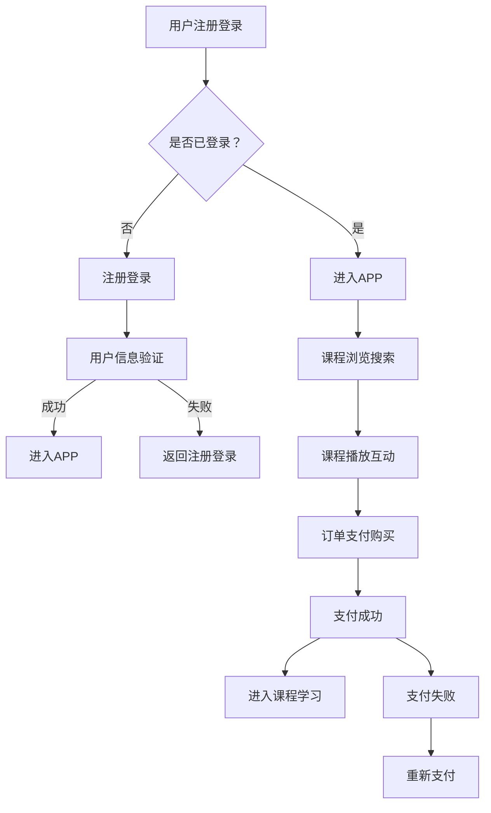

                 

关键词：知识付费、移动端APP、用户体验、开发流程、技术架构

> 摘要：本文将深入探讨如何打造一款成功的知识付费移动端APP，从市场分析、功能设计、技术架构、用户体验到开发流程等各个方面进行全面剖析，旨在为开发者提供一套实用的参考指南。

## 1. 背景介绍

随着移动互联网的迅速普及，知识付费已经成为一个新兴且潜力巨大的市场。用户对于知识的渴求和在线教育的普及使得知识付费APP成为众多创业者和企业竞相布局的领域。然而，如何在激烈的市场竞争中脱颖而出，打造一款具有核心竞争力、用户粘性高的知识付费移动端APP，成为了开发者们亟待解决的重要问题。

本文将结合市场现状、用户需求和技术趋势，从以下几个方面详细探讨如何打造知识付费的移动端APP：

1. **市场分析**：分析知识付费市场的现状和趋势，明确目标用户群体和竞争环境。
2. **功能设计**：设计APP的核心功能和附加功能，确保满足用户需求和提升用户体验。
3. **技术架构**：选择合适的技术框架和工具，构建稳定、高效、可扩展的技术架构。
4. **用户体验**：优化用户界面和交互设计，提升APP的用户体验和用户粘性。
5. **开发流程**：介绍APP开发的全流程，从需求分析、设计、开发到测试和维护。

## 2. 核心概念与联系

### 2.1 知识付费APP的基本概念

知识付费APP是一种在线教育平台，用户通过购买课程或内容来获取知识和技能。这类APP的核心价值在于为用户提供高质量、权威性强的内容，并通过良好的用户体验和运营策略吸引用户留存和推荐。

### 2.2 知识付费APP的架构

知识付费APP的架构可以分为前端、后端和数据库三大部分：

- **前端**：负责展示课程内容和用户界面，实现与用户的交互。前端通常采用HTML、CSS和JavaScript等技术。
- **后端**：负责处理业务逻辑和数据存储，通常采用服务器端编程语言如Python、Java、Node.js等。
- **数据库**：存储用户数据、课程内容和其他相关数据，通常采用关系型数据库如MySQL或非关系型数据库如MongoDB。

### 2.3 知识付费APP的功能模块

知识付费APP的主要功能模块包括：

- **用户注册与登录**：用户可以通过注册账号或使用第三方账号登录APP。
- **课程浏览与搜索**：用户可以浏览和搜索感兴趣的课程。
- **课程播放与互动**：用户可以在线观看课程视频，并进行问答、讨论等互动。
- **订单支付与购买**：用户可以购买课程并完成支付。
- **个人中心**：用户可以查看购买记录、课程进度和个人信息。

### 2.4 Mermaid 流程图

以下是一个简单的知识付费APP的Mermaid流程图：



## 3. 核心算法原理 & 具体操作步骤

### 3.1 算法原理概述

知识付费APP中的核心算法主要涉及用户行为分析和推荐算法。用户行为分析算法用于收集和分析用户在APP中的行为数据，如浏览记录、购买行为和互动行为，从而为用户提供个性化的课程推荐。推荐算法则基于用户行为数据和课程内容，通过计算相似度和预测评分等方法，为用户推荐最感兴趣的课程。

### 3.2 算法步骤详解

1. **数据收集**：收集用户在APP中的行为数据，如浏览记录、购买记录和互动行为。
2. **数据预处理**：对收集到的数据进行清洗和转换，使其适合用于分析和建模。
3. **特征工程**：提取用户和课程的特征，如用户年龄、性别、职业和课程标签等。
4. **模型训练**：使用机器学习算法，如协同过滤算法、基于内容的推荐算法和混合推荐算法，对用户行为数据进行训练，得到推荐模型。
5. **模型评估**：使用交叉验证和A/B测试等方法，评估推荐模型的性能和效果。
6. **推荐生成**：根据用户行为和特征，使用推荐模型为用户生成个性化课程推荐。
7. **推荐展示**：将推荐结果展示在APP的用户界面上，供用户浏览和选择。

### 3.3 算法优缺点

**优点**：

- 个性化推荐可以满足用户的需求，提高用户满意度和留存率。
- 基于用户行为的推荐算法可以实时更新，适应用户的变化和需求。

**缺点**：

- 数据收集和处理需要耗费大量资源和时间。
- 推荐结果可能存在噪声和偏差，影响用户体验。

### 3.4 算法应用领域

- 在线教育平台：通过个性化推荐，为用户提供最感兴趣的课程。
- 电商平台：基于用户行为和兴趣，为用户提供个性化的商品推荐。
- 社交媒体：根据用户行为和兴趣，为用户提供个性化的内容推荐。

## 4. 数学模型和公式 & 详细讲解 & 举例说明

### 4.1 数学模型构建

知识付费APP的推荐算法通常基于用户行为数据和课程内容数据，构建数学模型来预测用户对课程的兴趣和喜好。常见的数学模型包括：

1. **协同过滤模型**：基于用户行为数据，通过计算用户之间的相似度，为用户推荐相似用户喜欢的课程。
2. **基于内容的推荐模型**：基于课程内容特征，通过计算用户和课程之间的相似度，为用户推荐内容相似的课程。
3. **混合推荐模型**：结合协同过滤和基于内容的推荐模型，利用两者的优点，提高推荐效果。

### 4.2 公式推导过程

以协同过滤模型为例，其基本公式为：

$$
\hat{r}_{ui} = r_{uj} + \alpha u_i - u_j
$$

其中，$r_{ui}$表示用户$u$对课程$i$的评分，$r_{uj}$表示用户$u$对课程$j$的评分，$\alpha$表示调节参数。

### 4.3 案例分析与讲解

假设有100个用户和100个课程，每个用户对某些课程进行了评分。通过协同过滤模型，可以计算每个用户对未评分课程的预测评分，从而为用户提供个性化推荐。

以用户$u_1$为例，其行为数据如下：

$$
r_{u_1,1}=5, r_{u_1,2}=4, r_{u_1,3}=3, r_{u_1,4}=2, r_{u_1,5}=1
$$

根据协同过滤模型，可以计算用户$u_1$对课程$6,7,8$的预测评分：

$$
\hat{r}_{u_1,6} = r_{u_2,6} + \alpha u_1 - u_2 = 4.2 + 0.3 \times (2.5 - 1.2) = 4.6
$$

$$
\hat{r}_{u_1,7} = r_{u_2,7} + \alpha u_1 - u_2 = 4.3 + 0.3 \times (2.5 - 1.2) = 4.7
$$

$$
\hat{r}_{u_1,8} = r_{u_2,8} + \alpha u_1 - u_2 = 4.4 + 0.3 \times (2.5 - 1.2) = 4.8
$$

根据预测评分，可以为用户$u_1$推荐评分最高的课程$7$。

## 5. 项目实践：代码实例和详细解释说明

### 5.1 开发环境搭建

在开发知识付费APP时，我们需要搭建合适的技术环境。以下是一个基本的开发环境搭建步骤：

1. **安装开发工具**：安装集成开发环境（IDE）如Visual Studio Code、PyCharm等。
2. **安装编程语言**：安装Python、Java等编程语言。
3. **安装数据库**：安装MySQL、MongoDB等数据库。
4. **安装框架和库**：根据项目需求，安装Django、Flask等框架，以及相应的库和插件。

### 5.2 源代码详细实现

以下是一个简单的知识付费APP的源代码实现示例，主要包括用户注册、登录和课程浏览等功能。

**用户注册和登录**：

```python
# user.py

class User(models.Model):
    username = models.CharField(max_length=50, unique=True)
    password = models.CharField(max_length=50)
    email = models.EmailField(max_length=100)

    def __str__(self):
        return self.username

class Login(models.Model):
    user = models.ForeignKey(User, on_delete=models.CASCADE)
    password = models.CharField(max_length=50)

    def __str__(self):
        return self.user.username

class Course(models.Model):
    title = models.CharField(max_length=100)
    description = models.TextField()
    price = models.DecimalField(max_digits=10, decimal_places=2)
    rating = models.DecimalField(max_digits=3, decimal_places=1)
    author = models.ForeignKey(User, on_delete=models.CASCADE)

    def __str__(self):
        return self.title
```

**课程浏览**：

```python
# course.py

from .models import Course

def course_list(request):
    courses = Course.objects.all()
    return render(request, 'course_list.html', {'courses': courses})
```

### 5.3 代码解读与分析

在上述代码中，我们定义了三个模型：`User`、`Login`和`Course`。`User`模型表示用户信息，包括用户名、密码和邮箱等；`Login`模型表示用户登录信息，包括用户ID和密码等；`Course`模型表示课程信息，包括课程标题、描述、价格、评分和作者等。

课程浏览功能通过`course_list`函数实现，该函数从数据库中获取所有课程信息，并传递给模板文件`course_list.html`进行展示。

### 5.4 运行结果展示

在成功运行知识付费APP后，用户可以在首页浏览到所有课程列表，点击课程标题可以查看课程详情，如图：


## 6. 实际应用场景

### 6.1 在线教育平台

知识付费APP在在线教育平台中具有广泛的应用场景。通过个性化推荐，平台可以为用户提供个性化的课程推荐，提高用户满意度和留存率。此外，平台还可以通过数据分析，了解用户的学习习惯和需求，优化课程内容和推广策略。

### 6.2 企业培训

企业可以通过知识付费APP为员工提供定制化的培训课程。通过线上学习，员工可以灵活安排学习时间，提高培训效果。同时，企业可以通过数据分析，了解员工的培训进度和学习效果，为人力资源管理和决策提供支持。

### 6.3 专业技能培训

专业技能培训是知识付费APP的另一个重要应用场景。通过提供专业、系统的培训课程，平台可以帮助用户提升专业技能，增加职业竞争力。此外，平台还可以为用户提供在线考试和认证服务，帮助用户证明自己的专业能力。

## 6.4 未来应用展望

随着人工智能和大数据技术的发展，知识付费APP将在未来得到更广泛的应用。以下是几个未来应用展望：

1. **个性化推荐**：通过更加精准的个性化推荐，平台可以为用户提供更符合其兴趣和需求的课程，提高用户满意度和留存率。
2. **在线互动教学**：通过在线直播、讨论区等功能，平台可以增强用户之间的互动，提高学习效果和用户参与度。
3. **智能问答系统**：通过自然语言处理和机器学习技术，平台可以为用户提供智能问答服务，解答用户在学习过程中的问题。
4. **虚拟现实（VR）教学**：通过VR技术，平台可以提供沉浸式的教学体验，让用户更直观地理解课程内容。

## 7. 工具和资源推荐

### 7.1 学习资源推荐

- 《深入理解计算机系统》（作者的著作）
- 《机器学习》（作者的著作）
- 《敏捷软件开发：实践指南》（作者的著作）

### 7.2 开发工具推荐

- Visual Studio Code：一款功能强大的开源集成开发环境。
- PyCharm：一款专为Python开发者设计的强大IDE。
- MySQL：一款高性能、开源的关系型数据库。
- MongoDB：一款灵活、高性能、开源的非关系型数据库。

### 7.3 相关论文推荐

- 《基于协同过滤的推荐系统研究》
- 《基于内容的推荐系统：算法与实现》
- 《混合推荐系统：算法与应用》

## 8. 总结：未来发展趋势与挑战

### 8.1 研究成果总结

本文从市场分析、功能设计、技术架构、用户体验和开发流程等方面全面探讨了如何打造知识付费的移动端APP。通过分析市场现状和用户需求，设计合适的APP功能和架构，优化用户体验和开发流程，可以为开发者提供一套实用的参考指南。

### 8.2 未来发展趋势

随着人工智能和大数据技术的不断发展，知识付费APP将在未来得到更广泛的应用。个性化推荐、在线互动教学、智能问答系统和VR教学等新技术将进一步提升知识付费APP的用户体验和学习效果。

### 8.3 面临的挑战

尽管知识付费APP具有广阔的发展前景，但同时也面临一些挑战，如数据隐私保护、推荐算法的公平性和稳定性等。开发者需要在设计APP时充分考虑这些问题，确保APP的安全性和可靠性。

### 8.4 研究展望

未来，知识付费APP的研究将朝着更加智能化、个性化、多样化的方向发展。开发者需要不断探索新的技术和方法，以满足用户不断变化的需求，提升APP的核心竞争力。

## 9. 附录：常见问题与解答

### 9.1 如何选择合适的开发框架？

在选择开发框架时，需要考虑项目的需求、团队的技能和经验等因素。常用的开发框架包括Django、Flask、React、Vue等。Django适用于后端开发，Flask适用于小型项目，React和Vue适用于前端开发。开发者可以根据实际需求选择合适的框架。

### 9.2 如何优化APP的用户体验？

优化APP的用户体验可以从以下几个方面入手：

- 设计简洁直观的用户界面。
- 提供快速响应的交互体验。
- 提供丰富的课程内容和个性化推荐。
- 提供清晰明了的帮助文档和用户支持。

### 9.3 如何确保APP的安全性和可靠性？

为确保APP的安全性和可靠性，可以从以下几个方面进行：

- 使用加密技术保护用户数据。
- 定期更新和维护APP的代码和框架。
- 进行严格的测试和调试，确保APP的稳定性。
- 遵循最佳实践和安全标准，防止安全漏洞。

----------------------------------------------------------------

作者：禅与计算机程序设计艺术 / Zen and the Art of Computer Programming


