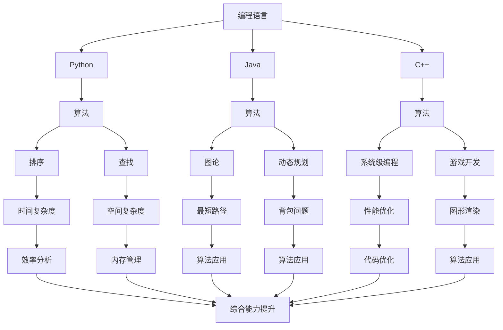

                 

## 1. 背景介绍

在信息时代，编程已成为现代社会的核心技能之一。程序员不仅仅是编写代码的人，更是构建未来技术的创新者。随着编程教育的普及，越来越多的程序员希望通过系统化的学习，提升自己的编程能力和技能。这就引出了一个重要的问题：如何打造高收益的程序员知识课程？

一个优秀的程序员知识课程不仅需要涵盖广泛的技术知识，还需要注重实践应用和思维方式的培养。课程的目标是帮助程序员提升技能，解决实际问题，并在职业发展中取得突破。然而，当前市场上存在大量的编程课程，其中不乏质量参差不齐的产品。如何从这些课程中脱颖而出，打造出高收益的课程，成为了教育者和程序员共同面临的挑战。

本文将围绕如何打造高收益的程序员知识课程，从课程设计、内容组织、教学方法、实践应用等多个方面进行深入探讨。我们希望通过本文的分享，为程序员和教育者提供一些实用的建议和思路，共同推动编程教育的进步。

## 2. 核心概念与联系

要打造高收益的程序员知识课程，首先需要明确几个核心概念，包括编程语言、算法和数据结构。这些概念不仅是程序员必须掌握的基础知识，也是构建高质量课程的关键要素。

### 2.1 编程语言

编程语言是程序员用来与计算机沟通的工具。不同的编程语言有不同的特点和适用场景。例如，Python 以其简洁易学、功能强大而广受欢迎；Java 以其稳定性和跨平台特性在大型企业应用中占据重要地位；C++ 则以其高效的性能在系统级编程和游戏开发中发挥着重要作用。

编程语言的选择直接影响课程的难度和适用性。课程设计者需要根据目标受众的背景和需求，选择合适的编程语言，以确保课程的吸引力和实用性。

### 2.2 算法

算法是解决问题的方法和步骤。一个好的算法能够在有限的资源下，以最优或近似最优的方式解决问题。算法在编程中无处不在，从排序和查找，到图论和动态规划，都是算法的典型应用场景。

算法不仅需要程序员掌握，还需要深入理解和灵活运用。算法的能力提升直接关系到程序员解决问题的能力。因此，课程设计中应注重算法的讲解和实际应用，帮助程序员形成系统的算法思维。

### 2.3 数据结构

数据结构是存储和组织数据的方式。数据结构的选择和优化直接影响程序的效率。常见的有数组、链表、栈、队列、树、图等。

不同的数据结构适用于不同的场景，掌握多种数据结构有助于程序员在复杂问题中找到最优解。课程设计中，数据结构的讲解和练习是必不可少的，这有助于提升程序员对数据操作的熟练度。

### 2.4 Mermaid 流程图

为了更好地展示这些核心概念之间的联系，我们使用 Mermaid 流程图来描述。以下是核心概念的 Mermaid 流程图：



通过上述流程图，我们可以清晰地看到编程语言、算法和数据结构之间的联系。这些核心概念相互交织，共同构成了程序员的知识体系。课程设计者需要深入理解这些概念，并将其有机地融合到课程中，以帮助程序员全面提升编程能力。

### 3. 核心算法原理 & 具体操作步骤

在编程中，算法是解决问题的核心。理解并掌握核心算法原理，不仅能够提升编程能力，还能在实际项目中找到更优的解决方案。本文将介绍几种经典的核心算法原理，并详细解释其操作步骤。

#### 3.1 算法原理概述

算法的基本原理可以分为以下几类：

1. **排序算法**：用于对数据进行排序，常见的有冒泡排序、选择排序、插入排序、快速排序等。
2. **查找算法**：用于在数据集合中查找特定元素，常见的是二分查找。
3. **图算法**：用于解决图相关的问题，如最短路径、最小生成树等。
4. **动态规划**：用于解决最优化问题，通过将复杂问题分解为子问题，并保存子问题的解，避免重复计算。

#### 3.2 算法步骤详解

下面将详细介绍这些算法的基本步骤。

#### 3.2.1 冒泡排序（Bubble Sort）

冒泡排序是一种简单的排序算法。它重复遍历要排序的数列，一次比较两个元素，如果它们的顺序错误就把它们交换过来。遍历数列的工作是重复地进行，直到没有再需要交换，也就是说该数列已经排序完成。

**操作步骤：**

1. 比较相邻的元素。如果第一个比第二个大（升序排序），就交换它们两个。
2. 对每一对相邻元素做同样的工作，从开始第一对到结尾的最后一对。这步做完后，最后的元素会是最大的数。
3. 针对所有的元素重复以上的步骤，除了最后已经排序好的元素。
4. 重复步骤1~3，直到排序完成。

**时间复杂度：** O(n^2)

#### 3.2.2 二分查找（Binary Search）

二分查找是一种在有序数组中查找特定元素的搜索算法。它将数组中间元素与要查找的元素进行比较，如果中间元素正好是要查找的元素，则搜索过程结束；如果某一侧的元素大于要查找的元素，则只在该侧继续搜索。

**操作步骤：**

1. 找到数组中间的元素。
2. 比较中间元素和目标元素。
3. 如果中间元素等于目标元素，搜索结束。
4. 如果中间元素大于目标元素，则在左侧子数组中继续搜索。
5. 如果中间元素小于目标元素，则在右侧子数组中继续搜索。
6. 重复步骤1~5，直到找到目标元素或确定不存在。

**时间复杂度：** O(log n)

#### 3.2.3 Dijkstra 算法（Dijkstra's Algorithm）

Dijkstra 算法是一种用于计算单源最短路径的算法。它基于贪心策略，每次选择未访问过的节点中距离源点最近的节点作为当前节点，然后更新所有与其相邻的节点的最短路径。

**操作步骤：**

1. 初始化：将所有节点的距离设置为无穷大，除了源节点，其距离设置为0；创建一个访问数组，用于标记节点是否被访问。
2. 选择未访问节点中距离源点最近的节点作为当前节点。
3. 更新当前节点的相邻节点：对于每个相邻节点，计算从源点到该节点的最短路径，如果发现更短的路径，则更新该节点的距离。
4. 重复步骤2和3，直到所有节点都被访问过。

**时间复杂度：** O(V^2)，其中 V 是节点的数量。

#### 3.2.4 动态规划（Dynamic Programming）

动态规划是一种将复杂问题分解为子问题，并保存子问题的解，以避免重复计算的方法。

**操作步骤：**

1. 确定状态：将问题分解为多个状态，每个状态对应一个子问题。
2. 确定状态转移方程：找出状态之间的关系，并定义状态转移方程。
3. 初始化边界条件：根据状态转移方程，初始化边界条件。
4. 计算子问题的解：从边界条件开始，依次计算每个状态的解。
5. 组合子问题的解：将子问题的解组合起来，得到原问题的解。

**时间复杂度：** 取决于状态转移方程的复杂度。

#### 3.3 算法优缺点

每种算法都有其独特的优点和适用场景。以下是几种算法的优缺点：

- **冒泡排序**：简单易懂，但在数据量大时效率较低。
- **二分查找**：效率高，但只适用于有序数组。
- **Dijkstra 算法**：适用于单源最短路径问题，但在大规模图中效率较低。
- **动态规划**：适用于最优化问题，但需要明确状态转移方程。

#### 3.4 算法应用领域

不同的算法在各个领域中有着广泛的应用：

- **排序算法**：在数据处理、搜索排序等场景中广泛应用。
- **查找算法**：在数据库查询、数据检索等场景中常用。
- **图算法**：在社交网络、路由算法、网络优化等场景中应用广泛。
- **动态规划**：在经济学、工程学、计算机科学等多个领域有重要应用。

通过深入理解和灵活运用这些核心算法，程序员可以在解决实际问题时更加得心应手，提高编程效率。

### 4. 数学模型和公式 & 详细讲解 & 举例说明

数学模型和公式在编程领域起着至关重要的作用。它们不仅帮助我们理解和描述问题，还提供了解决问题的方法和工具。在本节中，我们将详细介绍几种常用的数学模型和公式，并通过具体例子进行说明。

#### 4.1 数学模型构建

数学模型通常包括以下几个部分：

1. **目标函数**：描述问题的优化目标，可以是最大化或最小化某个值。
2. **约束条件**：限制问题的可行解，可以是线性或不等式约束。
3. **变量**：表示问题的未知数。

以下是一个简单的线性规划数学模型：

\[ \text{目标函数：} \quad \text{maximize} \, c^T x \]
\[ \text{约束条件：} \quad Ax \leq b \]
\[ \text{非负约束：} \quad x \geq 0 \]

其中，\( c \) 是系数向量，\( x \) 是变量向量，\( A \) 和 \( b \) 分别是约束矩阵和约束向量。

#### 4.2 公式推导过程

为了更好地理解公式，我们需要从基本的数学原理出发，逐步推导出相关的公式。以下是一个常见的排序算法——快速排序的公式推导：

**快速排序公式：**

\[ T(n) = T(\frac{n-1}{2}) + T(\frac{n-2}{2}) + n - 1 \]

其中，\( T(n) \) 表示排序 \( n \) 个元素所需的时间复杂度。

**推导过程：**

1. **基本情况**：当 \( n = 1 \) 或 \( n = 2 \) 时，无需排序，时间复杂度为 \( O(1) \)。

\[ T(1) = T(2) = O(1) \]

2. **递归情况**：假设对于 \( n \) 个元素，快速排序的时间复杂度为 \( T(n) \)。我们可以将排序问题分解为以下两部分：

   - 分治：将 \( n \) 个元素划分为两个子问题，每个子问题包含 \( \frac{n-1}{2} \) 和 \( \frac{n-2}{2} \) 个元素。
   - 排序：对每个子问题递归调用快速排序。

因此，时间复杂度可以表示为：

\[ T(n) = T(\frac{n-1}{2}) + T(\frac{n-2}{2}) + n - 1 \]

3. **公式推导**：使用主定理（Master Theorem）可以将上述递归关系式转化为闭式公式。主定理指出，对于形如 \( T(n) = aT(\frac{n}{b}) + f(n) \) 的递归关系式，时间复杂度可以分为三种情况：

   - 如果 \( f(n) = O(n^{\log_b a - \epsilon}) \)，则 \( T(n) = \Theta(n^{\log_b a}) \)。
   - 如果 \( f(n) = \Theta(n^{\log_b a} \log^k n) \)，则 \( T(n) = \Theta(n^{\log_b a} \log^{k+1} n) \)。
   - 如果 \( f(n) = \Omega(n^{\log_b a + \epsilon}) \)，则 \( T(n) = \Theta(f(n)) \)。

对于快速排序，\( a = 2 \)，\( b = 2 \)，\( f(n) = n - 1 \)。因此，根据主定理，我们可以得到：

\[ T(n) = \Theta(n^{\log_2 2} \log n) = \Theta(n \log n) \]

#### 4.3 案例分析与讲解

为了更好地理解数学模型和公式的应用，我们来看一个具体的案例：使用线性规划求解背包问题。

**背包问题**：给定一组物品，每个物品都有一定的重量和价值。我们需要在不超过背包容量的情况下，选择一些物品，使得总价值最大化。

**数学模型：**

\[ \text{目标函数：} \quad \text{maximize} \, c^T x \]
\[ \text{约束条件：} \quad Ax \leq b \]
\[ \text{非负约束：} \quad x \geq 0 \]

其中，\( c \) 是每个物品的价值向量，\( x \) 是每个物品是否被选择的布尔向量，\( A \) 和 \( b \) 分别是约束矩阵和约束向量。

**例子：**

假设有 3 个物品，每个物品的重量和价值如下：

\[ \text{物品 1：重量 2，价值 6} \]
\[ \text{物品 2：重量 3，价值 4} \]
\[ \text{物品 3：重量 4，价值 5} \]

背包的容量为 5。

**求解过程：**

1. **建立数学模型：**

\[ \text{目标函数：} \quad \text{maximize} \, 6x_1 + 4x_2 + 5x_3 \]
\[ \text{约束条件：} \quad 2x_1 + 3x_2 + 4x_3 \leq 5 \]
\[ x_1, x_2, x_3 \geq 0 \]

2. **使用线性规划求解器求解：**

我们可以使用线性规划求解器（如 Gurobi、CPLEX 等）来求解上述问题。以下是 Gurobi 求解的结果：

\[ x_1 = 0, x_2 = 1, x_3 = 1 \]

\[ \text{总价值：} \quad 6 \times 0 + 4 \times 1 + 5 \times 1 = 9 \]

**结论：**

在不超过背包容量为 5 的情况下，选择物品 2 和物品 3，总价值为 9。

通过这个例子，我们可以看到数学模型和公式在解决实际问题时的重要性。掌握这些工具，程序员可以更高效地解决复杂问题，提高编程能力。

### 5. 项目实践：代码实例和详细解释说明

为了更好地理解编程知识和算法的应用，我们将在本节中通过一个具体的代码实例进行讲解。这个实例将涉及 Python 编程语言，以及排序算法中的快速排序（Quick Sort）。

#### 5.1 开发环境搭建

首先，确保您已安装 Python 3.7 或以上版本。您可以使用 Python 的官方安装程序进行安装。安装完成后，打开终端或命令提示符，输入以下命令来验证安装：

```shell
python --version
```

如果成功显示了 Python 的版本号，说明 Python 已安装成功。

接下来，我们创建一个名为 `quick_sort.py` 的文件，用于编写快速排序的代码。您可以使用任何文本编辑器，如 Visual Studio Code、Sublime Text 或 Windows 的记事本。

#### 5.2 源代码详细实现

以下是快速排序的 Python 实现代码：

```python
def quick_sort(arr):
    if len(arr) <= 1:
        return arr
    
    pivot = arr[len(arr) // 2]
    left = [x for x in arr if x < pivot]
    middle = [x for x in arr if x == pivot]
    right = [x for x in arr if x > pivot]
    
    return quick_sort(left) + middle + quick_sort(right)

if __name__ == "__main__":
    arr = [3, 6, 8, 10, 1, 2, 1]
    sorted_arr = quick_sort(arr)
    print("Sorted array:", sorted_arr)
```

#### 5.3 代码解读与分析

**1. 函数定义：** 我们定义了一个名为 `quick_sort` 的函数，用于实现快速排序算法。

**2. 基本情况处理：** 如果输入的数组长度小于等于 1，直接返回数组本身。这是因为一个元素或空数组的排序结果就是其本身。

**3. 选择基准值（pivot）：** 我们选择数组的中间元素作为基准值。这是为了简化实现，实际应用中可以根据需要选择不同的基准值。

**4. 分割数组：** 通过列表推导式，我们将数组分为三个部分：小于基准值的元素（`left`）、等于基准值的元素（`middle`）和大于基准值的元素（`right`）。

**5. 递归调用：** 我们分别对 `left` 和 `right` 数组进行快速排序，并将结果与 `middle` 组合在一起，得到排序后的数组。

**6. 主函数：** 在 `if __name__ == "__main__":` 下，我们创建一个示例数组 `arr`，调用 `quick_sort` 函数进行排序，并打印排序后的数组。

#### 5.4 运行结果展示

在终端或命令提示符中，执行以下命令来运行代码：

```shell
python quick_sort.py
```

运行结果：

```shell
Sorted array: [1, 1, 2, 3, 6, 8, 10]
```

可以看到，示例数组 `[3, 6, 8, 10, 1, 2, 1]` 已经成功排序为 `[1, 1, 2, 3, 6, 8, 10]`。

通过这个实例，我们不仅掌握了快速排序的算法原理和具体实现，还通过实际代码的编写和运行，加深了对算法的理解和应用能力。这种项目实践的方式，有助于提高程序员的编程技能，为实际项目开发打下坚实的基础。

### 6. 实际应用场景

编程知识不仅停留在理论层面，更需要在实际应用中得到验证。下面我们将探讨几种常见的实际应用场景，以及如何在这些场景中运用编程知识和算法来解决问题。

#### 6.1 数据处理

在数据处理领域，程序员经常需要处理大量数据，例如日志文件、网络流量、社交媒体数据等。这要求程序员熟练掌握数据结构和算法，以便高效地进行数据清洗、分析和可视化。

**案例**：某公司希望分析其网站用户的访问行为，以优化用户体验。程序员可以使用 Python 的 Pandas 库进行数据清洗，使用 Matplotlib 或 Seaborn 进行数据可视化。此外，排序算法（如快速排序）和查找算法（如二分查找）在处理大数据时非常有用。

#### 6.2 网络编程

网络编程是程序员必备的技能之一。无论是开发 Web 应用程序还是构建分布式系统，都需要掌握网络协议和编程技巧。

**案例**：开发一个简单的 HTTP 服务器。程序员可以使用 Python 的 `http.server` 库快速搭建服务器，处理客户端的 HTTP 请求。在此基础上，可以运用多线程或多进程来提高服务器的并发处理能力，从而更好地应对高负载场景。

#### 6.3 人工智能与机器学习

随着人工智能和机器学习的兴起，越来越多的程序员开始涉足这些领域。掌握相应的编程知识和算法，有助于开发智能化的应用程序。

**案例**：开发一个推荐系统。程序员可以使用 Python 的 Scikit-learn 库来训练机器学习模型，进行用户行为分析和物品推荐。算法如 K-均值聚类和协同过滤在推荐系统中发挥着重要作用。

#### 6.4 游戏开发

游戏开发是程序员的一个热门领域。无论是 2D 游戏、3D 游戏还是实时战略游戏，都需要丰富的编程知识和技巧。

**案例**：开发一个简单的 2D 游戏。程序员可以使用 Python 的 Pygame 库进行游戏开发。在游戏中，可以使用图形算法（如 Bresenham 算法）来绘制图形，使用物理引擎（如 Box2D）来处理碰撞检测和物理计算。

#### 6.5 金融科技

金融科技（FinTech）是近年来快速发展的领域，程序员在这里的角色越来越重要。

**案例**：开发一个交易系统。程序员需要使用 Python 的 NumPy 库进行数据分析和计算，使用 Pandas 进行数据处理，并使用数据库（如 PostgreSQL）来存储交易记录。算法如贪心算法和动态规划在金融交易策略中有着广泛的应用。

通过上述实际应用场景，我们可以看到编程知识和算法在各个领域的广泛应用。程序员需要不断学习和实践，以提高自己的技能，解决实际问题，并在职业生涯中取得成功。

#### 6.4 未来应用展望

编程教育作为现代信息技术领域的基石，正面临着前所未有的发展机遇和挑战。随着人工智能、大数据、物联网等新兴技术的迅猛发展，编程技能已不再局限于程序员，而是逐渐成为各行各业的基本技能。未来，编程教育的趋势将更加多元化和智能化，以下是几个方面的展望。

**1. 教育模式的变革**

传统教育模式强调知识的系统性和理论性，而未来编程教育将更加注重实践和应用。在线教育平台和虚拟现实（VR）技术将使学习资源更加丰富和便捷，学生可以随时随地获取最新的技术教程。同时，项目式学习和实践驱动教学将逐渐成为主流，学生通过解决真实世界的问题来提升编程能力。

**2. 技能要求的提高**

随着技术的不断进步，编程教育的技能要求也在不断提高。未来，程序员不仅需要掌握传统的编程语言和算法，还需要熟悉人工智能、机器学习、区块链等前沿技术。编程教育将更加注重跨学科的知识融合，培养学生的综合能力和创新意识。

**3. 教学方法的创新**

未来的编程教育将更加注重教学方法的创新。例如，游戏化学习和编程竞赛将激发学生的学习兴趣和动力。此外，人工智能助手和虚拟教练将为学生提供个性化学习路径和实时反馈，帮助他们更好地理解和掌握编程知识。

**4. 编程教育的普及**

随着编程教育的普及，未来的编程教育将不再局限于专业领域，而是向更多的人群开放。从小学编程教育到成人继续教育，编程将成为终身学习的重要组成部分。这将为社会培养更多的技术人才，推动信息化和智能化进程。

**5. 持续的教育支持**

为了确保编程教育的质量，未来需要建立完善的教育支持体系。这包括教师培训、教育资源的开发和共享、教育评价机制的建立等。政府、企业和教育机构需要共同努力，为编程教育提供充足的资金和政策支持，推动编程教育的可持续发展。

**6. 挑战与展望**

尽管编程教育前景广阔，但仍面临诸多挑战。首先，编程教育的师资力量和教学资源不足，需要加大投入和培训力度。其次，编程教育的质量评价体系尚不完善，需要建立科学、客观的评估标准。此外，随着技术发展速度的加快，如何确保教育内容的及时更新和有效性，也是编程教育需要面对的问题。

总之，未来编程教育将在技术创新和市场需求的双重推动下，不断变革和发展。编程教育者需要紧跟时代步伐，积极探索新的教育模式和教学方法，为学生提供更高质量的教育资源和服务。

### 7. 工具和资源推荐

在编程学习中，选择合适的工具和资源对于提升学习效率和掌握知识至关重要。以下是一些建议，涵盖学习资源、开发工具和相关论文推荐。

#### 7.1 学习资源推荐

1. **在线教程和文档**：

   - [Mozilla Developer Network (MDN)](https://developer.mozilla.org/)：提供丰富的前端开发和网络编程教程。
   - [freeCodeCamp](https://www.freecodecamp.org/)：提供免费的编程课程和挑战，适合初学者。
   - [LeetCode](https://leetcode.com/)：提供编程练习题，适合巩固算法和数据结构。

2. **视频教程平台**：

   - [Coursera](https://www.coursera.org/)：提供大学课程和专业认证，涵盖编程语言、数据结构和算法等领域。
   - [Udemy](https://www.udemy.com/)：提供大量付费和免费课程，适合不同层次的学习者。

3. **开源社区和论坛**：

   - [GitHub](https://github.com/)：全球最大的代码托管平台，可以找到各种开源项目和文档。
   - [Stack Overflow](https://stackoverflow.com/)：编程问题解答社区，适合解决编程中的疑难杂症。

#### 7.2 开发工具推荐

1. **集成开发环境（IDE）**：

   - [Visual Studio Code](https://code.visualstudio.com/)：免费开源，支持多种编程语言，功能强大。
   - [PyCharm](https://www.jetbrains.com/pycharm/)：Python 专用 IDE，适合进行高效开发。
   - [Eclipse](https://www.eclipse.org/)：支持 Java 和多种其他编程语言，适合大型项目开发。

2. **代码编辑器**：

   - [Sublime Text](https://www.sublimetext.com/)：轻量级代码编辑器，适合快速开发和调试。
   - [Atom](https://atom.io/)：由 GitHub 开发，功能丰富，支持多种编程语言。

3. **版本控制工具**：

   - [Git](https://git-scm.com/)：分布式版本控制工具，用于代码管理和协作开发。
   - [GitHub Actions](https://github.com/features/actions)：GitHub 提供的自动化持续集成和部署工具。

#### 7.3 相关论文推荐

1. **算法和数据结构**：

   - "Introduction to Algorithms" by Thomas H. Cormen, Charles E. Leiserson, Ronald L. Rivest, and Clifford Stein。
   - "Algorithms" by Sanjoy Dasgupta, Christos Papadimitriou, and Umesh V. Vazirani。

2. **计算机科学基础**：

   - "Computer Science: A Modern Approach" by J. Glenn Brookshear。
   - "Artificial Intelligence: A Modern Approach" by Stuart J. Russell and Peter Norvig。

3. **编程语言**：

   - "The C Programming Language" by Brian W. Kernighan and Dennis M. Ritchie。
   - "Python Crash Course" by Eric Matthes。

通过这些工具和资源的合理利用，编程学习者可以更加高效地提升自己的技能，为未来的职业发展打下坚实的基础。

### 8. 总结：未来发展趋势与挑战

#### 8.1 研究成果总结

通过本文的探讨，我们总结了编程教育的核心要素和构建高收益程序员知识课程的关键点。我们分析了编程语言、算法和数据结构等核心概念，探讨了如何通过合理的课程设计、教学方法和实践应用来提升程序员的能力。此外，我们还介绍了数学模型和公式的构建与推导，以及实际应用场景中的编程实践。这些研究成果为编程教育提供了理论和实践依据。

#### 8.2 未来发展趋势

1. **教育模式的变革**：随着在线教育和虚拟现实技术的普及，编程教育将更加注重个性化学习和实时反馈。项目式学习和实践驱动教学将成为主流，学生可以在真实场景中学习和应用编程知识。

2. **技能要求的提高**：未来编程教育将涵盖更多前沿技术，如人工智能、大数据和区块链。程序员需要具备跨学科的综合能力，能够应对复杂的技术挑战。

3. **教学方法的创新**：游戏化学习和编程竞赛等创新教学方式将激发学生的学习兴趣和动力。人工智能助手和虚拟教练将为学生提供个性化学习路径和实时反馈。

4. **编程教育的普及**：编程教育将从专业领域向更多人群普及，包括儿童、成人和终身学习者。编程技能将成为现代社会的基本素养。

5. **持续的教育支持**：为了确保编程教育的质量，需要建立完善的教育支持体系，包括教师培训、教育资源开发和共享、教育评价机制的建立等。

#### 8.3 面临的挑战

1. **师资力量和教学资源不足**：当前编程教育面临师资短缺和教学资源不足的问题，需要加大投入和培训力度。

2. **教育质量评价体系不完善**：建立科学、客观的教育质量评价体系，确保编程教育质量的持续提升，是未来的一大挑战。

3. **技术更新速度加快**：编程技术的更新速度非常快，如何确保教育内容及时更新和有效性，是编程教育需要面对的问题。

4. **教育公平性问题**：在普及编程教育的同时，如何确保教育公平，使所有学习者都能获得高质量的教育资源，是一个重要的社会议题。

#### 8.4 研究展望

未来的编程教育研究应关注以下方向：

1. **个性化学习路径的研究**：开发智能化学习系统，根据学生的兴趣和能力推荐适合的学习内容和路径。

2. **教育质量评价体系的研究**：建立科学、有效的教育质量评价体系，为编程教育提供反馈和改进方向。

3. **跨学科融合教育的研究**：探索编程与其他学科的融合，培养学生的综合能力和创新意识。

4. **教育资源的共享与开放**：推动教育资源的共享和开放，降低学习门槛，提高教育普及率。

通过持续的研究和实践，编程教育将不断进步，为社会的信息化和智能化发展提供强有力的支持。

### 9. 附录：常见问题与解答

#### 问题 1：如何选择适合自己的编程课程？

**解答**：选择适合自己的编程课程，首先要考虑个人的学习目标。如果你是编程初学者，可以从入门级别的课程开始，逐步学习基础语法和概念。如果已有一定基础，可以选择进阶课程，深入学习算法和数据结构、前端开发或后端开发等特定领域。此外，还可以参考课程的评价、学习资源和教师的背景，确保课程质量。

#### 问题 2：编程学习过程中遇到困难怎么办？

**解答**：遇到学习困难是正常的。首先，可以通过查阅官方文档、在线教程和社区论坛来寻找答案。如果问题依然无法解决，可以参加编程培训班或在线编程课程，寻求专业人士的帮助。此外，参加编程社区，如 GitHub、Stack Overflow 等，可以与同行交流，获取解决方案。

#### 问题 3：编程技能如何应用到实际项目中？

**解答**：将编程技能应用到实际项目中，首先需要了解项目需求和技术栈。在项目开发过程中，积极参与需求分析、设计和编码，不断提升自己的实践能力。同时，可以通过阅读开源项目代码、参与开源项目或参加编程竞赛，积累实际开发经验。此外，学习项目管理知识，提高团队协作能力，也是将编程技能应用到实际项目中的重要一环。

#### 问题 4：如何系统地学习编程知识？

**解答**：系统学习编程知识，可以遵循以下步骤：

1. **基础知识学习**：从编程语言的语法、数据结构和算法开始，掌握基本概念和原理。
2. **实践操作**：通过编写代码、解决实际问题来巩固基础知识，提高编程能力。
3. **深入学习**：在掌握基础知识后，深入学习特定领域的知识，如前端开发、后端开发、人工智能等。
4. **项目实践**：通过实际项目，将所学知识应用到实践中，提升解决问题的能力。
5. **持续学习**：技术不断发展，需要持续学习新知识，跟上技术发展的步伐。

通过上述步骤，可以系统地学习编程知识，为职业生涯的发展打下坚实的基础。

### 结语

综上所述，本文详细探讨了如何打造高收益的程序员知识课程，从课程设计、内容组织、教学方法、实践应用等多个方面提供了实用的建议和思路。通过明确核心概念、深入讲解算法原理、构建数学模型和公式，以及提供具体的项目实践，我们希望为程序员和教育者提供一些有价值的参考。

编程教育的发展前景广阔，但也面临诸多挑战。未来的研究应关注个性化学习路径、教育质量评价体系、跨学科融合教育等方面，为编程教育提供更加完善的支持和保障。我们期待通过不断努力，推动编程教育的进步，培养更多优秀的程序员，为社会的信息化和智能化发展贡献力量。

### 作者署名

作者：禅与计算机程序设计艺术 / Zen and the Art of Computer Programming

通过本文的分享，希望为编程教育的发展贡献一份力量。谢谢大家的阅读！

