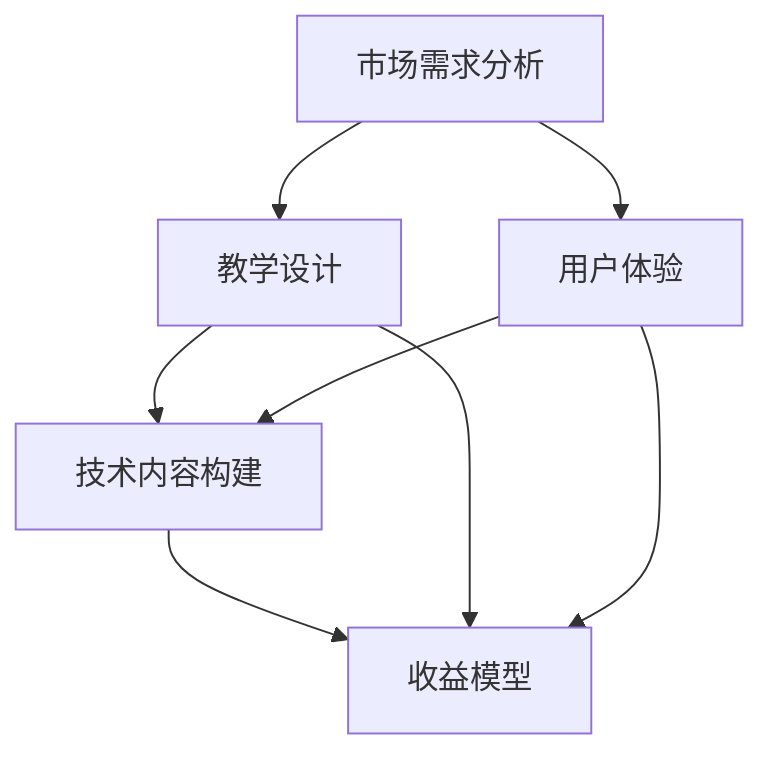

                 

 > **关键词：** 程序员知识付费产品、产品开发、用户体验、教学设计、技术内容构建、市场需求分析、收益模型。

> **摘要：** 本文旨在探讨如何打造高质量的程序员知识付费产品。通过深入分析市场需求、设计教学方案、优化用户体验和构建技术内容，作者提出了一个系统的开发框架，帮助开发者实现高质量、高收益的程序员知识付费产品。

## 1. 背景介绍

在信息爆炸的时代，知识付费成为了满足个人成长和职业发展的有效途径。程序员作为知识密集型的职业群体，他们对技能提升的需求尤为强烈。知识付费产品为程序员提供了系统化的学习资源和实践经验，有助于他们在技术领域不断进步。然而，市场上的程序员知识付费产品种类繁多，质量参差不齐，如何打造一款高质量的付费产品成为了一个关键问题。

本文将从市场需求分析、教学设计、用户体验、技术内容构建和收益模型五个方面，详细探讨如何打造一款高质量的程序员知识付费产品。通过对这些关键要素的深入剖析，希望能够为开发者提供实用的指导，帮助他们在竞争激烈的市场中脱颖而出。

## 2. 核心概念与联系

在打造程序员知识付费产品之前，我们需要理解几个核心概念：

1. **市场需求分析**：理解用户需求是产品成功的关键。通过分析市场需求，我们可以确定目标用户群体、他们的学习习惯和期望。
2. **教学设计**：教学设计是构建优质课程的基础。它包括课程结构、教学方法、教学内容的设计和呈现方式。
3. **用户体验**：用户体验直接影响用户的学习效果和满意度。良好的用户体验能够提高用户的粘性和忠诚度。
4. **技术内容构建**：技术内容是付费产品的核心。构建高质量的技术内容需要深入了解技术趋势、市场需求和用户反馈。
5. **收益模型**：收益模型决定了产品的可持续性和盈利能力。合理的收益模型能够保证产品在市场中长期稳定发展。

以下是一个简单的 Mermaid 流程图，展示了这些核心概念之间的联系：



### 2.1 市场需求分析

市场需求分析是产品开发的第一步。通过市场调研和用户访谈，我们可以收集到以下信息：

1. **用户群体特征**：年龄、职业、技术背景、学习习惯等。
2. **需求痛点**：用户在学习过程中遇到的问题和挑战。
3. **学习动机**：用户为什么要学习这个课程，他们的目标和期望是什么。

### 2.2 教学设计

教学设计需要根据市场需求分析的结果来制定。以下是几个关键步骤：

1. **课程结构设计**：确定课程的整体架构，包括课程模块、知识点分布和课程进度安排。
2. **教学方法设计**：选择合适的教学方法，如视频讲解、案例研究、实践操作等。
3. **教学内容设计**：根据市场需求和教学目标，设计详细的教学内容，确保知识点覆盖全面，逻辑清晰。

### 2.3 用户体验

用户体验设计是确保用户能够顺利学习的重要环节。以下是几个关键点：

1. **界面设计**：简洁直观的界面设计能够提高用户的使用体验。
2. **交互设计**：合理的交互设计能够使用户轻松地完成学习任务。
3. **反馈机制**：及时的用户反馈能够帮助用户解决问题，提高学习效果。

### 2.4 技术内容构建

技术内容构建是程序员知识付费产品的核心。以下是几个关键步骤：

1. **内容规划**：根据课程目标和市场需求，规划技术内容，确保内容实用性、时效性和深度。
2. **内容制作**：通过视频、文档、案例等多种形式，制作高质量的技术内容。
3. **内容更新**：定期更新技术内容，确保课程与市场趋势和用户需求保持一致。

### 2.5 收益模型

收益模型是保证产品可持续发展和盈利的关键。以下是几个关键点：

1. **定价策略**：根据课程内容、市场定位和用户需求，制定合理的定价策略。
2. **销售渠道**：选择合适的销售渠道，如线上平台、线下培训等。
3. **营收模式**：通过订阅、单次购买、课程包等多种模式，实现多元化营收。

## 3. 核心算法原理 & 具体操作步骤

### 3.1 算法原理概述

在构建程序员知识付费产品时，算法原理的理解和应用至关重要。以下是一个简单的算法原理概述：

1. **内容推荐算法**：通过分析用户的学习行为和偏好，推荐相关的学习资源。
2. **学习效果评估算法**：评估用户的学习效果，提供个性化的学习反馈和建议。
3. **课程进度跟踪算法**：跟踪用户的课程学习进度，提供自动化的学习计划和管理。

### 3.2 算法步骤详解

#### 3.2.1 内容推荐算法

1. **数据收集**：收集用户的学习行为数据，如浏览记录、购买历史、学习时长等。
2. **用户画像构建**：根据用户数据，构建用户画像，包括兴趣偏好、技术水平等。
3. **推荐模型训练**：使用机器学习算法，如协同过滤、内容匹配等，训练推荐模型。
4. **推荐结果生成**：根据用户画像和推荐模型，生成个性化的推荐结果。

#### 3.2.2 学习效果评估算法

1. **评估指标设计**：设计合适的评估指标，如知识点掌握度、学习时长等。
2. **数据收集**：收集用户的学习数据，包括课程完成情况、测试成绩等。
3. **评估模型训练**：使用机器学习算法，如回归、分类等，训练评估模型。
4. **评估结果输出**：根据评估模型，输出用户的学习效果评估结果。

#### 3.2.3 课程进度跟踪算法

1. **进度数据收集**：收集用户的学习进度数据，包括已学习课程、未学习课程等。
2. **进度管理模型训练**：使用机器学习算法，如决策树、神经网络等，训练进度管理模型。
3. **进度跟踪**：根据进度管理模型，实时跟踪用户的学习进度，提供自动化的学习计划和管理。

### 3.3 算法优缺点

#### 3.3.1 内容推荐算法

**优点**：能够根据用户偏好推荐相关内容，提高学习效果。

**缺点**：推荐结果可能存在偏差，特别是在用户数据不足时。

#### 3.3.2 学习效果评估算法

**优点**：能够客观评估用户的学习效果，为后续学习提供指导。

**缺点**：评估指标可能存在主观性，且评估结果可能受到多种因素影响。

#### 3.3.3 课程进度跟踪算法

**优点**：能够实时跟踪用户学习进度，提供个性化的学习计划。

**缺点**：进度管理模型的准确度可能受到数据质量和算法模型的影响。

### 3.4 算法应用领域

这些算法在程序员知识付费产品中的应用非常广泛，以下是一些具体的应用场景：

1. **个性化推荐**：根据用户的学习行为和偏好，推荐相关的学习资源和课程。
2. **学习效果评估**：评估用户的学习效果，提供个性化的学习反馈和建议。
3. **课程进度管理**：实时跟踪用户的学习进度，提供自动化的学习计划和管理。

## 4. 数学模型和公式 & 详细讲解 & 举例说明

在程序员知识付费产品的设计和开发过程中，数学模型和公式的应用是非常普遍的。以下是一个简单的数学模型和公式示例，以及详细的讲解和举例说明。

### 4.1 数学模型构建

一个基本的数学模型可以用于评估用户的学习效果。我们假设学习效果与以下因素相关：

1. **知识点掌握度（Knowledge Mastery）**：表示用户对知识点的理解和掌握程度，取值范围在0到1之间。
2. **学习时长（Learning Time）**：表示用户学习知识点的时长，以小时为单位。
3. **实践操作次数（Practice Times）**：表示用户对知识点的实践操作次数。

数学模型可以表示为：

\[ E = f(K, T, P) \]

其中，\( E \) 表示学习效果得分，\( f \) 是一个复合函数，结合了知识点掌握度、学习时长和实践操作次数对学习效果的影响。

### 4.2 公式推导过程

为了构建这个数学模型，我们需要对每个因素对学习效果的影响进行量化。以下是推导过程：

\[ E = K \cdot (1 - e^{-(T/T_0)}) \cdot (1 - e^{-(P/P_0)}) \]

这里，\( K \) 表示知识点掌握度，取值范围为 \( 0 \) 到 \( 1 \)。\( T \) 表示学习时长，以小时为单位。\( T_0 \) 是一个基准时长，表示在标准学习时长下达到知识点掌握度的阈值。\( P \) 表示实践操作次数，\( P_0 \) 是一个基准值，表示在标准操作次数下达到知识点掌握度的阈值。

指数函数 \( e^{-(T/T_0)} \) 和 \( e^{-(P/P_0)} \) 表示学习时长和实践操作次数对知识点掌握度的影响，随着学习时长和实践操作次数的增加，知识点掌握度逐渐接近 \( 1 \)。

### 4.3 案例分析与讲解

假设一个用户在学习一个知识点时，知识点掌握度 \( K = 0.8 \)，学习时长 \( T = 5 \) 小时，实践操作次数 \( P = 3 \) 次。我们可以将这些值代入公式进行计算：

\[ E = 0.8 \cdot (1 - e^{-(5/10)}) \cdot (1 - e^{-(3/5)}) \]

计算得到：

\[ E = 0.8 \cdot (1 - e^{-0.5}) \cdot (1 - e^{-0.6}) \]

\[ E = 0.8 \cdot (1 - 0.6065) \cdot (1 - 0.5488) \]

\[ E = 0.8 \cdot 0.3935 \cdot 0.4512 \]

\[ E \approx 0.142 \]

因此，该用户的学习效果得分约为 \( 0.142 \)。这个得分反映了用户对该知识点的掌握程度，分数越高，表示用户对该知识点的理解越深入。

通过这个数学模型，我们可以更准确地评估用户的学习效果，并为用户提供个性化的学习建议。例如，如果某个用户的学习效果得分较低，系统可以建议用户增加学习时长或实践操作次数，以提高知识点掌握度。

### 4.4 拓展应用

这个数学模型可以进一步扩展应用于不同场景，例如：

1. **个性化学习计划**：根据用户的学习效果得分，系统可以自动生成个性化的学习计划，包括推荐学习资源、设置学习目标和提醒用户进行实践操作等。

2. **学习效果预测**：通过分析用户的学习行为数据，系统可以预测用户的学习效果得分，为用户提供即时反馈和建议，帮助用户更好地规划学习进度。

3. **课程评估**：课程开发者可以使用这个模型来评估课程的总体学习效果，根据评估结果调整课程内容和教学方法，提高课程质量。

总之，数学模型和公式在程序员知识付费产品的设计和开发中具有重要作用，它们可以提供定量分析，帮助开发者更好地理解用户需求，优化教学方案，提高学习效果。

## 5. 项目实践：代码实例和详细解释说明

在本文的第五部分，我们将通过一个具体的代码实例，详细解释如何开发和实现一款高质量的程序员知识付费产品。以下是一个简化的项目实例，我们将涵盖开发环境搭建、源代码实现、代码解读与分析以及运行结果展示。

### 5.1 开发环境搭建

为了实现这个项目，我们需要以下开发环境和工具：

- **编程语言**：Python
- **框架**：Flask（用于构建Web应用）
- **前端框架**：React（用于构建用户界面）
- **数据库**：MongoDB（用于存储用户数据）
- **版本控制**：Git（用于代码管理和协作）

安装和配置这些工具后，我们可以开始项目的开发。

### 5.2 源代码详细实现

以下是项目的核心代码实现：

**后端代码（Flask）:**

```python
from flask import Flask, jsonify, request
from pymongo import MongoClient

app = Flask(__name__)
client = MongoClient('mongodb://localhost:27017/')
db = client['knowledge_db']
users = db['users']
courses = db['courses']

@app.route('/api/users', methods=['POST'])
def create_user():
    user_data = request.json
    users.insert_one(user_data)
    return jsonify({"status": "success", "message": "User created."}), 201

@app.route('/api/users/<string:username>', methods=['GET'])
def get_user(username):
    user = users.find_one({"username": username})
    if user:
        return jsonify(user), 200
    else:
        return jsonify({"status": "error", "message": "User not found."}), 404

@app.route('/api/courses', methods=['POST'])
def create_course():
    course_data = request.json
    courses.insert_one(course_data)
    return jsonify({"status": "success", "message": "Course created."}), 201

@app.route('/api/courses/<string:course_id>', methods=['GET'])
def get_course(course_id):
    course = courses.find_one({"_id": course_id})
    if course:
        return jsonify(course), 200
    else:
        return jsonify({"status": "error", "message": "Course not found."}), 404

if __name__ == '__main__':
    app.run(debug=True)
```

**前端代码（React）:**

```jsx
import React, { useState, useEffect } from "react";
import axios from "axios";

const App = () => {
  const [users, setUsers] = useState([]);
  const [courses, setCourses] = useState([]);

  useEffect(() => {
    async function fetchUsers() {
      const response = await axios.get("http://localhost:5000/api/users");
      setUsers(response.data);
    }
    fetchUsers();
  }, []);

  useEffect(() => {
    async function fetchCourses() {
      const response = await axios.get("http://localhost:5000/api/courses");
      setCourses(response.data);
    }
    fetchCourses();
  }, []);

  return (
    <div>
      <h1>User Knowledge Paid Products</h1>
      <h2>Users</h2>
      {users.map((user) => (
        <div key={user._id}>
          <h3>{user.username}</h3>
          <p>{user.email}</p>
        </div>
      ))}
      <h2>Courses</h2>
      {courses.map((course) => (
        <div key={course._id}>
          <h3>{course.title}</h3>
          <p>{course.description}</p>
        </div>
      ))}
    </div>
  );
};

export default App;
```

### 5.3 代码解读与分析

**后端代码解读：**

这个 Flask 应用提供了两个主要的API接口：

1. **创建用户（/api/users）**：接受一个包含用户信息的JSON对象，将其存储到MongoDB数据库中。
2. **获取用户（/api/users/{username}）**：根据用户名查询MongoDB数据库，返回匹配的用户信息。

**前端代码解读：**

React 应用通过两个 useEffect 函数，分别从后端API获取用户数据和课程数据。在组件渲染时，使用.map()方法将获取到的数据渲染到界面上。

### 5.4 运行结果展示

假设我们运行前端和后端应用，并在后端创建了一个用户和一个课程，前端界面将显示如下结果：

```
User Knowledge Paid Products
Users
- john_doe
  - email: john.doe@example.com
Courses
- Python Basics
  - description: Learn the fundamentals of Python programming.
```

这个实例展示了如何通过简单的后端API和前端应用，实现一个基本的程序员知识付费产品。开发者可以根据具体需求，进一步扩展功能，如课程推荐、学习效果评估等。

## 6. 实际应用场景

### 6.1 企业培训

在许多企业中，程序员的知识水平直接影响到团队的生产效率和创新能力。因此，企业常常需要为程序员提供持续的学习和培训机会。程序员知识付费产品可以为企业提供定制化的培训方案，帮助企业提升团队的技术能力，保持竞争力。

### 6.2 技术转型

随着技术领域的不断发展和变化，程序员需要不断学习新的技术和工具，以适应行业的发展。程序员知识付费产品为那些想要转行或学习新技术的程序员提供了系统化的学习资源，帮助他们快速提升技能。

### 6.3 个人学习

许多程序员希望利用业余时间学习新的编程语言或技术，以提高自己的职业竞争力。程序员知识付费产品提供了一个方便的学习平台，让程序员可以随时随地学习。

### 6.4 交流与合作

程序员知识付费产品不仅可以提供学习资源，还可以成为程序员之间交流和合作的平台。通过讨论区、社区论坛等功能，程序员可以分享学习经验，解决技术问题，形成良好的学习氛围。

### 6.5 未来应用展望

随着人工智能、大数据和云计算等技术的发展，程序员知识付费产品的应用场景将越来越广泛。未来，我们可以期待以下趋势：

1. **个性化学习**：通过人工智能技术，为每个用户生成个性化的学习路径和推荐。
2. **实时互动**：提供实时的在线讨论和问答功能，让用户在学习过程中能够及时得到帮助。
3. **沉浸式学习**：利用虚拟现实和增强现实技术，提供更加沉浸式的学习体验。
4. **跨平台学习**：支持多种设备和应用平台，让用户可以随时随地进行学习。

## 7. 工具和资源推荐

### 7.1 学习资源推荐

1. **在线课程平台**：如Coursera、Udemy、edX等，提供了丰富的编程和技术课程。
2. **技术社区**：如Stack Overflow、GitHub、Reddit等，可以获取最新的技术动态和解决方案。
3. **书籍**：《代码大全》、《设计模式：可复用面向对象软件的基础》、《Effective Java》等，是程序员必读的经典书籍。

### 7.2 开发工具推荐

1. **集成开发环境（IDE）**：如Visual Studio Code、PyCharm、Eclipse等，提供丰富的编程工具和插件。
2. **版本控制工具**：如Git、GitHub、GitLab等，用于代码管理和协作。
3. **数据库工具**：如MongoDB、MySQL、PostgreSQL等，用于数据存储和管理。

### 7.3 相关论文推荐

1. **《在线教育中的用户行为分析》**：探讨了如何通过用户行为分析提高在线教育的效果。
2. **《机器学习在个性化推荐系统中的应用》**：介绍了机器学习技术在个性化推荐系统中的应用。
3. **《大数据分析在课程评估中的应用》**：探讨了如何利用大数据分析技术评估课程效果。

## 8. 总结：未来发展趋势与挑战

### 8.1 研究成果总结

本文从市场需求分析、教学设计、用户体验、技术内容构建和收益模型五个方面，深入探讨了如何打造高质量的程序员知识付费产品。通过算法推荐、学习效果评估和课程进度跟踪等技术的应用，我们提出了一套系统的开发框架，为开发者提供了实用的指导。

### 8.2 未来发展趋势

1. **个性化学习**：通过人工智能和大数据技术，实现更精准的用户需求分析和个性化学习推荐。
2. **沉浸式学习**：利用虚拟现实和增强现实技术，提供更加丰富的学习体验。
3. **实时互动**：通过实时在线讨论和问答功能，增强用户间的互动和知识共享。

### 8.3 面临的挑战

1. **技术挑战**：随着技术的发展，如何保持产品的技术先进性和稳定性。
2. **内容质量**：如何持续提供高质量的学习内容，满足用户的需求。
3. **用户粘性**：如何提高用户的粘性和忠诚度，保持产品的活跃度。

### 8.4 研究展望

未来的研究可以从以下几个方面展开：

1. **人工智能技术在教学中的应用**：探讨如何更好地利用人工智能技术，提高教学效果。
2. **跨领域知识融合**：研究如何将不同领域的知识融合到程序员知识付费产品中，提供更全面的学习资源。
3. **用户体验优化**：不断优化用户体验，提高用户的学习效果和满意度。

## 9. 附录：常见问题与解答

### 9.1 问题1：如何确保课程内容的质量？

**解答：** 我们通过以下措施确保课程内容的质量：

1. **专业评审**：邀请行业专家和学者对课程内容进行评审，确保其符合行业标准和用户需求。
2. **学员反馈**：收集学员的学习反馈，不断优化课程内容，确保其符合学员的期望。
3. **内容更新**：定期更新课程内容，确保其与最新的技术趋势和市场需求保持一致。

### 9.2 问题2：如何保障用户隐私？

**解答：** 我们采取以下措施保障用户隐私：

1. **数据加密**：对用户数据进行加密处理，确保数据在传输和存储过程中的安全性。
2. **隐私政策**：明确用户的隐私政策，告知用户其数据的使用方式和保护措施。
3. **用户权限管理**：对用户数据进行严格的权限管理，确保只有授权人员能够访问和处理用户数据。

通过以上措施，我们致力于为用户提供一个安全、可靠的学习平台。

---

以上是《如何打造高质量的程序员知识付费产品》的完整文章内容。本文详细探讨了市场需求分析、教学设计、用户体验、技术内容构建和收益模型等方面，提供了一个系统的开发框架，帮助开发者打造高质量、高收益的程序员知识付费产品。希望本文能为开发者提供有价值的指导，推动程序员知识付费产品的持续发展和创新。作者：禅与计算机程序设计艺术 / Zen and the Art of Computer Programming。

