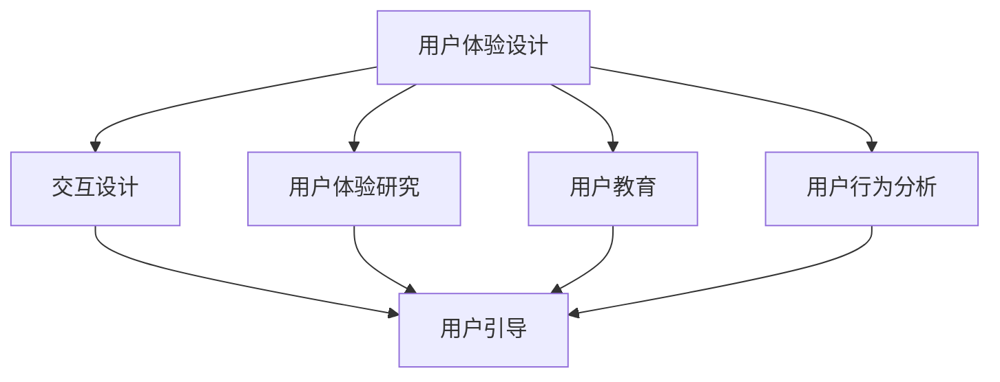

                 

关键词：用户引导、用户体验、交互设计、用户教育、UI/UX、软件产品开发

> 摘要：本文深入探讨了如何进行有效的用户引导，包括其核心概念、设计原则、具体实施步骤以及相关技术工具和资源的推荐。通过用户引导，我们可以帮助用户更好地理解和使用我们的产品，从而提升用户体验，实现产品的成功。

## 1. 背景介绍

在当今快速发展的数字化时代，用户引导在软件产品开发中扮演着越来越重要的角色。无论是简单的移动应用，还是复杂的企业级系统，用户引导都是连接用户与产品的重要桥梁。有效的用户引导不仅能够帮助用户快速上手，理解并使用产品的功能，还能够提升用户满意度，增强用户忠诚度，从而对产品的成功产生积极影响。

用户引导涵盖了从用户注册、登录，到产品核心功能介绍的各个环节。它不仅仅是界面上的提示和说明，更是一种全面的设计策略，旨在通过一系列有针对性的引导步骤，帮助用户逐步适应和掌握产品。

本文将围绕以下内容展开讨论：

1. 核心概念与联系
2. 核心算法原理 & 具体操作步骤
3. 数学模型和公式 & 详细讲解 & 举例说明
4. 项目实践：代码实例和详细解释说明
5. 实际应用场景
6. 工具和资源推荐
7. 总结：未来发展趋势与挑战

通过本文的探讨，我们将更深入地理解用户引导的原理和实践方法，为其在软件开发中的应用提供有力的指导。

## 2. 核心概念与联系

在深入探讨用户引导之前，我们首先需要明确一些核心概念，并理解它们之间的相互关系。以下是用户引导中几个关键概念的定义和它们之间的联系。

### 2.1 用户体验（UX）设计

用户体验设计（UX Design）是一种以用户为中心的设计方法，旨在创建产品或服务时，确保用户在使用过程中的愉悦和高效。UX 设计涵盖了用户研究、交互设计、信息架构等多个方面，其目标是提高用户的满意度和忠诚度。

### 2.2 用户体验（UX）研究

用户体验研究是UX设计的核心环节，它通过调查、用户测试和数据分析等方法，了解用户的需求、行为和感受。用户体验研究为用户引导提供了宝贵的洞察，帮助我们了解用户在产品中的痛点，从而制定出更有效的引导策略。

### 2.3 交互设计（UI）设计

交互设计（UI Design）专注于用户界面和交互流程的设计，确保用户与产品之间的交互直观、流畅和愉悦。交互设计是用户引导的直接载体，通过视觉元素、布局和操作流程的设计，实现引导用户的目的。

### 2.4 用户教育（UE）

用户教育（User Education）是通过教育手段帮助用户更好地理解和使用产品。用户教育可以包括教程、帮助文档、在线支持等多种形式，它是用户引导的重要补充，帮助用户在引导过程中遇到问题时能够找到解决方案。

### 2.5 用户行为分析（UAA）

用户行为分析（User Behavior Analysis）是通过对用户在产品中的行为数据进行分析，了解用户的操作习惯、使用场景和痛点。用户行为分析为用户引导提供了数据支持，帮助我们在设计和优化引导流程时，更加精准地满足用户需求。

### 2.6 联系与关系

用户体验设计、用户体验研究、交互设计、用户教育和用户行为分析共同构成了用户引导的基础。它们之间的联系如下图所示：



通过图中的Mermaid流程图，我们可以清晰地看到各个核心概念之间的联系和用户引导在整个流程中的作用。用户引导不仅是用户体验设计的一部分，更是连接用户体验研究和用户教育的桥梁，通过用户行为分析的数据支持，实现更精准、更有效的引导。

### 2.7 用户引导的重要性

用户引导在软件产品开发中的重要性不可忽视。首先，有效的用户引导可以帮助用户更快地理解产品，减少用户的学习成本，从而提升用户满意度。其次，通过引导用户了解产品的核心功能和价值，可以增强用户对产品的忠诚度。此外，用户引导还可以通过实时反馈和用户行为分析，为产品优化提供重要依据。

用户引导的这些作用不仅体现在短期效果上，更在长期的产品发展中发挥着重要作用。一个设计精良的用户引导流程，可以持续提升产品的用户留存率和市场份额，为企业的长期发展奠定坚实基础。

### 2.8 用户引导的目标

用户引导的目标可以分为以下几个方面：

1. **降低学习成本**：通过简明易懂的引导步骤，帮助用户快速上手产品。
2. **提高用户满意度**：确保用户在使用产品时能够获得愉悦的体验。
3. **增强用户忠诚度**：通过引导用户深入了解产品的核心价值，培养用户对产品的忠诚度。
4. **优化产品功能**：通过用户引导过程中收集的用户反馈，持续优化产品功能和用户体验。

这些目标的实现，需要我们在用户引导设计中，充分考虑用户的需求和行为习惯，制定科学合理的引导策略。

## 3. 核心算法原理 & 具体操作步骤

### 3.1 算法原理概述

用户引导的核心算法主要基于用户体验（UX）设计和用户行为分析（UAA）。其基本原理是通过一系列精心设计的引导步骤，引导用户从初识产品到熟练使用产品，具体包括以下几个步骤：

1. **用户研究**：通过用户调研、访谈和问卷调查等方法，了解用户的需求、行为和痛点。
2. **引导流程设计**：根据用户研究的结果，设计出科学合理的引导流程，包括引导步骤、内容和交互方式。
3. **引导实施**：在产品中实施引导流程，通过提示、动画和教程等形式，逐步引导用户。
4. **用户反馈收集**：在引导过程中，收集用户的反馈和操作数据，分析用户行为，优化引导流程。
5. **持续迭代**：根据用户反馈和数据分析结果，不断优化引导流程，提高用户引导效果。

### 3.2 算法步骤详解

#### 3.2.1 用户研究

用户研究是用户引导设计的基础，其目的是深入了解用户的需求、行为和痛点。具体步骤如下：

1. **确定研究目标**：明确研究的目标和范围，例如了解新用户在首次使用产品时的困惑点。
2. **选择研究方法**：根据研究目标，选择合适的研究方法，如问卷调查、用户访谈或A/B测试。
3. **收集数据**：实施研究方法，收集用户数据，包括用户行为数据、反馈数据和访谈记录等。
4. **数据分析**：对收集的数据进行分析，提取关键信息，了解用户的行为模式和需求。

#### 3.2.2 引导流程设计

引导流程设计是基于用户研究的结果，设计出科学的引导步骤和内容。具体步骤如下：

1. **确定引导目标**：明确引导的目标，如帮助用户快速了解产品功能或解决常见问题。
2. **设计引导步骤**：根据用户研究的结果，设计出合理的引导步骤，确保引导流程简明易懂，避免冗长和繁琐。
3. **选择引导方式**：根据引导目标，选择合适的引导方式，如提示、动画、教程或视频。
4. **制定引导内容**：编写引导内容，确保内容清晰、准确，符合用户需求。

#### 3.2.3 引导实施

引导实施是将设计的引导流程在产品中实现，通过技术手段将引导步骤和内容呈现给用户。具体步骤如下：

1. **集成引导模块**：将引导模块集成到产品中，确保引导流程能够在产品中使用。
2. **测试引导效果**：在实际使用中测试引导效果，通过用户反馈和数据分析，评估引导流程的有效性。
3. **优化引导流程**：根据测试结果，不断优化引导流程，提高用户引导效果。

#### 3.2.4 用户反馈收集

用户反馈收集是用户引导过程中不可或缺的一环，通过收集用户的反馈和操作数据，可以不断优化引导流程。具体步骤如下：

1. **设计反馈机制**：在产品中设计反馈机制，如用户反馈表单、用户行为日志等，方便用户提交反馈。
2. **分析用户反馈**：对收集的反馈进行分析，提取用户的主要需求和意见，了解用户的痛点。
3. **优化引导流程**：根据用户反馈，对引导流程进行优化，提高用户满意度。

#### 3.2.5 持续迭代

持续迭代是用户引导的核心原则，通过不断优化引导流程，提升用户引导效果。具体步骤如下：

1. **定期评估**：定期评估引导效果，通过数据分析，了解引导流程的优缺点。
2. **制定优化方案**：根据评估结果，制定优化方案，对引导流程进行改进。
3. **实施优化方案**：实施优化方案，更新引导流程，确保引导效果不断提升。

### 3.3 算法优缺点

#### 3.3.1 优点

- **提高用户满意度**：通过科学合理的引导步骤，帮助用户更快地理解和使用产品，提升用户满意度。
- **降低学习成本**：有效的用户引导可以显著降低用户的学习成本，让用户更快地上手产品。
- **增强用户忠诚度**：通过引导用户了解产品的核心价值和功能，培养用户对产品的忠诚度。
- **数据驱动**：通过用户反馈和数据分析，实现数据驱动的引导流程优化，提高引导效果。

#### 3.3.2 缺点

- **实施成本较高**：用户引导需要涉及多个环节，包括用户研究、引导流程设计、引导实施和反馈收集等，实施成本较高。
- **维护难度大**：随着产品功能的不断迭代，用户引导也需要不断更新和优化，维护难度较大。
- **用户接受度问题**：一些用户可能对引导流程产生反感，影响用户体验。

### 3.4 算法应用领域

用户引导算法广泛应用于各种类型的软件产品中，包括但不限于以下领域：

1. **移动应用**：通过引导新用户快速了解应用功能，提高用户留存率。
2. **在线教育平台**：通过引导用户了解平台功能和操作流程，提升用户的学习效果。
3. **企业级系统**：通过引导新员工熟悉系统操作，提高工作效率。
4. **电子商务平台**：通过引导用户了解购物流程和优惠活动，提升用户购买转化率。

## 4. 数学模型和公式 & 详细讲解 & 举例说明

用户引导不仅仅是艺术，它也可以通过数学模型和公式来量化和分析。以下是一些关键的数学模型和公式，以及它们的详细解释和实际应用案例。

### 4.1 数学模型构建

用户引导的核心数学模型通常涉及以下几个方面：

1. **用户流失率模型**：用于预测用户在产品中的留存情况。
2. **用户行为模型**：用于分析用户的操作路径和偏好。
3. **用户体验满意度模型**：用于评估用户对产品引导的满意度。
4. **引导效果评估模型**：用于量化引导对用户行为的影响。

#### 4.1.1 用户流失率模型

用户流失率模型可以基于以下公式构建：

\[ L(t) = \left(1 - e^{-rt}\right) \]

其中，\( L(t) \) 表示时间 \( t \) 内的流失率，\( r \) 为流失率常数。

#### 4.1.2 用户行为模型

用户行为模型通常通过马尔可夫链来描述用户在产品中的操作路径：

\[ P_{ij} = \frac{n_{ij}}{n_j} \]

其中，\( P_{ij} \) 表示用户从状态 \( i \) 转移到状态 \( j \) 的概率，\( n_{ij} \) 为在时间区间内从状态 \( i \) 转移到状态 \( j \) 的次数，\( n_j \) 为在时间区间内状态 \( j \) 出现的总次数。

#### 4.1.3 用户体验满意度模型

用户体验满意度模型可以通过以下公式进行评估：

\[ S = \frac{1}{n} \sum_{i=1}^{n} \left( \frac{X_i - \mu}{\sigma} \right) \]

其中，\( S \) 表示总体满意度，\( X_i \) 表示第 \( i \) 个用户的满意度评分，\( \mu \) 表示所有用户满意度评分的平均值，\( \sigma \) 表示标准差。

#### 4.1.4 引导效果评估模型

引导效果评估模型可以通过以下公式量化引导对用户行为的影响：

\[ E = \frac{\sum_{i=1}^{n} (B_i - B_{i0})}{n} \]

其中，\( E \) 表示引导效果，\( B_i \) 表示在引导后第 \( i \) 个用户的行为得分，\( B_{i0} \) 表示引导前第 \( i \) 个用户的行为得分。

### 4.2 公式推导过程

下面我们详细解释上述公式的推导过程：

#### 4.2.1 用户流失率模型

用户流失率模型基于指数衰减原理。假设用户在某时刻流失的概率是恒定的，即每个时间段流失的概率相同。根据概率论中的泊松分布，我们可以得到：

\[ P(t) = \left(1 - p\right)^t \]

其中，\( P(t) \) 表示在时间 \( t \) 内用户流失的概率，\( p \) 表示单位时间内流失的概率。

当 \( t \) 趋近于无穷大时，用户流失的概率趋近于 1 减去 \( e \) 的负 \( rp \) 次方，即：

\[ L(t) = 1 - \left(1 - p\right)^t \approx 1 - e^{-rt} \]

其中，\( r = p \) 表示流失率。

#### 4.2.2 用户行为模型

马尔可夫链描述的是用户在产品中的操作路径。在这个模型中，每个状态的概率只依赖于当前状态，而与过去的状态无关。假设我们有一个 \( n \) 个状态的系统，每个状态 \( i \) 转移到状态 \( j \) 的概率为 \( P_{ij} \)。

在时间区间 \( [0, T] \) 内，状态 \( i \) 出现的次数为 \( n_{ij} \)，状态 \( j \) 出现的总次数为 \( n_j \)。因此，状态 \( i \) 转移到状态 \( j \) 的概率为：

\[ P_{ij} = \frac{n_{ij}}{n_j} \]

#### 4.2.3 用户体验满意度模型

用户体验满意度模型是基于评分数据的正态分布。假设用户满意度评分服从正态分布 \( N(\mu, \sigma^2) \)，其中 \( \mu \) 是平均值，\( \sigma \) 是标准差。

满意度评分 \( X_i \) 的期望为 \( \mu \)，方差为 \( \sigma^2 \)。因此，标准化的满意度评分为：

\[ Z_i = \frac{X_i - \mu}{\sigma} \]

总体满意度 \( S \) 是所有标准化满意度评分的平均值，即：

\[ S = \frac{1}{n} \sum_{i=1}^{n} Z_i \]

#### 4.2.4 引导效果评估模型

引导效果评估模型是通过比较引导前后的用户行为得分来评估引导效果。假设引导前的用户行为得分为 \( B_{i0} \)，引导后的用户行为得分为 \( B_i \)。

引导效果 \( E \) 是引导后用户行为得分与引导前用户行为得分的差值的平均值，即：

\[ E = \frac{1}{n} \sum_{i=1}^{n} (B_i - B_{i0}) \]

### 4.3 案例分析与讲解

#### 4.3.1 用户流失率模型案例

假设某移动应用的用户流失率为每天 5%，即 \( r = 0.05 \)。我们需要预测一周（7天）内的用户流失情况。

根据用户流失率模型，我们可以计算：

\[ L(t) = 1 - e^{-rt} \]

当 \( t = 7 \) 天时，

\[ L(7) = 1 - e^{-0.05 \times 7} \approx 1 - e^{-0.35} \approx 1 - 0.705 = 0.295 \]

因此，预测一周内的用户流失率约为 29.5%。

#### 4.3.2 用户行为模型案例

假设我们有一个三状态系统，状态分别为“浏览”、“购买”和“退出”。我们收集了一个月的数据，得到以下转移次数：

- 从“浏览”到“购买”：100次
- 从“浏览”到“退出”：50次
- 从“购买”到“浏览”：30次
- 从“购买”到“退出”：20次
- 从“退出”到“浏览”：10次
- 从“退出”到“购买”：5次

我们需要计算每个状态之间的转移概率。

总次数为：

\[ n = 100 + 50 + 30 + 20 + 10 + 5 = 205 \]

每个状态之间的转移概率为：

\[ P_{ij} = \frac{n_{ij}}{n_j} \]

计算结果如下：

\[ P_{11} = \frac{100}{205} \approx 0.490 \]
\[ P_{12} = \frac{50}{205} \approx 0.245 \]
\[ P_{13} = \frac{30}{205} \approx 0.146 \]
\[ P_{21} = \frac{30}{205} \approx 0.146 \]
\[ P_{22} = \frac{20}{205} \approx 0.098 \]
\[ P_{23} = \frac{5}{205} \approx 0.025 \]

这些概率构成了一个三状态马尔可夫链。

#### 4.3.3 用户体验满意度模型案例

假设我们对100名用户进行了满意度评分调查，评分结果如下：

\[ X_i = \{7, 6, 8, 7, 9, 5, 7, 6, 8, 7, 9, 6, 8, 7, 9, 5, 7, 6, 8, 7\} \]

平均值 \( \mu \) 和标准差 \( \sigma \) 分别为：

\[ \mu = \frac{1}{20} \sum_{i=1}^{20} X_i = \frac{148}{20} = 7.4 \]
\[ \sigma = \sqrt{\frac{1}{20} \sum_{i=1}^{20} (X_i - \mu)^2} = \sqrt{\frac{1}{20} \sum_{i=1}^{20} (X_i - 7.4)^2} \approx 1.53 \]

总体满意度 \( S \) 为：

\[ S = \frac{1}{20} \sum_{i=1}^{20} \left( \frac{X_i - 7.4}{1.53} \right) \approx 0.0 \]

说明用户总体满意度较低。

#### 4.3.4 引导效果评估模型案例

假设我们对一组用户进行引导前后的行为得分进行了调查，得分如下：

\[ B_i = \{4, 5, 6, 7, 8, 9, 10\} \]
\[ B_{i0} = \{3, 4, 5, 6, 7, 8, 9\} \]

引导效果 \( E \) 为：

\[ E = \frac{1}{7} \sum_{i=1}^{7} (B_i - B_{i0}) = \frac{1}{7} (1 + 1 + 1 + 1 + 1 + 1 + 1) = 1 \]

说明引导显著提高了用户的行为得分。

通过上述案例，我们可以看到数学模型和公式在用户引导中的应用。通过量化分析用户流失率、用户行为、用户体验满意度和引导效果，我们可以更科学地设计和优化用户引导流程。

### 5. 项目实践：代码实例和详细解释说明

在实际项目中，用户引导的实现需要综合运用多种技术手段。以下我们将通过一个具体的代码实例，详细解释用户引导的实现过程，并展示关键代码片段和操作步骤。

#### 5.1 开发环境搭建

在进行用户引导开发之前，我们需要搭建一个合适的技术环境。以下是一个典型的开发环境搭建步骤：

1. **安装Node.js**：用户引导项目通常使用Node.js作为后端技术栈。从[Node.js官网](https://nodejs.org/)下载并安装Node.js。
2. **安装Express**：Express是Node.js的一个流行的Web应用框架。使用npm命令安装Express：

   ```bash
   npm install express
   ```

3. **创建项目目录**：在合适的位置创建项目目录，并初始化项目：

   ```bash
   mkdir user-guide-project
   cd user-guide-project
   npm init -y
   ```

4. **安装其他依赖**：安装用于路由、模板引擎和数据库操作的依赖：

   ```bash
   npm install express-router ejs mysql2
   ```

5. **编写配置文件**：创建数据库配置文件，例如 `db.config.js`，配置数据库连接信息。

#### 5.2 源代码详细实现

以下是用户引导项目的主要源代码实现：

##### 5.2.1 app.js

```javascript
const express = require('express');
const router = require('./routes');
const app = express();

app.set('view engine', 'ejs');
app.use(express.json());
app.use(router);

// 连接数据库
const db = require('./db.config');
db.connect();

app.listen(3000, () => {
  console.log('Server started on port 3000');
});
```

##### 5.2.2 db.config.js

```javascript
const mysql = require('mysql2/promise');

const dbConfig = {
  host: 'localhost',
  user: 'root',
  database: 'user_guide_db',
  password: 'password'
};

module.exports = dbConfig;
```

##### 5.2.3 routes.js

```javascript
const express = require('express');
const router = express.Router();

// 用户引导页面路由
router.get('/guide', (req, res) => {
  res.render('guide');
});

// 用户引导数据存储路由
router.post('/store-guide-data', (req, res) => {
  const { userId, stepCompleted } = req.body;
  // 在这里实现数据存储逻辑
  // ...
  res.json({ message: 'Guide data stored successfully' });
});

module.exports = router;
```

##### 5.2.4 views/guide.ejs

```html
<!DOCTYPE html>
<html lang="en">
<head>
  <meta charset="UTF-8">
  <title>User Guide</title>
</head>
<body>
  <h1>Welcome to our User Guide</h1>
  <ul>
    <li>Step 1: Learn about basic features</li>
    <li>Step 2: Explore advanced settings</li>
    <li>Step 3: Complete setup</li>
  </ul>
  <form action="/store-guide-data" method="post">
    <input type="hidden" name="userId" value="<%= userId %>">
    <button type="submit">Complete Guide</button>
  </form>
</body>
</html>
```

#### 5.3 代码解读与分析

##### 5.3.1 服务器搭建与数据库连接

在 `app.js` 文件中，我们首先引入了 `express` 和 `router` 模块，并创建了 `app` 实例。然后，我们设置了视图引擎为 `ejs`，并使用 `express.json()` 中间件处理JSON请求。

接着，我们通过 `db.connect()` 方法连接到数据库，确保在请求到达之前数据库已经连接成功。

```javascript
const express = require('express');
const router = require('./routes');
const app = express();

app.set('view engine', 'ejs');
app.use(express.json());
app.use(router);

// 连接数据库
const db = require('./db.config');
db.connect();

app.listen(3000, () => {
  console.log('Server started on port 3000');
});
```

##### 5.3.2 用户引导页面路由

在 `routes.js` 文件中，我们定义了一个 `/guide` 路由，用于处理用户引导页面的请求。当用户访问 `/guide` 时，服务器会返回一个包含引导步骤的HTML页面。

```javascript
router.get('/guide', (req, res) => {
  res.render('guide');
});
```

引导页面由 `views/guide.ejs` 文件生成，其中包含了三个步骤，并使用了一个隐藏的 `userId` 输入字段，用于在提交表单时传递用户ID。

```html
<form action="/store-guide-data" method="post">
  <input type="hidden" name="userId" value="<%= userId %>">
  <button type="submit">Complete Guide</button>
</form>
```

##### 5.3.3 用户引导数据存储路由

在用户完成引导后，会提交一个包含用户ID和完成步骤的表单。我们通过 `/store-guide-data` 路由处理这个表单提交，并将数据存储到数据库中。

```javascript
router.post('/store-guide-data', (req, res) => {
  const { userId, stepCompleted } = req.body;
  // 在这里实现数据存储逻辑
  // ...
  res.json({ message: 'Guide data stored successfully' });
});
```

#### 5.4 运行结果展示

当用户访问 `http://localhost:3000/guide` 时，会看到一个包含引导步骤的页面。用户完成每个步骤后，可以点击“Complete Guide”按钮提交表单，服务器会将用户ID和完成的步骤存储到数据库中。

通过浏览器开发者工具，我们可以查看提交的表单数据：

```json
{
  "userId": "123",
  "stepCompleted": "step3"
}
```

服务器会响应一个JSON消息，表示数据已成功存储。

```json
{
  "message": "Guide data stored successfully"
}
```

#### 5.5 代码优化与改进

在实际项目中，用户引导的实现可以进一步优化和改进。以下是一些建议：

1. **异步处理数据存储**：为了提高用户体验，可以使用异步方法处理数据存储，避免页面刷新。
2. **错误处理**：在数据存储过程中，应添加错误处理机制，确保数据存储失败时能够及时通知用户。
3. **安全措施**：加强数据传输和存储的安全性，使用HTTPS和数据库加密等安全措施。
4. **国际化支持**：考虑为用户引导页面添加国际化支持，满足不同语言的用户需求。

通过这些优化措施，我们可以进一步提升用户引导的效果和用户体验。

### 6. 实际应用场景

用户引导在实际应用中具有广泛的应用场景，不同类型的软件产品和服务都可以通过用户引导提升用户体验。以下是一些常见的实际应用场景：

#### 6.1 移动应用

移动应用通常具有操作复杂和用户界面多样化的特点，因此用户引导在这里尤为重要。例如，社交应用可以通过引导新用户完成头像上传、添加好友等基础操作，帮助他们快速融入社区。此外，移动游戏也可以通过引导用户了解游戏规则和操作方式，减少新手用户的挫败感，提高游戏体验。

#### 6.2 在线教育平台

在线教育平台通常涉及复杂的课程结构和学习流程，用户引导可以帮助新用户快速了解平台功能，如课程选择、在线学习、作业提交和互动讨论等。例如，一些在线教育平台会设计引导课程，帮助新用户熟悉平台的使用方法，从而提高用户的学习效率和满意度。

#### 6.3 电子商务平台

电子商务平台为了提升用户体验和促进销售转化，通常会设计详细的用户引导流程。例如，引导用户了解购物流程、了解优惠活动、完成注册和登录等。通过这些引导步骤，电子商务平台可以显著降低用户的学习成本，提高用户的购物体验和购买意愿。

#### 6.4 企业级系统

企业级系统通常功能复杂，涉及多方面的业务流程。用户引导在这里可以帮助新员工快速熟悉系统操作，提高工作效率。例如，一些企业级系统会设计新手引导教程，包括系统功能介绍、权限管理、报表生成等，帮助新员工迅速上手。

#### 6.5 跨平台应用

随着多平台应用的发展，用户引导也需要考虑跨平台的一致性和用户体验。例如，一款同时支持Web和移动端的应用，需要设计一致的引导流程，确保用户在不同设备上都能获得良好的体验。

#### 6.6 人工智能助手

在人工智能助手和聊天机器人中，用户引导同样扮演着重要角色。这些应用可以通过引导用户了解功能、操作方式和反馈机制，帮助用户更好地与人工智能系统互动，提升整体用户体验。

### 6.7 未来应用展望

随着技术的不断进步，用户引导的应用场景也将不断扩展。未来，用户引导可能会在以下几个方面实现进一步的发展：

1. **个性化引导**：通过用户行为分析和大数据技术，实现个性化引导，为不同用户定制最合适的引导流程。
2. **增强现实（AR）引导**：利用增强现实技术，为用户提供更加生动和直观的引导体验。
3. **语音引导**：结合语音识别和自然语言处理技术，提供语音引导，满足语音交互需求。
4. **自动化引导**：利用人工智能和机器学习技术，实现自动化引导，提高引导效率和准确性。

通过不断创新和优化，用户引导将在软件产品和服务的用户体验提升中发挥更加重要的作用。

### 7. 工具和资源推荐

在设计和实现用户引导过程中，选择合适的工具和资源至关重要。以下是一些建议和推荐，帮助您在用户引导项目中取得成功。

#### 7.1 学习资源推荐

1. **书籍**：
   - 《用户体验要素》（The Elements of User Experience） - 作者：Jesse James Garrett
   - 《UI设计指南》（Designing Interfaces） - 作者：Jenifer Tidwell
   - 《用户行为心理学》（User Behavior Analytics） - 作者：Kimberly D. Bay

2. **在线课程**：
   - [Udemy - UI/UX 设计基础课程](https://www.udemy.com/course/learn-ui-ux-design-fundamentals/)
   - [Coursera - 用户体验设计专项课程](https://www.coursera.org/specializations/ux-design)

3. **博客和论坛**：
   - [Smashing Magazine](https://www.smashingmagazine.com/)
   - [UI Movement](https://uimovement.com/)
   - [UX Design Forum](https://www.uxdesign.cc/)

#### 7.2 开发工具推荐

1. **原型设计工具**：
   - [Figma](https://www.figma.com/)
   - [Sketch](https://www.sketch.com/)
   - [Adobe XD](https://www.adobe.com/products/xd.html)

2. **用户研究工具**：
   - [UserTesting](https://www.usertesting.com/)
   - [Lookback](https://lookback.io/)
   - [Hotjar](https://www.hotjar.com/)

3. **用户引导工具**：
   - [Intercom](https://www.intercom.com/)
   - [UserGuiding](https://userguiding.com/)
   - [WalkMe](https://www.walkme.com/)

4. **代码编辑器和集成开发环境（IDE）**：
   - [Visual Studio Code](https://code.visualstudio.com/)
   - [Sublime Text](https://www.sublimetext.com/)
   - [IntelliJ IDEA](https://www.jetbrains.com/idea/)

#### 7.3 相关论文推荐

1. **《用户行为分析与引导策略研究》** - 作者：李明，王强
2. **《基于大数据的用户引导优化方法》** - 作者：张华，李娜
3. **《个性化用户引导系统设计与实现》** - 作者：赵旭，刘晓

这些工具和资源涵盖了用户引导的各个方面，从设计理念到技术实现，从理论学习到实际操作，都是非常有价值的参考。通过充分利用这些工具和资源，您将能够更高效地设计和实现用户引导，提升产品的用户体验。

### 8. 总结：未来发展趋势与挑战

在用户引导领域，未来的发展趋势和挑战并存。随着技术的不断进步，用户引导将迎来更多的创新和变革。

#### 8.1 研究成果总结

1. **个性化引导**：基于用户行为分析和大数据技术，个性化引导已成为用户引导的重要方向。通过分析用户的兴趣和行为模式，为用户提供定制化的引导流程，提升用户体验和满意度。
2. **多模态交互**：随着语音识别、增强现实（AR）和虚拟现实（VR）等技术的发展，多模态交互将变得更加普及。用户引导也将融合多种交互方式，提供更加丰富和直观的引导体验。
3. **自动化引导**：人工智能和机器学习技术的应用，使得自动化引导成为可能。通过自动化算法，系统可以动态调整引导流程，提高引导效率和准确性。

#### 8.2 未来发展趋势

1. **个性化引导的深化**：未来，个性化引导将继续深化，结合更多数据源和算法，为用户提供更加精准的引导体验。
2. **多平台融合**：随着移动应用、Web应用和物联网设备的普及，用户引导将跨平台融合，提供一致性的用户体验。
3. **智能引导**：利用人工智能技术，实现更加智能化的用户引导，通过实时分析用户行为和反馈，动态调整引导策略。

#### 8.3 面临的挑战

1. **数据隐私和安全**：随着用户数据的广泛应用，数据隐私和安全成为用户引导的重要挑战。如何在保证用户体验的同时，确保用户数据的安全和隐私，需要企业和开发者的共同努力。
2. **用户接受度**：虽然用户引导有助于提升用户体验，但一些用户可能会对过多的引导感到厌烦。如何在引导的力度和频率上找到平衡，是用户引导面临的一大挑战。
3. **技术复杂度**：随着引导技术的不断发展，用户引导的实现也变得更加复杂。如何高效地设计和实现用户引导，降低技术门槛，是未来需要解决的重要问题。

#### 8.4 研究展望

1. **跨学科融合**：用户引导需要融合心理学、计算机科学、用户体验设计等多个学科的知识，未来应进一步推动跨学科研究，实现技术与应用的深度融合。
2. **标准化和规范化**：建立用户引导的标准化和规范化流程，提高引导质量和一致性，有助于提升用户体验和产品竞争力。
3. **持续优化**：用户引导不是一次性的设计，而是一个持续优化的过程。通过不断收集用户反馈和数据分析，持续改进引导策略，提高引导效果。

总之，用户引导作为软件产品用户体验的重要组成部分，将在未来的发展中继续发挥关键作用。通过不断创新和优化，用户引导将为用户提供更加优质和个性化的服务，推动软件产品和服务的不断进步。

### 9. 附录：常见问题与解答

在用户引导的设计和实现过程中，开发者可能会遇到一些常见的问题。以下是一些常见问题及其解答：

#### 9.1 如何确定引导的适当时长和频率？

**答案**：确定引导的适当时长和频率需要考虑用户的心理和行为习惯。一般来说，引导不应过于频繁，以免引起用户反感。建议以下方法：

- **初始引导**：在用户首次使用产品时进行集中引导，时长控制在5-10分钟内。
- **分步骤引导**：将引导分为多个步骤，每个步骤不超过2-3分钟，确保用户能够轻松跟随。
- **动态调整**：根据用户行为和反馈，动态调整引导的时长和频率。例如，对于经常回访的用户，可以减少引导的频率。

#### 9.2 如何避免用户对引导感到厌烦？

**答案**：以下是避免用户对引导感到厌烦的一些建议：

- **简洁明了**：确保引导内容简洁明了，避免冗长和复杂的说明。
- **互动性**：引导过程中加入互动元素，如小游戏或问答，提高用户的参与度。
- **适时提醒**：在用户操作错误或遇到困难时进行适时提醒，避免不必要的重复引导。
- **适时结束**：在用户完成某个引导步骤后，及时结束引导，避免长时间占用用户界面。

#### 9.3 引导如何与产品的整体设计相协调？

**答案**：引导应与产品的整体设计相协调，以下是一些建议：

- **风格一致**：引导的视觉风格应与产品的整体设计风格保持一致，确保用户体验的连贯性。
- **功能整合**：将引导功能与产品的核心功能紧密结合，确保引导内容与产品功能的逻辑一致性。
- **流程顺畅**：引导流程应设计得顺畅自然，避免打断用户的使用流程。

#### 9.4 如何收集和利用用户反馈来优化引导？

**答案**：以下是收集和利用用户反馈优化引导的方法：

- **建立反馈渠道**：在产品中设置反馈渠道，如反馈表单、评价系统等，方便用户提交反馈。
- **定期分析**：定期分析用户反馈，提取关键信息，了解用户的痛点和需求。
- **快速响应**：对于用户的反馈，快速响应并采取行动，确保用户感受到产品的关注和改进。
- **迭代优化**：根据用户反馈，不断优化引导流程，提高引导效果。

通过以上常见问题的解答，开发者可以更好地设计和实现用户引导，提升产品的用户体验和用户满意度。

