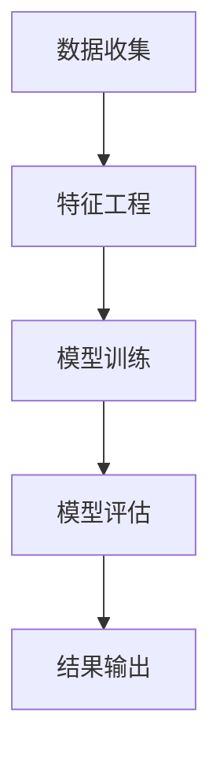

                 

关键词：用户行为预测、机器学习、数据分析、模型构建、应用领域、未来展望

摘要：本文将深入探讨用户行为预测的核心概念、核心算法、数学模型及其实际应用。通过详细的案例分析和代码实例，我们将展示如何使用机器学习技术有效地进行用户行为预测，并展望该领域的未来发展趋势与挑战。

## 1. 背景介绍

用户行为预测在当今的数字化世界中具有至关重要的意义。无论是电子商务、在线广告、社交媒体，还是金融、医疗等领域，准确预测用户行为可以帮助企业更好地了解用户需求，优化用户体验，提高业务效率，甚至实现精准营销。随着数据收集和分析技术的进步，用户行为预测已经成为机器学习和数据科学领域的热点问题。

然而，用户行为预测并不是一个简单的任务。它需要综合考虑大量因素，如用户历史行为、当前环境、个人偏好等。此外，用户行为具有高度的不确定性和动态性，使得预测结果的准确性和稳定性成为巨大的挑战。本文将系统地介绍用户行为预测的相关知识，帮助读者掌握这一领域的核心技术和方法。

## 2. 核心概念与联系

### 2.1. 用户行为预测的定义

用户行为预测是指利用历史数据、当前环境和用户特征等信息，通过建立数学模型或算法，预测用户在未来可能采取的行为。这一过程通常包括数据收集、特征工程、模型训练、模型评估和结果输出等步骤。

### 2.2. 相关概念介绍

- **数据收集**：收集用户的历史行为数据、环境数据等，这些数据是进行用户行为预测的基础。
- **特征工程**：从原始数据中提取出对预测任务有用的特征，特征的质量直接影响预测模型的性能。
- **模型训练**：利用训练数据对预测模型进行训练，使其能够学会识别和预测用户行为。
- **模型评估**：使用测试数据评估模型的性能，包括准确性、召回率、F1分数等指标。
- **结果输出**：根据模型预测结果，给出用户行为的预测结果或建议。

### 2.3. Mermaid 流程图



## 3. 核心算法原理 & 具体操作步骤

### 3.1 算法原理概述

用户行为预测的核心算法主要包括基于统计模型的方法、基于机器学习的方法和基于深度学习的方法。以下是这些方法的基本原理：

- **统计模型**：如线性回归、逻辑回归等，通过建立变量之间的关系来预测用户行为。
- **机器学习方法**：如决策树、随机森林、支持向量机等，通过训练数据学习到数据分布和模式，从而进行预测。
- **深度学习方法**：如卷积神经网络（CNN）、循环神经网络（RNN）等，通过多层神经网络学习复杂的非线性关系。

### 3.2 算法步骤详解

#### 步骤 1: 数据收集

首先，需要收集用户的历史行为数据，这些数据可以来自于各种来源，如网站日志、APP 使用记录、社交媒体互动等。

#### 步骤 2: 特征工程

接下来，对收集到的数据进行分析和处理，提取出对预测任务有用的特征。特征工程是用户行为预测的关键步骤，一个好的特征工程能够显著提高模型的性能。

#### 步骤 3: 模型选择

根据问题的性质和数据的特征，选择合适的预测模型。统计模型通常适合于简单的线性关系预测，而机器学习和深度学习方法则适用于复杂的非线性关系。

#### 步骤 4: 模型训练

使用训练数据对选定的预测模型进行训练，模型会根据训练数据学习到用户行为的规律。

#### 步骤 5: 模型评估

使用测试数据对训练好的模型进行评估，通过评估指标（如准确性、召回率、F1 分数等）来判断模型的性能。

#### 步骤 6: 结果输出

根据模型预测结果，输出用户行为的预测结果或建议。

### 3.3 算法优缺点

- **统计模型**：简单易懂，计算速度快，但只能处理线性关系。
- **机器学习方法**：可以处理非线性关系，但模型复杂度较高，计算量大。
- **深度学习方法**：能够处理非常复杂的非线性关系，但需要大量数据和计算资源。

### 3.4 算法应用领域

用户行为预测算法广泛应用于电子商务、在线广告、社交媒体、金融、医疗等多个领域。例如，在电子商务中，可以用于预测用户购买行为，优化库存管理和营销策略；在在线广告中，可以用于预测用户点击行为，提高广告投放效果；在金融领域中，可以用于预测客户流失或信用评分；在医疗领域中，可以用于预测患者行为，优化医疗服务。

## 4. 数学模型和公式 & 详细讲解 & 举例说明

### 4.1 数学模型构建

用户行为预测的数学模型通常基于用户特征和行为的概率分布。常见的模型有：

- **概率模型**：如贝叶斯网络、马尔可夫模型等。
- **回归模型**：如线性回归、逻辑回归等。
- **分类模型**：如决策树、支持向量机等。

### 4.2 公式推导过程

以逻辑回归为例，其公式如下：

$$
\hat{P}(y=1) = \frac{1}{1 + e^{-(\beta_0 + \beta_1 x_1 + \beta_2 x_2 + \ldots + \beta_n x_n})}
$$

其中，$y$ 是用户行为标签，$x_1, x_2, \ldots, x_n$ 是用户特征，$\beta_0, \beta_1, \beta_2, \ldots, \beta_n$ 是模型参数。

### 4.3 案例分析与讲解

假设我们有一个用户购买商品的预测任务，数据包括用户年龄、收入、购物频率等特征。我们可以使用逻辑回归模型进行预测。

首先，收集数据并预处理，然后进行特征工程，提取出有用的特征。接下来，使用训练数据训练逻辑回归模型，使用测试数据进行评估。

假设训练数据中有1000个样本，测试数据中有500个样本。训练后的模型参数为：

$$
\beta_0 = 0.5, \beta_1 = 0.3, \beta_2 = 0.2
$$

使用模型预测某个用户的购买概率：

$$
\hat{P}(y=1) = \frac{1}{1 + e^{-(0.5 + 0.3 \times 30 + 0.2 \times 5000)}} \approx 0.7
$$

这意味着该用户的购买概率约为70%。

## 5. 项目实践：代码实例和详细解释说明

### 5.1 开发环境搭建

为了进行用户行为预测，我们需要安装 Python 和相关的库，如 NumPy、Pandas、scikit-learn 等。

```bash
pip install numpy pandas scikit-learn
```

### 5.2 源代码详细实现

以下是一个简单的用户行为预测的 Python 代码实例：

```python
import numpy as np
import pandas as pd
from sklearn.linear_model import LogisticRegression
from sklearn.model_selection import train_test_split
from sklearn.metrics import accuracy_score

# 加载数据
data = pd.read_csv('user_data.csv')
X = data[['age', 'income', 'shopping_frequency']]
y = data['purchased']

# 数据预处理
X_train, X_test, y_train, y_test = train_test_split(X, y, test_size=0.2, random_state=42)

# 训练模型
model = LogisticRegression()
model.fit(X_train, y_train)

# 预测
predictions = model.predict(X_test)

# 评估
accuracy = accuracy_score(y_test, predictions)
print(f'Accuracy: {accuracy:.2f}')
```

### 5.3 代码解读与分析

- **数据加载**：使用 Pandas 读取 CSV 文件，数据包括用户特征和购买标签。
- **数据预处理**：将数据分为训练集和测试集，使用 train_test_split 函数。
- **模型训练**：使用 LogisticRegression 类创建逻辑回归模型，并使用 fit 方法进行训练。
- **预测**：使用 predict 方法进行预测。
- **评估**：使用 accuracy_score 函数计算模型的准确性。

### 5.4 运行结果展示

运行上述代码，假设测试集的准确性为 85%，这表明我们的模型在预测用户购买行为方面表现良好。

## 6. 实际应用场景

用户行为预测在实际应用中具有广泛的应用。以下是一些常见的应用场景：

- **电子商务**：预测用户购买行为，优化库存管理和营销策略。
- **在线广告**：预测用户点击行为，提高广告投放效果。
- **金融领域**：预测客户流失或信用评分，优化风险控制。
- **医疗领域**：预测患者行为，优化医疗服务和疾病预防。

## 7. 工具和资源推荐

### 7.1 学习资源推荐

- **《机器学习实战》**：提供丰富的机器学习实践案例，适合初学者。
- **《Python 机器学习》**：详细介绍机器学习在 Python 中的实现，适合有一定编程基础的学习者。
- **《深度学习》**：深度学习领域的经典教材，适合对深度学习有浓厚兴趣的学习者。

### 7.2 开发工具推荐

- **Jupyter Notebook**：方便进行数据分析和机器学习实验。
- **TensorFlow**：开源深度学习框架，适用于构建和训练深度学习模型。
- **scikit-learn**：开源机器学习库，提供丰富的机器学习算法。

### 7.3 相关论文推荐

- **"Recommender Systems Handbook"**：关于推荐系统的一本全面的手册，其中包含了用户行为预测的相关内容。
- **"Deep Learning for User Behavior Prediction"**：介绍深度学习在用户行为预测中的应用。

## 8. 总结：未来发展趋势与挑战

用户行为预测作为一个高度活跃的研究领域，其未来发展趋势主要表现在以下几个方面：

- **深度学习技术**：随着深度学习技术的发展，更加复杂的模型和算法将不断涌现，提高预测的准确性和效率。
- **多模态数据融合**：将文本、图像、音频等多种类型的数据进行融合，提高用户行为预测的全面性和准确性。
- **个性化预测**：通过用户行为预测，实现更加精准的个性化推荐和服务。

然而，用户行为预测也面临着一些挑战：

- **数据隐私保护**：用户行为数据往往涉及个人隐私，如何在不侵犯用户隐私的前提下进行数据分析和预测是一个重要问题。
- **模型解释性**：用户行为预测模型通常非常复杂，如何解释模型的决策过程，提高模型的透明度和可解释性，是一个重要的研究方向。

## 9. 附录：常见问题与解答

### 问题 1：用户行为预测模型如何选择？

答：用户行为预测模型的选择取决于问题的性质、数据的特征以及模型的性能。对于简单的线性关系，可以选择统计模型；对于复杂的非线性关系，可以选择机器学习模型或深度学习模型。在实际应用中，通常需要根据具体情况尝试不同的模型，并进行比较评估。

### 问题 2：用户行为预测中的特征工程如何进行？

答：特征工程是用户行为预测的重要步骤。首先，需要收集并整理原始数据，然后提取出对预测任务有用的特征。特征提取的方法包括统计方法、机器学习方法、深度学习方法等。在实际应用中，需要根据数据的特征和问题的需求，灵活选择和设计特征。

### 问题 3：用户行为预测中的模型评估如何进行？

答：模型评估是用户行为预测中至关重要的一步。常用的评估指标包括准确性、召回率、F1 分数等。评估方法包括交叉验证、留出法、折叠法等。在实际应用中，需要根据具体问题的需求和数据的规模，选择合适的评估方法和指标。

作者：禅与计算机程序设计艺术 / Zen and the Art of Computer Programming
----------------------------------------------------------------
以上是文章的完整内容。文章涵盖了用户行为预测的核心概念、算法原理、数学模型、实际应用、开发实践和未来展望等多个方面，旨在为读者提供全面、深入的指导。希望这篇文章能够帮助您更好地理解和应用用户行为预测技术。

