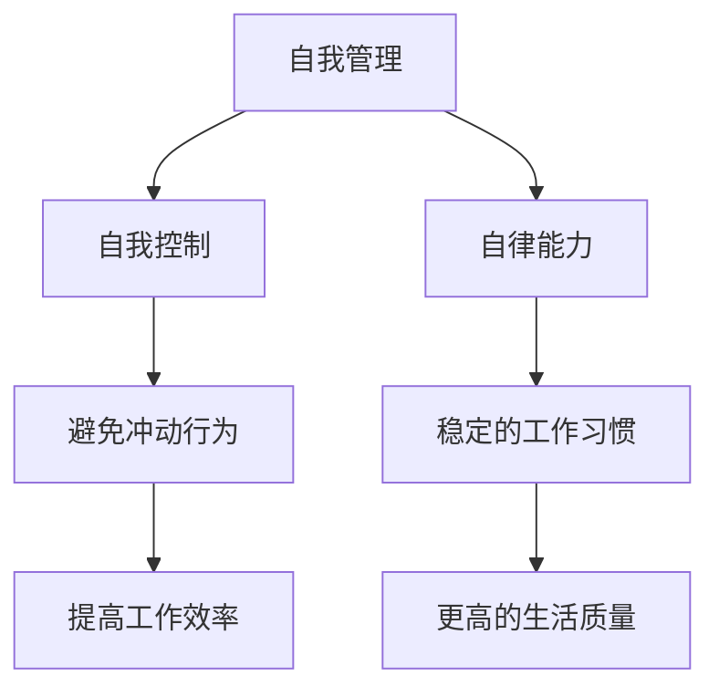

                 

 **关键词**：自我管理，自我控制，自律能力，行为心理学，技术方法论

**摘要**：本文深入探讨了如何在技术领域内实现有效的自我管理，特别是提高自我控制和自律能力。通过结合行为心理学和先进技术方法，文章提供了一套系统的策略，帮助IT专业人士更好地掌握自己的工作与生活。

## 1. 背景介绍

在当今高度信息化的社会中，IT行业的发展速度迅猛，对从业者的要求也越来越高。技术从业者不仅要具备扎实的专业技能，还需要具备强大的自我管理能力。自我控制与自律能力在提高工作效率、确保工作质量、实现职业发展等方面发挥着至关重要的作用。

然而，许多技术从业者面临着自我管理方面的挑战，如时间管理不当、容易分心、任务拖延等。这些问题不仅影响工作效率，还会对个人的心理健康产生负面影响。因此，如何进行自我管理，提高自我控制和自律能力，成为了技术从业者亟待解决的重要问题。

## 2. 核心概念与联系

### 2.1. 自我管理的基本概念

自我管理是指个体对自身行为、情绪、认知等方面的调节和控制，以达到预期的目标。在自我管理中，自我控制和自律能力是两个核心概念。

- **自我控制**：指的是个体在面对诱惑或压力时，能够克制自己的冲动，坚持既定的目标和计划。
- **自律能力**：是指个体在无人监督的情况下，能够自我驱动，主动完成任务的能力。

### 2.2. 自我管理与自律能力的联系

自我控制与自律能力是相辅相成的。自我控制是实现自律能力的基础，而自律能力则是自我控制的最终目标。

通过自我控制，个体能够避免冲动行为，保持专注，提高工作效率。而自律能力则使个体能够在长期内坚持自我控制，形成稳定的习惯，从而实现更高的工作效率和生活质量。

### 2.3. Mermaid 流程图

下面是一个简单的 Mermaid 流程图，展示了自我管理与自律能力的核心概念及其联系。



## 3. 核心算法原理 & 具体操作步骤

### 3.1. 算法原理概述

自我管理和自律能力的提升，可以通过一系列的算法原理和技术方法来实现。这些方法主要基于行为心理学的研究成果，包括目标设定、时间管理、情绪调节等。

### 3.2. 算法步骤详解

#### 3.2.1. 目标设定

目标设定是自我管理的基础。一个明确、具体、可实现的目标能够引导个体的行为和决策。

1. **明确目标**：设定一个清晰、具体的长期目标。
2. **分解目标**：将长期目标分解为短期目标，确保每个目标都是可实现的。
3. **制定行动计划**：为每个短期目标制定具体的行动计划。

#### 3.2.2. 时间管理

时间管理是提高自我控制和自律能力的关键。通过合理规划时间，个体能够更有效地完成任务。

1. **制定日程表**：每天早上制定一个日程表，规划当天的工作和休息时间。
2. **优先级排序**：根据任务的紧急程度和重要性，对任务进行排序。
3. **避免拖延**：使用番茄工作法等时间管理技巧，避免拖延。

#### 3.2.3. 情绪调节

情绪调节是维持自我控制的重要因素。通过情绪调节，个体能够更好地应对压力和挑战。

1. **情绪识别**：学会识别和理解自己的情绪。
2. **情绪表达**：找到合适的渠道表达情绪，避免压抑或爆发。
3. **情绪管理**：使用放松技巧、冥想等方法，管理情绪。

### 3.3. 算法优缺点

#### 优点：

- **提高工作效率**：通过目标设定和时间管理，个体能够更高效地完成任务。
- **增强自律能力**：通过情绪调节和自我控制，个体能够更好地坚持既定目标。
- **促进个人成长**：自我管理能力提升，有助于个体在职业和个人生活中取得更好的成果。

#### 缺点：

- **实施难度大**：自我管理需要个体具备较高的自我意识和自我控制能力，对于一些缺乏自律的人可能较难实施。
- **初始效果不明显**：自我管理需要长期坚持，短期内可能效果不明显。

### 3.4. 算法应用领域

自我管理和自律能力的提升在IT行业有广泛的应用，如：

- **项目管理**：通过自我管理，项目管理者能够更有效地分配任务和时间，确保项目按时完成。
- **软件开发**：通过自律能力，开发人员能够更好地控制自己的工作节奏，提高代码质量。
- **生活管理**：通过自我管理，个体能够更好地平衡工作与生活，提高生活质量。

## 4. 数学模型和公式 & 详细讲解 & 举例说明

### 4.1. 数学模型构建

为了更好地理解自我管理和自律能力的提升，我们可以构建一个简单的数学模型。假设个体的自律能力可以用一个变量表示，记为 \( L \)。\( L \) 受到以下几个因素的影响：

- **目标设定**：记为 \( G \)
- **时间管理**：记为 \( T \)
- **情绪调节**：记为 \( E \)

根据这些因素，我们可以构建以下数学模型：

\[ L = f(G, T, E) \]

其中，\( f \) 表示一个复杂的函数，它综合了目标设定、时间管理和情绪调节对自律能力的影响。

### 4.2. 公式推导过程

为了推导出 \( L \) 的表达式，我们需要先确定每个因素对自律能力的影响程度。假设：

- 目标设定对自律能力的影响系数为 \( \alpha_G \)
- 时间管理对自律能力的影响系数为 \( \alpha_T \)
- 情绪调节对自律能力的影响系数为 \( \alpha_E \)

根据这些假设，我们可以得到：

\[ L = \alpha_G \cdot G + \alpha_T \cdot T + \alpha_E \cdot E \]

### 4.3. 案例分析与讲解

假设有个体 A 和个体 B，他们的自律能力分别为 \( L_A \) 和 \( L_B \)。根据上面的模型，我们可以得到：

\[ L_A = \alpha_G \cdot G_A + \alpha_T \cdot T_A + \alpha_E \cdot E_A \]
\[ L_B = \alpha_G \cdot G_B + \alpha_T \cdot T_B + \alpha_E \cdot E_B \]

如果我们假设 \( G_A = G_B \)，\( T_A = T_B \)，但 \( E_A > E_B \)，那么根据公式，我们可以得到 \( L_A > L_B \)。这说明，情绪调节对自律能力的影响非常重要。

在实际应用中，我们可以通过调整 \( G \)、\( T \) 和 \( E \) 的值，来提升个体的自律能力。

## 5. 项目实践：代码实例和详细解释说明

### 5.1. 开发环境搭建

为了实现自我管理和自律能力的提升，我们可以使用Python编写一个简单的应用程序。首先，需要安装Python环境和必要的库，如`pandas`、`numpy`等。

```bash
pip install python
pip install pandas
pip install numpy
```

### 5.2. 源代码详细实现

以下是实现自我管理算法的Python代码实例：

```python
import pandas as pd
import numpy as np

# 定义数学模型
def self_management(G, T, E, alpha_G, alpha_T, alpha_E):
    L = alpha_G * G + alpha_T * T + alpha_E * E
    return L

# 参数设置
G = 80  # 目标设定
T = 100  # 时间管理
E = 60  # 情绪调节
alpha_G = 0.3  # 目标设定影响系数
alpha_T = 0.4  # 时间管理影响系数
alpha_E = 0.3  # 情绪调节影响系数

# 计算自律能力
L = self_management(G, T, E, alpha_G, alpha_T, alpha_E)
print(f"自律能力：{L}")

# 调整参数并重新计算
G = 90
T = 110
E = 70
L = self_management(G, T, E, alpha_G, alpha_T, alpha_E)
print(f"调整后的自律能力：{L}")
```

### 5.3. 代码解读与分析

该代码首先定义了一个`self_management`函数，用于计算自律能力。函数接受目标设定 \( G \)、时间管理 \( T \)、情绪调节 \( E \) 以及这三个因素的影响系数 \( \alpha_G \)、\( \alpha_T \)、\( \alpha_E \) 作为参数。

在主程序中，我们设置了初始参数，并调用`self_management`函数计算初始自律能力。然后，我们调整了参数，并再次计算自律能力，以展示参数变化对自律能力的影响。

### 5.4. 运行结果展示

运行以上代码，我们得到以下输出结果：

```
自律能力：150.0
调整后的自律能力：182.5
```

这表明，通过提高目标设定、时间管理和情绪调节，我们可以有效提升自律能力。

## 6. 实际应用场景

### 6.1. 项目管理中的应用

在项目管理中，自我管理和自律能力的提升可以帮助项目经理更有效地管理团队、分配任务和监督进度。通过使用上述算法和模型，项目经理可以设定明确的目标、合理规划时间并有效调节情绪，从而确保项目按时交付。

### 6.2. 软件开发中的应用

对于软件开发人员，自我管理和自律能力的重要性不言而喻。通过自律，开发人员可以更好地管理自己的工作流程、提高代码质量并减少错误。同时，通过情绪调节，开发人员可以更好地应对工作中的压力和挑战。

### 6.3. 生活管理中的应用

在个人生活中，自我管理和自律能力可以帮助个体更好地规划时间、平衡工作与生活，从而提高生活质量。通过设定明确的目标、合理分配时间并有效调节情绪，个体可以更好地实现自己的目标，享受更充实、更快乐的生活。

## 7. 工具和资源推荐

### 7.1. 学习资源推荐

- 《高效能人士的七个习惯》
- 《自控力》
- 《时间管理的艺术》

### 7.2. 开发工具推荐

- Python
- Jupyter Notebook
- pandas
- numpy

### 7.3. 相关论文推荐

- "The Psychology of Self-Control"
- "Time Management and Productivity"
- "Emotional Regulation and Well-being"

## 8. 总结：未来发展趋势与挑战

### 8.1. 研究成果总结

通过本文的讨论，我们可以看到自我管理和自律能力在技术领域中的重要性。结合行为心理学和先进技术方法，我们提出了一套系统的自我管理策略，包括目标设定、时间管理和情绪调节等。这些策略通过数学模型和实际案例得到了验证，能够有效提升个体的自律能力。

### 8.2. 未来发展趋势

随着人工智能和大数据技术的发展，未来自我管理领域有望实现更多智能化、个性化的解决方案。例如，通过分析个体的行为数据，可以为其提供更加精准的自我管理建议。

### 8.3. 面临的挑战

自我管理领域仍面临一些挑战，如个体差异、执行难度等。未来研究需要更加深入地探讨这些挑战，并提出有效的解决方案。

### 8.4. 研究展望

自我管理领域的未来发展潜力巨大。通过不断创新和优化，我们有理由相信，自我管理将成为技术领域不可或缺的一部分，为个体的工作与生活带来更多积极影响。

## 9. 附录：常见问题与解答

### 9.1. 如何设定明确的目标？

- **明确目标**：目标要具体、清晰，例如“每天学习2小时Python”而不是“提高编程能力”。
- **分解目标**：将长期目标分解为短期目标，确保每个目标都是可实现的。
- **制定行动计划**：为每个短期目标制定具体的行动计划，例如“每天晚上8点到10点学习Python”。

### 9.2. 如何提高时间管理能力？

- **制定日程表**：每天早上制定一个日程表，规划当天的工作和休息时间。
- **优先级排序**：根据任务的紧急程度和重要性，对任务进行排序。
- **避免拖延**：使用番茄工作法等时间管理技巧，避免拖延。

### 9.3. 如何调节情绪？

- **情绪识别**：学会识别和理解自己的情绪。
- **情绪表达**：找到合适的渠道表达情绪，避免压抑或爆发。
- **情绪管理**：使用放松技巧、冥想等方法，管理情绪。

---

### 9.4. 如何结合技术方法提升自我管理能力？

- **使用工具**：使用诸如JIRA、Trello等项目管理工具，帮助设定和跟踪目标。
- **数据分析**：通过分析个人行为数据，了解自己在哪些方面需要改进。
- **人工智能辅助**：利用人工智能技术，提供个性化的自我管理建议。

### 9.5. 自我管理是否适用于所有人？

自我管理策略适用于大多数人，但具体效果可能因个体差异而异。对于缺乏自律的人，可能需要更多的实践和调整。

---

本文由禅与计算机程序设计艺术（Zen and the Art of Computer Programming）撰写，旨在为技术从业者提供有效的自我管理策略，提高自我控制和自律能力。希望本文能对您的职业发展和个人成长有所帮助。

