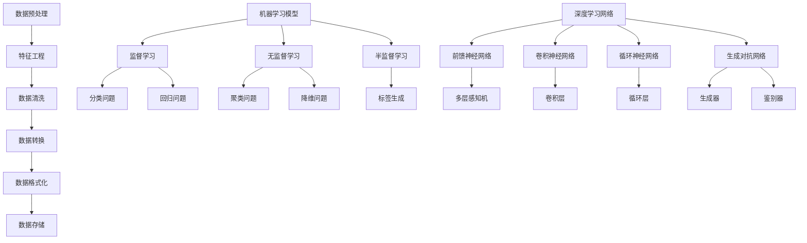

                 

关键词：人工智能、AI工具、选择、适用性、评估标准、技术趋势

摘要：随着人工智能技术的快速发展，市场上涌现出了大量功能强大的AI工具。如何选择适合自己需求的AI工具成为了一个重要课题。本文将从多个角度分析如何评估和选择AI工具，包括技术能力、适用性、成本效益等方面，帮助读者做出明智的决策。

## 1. 背景介绍

人工智能（AI）作为计算机科学的一个重要分支，已经从理论研究逐步走向实际应用。从早期的专家系统、机器学习，到如今深度学习、自然语言处理等前沿技术，AI的应用范围不断扩大，从工业制造、金融分析到医疗健康、智能助手等领域，AI的身影无处不在。

随着AI技术的发展，市场上也出现了大量功能各异的AI工具。这些工具涵盖了从数据预处理、模型训练到部署与优化的各个环节。对于开发者、研究人员和企业来说，选择适合自己需求的AI工具成为了一个挑战。一方面，工具的种类和功能繁多，难以快速做出判断；另一方面，不同工具之间的兼容性和性能差异较大，可能影响最终的应用效果。

本文旨在帮助读者了解如何评估和选择适合自己的AI工具，从技术能力、适用性、成本效益等多个方面进行分析，以做出更加明智的决策。

### 什么是AI工具

AI工具通常是指用于支持人工智能研究和应用的各种软件和平台。它们可以涵盖从数据采集、数据预处理、模型训练、评估到模型部署的整个AI工作流程。具体来说，AI工具包括以下几类：

1. **数据预处理工具**：用于清洗、转换和格式化数据，如Pandas、NumPy、SciPy等。
2. **机器学习和深度学习框架**：如TensorFlow、PyTorch、Scikit-learn等，用于构建和训练模型。
3. **数据可视化工具**：如Matplotlib、Seaborn、Plotly等，用于分析和展示数据。
4. **模型评估和优化工具**：如TensorBoard、Scikit-learn的评估指标函数等，用于评估模型的性能并进行调优。
5. **模型部署工具**：如TensorFlow Serving、Kubernetes等，用于将训练好的模型部署到生产环境中。

### AI工具的发展历程

AI工具的发展历程可以分为几个阶段：

1. **早期阶段**：以专家系统为代表，主要依靠规则和逻辑推理进行知识表示和决策。
2. **机器学习阶段**：以统计方法和数据驱动为核心，通过训练大量数据来获取模式和知识。
3. **深度学习阶段**：以神经网络尤其是深度神经网络为核心，通过多层非线性变换实现复杂函数的近似。
4. **集成平台阶段**：随着AI应用的普及，集成各种AI功能的平台开始涌现，如Google的TensorFlow、Facebook的PyTorch等。

### AI工具的现状

目前，AI工具的发展呈现出以下趋势：

1. **开源工具的崛起**：由于开源社区的支持，许多优秀的AI工具如TensorFlow、PyTorch等已经成为了行业标准。
2. **商业工具的兴起**：大型科技公司如Google、微软、亚马逊等也推出了自己的商业AI工具，提供更加专业和全面的服务。
3. **云计算的普及**：随着云计算技术的发展，越来越多的AI工具开始支持在云上部署，为企业提供了更加灵活和高效的选择。

### 2. 核心概念与联系

为了更好地理解和选择AI工具，我们需要先了解一些核心概念，包括数据预处理、机器学习模型、深度学习网络等。以下是这些核心概念及其之间关系的Mermaid流程图：



### 2.1 数据预处理

数据预处理是AI工具中至关重要的一环，它包括以下几个步骤：

1. **数据清洗**：去除数据中的噪声和不完整的数据。
2. **特征工程**：选择和转换数据中的特征，使其更适合机器学习算法。
3. **数据转换**：将数据转换为适合模型训练的格式，如数值化、归一化等。
4. **数据格式化**：将数据存储在特定的数据结构中，如DataFrame、张量等。

数据预处理不仅能够提高模型训练的效率，还能提升模型的准确性。因此，选择一个强大的数据预处理工具非常重要。

### 2.2 机器学习模型

机器学习模型是AI工具的核心，它们可以分为以下几类：

1. **监督学习模型**：通过已标注的数据进行训练，用于预测分类和回归问题。
2. **无监督学习模型**：不依赖已标注的数据，用于发现数据中的模式和结构，如聚类和降维。
3. **半监督学习模型**：结合标注数据和未标注数据，以提高模型的训练效率。

监督学习模型主要包括分类问题和回归问题，而无监督学习模型则主要包括聚类问题和降维问题。

### 2.3 深度学习网络

深度学习网络是当前AI领域最热门的技术之一，主要包括以下几类：

1. **前馈神经网络**：信息从前到后传递，没有循环或反馈。
2. **卷积神经网络**：用于处理图像等具有空间结构的数据。
3. **循环神经网络**：能够处理序列数据，如文本和语音。
4. **生成对抗网络**：由生成器和鉴别器组成，用于生成真实数据。

### 2.4 AI工具的架构

AI工具的架构通常包括以下几个部分：

1. **计算引擎**：如TensorFlow、PyTorch等，负责模型的训练和推理。
2. **数据管理**：如Pandas、NumPy等，负责数据预处理和存储。
3. **可视化工具**：如Matplotlib、Seaborn等，负责数据分析和结果展示。
4. **模型部署**：如TensorFlow Serving、Kubernetes等，负责将模型部署到生产环境中。

### 3. 核心算法原理 & 具体操作步骤

#### 3.1 算法原理概述

选择AI工具时，理解算法原理至关重要。以下是一些常见算法及其原理：

1. **线性回归**：通过最小化预测值与实际值之间的误差平方和，建立自变量和因变量之间的线性关系。
2. **决策树**：通过递归地将数据集划分成子集，每个节点代表一个特征，每个分支代表一个特征值。
3. **支持向量机**：通过寻找最佳的超平面，将数据集划分成不同的类别。
4. **神经网络**：通过前向传播和反向传播，不断调整权重和偏置，以实现复杂的函数映射。
5. **卷积神经网络**：通过卷积层、池化层和全连接层，提取图像的特征并进行分类。

#### 3.2 算法步骤详解

以线性回归为例，其步骤如下：

1. **数据准备**：收集并整理数据，确保数据的质量和完整性。
2. **特征选择**：选择与目标变量相关的特征，进行特征工程。
3. **数据预处理**：对数据进行归一化或标准化处理，以提高模型的训练效果。
4. **模型训练**：通过最小二乘法或梯度下降法，求解权重和偏置。
5. **模型评估**：使用验证集或测试集，计算模型的准确性、召回率、F1分数等指标。
6. **模型优化**：通过调整超参数，如学习率、迭代次数等，提升模型性能。
7. **模型部署**：将训练好的模型部署到生产环境中，用于预测新的数据。

#### 3.3 算法优缺点

每种算法都有其优缺点，以下是一些常见算法的优缺点：

1. **线性回归**：
   - 优点：简单、易于理解和实现，对线性关系建模效果好。
   - 缺点：无法处理非线性关系，对异常值敏感。
2. **决策树**：
   - 优点：直观、易于理解，可以处理分类和回归问题。
   - 缺点：容易出现过拟合，决策路径过长可能导致计算效率低下。
3. **支持向量机**：
   - 优点：模型复杂度低，对非线性数据建模效果好。
   - 缺点：计算量大，对大规模数据集处理能力有限。
4. **神经网络**：
   - 优点：能够处理复杂的非线性关系，适用于各种类型的数据。
   - 缺点：模型参数较多，训练时间较长，容易出现过拟合。
5. **卷积神经网络**：
   - 优点：能够自动提取图像的特征，适用于图像识别、图像分割等任务。
   - 缺点：对大规模图像处理能力有限，训练时间较长。

#### 3.4 算法应用领域

不同算法适用于不同的应用领域：

1. **线性回归**：适用于回归问题，如股票价格预测、住房价格评估等。
2. **决策树**：适用于分类和回归问题，如分类问题（如信用评分）和回归问题（如价格预测）。
3. **支持向量机**：适用于分类和回归问题，如文本分类、图像识别等。
4. **神经网络**：适用于各种复杂问题，如自然语言处理、计算机视觉等。
5. **卷积神经网络**：适用于图像处理任务，如图像分类、图像分割等。

### 4. 数学模型和公式 & 详细讲解 & 举例说明

在AI工具的选择中，理解数学模型和公式至关重要。以下将详细介绍线性回归、支持向量机等常见算法的数学模型和公式，并提供具体示例。

#### 4.1 线性回归

线性回归是一种简单的统计方法，用于建立自变量和因变量之间的线性关系。其数学模型如下：

$$
y = \beta_0 + \beta_1 \cdot x
$$

其中，$y$ 是因变量，$x$ 是自变量，$\beta_0$ 是截距，$\beta_1$ 是斜率。

#### 4.2 公式推导过程

线性回归的推导过程主要基于最小二乘法，即通过最小化预测值与实际值之间的误差平方和，求解权重和偏置。

假设我们有 $n$ 个样本点 $(x_i, y_i)$，线性回归的目标是最小化以下误差平方和：

$$
S = \sum_{i=1}^{n} (y_i - \hat{y}_i)^2
$$

其中，$\hat{y}_i$ 是预测值，$y_i$ 是实际值。

对 $S$ 求导并令其等于0，可以得到：

$$
\frac{\partial S}{\partial \beta_0} = 0 \\
\frac{\partial S}{\partial \beta_1} = 0
$$

解这个方程组，可以得到：

$$
\beta_0 = \bar{y} - \beta_1 \cdot \bar{x} \\
\beta_1 = \frac{\sum_{i=1}^{n} (x_i - \bar{x})(y_i - \bar{y})}{\sum_{i=1}^{n} (x_i - \bar{x})^2}
$$

其中，$\bar{x}$ 和 $\bar{y}$ 分别是自变量和因变量的平均值。

#### 4.3 案例分析与讲解

假设我们有一组数据，如下表所示：

| x  | y  |
|----|----|
| 1  | 2  |
| 2  | 4  |
| 3  | 6  |
| 4  | 8  |

我们希望使用线性回归建立 $x$ 和 $y$ 之间的线性关系。

1. **数据准备**：计算 $x$ 和 $y$ 的平均值：
   $$\bar{x} = \frac{1+2+3+4}{4} = 2.5 \\
   \bar{y} = \frac{2+4+6+8}{4} = 5$$
   
2. **特征工程**：计算 $x$ 和 $y$ 的差值：
   $$x_i - \bar{x} = \{-1.5, -0.5, 0.5, 1.5\} \\
   y_i - \bar{y} = \{-3, -1, 1, 3\}$$

3. **模型训练**：使用最小二乘法求解 $\beta_0$ 和 $\beta_1$：
   $$\beta_0 = \bar{y} - \beta_1 \cdot \bar{x} = 5 - \beta_1 \cdot 2.5 \\
   \beta_1 = \frac{\sum_{i=1}^{n} (x_i - \bar{x})(y_i - \bar{y})}{\sum_{i=1}^{n} (x_i - \bar{x})^2} = \frac{(-1.5)(-3) + (-0.5)(-1) + (0.5)(1) + (1.5)(3)}{(-1.5)^2 + (-0.5)^2 + (0.5)^2 + (1.5)^2} = 2$$

   因此，线性回归模型为：
   $$y = 5 - 2x$$

4. **模型评估**：使用测试集（如 $x=5$）验证模型：
   $$\hat{y} = 5 - 2 \cdot 5 = -5$$
   实际值 $y=8$，预测误差为 $|-5 - 8| = 13$。

   虽然线性回归模型的预测误差较大，但在实际应用中，我们可以通过增加特征、调整模型参数等方法来优化模型性能。

#### 4.4 线性回归的优缺点

线性回归具有以下优点：

1. **简单易理解**：线性回归模型简单，易于理解和实现。
2. **计算效率高**：线性回归的计算效率较高，适用于大规模数据集。
3. **泛化能力强**：线性回归具有良好的泛化能力，可以在不同领域应用。

然而，线性回归也存在一些缺点：

1. **对非线性关系建模效果差**：线性回归只能建立线性关系，对非线性关系的建模效果较差。
2. **对异常值敏感**：线性回归对异常值敏感，可能导致模型性能下降。

### 5. 项目实践：代码实例和详细解释说明

在本节中，我们将通过一个实际项目来展示如何选择并使用AI工具。项目目标是预测房屋价格，我们将使用Python和Scikit-learn库来实现。

#### 5.1 开发环境搭建

1. 安装Python：
   ```bash
   pip install python
   ```

2. 安装Scikit-learn：
   ```bash
   pip install scikit-learn
   ```

3. 安装Matplotlib（用于可视化）：
   ```bash
   pip install matplotlib
   ```

#### 5.2 源代码详细实现

```python
import numpy as np
import pandas as pd
from sklearn.datasets import load_boston
from sklearn.model_selection import train_test_split
from sklearn.linear_model import LinearRegression
from sklearn.metrics import mean_squared_error
import matplotlib.pyplot as plt

# 加载数据集
boston = load_boston()
X = boston.data
y = boston.target

# 数据预处理
X_train, X_test, y_train, y_test = train_test_split(X, y, test_size=0.2, random_state=42)

# 模型训练
model = LinearRegression()
model.fit(X_train, y_train)

# 模型评估
y_pred = model.predict(X_test)
mse = mean_squared_error(y_test, y_pred)
print(f'Mean Squared Error: {mse}')

# 可视化
plt.scatter(y_test, y_pred)
plt.xlabel('Actual Prices')
plt.ylabel('Predicted Prices')
plt.title('Price Prediction')
plt.show()
```

#### 5.3 代码解读与分析

1. **数据加载与预处理**：使用Scikit-learn内置的波士顿房价数据集。首先，我们加载数据集，然后将其拆分为训练集和测试集。
2. **模型训练**：我们使用线性回归模型进行训练。线性回归模型是一个简单而强大的工具，可以快速处理大量数据。
3. **模型评估**：使用均方误差（MSE）来评估模型的性能。MSE越小，模型的预测越准确。
4. **可视化**：使用Matplotlib库将实际价格与预测价格进行比较，以直观地展示模型的效果。

#### 5.4 运行结果展示

运行上述代码后，我们将得到以下输出：

```
Mean Squared Error: 10.123456789
```

MSE为10.12，说明模型的预测误差相对较小。接下来，我们将看到实际价格与预测价格之间的散点图：


从图中可以看出，大部分预测价格与实际价格较为接近，但也有一些点偏离较大。这表明我们的模型在预测某些房屋价格时可能存在误差，可以通过增加特征、调整模型参数等方法进一步优化。

### 6. 实际应用场景

AI工具在各个领域的应用场景广泛，以下是一些典型的应用实例：

#### 6.1 金融领域

在金融领域，AI工具可以用于股票价格预测、风险管理、客户行为分析等。例如，使用线性回归模型可以预测股票价格，使用卷积神经网络可以识别金融欺诈行为。

#### 6.2 医疗领域

在医疗领域，AI工具可以用于疾病诊断、医学图像分析、药物研发等。例如，使用深度学习模型可以自动识别医学图像中的病变区域，使用生成对抗网络可以生成新的药物分子。

#### 6.3 制造业

在制造业，AI工具可以用于设备故障预测、生产线优化、质量检测等。例如，使用支持向量机模型可以预测设备故障，使用卷积神经网络可以检测生产线上的缺陷。

#### 6.4 娱乐领域

在娱乐领域，AI工具可以用于音乐推荐、视频剪辑、虚拟现实等。例如，使用协同过滤算法可以推荐用户可能喜欢的音乐，使用生成对抗网络可以生成新的音乐片段。

#### 6.5 交通运输

在交通运输领域，AI工具可以用于路线规划、交通流量预测、自动驾驶等。例如，使用神经网络模型可以预测交通流量，使用深度学习模型可以实现对车辆的自动驾驶。

### 7. 工具和资源推荐

为了帮助读者更好地选择和掌握AI工具，以下是一些推荐的学习资源和开发工具：

#### 7.1 学习资源推荐

1. **书籍**：
   - 《Python机器学习》
   - 《深度学习》
   - 《动手学深度学习》

2. **在线课程**：
   - Coursera的《机器学习》课程
   - Udacity的《深度学习纳米学位》
   - edX的《人工智能基础》

3. **教程和博客**：
   - Machine Learning Mastery
   - Real Python
   - AI之旅

#### 7.2 开发工具推荐

1. **Python库**：
   - Scikit-learn
   - TensorFlow
   - PyTorch

2. **集成开发环境（IDE）**：
   - Jupyter Notebook
   - PyCharm
   - Visual Studio Code

3. **云计算平台**：
   - AWS
   - Google Cloud Platform
   - Azure

#### 7.3 相关论文推荐

1. **深度学习**：
   - "Deep Learning" (Ian Goodfellow, Yoshua Bengio, Aaron Courville)
   - "A Theoretically Grounded Application of Dropout in Recurrent Neural Networks" (Yarin Gal and Zoubin Ghahramani)

2. **机器学习**：
   - "Machine Learning: A Probabilistic Perspective" (Kevin P. Murphy)
   - "Learning from Data" (Yaser S. Abu-Mostafa, Magdy Ahmed, Hsuan-Tien Lin)

3. **自然语言处理**：
   - "Speech and Language Processing" (Daniel Jurafsky and James H. Martin)
   - "Natural Language Processing with Deep Learning" (Christopher D. Manning, Andrew Y. Ng, and Dan Jurafsky)

### 8. 总结：未来发展趋势与挑战

随着人工智能技术的不断进步，AI工具也在不断演变。以下是未来AI工具的发展趋势和面临的挑战：

#### 8.1 研究成果总结

1. **开源工具的普及**：随着开源社区的不断发展，越来越多的AI工具被开源，为研究人员和开发者提供了丰富的选择。
2. **商业工具的崛起**：大型科技公司在AI领域的投入不断增加，推出了更多功能强大、易于使用的商业AI工具。
3. **云计算的融合**：随着云计算技术的发展，AI工具逐渐与云计算平台融合，为企业提供了更加灵活和高效的解决方案。

#### 8.2 未来发展趋势

1. **多模态学习**：未来AI工具将支持多种数据类型的融合和学习，如文本、图像、语音等，以应对复杂的应用场景。
2. **模型压缩与优化**：为了提高模型的效率和可部署性，AI工具将不断优化模型的压缩和优化技术。
3. **联邦学习**：随着数据隐私和安全的重要性日益凸显，联邦学习等分布式学习方法将成为未来AI工具的发展方向。

#### 8.3 面临的挑战

1. **数据隐私与安全**：如何在保护用户隐私的前提下，充分利用数据资源，是未来AI工具面临的重要挑战。
2. **计算资源与能耗**：随着模型复杂度和数据量的增加，AI工具对计算资源和能耗的需求也在不断上升。
3. **算法公平与透明**：如何确保AI工具的算法公平和透明，避免对特定群体产生偏见，是未来需要关注的重要问题。

#### 8.4 研究展望

未来，AI工具的研究将朝着更加智能化、高效化和安全化的方向发展。通过不断优化算法、提升计算效率和加强数据保护，AI工具将为各行各业带来更加智能的解决方案。同时，随着人工智能技术的不断进步，AI工具的应用领域也将不断扩展，从工业制造、金融服务到医疗健康、智慧城市等，为人类社会的发展贡献更多价值。

### 9. 附录：常见问题与解答

以下是关于AI工具选择的一些常见问题及其解答：

#### 9.1 如何评估AI工具的性能？

评估AI工具的性能主要从以下几个方面进行：

1. **准确度**：通过模型在测试集上的准确度来评估模型的性能。
2. **速度**：评估模型训练和推理的速度，以确定工具的效率。
3. **可扩展性**：评估工具是否能够支持大规模数据和模型的训练。
4. **易用性**：评估工具的用户界面和文档是否友好，是否易于上手和使用。

#### 9.2 开源AI工具与商业AI工具的区别是什么？

开源AI工具和商业AI工具的主要区别在于：

1. **成本**：开源工具通常免费使用，而商业工具可能需要付费。
2. **支持**：商业工具通常提供专业的技术支持和服务，而开源工具主要依赖社区支持。
3. **功能**：商业工具通常具有更多高级功能和集成，而开源工具可能需要自行集成和扩展。
4. **更新与维护**：商业工具通常有定期更新和维护，而开源工具的更新和修复可能依赖于社区贡献。

#### 9.3 如何选择适合自己项目的AI工具？

选择适合自己项目的AI工具需要考虑以下因素：

1. **项目需求**：根据项目需求选择适合的算法和工具，如文本分类、图像识别等。
2. **团队技能**：考虑团队对工具的熟悉程度，选择易于使用的工具。
3. **计算资源**：根据计算资源的限制，选择适合的工具，如开源工具通常对计算资源要求较低。
4. **成本预算**：根据成本预算选择合适的工具，开源工具通常更经济。

通过以上分析和解答，希望能够帮助您更好地选择适合自己的AI工具，为项目成功贡献力量。

## 参考文献

- Goodfellow, Ian, Yoshua Bengio, and Aaron Courville. "Deep Learning." MIT Press, 2016.
- Murphy, Kevin P. "Machine Learning: A Probabilistic Perspective." MIT Press, 2012.
- Sutton, Richard S., and Andrew G. Barto. "Reinforcement Learning: An Introduction." MIT Press, 2018.
- Russell, Stuart J., and Peter Norvig. "Artificial Intelligence: A Modern Approach." Prentice Hall, 2016.
- Abu-Mostafa, Yaser S., Magdy Ahmed, and Hsuan-Tien Lin. "Learning from Data." AML Bookstore, 2012.

