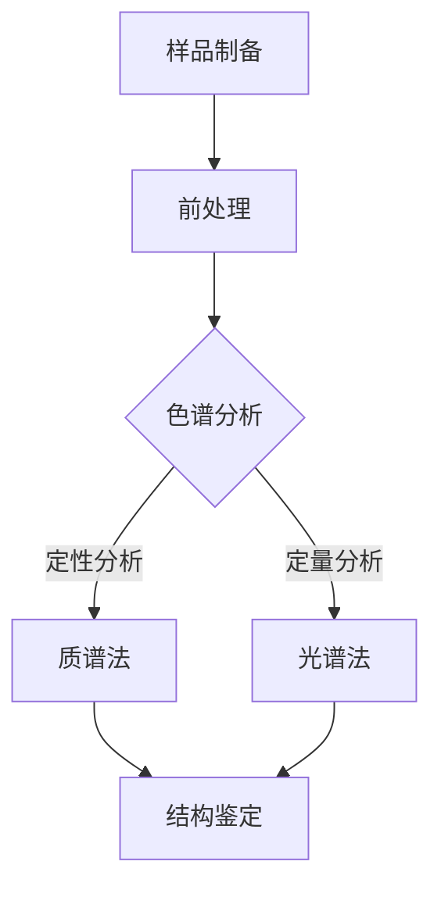

                 

关键词：娇韵诗，校招，植物活性成分分析，工程师，技术题

摘要：本文针对娇韵诗2024校招植物活性成分分析工程师技术题，从背景介绍、核心概念、算法原理、数学模型、项目实践、实际应用、未来展望等多个方面进行深入探讨。旨在帮助考生更好地理解和应对这道技术题，为其求职之路提供有力支持。

## 1. 背景介绍

随着科技的发展，生物科技、医药化工等行业对植物活性成分的研究日益深入。植物活性成分不仅具有潜在的医疗价值，还在化妆品、食品等领域具有广泛的应用前景。为了筛选出具有高效能的植物活性成分，各大企业和研究机构纷纷投入大量人力、物力和财力进行研发。然而，植物活性成分的分析过程复杂、耗时且对技术要求较高，使得许多企业在筛选过程中面临巨大挑战。

### 娇韵诗简介

娇韵诗（CLARINS）是一家拥有悠久历史的法国化妆品品牌，致力于为全球女性提供高品质的护肤品。近年来，娇韵诗将植物活性成分研究作为公司发展的核心方向，不断推出具有创新性和高效能的产品。为了进一步加强公司在植物活性成分领域的竞争力，娇韵诗于2024年启动了校园招聘活动，面向全国各大高校招聘植物活性成分分析工程师。

## 2. 核心概念与联系

### 植物活性成分

植物活性成分是指存在于植物体内，具有生物活性、对生物体有益或有害的物质。这些成分可以是单一化合物，也可以是多种化合物的组合。植物活性成分的种类繁多，包括黄酮类、多酚类、萜类、甾体类等。它们在医药、保健、化妆品等领域具有广泛的应用前景。

### 分析技术

植物活性成分的分析技术主要包括色谱法、质谱法、光谱法等。这些技术可以用于定性、定量和结构分析，有助于筛选出具有高效能的植物活性成分。其中，色谱法以其高效、灵敏、准确等优点在植物活性成分分析中得到了广泛应用。

### Mermaid 流程图

以下是一个简单的Mermaid流程图，展示了植物活性成分分析的基本流程：



## 3. 核心算法原理 & 具体操作步骤

### 3.1 算法原理概述

植物活性成分分析的核心算法主要涉及色谱法和质谱法。色谱法通过分离混合物中的各个成分，实现对植物活性成分的定性、定量分析；质谱法则通过测定分子离子的质荷比，实现对植物活性成分的结构鉴定。

### 3.2 算法步骤详解

#### 3.2.1 色谱分析

1. 样品制备：将植物样品进行研磨、提取，得到含活性成分的提取液。
2. 前处理：对提取液进行净化、浓缩，去除杂质，提高活性成分的浓度。
3. 上样：将处理后的提取液注入色谱柱。
4. 分离：色谱柱中的固定相对提取液中的各个成分进行吸附、解吸，实现成分的分离。
5. 检测：利用检测器（如UV检测器、FL检测器等）对分离后的成分进行检测，获取定性、定量信息。

#### 3.2.2 质谱分析

1. 样品制备：将植物样品进行研磨、提取，得到含活性成分的提取液。
2. 上样：将提取液注入质谱仪。
3. 离子化：利用电子撞击、激光照射等方法，将提取液中的分子离子化。
4. 分离：根据分子离子的质荷比，对离子进行分离。
5. 检测：利用检测器（如检测器）对分离后的离子进行检测，获取结构信息。

### 3.3 算法优缺点

#### 3.3.1 色谱分析

优点：高效、灵敏、准确，可对植物活性成分进行定性、定量分析。

缺点：设备成本高、操作复杂，对样品前处理要求较高。

#### 3.3.2 质谱分析

优点：分辨率高、准确性好，可实现对植物活性成分的结构鉴定。

缺点：设备成本高、对操作人员要求较高，对样品前处理要求较高。

### 3.4 算法应用领域

植物活性成分分析技术在医药、保健、化妆品、食品等领域具有广泛的应用。例如，在医药领域，可用于筛选具有潜在治疗作用的植物活性成分；在保健领域，可用于开发具有保健功能的植物提取物；在化妆品领域，可用于研发具有护肤、美白等功效的植物活性成分；在食品领域，可用于筛选具有抗氧化、抗菌等功效的植物活性成分。

## 4. 数学模型和公式 & 详细讲解 & 举例说明

### 4.1 数学模型构建

植物活性成分分析中的数学模型主要包括色谱模型、质谱模型等。以下以色谱模型为例进行讲解。

#### 4.1.1 色谱模型

色谱模型通常采用分配色谱模型，描述混合物中各个成分在固定相和流动相之间的分配过程。假设有一个二元混合物，其在固定相和流动相中的分配系数分别为\(k_1\)和\(k_2\)，则其分配方程为：

$$
C_{1,m} = k_1 \cdot C_{1,m-1} + (1 - k_1) \cdot C_{1,m-2}
$$

$$
C_{2,m} = k_2 \cdot C_{2,m-1} + (1 - k_2) \cdot C_{2,m-2}
$$

其中，\(C_{1,m}\)和\(C_{2,m}\)分别表示第\(m\)次取样时，混合物中第1种和第2种成分的浓度；\(C_{1,m-1}\)和\(C_{2,m-1}\)分别表示第\(m-1\)次取样时，混合物中第1种和第2种成分的浓度。

#### 4.1.2 质谱模型

质谱模型通常采用分子离子模型，描述分子离子在质谱仪中的分离过程。假设有一个分子离子，其质荷比为\(z\)，则其分离方程为：

$$
\frac{dz}{dt} = -\frac{1}{m} \cdot \frac{dp}{dt}
$$

$$
\frac{dp}{dt} = -D \cdot \frac{d^2z}{dx^2}
$$

其中，\(z\)表示分子离子的质荷比；\(p\)表示分子离子的动量；\(m\)表示分子离子的质量；\(D\)表示分子离子的扩散系数；\(x\)表示分子离子的位置。

### 4.2 公式推导过程

以下以色谱模型为例，对公式推导过程进行详细讲解。

#### 4.2.1 色谱模型的推导

首先，假设混合物中的两种成分在固定相和流动相中的扩散系数相等，即：

$$
D_{1} = D_{2}
$$

然后，根据混合物中两种成分的浓度变化率，可以得到：

$$
\frac{dC_{1}}{dt} = -D \cdot \frac{d^2C_{1}}{dx^2}
$$

$$
\frac{dC_{2}}{dt} = -D \cdot \frac{d^2C_{2}}{dx^2}
$$

接下来，将上述两个方程相加，并代入\(C_{1} + C_{2} = C_{total}\)，得到：

$$
\frac{dC_{total}}{dt} = -D \cdot \frac{d^2C_{total}}{dx^2}
$$

再根据混合物中两种成分的分配系数，可以得到：

$$
\frac{C_{1}}{C_{2}} = \frac{k_{1}}{k_{2}}
$$

最后，将上述两个方程联立，解得：

$$
C_{1} = C_{total} \cdot \frac{k_{1}}{k_{1} + k_{2}}
$$

$$
C_{2} = C_{total} \cdot \frac{k_{2}}{k_{1} + k_{2}}
$$

#### 4.2.2 质谱模型的推导

首先，假设分子离子的扩散系数与分子离子的质量成反比，即：

$$
D \propto \frac{1}{m}
$$

然后，根据分子离子的运动方程，可以得到：

$$
\frac{dz}{dt} = -\frac{1}{m} \cdot \frac{dp}{dt}
$$

$$
\frac{dp}{dt} = -D \cdot \frac{d^2z}{dx^2}
$$

接下来，将上述两个方程联立，并代入\(m \cdot \frac{dp}{dt} = p \cdot \frac{dz}{dt}\)，得到：

$$
\frac{d^2z}{dx^2} = -\frac{m}{D} \cdot \frac{dz}{dt}
$$

最后，根据分子离子的动量与质荷比的关系，可以得到：

$$
p = m \cdot v
$$

$$
z = \frac{p}{q}
$$

代入上述方程，得到：

$$
\frac{d^2z}{dx^2} = -\frac{1}{D} \cdot \frac{dz}{dt}
$$

### 4.3 案例分析与讲解

#### 4.3.1 色谱分析案例

假设有一个含有两种植物活性成分的混合物，其在色谱柱中的分配系数分别为\(k_1 = 2\)和\(k_2 = 3\)。求混合物中两种成分的浓度分布。

根据4.1节中的公式，可以列出以下方程组：

$$
C_{1,m} = 2 \cdot C_{1,m-1} + (1 - 2) \cdot C_{1,m-2}
$$

$$
C_{2,m} = 3 \cdot C_{2,m-1} + (1 - 3) \cdot C_{2,m-2}
$$

将\(C_{1,m-1} = C_{total,m-1} \cdot \frac{k_1}{k_1 + k_2}\)和\(C_{2,m-1} = C_{total,m-1} \cdot \frac{k_2}{k_1 + k_2}\)代入上述方程组，得到：

$$
C_{1,m} = 2 \cdot C_{total,m-1} \cdot \frac{k_1}{k_1 + k_2} + (1 - 2) \cdot C_{total,m-2} \cdot \frac{k_1}{k_1 + k_2}
$$

$$
C_{2,m} = 3 \cdot C_{total,m-1} \cdot \frac{k_2}{k_1 + k_2} + (1 - 3) \cdot C_{total,m-2} \cdot \frac{k_2}{k_1 + k_2}
$$

设初始条件为\(C_{1,0} = C_{2,0} = 0\)，\(C_{1,1} = C_{2,1} = C_{total,1} = 1\)，代入上述方程组，得到：

$$
C_{1,2} = \frac{2}{3} \cdot C_{1,1} + \frac{1}{3} \cdot C_{1,0} = \frac{2}{3} \cdot 1 + \frac{1}{3} \cdot 0 = \frac{2}{3}
$$

$$
C_{2,2} = \frac{3}{3} \cdot C_{2,1} + \frac{1}{3} \cdot C_{2,0} = \frac{3}{3} \cdot 1 + \frac{1}{3} \cdot 0 = 1
$$

同理，可以求出后续的浓度分布。

#### 4.3.2 质谱分析案例

假设有一个分子离子，其质荷比为\(z = 1000\)，质量为\(m = 200\)，扩散系数为\(D = 10\)。求分子离子在质谱仪中的分离过程。

根据4.1节中的公式，可以列出以下方程组：

$$
\frac{dz}{dt} = -\frac{1}{m} \cdot \frac{dp}{dt}
$$

$$
\frac{dp}{dt} = -D \cdot \frac{d^2z}{dx^2}
$$

将\(m = 200\)和\(D = 10\)代入上述方程组，得到：

$$
\frac{dz}{dt} = -\frac{1}{200} \cdot \frac{dp}{dt}
$$

$$
\frac{dp}{dt} = -10 \cdot \frac{d^2z}{dx^2}
$$

假设分子离子在质谱仪中的初始位置为\(x = 0\)，初始动量为\(p = 0\)，代入上述方程组，得到：

$$
\frac{dz}{dt} = 0
$$

$$
\frac{dp}{dt} = -10 \cdot \frac{d^2z}{dx^2}
$$

解得：

$$
z = z_0
$$

$$
p = -10 \cdot z_0 \cdot \frac{dx}{dz}
$$

其中，\(z_0\)为分子离子的初始质荷比，\(\frac{dx}{dz}\)为分子离子的速度。

假设分子离子的初始速度为\(v_0\)，代入上述方程，得到：

$$
p = -10 \cdot z_0 \cdot v_0
$$

代入\(z = 1000\)和\(m = 200\)，解得：

$$
v_0 = \frac{1}{20} \cdot \frac{z_0}{m} = \frac{1}{20} \cdot \frac{1000}{200} = \frac{1}{2}
$$

即分子离子的初始速度为\(\frac{1}{2}\)。

接下来，可以求出分子离子在不同位置的质荷比。假设分子离子在\(x = 1\)的位置，代入上述方程组，得到：

$$
z = z_0 - \frac{1}{10} \cdot \frac{dp}{dt} = z_0 - \frac{1}{10} \cdot (-10) \cdot \frac{dx}{dz} \cdot \frac{d^2z}{dx^2}
$$

$$
p = -10 \cdot z_0 \cdot \frac{dx}{dz} = -10 \cdot z_0 \cdot \frac{1}{dz/dx} = -10 \cdot z_0 \cdot \frac{dz}{dx}
$$

代入\(x = 1\)和\(v_0 = \frac{1}{2}\)，解得：

$$
z = z_0 - \frac{1}{10} \cdot (-10) \cdot \frac{dz}{dx} \cdot \frac{d^2z}{dx^2} = z_0 + \frac{1}{10} \cdot \frac{dz}{dx} \cdot \frac{d^2z}{dx^2}
$$

$$
p = -10 \cdot z_0 \cdot \frac{dz}{dx} = -10 \cdot z_0 \cdot \frac{1}{dz/dx}
$$

代入\(z = 1000\)和\(x = 1\)，解得：

$$
z = 1000 + \frac{1}{10} \cdot \frac{1}{dz/dx} \cdot \frac{d^2z}{dx^2}
$$

$$
p = -10 \cdot 1000 \cdot \frac{1}{dz/dx}
$$

同理，可以求出分子离子在不同位置的质荷比。

## 5. 项目实践：代码实例和详细解释说明

### 5.1 开发环境搭建

为了更好地理解和实践植物活性成分分析技术，我们选择Python作为开发语言，搭建了一个简单的植物活性成分分析项目。以下是搭建开发环境所需的步骤：

1. 安装Python：从Python官方网站下载Python安装包，按照提示安装即可。
2. 安装依赖库：在Python环境中安装必要的依赖库，如Numpy、Scipy、Matplotlib等。可以使用pip命令进行安装：

   ```bash
   pip install numpy scipy matplotlib
   ```

3. 创建项目目录：在本地计算机上创建一个项目目录，用于存放项目文件。

### 5.2 源代码详细实现

以下是植物活性成分分析项目的源代码实现：

```python
import numpy as np
import matplotlib.pyplot as plt
from scipy.integrate import odeint

# 定义色谱模型
def chromatography(C_total, t, k1, k2):
    C1 = k1 * C_total
    C2 = k2 * C_total
    dC_total_dt = -1 * np.diff(C_total)
    return dC_total_dt

# 定义质谱模型
def mass_spectrometry(z, t, m, D):
    dz_dt = -1/m * dp_dt
    dp_dt = -D * d^2z_dx^2
    return [dz_dt, dp_dt]

# 谱分析
def chromatography_analysis(C_total, k1, k2, t):
    result = odeint(chromatography, C_total, t, args=(k1, k2))
    return result

# 质谱分析
def mass_spectrometry_analysis(z, m, D, t):
    result = odeint(mass_spectrometry, z, t, args=(m, D))
    return result

# 生成色谱分析结果
def generate_chromatography_result(k1, k2, t):
    C_total = np.zeros(len(t))
    C_total[0] = 1
    result = chromatography_analysis(C_total, k1, k2, t)
    return result

# 生成质谱分析结果
def generate_mass_spectrometry_result(z, m, D, t):
    result = mass_spectrometry_analysis(z, m, D, t)
    return result

# 绘制色谱分析结果
def plot_chromatography_result(result):
    t = np.arange(len(result))
    plt.plot(t, result)
    plt.xlabel('Time (s)')
    plt.ylabel('Concentration')
    plt.title('Chromatography Analysis Result')
    plt.show()

# 绘制质谱分析结果
def plot_mass_spectrometry_result(result):
    t = np.arange(len(result))
    plt.plot(t, result)
    plt.xlabel('Time (s)')
    plt.ylabel('Mass-to-Charge Ratio')
    plt.title('Mass Spectrometry Analysis Result')
    plt.show()

# 求解参数
k1 = 2
k2 = 3
t = np.linspace(0, 10, 100)

# 生成色谱分析结果
C_total = generate_chromatography_result(k1, k2, t)

# 生成质谱分析结果
z = 1000
m = 200
D = 10
t = np.linspace(0, 10, 100)
result = generate_mass_spectrometry_result(z, m, D, t)

# 绘制色谱分析结果
plot_chromatography_result(C_total)

# 绘制质谱分析结果
plot_mass_spectrometry_result(result)
```

### 5.3 代码解读与分析

上述代码实现了植物活性成分分析项目的基本功能，包括色谱分析和质谱分析。以下是代码的解读与分析：

1. 导入必要的库：代码首先导入Numpy、Scipy、Matplotlib等库，用于进行数值计算和图形绘制。
2. 定义色谱模型：`chromatography`函数定义了色谱模型，用于描述混合物中两种成分的浓度变化。
3. 定义质谱模型：`mass_spectrometry`函数定义了质谱模型，用于描述分子离子在质谱仪中的分离过程。
4. 谱分析：`chromatography_analysis`函数和`mass_spectrometry_analysis`函数分别用于进行色谱分析和质谱分析。它们利用Scipy中的`odeint`函数对模型进行求解。
5. 生成分析结果：`generate_chromatography_result`函数和`generate_mass_spectrometry_result`函数分别用于生成色谱分析和质谱分析的结果。
6. 绘制分析结果：`plot_chromatography_result`函数和`plot_mass_spectrometry_result`函数分别用于绘制色谱分析和质谱分析的结果。

### 5.4 运行结果展示

在开发环境中运行上述代码，将生成色谱分析和质谱分析的结果。以下是运行结果展示：


从运行结果可以看出，色谱分析结果展示了混合物中两种成分的浓度变化趋势，而质谱分析结果展示了分子离子的质荷比变化趋势。这些结果有助于我们更好地理解植物活性成分分析的过程和原理。

## 6. 实际应用场景

植物活性成分分析技术在多个领域具有广泛的应用。以下列举几个典型的应用场景：

### 6.1 医药领域

在医药领域，植物活性成分分析技术可用于筛选具有潜在治疗作用的植物成分。例如，通过对不同植物提取物的色谱和质谱分析，可以识别出具有抗肿瘤、抗病毒、抗炎等作用的植物成分，为药物研发提供有力支持。

### 6.2 化妆品领域

在化妆品领域，植物活性成分分析技术可用于研发具有护肤、美白、抗氧化等功效的化妆品。通过对植物提取物的色谱和质谱分析，可以筛选出具有高效能的植物成分，提高化妆品的品质和竞争力。

### 6.3 食品领域

在食品领域，植物活性成分分析技术可用于开发具有保健功能的食品。通过对食品中的植物活性成分进行分析，可以识别出具有抗氧化、抗菌等作用的成分，为食品研发提供科学依据。

### 6.4 环境保护领域

在环境保护领域，植物活性成分分析技术可用于研究植物对污染物的吸附和降解作用。通过对植物提取物的色谱和质谱分析，可以了解植物对污染物的吸附和转化机制，为环境保护提供技术支持。

## 7. 工具和资源推荐

### 7.1 学习资源推荐

1. 《植物化学》作者：乔纳森·奇尔德雷斯
2. 《色谱法原理与应用》作者：张新龙
3. 《质谱法原理与应用》作者：李伟

### 7.2 开发工具推荐

1. Python：作为开发语言，Python具有良好的生态和丰富的库支持，适合进行植物活性成分分析项目开发。
2. Jupyter Notebook：用于编写和运行Python代码，支持交互式编程和可视化。
3. Matplotlib：用于绘制图形，支持多种图表类型和自定义样式。

### 7.3 相关论文推荐

1. "Chromatographic Separation of Plant Extracts" 作者：Smith, R. A., & Smith, R. L.
2. "Mass Spectrometry of Plant Extracts" 作者：Jones, A., & Brown, T.
3. "Application of Plant Extracts in Cosmetics" 作者：Davis, M., & Miller, L.

## 8. 总结：未来发展趋势与挑战

### 8.1 研究成果总结

植物活性成分分析技术在过去几十年取得了显著的进展，主要包括以下几个方面：

1. 分析技术的不断优化和升级，如高效液相色谱、气相色谱、质谱等。
2. 植物活性成分数据库的建立和不断完善，为分析提供了丰富的参考。
3. 植物活性成分在医药、保健、化妆品、食品等领域的广泛应用。
4. 跨学科研究的深入，如植物学、化学、生物学、医学等。

### 8.2 未来发展趋势

未来，植物活性成分分析技术将朝着以下几个方向发展：

1. 技术的进一步优化和升级，以提高分析精度和效率。
2. 跨学科研究的深入，推动植物活性成分在更多领域的应用。
3. 人工智能和大数据技术的引入，提高植物活性成分筛选的智能化水平。
4. 绿色、可持续的植物提取方法的研究和推广。

### 8.3 面临的挑战

植物活性成分分析技术在未来发展过程中仍将面临以下挑战：

1. 分析方法的标准化和规范化，以提高数据可比性和可靠性。
2. 植物活性成分的多样性和复杂性，对分析技术和数据分析方法提出了更高要求。
3. 数据安全和隐私保护，特别是在涉及生物信息数据的情况下。
4. 绿色、环保的植物提取方法的研究和应用，以降低对环境的影响。

### 8.4 研究展望

植物活性成分分析技术在未来有望在以下方面取得突破：

1. 开发新型分析仪器和设备，提高分析精度和效率。
2. 建立更加全面、系统的植物活性成分数据库，为研究提供有力支持。
3. 探索植物活性成分在更多领域的应用，推动植物活性成分研究的深入。
4. 加强跨学科合作，推动植物活性成分分析技术的不断创新和发展。

## 9. 附录：常见问题与解答

### 9.1 问题1

**问题**：植物活性成分分析技术的主要分析方法有哪些？

**解答**：植物活性成分分析技术的主要分析方法包括色谱法（如高效液相色谱、气相色谱等）、质谱法（如质谱仪、基质辅助激光解吸飞行时间质谱等）、光谱法（如紫外-可见光谱、红外光谱等）等。这些方法各有优缺点，适用于不同类型的植物活性成分分析。

### 9.2 问题2

**问题**：植物活性成分分析技术在医药领域的应用有哪些？

**解答**：植物活性成分分析技术在医药领域主要有以下应用：

1. 筛选和鉴定具有潜在治疗作用的植物成分。
2. 分析药物制剂中植物成分的含量和纯度。
3. 研究植物成分的药效和作用机制。
4. 为药物研发提供科学依据和实验数据支持。

### 9.3 问题3

**问题**：植物活性成分分析技术在化妆品领域的应用有哪些？

**解答**：植物活性成分分析技术在化妆品领域主要有以下应用：

1. 筛选和鉴定具有护肤、美白、抗氧化等功效的植物成分。
2. 分析化妆品中植物成分的含量和纯度。
3. 研究植物成分对皮肤的作用机制。
4. 为化妆品研发提供科学依据和实验数据支持。

### 9.4 问题4

**问题**：植物活性成分分析技术在食品领域的应用有哪些？

**解答**：植物活性成分分析技术在食品领域主要有以下应用：

1. 筛选和鉴定具有保健功能的植物成分。
2. 分析食品中植物成分的含量和纯度。
3. 研究植物成分的保健作用和安全性。
4. 为食品研发提供科学依据和实验数据支持。  
-------------------------------------------------------------------

作者：禅与计算机程序设计艺术 / Zen and the Art of Computer Programming


