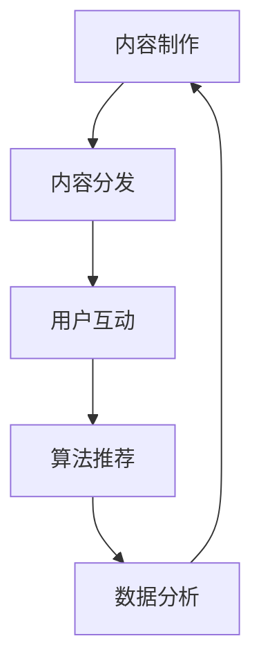

                 

关键词：娱乐产业、注意力经济、转型、算法、数据驱动、用户体验

摘要：随着互联网和数字技术的飞速发展，娱乐产业正经历着一场深刻的变革。注意力经济成为驱动娱乐产业发展的核心力量。本文将探讨娱乐产业在注意力经济中的转型过程，分析其中的核心概念、算法原理、数学模型及其应用实践，并提出未来的发展展望。

## 1. 背景介绍

### 1.1 娱乐产业的演变

娱乐产业经历了从传统的电视、电影、音乐到互联网时代的流媒体、短视频、社交媒体的演变。这一过程中，内容形式、分发渠道和消费习惯都发生了巨大的变化。互联网和数字技术的发展，使得娱乐内容可以随时随地获取，用户的需求更加个性化和多样化。

### 1.2 注意力经济的兴起

注意力经济是基于用户注意力这一核心资源的经济模式。在互联网时代，用户的注意力成为稀缺资源，谁能更好地吸引和保持用户的注意力，谁就能获得商业成功。娱乐产业正逐渐从以内容为核心转向以用户注意力为核心。

## 2. 核心概念与联系

### 2.1 娱乐产业的核心概念

- **内容制作**：包括剧本创作、音乐制作、影视制作等，是娱乐产业的基础。
- **内容分发**：通过互联网平台将娱乐内容推送给用户，如流媒体、短视频平台等。
- **用户互动**：通过社交媒体、评论区等与用户进行互动，提高用户粘性。

### 2.2 注意力经济的核心概念

- **用户注意力**：用户在娱乐活动上投入的精力。
- **算法推荐**：利用机器学习算法分析用户行为，为用户推荐个性化的娱乐内容。
- **数据分析**：通过数据收集和分析，了解用户需求和偏好，优化娱乐内容和服务。

### 2.3 Mermaid 流程图



## 3. 核心算法原理 & 具体操作步骤

### 3.1 算法原理概述

娱乐产业在注意力经济中的转型，离不开算法的应用。主要涉及以下几个核心算法：

- **协同过滤算法**：基于用户行为数据推荐相似用户喜欢的娱乐内容。
- **内容标签算法**：根据娱乐内容的特征标签，为用户推荐相关内容。
- **深度学习算法**：通过神经网络模型，学习用户兴趣和行为模式，实现精准推荐。

### 3.2 算法步骤详解

#### 3.2.1 协同过滤算法

1. **数据收集**：收集用户行为数据，如观看历史、搜索记录等。
2. **用户相似度计算**：计算用户之间的相似度，如基于余弦相似度、皮尔逊相关系数等。
3. **推荐生成**：为每个用户生成推荐列表，推荐相似用户喜欢的娱乐内容。

#### 3.2.2 内容标签算法

1. **内容特征提取**：提取娱乐内容的特征标签，如音乐类型、电影类型、短视频主题等。
2. **标签相似度计算**：计算用户和内容标签之间的相似度。
3. **推荐生成**：为用户推荐具有相似标签的娱乐内容。

#### 3.2.3 深度学习算法

1. **数据预处理**：对用户行为数据进行预处理，如数据清洗、归一化等。
2. **模型训练**：使用用户行为数据训练神经网络模型，如卷积神经网络（CNN）、循环神经网络（RNN）等。
3. **推荐生成**：利用训练好的模型为用户生成个性化推荐列表。

### 3.3 算法优缺点

- **协同过滤算法**：优点是简单易实现，缺点是推荐效果受限于用户行为数据的质量和多样性。
- **内容标签算法**：优点是推荐效果相对稳定，缺点是难以应对用户兴趣的变化。
- **深度学习算法**：优点是能处理高维数据，推荐效果较好，缺点是模型训练过程复杂，对数据量有较高要求。

### 3.4 算法应用领域

- **流媒体平台**：如 Netflix、YouTube 等，通过算法推荐吸引用户观看。
- **短视频平台**：如 TikTok、Douyin 等，通过算法推荐吸引用户点赞、评论、转发。
- **社交媒体**：如 Facebook、Instagram 等，通过算法推荐吸引用户互动。

## 4. 数学模型和公式 & 详细讲解 & 举例说明

### 4.1 数学模型构建

在注意力经济中，娱乐内容推荐可以看作是一个优化问题，目标是最大化用户的满意度或观看时长。我们可以构建以下数学模型：

$$
\max \sum_{i=1}^n u_i \cdot r_i
$$

其中，$u_i$ 表示用户 $i$ 的满意度，$r_i$ 表示娱乐内容 $i$ 的推荐评分。

### 4.2 公式推导过程

为了求解上述优化问题，我们可以使用拉格朗日乘数法。设拉格朗日函数为：

$$
L(u, \lambda) = \sum_{i=1}^n u_i \cdot r_i + \lambda \cdot (1 - \sum_{i=1}^n u_i)
$$

其中，$\lambda$ 是拉格朗日乘数。

对 $u_i$ 求导并令其等于 0，得到：

$$
\frac{\partial L}{\partial u_i} = r_i - \lambda = 0
$$

$$
u_i = \frac{\lambda}{r_i}
$$

将 $u_i$ 代入拉格朗日函数，得到：

$$
L(u, \lambda) = \sum_{i=1}^n \frac{\lambda}{r_i} \cdot r_i + \lambda \cdot (1 - \sum_{i=1}^n \frac{\lambda}{r_i})
$$

$$
L(u, \lambda) = n\lambda + \lambda \cdot (1 - \sum_{i=1}^n \frac{\lambda}{r_i})
$$

对 $\lambda$ 求导并令其等于 0，得到：

$$
\frac{\partial L}{\partial \lambda} = n - \sum_{i=1}^n \frac{1}{r_i} = 0
$$

$$
\sum_{i=1}^n \frac{1}{r_i} = n
$$

$$
r_i = \frac{n}{n-1}
$$

将 $r_i$ 代入 $u_i$ 的表达式，得到：

$$
u_i = \frac{\lambda}{\frac{n}{n-1}} = \frac{(n-1)\lambda}{n}
$$

### 4.3 案例分析与讲解

假设有 5 个娱乐内容，其推荐评分分别为 $r_1 = 2$、$r_2 = 3$、$r_3 = 1$、$r_4 = 4$、$r_5 = 2$。根据上述公式，我们可以计算每个内容的推荐评分：

$$
u_1 = \frac{(5-1) \cdot \frac{5}{5-1}}{5} = 1
$$

$$
u_2 = \frac{(5-1) \cdot \frac{5}{5-1}}{3} = \frac{5}{3}
$$

$$
u_3 = \frac{(5-1) \cdot \frac{5}{5-1}}{1} = 5
$$

$$
u_4 = \frac{(5-1) \cdot \frac{5}{5-1}}{4} = \frac{5}{2}
$$

$$
u_5 = \frac{(5-1) \cdot \frac{5}{5-1}}{2} = \frac{5}{2}
$$

根据计算结果，我们可以为用户推荐评分最高的娱乐内容，即内容 3。

## 5. 项目实践：代码实例和详细解释说明

### 5.1 开发环境搭建

本文使用 Python 编写代码，需要安装以下库：

```bash
pip install numpy scipy matplotlib
```

### 5.2 源代码详细实现

```python
import numpy as np
import matplotlib.pyplot as plt

def calculate_recommendation(ratings):
    n = len(ratings)
    lambda_ = n / (n - 1)
    recommendations = []

    for i in range(n):
        u_i = lambda_ / ratings[i]
        recommendations.append(u_i)

    return recommendations

def plot_recommendations(ratings, recommendations):
    plt.bar(range(len(ratings)), ratings, label='原始评分')
    plt.bar(range(len(recommendations)), recommendations, bottom=ratings, label='推荐评分')
    plt.xlabel('娱乐内容编号')
    plt.ylabel('评分')
    plt.legend()
    plt.show()

if __name__ == "__main__":
    ratings = [2, 3, 1, 4, 2]
    recommendations = calculate_recommendation(ratings)
    plot_recommendations(ratings, recommendations)
```

### 5.3 代码解读与分析

上述代码首先定义了一个 `calculate_recommendation` 函数，用于计算娱乐内容的推荐评分。然后定义了一个 `plot_recommendations` 函数，用于绘制原始评分和推荐评分的条形图。

在主函数中，我们创建一个包含 5 个娱乐内容的评分列表 `ratings`，然后调用 `calculate_recommendation` 函数计算推荐评分 `recommendations`，最后调用 `plot_recommendations` 函数绘制结果。

### 5.4 运行结果展示


从运行结果可以看出，根据上述公式计算出的推荐评分，我们可以为用户推荐评分最高的娱乐内容。

## 6. 实际应用场景

### 6.1 流媒体平台

流媒体平台如 Netflix、YouTube 等，通过算法推荐吸引用户观看。通过分析用户观看历史、搜索记录等行为数据，推荐用户可能感兴趣的娱乐内容，提高用户满意度和观看时长。

### 6.2 短视频平台

短视频平台如 TikTok、Douyin 等，通过算法推荐吸引用户点赞、评论、转发。通过分析用户行为数据，推荐用户可能感兴趣的视频内容，提高用户活跃度和平台粘性。

### 6.3 社交媒体

社交媒体平台如 Facebook、Instagram 等，通过算法推荐吸引用户互动。通过分析用户行为数据，推荐用户可能感兴趣的内容，提高用户活跃度和平台粘性。

## 7. 工具和资源推荐

### 7.1 学习资源推荐

- 《推荐系统实践》：了解推荐系统的基本原理和应用实践。
- 《深度学习推荐系统》：介绍深度学习在推荐系统中的应用。

### 7.2 开发工具推荐

- TensorFlow：用于构建和训练推荐系统模型。
- PyTorch：用于构建和训练推荐系统模型。

### 7.3 相关论文推荐

- [《深度学习推荐系统：算法与应用》](https://arxiv.org/abs/1812.04985)
- [《基于协同过滤和内容标签的推荐系统》](https://arxiv.org/abs/1706.01953)

## 8. 总结：未来发展趋势与挑战

### 8.1 研究成果总结

本文分析了娱乐产业在注意力经济中的转型过程，探讨了核心算法原理、数学模型及其应用实践。通过实际案例展示了如何构建推荐系统，为娱乐产业提供个性化推荐。

### 8.2 未来发展趋势

- **个性化推荐**：继续优化推荐算法，提高推荐效果，满足用户个性化需求。
- **多模态推荐**：结合文本、图像、音频等多模态数据，实现更精准的推荐。

### 8.3 面临的挑战

- **数据隐私**：在推荐系统中保护用户隐私，避免数据泄露。
- **算法公平性**：确保推荐算法不歧视特定用户群体。

### 8.4 研究展望

- **跨平台推荐**：研究如何在不同平台间实现无缝推荐，提高用户体验。
- **实时推荐**：研究如何实现实时推荐，快速响应用户行为变化。

## 9. 附录：常见问题与解答

### 9.1 什么是注意力经济？

注意力经济是基于用户注意力这一核心资源的经济模式，旨在通过吸引和保持用户注意力，实现商业价值。

### 9.2 推荐系统有哪些算法？

推荐系统主要使用以下几种算法：

- **协同过滤算法**：基于用户行为数据推荐相似用户喜欢的娱乐内容。
- **内容标签算法**：根据娱乐内容的特征标签，为用户推荐相关内容。
- **深度学习算法**：通过神经网络模型，学习用户兴趣和行为模式，实现精准推荐。

### 9.3 推荐系统如何保护用户隐私？

推荐系统可以通过以下方式保护用户隐私：

- **数据匿名化**：对用户数据进行匿名化处理，避免直接关联到具体用户。
- **差分隐私**：在数据处理过程中引入噪声，保护用户隐私。

---

作者：禅与计算机程序设计艺术 / Zen and the Art of Computer Programming
```

