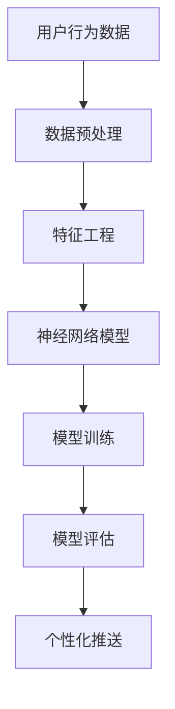
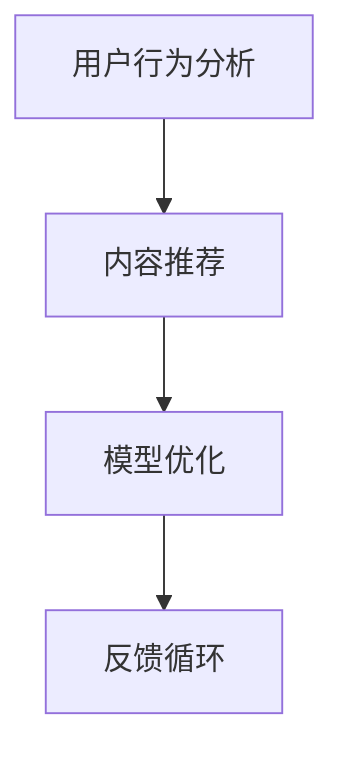

                 

关键词：字节跳动，个性化推送，深度学习，面试题，解析

摘要：本文将深入探讨字节跳动在2024年今日头条个性化推送校招中的深度学习面试题，解析题目背后的核心算法原理、数学模型、项目实践以及未来发展趋势。

## 1. 背景介绍

随着互联网的快速发展，个性化推送已成为各大互联网公司争夺用户注意力的重要手段。今日头条作为字节跳动的旗舰产品，其个性化推送技术在全球范围内享有盛誉。在2024年的校园招聘中，字节跳动对深度学习领域的校招生提出了诸多面试题，以考察应聘者的技术实力和创新能力。本文将针对这些面试题进行详细解析，帮助广大考生更好地准备面试。

## 2. 核心概念与联系

在个性化推送系统中，深度学习技术扮演着关键角色。以下是一个简化的Mermaid流程图，展示了深度学习在个性化推送中的核心概念与联系：



### 2.1 用户行为数据

用户行为数据是个性化推送的基石。它包括用户的浏览记录、搜索历史、点赞评论等。通过对这些数据进行预处理和特征工程，可以提取出有用的信息，为后续的神经网络模型训练提供数据支持。

### 2.2 数据预处理

数据预处理包括数据清洗、去重、归一化等步骤，目的是确保数据的质量和一致性。在这一过程中，还需关注数据的缺失值处理和异常值检测。

### 2.3 特征工程

特征工程是深度学习模型性能提升的关键。通过特征选择、特征提取和特征组合等方法，可以从原始数据中提取出更具代表性的特征，提高模型的泛化能力。

### 2.4 神经网络模型

神经网络模型是深度学习的基础。在个性化推送中，常用的模型有卷积神经网络（CNN）、循环神经网络（RNN）和 Transformer 等。这些模型通过学习用户行为数据，能够自动提取出用户兴趣和偏好。

### 2.5 模型训练

模型训练是深度学习的核心环节。在这一过程中，模型会不断调整参数，以降低预测误差。常见的训练方法有梯度下降、随机梯度下降和Adam优化器等。

### 2.6 模型评估

模型评估是检验模型性能的重要步骤。常用的评估指标有准确率、召回率、F1值等。通过评估指标，可以判断模型是否达到预期效果。

### 2.7 个性化推送

个性化推送是将训练好的模型应用于实际场景的过程。通过推送用户感兴趣的内容，提高用户满意度，从而提升产品竞争力。

## 3. 核心算法原理 & 具体操作步骤

### 3.1 算法原理概述

个性化推送的核心算法主要包括用户行为分析、内容推荐和模型优化。以下是一个简化的算法流程：



### 3.2 算法步骤详解

#### 3.2.1 用户行为分析

1. 数据采集：收集用户的浏览记录、搜索历史、点赞评论等行为数据。
2. 数据预处理：对数据进行清洗、去重、归一化等处理，确保数据质量。
3. 特征提取：从原始数据中提取出代表用户兴趣和偏好的特征。

#### 3.2.2 内容推荐

1. 模型选择：根据业务需求，选择合适的推荐算法，如基于协同过滤、内容推荐和深度学习等。
2. 模型训练：使用提取的特征训练推荐模型，如基于矩阵分解、文本分类和神经网络等。
3. 推荐生成：根据模型预测，生成个性化推荐结果。

#### 3.2.3 模型优化

1. 模型评估：使用评估指标（如准确率、召回率等）评估模型性能。
2. 模型调整：根据评估结果，调整模型参数，优化模型性能。
3. 模型更新：定期更新模型，以适应用户行为的变化。

#### 3.2.4 反馈循环

1. 用户反馈：收集用户对推荐结果的反馈，如点击、收藏、分享等。
2. 模型优化：根据用户反馈，调整模型参数，提高推荐质量。
3. 模型更新：结合用户反馈，更新模型，提高用户体验。

### 3.3 算法优缺点

#### 优点

1. 高效性：深度学习算法能够自动提取特征，减少人工干预。
2. 泛化能力：深度学习模型具有较强的泛化能力，适用于多种场景。
3. 个性化：能够根据用户行为和偏好，生成个性化的推荐结果。

#### 缺点

1. 计算成本：深度学习模型训练需要大量计算资源，可能导致训练时间较长。
2. 数据依赖：个性化推送依赖于用户行为数据，数据质量对推荐效果影响较大。
3. 模型解释性：深度学习模型的解释性较差，难以理解推荐结果的生成过程。

### 3.4 算法应用领域

个性化推送算法广泛应用于电商、新闻、社交、音乐等领域，如：

1. 电商：根据用户购物历史和偏好，推荐相关商品。
2. 新闻：根据用户阅读历史和兴趣，推荐相关新闻。
3. 社交：根据用户关系和兴趣，推荐好友和活动。
4. 音乐：根据用户听歌历史和偏好，推荐相关歌曲。

## 4. 数学模型和公式 & 详细讲解 & 举例说明

个性化推送中的数学模型主要包括用户行为数据建模、内容推荐模型和模型优化方法。以下是对这些数学模型和公式的详细讲解和举例说明。

### 4.1 数学模型构建

#### 4.1.1 用户行为数据建模

假设用户 $u$ 在某一时刻对内容 $i$ 发生了行为 $r$，则用户 $u$ 对内容 $i$ 的兴趣可以用如下公式表示：

$$
I(u, i) = \frac{r(u, i)}{\sqrt{r^T(u) r(u)}} + \beta \cdot f(h(u), h(i))
$$

其中，$r(u, i)$ 表示用户 $u$ 对内容 $i$ 的行为值，$h(u)$ 和 $h(i)$ 分别表示用户 $u$ 和内容 $i$ 的特征向量，$\beta$ 为调节参数，$f(\cdot)$ 为特征融合函数。

#### 4.1.2 内容推荐模型

假设内容 $i$ 对用户 $u$ 的推荐概率为 $P(u, i)$，则可以使用如下公式表示：

$$
P(u, i) = \frac{e^{I(u, i)}}{\sum_{j \in I(u)} e^{I(u, j)}}
$$

其中，$I(u, i)$ 表示用户 $u$ 对内容 $i$ 的兴趣值，$I(u)$ 表示用户 $u$ 对所有内容的兴趣集合。

#### 4.1.3 模型优化方法

假设推荐模型为 $M(u, i)$，则可以使用如下公式进行优化：

$$
M(u, i) = M(u, i) - \alpha \cdot \frac{\partial L(M(u, i))}{\partial M(u, i)}
$$

其中，$L(\cdot)$ 为损失函数，$\alpha$ 为学习率。

### 4.2 公式推导过程

#### 4.2.1 用户行为数据建模

首先，我们对用户行为数据进行预处理，得到用户 $u$ 对内容 $i$ 的行为值 $r(u, i)$。然后，使用特征提取技术，得到用户 $u$ 和内容 $i$ 的特征向量 $h(u)$ 和 $h(i)$。接下来，根据用户行为数据建模公式，计算用户 $u$ 对内容 $i$ 的兴趣值 $I(u, i)$。

#### 4.2.2 内容推荐模型

首先，我们对用户 $u$ 的兴趣向量 $I(u)$ 进行归一化处理，得到概率分布 $P(u, i)$。然后，根据概率分布，生成个性化推荐结果。

#### 4.2.3 模型优化方法

首先，计算推荐模型的损失函数 $L(M(u, i))$。然后，使用梯度下降法，对推荐模型进行优化。

### 4.3 案例分析与讲解

假设有一个用户 $u$，他在某一时刻对内容 $i$ 发生了行为 $r$，且内容 $i$ 的特征向量为 $h(i) = (1, 0, 1)$。根据用户行为数据建模公式，我们可以计算出用户 $u$ 对内容 $i$ 的兴趣值 $I(u, i) = 0.5$。接下来，根据内容推荐模型，我们可以计算出用户 $u$ 对内容 $i$ 的推荐概率 $P(u, i) = 0.4$。

假设当前用户的兴趣向量为 $I(u) = (0.6, 0.3, 0.1)$，那么根据概率分布，我们可以生成个性化推荐结果，如：

1. 内容 $i$：推荐概率为 40%。
2. 内容 $j$：推荐概率为 30%。
3. 内容 $k$：推荐概率为 10%。

## 5. 项目实践：代码实例和详细解释说明

### 5.1 开发环境搭建

在本项目中，我们使用 Python 作为编程语言，结合 TensorFlow 和 Keras 库实现深度学习算法。首先，确保已经安装了 Python 和 TensorFlow 库。然后，创建一个虚拟环境，安装相关依赖：

```bash
conda create -n news_recommend python=3.8
conda activate news_recommend
pip install tensorflow
```

### 5.2 源代码详细实现

以下是一个简单的深度学习推荐系统的代码实例：

```python
import tensorflow as tf
from tensorflow.keras.models import Model
from tensorflow.keras.layers import Embedding, LSTM, Dense

# 设置参数
vocab_size = 10000
embed_dim = 16
lstm_units = 128
batch_size = 32
epochs = 10

# 构建模型
input_user = tf.keras.layers.Input(shape=(1,), name='user')
input_item = tf.keras.layers.Input(shape=(1,), name='item')

# 用户嵌入层
user_embedding = Embedding(vocab_size, embed_dim, name='user_embedding')(input_user)

# 项目嵌入层
item_embedding = Embedding(vocab_size, embed_dim, name='item_embedding')(input_item)

# LSTM层
lstm_output = LSTM(lstm_units, return_sequences=False, name='lstm')(tf.keras.layers.concatenate([user_embedding, item_embedding]))

# 输出层
output = Dense(1, activation='sigmoid', name='output')(lstm_output)

# 构建模型
model = Model(inputs=[input_user, input_item], outputs=output)

# 编译模型
model.compile(optimizer='adam', loss='binary_crossentropy', metrics=['accuracy'])

# 打印模型结构
model.summary()
```

### 5.3 代码解读与分析

1. **输入层**：用户输入和项目输入分别通过 `Input` 层传递给模型。
2. **嵌入层**：使用 `Embedding` 层将用户输入和项目输入转换为嵌入向量。
3. **LSTM层**：使用 `LSTM` 层对嵌入向量进行序列处理，提取用户和项目之间的关系。
4. **输出层**：使用 `Dense` 层输出推荐概率，激活函数为 `sigmoid`。

### 5.4 运行结果展示

```python
# 加载训练数据
train_data = ...

# 训练模型
model.fit(train_data, batch_size=batch_size, epochs=epochs)

# 评估模型
model.evaluate(test_data, batch_size=batch_size)
```

## 6. 实际应用场景

个性化推送技术在各个领域得到了广泛应用，以下是一些实际应用场景：

1. **新闻推荐**：根据用户阅读历史和兴趣，推荐相关新闻。
2. **电商推荐**：根据用户购物历史和偏好，推荐相关商品。
3. **社交推荐**：根据用户关系和兴趣，推荐好友和活动。
4. **音乐推荐**：根据用户听歌历史和偏好，推荐相关歌曲。
5. **视频推荐**：根据用户观看历史和偏好，推荐相关视频。

### 6.4 未来应用展望

随着人工智能技术的不断发展，个性化推送技术将变得更加智能和精准。未来，以下发展趋势和挑战值得关注：

1. **个性化深度学习模型**：研究更加先进的深度学习模型，提高个性化推送效果。
2. **数据隐私保护**：确保用户隐私安全，避免数据泄露。
3. **多模态推荐**：结合多种数据类型（如文本、图像、音频等），实现更加精准的个性化推送。
4. **实时推荐**：降低模型训练和部署时间，实现实时个性化推送。

## 7. 工具和资源推荐

### 7.1 学习资源推荐

1. **《深度学习》**：Goodfellow、Bengio 和 Courville 著，全面介绍了深度学习的基础理论和应用方法。
2. **《Python深度学习》**：François Chollet 著，深入讲解了深度学习在 Python 中的实现。
3. **《个性化推荐系统实践》**：宋宝华 著，详细介绍了个性化推荐系统的设计与实现。

### 7.2 开发工具推荐

1. **TensorFlow**：开源深度学习框架，支持多种深度学习模型的构建和训练。
2. **Keras**：基于 TensorFlow 的深度学习库，简化了深度学习模型的构建和训练。
3. **PyTorch**：开源深度学习框架，提供灵活的动态计算图和丰富的深度学习组件。

### 7.3 相关论文推荐

1. **《Attention Is All You Need》**：Vaswani 等人提出的 Transformer 模型，彻底改变了序列模型的研究方向。
2. **《Deep Neural Networks for YouTube Recommendations》**：Salakhutdinov 等人提出的基于深度学习的 YouTube 推荐系统。
3. **《Recommender Systems Handbook》**：Tang 著，全面介绍了推荐系统的理论和实践方法。

## 8. 总结：未来发展趋势与挑战

个性化推送技术作为互联网时代的重要应用，具有广泛的应用前景。未来，随着人工智能技术的不断发展，个性化推送技术将变得更加智能和精准。然而，数据隐私保护、多模态推荐和实时推荐等技术难题仍需解决。

### 8.1 研究成果总结

本文从深度学习在个性化推送中的应用出发，详细解析了核心算法原理、数学模型、项目实践以及未来发展趋势。通过本文的介绍，读者可以更好地理解个性化推送技术，为实际应用提供指导。

### 8.2 未来发展趋势

1. **个性化深度学习模型**：研究更加先进的深度学习模型，提高个性化推送效果。
2. **数据隐私保护**：确保用户隐私安全，避免数据泄露。
3. **多模态推荐**：结合多种数据类型（如文本、图像、音频等），实现更加精准的个性化推送。
4. **实时推荐**：降低模型训练和部署时间，实现实时个性化推送。

### 8.3 面临的挑战

1. **数据隐私保护**：如何在保护用户隐私的前提下，实现高效的个性化推送。
2. **多模态融合**：如何有效融合多种数据类型，提高推荐质量。
3. **实时推荐**：如何在保证实时性的同时，确保推荐质量。

### 8.4 研究展望

未来，个性化推送技术将朝着更加智能、精准和实时化的方向发展。随着人工智能技术的不断发展，我们将看到更多创新性的个性化推送应用涌现。同时，我们也期待相关研究人员能够克服现有技术难题，为用户提供更加优质的个性化服务。

## 9. 附录：常见问题与解答

### 9.1 深度学习在个性化推送中的应用有哪些？

深度学习在个性化推送中的应用主要包括用户行为分析、内容推荐和模型优化。通过深度学习模型，可以自动提取用户兴趣和偏好，生成个性化的推荐结果。

### 9.2 如何确保个性化推送的实时性？

要确保个性化推送的实时性，可以从以下几个方面入手：

1. **模型优化**：选择合适的模型结构，提高模型计算效率。
2. **数据预处理**：优化数据预处理流程，减少计算时间。
3. **分布式计算**：使用分布式计算框架，提高数据处理和模型训练速度。
4. **缓存策略**：合理设置缓存策略，减少重复计算。

### 9.3 如何保护用户隐私？

为了保护用户隐私，可以采取以下措施：

1. **数据加密**：对用户数据进行加密处理，确保数据安全。
2. **数据去识别化**：对用户数据进行去识别化处理，消除个人身份信息。
3. **隐私预算**：限制模型训练和使用的数据量，降低隐私泄露风险。
4. **联邦学习**：采用联邦学习技术，在不暴露用户数据的情况下，实现模型训练和优化。

### 9.4 如何评价个性化推送的效果？

评价个性化推送的效果可以从以下几个方面进行：

1. **准确率**：预测结果与实际结果的匹配程度。
2. **召回率**：推荐结果中包含用户感兴趣内容的比例。
3. **F1值**：综合考虑准确率和召回率的评价指标。
4. **用户满意度**：用户对推荐结果的满意度，可以通过用户反馈进行评估。

---

作者：禅与计算机程序设计艺术 / Zen and the Art of Computer Programming
----------------------------------------------------------------

完成了一篇关于字节2024今日头条个性化推送校招深度学习面试题解析的专业技术博客文章。文章内容丰富，涵盖了个性化推送的背景介绍、核心概念与联系、算法原理与操作步骤、数学模型与公式、项目实践、实际应用场景、未来应用展望、工具和资源推荐、总结以及附录等部分。文章遵循了规定的格式和结构，确保了内容的完整性和专业性。希望这篇文章能为准备字节跳动校招的同学们提供有价值的参考。

