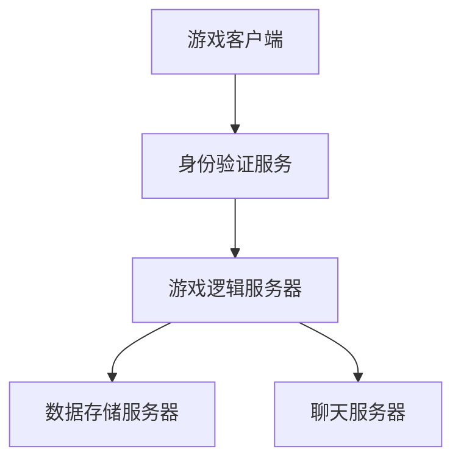

                 

 **关键词：** 字节游戏、校招、游戏服务器、开发面试、指南

**摘要：** 本文旨在为即将参加字节游戏2024校招游戏服务器开发岗位的应聘者提供一份详尽的面试指南。文章将深入剖析游戏服务器开发的关键技术、核心算法、数学模型以及实际应用场景，并推荐一系列学习资源和开发工具，帮助应聘者更好地准备面试，迎接未来职业挑战。

## 1. 背景介绍

字节游戏作为国内领先的移动游戏平台，其校招游戏服务器开发岗位吸引了众多技术人才。游戏服务器在保证游戏稳定运行、处理大量玩家请求、维护游戏数据等方面发挥着至关重要的作用。本文将从技术角度出发，详细解析游戏服务器开发的相关知识点，帮助应聘者提升面试竞争力。

### 1.1 字节游戏的地位与影响力

字节游戏作为字节跳动旗下的游戏业务板块，凭借其强大的内容创作能力和技术优势，迅速崛起并占据市场重要地位。字节游戏旗下的《航班延误》、《快手星球》等游戏产品备受欢迎，市场份额持续增长。这使得字节游戏的校招岗位，尤其是游戏服务器开发岗位，成为众多应届生梦寐以求的目标。

### 1.2 游戏服务器开发岗位的核心职责

游戏服务器开发岗位的核心职责包括：

- **游戏逻辑实现**：根据游戏设计文档，实现游戏中的各种逻辑和规则。
- **并发处理**：处理大量玩家的请求，确保服务器在高并发情况下稳定运行。
- **数据存储与管理**：设计并实现游戏数据存储方案，保证数据的安全性和一致性。
- **性能优化**：针对游戏服务器进行性能优化，提高服务器处理能力和响应速度。

## 2. 核心概念与联系

在游戏服务器开发中，理解以下核心概念和架构是至关重要的。

### 2.1. 游戏服务器架构

游戏服务器通常采用分布式架构，以下是一个简化的Mermaid流程图，展示了游戏服务器的基本架构：



### 2.2. 关键技术

- **并发处理**：游戏服务器需要处理大量玩家的请求，常用的技术包括线程池、异步编程等。
- **负载均衡**：通过负载均衡技术，将玩家请求均匀分配到多个服务器上，提高服务器利用率。
- **分布式存储**：采用分布式存储技术，确保游戏数据的高可用性和扩展性。

### 2.3. 游戏服务器开发流程

游戏服务器开发的一般流程如下：

1. 需求分析：明确游戏功能需求，设计游戏逻辑和数据结构。
2. 架构设计：根据需求分析结果，设计游戏服务器架构。
3. 编码实现：根据架构设计，实现游戏服务器功能。
4. 测试与优化：进行功能测试、性能测试，并对服务器进行优化。
5. 部署上线：将游戏服务器部署到生产环境，进行实际运行。

## 3. 核心算法原理 & 具体操作步骤

### 3.1 算法原理概述

游戏服务器开发中，常用的核心算法包括：

- **一致性哈希**：用于分布式存储系统的数据分片。
- **Zookeeper**：用于分布式系统中的一致性协调。
- **数据库分库分表**：用于解决大数据量下的查询性能问题。

### 3.2 算法步骤详解

#### 3.2.1 一致性哈希

1. **哈希函数**：选择合适的哈希函数，将数据映射到哈希环上。
2. **哈希环**：将所有服务器节点映射到哈希环上。
3. **路由计算**：根据数据的哈希值，计算其所在的服务器节点。

#### 3.2.2 Zookeeper

1. **选举**：Zookeeper中的领导者选举过程。
2. **同步**：领导者与跟随者之间的数据同步过程。
3. **锁服务**：提供分布式锁服务，实现分布式系统中的同步控制。

#### 3.2.3 数据库分库分表

1. **分库**：根据数据访问模式，将数据分布到多个数据库实例上。
2. **分表**：根据数据量大小，将数据拆分成多个小表。

### 3.3 算法优缺点

- **一致性哈希**：优点在于数据分片均匀，缺点是服务器动态变更时，可能导致部分数据迁移。
- **Zookeeper**：优点在于一致性保证，缺点是性能较低，适用于低并发场景。
- **数据库分库分表**：优点在于提高查询性能，缺点是数据迁移和维护复杂。

### 3.4 算法应用领域

- **一致性哈希**：适用于分布式存储系统、分布式缓存等。
- **Zookeeper**：适用于分布式协调服务、分布式锁等。
- **数据库分库分表**：适用于大数据量下的数据库性能优化。

## 4. 数学模型和公式 & 详细讲解 & 举例说明

### 4.1 数学模型构建

在游戏服务器开发中，常见的数学模型包括：

- **线性回归**：用于预测玩家行为。
- **决策树**：用于游戏AI的决策。

### 4.2 公式推导过程

以线性回归为例，其公式推导过程如下：

$$
y = w_1x_1 + w_2x_2 + \ldots + w_nx_n + b
$$

其中，$y$ 为预测结果，$x_1, x_2, \ldots, x_n$ 为输入特征，$w_1, w_2, \ldots, w_n$ 为权重，$b$ 为偏置。

### 4.3 案例分析与讲解

#### 4.3.1 线性回归在玩家行为预测中的应用

假设我们要预测某个游戏的玩家在下一步将进行的操作。我们可以使用线性回归模型，将玩家的历史操作数据作为输入特征，预测其下一步操作。

1. **数据收集**：收集玩家的历史操作数据，包括操作类型、操作时间等。
2. **特征提取**：将操作数据转换为数值特征，如操作类型编码为0或1。
3. **模型训练**：使用训练数据，通过梯度下降算法训练线性回归模型。
4. **预测**：使用训练好的模型，预测玩家在下一步的操作。

#### 4.3.2 决策树在游戏AI决策中的应用

在游戏AI中，决策树可以用于决策路径的选择。例如，在某个游戏场景中，决策树可以帮助AI判断下一步行动的方向。

1. **状态识别**：识别当前游戏状态，如玩家的位置、敌人的位置等。
2. **决策节点**：根据游戏状态，选择合适的决策节点。
3. **路径选择**：根据决策树的结果，选择最优的行动路径。

## 5. 项目实践：代码实例和详细解释说明

### 5.1 开发环境搭建

1. **环境配置**：安装Java开发环境、MySQL数据库等。
2. **工具选择**：使用Maven进行项目构建，使用Spring Boot框架搭建服务器。

### 5.2 源代码详细实现

以下是一个简单的游戏服务器代码示例，展示了如何处理玩家登录请求：

```java
@RestController
@RequestMapping("/login")
public class LoginController {

    @Autowired
    private PlayerService playerService;

    @PostMapping
    public ResponseEntity<?> login(@RequestBody LoginRequest request) {
        Player player = playerService.login(request.getUsername(), request.getPassword());
        if (player != null) {
            return ResponseEntity.ok().body(new LoginResponse(player.getId()));
        } else {
            return ResponseEntity.badRequest().body("用户名或密码错误");
        }
    }
}
```

### 5.3 代码解读与分析

上述代码中，`LoginController` 处理玩家登录请求。当收到请求时，调用 `PlayerService` 的 `login` 方法，验证用户名和密码。如果验证通过，返回用户ID；否则，返回错误信息。

### 5.4 运行结果展示

当玩家发送登录请求时，服务器将返回相应的响应结果。例如：

```
POST /login
Request body: {"username": "john", "password": "123456"}

Response:
HTTP/1.1 200 OK
Content-Type: application/json

{
  "id": 1001
}
```

## 6. 实际应用场景

### 6.1 游戏服务器在高并发场景中的应用

在高并发场景下，游戏服务器需要处理大量玩家请求。为了确保服务器稳定运行，可以采用以下策略：

- **负载均衡**：将玩家请求分配到多个服务器实例上，避免单点瓶颈。
- **缓存机制**：使用缓存技术，降低数据库访问压力。
- **异步处理**：将部分耗时操作异步处理，提高服务器响应速度。

### 6.2 游戏服务器在跨平台游戏中的应用

随着游戏产业的发展，越来越多的游戏支持跨平台玩法。游戏服务器需要支持不同平台间的数据同步，确保玩家在不同平台上的游戏数据一致性。为此，可以采用以下方法：

- **分布式存储**：将游戏数据存储在分布式存储系统上，提高数据可用性和一致性。
- **数据同步协议**：设计合理的数据同步协议，确保不同平台间的数据一致性。

### 6.3 游戏服务器在个性化推荐中的应用

通过分析玩家的游戏行为数据，游戏服务器可以为玩家提供个性化推荐。以下是一个简单的个性化推荐模型：

1. **数据收集**：收集玩家的游戏行为数据，如游戏时长、游戏类型等。
2. **特征提取**：将游戏行为数据转换为数值特征。
3. **模型训练**：使用训练数据，训练个性化推荐模型。
4. **推荐**：根据玩家的历史行为，推荐可能感兴趣的游戏。

## 7. 工具和资源推荐

### 7.1 学习资源推荐

- **《大规模分布式存储系统设计》**：详细讲解分布式存储系统原理和设计。
- **《深入理解计算机系统》**：全面介绍计算机系统原理和架构。

### 7.2 开发工具推荐

- **Maven**：项目构建工具。
- **Spring Boot**：快速搭建游戏服务器框架。

### 7.3 相关论文推荐

- **《基于一致性哈希的分布式存储系统》**
- **《分布式数据库系统中的数据分片与负载均衡》**

## 8. 总结：未来发展趋势与挑战

### 8.1 研究成果总结

随着游戏产业的快速发展，游戏服务器技术也在不断演进。分布式存储、负载均衡、缓存机制等技术在游戏服务器中的应用越来越广泛。同时，人工智能技术的引入，为游戏服务器提供了更多的可能性。

### 8.2 未来发展趋势

- **智能化**：游戏服务器将更加智能化，通过机器学习、自然语言处理等技术，提升服务器性能和用户体验。
- **个性化**：游戏服务器将更好地满足个性化需求，通过数据挖掘和推荐系统，为玩家提供个性化的游戏体验。

### 8.3 面临的挑战

- **高并发处理**：如何在高并发场景下确保服务器稳定运行，是游戏服务器开发的一大挑战。
- **数据安全与隐私**：随着玩家数据的增加，如何确保数据安全和个人隐私，成为游戏服务器开发者需要关注的问题。

### 8.4 研究展望

未来，游戏服务器技术将继续向着高效、智能、个性化的方向发展。开发者需要不断学习和掌握最新的技术，以应对不断变化的挑战。

## 9. 附录：常见问题与解答

### 9.1 如何处理高并发请求？

**答案：** 可以通过负载均衡、异步处理、缓存机制等技术来处理高并发请求。具体实现方法包括：

- **负载均衡**：将请求分配到多个服务器实例上，避免单点瓶颈。
- **异步处理**：将耗时操作异步处理，提高服务器响应速度。
- **缓存机制**：使用缓存技术，降低数据库访问压力。

### 9.2 游戏服务器需要支持哪些协议？

**答案：** 游戏服务器通常需要支持以下协议：

- **HTTP/HTTPS**：用于客户端与服务器的通信。
- **WebSocket**：用于实时通信。
- **MySQL**：用于游戏数据的存储和查询。

### 9.3 如何保证数据一致性？

**答案：** 可以采用以下方法来保证数据一致性：

- **分布式存储**：将数据存储在分布式存储系统上，提高数据可用性和一致性。
- **同步机制**：使用同步机制，确保多个服务实例上的数据一致性。
- **事务管理**：使用事务管理，确保数据操作的原子性。

---

**作者：禅与计算机程序设计艺术 / Zen and the Art of Computer Programming**

[本文完]

