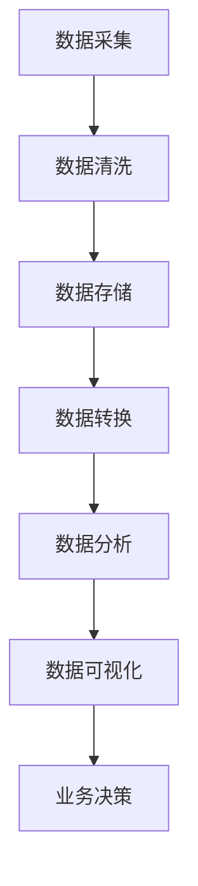

                 

### 关键词 Keywords

- 字节跳动
- 校招
- 大数据工程师
- 面试题
- 解析
- 技术分析
- 算法

### 摘要 Summary

本文旨在深入解析字节跳动2024校招大数据工程师面试中可能出现的各类题目。文章首先介绍大数据工程师的核心职责和技能要求，然后针对常见的面试题目进行详细解答。通过本文，读者可以全面了解大数据领域的关键概念、算法原理、数学模型以及实际应用，为未来的面试做好准备。

## 1. 背景介绍

### 1.1 字节跳动与大数据

字节跳动作为我国领先的互联网科技公司，以其在内容分发和社交媒体领域的卓越表现而闻名。随着用户数据的爆炸性增长，字节跳动对大数据工程师的需求日益增加。大数据工程师在字节跳动扮演着至关重要的角色，他们负责构建、维护和优化大规模数据处理系统，从而支持数据驱动的业务决策。

### 1.2 大数据工程师的职责与技能

大数据工程师的主要职责包括：

- 数据采集与存储：负责设计并实现数据采集、存储和处理的流程，确保数据的质量和一致性。
- 数据分析与挖掘：运用统计学和机器学习技术，从海量数据中提取有价值的信息，为业务提供数据支持。
- 数据可视化：通过图表、报表等形式，将数据分析结果直观地呈现给业务团队。
- 系统优化：不断优化数据处理系统的性能，提高系统的稳定性和可扩展性。

大数据工程师应具备以下技能：

- 熟悉大数据技术栈：如Hadoop、Spark、Flink等。
- 熟练掌握编程语言：如Java、Python等。
- 熟悉数据库技术：如MySQL、HBase、MongoDB等。
- 熟悉分布式系统原理：了解如何在大规模分布式环境中进行数据存储和处理。
- 数据分析能力：熟练运用统计方法和机器学习技术，对复杂数据进行分析和建模。

## 2. 核心概念与联系

### 2.1 大数据的核心概念

#### 2.1.1 数据量（Volume）

数据量是指数据的大小，大数据通常指的是数据量级达到PB（1000TB）或EB（1000PB）级别的数据。

#### 2.1.2 数据种类（Variety）

数据种类指的是数据来源的多样性，包括结构化数据、半结构化数据和非结构化数据。

#### 2.1.3 数据速度（Velocity）

数据速度指的是数据生成的速度，即数据流动和处理的实时性要求。

#### 2.1.4 数据真实性（Veracity）

数据真实性指的是数据的准确性和可靠性，大数据环境中数据质量的挑战尤为突出。

### 2.2 大数据技术栈

以下是大数据领域中常用的技术及其关联：

#### Hadoop

Hadoop是一个开源的分布式计算框架，用于处理海量数据。它包括HDFS（分布式文件系统）、MapReduce（分布式数据处理）等核心组件。

#### Spark

Spark是一个高速的分布式数据处理引擎，支持内存计算，适用于迭代和交互式数据处理任务。

#### Flink

Flink是一个流处理引擎，提供实时数据流处理能力，适用于实时数据分析和流计算任务。

#### Kafka

Kafka是一个分布式消息队列系统，用于构建高吞吐量的数据管道和实时数据流。

#### HBase

HBase是一个分布式、可扩展的大规模列存储数据库，基于Hadoop平台，适用于存储和检索海量半结构化数据。

### 2.3 Mermaid 流程图

以下是一个Mermaid流程图，展示了大数据处理的一般流程：



## 3. 核心算法原理 & 具体操作步骤

### 3.1 算法原理概述

在大数据领域，常见的核心算法包括：

- 分布式文件系统（HDFS）
- 分布式数据处理（MapReduce）
- 分布式计算框架（Spark）
- 数据挖掘算法（如K-means、Apriori算法）

### 3.2 算法步骤详解

#### 3.2.1 HDFS

HDFS的步骤如下：

1. 数据分片：将大文件分割成多个块，通常每个块大小为128MB或256MB。
2. 块存储：将数据块分布到不同的数据节点上。
3. 数据读写：通过HDFS客户端对数据块进行读写操作，数据节点之间通过网络传输数据。

#### 3.2.2 MapReduce

MapReduce的步骤如下：

1. Map阶段：对输入数据进行分片，每个分片分配一个Mapper任务。
2. Shuffle阶段：根据键（Key）将Mapper的输出重新分片，发送到Reduce任务的输入队列中。
3. Reduce阶段：对每个键及其对应的值进行聚合操作，生成最终结果。

#### 3.2.3 Spark

Spark的核心步骤如下：

1. 数据读取：从存储系统（如HDFS）中读取数据。
2. 数据转换：使用Spark的API进行数据处理和转换。
3. 数据写入：将处理后的数据写入存储系统或输出到其他系统。

#### 3.2.4 K-means算法

K-means算法的步骤如下：

1. 初始化：随机选择K个中心点。
2. 聚类：计算每个数据点到各个中心点的距离，将数据点分配到最近的中心点所在的簇。
3. 更新中心点：计算每个簇的质心，更新中心点。
4. 重复步骤2和3，直到中心点不再发生显著变化。

### 3.3 算法优缺点

#### HDFS

优点：

- 高容错性：数据块复制机制确保数据不丢失。
- 高扩展性：支持海量数据存储。

缺点：

- 读取速度较慢：数据块通过网络传输，读取速度受网络带宽影响。

#### MapReduce

优点：

- 易于编程：基于函数式编程模型，易于实现并行计算。
- 高效：适合批处理任务。

缺点：

- 低延迟：不适合低延迟、高吞吐量的实时处理任务。

#### Spark

优点：

- 高速度：支持内存计算，处理速度远快于Hadoop。
- 易于编程：提供丰富的API，易于使用。

缺点：

- 成本较高：Spark依赖集群资源，成本相对较高。

#### K-means算法

优点：

- 简单易实现：基于距离计算，算法简单。
- 效果直观：聚类结果容易理解。

缺点：

- 对初始中心点敏感：不同的初始中心点可能导致不同的聚类结果。
- 不适合高维度数据：在高维度空间中，距离计算容易失效。

### 3.4 算法应用领域

- 分布式文件系统：应用于数据存储和共享，如Hadoop生态系统。
- 分布式数据处理：应用于大数据处理任务，如MapReduce和Spark。
- 数据挖掘：应用于数据分析和模式识别，如K-means算法。

## 4. 数学模型和公式 & 详细讲解 & 举例说明

### 4.1 数学模型构建

在大数据领域，常见的数学模型包括：

- 概率模型：用于数据分析和预测，如贝叶斯网络。
- 线性模型：用于数据回归和分类，如线性回归和线性判别分析。
- 神经网络模型：用于复杂模式识别和预测，如多层感知器。

### 4.2 公式推导过程

以下以线性回归模型为例，介绍公式推导过程：

#### 4.2.1 线性回归模型

线性回归模型的基本公式为：

\[ y = \beta_0 + \beta_1x + \epsilon \]

其中：

- \( y \)：实际观测值。
- \( x \)：自变量。
- \( \beta_0 \)：截距。
- \( \beta_1 \)：斜率。
- \( \epsilon \)：误差项。

#### 4.2.2 最小二乘法

最小二乘法的目标是最小化预测值与实际值之间的误差平方和。误差平方和的公式为：

\[ S = \sum_{i=1}^{n}(y_i - \hat{y}_i)^2 \]

其中：

- \( n \)：数据点的数量。
- \( \hat{y}_i \)：第i个数据点的预测值。

#### 4.2.3 求解参数

通过最小化误差平方和，可以得到参数的最小二乘估计值。最小化误差平方和的公式为：

\[ \min S = \min \sum_{i=1}^{n}(y_i - \hat{y}_i)^2 \]

其中：

- \( \hat{y}_i = \beta_0 + \beta_1x_i \)。

对参数求导并令导数为零，可以得到参数的最小二乘估计值：

\[ \beta_0 = \bar{y} - \beta_1\bar{x} \]
\[ \beta_1 = \frac{\sum_{i=1}^{n}(x_i - \bar{x})(y_i - \bar{y})}{\sum_{i=1}^{n}(x_i - \bar{x})^2} \]

其中：

- \( \bar{x} \)：自变量的均值。
- \( \bar{y} \)：因变量的均值。

### 4.3 案例分析与讲解

#### 4.3.1 案例背景

某公司需要预测下一季度的销售额。该公司收集了前几个季度的销售额数据，数据包括季度、销售额等字段。

#### 4.3.2 数据预处理

1. 数据清洗：删除缺失值和异常值。
2. 数据转换：将销售额转换为数值类型。

#### 4.3.3 模型建立

1. 建立线性回归模型：\( y = \beta_0 + \beta_1x \)。
2. 计算参数值：使用最小二乘法计算截距和斜率。

#### 4.3.4 模型评估

1. 计算预测值：\( \hat{y}_i = \beta_0 + \beta_1x_i \)。
2. 计算误差：\( e_i = y_i - \hat{y}_i \)。
3. 计算误差平方和：\( S = \sum_{i=1}^{n}e_i^2 \)。
4. 计算决定系数：\( R^2 = 1 - \frac{S}{\sum_{i=1}^{n}(y_i - \bar{y})^2} \)。

#### 4.3.5 结果分析

通过计算，得到线性回归模型的参数值和决定系数。根据决定系数，可以评估模型对数据的拟合程度。如果决定系数较高，说明模型对数据的预测能力较强。

## 5. 项目实践：代码实例和详细解释说明

### 5.1 开发环境搭建

1. 安装Java环境：在系统中安装Java Development Kit（JDK）。
2. 安装Hadoop：下载并解压Hadoop安装包，配置环境变量。
3. 安装Spark：下载并解压Spark安装包，配置环境变量。

### 5.2 源代码详细实现

以下是一个简单的Hadoop MapReduce程序，用于计算单词出现的频率。

```java
import org.apache.hadoop.conf.Configuration;
import org.apache.hadoop.fs.Path;
import org.apache.hadoop.io.IntWritable;
import org.apache.hadoop.io.Text;
import org.apache.hadoop.mapreduce.Job;
import org.apache.hadoop.mapreduce.Mapper;
import org.apache.hadoop.mapreduce.Reducer;
import org.apache.hadoop.mapreduce.lib.input.FileInputFormat;
import org.apache.hadoop.mapreduce.lib.output.FileOutputFormat;

public class WordCount {

  public static class TokenizerMapper extends Mapper<Object, Text, Text, IntWritable>{

    private final static IntWritable one = new IntWritable(1);
    private Text word = new Text();

    public void map(Object key, Text value, Context context) throws IOException, InterruptedException {
      String[] tokens = value.toString().split("\\s+");
      for (String token : tokens) {
        word.set(token);
        context.write(word, one);
      }
    }
  }

  public static class IntSumReducer extends Reducer<Text,IntWritable,Text,IntWritable> {
    private IntWritable result = new IntWritable();

    public void reduce(Text key, Iterable<IntWritable> values, Context context) throws IOException, InterruptedException {
      int sum = 0;
      for (IntWritable val : values) {
        sum += val.get();
      }
      result.set(sum);
      context.write(key, result);
    }
  }

  public static void main(String[] args) throws Exception {
    Configuration conf = new Configuration();
    Job job = Job.getInstance(conf, "word count");
    job.setJarByClass(WordCount.class);
    job.setMapperClass(TokenizerMapper.class);
    job.setCombinerClass(IntSumReducer.class);
    job.setReducerClass(IntSumReducer.class);
    job.setOutputKeyClass(Text.class);
    job.setOutputValueClass(IntWritable.class);
    FileInputFormat.addInputPath(job, new Path(args[0]));
    FileOutputFormat.setOutputPath(job, new Path(args[1]));
    System.exit(job.waitForCompletion(true) ? 0 : 1);
  }
}
```

### 5.3 代码解读与分析

1. **引入类和接口**：引入Hadoop相关的类和接口，如Configuration、Job、Mapper、Reducer等。
2. **自定义Mapper类**：定义TokenizerMapper类，继承Mapper接口，重写map方法，用于实现单词分割逻辑。
3. **自定义Reducer类**：定义IntSumReducer类，继承Reducer接口，重写reduce方法，用于实现单词计数逻辑。
4. **主函数**：定义main方法，配置作业（Job）参数，设置Mapper和Reducer类，输入和输出路径，执行作业。

### 5.4 运行结果展示

1. 编译源代码：使用IDE或命令行编译源代码，生成WordCount类。
2. 运行程序：执行以下命令运行程序：

```bash
hadoop jar WordCount.jar WordCount /input /output
```

3. 查看输出结果：输出结果保存在输出路径中，可以使用以下命令查看：

```bash
hadoop fs -cat /output/*
```

输出结果将显示单词及其出现的频率。

## 6. 实际应用场景

### 6.1 数据采集与处理

在大数据领域，数据采集和处理是至关重要的步骤。字节跳动通过多种渠道收集用户数据，如网页浏览记录、搜索历史、视频播放时长等。这些数据需要经过清洗、转换和存储，以便进行后续的分析和处理。

### 6.2 数据分析与挖掘

通过对海量数据的分析，字节跳动可以发现用户行为模式、预测用户需求，从而优化产品推荐算法。例如，通过分析用户在平台上的活动，可以推荐用户可能感兴趣的内容，提高用户满意度和留存率。

### 6.3 数据可视化与展示

数据可视化是将数据分析结果以图表、报表等形式直观呈现的重要手段。字节跳动利用数据可视化工具，将复杂的数据分析结果以易于理解的形式展示给业务团队，支持数据驱动的决策。

### 6.4 未来应用展望

随着大数据技术的不断发展和完善，字节跳动在大数据领域的应用前景十分广阔。未来，字节跳动将继续探索大数据在个性化推荐、智能客服、风险控制等领域的应用，为用户提供更加优质的服务。

## 7. 工具和资源推荐

### 7.1 学习资源推荐

- 《大数据技术导论》：系统地介绍了大数据技术的基本概念和关键技术。
- 《Hadoop权威指南》：深入讲解了Hadoop架构、原理和应用。
- 《数据挖掘：概念与技术》：涵盖了数据挖掘的基本概念、算法和实际应用。

### 7.2 开发工具推荐

- IntelliJ IDEA：一款功能强大的集成开发环境，适用于Java和Python编程。
- Hadoop CLI：用于与Hadoop集群进行交互的命令行工具。
- Spark Shell：用于快速测试和调试Spark应用程序的交互式Shell。

### 7.3 相关论文推荐

- 《MapReduce：大规模数据处理的模型与实现》
- 《Spark: Effi

