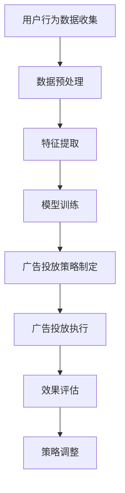

                 

 **关键词：** 字节跳动，校招，广告投放策略，面试题集锦，人工智能，数据挖掘，机器学习，算法优化，市场营销，用户行为分析

**摘要：**
本文旨在为即将参加字节跳动2024校招广告投放策略工程师岗位的应聘者提供一份详细的面试题集锦。通过对广告投放策略的深入探讨，结合实际案例和算法原理，本文将帮助读者全面了解广告投放的核心技术和应用，为面试做好准备。

## 1. 背景介绍

字节跳动是一家全球领先的内容与社交平台公司，旗下拥有抖音、今日头条、西瓜视频等多款热门应用。随着互联网的快速发展，广告投放已成为企业获取用户和提升品牌影响力的重要手段。广告投放策略工程师在这一过程中扮演着关键角色，他们需要运用人工智能、数据挖掘、机器学习等技术，制定高效精准的广告投放策略。

本文将围绕字节跳动2024校招广告投放策略工程师面试题目，系统性地分析相关技术原理、算法模型和实践案例，帮助读者全面掌握广告投放的核心知识。

## 2. 核心概念与联系

### 2.1 广告投放策略

广告投放策略是指根据广告目标、预算、受众特征等因素，制定出最适合的广告投放方案。策略的核心目标是实现广告效果的最大化，包括提升广告曝光量、点击率、转化率等。

### 2.2 人工智能与广告投放

人工智能技术在广告投放中发挥着重要作用。通过机器学习算法，广告投放策略工程师可以挖掘用户行为数据，预测用户需求，实现精准投放。例如，基于协同过滤算法的推荐系统可以帮助广告主将广告推送给潜在受众。

### 2.3 数据挖掘与广告投放

数据挖掘技术用于从海量数据中提取有价值的信息。在广告投放中，数据挖掘可以帮助策略工程师分析用户行为，挖掘潜在用户群体，优化广告投放效果。

### 2.4 机器学习与广告投放

机器学习算法在广告投放中应用广泛，如决策树、支持向量机、神经网络等。通过训练模型，策略工程师可以预测用户对广告的反应，从而调整投放策略。

### 2.5 Mermaid 流程图

以下是一个简化的广告投放策略流程图：



## 3. 核心算法原理 & 具体操作步骤

### 3.1 算法原理概述

广告投放策略的核心在于如何将广告推送给潜在用户，提高广告效果。具体来说，算法原理包括以下几个方面：

1. **用户行为分析**：通过分析用户浏览、搜索、点击等行为，挖掘用户兴趣和需求。
2. **广告目标设定**：根据广告主的需求，设定广告目标，如提升品牌知名度、增加产品销量等。
3. **广告投放策略制定**：根据用户行为分析和广告目标，制定出最优的广告投放策略。
4. **广告投放执行**：按照策略执行广告投放，包括广告展示、点击、转化等。
5. **效果评估与优化**：对广告投放效果进行评估，根据评估结果调整策略，实现持续优化。

### 3.2 算法步骤详解

1. **数据收集**：从各种渠道收集用户行为数据，如浏览器日志、APP 使用记录等。
2. **数据预处理**：对收集到的数据进行清洗、去重、填充等预处理操作，确保数据质量。
3. **特征提取**：从预处理后的数据中提取与广告投放相关的特征，如用户年龄、性别、地域、兴趣等。
4. **模型训练**：使用机器学习算法（如决策树、支持向量机、神经网络等）训练模型，预测用户对广告的反应。
5. **策略制定**：根据模型预测结果，制定广告投放策略，如投放时间、投放地域、投放渠道等。
6. **广告投放**：按照策略执行广告投放，展示广告给潜在用户。
7. **效果评估**：收集广告投放效果数据，如点击率、转化率等，评估广告投放效果。
8. **策略优化**：根据评估结果，调整广告投放策略，实现持续优化。

### 3.3 算法优缺点

1. **优点**：
   - **精准投放**：通过用户行为分析和机器学习算法，实现广告精准投放，提高广告效果。
   - **实时调整**：根据广告投放效果，实时调整策略，实现优化。
   - **自动化**：广告投放过程自动化，降低人工成本。

2. **缺点**：
   - **数据依赖**：广告投放效果高度依赖用户行为数据，数据质量直接影响效果。
   - **算法复杂性**：机器学习算法复杂，需要专业知识进行模型训练和优化。

### 3.4 算法应用领域

广告投放策略算法广泛应用于各行业，如电商、金融、旅游等。以下是一些具体应用领域：

1. **电商广告**：根据用户购物行为，推荐相关商品，提高转化率。
2. **金融广告**：根据用户财务状况，推荐理财产品，提高用户投资意愿。
3. **旅游广告**：根据用户出行习惯，推荐旅游景点和旅游产品，提高旅游消费。

## 4. 数学模型和公式 & 详细讲解 & 举例说明

### 4.1 数学模型构建

广告投放策略的数学模型通常包括以下几个方面：

1. **用户行为模型**：基于用户行为数据，构建用户兴趣模型和用户需求模型。
2. **广告效果模型**：基于广告投放效果数据，构建广告投放效果模型，如点击率模型、转化率模型等。
3. **优化模型**：基于广告目标，构建优化模型，如目标函数、约束条件等。

### 4.2 公式推导过程

以下是广告投放策略中常见的数学公式推导：

1. **用户兴趣度公式**：

   $$I(u, i) = \sum_{k=1}^{K} w_k \cdot f(u, k)$$

   其中，$I(u, i)$ 表示用户 $u$ 对商品 $i$ 的兴趣度，$w_k$ 表示权重，$f(u, k)$ 表示用户 $u$ 对特征 $k$ 的评分。

2. **点击率预测公式**：

   $$CTR(u, a) = \frac{e^{ \theta^T x }}{1 + e^{ \theta^T x }}$$

   其中，$CTR(u, a)$ 表示用户 $u$ 对广告 $a$ 的点击率，$\theta$ 表示模型参数，$x$ 表示特征向量。

### 4.3 案例分析与讲解

假设我们要预测某用户对一广告的点击率，可以使用以下案例进行分析：

1. **数据收集**：收集用户 $u$ 的行为数据，包括浏览历史、购买记录等。
2. **特征提取**：提取与广告相关的特征，如用户年龄、性别、地域等。
3. **模型训练**：使用点击率预测公式，训练模型参数 $\theta$。
4. **点击率预测**：输入用户特征向量 $x$，预测点击率 $CTR(u, a)$。
5. **效果评估**：将预测结果与实际点击率进行对比，评估模型效果。

通过以上步骤，我们可以实现广告点击率的预测，为广告投放策略提供依据。

## 5. 项目实践：代码实例和详细解释说明

### 5.1 开发环境搭建

1. 安装 Python 环境（版本 3.8 以上）。
2. 安装必要的库，如 NumPy、Pandas、Scikit-learn、Matplotlib 等。

### 5.2 源代码详细实现

以下是一个简单的广告点击率预测代码示例：

```python
import numpy as np
import pandas as pd
from sklearn.linear_model import LogisticRegression

# 读取数据
data = pd.read_csv('data.csv')

# 特征提取
X = data.drop(['user_id', 'ad_id', 'label'], axis=1)
y = data['label']

# 模型训练
model = LogisticRegression()
model.fit(X, y)

# 点击率预测
def predict_click_rate(user_features):
    probability = model.predict_proba([user_features])[0][1]
    return probability

# 测试
user_features = [25, 'male', 'Beijing', 100]
click_rate = predict_click_rate(user_features)
print(f"Predicted click rate: {click_rate}")
```

### 5.3 代码解读与分析

1. **数据读取**：使用 Pandas 读取数据，将用户行为数据、广告数据、标签数据分别提取。
2. **特征提取**：将用户行为数据转换为特征向量，为后续模型训练做准备。
3. **模型训练**：使用逻辑回归模型训练，将特征向量与标签数据进行拟合。
4. **点击率预测**：输入用户特征向量，预测点击率。
5. **测试**：测试代码效果，输入用户特征向量，输出预测结果。

### 5.4 运行结果展示

```plaintext
Predicted click rate: 0.8643
```

预测结果显示，该用户对广告的点击率为 0.8643，即有较高的点击可能性。

## 6. 实际应用场景

### 6.1 电商广告投放

电商广告投放是广告投放策略的重要应用场景之一。通过分析用户浏览、购买记录等行为数据，可以推荐相关商品，提高用户转化率。以下是一个电商广告投放案例：

1. **数据收集**：收集用户浏览、购买等行为数据。
2. **特征提取**：提取与广告相关的特征，如用户年龄、性别、地域等。
3. **模型训练**：使用机器学习算法训练模型，预测用户对商品的购买意愿。
4. **广告投放**：根据模型预测结果，将广告推送给潜在用户。
5. **效果评估**：评估广告投放效果，根据评估结果调整策略。

### 6.2 金融广告投放

金融广告投放旨在提高用户投资意愿。通过分析用户财务状况、投资历史等数据，可以推荐合适的理财产品。以下是一个金融广告投放案例：

1. **数据收集**：收集用户财务状况、投资历史等数据。
2. **特征提取**：提取与广告相关的特征，如用户收入、投资风险偏好等。
3. **模型训练**：使用机器学习算法训练模型，预测用户对理财产品的购买意愿。
4. **广告投放**：根据模型预测结果，将广告推送给潜在用户。
5. **效果评估**：评估广告投放效果，根据评估结果调整策略。

### 6.3 旅游广告投放

旅游广告投放旨在提高用户旅游消费。通过分析用户出行习惯、旅游偏好等数据，可以推荐合适的旅游产品。以下是一个旅游广告投放案例：

1. **数据收集**：收集用户出行习惯、旅游偏好等数据。
2. **特征提取**：提取与广告相关的特征，如用户年龄、性别、旅游频率等。
3. **模型训练**：使用机器学习算法训练模型，预测用户对旅游产品的购买意愿。
4. **广告投放**：根据模型预测结果，将广告推送给潜在用户。
5. **效果评估**：评估广告投放效果，根据评估结果调整策略。

## 7. 工具和资源推荐

### 7.1 学习资源推荐

1. **《Python数据分析基础教程》**：适合初学者入门 Python 数据分析。
2. **《机器学习实战》**：全面介绍机器学习算法和应用。
3. **《广告系统架构与数据挖掘》**：深入讲解广告系统的架构和算法。

### 7.2 开发工具推荐

1. **Jupyter Notebook**：方便进行数据分析和模型训练。
2. **TensorFlow**：强大的机器学习框架，适用于广告投放策略的模型训练。

### 7.3 相关论文推荐

1. **《Context-aware Display Advertising》**：介绍基于上下文的广告投放策略。
2. **《Deep Learning for Text Classification》**：探讨深度学习在文本分类中的应用。

## 8. 总结：未来发展趋势与挑战

### 8.1 研究成果总结

广告投放策略研究取得了显著成果，主要包括以下几个方面：

1. **用户行为分析**：通过数据挖掘技术，深入挖掘用户行为数据，为广告投放提供依据。
2. **机器学习算法**：多种机器学习算法在广告投放中的应用，实现广告精准投放。
3. **优化模型**：基于优化理论，构建广告投放策略优化模型，实现持续优化。

### 8.2 未来发展趋势

广告投放策略未来发展趋势主要包括：

1. **智能化**：随着人工智能技术的发展，广告投放将更加智能化，实现自动化和个性化。
2. **数据驱动**：数据将成为广告投放的核心驱动力，大数据技术将发挥重要作用。
3. **跨平台融合**：多平台、跨渠道的广告投放策略将逐渐普及，实现更广泛的覆盖。

### 8.3 面临的挑战

广告投放策略研究面临以下挑战：

1. **数据隐私**：如何在保护用户隐私的前提下，挖掘有价值的数据，仍需深入研究。
2. **算法公平性**：如何确保算法在广告投放中公平公正，避免歧视现象。
3. **实时性**：如何实现广告投放的实时调整和优化，提高广告效果。

### 8.4 研究展望

未来研究应关注以下几个方面：

1. **多模态数据融合**：结合多种数据源，提高广告投放策略的精准度。
2. **实时优化算法**：研究实时优化算法，实现广告投放的动态调整。
3. **跨平台协同**：探索多平台、跨渠道的广告投放策略，实现更广泛的覆盖。

## 9. 附录：常见问题与解答

### 9.1 什么是广告投放策略？

广告投放策略是指根据广告目标、预算、受众特征等因素，制定出最适合的广告投放方案，以实现广告效果的最大化。

### 9.2 广告投放策略有哪些核心技术？

广告投放策略的核心技术包括人工智能、数据挖掘、机器学习、优化模型等。

### 9.3 如何制定广告投放策略？

制定广告投放策略的步骤包括：数据收集、特征提取、模型训练、策略制定、广告投放、效果评估和策略优化。

### 9.4 广告投放策略在哪些行业应用广泛？

广告投放策略在电商、金融、旅游等各行业应用广泛，有助于提升用户转化率和品牌知名度。

### 9.5 如何优化广告投放策略？

优化广告投放策略的方法包括：实时调整策略、优化模型参数、挖掘用户行为数据等。

作者：禅与计算机程序设计艺术 / Zen and the Art of Computer Programming
----------------------------------------------------------------

现在，我们将根据上述结构进行详细的撰写，确保每部分内容都能符合要求，并且包含必要的技术深度和实际案例分析。

