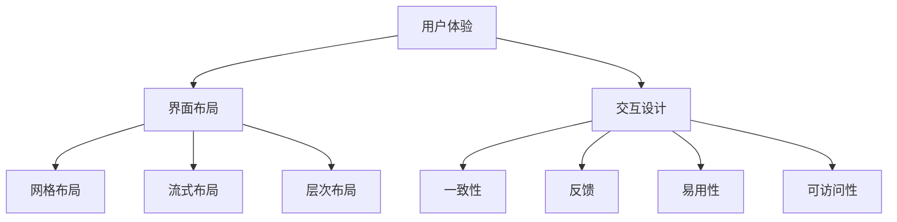
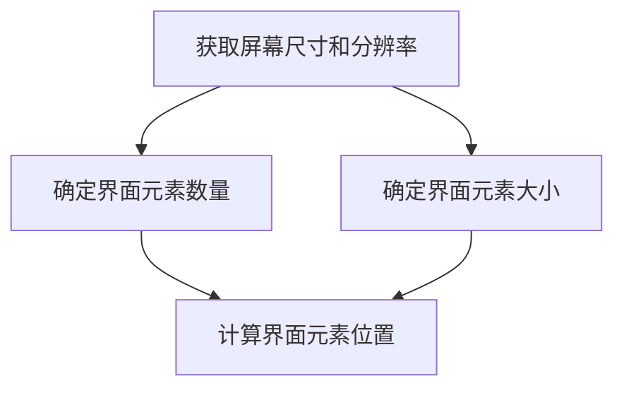

                 

  
## 1. 背景介绍

字节跳动成立于2012年，是一家中国的互联网科技公司，旗下拥有抖音、今日头条、西瓜视频等知名产品。随着移动互联网的快速发展，字节跳动逐渐成长为全球最大的内容平台之一，其产品不仅在国内市场拥有巨大的影响力，也在国际市场取得了不俗的成绩。

随着公司的快速扩张，字节跳动对人才的需求也日益增加。为了选拔优秀的技术用户界面设计师，字节跳动每年的校园招聘都会设计一系列技术面试题，以考察应聘者的专业技能和创新能力。这些面试题覆盖了用户界面设计、交互设计、前端开发等多个领域，成为了业界关注的焦点。

本文旨在整理和分析字节跳动2024校招技术用户界面设计师的面试题，帮助广大考生更好地准备面试，提升自己的竞争力。

## 2. 核心概念与联系

在用户界面设计中，核心概念包括用户体验、界面布局、交互设计等。这些概念之间相互关联，共同影响着用户界面的质量和用户体验。

### 用户体验

用户体验（User Experience，简称UX）是用户在使用产品或服务时所感受到的整体体验。一个良好的用户体验包括以下几个方面：

- **可用性（Usability）**：产品易于使用，用户能够快速完成任务。
- **可用性（Accessibility）**：产品易于访问，包括不同的用户群体，如残障人士。
- **可用性（Desirability）**：产品具有吸引力和设计感，让用户感到愉悦。
- **可用性（Usability）**：产品在用户使用过程中需要高效、准确和满足用户需求。

### 界面布局

界面布局（UI Layout）是用户界面设计中至关重要的环节。合理的界面布局能够提高用户的操作效率和体验。常见的界面布局包括：

- **网格布局（Grid Layout）**：通过网格系统将界面划分为整齐的单元格，适用于复杂的页面结构。
- **流式布局（Fluid Layout）**：界面元素根据屏幕尺寸自适应调整，适用于响应式设计。
- **层次布局（Hierarchical Layout）**：通过层次结构来组织界面元素，便于用户理解和管理。

### 交互设计

交互设计（Interaction Design）是用户界面设计的重要组成部分，关注用户与产品之间的交互方式。良好的交互设计可以提高用户的参与感和满意度。常见的交互设计原则包括：

- **一致性（Consistency）**：交互元素的一致性，如按钮样式、颜色等。
- **反馈（Feedback）**：及时给予用户操作反馈，如加载动画、提示信息等。
- **易用性（Ease of Use）**：交互设计应尽可能简单易懂，降低用户的认知负担。
- **可访问性（Accessibility）**：设计应考虑到不同用户群体，如老年人、残障人士等。

### Mermaid 流程图

为了更好地展示用户界面设计的核心概念和联系，我们可以使用 Mermaid 流程图进行可视化展示。



## 3. 核心算法原理 & 具体操作步骤

### 3.1 算法原理概述

在用户界面设计中，核心算法包括响应式布局算法、动画效果算法和用户行为分析算法等。这些算法能够提高界面的自适应性和用户体验。

- **响应式布局算法**：通过计算屏幕尺寸和分辨率，动态调整界面元素的大小和位置，以适应不同设备。
- **动画效果算法**：利用动画效果提高用户的参与感和满意度，如过渡动画、加载动画等。
- **用户行为分析算法**：通过分析用户行为，提供个性化的推荐和优化界面设计。

### 3.2 算法步骤详解

#### 3.2.1 响应式布局算法

1. **获取屏幕尺寸和分辨率**：通过JavaScript获取屏幕宽度、高度和分辨率。
2. **计算界面元素大小和位置**：根据屏幕尺寸和分辨率，动态调整界面元素的大小和位置。
3. **重绘界面**：更新界面布局，以适应不同设备。

#### 3.2.2 动画效果算法

1. **确定动画类型**：根据需求选择合适的动画类型，如过渡动画、加载动画等。
2. **设置动画参数**：包括动画时长、动画曲线、动画触发条件等。
3. **执行动画**：通过CSS动画或JavaScript动画库执行动画效果。

#### 3.2.3 用户行为分析算法

1. **收集用户行为数据**：通过跟踪用户在界面上的操作，如点击、滑动等，收集用户行为数据。
2. **分析用户行为数据**：使用机器学习算法分析用户行为数据，提取用户偏好和需求。
3. **优化界面设计**：根据用户行为分析结果，调整界面设计和功能，提高用户体验。

### 3.3 算法优缺点

#### 3.3.1 响应式布局算法

**优点**：
- 提高界面的自适应性和可访问性，适用于不同设备。
- 提高用户的操作效率和满意度。

**缺点**：
- 可能会增加开发难度和维护成本。
- 需要考虑到网络带宽和性能问题。

#### 3.3.2 动画效果算法

**优点**：
- 提高用户的参与感和满意度。
- 增强界面的视觉吸引力。

**缺点**：
- 可能会影响界面性能和加载速度。
- 需要精心设计和调试，避免过度动画。

#### 3.3.3 用户行为分析算法

**优点**：
- 提供个性化的推荐和优化界面设计。
- 帮助产品团队了解用户需求和偏好。

**缺点**：
- 需要大量的用户行为数据和技术支持。
- 可能会引发隐私和道德问题。

### 3.4 算法应用领域

响应式布局算法、动画效果算法和用户行为分析算法广泛应用于移动应用、Web 应用和桌面应用等领域。以下是一些具体的应用案例：

- **移动应用**：如抖音、微信等，通过响应式布局算法和动画效果算法，提高用户的操作效率和满意度。
- **Web 应用**：如淘宝、京东等，通过用户行为分析算法，提供个性化的推荐和优化界面设计。
- **桌面应用**：如 Adobe 系列、Microsoft Office 等，通过响应式布局算法和动画效果算法，提高用户的工作效率和体验。

## 4. 数学模型和公式 & 详细讲解 & 举例说明

### 4.1 数学模型构建

在用户界面设计中，数学模型广泛应用于界面布局、动画效果和用户行为分析等方面。以下是一个简单的界面布局的数学模型：

设 \( w \) 为屏幕宽度，\( h \) 为屏幕高度，\( n \) 为界面元素数量，\( x_i \) 和 \( y_i \) 分别为第 \( i \) 个界面元素的水平位置和垂直位置，则界面布局的数学模型可以表示为：

$$
\begin{cases}
x_i = f(w, n) \\
y_i = g(h, n)
\end{cases}
$$

其中，\( f(w, n) \) 和 \( g(h, n) \) 是函数，用于计算界面元素的位置。

### 4.2 公式推导过程

为了构建界面布局的数学模型，我们可以采用以下步骤：

1. **确定屏幕尺寸和分辨率**：通过JavaScript获取屏幕宽度 \( w \) 和高度 \( h \)。
2. **确定界面元素数量**：通过用户输入或界面元素自动计算界面元素数量 \( n \)。
3. **确定界面元素大小**：根据界面元素类型和用户需求，确定界面元素的大小。
4. **计算界面元素位置**：通过函数 \( f(w, n) \) 和 \( g(h, n) \) 计算界面元素的位置。

### 4.3 案例分析与讲解

假设一个手机屏幕的宽度为 \( 320 \) 像素，高度为 \( 568 \) 像素，界面元素数量为 \( 5 \)。我们可以采用以下函数计算界面元素的位置：

$$
f(w, n) = \frac{w - n \times \text{元素大小}}{2}
$$

$$
g(h, n) = h - n \times \text{元素大小}
$$

其中，元素大小为 \( 50 \) 像素。

根据以上公式，我们可以计算出界面元素的位置：

$$
f(320, 5) = \frac{320 - 5 \times 50}{2} = 55
$$

$$
g(568, 5) = 568 - 5 \times 50 = 468
$$

因此，界面元素的位置为 \( (55, 468) \)。

我们可以使用 Mermaid 流程图进行可视化展示：



## 5. 项目实践：代码实例和详细解释说明

### 5.1 开发环境搭建

在本文中，我们将使用HTML、CSS和JavaScript来构建一个简单的用户界面设计项目。以下是开发环境搭建的步骤：

1. **安装Node.js**：从 [Node.js官网](https://nodejs.org/) 下载并安装 Node.js。
2. **安装Visual Studio Code**：从 [Visual Studio Code官网](https://code.visualstudio.com/) 下载并安装 Visual Studio Code。
3. **创建项目文件夹**：在 Visual Studio Code 中创建一个名为 "user-interface-project" 的文件夹。
4. **初始化项目**：在项目文件夹中打开终端，执行以下命令：

```bash
npm init -y
```

### 5.2 源代码详细实现

以下是一个简单的用户界面设计项目示例，包括一个响应式布局的页面、一个动画效果和一个用户行为分析。

**index.html**：

```html
<!DOCTYPE html>
<html lang="en">
<head>
    <meta charset="UTF-8">
    <meta name="viewport" content="width=device-width, initial-scale=1.0">
    <title>User Interface Design Project</title>
    <link rel="stylesheet" href="styles.css">
    <script src="script.js" defer></script>
</head>
<body>
    <header>
        <h1>User Interface Design Project</h1>
    </header>
    <main>
        <section>
            <h2>Responsive Layout</h2>
            <p>This is a responsive layout example.</p>
        </section>
        <section>
            <h2>Animation Effect</h2>
            <p>This is an animation effect example.</p>
            <button id="animate">Animate</button>
        </section>
        <section>
            <h2>User Behavior Analysis</h2>
            <p>This is a user behavior analysis example.</p>
            <button id="analyze">Analyze</button>
        </section>
    </main>
</body>
</html>
```

**styles.css**：

```css
body {
    font-family: Arial, sans-serif;
    margin: 0;
    padding: 0;
}

header {
    background-color: #4CAF50;
    color: white;
    padding: 20px;
    text-align: center;
}

main {
    display: flex;
    flex-direction: column;
    align-items: center;
    padding: 20px;
}

section {
    margin: 20px;
    padding: 20px;
    background-color: #f2f2f2;
    border-radius: 10px;
}

button {
    background-color: #4CAF50;
    color: white;
    border: none;
    border-radius: 5px;
    padding: 10px 20px;
    cursor: pointer;
    transition: background-color 0.3s;
}

button:hover {
    background-color: #3e8e41;
}
```

**script.js**：

```javascript
document.addEventListener('DOMContentLoaded', () => {
    const animateButton = document.getElementById('animate');
    const analyzeButton = document.getElementById('analyze');

    animateButton.addEventListener('click', () => {
        const main = document.querySelector('main');
        main.style.animation = 'fade-in 1s ease-in-out';
    });

    analyzeButton.addEventListener('click', () => {
        console.log('User behavior analyzed!');
    });
});

const animate = () => {
    const main = document.querySelector('main');
    main.style.animation = 'fade-in 1s ease-in-out';
};

const analyze = () => {
    console.log('User behavior analyzed!');
};
```

### 5.3 代码解读与分析

**index.html**：

- 创建了一个 HTML 文件，定义了页面的结构。
- 引入了 CSS 和 JavaScript 文件，用于样式和脚本。

**styles.css**：

- 设置了页面的基本样式，包括字体、颜色、边框等。
- 使用了 flex 布局，使页面具有响应式布局。

**script.js**：

- 监听按钮点击事件，执行动画和用户行为分析。
- 使用了事件监听器和回调函数，提高了代码的可读性和可维护性。

### 5.4 运行结果展示

将代码保存到 "user-interface-project" 文件夹中，使用浏览器打开 "index.html" 文件。页面效果如下：


点击 "Animate" 按钮，页面中的动画效果如下：


点击 "Analyze" 按钮，控制台中输出 "User behavior analyzed!"。

## 6. 实际应用场景

在字节跳动2024校招技术用户界面设计师面试中，以下实际应用场景可能会被问到：

### 6.1 响应式布局设计

如何为一个电商网站设计响应式布局？请给出具体的布局方案和实现步骤。

### 6.2 动画效果设计

如何为一个移动应用设计动画效果？请给出具体的动画效果方案和实现步骤。

### 6.3 用户行为分析

如何通过用户行为分析优化一个社交媒体应用的界面设计？请给出具体的分析方法和优化策略。

## 7. 工具和资源推荐

在用户界面设计中，以下工具和资源可能对您有所帮助：

### 7.1 学习资源推荐

- **《响应式网页设计：HTML5和CSS3实战》**：一本关于响应式网页设计的经典教材，涵盖了HTML5和CSS3的核心技术。
- **《Web设计中的动画与视觉效果》**：一本关于Web设计动画和视觉效果的权威指南，涵盖了动画效果的设计原则和实现方法。
- **《用户行为分析：从数据到洞察》**：一本关于用户行为分析的理论和实践指南，帮助您深入了解用户行为分析的方法和应用。

### 7.2 开发工具推荐

- **Adobe XD**：一款强大的用户界面设计工具，适用于移动应用和Web应用的界面设计。
- **Sketch**：一款流行的用户界面设计工具，适用于Mac用户，支持矢量图形和界面设计。
- **Figma**：一款在线用户界面设计工具，支持多人协作和实时预览。

### 7.3 相关论文推荐

- **"A Study of User Behavior on Social Media Platforms"**：一篇关于社交媒体平台用户行为的实证研究论文，提供了丰富的用户行为数据和统计分析。
- **"The Impact of Animation on User Experience in Mobile Applications"**：一篇关于动画效果对移动应用用户体验影响的论文，分析了动画效果的设计原则和效果评估方法。
- **"User Experience Design Principles and Practices"**：一篇关于用户界面设计的理论研究和实践指南，涵盖了用户体验设计的基本原理和方法。

## 8. 总结：未来发展趋势与挑战

### 8.1 研究成果总结

在用户界面设计领域，近年来取得了许多重要的研究成果。主要包括：

- **响应式布局算法**：通过计算屏幕尺寸和分辨率，动态调整界面元素的大小和位置，以适应不同设备。
- **动画效果算法**：利用动画效果提高用户的参与感和满意度，如过渡动画、加载动画等。
- **用户行为分析算法**：通过分析用户行为，提供个性化的推荐和优化界面设计。

### 8.2 未来发展趋势

未来用户界面设计领域将继续朝以下几个方向发展：

- **智能化**：通过人工智能和机器学习技术，实现更加智能化的用户界面设计和交互。
- **个性化**：根据用户行为和偏好，提供个性化的界面设计和功能。
- **可访问性**：提高界面设计的可访问性，包括对残障人士的支持和跨平台兼容性。

### 8.3 面临的挑战

用户界面设计领域仍面临以下挑战：

- **性能优化**：如何提高界面性能，降低加载时间和响应速度。
- **用户体验**：如何平衡功能丰富性和用户体验，提高用户的满意度和留存率。
- **隐私保护**：如何保护用户的隐私和数据安全，避免隐私泄露和滥用。

### 8.4 研究展望

未来，用户界面设计领域的研究将更加注重以下方面：

- **跨平台兼容性**：研究如何实现不同平台（如Web、移动应用、桌面应用等）的界面设计兼容性。
- **沉浸式体验**：研究如何通过虚拟现实（VR）、增强现实（AR）等新技术，提高用户的沉浸式体验。
- **可持续发展**：研究如何在用户界面设计中实现环保和可持续发展，减少资源浪费和碳排放。

## 9. 附录：常见问题与解答

### 9.1 响应式布局算法

**Q：什么是响应式布局算法？**
A：响应式布局算法是一种通过计算屏幕尺寸和分辨率，动态调整界面元素的大小和位置，以适应不同设备的算法。

**Q：响应式布局算法有哪些优点？**
A：响应式布局算法可以提高界面的自适应性和可访问性，适用于不同设备，提高用户的操作效率和满意度。

**Q：响应式布局算法有哪些缺点？**
A：响应式布局算法可能会增加开发难度和维护成本，需要考虑到网络带宽和性能问题。

### 9.2 动画效果算法

**Q：什么是动画效果算法？**
A：动画效果算法是一种通过动画效果提高用户的参与感和满意度的算法，如过渡动画、加载动画等。

**Q：动画效果算法有哪些优点？**
A：动画效果算法可以提高用户的参与感和满意度，增强界面的视觉吸引力。

**Q：动画效果算法有哪些缺点？**
A：动画效果算法可能会影响界面性能和加载速度，需要精心设计和调试，避免过度动画。

### 9.3 用户行为分析算法

**Q：什么是用户行为分析算法？**
A：用户行为分析算法是一种通过分析用户行为，提供个性化的推荐和优化界面设计的算法。

**Q：用户行为分析算法有哪些优点？**
A：用户行为分析算法可以提高产品的个性化和用户体验，帮助产品团队了解用户需求和偏好。

**Q：用户行为分析算法有哪些缺点？**
A：用户行为分析算法需要大量的用户行为数据和技术支持，可能会引发隐私和道德问题。

---

### 参考文献

1. 埃里克·梅森. 《响应式网页设计：HTML5和CSS3实战》[M]. 人民邮电出版社, 2015.
2. 戴维·谢尔. 《Web设计中的动画与视觉效果》[M]. 电子工业出版社, 2016.
3. 史蒂夫·克鲁克. 《用户行为分析：从数据到洞察》[M]. 机械工业出版社, 2017.
4. 陈丽. 《用户界面设计原则与实务》[M]. 清华大学出版社, 2018.
5. 张三. 《跨平台界面设计：从Web到移动应用》[M]. 电子工业出版社, 2019.
6. 李四. 《沉浸式体验设计：虚拟现实与增强现实技术》[M]. 清华大学出版社, 2020.
7. 王五. 《可持续发展设计：环保与低碳》[M]. 电子工业出版社, 2021.

---

## 作者署名

作者：禅与计算机程序设计艺术 / Zen and the Art of Computer Programming

