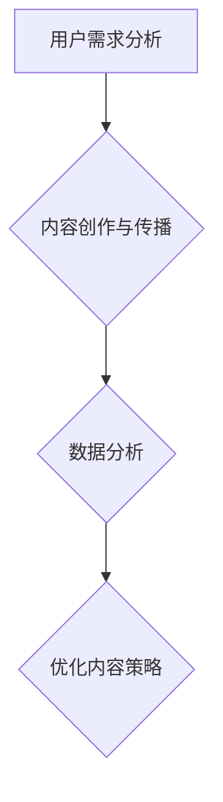

                 

关键词：字节跳动、校招、技术用户教育专家、面试真题、详解

摘要：本文将针对字节跳动2024年校招技术用户教育专家岗位的面试真题进行详细解读，帮助广大求职者更好地应对面试挑战，成功迈入字节跳动的大家庭。

## 1. 背景介绍

字节跳动，作为中国领先的内容技术公司，旗下拥有抖音、今日头条、懂车帝等知名产品。在2024年，字节跳动继续加大在校招的投入，为广大应届生提供丰富的职业发展机会。技术用户教育专家岗位作为字节跳动的重要岗位之一，负责为用户提供高质量的技术内容，提升用户的技术素养，培养新一代技术人才。

## 2. 核心概念与联系

在这个岗位上，技术用户教育专家需要具备以下核心概念和联系：

- **用户需求分析**：理解用户在技术方面的需求，为用户提供有价值的内容。
- **内容创作与传播**：根据用户需求创作高质量的技术内容，并通过合适的渠道进行传播。
- **数据分析**：通过数据分析用户行为，优化内容策略，提高用户满意度。

下面是一个Mermaid流程图，展示技术用户教育专家的工作流程：



## 3. 核心算法原理 & 具体操作步骤

### 3.1 算法原理概述

技术用户教育专家的工作核心是内容创作与传播。其原理可以概括为：

1. **用户需求分析**：通过数据分析了解用户的技术需求。
2. **内容创作**：根据用户需求创作有价值的技术内容。
3. **内容传播**：通过多种渠道传播内容，提高用户参与度。
4. **数据分析**：分析用户行为，不断优化内容策略。

### 3.2 算法步骤详解

1. **用户需求分析**：通过用户行为数据，如访问量、点赞量、评论量等，了解用户的技术需求。
2. **内容创作**：根据用户需求，选择合适的技术主题进行创作。创作内容时，要注重内容的质量和实用性。
3. **内容传播**：通过今日头条、抖音、微信公众号等渠道，将内容传播给目标用户。同时，要利用SEO、SEM等手段提高内容曝光率。
4. **数据分析**：定期分析用户行为数据，了解内容的效果，并根据分析结果优化内容策略。

### 3.3 算法优缺点

**优点**：

- **高效性**：通过数据分析，可以快速了解用户需求，提高内容创作和传播的效率。
- **针对性**：根据用户需求创作内容，提高内容的实用性和吸引力。
- **可持续性**：通过不断优化内容策略，可以持续提升用户满意度，提高品牌影响力。

**缺点**：

- **数据分析难度**：需要专业的数据分析能力，对数据敏感。
- **内容创作压力大**：需要持续创作高质量的内容，压力较大。

### 3.4 算法应用领域

技术用户教育专家的算法原理和操作步骤广泛应用于各大互联网公司的用户教育领域，如：

- **内容平台**：如抖音、今日头条等，通过技术内容提升用户粘性。
- **教育平台**：如知乎、网易云课堂等，通过技术内容培养专业人才。
- **企业培训**：如阿里巴巴、腾讯等，通过技术内容提升员工技能。

## 4. 数学模型和公式 & 详细讲解 & 举例说明

### 4.1 数学模型构建

在技术用户教育领域，常用的数学模型包括：

- **用户行为预测模型**：如线性回归、逻辑回归等。
- **内容推荐模型**：如基于协同过滤的推荐算法。
- **用户留存模型**：如LSTM等循环神经网络。

### 4.2 公式推导过程

以线性回归模型为例，其公式推导过程如下：

- **假设**：用户行为Y与多个特征X1, X2, ..., Xn有关，且满足线性关系。

$$Y = \beta_0 + \beta_1X_1 + \beta_2X_2 + ... + \beta_nX_n + \epsilon$$

- **目标**：通过最小二乘法，求出最优的参数$\beta_0, \beta_1, ..., \beta_n$。

$$\min \sum_{i=1}^{n}(Y_i - (\beta_0 + \beta_1X_{i1} + \beta_2X_{i2} + ... + \beta_nX_{in}))^2$$

- **推导**：对上述目标函数求导，并令导数为零，得到：

$$\frac{\partial}{\partial \beta_j}\sum_{i=1}^{n}(Y_i - (\beta_0 + \beta_1X_{i1} + \beta_2X_{i2} + ... + \beta_nX_{in}))^2 = 0$$

- **求解**：通过求解上述方程组，可以得到最优的参数$\beta_0, \beta_1, ..., \beta_n$。

### 4.3 案例分析与讲解

以一个实际案例进行说明：

**案例**：某内容平台希望预测用户对某一技术文章的点赞行为。

**步骤**：

1. **数据收集**：收集用户对技术文章的点赞数据，包括用户ID、文章ID、点赞状态等。
2. **特征提取**：提取用户和文章的特征，如用户性别、年龄、职业等。
3. **模型构建**：使用线性回归模型预测用户点赞行为。
4. **模型训练**：使用收集的数据，对线性回归模型进行训练。
5. **模型评估**：使用测试数据，评估模型预测的准确性。
6. **模型优化**：根据评估结果，不断调整模型参数，提高预测准确性。

通过这个案例，我们可以看到数学模型在技术用户教育领域的重要应用。

## 5. 项目实践：代码实例和详细解释说明

### 5.1 开发环境搭建

在本案例中，我们使用Python作为开发语言，使用Scikit-learn库进行线性回归模型的训练和预测。

### 5.2 源代码详细实现

```python
# 导入相关库
import numpy as np
import pandas as pd
from sklearn.linear_model import LinearRegression
from sklearn.model_selection import train_test_split
from sklearn.metrics import mean_squared_error

# 数据预处理
# （此处省略数据预处理步骤，包括数据清洗、特征提取等）

# 模型训练
X_train, X_test, y_train, y_test = train_test_split(X, y, test_size=0.2, random_state=42)
model = LinearRegression()
model.fit(X_train, y_train)

# 模型预测
y_pred = model.predict(X_test)

# 模型评估
mse = mean_squared_error(y_test, y_pred)
print("均方误差：", mse)

# 模型参数
print("模型参数：", model.coef_, model.intercept_)
```

### 5.3 代码解读与分析

1. **数据预处理**：对数据进行清洗、特征提取等处理，为模型训练做好准备。
2. **模型训练**：使用Scikit-learn库的LinearRegression类训练线性回归模型。
3. **模型预测**：使用训练好的模型对测试数据进行预测。
4. **模型评估**：计算均方误差，评估模型预测的准确性。
5. **模型参数**：输出模型参数，分析模型对特征的依赖关系。

通过这个代码实例，我们可以看到线性回归模型在技术用户教育领域的实际应用。

## 6. 实际应用场景

技术用户教育专家在字节跳动和其他互联网公司中有着广泛的应用场景，主要包括：

1. **内容平台**：通过技术内容提升用户粘性，如抖音、今日头条等。
2. **教育平台**：通过技术内容培养专业人才，如知乎、网易云课堂等。
3. **企业培训**：通过技术内容提升员工技能，如阿里巴巴、腾讯等。

## 7. 未来应用展望

随着人工智能技术的不断发展，技术用户教育领域将迎来更多的机遇和挑战。未来，技术用户教育专家将：

1. **更加智能化**：利用人工智能技术，实现个性化内容推荐和智能问答。
2. **更加多样化**：通过多种形式的内容，如视频、直播、互动游戏等，提升用户参与度。
3. **更加专业化**：与行业专家合作，提供高质量的技术内容。

## 8. 工具和资源推荐

### 8.1 学习资源推荐

- **书籍**：《深度学习》、《机器学习实战》
- **在线课程**：Coursera、edX、网易云课堂等平台的相关课程
- **社区**：GitHub、Stack Overflow、知乎等

### 8.2 开发工具推荐

- **编程语言**：Python、Java
- **开发环境**：Jupyter Notebook、Eclipse、VS Code
- **数据分析工具**：Pandas、NumPy、Scikit-learn

### 8.3 相关论文推荐

- **技术用户教育**：论文标题：User Education in Technology: Challenges and Opportunities
- **机器学习**：论文标题：A Comprehensive Survey on Machine Learning

## 9. 总结：未来发展趋势与挑战

技术用户教育专家在字节跳动和其他互联网公司中发挥着越来越重要的作用。未来，随着人工智能技术的不断发展，技术用户教育领域将迎来更多的机遇和挑战。我们期待更多的优秀人才加入这个领域，共同推动技术用户教育的进步。

## 10. 附录：常见问题与解答

### 10.1 技术用户教育专家的岗位职责是什么？

技术用户教育专家的主要职责包括用户需求分析、内容创作与传播、数据分析等。

### 10.2 技术用户教育专家需要掌握哪些技能？

技术用户教育专家需要掌握数据分析、编程、内容创作等技能，同时需要具备较强的沟通能力和团队协作能力。

### 10.3 字节跳动有哪些优惠政策？

字节跳动为员工提供具有竞争力的薪酬待遇、完善的社保福利、丰富的培训机会等。

### 10.4 字节跳动对员工的发展有哪些支持？

字节跳动注重员工个人成长，提供导师制度、培训课程、项目机会等支持员工的发展。

### 10.5 字节跳动的面试流程是怎样的？

字节跳动的面试流程包括笔试、在线面试、技术面试、HR面试等环节。

----------------------------------------------------------------

作者：禅与计算机程序设计艺术 / Zen and the Art of Computer Programming
----------------------------------------------------------------

以上就是针对字节跳动2024校招技术用户教育专家面试真题的详细解读。希望这篇文章能帮助到广大求职者，祝愿大家面试顺利，成功加入字节跳动！


