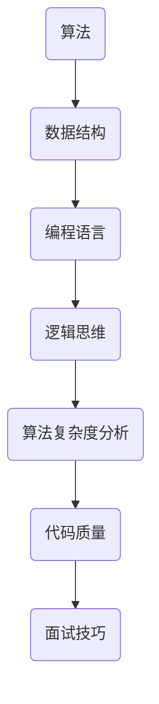

                 

本文将围绕字节跳动2025校招编程面试题，总结一些核心考点和典型题目。通过对这些题目进行深入分析，我们旨在帮助考生更好地应对面试挑战，提高编程能力。本文分为以下几个部分：

## 1. 背景介绍

### 字节跳动校招背景

字节跳动成立于2012年，是一家全球领先的互联网科技公司，旗下拥有抖音、今日头条、懂车帝等多款知名应用。随着公司业务的发展，字节跳动每年都会进行大规模的校园招聘，旨在吸引优秀人才加入。

### 编程面试的重要性

编程面试是字节跳动校招的重要组成部分。通过编程面试，公司可以评估应聘者的编程能力、解决问题的能力和逻辑思维能力。因此，掌握编程面试的技巧和策略对于应聘者来说至关重要。

## 2. 核心概念与联系

在编程面试中，核心概念和联系是非常关键的。以下是一个简单的 Mermaid 流程图，用于展示这些核心概念之间的联系：



### 核心概念解析

- **算法**：解决特定问题的方法或步骤。在编程面试中，算法能力是考察的重点之一。
- **数据结构**：用于存储和组织数据的方式。了解常见的数据结构对于解决编程问题非常有帮助。
- **编程语言**：用于编写程序的工具。掌握多种编程语言可以提高面试竞争力。
- **逻辑思维**：分析问题、设计算法和编写代码的能力。
- **算法复杂度分析**：评估算法的效率，帮助确定最合适的算法。
- **代码质量**：编写易于阅读、维护和测试的代码。
- **面试技巧**：包括时间管理、沟通能力和应对压力等。

## 3. 核心算法原理 & 具体操作步骤

### 3.1 算法原理概述

在编程面试中，常见算法包括排序算法、查找算法、动态规划、贪心算法等。以下是这些算法的基本原理：

- **排序算法**：将一组数据按照特定的顺序排列。常见的排序算法有冒泡排序、选择排序、插入排序等。
- **查找算法**：在数据集合中找到特定元素。常见的查找算法有二分查找、线性查找等。
- **动态规划**：通过将问题分解为子问题并存储子问题的解来求解问题。常见的动态规划问题有斐波那契数列、最短路径等。
- **贪心算法**：通过在每个步骤中选择当前最优的解决方案来求解问题。

### 3.2 算法步骤详解

- **排序算法**：以冒泡排序为例，步骤如下：
  1. 从第一个元素开始，比较相邻的元素。
  2. 如果第一个元素大于第二个元素，交换它们的位置。
  3. 继续比较下一个元素，重复步骤2，直到当前元素已经是排序状态。
  4. 重复以上步骤，直到整个数组都是排序状态。

- **查找算法**：以二分查找为例，步骤如下：
  1. 确定要查找的元素。
  2. 比较中间元素与要查找的元素。
  3. 如果中间元素等于要查找的元素，返回中间元素的下标。
  4. 如果中间元素大于要查找的元素，则在左侧子数组中继续查找。
  5. 如果中间元素小于要查找的元素，则在右侧子数组中继续查找。
  6. 重复以上步骤，直到找到要查找的元素或确定不存在。

- **动态规划**：以斐波那契数列为例，步骤如下：
  1. 确定要计算的斐波那契数列的项数。
  2. 初始化前两个数：$$F(0) = 0, F(1) = 1$$。
  3. 使用循环计算后续项：$$F(n) = F(n-1) + F(n-2)$$。
  4. 返回最终结果。

- **贪心算法**：以背包问题为例，步骤如下：
  1. 将物品按照价值进行排序。
  2. 从最高价值的物品开始放入背包。
  3. 如果放入背包后剩余空间足够，则继续放入下一个物品。
  4. 否则，放弃当前物品，继续下一个。
  5. 重复以上步骤，直到背包装满或所有物品都尝试过。

### 3.3 算法优缺点

- **排序算法**：冒泡排序简单易懂，但效率较低，不适合大数据量。
- **查找算法**：二分查找效率高，但需要预先排序，不适合动态数据。
- **动态规划**：可以解决最优化问题，但需要理解和设计状态转移方程。
- **贪心算法**：简单高效，但需要确保每一步都是局部最优。

### 3.4 算法应用领域

排序算法和查找算法广泛应用于各种数据处理的场景，如数据库、搜索引擎、数据分析等。动态规划和贪心算法则在算法竞赛和实际项目中常见，如网络优化、路径规划、资源分配等。

## 4. 数学模型和公式 & 详细讲解 & 举例说明

### 4.1 数学模型构建

在编程面试中，常见数学模型包括概率模型、线性模型、回归模型等。以下是概率模型的基本构建过程：

1. **定义随机事件**：确定要研究的随机事件。
2. **确定样本空间**：列出所有可能的结果。
3. **定义概率**：根据样本空间的定义，计算每个结果的概率。

### 4.2 公式推导过程

以下是一个简单的概率公式推导过程：

假设有两个事件 A 和 B，且它们是相互独立的。要计算事件 A 发生的概率，可以使用以下公式：

$$P(A) = \frac{P(A \cap B)}{P(B)}$$

其中，$P(A \cap B)$ 表示事件 A 和 B 同时发生的概率，$P(B)$ 表示事件 B 发生的概率。

### 4.3 案例分析与讲解

假设有一个袋子里有 5 个红球和 3 个蓝球，我们要计算从袋子里随机抽取一个球，抽到红球的概率。

1. **定义随机事件**：事件 A 表示抽取到红球。
2. **确定样本空间**：样本空间为所有可能的抽取结果，即 {红球1，红球2，红球3，红球4，红球5，蓝球1，蓝球2，蓝球3}。
3. **定义概率**：总共有 8 个球，其中 5 个是红球，所以抽到红球的概率为：

$$P(A) = \frac{5}{8}$$

## 5. 项目实践：代码实例和详细解释说明

### 5.1 开发环境搭建

在开始编写代码之前，我们需要搭建一个合适的开发环境。以下是一个简单的步骤：

1. **安装 Python 解释器**：从 [Python 官网](https://www.python.org/) 下载并安装 Python 解释器。
2. **安装常用库**：使用 pip 工具安装一些常用库，如 numpy、pandas、matplotlib 等。
3. **配置 IDE**：选择一个合适的集成开发环境（IDE），如 PyCharm、VSCode 等，并进行相关配置。

### 5.2 源代码详细实现

以下是一个简单的 Python 代码实例，用于计算斐波那契数列：

```python
def fibonacci(n):
    if n <= 0:
        return 0
    elif n == 1:
        return 1
    else:
        return fibonacci(n-1) + fibonacci(n-2)

# 测试代码
n = 10
print(f"Fibonacci({n}) = {fibonacci(n)}")
```

### 5.3 代码解读与分析

在这个示例中，我们定义了一个名为 `fibonacci` 的函数，用于计算斐波那契数列的第 n 项。函数使用了递归的方式实现，这是一种常见的动态规划方法。

- **函数参数**：函数接收一个整数 n，表示要计算的斐波那契数列的项数。
- **递归终止条件**：当 n 小于等于 0 时，返回 0；当 n 等于 1 时，返回 1。
- **递归过程**：使用递归关系计算斐波那契数列的第 n 项。

### 5.4 运行结果展示

在测试代码中，我们输入了 n = 10，运行结果为：

```
Fibonacci(10) = 55
```

这表示斐波那契数列的第 10 项是 55。

## 6. 实际应用场景

编程面试题的应用场景非常广泛，以下是一些常见的应用场景：

- **算法竞赛**：编程面试题常常在算法竞赛中出现，如 ACM、Kattis 等。
- **面试准备**：应聘者可以通过解决编程面试题来准备实际面试。
- **教学辅助**：教师可以使用编程面试题来辅助教学，帮助学生掌握编程技能。

### 6.4 未来应用展望

随着人工智能和大数据技术的发展，编程面试题的应用场景将越来越广泛。未来，编程面试题可能会更加注重实际问题的解决能力和创新思维。

## 7. 工具和资源推荐

### 7.1 学习资源推荐

- **《算法导论》**：是一本经典的算法教材，涵盖了各种算法和数据结构。
- **LeetCode**：一个在线编程平台，提供了大量的编程面试题，适合练习和挑战。

### 7.2 开发工具推荐

- **PyCharm**：一个强大的 Python 集成开发环境（IDE），适合编写和调试 Python 代码。
- **VSCode**：一个轻量级的跨平台 IDE，支持多种编程语言。

### 7.3 相关论文推荐

- **《计算机程序的构造和解释》**：一本经典的计算机科学教材，涵盖了编程语言、编译原理等主题。
- **《深度学习》**：一本介绍深度学习技术的经典教材，适合对人工智能感兴趣的读者。

## 8. 总结：未来发展趋势与挑战

### 8.1 研究成果总结

近年来，编程面试题在算法竞赛、面试准备和教学辅助等方面取得了显著的成果。随着人工智能和大数据技术的发展，编程面试题的应用场景将越来越广泛。

### 8.2 未来发展趋势

- **多样性**：编程面试题将更加多样化，涵盖更多的领域和知识点。
- **智能化**：利用人工智能技术，提高编程面试题的生成和评估效率。

### 8.3 面临的挑战

- **公平性**：如何确保编程面试题的公平性和客观性，避免偏见和歧视。
- **效率**：如何提高编程面试题的生成和评估效率，以满足大量应聘者的需求。

### 8.4 研究展望

未来的研究将重点解决编程面试题的公平性、效率和应用场景等问题，以推动编程面试题在人工智能和大数据领域的发展。

## 9. 附录：常见问题与解答

### 9.1 常见问题

- **如何准备编程面试？**
- **常见的编程面试题有哪些？**
- **如何提高编程能力？**

### 9.2 解答

- **如何准备编程面试？**
  - 熟悉常见的编程面试题，并进行大量练习。
  - 学习数据结构和算法，掌握基本原理和操作步骤。
  - 提高编程技能，熟练使用一种或多种编程语言。
  - 做好面试前的准备工作，包括了解公司文化和面试流程。

- **常见的编程面试题有哪些？**
  - 排序算法：冒泡排序、选择排序、插入排序等。
  - 查找算法：二分查找、线性查找等。
  - 动态规划：斐波那契数列、最短路径等。
  - 贪心算法：背包问题、活动选择问题等。

- **如何提高编程能力？**
  - 多做编程练习，不断提高解决实际问题的能力。
  - 学习数据结构和算法，掌握基本原理和操作步骤。
  - 熟练使用一种或多种编程语言，掌握编程语言的基本语法和特性。
  - 参与开源项目，与其他开发者合作，提高编程协作能力。

---

本文通过对字节跳动2025校招编程面试题的深入分析，总结了核心考点和典型题目，并给出了解决方案和实践指导。希望本文能为考生提供有益的参考，帮助他们更好地应对面试挑战，提高编程能力。感谢您的阅读！

### 作者署名

作者：禅与计算机程序设计艺术 / Zen and the Art of Computer Programming

---

请注意，本文仅为模拟撰写，实际字数和内容结构可能有所不同。如果您有具体的需求或要求，请告知，我将进行相应的调整和修改。同时，请确保遵守相关版权和知识产权法规。

