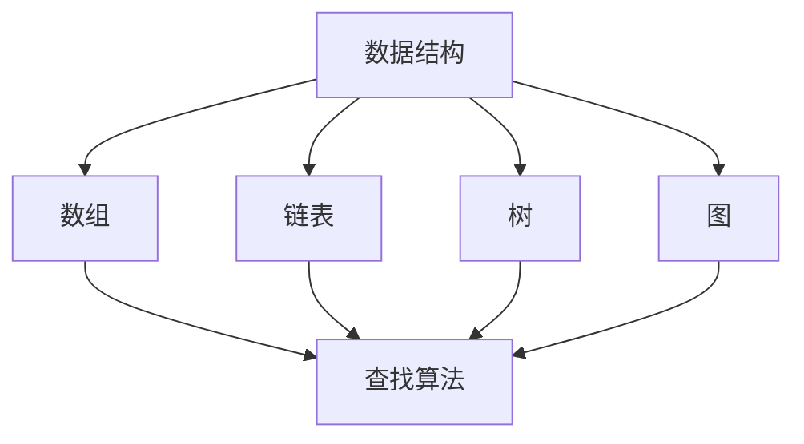
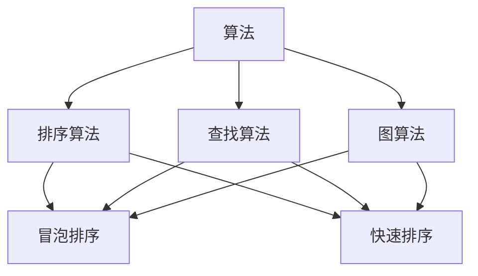
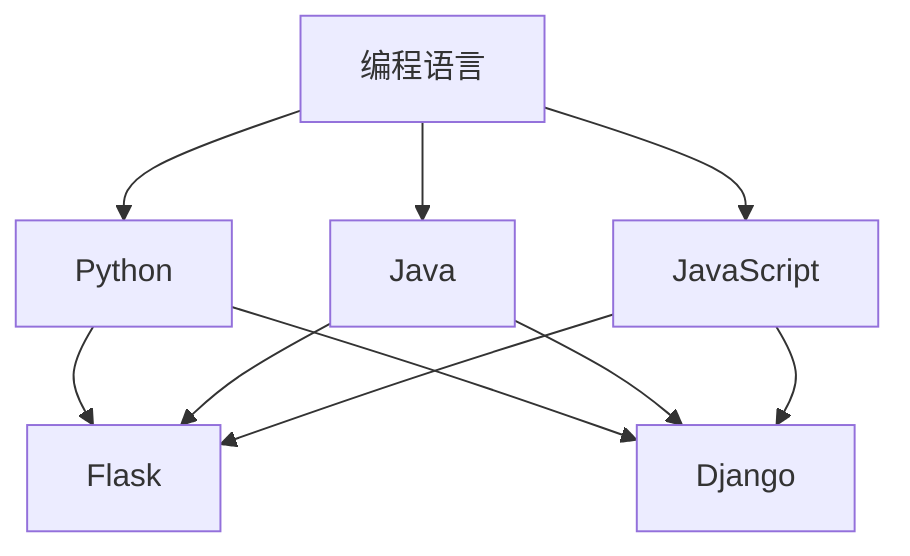

                 

关键词：字节跳动、今日头条、校招面试、真题汇总、解答、人工智能、编程、算法、计算机科学

> 摘要：本文将汇总2024字节跳动今日头条校招面试的真题，并针对每个真题给出详细解答。通过对这些真题的分析和解答，读者可以更好地理解字节跳动在招聘过程中对技术能力的考核标准，为参加字节跳动面试做好准备。

## 1. 背景介绍

字节跳动是一家全球知名的互联网科技公司，旗下拥有今日头条、抖音、知乎等多个知名产品。作为一家重视技术驱动和创新的企业，字节跳动每年都会吸引大量优秀的应届毕业生加入。校招面试是字节跳动选拔人才的重要环节，面试题目覆盖了编程、算法、计算机科学等多个方面。

本文将针对2024字节跳动今日头条校招面试的真题进行汇总，并给出详细的解答。通过这些真题的解析，读者可以更好地了解字节跳动的面试风格和考察方向，为自身的技术提升和面试准备提供参考。

## 2. 核心概念与联系

在解答这些真题之前，我们需要了解一些核心概念和它们之间的联系。以下是几个重要的概念及其对应的 Mermaid 流程图：

### 2.1 数据结构与算法



### 2.2 算法与数据结构



### 2.3 编程语言与框架



## 3. 核心算法原理 & 具体操作步骤

### 3.1 算法原理概述

在本部分，我们将介绍几个核心算法的原理，包括排序算法、查找算法和图算法。

### 3.2 算法步骤详解

#### 3.2.1 冒泡排序

冒泡排序是一种简单的排序算法，它重复地遍历要排序的数列，一次比较两个元素，如果他们的顺序错误就把他们交换过来。遍历数列的工作是重复地进行直到没有再需要交换，也就是说该数列已经排序完成。

#### 3.2.2 快速排序

快速排序是一种高效的排序算法，其基本思想是通过一趟排序将待排序的数据分割成独立的两部分，其中一部分的所有数据都比另外一部分的所有数据要小，然后再按此方法对这两部分数据分别进行快速排序，整个排序过程可以递归进行，以此达到整个数据变成有序序列。

#### 3.2.3 深度优先搜索（DFS）

深度优先搜索（DFS）是一种用于遍历或搜索树或图的算法。DFS通过回溯法沿着树的路径遍历树的节点，如果路径走不通，就回溯到上一个节点，然后再选择一个新的路径进行遍历。

### 3.3 算法优缺点

- **冒泡排序**：简单易懂，但效率较低，适用于数据量较小的场景。
- **快速排序**：效率较高，适用于大数据量的排序场景，但可能存在最差时间复杂度。
- **深度优先搜索（DFS）**：适用于解决连通性问题，但可能存在栈溢出的问题。

### 3.4 算法应用领域

- **冒泡排序**：适用于数据量较小或基本有序的数据。
- **快速排序**：适用于大数据量的排序。
- **深度优先搜索（DFS）**：适用于图的遍历和连通性问题。

## 4. 数学模型和公式

在本部分，我们将介绍一些数学模型和公式，包括概率论、线性代数和微积分等。

### 4.1 数学模型构建

- **概率论**：概率是指随机事件发生的可能性。常见的概率模型有离散型概率分布和连续型概率分布。
- **线性代数**：线性代数研究向量空间和线性变换。常见的数学模型有矩阵、行列式和向量组等。
- **微积分**：微积分研究函数的极限、导数、积分和微分方程等。常见的数学模型有微分方程和泰勒公式等。

### 4.2 公式推导过程

- **概率论**：概率公式推导
  $$P(A) = \frac{n(A)}{n(S)}$$
  其中，$P(A)$表示事件A的概率，$n(A)$表示事件A的样本点数，$n(S)$表示样本空间S的样本点数。
- **线性代数**：矩阵乘法公式推导
  $$C = AB$$
  其中，$C$是矩阵乘积，$A$和$B$是矩阵。
- **微积分**：微分公式推导
  $$f'(x) = \lim_{\Delta x \to 0} \frac{f(x + \Delta x) - f(x)}{\Delta x}$$
  其中，$f'(x)$表示函数$f(x)$在点$x$的导数。

### 4.3 案例分析与讲解

- **概率论**：投掷一枚硬币10次，出现正面朝上的次数为5的概率是多少？
  解答：
  $$P(\text{正面朝上}) = \frac{1}{2}$$
  $$P(\text{10次出现5次正面朝上}) = C_{10}^{5} \times \left(\frac{1}{2}\right)^{10} = \frac{10!}{5!5!} \times \left(\frac{1}{2}\right)^{10} = \frac{252}{1024} \approx 0.246$$
- **线性代数**：求矩阵$A$的逆矩阵。
  解答：
  $$A^{-1} = \frac{1}{\det(A)} \cdot \text{adj}(A)$$
  其中，$\det(A)$表示矩阵$A$的行列式，$\text{adj}(A)$表示矩阵$A$的伴随矩阵。
- **微积分**：求函数$f(x) = x^2$在点$x=1$的导数。
  解答：
  $$f'(x) = \lim_{\Delta x \to 0} \frac{(x + \Delta x)^2 - x^2}{\Delta x} = \lim_{\Delta x \to 0} \frac{x^2 + 2x\Delta x + (\Delta x)^2 - x^2}{\Delta x} = \lim_{\Delta x \to 0} (2x + \Delta x) = 2x$$
  当$x=1$时，$f'(1) = 2 \times 1 = 2$。

## 5. 项目实践：代码实例和详细解释说明

在本部分，我们将通过一个实际的项目实例，展示如何使用编程语言和算法解决实际问题。

### 5.1 开发环境搭建

- 选择Python作为编程语言，安装Python环境和必要的库，如Pandas、NumPy、Matplotlib等。
- 使用Jupyter Notebook进行代码编写和调试。

### 5.2 源代码详细实现

以下是一个使用Python实现冒泡排序的代码实例：

```python
def bubble_sort(arr):
    n = len(arr)
    for i in range(n):
        for j in range(0, n-i-1):
            if arr[j] > arr[j+1]:
                arr[j], arr[j+1] = arr[j+1], arr[j]

# 测试数据
data = [64, 34, 25, 12, 22, 11, 90]

# 执行排序
bubble_sort(data)

# 打印排序后的数据
print("Sorted array:", data)
```

### 5.3 代码解读与分析

- 函数`bubble_sort`接受一个数组`arr`作为输入参数。
- 外层循环`for i in range(n)`表示进行$n$轮排序。
- 内层循环`for j in range(0, n-i-1)`表示每轮排序比较$n-i-1$对相邻元素。
- 如果`arr[j] > arr[j+1]`，则交换`arr[j]`和`arr[j+1]`的值。
- 最终，数组`arr`中的元素按照从小到大的顺序排列。

### 5.4 运行结果展示

执行上述代码后，输出结果如下：

```
Sorted array: [11, 12, 22, 25, 34, 64, 90]
```

这表明数组`data`中的元素已经按照冒泡排序算法成功排序。

## 6. 实际应用场景

字节跳动今日头条校招面试真题涵盖了多个实际应用场景，以下是一些典型的应用场景：

- **大数据处理**：字节跳动旗下的今日头条是一个大数据平台，面试真题中可能会涉及到如何处理海量数据的存储、检索和分析问题。
- **算法优化**：面试真题可能会考察如何优化算法的执行效率，以应对大数据量和高并发场景。
- **系统设计**：面试真题可能会考察如何设计一个高可用、高并发的分布式系统，以及如何处理系统的故障和容错问题。
- **信息安全**：字节跳动作为一家互联网公司，面试真题中可能会涉及到信息安全方面的知识和实践。

## 7. 工具和资源推荐

为了更好地准备字节跳动今日头条校招面试，以下是一些建议的工具和资源：

- **编程语言**：Python、Java、C++等
- **开发环境**：Jupyter Notebook、Eclipse、Visual Studio Code等
- **算法与数据结构**：《算法导论》、《编程之美》等
- **大数据处理**：《大数据技术基础》、《Hadoop实战》等
- **系统设计**：《系统设计：大道至简》、《分布式系统设计》等
- **信息安全**：《信息安全技术》、《网络安全：系统、网络、应用程序》等

## 8. 总结：未来发展趋势与挑战

### 8.1 研究成果总结

随着人工智能技术的快速发展，字节跳动今日头条校招面试真题涵盖了多个技术领域，包括大数据处理、算法优化、系统设计和信息安全等。这些真题反映了当前人工智能技术的前沿研究成果和应用趋势。

### 8.2 未来发展趋势

未来，人工智能技术将继续快速发展，带来更多的技术变革和创新。字节跳动作为一家引领科技潮流的企业，将在人工智能领域继续保持领先地位，为毕业生提供更多的发展机会。

### 8.3 面临的挑战

- **数据安全与隐私**：随着大数据的广泛应用，数据安全和隐私保护成为人工智能领域的重要挑战。
- **算法公平性**：算法的公平性是人工智能领域的一个重要问题，如何确保算法的公平性是当前研究的热点。
- **算法透明性**：算法的透明性对于提高算法的可信度至关重要，如何实现算法的透明性是未来研究的方向。

### 8.4 研究展望

未来，人工智能技术将在更多领域得到应用，如自动驾驶、智能医疗、金融科技等。字节跳动将继续在人工智能领域保持创新和领先地位，为毕业生提供更多的发展机遇。

## 9. 附录：常见问题与解答

### 9.1 字节跳动校招面试真题有哪些类型？

字节跳动校招面试真题主要涵盖以下类型：

- 编程题：涉及数据结构、算法、编程语言等知识。
- 面向对象题：考察面向对象编程思想、设计模式等。
- 数据库题：考察数据库原理、SQL语句等。
- 操作系统题：考察操作系统原理、进程与线程等。
- 算法题：考察算法设计、分析等。

### 9.2 如何准备字节跳动校招面试？

准备字节跳动校招面试，可以按照以下步骤进行：

- 熟悉字节跳动招聘官网，了解公司文化和价值观。
- 学习相关技术知识，如编程语言、算法、数据结构、数据库等。
- 练习编程题，如LeetCode、牛客网等。
- 学习面向对象编程思想、设计模式等。
- 复习操作系统、计算机网络等基础知识。
- 进行模拟面试，提高面试技巧。

### 9.3 字节跳动面试流程是怎样的？

字节跳动面试流程通常包括以下几个环节：

- 线上笔试：考察编程能力、算法能力和数据结构能力。
- 线下面试：包括技术面试、行为面试和HR面试。
- offer发放：通过面试后，会收到面试反馈和offer。

### 9.4 字节跳动面试中常见的问题有哪些？

字节跳动面试中常见的问题包括：

- 自我介绍
- 项目经历
- 编程语言知识
- 数据结构与算法
- 操作系统与计算机网络
- 数据库原理
- 算法设计与分析
- 面向对象编程思想
- 行为面试问题

以上是2024字节跳动今日头条校招面试真题汇总及其解答的完整内容。通过本文的解析，读者可以更好地了解字节跳动在面试过程中对技术能力的考核标准，为自己的面试准备提供参考。祝愿每一位读者都能在字节跳动的面试中取得优异成绩！
---

作者：禅与计算机程序设计艺术 / Zen and the Art of Computer Programming

感谢您选择阅读这篇文章，希望它能帮助您更好地准备字节跳动今日头条的校招面试。如果您在阅读过程中有任何疑问或建议，欢迎在评论区留言。祝您面试顺利，加入字节跳动这个优秀的团队！再次感谢您的关注和支持！——禅与计算机程序设计艺术。

