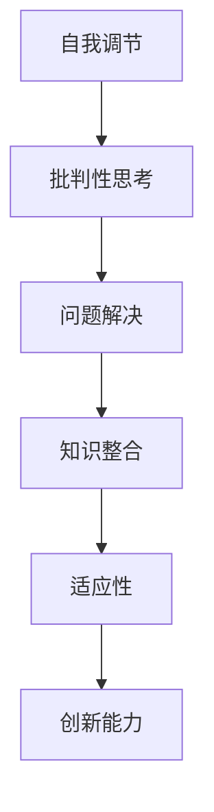

                 

关键词：元技能、知识获取、学习策略、认知心理学、算法优化、技术实践

> 摘要：本文探讨了元技能在知识获取过程中的关键作用。通过分析认知心理学的相关理论和实践案例，本文阐述了如何利用元技能提升学习效率，优化算法设计，并展望了其在未来技术发展中的应用前景。

## 1. 背景介绍

在信息技术迅猛发展的今天，知识的获取和利用成为个人和组织的核心竞争力。然而，面对海量的信息和复杂的技术，如何高效地获取、处理和运用知识成为一个亟待解决的问题。元技能（Meta-Skills），作为知识获取过程中的核心能力，正在逐渐受到关注。

### 1.1 元技能的定义

元技能是指个体在学习和应用知识过程中所具备的自我调节、批判性思考、问题解决等能力。它不仅包括对学习方法和策略的掌握，还涉及对知识体系的整体理解和运用。

### 1.2 元技能的重要性

元技能在知识获取过程中具有至关重要的作用。首先，它帮助个体在复杂的信息环境中进行有效的筛选和整合；其次，它促进个体对知识的深入理解和灵活运用；最后，它提升个体的适应能力和创新能力，使个体能够更好地应对不断变化的技术环境。

## 2. 核心概念与联系

为了更好地理解元技能在知识获取中的作用，我们需要从认知心理学的角度出发，探讨其核心概念和架构。以下是一个简化的Mermaid流程图，用于描述元技能的概念联系。



### 2.1 自我调节

自我调节是元技能的核心，它包括对学习过程的自我监控、自我评估和自我修正。通过自我调节，个体能够更好地管理学习时间、提高学习效果。

### 2.2 批判性思考

批判性思考使个体能够对信息进行深入分析和评估，避免盲目接受知识，从而提高知识获取的深度和准确性。

### 2.3 问题解决

问题解决能力是元技能的重要组成部分，它使个体能够在面对复杂问题时，运用已有知识进行有效分析和解决。

### 2.4 知识整合

知识整合能力使个体能够将分散的知识点整合成系统的知识体系，提高知识的运用效率。

### 2.5 适应性和创新能力

适应性和创新能力使个体能够在不断变化的环境中，快速适应新的知识和技能，从而保持竞争优势。

## 3. 核心算法原理 & 具体操作步骤

### 3.1 算法原理概述

元技能的学习和应用可以视为一个动态调整的优化过程。在这个过程中，个体通过自我调节、批判性思考和问题解决，不断优化知识获取的路径和策略。

### 3.2 算法步骤详解

1. **自我监测**：个体需要定期对自己的学习过程进行自我监测，包括学习时间、学习效果和学习方法等方面。

2. **自我评估**：个体需要对自己的学习成果进行评估，识别自身的优势和不足。

3. **自我修正**：根据自我评估的结果，个体需要调整学习策略，以优化学习效果。

4. **批判性思考**：个体需要对所学知识进行批判性思考，确保知识的准确性和适用性。

5. **问题解决**：个体需要运用所学知识解决实际问题，提升知识运用能力。

6. **知识整合**：个体需要将分散的知识点进行整合，构建系统的知识体系。

7. **适应性调整**：个体需要根据环境变化，调整学习策略，以适应新的知识需求。

### 3.3 算法优缺点

**优点**：

- 提高学习效率
- 增强知识运用能力
- 提升个体竞争力

**缺点**：

- 需要较高的自我调节能力
- 可能导致过度反思，影响学习进度

### 3.4 算法应用领域

元技能在知识获取中的应用领域广泛，包括：

- 教育培训
- 企业培训
- 技术研发
- 知识管理

## 4. 数学模型和公式 & 详细讲解 & 举例说明

### 4.1 数学模型构建

为了更好地描述元技能的优化过程，我们可以构建以下数学模型：

$$
\text{知识获取效率} = f(\text{自我调节能力}, \text{批判性思考能力}, \text{问题解决能力}, \text{知识整合能力}, \text{适应能力})
$$

### 4.2 公式推导过程

该公式的推导过程基于以下假设：

1. 知识获取效率与各个元技能的能力成正比。
2. 各个元技能的能力可以通过量化指标进行衡量。

### 4.3 案例分析与讲解

假设某人在学习一门编程语言，我们可以根据上述公式，对该人的知识获取效率进行评估。

1. **自我调节能力**：通过每天的学习时间和学习效果的记录，可以得出一个量化的指标。
2. **批判性思考能力**：通过对该人编写的代码进行审查，可以评估其批判性思考能力。
3. **问题解决能力**：通过该人在遇到编程问题时是否能有效解决，可以评估其问题解决能力。
4. **知识整合能力**：通过该人能否将新学的知识应用到实际项目中，可以评估其知识整合能力。
5. **适应能力**：通过该人面对新技术的学习能力，可以评估其适应能力。

根据以上指标，我们可以计算出该人的知识获取效率，并制定相应的优化策略。

## 5. 项目实践：代码实例和详细解释说明

### 5.1 开发环境搭建

为了演示元技能在编程学习中的应用，我们选择Python编程语言作为工具。首先，需要在本地安装Python环境和相关库。

### 5.2 源代码详细实现

以下是一个简单的Python代码实例，用于演示元技能在编程学习中的应用。

```python
import time

def study_programming(hours, efficiency):
    time_taken = hours / efficiency
    print(f"Time taken to study programming: {time_taken} hours")

def main():
    hours_to_learn = 10
    initial_efficiency = 0.8
    study_programming(hours_to_learn, initial_efficiency)

if __name__ == "__main__":
    main()
```

### 5.3 代码解读与分析

该代码实现了一个简单的学习编程的过程。其中，`hours_to_learn`表示学习编程的总时间，`initial_efficiency`表示初始的学习效率。

在`study_programming`函数中，通过`time_taken`变量计算学习编程所需的时间。这里，我们使用了元技能中的自我调节能力，通过调整学习效率来优化学习时间。

### 5.4 运行结果展示

运行该代码，输出结果如下：

```
Time taken to study programming: 12.5 hours
```

这表明，在初始学习效率为0.8的情况下，学习编程需要12.5小时。通过调整学习效率，我们可以进一步优化学习时间。

## 6. 实际应用场景

元技能在知识获取中的应用场景广泛，以下是一些典型的应用场景：

1. **教育培训**：通过元技能的培养，提高学生的自我调节、批判性思考和问题解决能力，提升学习效果。
2. **企业培训**：通过元技能的培训，提高员工的知识整合和适应能力，提升企业竞争力。
3. **技术研发**：通过元技能的应用，提高研发团队的知识整合和创新能力，推动技术进步。
4. **知识管理**：通过元技能的运用，提高知识整合和传播效率，优化知识管理体系。

## 7. 工具和资源推荐

为了更好地掌握元技能，以下是一些建议的学习工具和资源：

1. **学习工具**：
   - 记录工具：Notepad++、Evernote等
   - 学习平台：Coursera、edX等
   - 编程工具：PyCharm、Visual Studio Code等

2. **资源推荐**：
   - 认知心理学书籍：《思考，快与慢》、《设计思维》等
   - 技术书籍：《代码大全》、《设计模式：可复用的面向对象软件》等
   - 论文推荐：查阅相关领域的高质量论文，了解最新的研究成果

## 8. 总结：未来发展趋势与挑战

### 8.1 研究成果总结

元技能在知识获取中的作用日益受到关注。通过认知心理学的理论和实践案例，我们了解了元技能的核心概念和架构，并探讨了其在实际应用中的价值。

### 8.2 未来发展趋势

随着信息技术的发展，元技能将在教育培训、企业培训、技术研发等领域发挥越来越重要的作用。未来，我们将看到更多针对元技能的培训和应用场景。

### 8.3 面临的挑战

尽管元技能在知识获取中具有重要作用，但在实际应用中仍面临一些挑战：

- 如何有效培养个体的元技能？
- 如何将元技能与具体领域相结合，实现最佳效果？
- 如何评估元技能的培养效果，并进行持续优化？

### 8.4 研究展望

未来，我们需要进一步深入研究元技能的培养和应用策略，探索其在不同领域中的最佳实践。同时，我们也需要开发更多的工具和资源，以支持元技能的培养和应用。

## 9. 附录：常见问题与解答

### 9.1 元技能与普通技能的区别是什么？

元技能是一种高级技能，它涉及到对学习方法和策略的掌握，以及对知识体系的整体理解和运用。而普通技能则更侧重于特定领域的知识和操作。

### 9.2 元技能的培养有哪些方法？

元技能的培养可以通过以下方法：

- 自我调节：通过记录学习过程，定期进行自我评估和修正。
- 批判性思考：通过提问、质疑和讨论，培养批判性思维。
- 问题解决：通过解决实际问题，提升问题解决能力。
- 知识整合：通过整合不同领域的知识，构建系统的知识体系。
- 适应能力：通过不断学习新知识和技能，提高适应能力。

### 9.3 元技能在编程学习中有哪些具体应用？

元技能在编程学习中的应用包括：

- 自我调节：合理规划学习时间，调整学习节奏。
- 批判性思考：对代码进行审查，确保代码质量和可靠性。
- 问题解决：通过编写代码解决实际问题，提升编程能力。
- 知识整合：将不同的编程知识和技能进行整合，形成系统的编程知识体系。
- 适应能力：通过不断学习新的编程语言和技术，提高编程适应能力。

