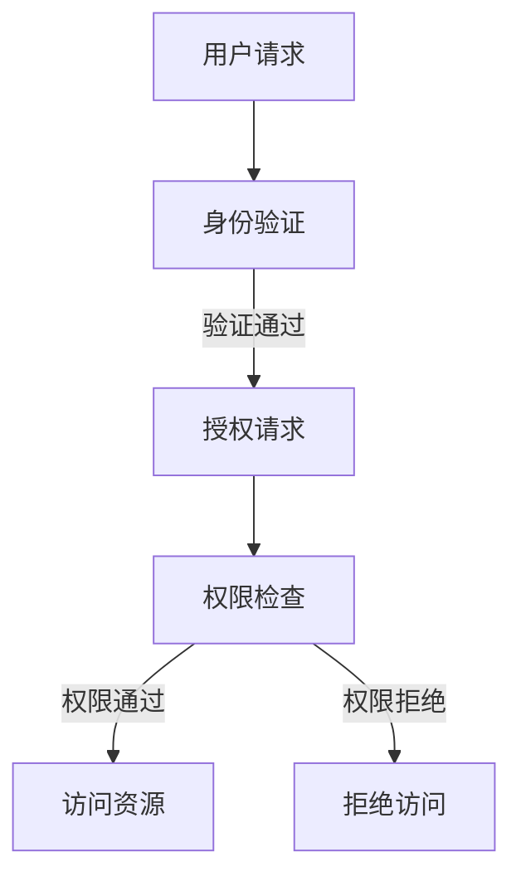

                 

关键词：网络安全，访问控制，应用程序保护，安全机制，身份验证，授权，加密，防火墙，安全协议，安全策略，安全漏洞

> 摘要：本文旨在深入探讨网络安全中的核心概念——访问控制，以及其在保护应用程序中的重要性。我们将详细讨论访问控制的基本原理、实现技术、应用场景，并结合实际案例进行分析，为读者提供一套完整的安全防护方案。

## 1. 背景介绍

在当今数字化的时代，应用程序已成为我们生活和工作中不可或缺的一部分。从社交媒体、在线购物到企业管理系统，应用程序无处不在。然而，随着应用程序的普及，网络安全问题也日益突出。恶意攻击、数据泄露、未授权访问等问题层出不穷，严重威胁着个人隐私和企业的信息安全。

访问控制作为一种关键的安全措施，旨在确保只有授权用户才能访问和操作受保护的应用程序和数据。通过实施有效的访问控制策略，可以显著降低安全风险，提高系统的安全性。

## 2. 核心概念与联系

### 2.1 基本概念

**访问控制**（Access Control）是指对系统资源（如文件、应用程序、网络等）的访问权限进行管理的一套规则和策略。其核心目标是确保只有授权的用户或实体能够访问和操作系统资源，同时阻止未授权的访问。

**身份验证**（Authentication）是指验证用户身份的过程，确保访问者确实是他们所声称的那个人。常见的身份验证方法包括密码、双因素认证、生物识别等。

**授权**（Authorization）是指确认用户有权访问特定资源的过程。一旦用户通过身份验证，系统将根据其权限级别，允许或拒绝访问请求。

### 2.2 原理与架构

为了更好地理解访问控制的工作原理，我们可以借助 Mermaid 流程图来展示其核心架构。



在上述流程图中，用户首先发起访问请求，系统对其进行身份验证。如果验证通过，用户将请求访问特定的资源。系统接下来对用户的权限进行审核，如果权限符合要求，用户即可访问资源；否则，访问请求将被拒绝。

## 3. 核心算法原理 & 具体操作步骤

### 3.1 算法原理概述

访问控制的实现通常基于以下核心算法：

1. **访问控制列表（ACL）**：ACL是一种常用的访问控制机制，它为每个资源定义了一个列表，列出哪些用户或组具有对资源的访问权限。

2. **角色基访问控制（RBAC）**：RBAC将用户划分为不同的角色，每个角色对应一组权限。用户通过角色获得相应的访问权限。

3. **访问控制策略（MAC）**：MAC通过定义一套规则，确定哪些主体（用户或组）可以在何种条件下访问哪些资源。

### 3.2 算法步骤详解

1. **定义访问控制策略**：首先，系统管理员需要定义访问控制策略，明确哪些用户或角色可以访问哪些资源。

2. **用户身份验证**：用户在尝试访问资源时，首先需要通过身份验证。

3. **权限检查**：系统根据用户身份和访问控制策略，检查用户是否有权限访问请求的资源。

4. **资源访问**：如果权限检查通过，用户即可访问资源；否则，访问请求将被拒绝。

### 3.3 算法优缺点

**ACL**：
- **优点**：灵活，易于管理。
- **缺点**：复杂度较高，难以维护。

**RBAC**：
- **优点**：易于实现和管理，支持复杂权限分配。
- **缺点**：可能存在角色冲突和权限泛滥的问题。

**MAC**：
- **优点**：提供细粒度的访问控制。
- **缺点**：实现复杂，难以适应大规模系统。

### 3.4 算法应用领域

访问控制广泛应用于以下领域：

1. **企业级应用**：确保员工只能访问与其工作相关的系统资源。
2. **云计算**：保护云存储和计算资源。
3. **Web 应用**：防止未授权的用户访问敏感数据。
4. **移动应用**：确保移动设备上的数据安全。

## 4. 数学模型和公式 & 详细讲解 & 举例说明

### 4.1 数学模型构建

访问控制的核心在于确定用户与资源之间的访问关系。我们可以用以下数学模型进行描述：

$$
\begin{aligned}
    \text{Access}_{u,r} &= 
    \begin{cases} 
        1, & \text{如果用户 } u \text{ 可以访问资源 } r; \\
        0, & \text{否则}; 
    \end{cases} \\
    \text{Authentication}_{u} &= 
    \begin{cases} 
        1, & \text{如果用户 } u \text{ 通过身份验证}; \\
        0, & \text{否则}; 
    \end{cases} \\
    \text{Authorization}_{u,r} &= 
    \begin{cases} 
        1, & \text{如果用户 } u \text{ 有权限访问资源 } r; \\
        0, & \text{否则}; 
    \end{cases}
\end{aligned}
$$

### 4.2 公式推导过程

根据上述数学模型，我们可以推导出用户 \( u \) 是否可以访问资源 \( r \)：

$$
    \text{Access}_{u,r} = \text{Authentication}_{u} \times \text{Authorization}_{u,r}
$$

这个公式表明，用户 \( u \) 是否可以访问资源 \( r \)，取决于他是否通过了身份验证以及他是否有权限访问该资源。

### 4.3 案例分析与讲解

假设我们有一个企业级应用，员工 \( A \) 需要访问公司内部的财务数据。根据访问控制策略：

- \( \text{Authentication}_{A} = 1 \)（员工 \( A \) 已通过身份验证）；
- \( \text{Authorization}_{A, \text{财务数据}} = 1 \)（员工 \( A \) 有权限访问财务数据）。

根据公式：

$$
    \text{Access}_{A, \text{财务数据}} = \text{Authentication}_{A} \times \text{Authorization}_{A, \text{财务数据}} = 1 \times 1 = 1
$$

因此，员工 \( A \) 可以访问财务数据。

## 5. 项目实践：代码实例和详细解释说明

### 5.1 开发环境搭建

在本文中，我们将使用 Python 来实现一个简单的访问控制系统。以下是搭建开发环境所需的基本步骤：

1. 安装 Python 3.8 或更高版本。
2. 安装必要的 Python 库，如 Flask、SQLAlchemy 和 Flask-Login。

### 5.2 源代码详细实现

以下是实现访问控制系统的 Python 代码：

```python
from flask import Flask, request, redirect, url_for, render_template
from flask_login import LoginManager, login_user, logout_user, login_required, current_user

app = Flask(__name__)
app.secret_key = 'your_secret_key'

# 假设用户数据库已存在
users = [
    {'username': 'admin', 'password': 'admin123'},
    {'username': 'user', 'password': 'user123'}
]

# 身份验证函数
def authenticate(username, password):
    for user in users:
        if user['username'] == username and user['password'] == password:
            return True
    return False

# 登录函数
@app.route('/login', methods=['GET', 'POST'])
def login():
    if request.method == 'POST':
        username = request.form['username']
        password = request.form['password']
        if authenticate(username, password):
            login_user({'username': username})
            return redirect(url_for('home'))
        else:
            return '登录失败'
    return render_template('login.html')

# 登出函数
@app.route('/logout')
def logout():
    logout_user()
    return redirect(url_for('login'))

# 保护路由
@app.route('/home')
@login_required
def home():
    return '欢迎，' + current_user['username']

if __name__ == '__main__':
    app.run(debug=True)
```

### 5.3 代码解读与分析

上述代码实现了一个简单的 Flask 应用，用于管理用户登录和登出，并提供一个受保护的页面。以下是代码的详细解读：

1. **用户数据库**：我们使用一个简单的用户列表作为用户数据库，其中包含用户名和密码。

2. **身份验证函数**：`authenticate` 函数用于验证用户名和密码是否匹配。

3. **登录函数**：`login` 函数处理用户登录请求。如果用户验证通过，则将其登录到系统。

4. **登出函数**：`logout` 函数用于登出用户。

5. **保护路由**：`home` 函数是一个受保护的页面，只有通过身份验证的用户才能访问。

### 5.4 运行结果展示

1. **登录页面**：

```html
<!DOCTYPE html>
<html>
<head>
    <title>登录</title>
</head>
<body>
    <h1>登录</h1>
    <form method="post">
        用户名：<input type="text" name="username"><br>
        密码：<input type="password" name="password"><br>
        <input type="submit" value="登录">
    </form>
</body>
</html>
```

2. **登录成功后**：用户将被重定向到受保护的页面，显示欢迎信息。

## 6. 实际应用场景

### 6.1 企业级应用

在企业中，访问控制广泛应用于内部网络和系统。例如，只有管理员可以访问系统配置文件，而普通员工只能访问与其工作相关的数据。

### 6.2 云计算

云计算服务提供商通常采用访问控制来确保客户的数据安全。用户可以设置访问控制策略，限制对云存储和计算资源的访问。

### 6.3 Web 应用

Web 应用程序通过身份验证和授权机制，确保用户只能访问其有权访问的内容。例如，社交媒体平台允许用户设置隐私权限，控制谁可以看到他们的帖子。

### 6.4 移动应用

移动应用通常使用设备认证（如指纹识别）和用户密码，确保只有授权用户可以访问应用和数据。

## 7. 工具和资源推荐

### 7.1 学习资源推荐

1. **《网络安全：设计与实现》**：详细介绍了网络安全的基础知识和实践方法。
2. **《密码学：理论与实践》**：涵盖了密码学的基本概念和技术。

### 7.2 开发工具推荐

1. **PyCharm**：强大的 Python 集成开发环境，适合开发复杂的 Web 应用程序。
2. **PostgreSQL**：功能强大的关系型数据库，适用于企业级应用。

### 7.3 相关论文推荐

1. **"Access Control Models and Their Applications"**：深入探讨了不同访问控制模型及其应用。
2. **"The Design and Implementation of an Access Control System"**：介绍了如何设计和实现一个访问控制系统。

## 8. 总结：未来发展趋势与挑战

### 8.1 研究成果总结

访问控制技术在过去几十年中取得了显著进展。从早期的简单 ACL 到复杂的 RBAC 和 MAC，访问控制机制不断进化，以适应不同的应用场景。

### 8.2 未来发展趋势

1. **动态访问控制**：随着人工智能和机器学习技术的发展，动态访问控制将成为一个重要趋势。系统可以根据用户行为和环境因素，动态调整访问权限。
2. **基于区块链的访问控制**：区块链技术的去中心化和不可篡改性，使其在访问控制领域具有巨大潜力。

### 8.3 面临的挑战

1. **隐私保护**：在实施访问控制的同时，如何保护用户隐私是一个重要挑战。
2. **复杂性管理**：随着访问控制机制的日益复杂，如何简化其管理过程也是一个难题。

### 8.4 研究展望

未来，访问控制技术将在确保网络安全和数据保护方面发挥更加重要的作用。研究者应关注动态访问控制、隐私保护、跨平台访问控制等方向，为构建更安全、更可靠的数字世界做出贡献。

## 9. 附录：常见问题与解答

### 9.1 什么是访问控制？

访问控制是一种安全措施，用于管理用户对系统资源的访问权限。其目的是确保只有授权用户才能访问和操作受保护的资源。

### 9.2 访问控制和身份验证有什么区别？

访问控制确保授权用户能够访问资源，而身份验证用于验证用户的身份。简单来说，身份验证是访问控制的前提条件。

### 9.3 为什么需要访问控制？

访问控制可以显著降低安全风险，保护系统的数据和资源，防止未授权的访问和操作。

### 9.4 访问控制有哪些实现方法？

常见的访问控制实现方法包括访问控制列表（ACL）、角色基访问控制（RBAC）和访问控制策略（MAC）。

---

本文从多个角度深入探讨了访问控制的核心概念、实现技术、应用场景以及未来发展趋势。通过本文的学习，读者可以更好地理解访问控制的重要性，并在实际项目中运用这些技术，构建更安全的应用程序。希望本文对您的网络安全实践有所帮助。

## 作者署名

作者：禅与计算机程序设计艺术 / Zen and the Art of Computer Programming

