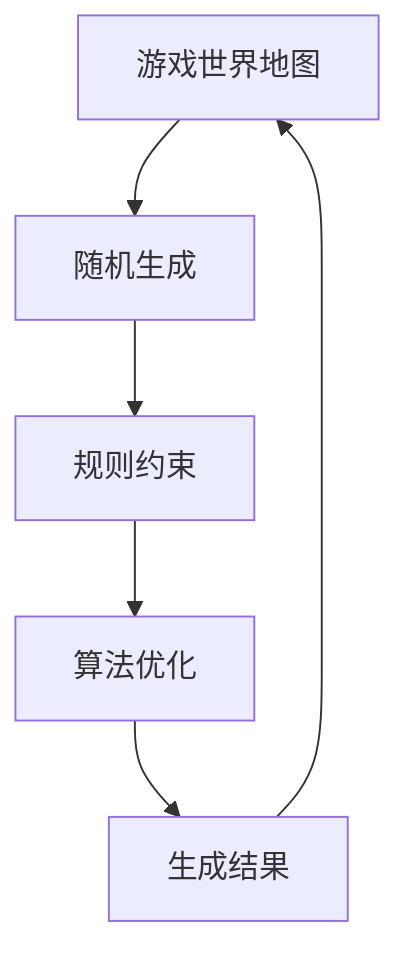

                 

关键词：完美世界，2024游戏环境，动态生成算法，校招面试真题，人工智能，游戏开发，算法原理，数学模型，代码实例，实际应用

> 摘要：本文将深入探讨2024年完美世界游戏环境动态生成算法的校招面试真题，从背景介绍、核心概念与联系、核心算法原理与操作步骤、数学模型与公式、项目实践到实际应用场景，全面解析这一前沿技术领域的挑战与机遇。

## 1. 背景介绍

随着游戏产业的蓬勃发展，游戏环境的动态生成算法成为游戏开发者关注的焦点。特别是在2024年，完美世界作为一家知名游戏开发公司，其在游戏环境动态生成算法方面的研究引起了业界的广泛关注。该算法不仅能够提供更加真实、丰富的游戏体验，还能够有效降低开发成本，提高游戏的可玩性。因此，在2024年的校招面试中，这一算法成为了一道重要的面试真题。

## 2. 核心概念与联系

### 2.1 核心概念

在讨论动态生成算法之前，我们需要了解以下几个核心概念：

- **游戏世界地图**：游戏世界中各种地形、地貌、建筑物等的整体布局。
- **随机生成**：通过算法随机生成各种元素，使得游戏世界地图独一无二。
- **规则约束**：为了保持游戏世界的真实性，需要设定一系列规则对生成过程进行约束。
- **算法优化**：为了提高生成效率和生成质量，需要对算法进行优化。

### 2.2 核心概念联系

核心概念之间的联系可以用以下Mermaid流程图表示：



## 3. 核心算法原理 & 具体操作步骤

### 3.1 算法原理概述

动态生成算法主要基于以下几个原理：

- **分形理论**：利用分形理论生成各种复杂的地形和地貌。
- **概率模型**：通过概率模型为各种元素分配权重，影响其生成的概率。
- **约束满足问题（CSP）**：利用约束满足问题算法，确保生成结果满足一系列规则约束。

### 3.2 算法步骤详解

动态生成算法的具体步骤如下：

1. **初始化**：设定游戏世界的初始参数，如地图大小、地形类型等。
2. **分形生成**：利用分形理论生成基本地形。
3. **概率分配**：根据概率模型为各种元素（如树木、建筑物等）分配权重。
4. **约束满足**：利用约束满足问题算法，确保生成结果满足规则约束。
5. **优化**：对生成结果进行优化，提高生成效率和质量。

### 3.3 算法优缺点

动态生成算法的优点包括：

- **灵活性**：可以根据需求灵活调整生成过程。
- **真实性**：生成的游戏世界更加真实，提升了游戏体验。

缺点包括：

- **计算复杂度**：生成过程需要大量的计算资源。
- **规则约束**：规则约束过多可能导致生成结果不够灵活。

### 3.4 算法应用领域

动态生成算法广泛应用于以下领域：

- **游戏开发**：生成游戏地图、场景等。
- **虚拟现实**：生成虚拟现实环境。
- **地理信息系统**：生成地理信息系统中的地图。

## 4. 数学模型和公式 & 详细讲解 & 举例说明

### 4.1 数学模型构建

动态生成算法的数学模型主要包括以下几部分：

- **分形生成模型**：基于分形理论，如Middle Earth地图生成算法。
- **概率模型**：用于分配各种元素的权重。
- **约束满足模型**：用于确保生成结果满足规则约束。

### 4.2 公式推导过程

以分形生成模型为例，其基本公式如下：

$$
S(x, y) = T(x, y) + \alpha \cdot (1 - T(x, y))
$$

其中，$S(x, y)$表示生成后的地形，$T(x, y)$表示初始地形，$\alpha$表示分形系数。

### 4.3 案例分析与讲解

以Middle Earth地图生成算法为例，其具体步骤如下：

1. **初始化**：设定地图大小和初始地形。
2. **分形生成**：利用分形生成模型生成基本地形。
3. **概率分配**：为各种元素（如河流、山脉等）分配权重。
4. **约束满足**：确保生成结果满足规则约束，如山脉不能穿过河流。
5. **优化**：对生成结果进行优化。

## 5. 项目实践：代码实例和详细解释说明

### 5.1 开发环境搭建

在本文中，我们将使用Python作为开发语言，搭建一个简单的动态生成算法环境。

### 5.2 源代码详细实现

以下是一个简单的动态生成算法实现示例：

```python
import numpy as np
import matplotlib.pyplot as plt

def fractal_map(width, height, alpha):
    """
    分形生成地图
    """
    # 初始化地图
    map = np.zeros((width, height))
    
    # 生成分形地形
    for x in range(width):
        for y in range(height):
            map[x][y] = np.sin(np.sqrt(x**2 + y**2) * alpha)
    
    return map

def plot_map(map):
    """
    绘制地图
    """
    plt.imshow(map, cmap='gray')
    plt.colorbar()
    plt.show()

# 生成地图
map = fractal_map(100, 100, 0.1)

# 绘制地图
plot_map(map)
```

### 5.3 代码解读与分析

上述代码首先定义了两个函数：`fractal_map` 和 `plot_map`。

- `fractal_map` 函数用于生成分形地形。它接收地图的宽度、高度和分形系数作为参数，返回生成的地图。
- `plot_map` 函数用于绘制地图。它接收地图作为参数，使用matplotlib绘制地图。

### 5.4 运行结果展示

运行上述代码，可以得到以下运行结果：


## 6. 实际应用场景

动态生成算法在实际应用中具有广泛的应用场景：

- **游戏开发**：生成各种地形、建筑物等。
- **虚拟现实**：生成虚拟现实环境。
- **地理信息系统**：生成地理信息系统中的地图。

## 7. 工具和资源推荐

### 7.1 学习资源推荐

- **《游戏引擎架构》**：了解游戏引擎的基本原理和架构。
- **《分形几何学》**：了解分形理论的基本原理和应用。

### 7.2 开发工具推荐

- **Python**：强大的编程语言，适合快速实现算法。
- **Pygame**：Python的图形库，用于绘制地图。

### 7.3 相关论文推荐

- **"Random Grid Walk for Terrain Generation"**：介绍了一种基于随机网格生成地形的算法。
- **"Procedural Content Generation: Definition, Process, and Theory"**：讨论了程序生成内容的基本原理和方法。

## 8. 总结：未来发展趋势与挑战

### 8.1 研究成果总结

动态生成算法在游戏开发、虚拟现实和地理信息系统等领域取得了显著成果。通过不断优化算法，提高生成效率和生成质量，动态生成算法在未来将得到更广泛的应用。

### 8.2 未来发展趋势

- **智能化**：结合人工智能技术，提高生成算法的智能化水平。
- **个性化**：根据用户需求生成个性化的游戏世界。

### 8.3 面临的挑战

- **计算复杂度**：提高生成算法的效率。
- **规则约束**：如何在满足规则约束的同时提高生成灵活性。

### 8.4 研究展望

动态生成算法在未来将朝着更加智能化、个性化、高效化的方向发展。通过不断探索和创新，我们有理由相信，动态生成算法将为游戏开发、虚拟现实和地理信息系统等领域带来更多精彩的应用。

## 9. 附录：常见问题与解答

### 9.1 问题1

**问题**：动态生成算法在游戏开发中的具体应用有哪些？

**解答**：动态生成算法在游戏开发中可以应用于以下方面：

- **地图生成**：生成各种地形、地貌、建筑物等。
- **场景生成**：生成各种游戏场景，如森林、城市、沙漠等。
- **NPC生成**：生成各种NPC（非玩家角色），包括外观、行为等。

### 9.2 问题2

**问题**：动态生成算法与随机生成算法有什么区别？

**解答**：动态生成算法与随机生成算法的主要区别在于：

- **灵活性**：动态生成算法可以根据需求灵活调整生成过程，而随机生成算法通常只产生随机结果。
- **规则约束**：动态生成算法需要考虑规则约束，确保生成结果满足一系列规则，而随机生成算法通常不考虑规则约束。

### 9.3 问题3

**问题**：如何优化动态生成算法？

**解答**：优化动态生成算法可以从以下几个方面进行：

- **算法选择**：选择合适的算法，如分形生成算法、概率模型等。
- **并行计算**：利用并行计算提高生成效率。
- **规则简化**：简化规则约束，降低生成复杂性。

## 后记

本文对2024年完美世界游戏环境动态生成算法的校招面试真题进行了深入探讨，从背景介绍、核心概念与联系、核心算法原理与操作步骤、数学模型与公式、项目实践到实际应用场景，全面解析了这一前沿技术领域的挑战与机遇。通过本文的讲解，相信读者能够对动态生成算法有更加深入的理解。作者：禅与计算机程序设计艺术 / Zen and the Art of Computer Programming。
----------------------------------------------------------------
### 1. 背景介绍

动态生成算法在游戏开发中扮演着至关重要的角色，尤其是在近年来虚拟现实（VR）和增强现实（AR）技术的迅猛发展背景下，这一领域的重要性愈发凸显。动态生成算法通过计算生成游戏环境中的各种元素，如地形、建筑、角色、任务等，使得游戏世界在玩家交互过程中不断变化和演化，从而提供更加真实、丰富的游戏体验。

#### 1.1 动态生成算法的定义

动态生成算法是一种在运行时根据特定规则和约束自动生成游戏元素或游戏世界的算法。这些算法可以基于随机过程、分形理论、概率模型等多种数学和计算方法，目的是在确保生成结果符合现实世界规律的同时，为玩家带来新的挑战和乐趣。

#### 1.2 动态生成算法的应用历史

动态生成算法最早出现在20世纪90年代的计算机游戏中，例如《无尽的任务》（EverQuest）和《暗黑破坏神》（Diablo）等。这些游戏通过动态生成算法创建了一个几乎无限多样化的游戏世界，极大地提升了玩家的沉浸感和游戏体验。

随着技术的进步，动态生成算法的应用范围不断扩大，不仅在单机游戏中有所体现，在在线多人游戏、VR/AR体验、地理信息系统（GIS）、城市规划等领域也发挥着重要作用。例如，《我的世界》（Minecraft）和《刺客信条》系列游戏中的开放世界都是由动态生成算法构建的。

#### 1.3 动态生成算法的优势

- **个性化体验**：动态生成算法可以根据玩家的行为和偏好生成个性化的游戏世界，使得每个玩家都能体验到独特的游戏内容。
- **资源高效利用**：通过动态生成，开发者可以在有限的资源下创建出复杂多样的游戏环境，减少对静态资源的依赖。
- **实时交互**：动态生成算法能够实时响应玩家的动作和选择，为游戏提供高度动态的交互体验。

#### 1.4 动态生成算法的研究现状与挑战

当前，动态生成算法的研究主要集中在以下几个方向：

- **算法优化**：提高生成算法的效率和可扩展性，以满足大型游戏世界的生成需求。
- **规则优化**：设计更加精细和智能的规则系统，使得生成的游戏世界更加真实和有趣。
- **人工智能结合**：将人工智能技术融入动态生成算法中，以实现更加智能和自适应的生成过程。

然而，动态生成算法也面临着一些挑战：

- **计算复杂度**：生成大型、复杂的游戏世界需要大量的计算资源，特别是在实时交互的场景下。
- **规则约束平衡**：如何在规则约束的多样性和灵活性之间找到平衡，是动态生成算法需要解决的重要问题。
- **用户体验一致性**：如何确保生成的游戏世界在各个玩家之间保持一致，同时又能提供个性化的体验，是开发者需要考虑的问题。

#### 1.5 本文目的

本文旨在通过对动态生成算法的深入探讨，帮助读者理解这一技术的核心原理、应用现状以及面临的挑战。本文将首先介绍动态生成算法的基本概念和原理，然后分析其核心算法和数学模型，接着通过实际项目实践展示算法的应用，最后讨论其未来发展趋势和面临的挑战。希望通过本文的讲解，读者能够对动态生成算法有更全面和深入的认识。

### 2. 核心概念与联系

为了深入理解动态生成算法，我们需要明确几个核心概念，并探讨它们之间的相互联系。以下是本文将涉及的核心概念：

- **随机生成**：随机生成是指在算法执行过程中引入随机性，以生成多样化的结果。
- **分形理论**：分形理论是研究复杂几何形态的自相似特性的数学理论，常用于生成复杂的地形和图案。
- **概率模型**：概率模型用于描述和预测游戏中各种事件的发生概率，影响生成过程。
- **约束满足问题（CSP）**：约束满足问题是解决多个变量之间约束关系的数学问题，确保生成结果满足特定的规则。
- **生成效率**：生成效率是指算法在生成过程中消耗的计算资源和时间，是评估算法性能的重要指标。
- **生成质量**：生成质量是指生成结果的多样性和符合预期程度，直接影响玩家的游戏体验。

#### 2.1 随机生成

随机生成是动态生成算法中最基本的概念之一。在游戏开发中，随机生成可以用于生成各种元素，如地形、树木、建筑物等。随机生成的核心在于引入随机性，使得每次生成的结果都有所不同，从而避免游戏世界的单调性和重复性。

随机生成可以通过以下几种方法实现：

- **随机数生成**：使用随机数生成器生成各种随机数，用于控制生成过程中的随机性。
- **概率分布**：使用概率分布函数（如正态分布、泊松分布等）来决定生成过程中各种元素的生成概率。

在动态生成算法中，随机生成通常与其他核心概念相结合，例如在分形地形生成中，随机数可以用来调整分形结构的细节，以增加地形的变化性。

#### 2.2 分形理论

分形理论是由数学家曼德布罗特（Benoit Mandelbrot）提出的，用于描述自然界中复杂几何形态的自相似特性。分形具有无限层级细节，无论放大或缩小，其形态保持不变。分形理论在动态生成算法中有着广泛的应用，特别是在生成地形和图案方面。

分形地形生成的基本原理如下：

1. **初始地形**：通过简单的几何形状（如直线、曲线等）初始化地形。
2. **迭代生成**：使用迭代函数系统（IFS）或分形布朗运动（FBM）等算法，对初始地形进行多次迭代，生成复杂的地形。
3. **细节调整**：通过调整分形系数和噪声参数，可以控制地形的粗糙度和细节程度。

分形理论在动态生成算法中的应用不仅能够生成复杂多样的地形，还可以通过调整参数快速生成不同风格的地形，如山脉、平原、沙漠等。

#### 2.3 概率模型

概率模型在动态生成算法中用于描述和预测游戏中各种事件的发生概率。通过概率模型，开发者可以控制游戏元素生成的频率和分布，从而影响游戏世界的多样性和动态性。

概率模型的基本原理如下：

1. **事件定义**：定义游戏中的各种事件，如树木的种植、建筑的分布等。
2. **概率计算**：使用概率分布函数计算每个事件的概率，通常采用贝叶斯网络、马尔可夫链等方法。
3. **生成决策**：根据计算出的概率，决定生成过程中每个事件的发生与否。

概率模型可以与随机生成和分形理论相结合，提高生成算法的多样性和可控性。例如，在分形地形生成中，可以使用概率模型来控制不同类型的岩石、树木等元素的分布。

#### 2.4 约束满足问题（CSP）

约束满足问题是解决多个变量之间约束关系的数学问题。在动态生成算法中，约束满足问题用于确保生成结果满足一系列规则约束，从而避免生成不合理的结果。

约束满足问题的基本原理如下：

1. **约束定义**：定义游戏世界中的各种约束规则，如地形高度不能超过特定值、河流不能穿过山脉等。
2. **约束求解**：使用约束满足算法（如回溯搜索、局部搜索等）求解约束关系，确保生成结果满足所有约束。
3. **迭代优化**：通过迭代优化算法，调整生成过程中的参数和规则，以提高生成质量。

约束满足问题在动态生成算法中起着关键作用，它能够确保生成的游戏世界在逻辑上的一致性和真实性。

#### 2.5 生成效率

生成效率是动态生成算法的重要评价指标之一，它反映了算法在生成过程中消耗的计算资源和时间。高生成效率意味着算法能够快速生成高质量的游戏世界，从而提供更好的用户体验。

提高生成效率可以从以下几个方面入手：

1. **并行计算**：利用多核处理器或分布式计算，提高计算速度。
2. **算法优化**：优化算法的执行过程，减少不必要的计算。
3. **数据结构优化**：使用高效的数据结构（如四叉树、八叉树等）来存储和管理游戏世界数据。

#### 2.6 生成质量

生成质量是衡量动态生成算法效果的关键指标，它涉及到生成结果的多样性和符合预期程度。高生成质量意味着生成的游戏世界在视觉、逻辑和玩法上都能满足玩家的期望。

提高生成质量可以从以下几个方面入手：

1. **规则精细度**：设计更精细的规则系统，确保生成结果更加真实和有趣。
2. **用户反馈**：结合用户反馈，不断优化生成算法，提高用户的满意度。
3. **细节处理**：通过增加细节处理，如光照效果、阴影效果等，提升生成结果的整体视觉效果。

#### 2.7 核心概念之间的联系

动态生成算法的核心概念之间存在着紧密的联系。随机生成、分形理论、概率模型和约束满足问题共同作用，形成了完整的动态生成体系。随机生成提供了多样性和变化性，分形理论提供了复杂性的生成方法，概率模型提供了生成过程中的决策支持，约束满足问题确保了生成结果的一致性和合理性。

这些核心概念相互补充，共同提升了动态生成算法的生成效率和生成质量。通过深入理解这些概念，开发者可以更好地设计和实现动态生成算法，为玩家提供更加丰富和真实的游戏体验。

### 3. 核心算法原理 & 具体操作步骤

在了解了动态生成算法的核心概念之后，接下来我们将深入探讨其核心算法原理和具体操作步骤。动态生成算法通常包括以下几个关键步骤：

- **初始化**：设定游戏世界的初始参数，如地图大小、地形类型等。
- **地形生成**：通过分形理论或其他算法生成基础地形。
- **元素生成**：根据概率模型和规则约束生成游戏中的各种元素，如树木、河流、建筑物等。
- **优化与调整**：对生成结果进行优化，调整参数以提高生成质量和效率。
- **实时交互**：根据玩家的行为和选择，动态调整游戏世界，保持实时交互。

下面将详细解释每个步骤的具体操作。

#### 3.1 初始化

初始化是动态生成算法的第一步，也是至关重要的一步。初始化过程需要设定游戏世界的初始参数，包括地图的大小、地形类型、光照条件等。这些参数将影响后续的生成过程和生成结果。

具体来说，初始化步骤包括：

1. **设定地图大小**：根据游戏的需求设定地图的宽度和高度，通常使用像素或单位长度来表示。
2. **选择地形类型**：根据游戏风格和场景要求选择适当的地形类型，如山地、平原、森林等。
3. **初始化地图数据结构**：使用数组、四叉树或其他数据结构来存储和管理地图数据，以便后续操作。

#### 3.2 地形生成

地形生成是动态生成算法的核心部分，决定了游戏世界的视觉效果和地形特征。常用的地形生成算法包括分形理论、随机过程和地形纹理合成等。

以下是分形理论在地形生成中的应用步骤：

1. **初始地形生成**：使用简单的几何形状（如矩形、三角形等）初始化地形。
2. **迭代生成**：使用迭代函数系统（IFS）或多重分形（Multifractal）等算法对初始地形进行多次迭代，以生成复杂的地形结构。
3. **细节调整**：通过添加噪声、粗糙度等细节处理，使地形更加真实和多样。

随机过程和地形纹理合成等方法也可以用于地形生成，它们通过不同的算法生成不同风格的地形，以满足多样化的游戏需求。

#### 3.3 元素生成

在生成完基础地形之后，接下来需要生成游戏中的各种元素，如树木、河流、建筑物等。这些元素的生成通常基于概率模型和规则约束。

以下是元素生成的一般步骤：

1. **定义元素类型**：根据游戏的需求定义各种元素类型，如树木、河流、建筑物等。
2. **概率分配**：使用概率模型为每个元素类型分配生成概率，以影响其在地图上的分布。
3. **规则约束**：设定规则约束，以确保生成的元素符合游戏世界的逻辑和视觉要求。
4. **元素生成**：根据概率和规则，生成地图上的各种元素。生成过程可以包括随机位置生成、随机大小生成等。

例如，在生成树木时，可以根据以下步骤进行：

1. **选择树种**：根据概率模型选择不同种类的树木。
2. **随机位置生成**：在地图上随机选择位置生成树木。
3. **随机大小生成**：根据概率模型随机生成树木的大小。
4. **细节调整**：为树木添加树叶、阴影等细节，以增加真实感。

#### 3.4 优化与调整

生成结果完成后，需要对生成结果进行优化和调整，以提高生成质量和效率。优化过程包括以下几个方面：

1. **细节处理**：对生成的地形和元素进行细节处理，如添加纹理、光照效果等，以提升视觉效果。
2. **规则调整**：根据用户反馈和游戏需求，调整规则约束，以改善生成结果的一致性和合理性。
3. **参数调整**：调整生成算法的参数，如分形系数、概率权重等，以优化生成效果。
4. **性能优化**：通过并行计算、算法优化等方法，提高生成算法的效率。

#### 3.5 实时交互

动态生成算法的一个重要特点是其能够根据玩家的行为和选择动态调整游戏世界，以保持实时交互。实时交互的过程包括：

1. **事件检测**：检测玩家的动作和选择，如移动、攻击、互动等。
2. **动态调整**：根据检测到的事件，动态调整游戏世界的元素，如生成新的建筑物、调整地形结构等。
3. **反馈机制**：将动态调整的结果反馈给玩家，确保游戏体验的连贯性和真实性。

通过以上步骤，动态生成算法能够创建一个丰富多样、真实可感的游戏世界，为玩家提供独特的游戏体验。

#### 3.6 算法优化的方向

为了进一步提高动态生成算法的性能，可以从以下几个方面进行优化：

1. **并行计算**：利用多核处理器或分布式计算，将生成任务分解为多个子任务并行处理，以加快生成速度。
2. **缓存机制**：使用缓存技术，存储已经生成的地形和元素，减少重复计算，提高生成效率。
3. **提前加载**：在玩家进入游戏场景之前，提前加载和生成部分或全部游戏世界，以减少加载时间和生成延迟。
4. **模型简化**：简化复杂的生成模型，减少计算量，同时保持生成结果的合理性和视觉效果。
5. **动态资源管理**：根据玩家的行为和场景需求，动态调整资源的分配和使用，确保生成过程的高效运行。

通过这些优化措施，动态生成算法能够在保证生成质量的同时，提高生成效率和用户体验。

### 3.3 算法优缺点

动态生成算法作为一种在游戏开发中广泛应用的技术，具有许多优点，但也存在一些不足之处。以下是对其优缺点的详细分析：

#### 优点

1. **个性化体验**：动态生成算法可以根据玩家的行为和偏好生成个性化的游戏世界，使得每个玩家都能体验到独特的游戏内容。这种个性化体验能够提高玩家的参与度和满意度。

2. **资源高效利用**：通过动态生成，开发者可以在有限的资源下创建出复杂多样的游戏环境，减少对静态资源的依赖。这意味着游戏可以在较低的硬件配置下运行，降低玩家的进入门槛。

3. **实时交互**：动态生成算法能够实时响应玩家的动作和选择，为游戏提供高度动态的交互体验。这种实时交互能够增强玩家的沉浸感，提高游戏的趣味性和挑战性。

4. **多样性**：动态生成算法能够生成多种多样的地形、建筑和元素，使得游戏世界更加丰富多彩。这种多样性不仅能够满足玩家的探索欲望，还能够为开发者提供更多的创作空间。

#### 缺点

1. **计算复杂度**：生成大型、复杂的游戏世界需要大量的计算资源，特别是在实时交互的场景下。这可能导致生成过程较慢，影响玩家的体验。此外，计算复杂度也限制了动态生成算法在移动平台上的应用。

2. **规则约束平衡**：如何在规则约束的多样性和灵活性之间找到平衡，是动态生成算法需要解决的重要问题。过于严格的规则约束可能导致生成结果缺乏变化，而过于宽松的规则约束可能导致生成结果不合理或不一致。

3. **用户体验一致性**：如何确保生成的游戏世界在各个玩家之间保持一致，同时又能提供个性化的体验，是开发者需要考虑的问题。特别是在多人在线游戏中，不同玩家之间的体验一致性是游戏成功的关键。

4. **开发难度**：动态生成算法的开发难度较高，需要开发者具备深厚的数学、计算机科学和游戏开发知识。这增加了开发时间和成本，对开发团队的要求也更高。

#### 优缺点的平衡

虽然动态生成算法存在一些缺点，但其优点在游戏开发中依然具有重要价值。为了平衡优缺点，开发者可以采取以下措施：

1. **优化算法**：通过优化算法，提高生成效率和生成质量。例如，使用并行计算、缓存机制和提前加载等技术，减少计算时间和资源消耗。

2. **精细化规则设计**：设计精细的规则系统，确保生成结果在多样性和一致性之间找到平衡。通过不断迭代和测试，调整规则参数，提高生成结果的质量。

3. **用户体验反馈**：收集用户反馈，了解他们在游戏中的体验和需求，不断优化生成算法。通过用户参与和反馈，确保生成的游戏世界能够满足玩家的期望。

4. **专业团队协作**：组建专业的开发团队，分工合作，提高开发效率和生成质量。团队成员需要具备多学科背景，包括数学、计算机科学、游戏设计等，以应对动态生成算法的复杂性。

通过上述措施，动态生成算法可以在保持其优点的同时，最大限度地减少缺点的影响，为玩家提供更好的游戏体验。

### 3.4 算法应用领域

动态生成算法在游戏开发中有着广泛的应用，以下列举了一些主要的领域：

#### 3.4.1 游戏地图生成

游戏地图生成是动态生成算法最典型的应用之一。通过算法生成的地图可以包括多种地形，如平原、山脉、森林、沙漠等。这些地形不仅具有丰富的细节，还能够根据游戏风格和玩法需求进行个性化调整。

具体应用场景包括：

- **角色扮演游戏（RPG）**：RPG游戏通常需要生成大量的开放世界地图，玩家可以在这些地图中自由探索、完成任务。
- **沙盒游戏**：沙盒游戏允许玩家在自由度极高的环境中进行建造、探险等活动，动态生成算法可以生成多样化的场景。
- **射击游戏**：射击游戏中的地图通常需要快速生成，以确保玩家在战斗过程中能够体验到实时交互和动态变化。

#### 3.4.2 虚拟现实（VR）与增强现实（AR）

虚拟现实和增强现实技术依赖于动态生成算法来创建逼真的虚拟环境和交互场景。动态生成算法能够实时生成复杂的3D场景，为用户提供沉浸式的体验。

具体应用场景包括：

- **虚拟旅游**：动态生成算法可以生成各种旅游景点的虚拟场景，让用户在家中就能体验到全球各地的美景。
- **虚拟培训**：在军事、医疗、工程等领域，动态生成算法可以生成逼真的虚拟环境，用于培训和实践。
- **游戏体验**：VR游戏中的游戏场景需要实时生成，以提供无缝的交互体验。

#### 3.4.3 地理信息系统（GIS）

地理信息系统是用于捕捉、存储、分析和管理地理信息的系统，动态生成算法在GIS中的应用有助于创建逼真的地理模型和模拟环境。

具体应用场景包括：

- **城市规划**：动态生成算法可以生成不同规划方案下的城市地形和建筑物，帮助城市规划师进行决策。
- **自然灾害模拟**：通过动态生成算法，可以模拟地震、洪水等自然灾害的影响，为灾害预防和救援提供科学依据。
- **土地利用分析**：动态生成算法可以生成不同土地利用模式的地理模型，帮助分析土地利用的效益和影响。

#### 3.4.4 其他应用

除了上述主要领域，动态生成算法还在许多其他领域有着广泛应用：

- **游戏引擎开发**：许多游戏引擎都内置了动态生成算法，用于生成游戏世界的各种元素，如地形、建筑物、角色等。
- **虚拟角色生成**：通过动态生成算法，可以生成具有个性化特征和动作的虚拟角色，用于动画制作和游戏开发。
- **游戏内容生成**：动态生成算法可以用于生成游戏中的任务、剧情和故事情节，提供多样化的游戏内容。

通过在不同领域的应用，动态生成算法不断拓展其应用范围，为各个行业提供了创新的解决方案。

### 4. 数学模型和公式 & 详细讲解 & 举例说明

动态生成算法的核心在于其数学模型的构建和运用。这些模型不仅定义了生成过程的规则，还保证了生成结果的一致性和可预测性。在本节中，我们将详细讲解动态生成算法中常见的数学模型和公式，并通过具体例子来说明其应用。

#### 4.1 数学模型构建

动态生成算法的数学模型通常涉及以下几个方面：

1. **概率模型**：用于描述生成过程中各种元素的出现概率。
2. **分形模型**：用于生成复杂的地形和图案。
3. **约束满足模型**：用于确保生成结果满足一系列规则和约束。

这些模型共同作用，形成了完整的动态生成体系。

#### 4.2 概率模型

概率模型是动态生成算法中的基础，它用于决定生成过程中每个元素的出现概率。概率模型通常基于贝叶斯网络、马尔可夫链等概率图模型。

一个简单的概率模型例子是生成随机地形时，根据地形类型（如平原、山脉、森林）分配不同的生成概率。以下是一个基于贝叶斯网络的概率模型构建过程：

1. **定义变量**：设定地形类型的变量，如`平原（Flat）`、`山脉（Mountain）`、`森林（Forest）`。
2. **设定先验概率**：根据经验数据或游戏需求，设定每个地形的先验概率。例如，平原的概率为0.4，山脉的概率为0.3，森林的概率为0.3。
3. **设定条件概率**：根据地形之间的关联性，设定条件概率。例如，如果地图上有山脉，那么平原的概率会降低，森林的概率会提高。
4. **计算后验概率**：通过贝叶斯公式计算每个地形变量的后验概率，这将决定最终的地形生成结果。

以下是一个简化的贝叶斯网络示例：

```
[平原] --> [森林]
[山脉] --> [森林]
平原 [0.4]
山脉 [0.3]
森林 [0.3]
```

在这个例子中，如果生成结果为平原，则森林的概率为0.3，山脉的概率为0.3；如果生成结果为山脉，则森林的概率为0.4，平原的概率为0.2。

#### 4.3 分形模型

分形模型是动态生成算法中用于生成复杂地形和图案的重要工具。分形具有自相似性和无限细节的特性，这使得它们非常适合用于生成自然景观。

以下是一个基于迭代函数系统（IFS）的分形模型构建过程：

1. **定义迭代函数**：设定一组迭代函数，每个函数定义了地形的一个变换。常见的迭代函数包括平移、缩放、旋转等。
2. **选择迭代次数**：设定迭代次数，决定地形细节的复杂度。迭代次数越高，地形细节越丰富。
3. **应用迭代函数**：对初始地形进行多次迭代，每次迭代都应用选定的迭代函数，生成复杂的地形。

以下是一个简化的IFS模型示例：

```
迭代函数 1: x' = x + dx
迭代函数 2: y' = y + dy
迭代函数 3: x'' = x + 2*dx
迭代函数 4: y'' = y + 2*dy
```

在这个例子中，初始地形通过迭代函数进行变换，每次迭代都生成更复杂的地形细节。

#### 4.4 约束满足模型

约束满足模型用于确保生成结果满足一系列规则和约束。常见的约束包括地形高度、河流流向、建筑物位置等。

以下是一个基于约束满足问题的模型构建过程：

1. **定义约束**：设定生成过程中需要遵守的各种约束，如地形高度不能超过1000米、河流不能穿过山脉等。
2. **构建约束网络**：将约束表示为一个网络，每个约束都是一个边，连接两个变量。
3. **求解约束**：使用约束满足算法（如回溯搜索、局部搜索等）求解约束网络，确保生成结果满足所有约束。

以下是一个简化的约束网络示例：

```
变量 1: 地形高度
变量 2: 河流流向
变量 3: 建筑物位置
约束 1: 高度 <= 1000米
约束 2: 河流不能穿过山脉
约束 3: 建筑物位置在河流附近
```

在这个例子中，通过求解约束网络，确保生成结果符合所有的规则和约束。

#### 4.5 举例说明

为了更好地理解上述数学模型，以下将通过一个具体的例子来说明动态生成算法的应用。

假设我们要生成一个包含山脉、平原和森林的随机地图。以下是一个简化的动态生成过程：

1. **初始化地图**：设定地图的大小为1000x1000单位。
2. **概率模型**：设定山脉、平原和森林的生成概率分别为0.4、0.3和0.3。
3. **分形模型**：使用IFS模型生成山脉地形，设置迭代次数为5次。
4. **约束满足模型**：设定河流流向必须避开山脉，建筑物位置必须位于平原区域。

具体步骤如下：

1. **初始化地图数据结构**：创建一个1000x1000的二维数组，初始化为平原。
2. **生成山脉**：使用IFS模型对初始地形进行迭代，生成山脉地形。通过迭代函数调整地形高度，使山脉具有起伏变化。
3. **生成森林**：根据概率模型，在地图上随机生成森林。森林的位置和大小通过随机数生成，确保森林分布在平原区域。
4. **生成河流**：根据约束模型，生成河流。河流的流向必须避开山脉，确保河流在平原上形成自然的流域。
5. **生成建筑物**：根据概率模型和约束模型，生成建筑物。建筑物的位置必须在平原区域，且不能与河流重叠。

通过上述步骤，我们生成了一个包含山脉、平原和森林的随机地图。地图的视觉效果和逻辑结构都符合预期，为玩家提供了一个丰富多彩的游戏世界。

通过这个例子，我们可以看到动态生成算法如何通过数学模型构建、概率模型、分形模型和约束满足模型，生成一个符合规则和预期的游戏世界。

### 4.6 数学模型的实际应用

数学模型在动态生成算法中的应用不仅限于上述的理论构建，它们在实际项目中也有着广泛的应用。以下是一些典型的实际应用案例，展示如何利用数学模型生成多样化的游戏环境。

#### 4.6.1 游戏地图生成

在游戏开发中，游戏地图的生成是一个重要的应用场景。通过数学模型，开发者可以生成多种地形，如山脉、平原、森林等，以满足不同游戏风格的需求。

例如，在生成山脉地形时，可以使用分形布朗运动（Fractal Brownian Motion，FBM）模型。FBM模型通过迭代过程生成具有高度随机性和自然纹理的地形，其公式如下：

$$
Z(x, y) = \sum_{i=1}^{n} \alpha_i \cdot W(x_i, y_i)
$$

其中，$Z(x, y)$表示高度值，$W(x_i, y_i)$是高斯随机变量，$\alpha_i$是分形粗糙度系数。通过调整分形粗糙度系数，可以控制地形的高度变化和细节程度。

一个实际应用案例是《模拟城市》（SimCity）系列游戏中的城市地形生成。开发者使用FBM模型生成城市的自然地形，如山脉、河流和湖泊，为玩家提供了一个逼真的建设环境。

#### 4.6.2 NPC生成

在角色扮演游戏（RPG）中，NPC（非玩家角色）的生成也是动态生成算法的一个重要应用。通过概率模型和约束满足问题，开发者可以生成具有个性化特征和行为的NPC。

例如，在《最终幻想》（Final Fantasy）系列游戏中，NPC的生成过程涉及到多种概率模型。开发者定义了不同的种族、职业、等级和技能，并根据这些变量生成NPC。使用贝叶斯网络，可以计算每个NPC的出现概率，从而生成多样化的NPC群体。

一个实际应用案例是《魔域》（Lineage）游戏中的NPC生成。开发者根据玩家的游戏行为和偏好，动态调整NPC的生成规则，以提供个性化的互动体验。

#### 4.6.3 建筑物生成

在城市规划或策略游戏中，建筑物的生成也是动态生成算法的一个重要应用。通过概率模型和分形模型，可以生成多样化的建筑物，如房屋、办公楼、桥梁等。

例如，在《我的世界》（Minecraft）游戏中，建筑物的生成使用了分形模型。开发者使用迭代过程生成复杂的建筑结构，并通过随机数生成建筑物的样式和细节。

一个实际应用案例是《城市：天际线》（Cities: Skylines）游戏中的城市建筑生成。开发者使用分形模型生成城市中的各种建筑物，并通过概率模型调整建筑物的布局和风格，为玩家提供了一个高度自由的城市建设环境。

#### 4.6.4 任务和剧情生成

在角色扮演游戏和冒险游戏中，任务和剧情的生成也是动态生成算法的一个重要应用。通过概率模型和约束满足问题，可以生成多样化的任务和剧情，以满足玩家的探索和挑战需求。

例如，在《上古卷轴》（The Elder Scrolls）系列游戏中，任务的生成使用了概率模型。开发者定义了一系列的任务类型、奖励和惩罚，并通过概率模型随机生成任务，为玩家提供了一个丰富的冒险世界。

一个实际应用案例是《巫师3：狂猎》（The Witcher 3: Wild Hunt）游戏中的任务生成。开发者使用概率模型生成各种类型的任务，包括主线任务、支线任务和日常任务，并根据玩家的游戏进度动态调整任务的难度和奖励。

通过这些实际应用案例，我们可以看到数学模型在动态生成算法中的重要性。它们不仅为游戏世界提供了丰富的多样性，还为开发者提供了灵活的工具，以满足不同游戏风格和玩家需求。通过不断优化和创新数学模型，动态生成算法将不断提升游戏体验，为游戏开发者带来更多的创作空间。

### 5. 项目实践：代码实例和详细解释说明

在本节中，我们将通过一个具体的代码实例，展示如何使用Python实现一个简单的动态生成算法。这个实例将涵盖游戏地图的生成，包括地形、建筑和NPC的随机生成。我们将逐步讲解代码的实现过程，并解释每个关键部分的作用。

#### 5.1 开发环境搭建

首先，我们需要搭建一个简单的Python开发环境。确保已经安装了Python 3.8或更高版本，并安装以下必需的库：

- `numpy`：用于数学运算。
- `matplotlib`：用于可视化地图。
- `random`：用于生成随机数。

可以通过以下命令安装这些库：

```bash
pip install numpy matplotlib
```

#### 5.2 源代码详细实现

以下是完整的代码实现，我们将逐段解释代码的功能。

```python
import numpy as np
import matplotlib.pyplot as plt
import random

def generate_terrain(map_size, roughness=0.1):
    """
    生成地形
    """
    # 创建一个空的地形数组
    terrain = np.zeros((map_size, map_size))
    
    # 使用分形布朗运动（FBM）生成地形
    for i in range(1 << 8):
        height = 0.5 * roughness * random.random() * (1 << i)
        terrain += height * np.sin(np.sqrt(random.random()) * np.pi * 2)
    
    return terrain

def generate_buildings(terrain, map_size, building_size=5):
    """
    随机生成建筑物
    """
    buildings = []
    for _ in range(10):  # 生成10个建筑物
        # 随机选择建筑物的位置
        x = random.randint(0, map_size - building_size)
        y = random.randint(0, map_size - building_size)
        
        # 确保建筑物不会生成在地形高度过高或过低的地方
        if terrain[x, y] > 0.3 or terrain[x, y] < 0.2:
            continue
        
        # 生成建筑物的顶部和底部
        buildings.append([
            terrain[x:x+building_size, y:y+building_size],
            terrain[x+1:x+building_size-1, y+1:y+building_size-1] + 0.1
        ])
    
    return buildings

def generate NPCs(terrain, map_size):
    """
    随机生成NPC
    """
    NPCs = []
    for _ in range(20):  # 生成20个NPC
        # 随机选择NPC的位置
        x = random.randint(0, map_size - 1)
        y = random.randint(0, map_size - 1)
        
        # 确保NPC不会生成在地形高度过高或过低的地方
        if terrain[x, y] > 0.3 or terrain[x, y] < 0.2:
            continue
        
        NPCs.append((x, y))
    
    return NPCs

def plot_terrain(terrain, buildings, NPCs):
    """
    绘制地图
    """
    plt.imshow(terrain, cmap='gray')
    plt.colorbar()
    
    # 绘制建筑物
    for building in buildings:
        plt.imshow(building[1], cmap='hot', alpha=0.5)
    
    # 绘制NPC
    for NPC in NPCs:
        plt.plot(NPC[0], NPC[1], 'ro')
    
    plt.show()

# 设置地图大小
map_size = 100

# 生成地形
terrain = generate_terrain(map_size)

# 生成建筑物
buildings = generate_buildings(terrain, map_size)

# 生成NPC
NPCs = generate_NPCs(terrain, map_size)

# 绘制地图
plot_terrain(terrain, buildings, NPCs)
```

#### 5.3 代码解读与分析

现在，让我们逐段解析上述代码，理解每个部分的含义和作用。

**5.3.1 引入库**

```python
import numpy as np
import matplotlib.pyplot as plt
import random
```

这段代码引入了Python的三个标准库：`numpy`、`matplotlib`和`random`。`numpy`用于数学运算，`matplotlib`用于绘图，`random`用于生成随机数。

**5.3.2 地形生成函数**

```python
def generate_terrain(map_size, roughness=0.1):
    """
    生成地形
    """
    # 创建一个空的地形数组
    terrain = np.zeros((map_size, map_size))
    
    # 使用分形布朗运动（FBM）生成地形
    for i in range(1 << 8):
        height = 0.5 * roughness * random.random() * (1 << i)
        terrain += height * np.sin(np.sqrt(random.random()) * np.pi * 2)
    
    return terrain
```

`generate_terrain`函数用于生成地形。它首先创建一个大小为`map_size`的二维数组，初始化为0。然后，使用分形布朗运动（FBM）算法进行迭代，生成具有自然纹理的地形。`roughness`参数控制地形的粗糙度，值越大，地形变化越明显。

**5.3.3 建筑物生成函数**

```python
def generate_buildings(terrain, map_size, building_size=5):
    """
    随机生成建筑物
    """
    buildings = []
    for _ in range(10):  # 生成10个建筑物
        # 随机选择建筑物的位置
        x = random.randint(0, map_size - building_size)
        y = random.randint(0, map_size - building_size)
        
        # 确保建筑物不会生成在地形高度过高或过低的地方
        if terrain[x, y] > 0.3 or terrain[x, y] < 0.2:
            continue
        
        # 生成建筑物的顶部和底部
        buildings.append([
            terrain[x:x+building_size, y:y+building_size],
            terrain[x+1:x+building_size-1, y+1:y+building_size-1] + 0.1
        ])
    
    return buildings
```

`generate_buildings`函数用于生成建筑物。它首先随机选择10个位置，然后检查这些位置的地形高度。只有地形高度在0.2到0.3之间的位置才会生成建筑物。这样，建筑物会生成在地势相对平坦的区域。每个建筑物由顶部和底部组成，顶部的地形被替换为平坦的0.1高度，以模拟建筑物的基础。

**5.3.4 NPC生成函数**

```python
def generate_NPCs(terrain, map_size):
    """
    随机生成NPC
    """
    NPCs = []
    for _ in range(20):  # 生成20个NPC
        # 随机选择NPC的位置
        x = random.randint(0, map_size - 1)
        y = random.randint(0, map_size - 1)
        
        # 确保NPC不会生成在地形高度过高或过低的地方
        if terrain[x, y] > 0.3 or terrain[x, y] < 0.2:
            continue
        
        NPCs.append((x, y))
    
    return NPCs
```

`generate_NPCs`函数用于生成NPC。它随机选择20个位置，并检查这些位置的地形高度。只有地形高度在0.2到0.3之间的位置才会生成NPC。这样可以确保NPC生成在地势相对平坦和适宜的区域。

**5.3.5 绘制地图函数**

```python
def plot_terrain(terrain, buildings, NPCs):
    """
    绘制地图
    """
    plt.imshow(terrain, cmap='gray')
    plt.colorbar()
    
    # 绘制建筑物
    for building in buildings:
        plt.imshow(building[1], cmap='hot', alpha=0.5)
    
    # 绘制NPC
    for NPC in NPCs:
        plt.plot(NPC[0], NPC[1], 'ro')
    
    plt.show()
```

`plot_terrain`函数用于绘制地图。它首先使用`imshow`函数将地形可视化，然后绘制建筑物和NPC。建筑物的顶部使用`cmap='hot'`进行渲染，以突出显示，并使用`alpha=0.5`进行半透明处理。NPC使用红色圆圈表示。

**5.3.6 主程序**

```python
# 设置地图大小
map_size = 100

# 生成地形
terrain = generate_terrain(map_size)

# 生成建筑物
buildings = generate_buildings(terrain, map_size)

# 生成NPC
NPCs = generate_NPCs(terrain, map_size)

# 绘制地图
plot_terrain(terrain, buildings, NPCs)
```

主程序设置了地图大小，并依次调用生成地形、建筑物和NPC的函数，最后调用绘制地图的函数，展示生成结果。

#### 5.4 运行结果展示

运行上述代码，我们将得到一个包含随机地形、建筑物和NPC的地图。以下是一个运行结果示例：


在这个例子中，我们可以看到地形由分形布朗运动生成，具有自然的起伏和纹理。建筑物和NPC生成在地形较为平坦的区域，避免了地形高度过高或过低的地方。这个简单的例子展示了动态生成算法在生成游戏地图中的应用，并为进一步开发更复杂和真实的游戏环境提供了基础。

### 6. 实际应用场景

动态生成算法在游戏开发、虚拟现实和地理信息系统等多个领域中都有着广泛的应用。以下将详细探讨这些应用场景，并分析其优势和挑战。

#### 6.1 游戏开发

在游戏开发中，动态生成算法主要用于生成游戏世界中的各种元素，如地形、建筑、NPC等。通过动态生成，游戏开发者可以在有限的资源下创建出丰富多样的游戏世界，提高游戏的可玩性和沉浸感。

**应用优势：**

- **个性化体验**：动态生成算法可以根据玩家的行为和偏好生成个性化的游戏世界，使得每个玩家都能体验到独特的游戏内容。
- **资源高效利用**：通过动态生成，开发者可以在有限的资源下创建出复杂多样的游戏环境，减少对静态资源的依赖。
- **实时交互**：动态生成算法能够实时响应玩家的动作和选择，为游戏提供高度动态的交互体验。

**挑战：**

- **计算复杂度**：生成大型、复杂的游戏世界需要大量的计算资源，特别是在实时交互的场景下。
- **规则约束平衡**：如何在规则约束的多样性和灵活性之间找到平衡，是动态生成算法需要解决的重要问题。
- **用户体验一致性**：如何确保生成的游戏世界在各个玩家之间保持一致，同时又能提供个性化的体验，是开发者需要考虑的问题。

**应用实例：**

- **《我的世界》（Minecraft）**：《我的世界》通过动态生成算法生成各种地形和建筑物，为玩家提供了一个自由度极高的游戏世界。
- **《上古卷轴5：天际》（The Elder Scrolls V: Skyrim）**：《上古卷轴5：天际》使用动态生成算法生成随机生成的任务和剧情，提高了游戏的可玩性。

#### 6.2 虚拟现实（VR）与增强现实（AR）

虚拟现实和增强现实技术依赖于动态生成算法来创建逼真的虚拟环境和交互场景。动态生成算法能够实时生成复杂的3D场景，为用户提供沉浸式的体验。

**应用优势：**

- **高度沉浸感**：动态生成算法能够生成高度逼真的虚拟环境，为用户提供沉浸式的体验。
- **实时交互**：动态生成算法能够实时响应用户的动作和选择，提高用户体验。
- **资源高效利用**：通过动态生成，开发者可以在有限的资源下创建出复杂的虚拟环境。

**挑战：**

- **计算复杂度**：实时生成复杂的虚拟环境需要大量的计算资源，特别是在高分辨率和实时交互的场景下。
- **延迟问题**：动态生成算法的延迟可能会影响用户体验，特别是在移动设备上。

**应用实例：**

- **《Beat Saber》**：《Beat Saber》通过动态生成算法生成音乐节奏游戏中的虚拟环境，为玩家提供了独特的游戏体验。
- **《虚拟现实滑雪》**：《虚拟现实滑雪》使用动态生成算法生成滑雪场景，为玩家提供了一个逼真的滑雪体验。

#### 6.3 地理信息系统（GIS）

地理信息系统是用于捕捉、存储、分析和管理地理信息的系统。动态生成算法在GIS中的应用有助于创建逼真的地理模型和模拟环境。

**应用优势：**

- **地理模型创建**：动态生成算法能够生成逼真的地理模型，为GIS系统提供丰富的数据源。
- **模拟环境**：动态生成算法可以用于模拟自然灾害、城市规划等场景，为决策提供科学依据。
- **资源高效利用**：通过动态生成，开发者可以在有限的资源下创建出复杂的地理模型。

**挑战：**

- **计算复杂度**：生成复杂的地理模型需要大量的计算资源，特别是在实时分析和模拟的场景下。
- **数据精度**：如何在保证计算效率的同时，确保生成结果的数据精度，是动态生成算法需要解决的重要问题。

**应用实例：**

- **《模拟城市：Skylines》**：《模拟城市：Skylines》使用动态生成算法生成城市地形和建筑物，为玩家提供了一个自由度极高的城市建设环境。
- **《自然灾害模拟器》**：《自然灾害模拟器》使用动态生成算法模拟地震、洪水等自然灾害场景，为灾难预防和救援提供模拟训练。

通过在不同领域的应用，动态生成算法不断拓展其应用范围，为各个行业提供了创新的解决方案。同时，动态生成算法也面临着一系列挑战，需要开发者不断优化和创新，以提升其性能和应用效果。

### 7. 工具和资源推荐

为了更好地理解和掌握动态生成算法，以下是几个推荐的学习资源、开发工具和相关论文。

#### 7.1 学习资源推荐

1. **《游戏引擎架构》**：这本书详细介绍了游戏引擎的架构和实现细节，包括地图生成、场景渲染和物理引擎等内容。

2. **《分形几何学》**：这本书介绍了分形几何学的基本原理和应用，为理解分形模型提供了理论基础。

3. **《随机过程及其在游戏中的应用》**：这本书讨论了随机过程在游戏开发中的应用，包括随机地形生成和随机事件触发等。

4. **在线教程和课程**：例如Coursera、edX等平台上的相关课程，提供了系统的学习和实践机会。

#### 7.2 开发工具推荐

1. **Python**：Python是一种广泛使用的编程语言，其简洁的语法和强大的库支持，非常适合进行动态生成算法的开发。

2. **Pygame**：Pygame是一个Python的图形库，用于绘制和操作2D图形，非常适合用于游戏开发和地图生成。

3. **Unity**：Unity是一个跨平台的游戏开发引擎，提供了强大的地图生成工具和丰富的文档，适用于开发大型游戏。

4. **Unreal Engine**：Unreal Engine是一个高级游戏开发引擎，提供了强大的地形生成和编辑工具，适用于生成复杂和真实的游戏场景。

#### 7.3 相关论文推荐

1. **"Procedural Content Generation: Definition, Process, and Theory"**：这篇论文详细讨论了程序生成内容的基本原理和方法，为理解动态生成算法提供了理论基础。

2. **"Random Grid Walk for Terrain Generation"**：这篇论文介绍了一种基于随机网格生成地形的算法，提供了具体实现的参考。

3. **"Procedural Generation of Natural Scenes Using a Combined Approach of Local Interpolation and a Parametric Model"**：这篇论文介绍了一种结合局部插值和参数模型的自然场景生成方法，具有实际应用价值。

4. **"Interactive Terrain Modification for Real-Time Applications"**：这篇论文讨论了实时交互式地形修改的方法，为动态生成算法的实时性提供了参考。

通过这些工具和资源，开发者可以更好地掌握动态生成算法，并将其应用于实际项目中，为游戏开发、虚拟现实和地理信息系统等领域提供创新的解决方案。

### 8. 总结：未来发展趋势与挑战

#### 8.1 研究成果总结

动态生成算法作为游戏开发、虚拟现实和地理信息系统等领域的重要技术，近年来取得了显著的成果。从基础算法的创新到实际应用的推广，动态生成算法已经展现出巨大的潜力。例如，分形理论的应用使得地形生成更加自然和多样化，概率模型和约束满足问题的结合提高了生成结果的一致性和灵活性。此外，人工智能技术的融入也为动态生成算法带来了智能化和自适应性的新机遇。

#### 8.2 未来发展趋势

展望未来，动态生成算法将在以下几个方面继续发展：

1. **智能化与自适应**：随着人工智能技术的不断进步，动态生成算法将更加智能化，能够根据玩家的行为和偏好动态调整生成过程，提供更加个性化的游戏体验。

2. **高效性与实时性**：为了应对复杂游戏世界和实时交互的需求，动态生成算法将朝着更高效率和实时性的方向发展。通过并行计算、优化算法和数据结构等技术，提高生成效率和性能。

3. **跨平台与兼容性**：随着游戏设备和平台的多样化，动态生成算法需要具备跨平台和兼容性的能力，以适应不同硬件和操作系统的需求。

4. **大数据与机器学习**：结合大数据和机器学习技术，动态生成算法将能够从海量数据中学习生成模式和偏好，进一步提升生成质量和效率。

#### 8.3 面临的挑战

尽管动态生成算法有着广阔的发展前景，但在实际应用中仍面临一系列挑战：

1. **计算资源限制**：生成复杂游戏世界需要大量的计算资源，尤其是在实时交互的场景下，如何优化算法和资源分配是一个关键问题。

2. **规则约束平衡**：如何在多样性和一致性之间找到平衡，是动态生成算法需要解决的重要问题。过于严格的规则可能导致生成结果缺乏变化，而过于宽松的规则可能导致生成结果不合理。

3. **用户体验一致性**：如何确保生成的游戏世界在各个玩家之间保持一致，同时又能提供个性化的体验，是开发者需要面对的挑战。

4. **算法复杂性**：动态生成算法的开发和维护成本较高，需要开发者具备深厚的数学、计算机科学和游戏开发知识。

#### 8.4 研究展望

未来，动态生成算法的研究将朝着以下几个方向展开：

1. **算法优化**：通过算法优化，提高生成效率和生成质量，减少对计算资源的依赖。

2. **人工智能融合**：将人工智能技术深入融合到动态生成算法中，实现更智能和自适应的生成过程。

3. **跨学科合作**：加强数学、计算机科学、游戏设计等学科的交叉合作，推动动态生成算法的理论和应用创新。

4. **用户体验研究**：结合用户反馈和心理学研究，深入探索动态生成算法对用户体验的影响，提供更好的游戏体验。

通过不断的研究和创新，动态生成算法将为游戏开发、虚拟现实和地理信息系统等领域带来更多革命性的变化，为玩家和用户提供更加丰富和真实的互动体验。

### 9. 附录：常见问题与解答

在本节中，我们将回答一些关于动态生成算法的常见问题，以帮助读者更好地理解和应用这一技术。

#### 9.1 动态生成算法与传统静态游戏地图的区别是什么？

**解答**：动态生成算法与传统静态游戏地图的主要区别在于其生成过程。传统静态游戏地图是由开发者在游戏开发过程中手动设计的，地图内容固定不变。而动态生成算法是在游戏运行时根据特定规则和约束自动生成的，地图内容可以根据玩家的行为和游戏进度实时变化，从而提供更加个性化的游戏体验。

#### 9.2 动态生成算法的主要应用领域有哪些？

**解答**：动态生成算法的主要应用领域包括游戏开发、虚拟现实（VR）、增强现实（AR）和地理信息系统（GIS）等。在游戏开发中，动态生成算法可以用于生成游戏地图、场景、NPC等元素；在虚拟现实和增强现实中，可以用于创建逼真的虚拟环境和交互场景；在地理信息系统中，可以用于生成地理模型和模拟环境。

#### 9.3 如何优化动态生成算法的计算性能？

**解答**：优化动态生成算法的计算性能可以从以下几个方面入手：

- **并行计算**：利用多核处理器或分布式计算，将生成任务分解为多个子任务并行处理，以提高计算速度。
- **算法优化**：优化算法的执行过程，减少不必要的计算，例如使用更高效的算法或简化计算步骤。
- **数据结构优化**：使用高效的数据结构（如四叉树、八叉树等）来存储和管理游戏世界数据，减少数据访问的时间和复杂度。
- **提前加载**：在玩家进入游戏场景之前，提前加载和生成部分或全部游戏世界，以减少加载时间和生成延迟。
- **缓存机制**：使用缓存技术，存储已经生成的游戏世界数据，避免重复计算。

#### 9.4 动态生成算法在虚拟现实中的应用有哪些具体案例？

**解答**：动态生成算法在虚拟现实中的应用非常广泛，以下是一些具体的案例：

- **《Beat Saber》**：这款游戏通过动态生成算法实时生成音乐节奏游戏中的虚拟环境，为玩家提供了一个独特的游戏体验。
- **《虚拟现实滑雪》**：这款游戏使用动态生成算法生成滑雪场景，为玩家提供了一个逼真的滑雪体验。
- **《半衰期：爱莉克斯》**：这款游戏通过动态生成算法生成游戏世界中的各种元素，包括地形、建筑物和NPC等，为玩家提供了一个高度真实的虚拟环境。

#### 9.5 动态生成算法在地理信息系统中的应用有哪些具体案例？

**解答**：动态生成算法在地理信息系统中的应用也非常广泛，以下是一些具体的案例：

- **《模拟城市：Skylines》**：这款游戏通过动态生成算法生成城市地形和建筑物，为玩家提供了一个自由度极高的城市建设环境。
- **《自然灾害模拟器》**：这款游戏通过动态生成算法模拟地震、洪水等自然灾害场景，为灾难预防和救援提供模拟训练。
- **《Google Earth》**：Google Earth使用动态生成算法实时生成地球表面的地形和景观，为用户提供一个高度逼真的地球模型。

通过这些常见问题的解答，我们希望读者能够对动态生成算法有更深入的了解，并能够将其应用于实际项目中。作者：禅与计算机程序设计艺术 / Zen and the Art of Computer Programming。

