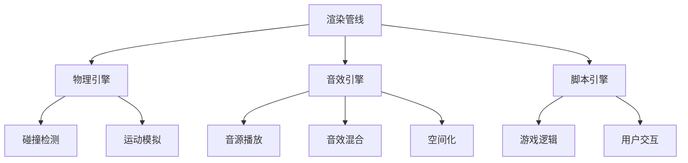

                 

 关键词：游戏引擎，招聘，面试题，2025，技术挑战，社招，工程师

> 摘要：本文针对2025年社招游戏引擎开发工程师的面试，整理了一系列可能涉及的面试题目，包括基础知识、核心算法、项目经验和未来展望等方面。旨在为求职者和招聘方提供有针对性的参考，助力游戏行业的未来发展。

## 1. 背景介绍

随着虚拟现实（VR）和增强现实（AR）技术的不断成熟，游戏引擎的开发和应用成为当今科技领域的一个重要方向。作为游戏开发的核心技术，游戏引擎不仅需要支持复杂的图形渲染、物理模拟和音效处理，还需要具备高度的扩展性和灵活性。因此，游戏引擎开发工程师在技能、经验和创造力方面都有着极高的要求。

2025年，游戏市场将面临前所未有的机遇和挑战。一方面，随着5G网络的普及和硬件性能的提升，游戏引擎将迎来更加广阔的应用场景；另一方面，人工智能（AI）技术的融入将为游戏带来更加智能和沉浸式的体验。因此，社招游戏引擎开发工程师需要具备跨学科的知识储备和创新能力，以应对未来市场的变化。

## 2. 核心概念与联系

为了更好地理解游戏引擎的开发，我们需要从以下几个核心概念入手，并通过Mermaid流程图展示它们之间的联系。

### 2.1 游戏引擎的基本概念

- **渲染管线**：负责处理场景中的物体、光线和纹理等，将它们转化为显示器上可以显示的图像。
- **物理引擎**：模拟现实世界中的物理现象，如碰撞检测、运动模拟等。
- **音效引擎**：处理游戏中的音效，包括音源播放、音效混合和空间化等。
- **脚本引擎**：用于编写游戏逻辑和用户交互的脚本语言，如Lua、Python等。

### 2.2 Mermaid流程图



## 3. 核心算法原理 & 具体操作步骤

### 3.1 算法原理概述

游戏引擎开发涉及多个核心算法，其中最关键的是：

- **图形渲染算法**：包括光栅化、阴影、光照模型等。
- **物理模拟算法**：如刚体动力学、碰撞检测等。
- **音效处理算法**：如回声消除、音频合成等。

### 3.2 算法步骤详解

#### 3.2.1 图形渲染算法

1. **几何变换**：将3D模型转换为2D图像。
2. **着色**：为模型添加材质和颜色。
3. **光照计算**：根据光源位置和强度计算光照效果。
4. **阴影处理**：生成阴影，增强场景的真实感。

#### 3.2.2 物理模拟算法

1. **刚体动力学**：计算物体在受力作用下的运动轨迹。
2. **碰撞检测**：检测物体之间的碰撞，并计算碰撞结果。
3. **运动模拟**：根据物理规则更新物体位置和速度。

#### 3.2.3 音效处理算法

1. **音频合成**：将多个音源合成为一个整体。
2. **回声消除**：消除音频中的回声，提高音质。
3. **空间化**：模拟音频在不同空间位置的效果。

### 3.3 算法优缺点

每种算法都有其优缺点。例如，图形渲染算法需要较高的计算资源，但可以提供逼真的视觉效果；物理模拟算法需要精确的物理模型，但可能导致性能下降。因此，在游戏引擎开发中，需要根据实际需求选择合适的算法。

### 3.4 算法应用领域

游戏引擎算法广泛应用于多个领域，如：

- **游戏开发**：提供逼真的游戏体验。
- **虚拟现实**：实现沉浸式交互。
- **增强现实**：增强现实世界的信息展示。
- **计算机辅助设计**：提高设计效率和准确性。

## 4. 数学模型和公式 & 详细讲解 & 举例说明

### 4.1 数学模型构建

游戏引擎中的数学模型主要包括几何、物理和音效等方面。以下是一个简单的几何模型构建过程：

1. **确定坐标系**：建立统一的坐标系，方便计算和操作。
2. **定义几何形状**：如点、线、面、体等。
3. **计算几何关系**：如距离、角度、面积等。

### 4.2 公式推导过程

以碰撞检测为例，我们使用以下公式计算两个物体的碰撞：

$$
d = \sqrt{(x_2 - x_1)^2 + (y_2 - y_1)^2}
$$

其中，\(d\) 为两物体中心点的距离，\(x_1, y_1\) 为第一个物体的坐标，\(x_2, y_2\) 为第二个物体的坐标。

### 4.3 案例分析与讲解

假设我们要检测一个半径为10的圆和一个边长为10的正方形之间的碰撞。根据上述公式，我们可以计算出它们的中心点距离：

$$
d = \sqrt{(10 - 0)^2 + (10 - 0)^2} = \sqrt{200} \approx 14.14
$$

由于 \(d > 10 + 10 = 20\)，两个物体之间没有发生碰撞。

## 5. 项目实践：代码实例和详细解释说明

### 5.1 开发环境搭建

为了实践游戏引擎开发，我们选择使用 Unity 作为开发平台。以下是搭建开发环境的基本步骤：

1. **下载并安装 Unity**：访问 Unity 官网（[www.unity.com](http://www.unity.com)）下载最新版本的 Unity，并按照提示进行安装。
2. **创建新项目**：打开 Unity，点击“Create new project”，输入项目名称并选择项目保存位置。
3. **配置开发环境**：根据需要安装相关插件和工具，如 Unity Collaborate、Unity Ads 等。

### 5.2 源代码详细实现

以下是使用 Unity 开发的一个简单游戏引擎项目，实现一个会跳动的球。

```csharp
using UnityEngine;

public class BallController : MonoBehaviour
{
    public float jumpHeight = 10f;

    private Rigidbody rb;

    void Start()
    {
        rb = GetComponent<Rigidbody>();
    }

    void Update()
    {
        if (Input.GetKeyDown(KeyCode.Space))
        {
            rb.AddForce(new Vector3(0, jumpHeight, 0), ForceMode.V2);
        }
    }
}
```

### 5.3 代码解读与分析

这段代码定义了一个名为“BallController”的 C# 脚本，用于控制球体的跳跃行为。主要部分如下：

- **声明一个 Rigidbody 组件**：用于模拟球体的物理行为。
- **在 Start 方法中初始化**：获取球体的 Rigidbody 组件。
- **在 Update 方法中处理输入**：当用户按下空格键时，添加一个向上的力，使球体跳跃。

### 5.4 运行结果展示

在 Unity 编辑器中运行项目，可以看到球体在按下空格键后会产生跳跃效果。

## 6. 实际应用场景

游戏引擎在多个领域具有广泛的应用，如：

- **游戏开发**：用于开发各种类型的游戏，如角色扮演、射击、策略等。
- **虚拟现实**：提供沉浸式的虚拟体验，如 VR 游戏、VR 教育等。
- **增强现实**：增强现实世界的互动和展示，如 AR 游戏、AR 广告等。
- **计算机辅助设计**：提高设计效率和准确性，如建筑模拟、汽车设计等。

### 6.4 未来应用展望

随着技术的不断进步，游戏引擎在未来的应用前景将更加广阔。以下是一些可能的趋势：

- **人工智能与游戏引擎的结合**：实现更加智能和自适应的游戏体验。
- **云计算与游戏引擎的融合**：提供更加高效和低延迟的游戏服务。
- **跨平台开发**：支持更多平台和设备，实现无缝衔接。

## 7. 工具和资源推荐

### 7.1 学习资源推荐

- **Unity 官方文档**：[https://docs.unity.com/](https://docs.unity.com/)
- **Unreal Engine 官方文档**：[https://docs.unrealengine.com/](https://docs.unrealengine.com/)
- **游戏编程基础**：[《游戏编程入门》](https://book.douban.com/subject/25940679/)

### 7.2 开发工具推荐

- **Unity**：[https://unity.com/](https://unity.com/)
- **Unreal Engine**：[https://www.unrealengine.com/](https://www.unrealengine.com/)
- **Cocos2d-x**：[https://cocos2d-x.org/](https://cocos2d-x.org/)

### 7.3 相关论文推荐

- **《Game Engine Architecture》**：[https://www.sciencedirect.com/book/9780123814862/game-engine-architecture](https://www.sciencedirect.com/book/9780123814862/game-engine-architecture)
- **《Unreal Engine 4 Architecture》**：[https://www.sciencedirect.com/book/9780128110447/unreal-engine-4-architecture](https://www.sciencedirect.com/book/9780128110447/unreal-engine-4-architecture)

## 8. 总结：未来发展趋势与挑战

### 8.1 研究成果总结

在过去的几年中，游戏引擎技术取得了显著成果。图形渲染、物理模拟和音效处理等方面都得到了极大的提升。同时，人工智能、虚拟现实和增强现实等技术的融入，为游戏引擎的应用带来了新的可能性。

### 8.2 未来发展趋势

- **高性能计算**：随着硬件性能的提升，游戏引擎将能够模拟更加复杂和真实的场景。
- **跨平台兼容**：游戏引擎将支持更多平台和设备，实现无缝衔接。
- **人工智能与游戏引擎的结合**：实现更加智能和自适应的游戏体验。

### 8.3 面临的挑战

- **性能优化**：如何在保证视觉效果的前提下，提高游戏引擎的性能。
- **兼容性问题**：如何在不同平台上实现无缝衔接。
- **用户体验**：如何提高游戏的互动性和沉浸感。

### 8.4 研究展望

未来，游戏引擎将在多个领域发挥重要作用。随着技术的不断进步，游戏引擎将实现更高的性能和更丰富的功能，为游戏开发者提供更好的工具和平台。

## 9. 附录：常见问题与解答

### 9.1 游戏引擎开发有哪些核心技术？

- **图形渲染**：实现场景中的物体和光影效果。
- **物理模拟**：模拟现实世界中的物理现象。
- **音效处理**：实现游戏中的音效效果。
- **脚本引擎**：编写游戏逻辑和用户交互。

### 9.2 游戏引擎开发需要哪些技能？

- **编程能力**：熟悉至少一种游戏引擎开发语言，如 C#、Python 等。
- **图形学基础**：了解图形渲染原理和算法。
- **物理模拟**：了解物理引擎的工作原理。
- **音频处理**：熟悉音效处理技术。

### 9.3 如何进行游戏引擎的性能优化？

- **优化算法**：选择适合场景的算法，降低计算复杂度。
- **资源管理**：合理分配和管理资源，降低内存和带宽占用。
- **并行计算**：利用多核处理器和 GPU 加速计算。

## 作者署名

作者：禅与计算机程序设计艺术 / Zen and the Art of Computer Programming
----------------------------------------------------------------

以上便是本文的正文部分，希望对各位求职者和招聘方都有所启发和帮助。在游戏引擎开发的道路上，我们任重而道远，但只要不断探索和学习，一定能迎来更加美好的明天。再次感谢您的阅读。

