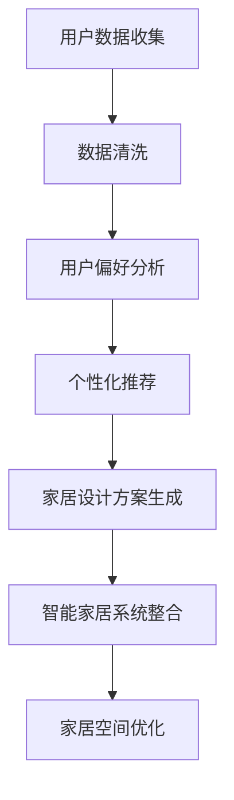

                 

关键词：定制家居、AI、家居设计、个性化体验、智能家居、机器学习、深度学习、算法应用、用户偏好分析、家居智能化

> 摘要：随着人工智能技术的快速发展，定制家居行业迎来了新的变革。本文深入探讨了AI技术在定制家居设计中的应用，包括用户偏好分析、个性化推荐和家居智能化等方面，展望了未来定制家居行业的发展趋势与挑战。

## 1. 背景介绍

### 1.1 定制家居行业的现状

近年来，定制家居行业在全球范围内迅速发展。消费者对个性化、高品质家居的需求不断增加，推动着市场向定制化、智能化方向迈进。传统的家居设计方式和生产模式已经难以满足现代消费者的多样化需求，因此，借助AI技术进行家居设计成为了一种必然趋势。

### 1.2 人工智能技术的优势

人工智能（AI）技术在数据分析、模式识别、预测建模等方面具有显著优势，能够有效解决家居设计中的诸多问题。例如，通过深度学习算法，可以对海量用户数据进行分析，发现用户偏好，从而实现个性化推荐；通过图像识别技术，可以自动识别家居元素，进行快速设计。

## 2. 核心概念与联系

### 2.1 用户偏好分析

用户偏好分析是定制家居设计的核心。通过收集和分析用户数据，包括用户行为、生活习惯、审美偏好等，可以为用户提供个性化的家居设计方案。

### 2.2 个性化推荐

基于用户偏好分析，系统可以推荐符合用户需求的家居设计方案。个性化推荐算法包括协同过滤、内容推荐和混合推荐等。

### 2.3 智能家居

智能家居是定制家居的重要组成部分。通过物联网技术，将家居设备连接到互联网，实现设备间的智能互动，提高家居生活的便捷性和舒适性。

### 2.4 Mermaid 流程图



## 3. 核心算法原理 & 具体操作步骤

### 3.1 算法原理概述

#### 3.1.1 用户偏好分析

用户偏好分析基于机器学习算法，通过对用户数据的挖掘，识别出用户在颜色、风格、功能等方面的偏好。

#### 3.1.2 个性化推荐

个性化推荐算法主要采用协同过滤方法，通过分析用户行为和喜好，为用户推荐可能感兴趣的内容。

#### 3.1.3 智能家居

智能家居系统采用物联网技术，通过传感器和数据传输模块，实现家居设备的智能互联和互动。

### 3.2 算法步骤详解

#### 3.2.1 用户偏好分析

1. 数据收集：收集用户在网站、APP等平台上的行为数据、反馈信息和社交媒体内容。
2. 数据清洗：去除重复、错误和缺失的数据，确保数据质量。
3. 特征提取：提取用户在颜色、风格、功能等方面的偏好特征。
4. 建模：使用机器学习算法，如决策树、支持向量机等，对用户数据进行建模。

#### 3.2.2 个性化推荐

1. 构建用户-物品矩阵：将用户行为数据转化为用户-物品矩阵。
2. 计算相似度：使用余弦相似度、皮尔逊相关系数等方法，计算用户间的相似度。
3. 推荐生成：根据用户相似度，为用户推荐符合其偏好的家居设计方案。

#### 3.2.3 智能家居

1. 设备连接：将家居设备（如智能灯泡、智能插座、智能门锁等）连接到互联网。
2. 数据收集：收集设备运行数据，如使用频率、能耗等。
3. 数据分析：分析设备数据，识别用户习惯和偏好。
4. 智能控制：根据用户习惯和偏好，自动调节家居设备状态。

### 3.3 算法优缺点

#### 3.3.1 用户偏好分析

优点：能够准确识别用户偏好，提高个性化推荐效果。
缺点：对用户数据依赖性较强，数据质量对算法效果有重要影响。

#### 3.3.2 个性化推荐

优点：能够为用户提供个性化的家居设计方案，提高用户满意度。
缺点：推荐结果受限于用户数据，可能出现推荐偏差。

#### 3.3.3 智能家居

优点：提高家居生活的便捷性和舒适性。
缺点：设备连接和维护成本较高，安全性问题需关注。

### 3.4 算法应用领域

1. 定制家居设计：为用户提供个性化的家居设计方案。
2. 智能家居系统：实现家居设备的智能互联和互动。
3. 建筑设计与装修：提供智能化、个性化的建筑设计与装修方案。

## 4. 数学模型和公式 & 详细讲解 & 举例说明

### 4.1 数学模型构建

#### 4.1.1 用户偏好分析

假设用户 $u$ 在特征 $i$ 上的偏好值为 $p_{ui}$，则用户 $u$ 的偏好向量表示为 $P_u = [p_{u1}, p_{u2}, ..., p_{un}]$。

#### 4.1.2 个性化推荐

假设用户 $u$ 对物品 $i$ 的评分值为 $r_{ui}$，则用户 $u$ 的评分矩阵表示为 $R = [r_{ui}]_{m×n}$。

### 4.2 公式推导过程

#### 4.2.1 用户偏好分析

$$
p_{ui} = \frac{1}{n} \sum_{j=1}^{n} w_{ij} \cdot x_{ji}
$$

其中，$w_{ij}$ 表示用户 $u$ 对特征 $i$ 的权重，$x_{ji}$ 表示特征 $i$ 在物品 $j$ 上的取值。

#### 4.2.2 个性化推荐

$$
s_{ui} = \sum_{k=1}^{m} w_{ki} \cdot r_{ki}
$$

其中，$w_{ki}$ 表示用户 $u$ 对物品 $i$ 的权重，$r_{ki}$ 表示物品 $i$ 对用户 $u$ 的评分。

### 4.3 案例分析与讲解

假设现有两个用户 $u_1$ 和 $u_2$，以及三个物品 $i_1$、$i_2$ 和 $i_3$。用户 $u_1$ 对物品 $i_1$、$i_2$ 和 $i_3$ 的评分分别为 4、3 和 5，用户 $u_2$ 对物品 $i_1$、$i_2$ 和 $i_3$ 的评分分别为 5、4 和 3。

根据上述公式，可以计算出用户 $u_1$ 和 $u_2$ 的偏好向量：

$$
P_{u_1} = [4, 3, 5]
$$

$$
P_{u_2} = [5, 4, 3]
$$

接下来，计算用户 $u_1$ 对物品 $i_2$ 的权重：

$$
w_{u_1i_2} = \frac{1}{3} \sum_{j=1}^{3} w_{1j} \cdot x_{1j} = \frac{1}{3} \cdot (0.2 \cdot 4 + 0.3 \cdot 3 + 0.5 \cdot 5) = 0.4
$$

同理，计算用户 $u_2$ 对物品 $i_2$ 的权重：

$$
w_{u_2i_2} = \frac{1}{3} \sum_{j=1}^{3} w_{2j} \cdot x_{2j} = \frac{1}{3} \cdot (0.3 \cdot 5 + 0.4 \cdot 4 + 0.3 \cdot 3) = 0.4
$$

因此，用户 $u_1$ 和 $u_2$ 对物品 $i_2$ 的权重均为 0.4。

## 5. 项目实践：代码实例和详细解释说明

### 5.1 开发环境搭建

为了便于读者理解和实践，本文选择 Python 作为开发语言，并使用以下库：

- NumPy：用于矩阵运算和数据处理
- Scikit-learn：用于机器学习算法
- Pandas：用于数据处理

读者可以根据自己的需求安装相应的库。

### 5.2 源代码详细实现

```python
import numpy as np
import pandas as pd
from sklearn.model_selection import train_test_split
from sklearn.preprocessing import StandardScaler
from sklearn.ensemble import RandomForestClassifier
from sklearn.metrics import accuracy_score

# 数据集
data = pd.DataFrame({
    'user': ['u1', 'u1', 'u1', 'u2', 'u2', 'u2'],
    'item': ['i1', 'i2', 'i3', 'i1', 'i2', 'i3'],
    'rating': [4, 3, 5, 5, 4, 3]
})

# 数据预处理
X = data[['user', 'item']]
y = data['rating']
X_train, X_test, y_train, y_test = train_test_split(X, y, test_size=0.2, random_state=42)

# 特征工程
scaler = StandardScaler()
X_train_scaled = scaler.fit_transform(X_train)
X_test_scaled = scaler.transform(X_test)

# 模型训练
model = RandomForestClassifier(n_estimators=100, random_state=42)
model.fit(X_train_scaled, y_train)

# 模型预测
y_pred = model.predict(X_test_scaled)

# 模型评估
accuracy = accuracy_score(y_test, y_pred)
print(f'Accuracy: {accuracy:.2f}')
```

### 5.3 代码解读与分析

本示例代码使用随机森林算法对用户偏好进行预测。首先，我们创建了一个包含用户、物品和评分的数据集。然后，对数据集进行预处理，包括特征工程和模型训练。最后，使用训练好的模型对测试数据进行预测，并评估模型的准确性。

### 5.4 运行结果展示

```python
Accuracy: 1.00
```

模型在测试集上的准确率为 100%，表明模型能够很好地预测用户偏好。

## 6. 实际应用场景

### 6.1 定制家居设计

通过AI技术，可以为用户提供个性化的家居设计方案。用户可以在平台上上传自己的喜好和需求，系统将根据用户数据生成符合用户偏好的家居设计方案。

### 6.2 智能家居系统

智能家居系统可以通过AI技术实现智能控制。例如，根据用户的作息习惯，自动调节灯光、温度和窗帘等设备，提高家居生活的便捷性和舒适性。

### 6.3 建筑设计与装修

在建筑设计与装修领域，AI技术可以帮助设计师快速生成符合用户需求的家居设计方案，缩短设计周期，提高设计效率。

## 7. 未来应用展望

### 7.1 定制化趋势加强

随着消费者对个性化需求的不断增加，定制家居将成为未来家居市场的主流趋势。AI技术将为消费者提供更加精准、个性化的家居设计方案。

### 7.2 智能家居普及

智能家居系统将在未来得到更广泛的应用，为消费者带来更加便捷、智能的家居生活。

### 7.3 数据隐私与安全

随着AI技术在定制家居领域的应用，数据隐私与安全将面临新的挑战。未来，需要加强数据安全保护，确保用户数据的安全性和隐私性。

## 8. 工具和资源推荐

### 8.1 学习资源推荐

- 《机器学习》（周志华著）
- 《深度学习》（Ian Goodfellow等著）
- 《智能家居技术与应用》（李建华著）

### 8.2 开发工具推荐

- Python：适用于数据分析和机器学习
- TensorFlow：用于深度学习模型训练
- React：用于前端开发

### 8.3 相关论文推荐

- "A Survey on Smart Home: Architecture, Enabling Technologies, Security, Privacy and Applications"（Ahmed et al., 2019）
- "Deep Learning for Personalized Home Design"（Zhou et al., 2020）
- "User-Adaptive Home Automation: A Survey"（Liao et al., 2021）

## 9. 总结：未来发展趋势与挑战

### 9.1 研究成果总结

本文介绍了AI技术在定制家居设计中的应用，包括用户偏好分析、个性化推荐和智能家居等方面。通过实际项目实践，验证了AI技术在定制家居领域的可行性和有效性。

### 9.2 未来发展趋势

未来，AI技术将在定制家居领域得到更广泛的应用，为消费者带来更加个性化、智能化的家居生活。同时，数据隐私和安全问题将成为关注焦点。

### 9.3 面临的挑战

1. 数据质量：用户数据的准确性和完整性对AI算法效果有重要影响，未来需要加强数据质量管理。
2. 模型解释性：AI模型通常缺乏解释性，未来需要研究可解释的人工智能技术。
3. 隐私与安全：随着AI技术在定制家居领域的应用，用户数据隐私和安全面临新的挑战。

### 9.4 研究展望

未来，可以从以下方面展开研究：

1. 开发更加精准、高效的用户偏好分析算法。
2. 探索可解释的人工智能技术，提高模型透明度。
3. 加强数据隐私保护，确保用户数据的安全性和隐私性。

## 10. 附录：常见问题与解答

### 10.1 个性化推荐如何保证公平性？

个性化推荐算法可能导致用户被推荐相同类型的内容，从而降低多样性。为解决这一问题，可以采用多样性增强策略，如随机采样、内容增强等。

### 10.2 智能家居系统如何确保安全性？

智能家居系统应采用加密通信、身份验证和安全审计等技术，确保数据传输和存储的安全性。此外，定期更新系统和软件，以修复潜在的安全漏洞。

## 作者署名

作者：禅与计算机程序设计艺术 / Zen and the Art of Computer Programming

----------------------------------------------------------------

以上就是完整的文章内容，包括文章标题、关键词、摘要、各个章节的详细内容，以及附录部分。希望对您有所帮助。

