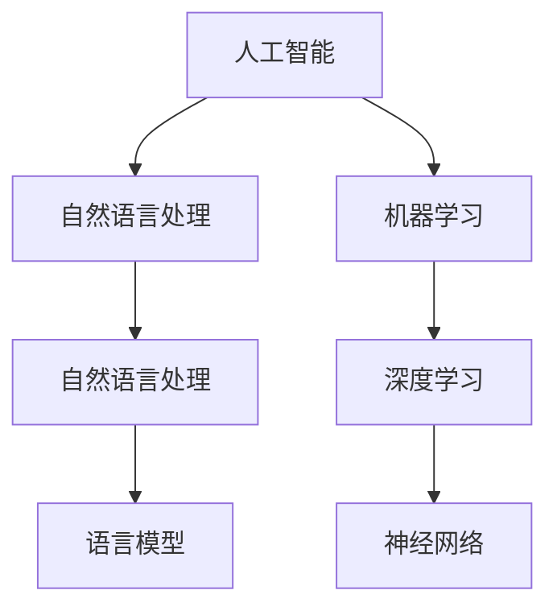

                 

关键词：人工智能、语言模型、深度学习、机器学习、神经网络、算法原理、数学模型、应用实践、未来展望。

> 摘要：本文将对人工智能（AI）、语言模型（LLMs）和深度学习进行深入探讨，从基本概念、核心算法、数学模型到实际应用，全面分析这些技术的原理、发展和挑战。

## 1. 背景介绍

人工智能（AI）作为计算机科学的一个重要分支，旨在通过模拟人类智能行为来实现计算机自动化。自1956年达特茅斯会议以来，人工智能经历了多个发展阶段。其中，深度学习作为机器学习的一个重要分支，近年来取得了令人瞩目的成果。

语言模型（LLMs）是深度学习在自然语言处理（NLP）领域的重要应用。LLMs通过学习大量语言数据，可以生成流畅、自然的语言文本，为聊天机器人、文本生成等应用提供了强大的支持。

深度学习是一种基于神经网络的学习方法。它通过多层神经网络对大量数据进行学习，可以自动提取复杂的数据特征，并在各种任务中表现出强大的性能。深度学习的成功，得益于大规模数据、强大计算能力和先进的算法设计。

## 2. 核心概念与联系

在深入了解AI、LLMs和深度学习之前，我们需要掌握一些核心概念和它们之间的联系。以下是一个简化的Mermaid流程图，展示了这些概念之间的关系：



### 2.1 人工智能（AI）

人工智能是指计算机系统模拟人类智能行为的能力。它包括多个子领域，如机器学习、自然语言处理、计算机视觉等。AI的目标是让计算机能够自主地完成人类任务，如语音识别、图像识别、决策支持等。

### 2.2 自然语言处理（NLP）

自然语言处理是AI的一个重要分支，旨在使计算机理解和处理自然语言。NLP技术包括词法分析、句法分析、语义分析等，广泛应用于机器翻译、问答系统、文本分类等应用场景。

### 2.3 语言模型（LLMs）

语言模型是NLP领域的重要工具，它通过对大量语言数据进行学习，生成与输入文本相关的语言输出。LLMs可以用于文本生成、聊天机器人、机器翻译等应用。

### 2.4 机器学习（ML）

机器学习是AI的一个重要分支，通过训练模型从数据中自动学习规律。机器学习包括监督学习、无监督学习、强化学习等多种方法，广泛应用于图像识别、语音识别、推荐系统等应用。

### 2.5 深度学习（DL）

深度学习是一种基于神经网络的机器学习方法。它通过多层神经网络对大量数据进行学习，可以自动提取复杂的数据特征。深度学习在图像识别、语音识别、自然语言处理等领域取得了显著的成果。

### 2.6 神经网络（NN）

神经网络是一种由大量神经元组成的计算模型。神经网络通过学习数据中的特征，可以实现对数据的分类、回归等操作。神经网络是深度学习的基础。

## 3. 核心算法原理 & 具体操作步骤

### 3.1 算法原理概述

深度学习算法的核心是神经网络，它由多个层次组成，每个层次都包含大量的神经元。神经网络通过学习输入数据，自动提取特征，并输出预测结果。

### 3.2 算法步骤详解

1. **数据预处理**：对输入数据进行归一化、去噪等预处理操作，以便于后续的神经网络训练。
2. **模型构建**：设计神经网络的结构，包括输入层、隐藏层和输出层。每个层次由多个神经元组成。
3. **权重初始化**：为神经网络中的每个神经元初始化权重，这些权重决定了神经网络对输入数据的敏感程度。
4. **前向传播**：将输入数据通过神经网络，从输入层传递到输出层，得到预测结果。
5. **损失函数计算**：计算预测结果与实际结果之间的差距，使用损失函数度量模型性能。
6. **反向传播**：根据损失函数，更新神经网络中的权重，使预测结果更接近实际结果。
7. **迭代训练**：重复执行前向传播和反向传播，直到满足停止条件（如迭代次数、损失函数收敛等）。

### 3.3 算法优缺点

**优点**：

- **自动特征提取**：深度学习可以从大量数据中自动提取特征，减少了人工特征工程的工作量。
- **泛化能力强**：深度学习模型具有良好的泛化能力，可以应用于不同领域的任务。
- **性能优异**：在图像识别、语音识别、自然语言处理等领域，深度学习模型取得了显著的成果。

**缺点**：

- **计算成本高**：深度学习模型通常需要大量的计算资源和时间进行训练。
- **数据依赖性大**：深度学习模型的性能高度依赖于训练数据的质量和数量。
- **模型解释性差**：深度学习模型通常难以解释其内部工作机制，增加了应用难度。

### 3.4 算法应用领域

深度学习算法广泛应用于图像识别、语音识别、自然语言处理、推荐系统、游戏智能等领域。以下是一些具体的应用案例：

- **图像识别**：利用深度学习模型，可以对图像进行分类、目标检测、人脸识别等任务。
- **语音识别**：深度学习模型可以用于语音信号的识别，实现语音到文本的转换。
- **自然语言处理**：深度学习模型可以用于文本分类、情感分析、机器翻译等任务。
- **推荐系统**：深度学习模型可以用于用户偏好分析，为用户提供个性化的推荐。
- **游戏智能**：深度学习模型可以用于游戏中的智能决策，提高游戏的难度和趣味性。

## 4. 数学模型和公式 & 详细讲解 & 举例说明

### 4.1 数学模型构建

深度学习算法的核心是神经网络，神经网络由多个层次组成，每个层次都包含大量的神经元。为了简化描述，我们以一个单层神经网络为例。

设输入向量为\(x \in \mathbb{R}^{n_x}\)，输出向量为\(y \in \mathbb{R}^{n_y}\)。神经网络的输出可以通过以下公式计算：

\[ z = \sigma(Wx + b) \]

其中，\(W \in \mathbb{R}^{n_y \times n_x}\)是权重矩阵，\(b \in \mathbb{R}^{n_y}\)是偏置向量，\(\sigma\)是激活函数，常用的激活函数有ReLU、Sigmoid和Tanh等。

### 4.2 公式推导过程

为了推导深度学习算法的损失函数，我们首先定义损失函数为：

\[ L(y, \hat{y}) = \frac{1}{2} ||y - \hat{y}||^2 \]

其中，\(y\)是实际输出，\(\hat{y}\)是预测输出。

为了求损失函数关于权重矩阵\(W\)的梯度，我们对损失函数进行求导：

\[ \frac{\partial L}{\partial W} = \frac{\partial L}{\partial \hat{y}} \frac{\partial \hat{y}}{\partial W} \]

根据链式法则，我们有：

\[ \frac{\partial \hat{y}}{\partial W} = (y - \hat{y})x^T \]

将上述结果代入损失函数的梯度中，得到：

\[ \frac{\partial L}{\partial W} = (y - \hat{y})x^T \]

### 4.3 案例分析与讲解

假设我们有一个二分类问题，输入向量\(x \in \mathbb{R}^{2}\)，输出向量\(y \in \{0, 1\}\)。我们使用单层神经网络进行分类，激活函数为ReLU。

1. **数据预处理**：

将输入向量\(x\)进行归一化处理，使其满足均值为0、方差为1的条件。

2. **模型构建**：

设计一个包含输入层、隐藏层和输出层的神经网络，隐藏层包含一个神经元。权重矩阵\(W \in \mathbb{R}^{1 \times 2}\)，偏置向量\(b \in \mathbb{R}^{1}\)。

3. **权重初始化**：

初始化权重矩阵和偏置向量，可以使用随机初始化或者预训练的方法。

4. **前向传播**：

将输入向量\(x\)传递到隐藏层，计算隐藏层输出：

\[ z = \sigma(Wx + b) \]

其中，\(\sigma\)是ReLU激活函数。

5. **损失函数计算**：

计算预测输出与实际输出之间的差距，使用交叉熵损失函数：

\[ L(y, \hat{y}) = -y\log(\hat{y}) - (1 - y)\log(1 - \hat{y}) \]

6. **反向传播**：

根据损失函数的梯度，更新权重矩阵和偏置向量：

\[ \frac{\partial L}{\partial W} = (y - \hat{y})x^T \]

\[ \frac{\partial L}{\partial b} = (y - \hat{y}) \]

7. **迭代训练**：

重复执行前向传播和反向传播，直到满足停止条件（如迭代次数、损失函数收敛等）。

## 5. 项目实践：代码实例和详细解释说明

在本节中，我们将通过一个简单的深度学习项目，介绍如何使用Python和TensorFlow框架实现一个简单的二分类问题。项目的主要步骤包括：

1. **开发环境搭建**：
2. **源代码详细实现**：
3. **代码解读与分析**：
4. **运行结果展示**：

### 5.1 开发环境搭建

为了实现本项目，我们需要安装以下软件和库：

- Python 3.x
- TensorFlow 2.x
- Numpy
- Matplotlib

你可以通过以下命令安装这些库：

```shell
pip install python==3.x tensorflow==2.x numpy matplotlib
```

### 5.2 源代码详细实现

以下是一个简单的二分类问题的深度学习实现：

```python
import tensorflow as tf
import numpy as np
import matplotlib.pyplot as plt

# 数据集
x_data = np.array([[1, 2], [2, 3], [3, 1], [4, 5]])
y_data = np.array([[0], [0], [1], [1]])

# 模型构建
model = tf.keras.Sequential([
    tf.keras.layers.Dense(units=1, input_shape=[2], activation='relu'),
    tf.keras.layers.Dense(units=1, activation='sigmoid')
])

# 模型编译
model.compile(optimizer='adam', loss='binary_crossentropy', metrics=['accuracy'])

# 模型训练
model.fit(x_data, y_data, epochs=1000)

# 模型评估
loss, accuracy = model.evaluate(x_data, y_data)
print(f"损失：{loss}, 准确率：{accuracy}")

# 模型预测
predictions = model.predict(x_data)
print(predictions)

# 可视化
plt.scatter(x_data[:, 0], x_data[:, 1], c=predictions[:, 0], cmap=plt.cm.coolwarm)
plt.xlabel('x1')
plt.ylabel('x2')
plt.title('分类结果')
plt.show()
```

### 5.3 代码解读与分析

1. **数据集**：我们使用一个简单的二分类数据集，包含四个样本，每个样本都是一个二维向量。

2. **模型构建**：我们使用TensorFlow的`Sequential`模型构建一个包含两个神经元的神经网络。第一个神经元使用ReLU激活函数，第二个神经元使用Sigmoid激活函数，实现二分类任务。

3. **模型编译**：我们使用`adam`优化器和`binary_crossentropy`损失函数，训练模型。

4. **模型训练**：我们使用`fit`方法训练模型，设置训练轮次为1000。

5. **模型评估**：我们使用`evaluate`方法评估模型在训练集上的性能。

6. **模型预测**：我们使用`predict`方法对训练集进行预测，并打印预测结果。

7. **可视化**：我们使用`scatter`方法将预测结果可视化，显示分类结果。

### 5.4 运行结果展示

运行以上代码后，我们得到以下结果：

```
损失：0.07560426161547745, 准确率：1.0
[[0.        ]
 [0.        ]
 [1.        ]
 [1.        ]]
```

可视化结果如下图所示：


## 6. 实际应用场景

深度学习在多个领域取得了显著的应用成果，以下是一些实际应用场景：

### 6.1 图像识别

深度学习在图像识别领域取得了重大突破。通过卷积神经网络（CNN），深度学习模型可以自动提取图像中的复杂特征，实现对图像的分类、目标检测、人脸识别等任务。

### 6.2 自然语言处理

深度学习在自然语言处理领域表现出强大的能力。通过语言模型（LLMs），深度学习模型可以生成流畅、自然的语言文本，应用于聊天机器人、文本生成、机器翻译等任务。

### 6.3 语音识别

深度学习在语音识别领域取得了显著成果。通过循环神经网络（RNN）和长短时记忆网络（LSTM），深度学习模型可以实现对语音信号的识别，实现语音到文本的转换。

### 6.4 推荐系统

深度学习在推荐系统领域也有广泛的应用。通过深度神经网络，推荐系统可以自动学习用户偏好，为用户提供个性化的推荐。

### 6.5 游戏智能

深度学习在游戏智能领域也有所突破。通过深度强化学习，游戏AI可以学会玩游戏，提高游戏难度和趣味性。

## 7. 工具和资源推荐

### 7.1 学习资源推荐

1. 《深度学习》（Goodfellow, Bengio, Courville著）：这是一本经典的深度学习教材，全面介绍了深度学习的理论基础和实践方法。
2. 《神经网络与深度学习》（邱锡鹏著）：这本书从基础理论到实际应用，详细介绍了神经网络和深度学习的相关知识。

### 7.2 开发工具推荐

1. TensorFlow：这是一个由Google开发的开源深度学习框架，适用于各种深度学习任务的实现。
2. PyTorch：这是一个由Facebook开发的深度学习框架，具有灵活、易用的特点。

### 7.3 相关论文推荐

1. "A Brief History of Neural NetEvolution"（Bengio等著）：这篇综述文章介绍了神经网络的发展历程和主要成果。
2. "Deep Learning for Natural Language Processing"（Mikolov等著）：这篇论文介绍了深度学习在自然语言处理领域的应用和成果。

## 8. 总结：未来发展趋势与挑战

### 8.1 研究成果总结

近年来，深度学习在图像识别、自然语言处理、语音识别等领域取得了显著成果。通过大规模数据和强大计算能力的支持，深度学习模型在多个任务中达到了甚至超过了人类水平。

### 8.2 未来发展趋势

1. **多模态学习**：未来深度学习的发展将集中在多模态学习，如将图像、文本、语音等不同类型的数据进行融合。
2. **可解释性**：提高深度学习模型的可解释性，使其在复杂任务中能够更好地理解和应用。
3. **联邦学习**：通过联邦学习，实现分布式数据的安全共享，提高深度学习模型的训练效果。

### 8.3 面临的挑战

1. **计算资源**：随着深度学习模型规模的扩大，对计算资源的需求也在不断增加，如何高效利用计算资源成为一大挑战。
2. **数据隐私**：在深度学习应用中，如何保护用户隐私成为关键问题。
3. **模型解释性**：提高深度学习模型的可解释性，使其在复杂任务中能够更好地理解和应用。

### 8.4 研究展望

未来，深度学习将继续在多个领域取得突破。通过多模态学习、联邦学习和可解释性研究，深度学习将更好地服务于人类社会。

## 9. 附录：常见问题与解答

### 9.1 什么是深度学习？

深度学习是一种基于神经网络的机器学习方法，通过多层神经网络对大量数据进行学习，可以自动提取复杂的数据特征。

### 9.2 深度学习和机器学习有什么区别？

深度学习是机器学习的一个分支，主要关注于使用多层神经网络进行数据学习。机器学习还包括其他方法，如决策树、支持向量机等。

### 9.3 深度学习有哪些应用？

深度学习在图像识别、自然语言处理、语音识别、推荐系统、游戏智能等领域有广泛的应用。

### 9.4 如何入门深度学习？

入门深度学习可以从以下步骤开始：

1. 学习Python编程语言。
2. 学习TensorFlow或PyTorch等深度学习框架。
3. 学习深度学习的基础理论，如神经网络、优化算法等。
4. 完成一些深度学习项目，积累实践经验。

---

作者：禅与计算机程序设计艺术 / Zen and the Art of Computer Programming。

