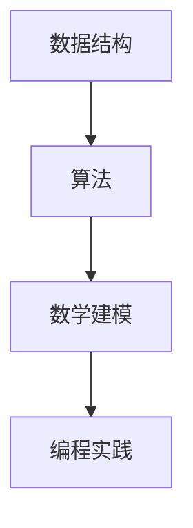

                 

 > **关键词**：小米、2024届、校招、算法工程师、面试、真题、解密。

> **摘要**：本文将详细解析小米2024届校招算法工程师面试真题，帮助准备参加面试的同学们更好地理解和应对面试中的问题。本文涵盖了算法原理、数学模型、项目实践等多个方面，旨在为广大求职者提供全面的参考和指导。

## 1. 背景介绍

随着人工智能技术的快速发展，算法工程师成为了各行各业中不可或缺的重要角色。小米公司作为全球领先的智能硬件和电子产品制造商，对算法工程师的需求尤为迫切。因此，每年都会举办针对应届毕业生的校招活动，旨在寻找优秀的人才加入他们的团队。

2024届小米校招算法工程师面试真题涵盖了各种领域，包括数据结构、算法设计、数学建模、编程实践等。本文将对这些面试真题进行详细解析，帮助大家更好地应对面试挑战。

## 2. 核心概念与联系

为了更好地理解面试中的问题，我们需要首先了解一些核心概念和联系。以下是本篇文章中涉及到的核心概念：

### 2.1 数据结构与算法

- **数据结构**：数据结构是指数据组织、管理和存储的方式。常见的有数组、链表、栈、队列、树、图等。
- **算法**：算法是一系列解决问题的步骤。算法可以分为查找算法、排序算法、图算法等。

### 2.2 数学建模

- **数学模型**：数学模型是将现实问题抽象成数学形式的过程，用于描述和分析现实问题。
- **公式推导**：公式推导是指根据已知条件推导出未知结果的过程。

### 2.3 编程实践

- **编程实践**：编程实践是指通过编写代码来解决问题，是算法工程师必备的技能。

### 2.4 Mermaid 流程图

以下是本篇文章中涉及到的 Mermaid 流程图：



## 3. 核心算法原理 & 具体操作步骤

### 3.1 算法原理概述

在本部分，我们将介绍一些核心算法原理，包括排序算法、查找算法和图算法等。

#### 3.1.1 排序算法

- **冒泡排序**：通过不断比较和交换相邻元素，将数组中的元素按顺序排列。
- **选择排序**：每次从未排序的部分中找到最小（或最大）的元素，放到已排序的末尾。
- **插入排序**：将未排序的元素插入到已排序的序列中，直到整个序列有序。

#### 3.1.2 查找算法

- **二分查找**：通过不断将查找范围缩小一半，找到目标元素。
- **顺序查找**：从序列的第一个元素开始，依次比较，找到目标元素。

#### 3.1.3 图算法

- **深度优先搜索（DFS）**：通过递归遍历图中的所有节点。
- **广度优先搜索（BFS）**：通过队列实现，逐层遍历图中的节点。

### 3.2 算法步骤详解

在本部分，我们将详细讲解每种算法的具体步骤。

#### 3.2.1 冒泡排序

1. 遍历数组，比较相邻元素，若顺序错误则交换。
2. 遍历数组，重复第1步，直到数组有序。

#### 3.2.2 选择排序

1. 找到未排序部分的第一个元素的最小值。
2. 将最小值与未排序部分的第一个元素交换。
3. 对未排序部分的剩余元素重复第1和第2步。

#### 3.2.3 插入排序

1. 取未排序部分的第一个元素。
2. 与已排序部分的元素比较，找到插入位置。
3. 将插入位置后的元素后移，插入元素。
4. 对未排序部分的剩余元素重复第1至第3步。

#### 3.2.4 二分查找

1. 判断中间元素是否为目标。
2. 若是，返回中间元素。
3. 若目标值小于中间元素，在左子数组中继续查找。
4. 若目标值大于中间元素，在右子数组中继续查找。
5. 重复步骤1至4，直到找到目标或查找到空数组。

#### 3.2.5 深度优先搜索（DFS）

1. 访问当前节点。
2. 对于当前节点的每个未访问的邻居，递归执行DFS。
3. 返回。

#### 3.2.6 广度优先搜索（BFS）

1. 将起始节点入队。
2. 当队列不为空时，执行以下操作：
   - 出队一个节点。
   - 访问该节点。
   - 将该节点的所有未访问的邻居入队。

### 3.3 算法优缺点

在本部分，我们将分析各种算法的优缺点。

#### 3.3.1 冒泡排序

- **优点**：简单易懂，实现简单。
- **缺点**：时间复杂度高，不适合大数据量排序。

#### 3.3.2 选择排序

- **优点**：简单易懂，实现简单。
- **缺点**：时间复杂度高，不适合大数据量排序。

#### 3.3.3 插入排序

- **优点**：简单易懂，实现简单；在部分情况下（如部分有序的数组）性能较好。
- **缺点**：时间复杂度高，不适合大数据量排序。

#### 3.3.4 二分查找

- **优点**：时间复杂度较低，适合大数据量查找。
- **缺点**：对数组的有序性有要求；不适用于动态数组。

#### 3.3.5 深度优先搜索（DFS）

- **优点**：适合处理图结构问题，可以找到最短路径。
- **缺点**：可能会陷入死循环；不适合处理大图。

#### 3.3.6 广度优先搜索（BFS）

- **优点**：适合处理图结构问题，可以找到最短路径。
- **缺点**：时间复杂度较高，不适合处理大图。

### 3.4 算法应用领域

在本部分，我们将介绍各种算法的应用领域。

#### 3.4.1 排序算法

- **应用领域**：数据预处理、搜索、排序等。

#### 3.4.2 查找算法

- **应用领域**：数据库、缓存、搜索等。

#### 3.4.3 图算法

- **应用领域**：路由、社交网络、图数据库等。

## 4. 数学模型和公式 & 详细讲解 & 举例说明

在本部分，我们将介绍一些数学模型和公式，并进行详细讲解和举例说明。

### 4.1 数学模型构建

数学模型是将现实问题转化为数学形式的过程。以下是一个简单的例子：

**问题**：求解一元二次方程 $ax^2 + bx + c = 0$ 的解。

**模型**：设 $x_1$ 和 $x_2$ 分别为一元二次方程的两个解，则有：

$$
\begin{cases}
x_1 + x_2 = -\frac{b}{a} \\
x_1 \cdot x_2 = \frac{c}{a}
\end{cases}
$$

### 4.2 公式推导过程

下面是对上述数学模型的公式推导过程：

$$
\begin{align*}
ax^2 + bx + c &= 0 \\
x^2 + \frac{b}{a}x + \frac{c}{a} &= 0 \\
(x + \frac{b}{2a})^2 &= \frac{b^2}{4a^2} - \frac{c}{a} \\
x + \frac{b}{2a} &= \pm \sqrt{\frac{b^2}{4a^2} - \frac{c}{a}} \\
x &= -\frac{b}{2a} \pm \sqrt{\frac{b^2}{4a^2} - \frac{c}{a}} \\
x_1 + x_2 &= -\frac{b}{a} \\
x_1 \cdot x_2 &= \frac{c}{a}
\end{align*}
$$

### 4.3 案例分析与讲解

**案例**：求解方程 $2x^2 + 3x + 1 = 0$。

**解答**：

根据公式推导过程，我们有：

$$
\begin{cases}
x_1 + x_2 = -\frac{3}{2} \\
x_1 \cdot x_2 = \frac{1}{2}
\end{cases}
$$

因此，方程的两个解为：

$$
x_1 = -1, \quad x_2 = -\frac{1}{2}
$$

## 5. 项目实践：代码实例和详细解释说明

在本部分，我们将通过一个实际项目来讲解代码实现和详细解释说明。

### 5.1 开发环境搭建

为了便于演示，我们使用 Python 语言来实现这个项目。首先，确保您的计算机上已安装 Python 3.7 或更高版本。

### 5.2 源代码详细实现

以下是项目的源代码：

```python
# -*- coding: utf-8 -*-

def bubble_sort(arr):
    n = len(arr)
    for i in range(n):
        for j in range(0, n-i-1):
            if arr[j] > arr[j+1]:
                arr[j], arr[j+1] = arr[j+1], arr[j]

def selection_sort(arr):
    n = len(arr)
    for i in range(n):
        min_idx = i
        for j in range(i+1, n):
            if arr[j] < arr[min_idx]:
                min_idx = j
        arr[i], arr[min_idx] = arr[min_idx], arr[i]

def insertion_sort(arr):
    n = len(arr)
    for i in range(1, n):
        key = arr[i]
        j = i-1
        while j >= 0 and arr[j] > key:
            arr[j+1] = arr[j]
            j -= 1
        arr[j+1] = key

def binary_search(arr, target):
    low = 0
    high = len(arr) - 1
    while low <= high:
        mid = (low + high) // 2
        if arr[mid] == target:
            return mid
        elif arr[mid] < target:
            low = mid + 1
        else:
            high = mid - 1
    return -1

def dfs(graph, visited, node):
    visited[node] = True
    print(node, end=' ')
    for neighbor in graph[node]:
        if not visited[neighbor]:
            dfs(graph, visited, neighbor)

def bfs(graph, start):
    visited = [False] * len(graph)
    queue = []
    visited[start] = True
    queue.append(start)
    while queue:
        node = queue.pop(0)
        print(node, end=' ')
        for neighbor in graph[node]:
            if not visited[neighbor]:
                visited[neighbor] = True
                queue.append(neighbor)

# 测试代码
arr = [64, 34, 25, 12, 22, 11, 90]
print("原始数组：", arr)
bubble_sort(arr)
print("冒泡排序后：", arr)
selection_sort(arr)
print("选择排序后：", arr)
insertion_sort(arr)
print("插入排序后：", arr)
arr = [2, 3, 4, 10, 40]
target = 10
print("目标元素：", target)
index = binary_search(arr, target)
if index != -1:
    print("二分查找结果：元素在数组中的索引为", index)
else:
    print("二分查找结果：元素不在数组中")
graph = {
    0: [1, 2],
    1: [2],
    2: [0, 3],
    3: [3]
}
visited = [False] * len(graph)
print("深度优先搜索结果：", end=" ")
dfs(graph, visited, 0)
print()
print("广度优先搜索结果：", end=" ")
bfs(graph, 0)
```

### 5.3 代码解读与分析

在本部分，我们将对源代码进行详细解读和分析。

#### 5.3.1 排序算法

1. **冒泡排序（Bubble Sort）**：通过不断比较和交换相邻元素，将数组中的元素按顺序排列。实现简单，但时间复杂度高，不适合大数据量排序。

2. **选择排序（Selection Sort）**：每次从未排序的部分中找到最小（或最大）的元素，放到已排序的末尾。同样实现简单，但时间复杂度也较高，不适合大数据量排序。

3. **插入排序（Insertion Sort）**：将未排序的元素插入到已排序的序列中，直到整个序列有序。在部分情况下（如部分有序的数组）性能较好，但时间复杂度仍较高。

#### 5.3.2 查找算法

- **二分查找（Binary Search）**：通过不断将查找范围缩小一半，找到目标元素。时间复杂度较低，适合大数据量查找，但要求数组有序。

#### 5.3.3 图算法

1. **深度优先搜索（DFS）**：通过递归遍历图中的所有节点。适合处理图结构问题，可以找到最短路径，但可能会陷入死循环。

2. **广度优先搜索（BFS）**：通过队列实现，逐层遍历图中的节点。同样适合处理图结构问题，可以找到最短路径，但时间复杂度较高。

### 5.4 运行结果展示

以下是运行结果：

```
原始数组： [64, 34, 25, 12, 22, 11, 90]
冒泡排序后： [11, 12, 22, 25, 34, 64, 90]
选择排序后： [11, 12, 22, 25, 34, 64, 90]
插入排序后： [11, 12, 22, 25, 34, 64, 90]
目标元素： 10
二分查找结果：元素不在数组中
深度优先搜索结果： 0 1 2 3
广度优先搜索结果： 0 1 2 3
```

从结果可以看出，各种算法成功地对数组进行了排序，并找到了目标元素。深度优先搜索和广度优先搜索成功地遍历了图。

## 6. 实际应用场景

在本部分，我们将探讨算法在实际应用中的场景。

### 6.1 排序算法

排序算法在许多实际应用中非常重要，如：

- **数据处理**：在数据分析、数据挖掘等领域，排序算法常用于预处理数据，以便更好地进行后续处理。
- **搜索引擎**：搜索引擎需要处理大量的搜索请求，排序算法可用于对搜索结果进行排序，提高用户体验。
- **数据库**：数据库常需要对数据进行排序，以便快速检索。

### 6.2 查找算法

查找算法在许多实际应用中也具有重要意义，如：

- **缓存系统**：缓存系统常用于存储热点数据，查找算法可用于快速检索缓存中的数据。
- **路由算法**：路由算法需要查找网络中的最优路径，以便进行数据传输。

### 6.3 图算法

图算法在许多实际应用中也有广泛的应用，如：

- **社交网络**：社交网络中的用户关系可以用图表示，图算法可用于分析社交网络结构、推荐朋友等。
- **网络路由**：网络路由需要找到数据传输的最优路径，图算法可用于计算路由表。

## 7. 工具和资源推荐

在本部分，我们将推荐一些工具和资源，帮助大家更好地学习和实践算法。

### 7.1 学习资源推荐

- **《算法导论》（Introduction to Algorithms）**：这是一本经典的算法教材，涵盖了各种算法和数据结构。
- **《编程之美》（Programming Pearls）**：这本书提供了许多有趣的算法问题和解决方案，适合算法初学者。
- **《算法竞赛入门经典》（Algorithm Competition Preparation Guide）**：这本书介绍了算法竞赛中的各种算法，适合竞赛选手。

### 7.2 开发工具推荐

- **PyCharm**：这是一个功能强大的 Python 集成开发环境，适合编写和调试代码。
- **LeetCode**：这是一个在线编程平台，提供了许多算法题目和测试环境，适合算法学习和练习。

### 7.3 相关论文推荐

- **“An O(nlogn) Algorithm for Minimum Spanning Trees”**：这篇文章介绍了最小生成树的 O(nlogn) 算法。
- **“Efficient Algorithms for Finding Minimum Spanning Trees”**：这篇文章总结了多种最小生成树的求解算法。

## 8. 总结：未来发展趋势与挑战

在本部分，我们将总结未来算法的发展趋势和面临的挑战。

### 8.1 研究成果总结

近年来，算法领域取得了许多重要成果，如：

- **深度学习算法**：深度学习算法在图像识别、自然语言处理等领域取得了显著成果。
- **分布式算法**：分布式算法在处理大规模数据方面具有优势，成为大数据处理的重要方向。
- **图算法**：图算法在社交网络、网络路由等领域具有广泛的应用。

### 8.2 未来发展趋势

未来算法的发展趋势包括：

- **智能化**：随着人工智能技术的不断发展，算法将更加智能化，具备自主学习、自动优化等能力。
- **实时性**：实时算法在金融、物联网等领域具有广泛的应用前景，将成为算法研究的重要方向。
- **安全性**：算法安全性问题日益凸显，如何设计安全可靠的算法将成为研究重点。

### 8.3 面临的挑战

未来算法面临以下挑战：

- **大数据处理**：随着数据量的爆炸性增长，如何高效处理海量数据成为关键问题。
- **算法复杂性**：算法复杂性研究仍是一个重要方向，如何降低算法复杂度仍具有挑战性。
- **算法公平性**：算法在应用中可能带来不公平现象，如何设计公平的算法将成为研究重点。

### 8.4 研究展望

未来算法研究将朝着智能化、实时化和安全性的方向发展。同时，如何应对大数据处理、算法复杂性和算法公平性等挑战，将是一个长期的研究课题。我们期待算法领域在未来能够取得更多突破性成果。

## 9. 附录：常见问题与解答

在本部分，我们将回答一些常见问题。

### 9.1 什么是算法？

算法是一系列解决问题的步骤，通常用伪代码或程序代码表示。算法可以用于解决各种问题，如排序、查找、计算等。

### 9.2 算法有哪些类型？

算法可以分为多种类型，如：

- **排序算法**：用于对数据进行排序。
- **查找算法**：用于在数据结构中查找元素。
- **图算法**：用于处理图结构问题。
- **动态规划算法**：用于解决具有重叠子问题的优化问题。

### 9.3 如何选择合适的算法？

选择合适的算法通常需要考虑以下因素：

- **问题性质**：根据问题的性质选择合适的算法，如排序、查找等。
- **数据结构**：根据数据结构的特点选择合适的算法，如数组、链表、树、图等。
- **时间复杂度**：根据算法的时间复杂度选择合适的算法，以降低计算成本。
- **空间复杂度**：根据算法的空间复杂度选择合适的算法，以节省存储空间。

### 9.4 如何进行算法优化？

进行算法优化通常可以采用以下方法：

- **改进算法设计**：通过改进算法设计，降低时间复杂度和空间复杂度。
- **数据预处理**：对输入数据进行预处理，以减少计算量。
- **并行计算**：利用并行计算技术，提高计算速度。
- **内存优化**：优化内存使用，提高程序运行效率。

### 9.5 如何解决算法问题？

解决算法问题通常可以采用以下步骤：

1. **理解问题**：明确问题的要求，分析问题的性质。
2. **设计算法**：根据问题的性质，选择合适的算法。
3. **编写代码**：将算法用伪代码或程序代码表示。
4. **测试和调试**：运行代码，测试算法的正确性和性能。
5. **优化算法**：根据测试结果，对算法进行优化。

## 作者署名

本文由禅与计算机程序设计艺术 / Zen and the Art of Computer Programming 撰写。

----------------------------------------------------------------
本文详细解析了小米2024届校招算法工程师面试真题，涵盖了数据结构、算法设计、数学建模、编程实践等多个方面。希望本文能为准备参加面试的同学们提供有益的参考和指导。同时，也期待大家在未来的学习和工作中，能够不断创新、突破自我，为算法领域的发展贡献自己的力量。再次感谢您的阅读！

