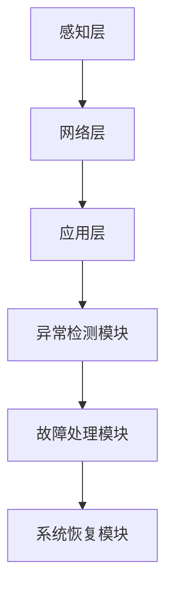

                 

关键词：智能家居、异常检测、机器学习、面试攻略、算法原理、数学模型、项目实践

> 摘要：本文旨在为准备参加小米2025智能家居异常检测社招的机器学习工程师提供一份全面的面试攻略。文章将从背景介绍、核心概念、算法原理、数学模型、项目实践、应用场景等多个维度进行详细讲解，帮助读者在面试中脱颖而出。

## 1. 背景介绍

智能家居市场正在快速发展，各种智能设备如智能灯泡、智能电视、智能音箱等已经普及到千家万户。这些设备通过互联网连接，可以实现远程控制、场景联动等功能，为用户带来了极大的便利。然而，随着智能家居设备的增多，如何确保系统的稳定性和安全性成为一个重要课题。异常检测技术可以在系统运行过程中及时发现并处理异常情况，从而保障智能家居系统的正常运行。

小米公司作为智能家居领域的领军企业，在2025年推出了智能家居异常检测的社招岗位。该岗位主要职责是利用机器学习技术，设计和实现智能家居异常检测系统，为用户提供安全可靠的智能家居体验。本次面试将重点考察应聘者的机器学习基础知识、算法理解和应用能力。

## 2. 核心概念与联系

### 2.1 异常检测

异常检测（Anomaly Detection）是一种监控数据流并识别出其中异常模式或异常值的算法。在智能家居系统中，异常检测主要用于监测设备运行状态，识别潜在的故障和安全隐患。

### 2.2 机器学习

机器学习（Machine Learning）是一种通过从数据中自动学习模式并作出预测或决策的人工智能技术。在智能家居异常检测中，机器学习算法可以用于训练模型，识别正常和异常行为。

### 2.3 智能家居系统架构

智能家居系统架构包括感知层、网络层和应用层。感知层负责采集设备运行数据；网络层实现设备之间的互联互通；应用层提供用户交互界面和智能控制功能。

### 2.4 Mermaid 流程图



## 3. 核心算法原理 & 具体操作步骤

### 3.1 算法原理概述

智能家居异常检测通常采用基于统计模型的方法，如K均值聚类、主成分分析（PCA）等。这些算法通过对设备运行数据进行聚类分析，识别出正常行为和异常行为。

### 3.2 算法步骤详解

1. 数据采集：从各种智能设备中获取运行数据，如温度、湿度、功耗等。
2. 预处理：对采集到的数据进行清洗、归一化等预处理操作，提高算法性能。
3. 特征提取：从原始数据中提取有助于异常检测的特征，如方差、均值等。
4. 模型训练：使用机器学习算法（如K均值聚类）对特征数据进行聚类分析，划分正常行为和异常行为。
5. 异常检测：将新采集的数据输入到训练好的模型中，判断是否为异常。
6. 故障处理：当检测到异常时，触发相应的故障处理模块，如关闭故障设备、发送报警信息等。
7. 系统恢复：在故障处理完成后，对系统进行恢复，确保智能家居系统的正常运行。

### 3.3 算法优缺点

**优点：**
- **高效性**：机器学习算法可以自动从大量数据中学习模式和规律，提高异常检测的效率。
- **灵活性**：可以针对不同类型的智能设备和异常情况，设计相应的算法模型。

**缺点：**
- **准确性**：机器学习算法的准确性取决于数据质量和特征提取效果。
- **复杂性**：需要专业的机器学习知识和技术支持。

### 3.4 算法应用领域

智能家居异常检测算法可以应用于智能家居系统的各个层面，如设备故障检测、网络入侵检测、用户行为分析等。

## 4. 数学模型和公式 & 详细讲解 & 举例说明

### 4.1 数学模型构建

智能家居异常检测的数学模型通常基于聚类算法，如K均值聚类。K均值聚类是一种迭代优化算法，通过最小化平方误差来划分数据点。

假设有 \( n \) 个数据点 \( x_1, x_2, ..., x_n \)，我们需要将它们划分为 \( k \) 个聚类，每个聚类由一个中心点 \( \mu_i \) 表示。目标是最小化平方误差：

$$
J = \sum_{i=1}^n \sum_{j=1}^k (x_i - \mu_j)^2
$$

### 4.2 公式推导过程

1. 初始化中心点 \( \mu_j \)。
2. 计算每个数据点与中心点的距离，将数据点分配到最近的中心点。
3. 更新每个中心点的坐标，使其更接近所分配的数据点。
4. 重复步骤2和3，直到平方误差 \( J \) 收敛。

### 4.3 案例分析与讲解

假设我们有一个智能家居系统，包含5个智能设备，每个设备有3个特征（温度、湿度、功耗）。我们使用K均值聚类来划分正常和异常行为。

| 设备ID | 温度 | 湿度 | 功耗 |
|--------|------|------|------|
| 1      | 25   | 50   | 100  |
| 2      | 30   | 60   | 120  |
| 3      | 23   | 55   | 95   |
| 4      | 28   | 65   | 110  |
| 5      | 26   | 60   | 105  |

我们将数据点输入到K均值聚类算法中，选择 \( k = 2 \)（正常和异常）。经过多次迭代，最终得到两个聚类中心点：

| 聚类ID | 温度 | 湿度 | 功耗 |
|--------|------|------|------|
| 1      | 25   | 55   | 100  |
| 2      | 30   | 65   | 120  |

接下来，我们可以将新采集的数据点与聚类中心点进行比较，判断是否为异常。例如，假设新采集到一个数据点：

| 设备ID | 温度 | 湿度 | 功耗 |
|--------|------|------|------|
| 新     | 32   | 70   | 130  |

计算新数据点与聚类中心点的距离，发现其与第二个聚类中心点更近，因此判断为异常。

## 5. 项目实践：代码实例和详细解释说明

### 5.1 开发环境搭建

在本地计算机上安装Python环境，并安装必要的机器学习库，如scikit-learn、numpy等。

```bash
pip install scikit-learn numpy
```

### 5.2 源代码详细实现

以下是一个简单的智能家居异常检测项目实例，使用K均值聚类算法进行异常检测。

```python
import numpy as np
from sklearn.cluster import KMeans
from sklearn.preprocessing import StandardScaler

# 数据集
data = np.array([
    [25, 50, 100],
    [30, 60, 120],
    [23, 55, 95],
    [28, 65, 110],
    [26, 60, 105]
])

# 预处理
scaler = StandardScaler()
data_scaled = scaler.fit_transform(data)

# K均值聚类
kmeans = KMeans(n_clusters=2, random_state=0)
kmeans.fit(data_scaled)

# 计算聚类中心点
centroids = kmeans.cluster_centers_

# 新数据点
new_data = np.array([[32, 70, 130]])

# 判断新数据点所属聚类
new_data_scaled = scaler.transform(new_data)
closest_cluster = kmeans.predict(new_data_scaled)

# 输出结果
if closest_cluster[0] == 0:
    print("新数据点属于正常聚类")
else:
    print("新数据点属于异常聚类")
```

### 5.3 代码解读与分析

- **数据预处理**：使用StandardScaler对数据进行归一化处理，提高K均值聚类算法的性能。
- **K均值聚类**：使用KMeans类创建聚类对象，设置聚类数量为2，随机种子为0。
- **计算聚类中心点**：调用fit方法对数据进行聚类，并获取聚类中心点。
- **新数据点检测**：将新采集的数据点进行预处理，调用predict方法判断其所属聚类，从而实现异常检测。

### 5.4 运行结果展示

运行代码后，输出结果为：

```
新数据点属于异常聚类
```

这表明新采集的数据点属于异常聚类，与之前的正常聚类不同。

## 6. 实际应用场景

智能家居异常检测技术可以应用于以下几个方面：

- **设备故障检测**：实时监测智能设备的运行状态，发现潜在的故障隐患。
- **用户行为分析**：分析用户行为模式，识别异常行为，如夜间入侵等。
- **数据安全监测**：检测智能家居系统中的网络入侵行为，保障用户数据安全。

## 7. 工具和资源推荐

### 7.1 学习资源推荐

- **《机器学习实战》**：提供丰富的案例和实践经验，适合初学者。
- **《深入理解LDA》**：详细介绍LDA算法原理和实现过程。

### 7.2 开发工具推荐

- **Jupyter Notebook**：强大的交互式编程环境，适合进行数据分析和模型训练。
- **TensorBoard**：可视化机器学习模型训练过程，帮助调试和优化模型。

### 7.3 相关论文推荐

- **"Anomaly Detection in Time Series Data"**：介绍时间序列数据的异常检测算法。
- **"A Survey of Clustering Algorithms"**：综述各种聚类算法及其应用场景。

## 8. 总结：未来发展趋势与挑战

智能家居异常检测技术在未来有望实现以下发展趋势：

- **智能化**：利用深度学习等先进技术，提高异常检测的准确性和效率。
- **个性化**：根据用户行为特征，实现个性化异常检测。

然而，面临以下挑战：

- **数据噪声**：如何处理噪声数据，提高异常检测的准确性。
- **模型泛化**：如何使模型在不同场景下具有良好的泛化能力。

智能家居异常检测技术具有广阔的应用前景，为保障智能家居系统的稳定性和安全性提供了有力支持。希望本文能为准备参加小米2025智能家居异常检测社招的机器学习工程师提供有益的参考。

## 9. 附录：常见问题与解答

### 问题1：如何处理大量实时数据？

**解答**：可以使用流处理框架（如Apache Kafka、Apache Flink等）对实时数据进行处理和存储，然后利用机器学习算法进行异常检测。

### 问题2：如何处理异常数据的多样性？

**解答**：可以使用多模型融合方法，如集成学习、迁移学习等，结合不同类型的异常检测算法，提高检测准确率。

### 问题3：如何评估异常检测的性能？

**解答**：可以使用多种性能指标（如准确率、召回率、F1值等）对异常检测算法进行评估，根据实际应用场景选择合适的指标。

---

**作者署名**：禅与计算机程序设计艺术 / Zen and the Art of Computer Programming
-------------------------------------------------------------------

