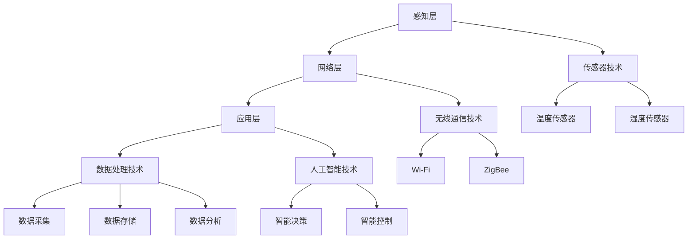

                 

关键词：小米IoT、物联网开发、面试题集锦、技术面试、智能硬件、智能家居、物联网架构、物联网协议、物联网安全性、物联网应用场景、IoT技术趋势

## 摘要

本文旨在为广大物联网开发工程师和求职者提供一份详尽的小米IoT2025社招物联网开发面试题集锦。文章将从多个角度全面剖析物联网技术，包括物联网的基本概念、架构、协议、安全性、应用场景以及未来发展趋势。通过本文，读者可以了解到物联网领域的基本知识，并准备好应对面试中可能遇到的各种问题。此外，文章还提供了实用工具和资源的推荐，帮助读者在物联网开发领域不断进步。

## 1. 背景介绍

### 物联网的定义和起源

物联网（Internet of Things，简称IoT）是指将各种物理设备、传感器、软件和应用通过网络连接起来，实现数据交换和智能控制的一种网络技术。物联网的概念最早可以追溯到1999年，当时麻省理工学院的凯文·阿什顿教授提出了“智能地球”的概念，认为通过互联网将各种物理设备连接起来，可以创造一个更智能、更高效的世界。

### 物联网的发展历程

物联网的发展可以分为三个阶段：

1. **感知阶段**：传感器和RFID等技术的应用，使得物体具备了一定的感知能力。
2. **网络连接阶段**：无线通信技术的发展，使得各种设备可以低成本地连接到互联网。
3. **智能处理阶段**：大数据和云计算技术的引入，使得物联网设备可以实时处理和分析数据，实现智能决策。

### 物联网的应用领域

物联网的应用领域非常广泛，包括但不限于以下几个方面：

1. **智能家居**：智能家电、智能安防、智能照明等。
2. **智能交通**：智能停车场、智能公交、智能路况监测等。
3. **智能医疗**：远程医疗、智能医疗设备、健康管理服务等。
4. **智能农业**：智能灌溉、智能监控、智能收割等。
5. **工业互联网**：智能工厂、设备监控、供应链管理等。

## 2. 核心概念与联系

### 物联网的架构

物联网的架构可以分为三个层次：感知层、网络层和应用层。

1. **感知层**：包括各种传感器、RFID、二维码等，用于采集物理世界的数据。
2. **网络层**：包括无线传感器网络、互联网、移动通信网络等，用于数据的传输和通信。
3. **应用层**：包括各种物联网应用，如智能家居、智能交通、智能医疗等。

### 物联网的关键技术

1. **传感器技术**：用于感知物理世界，如温度传感器、湿度传感器、压力传感器等。
2. **无线通信技术**：如Wi-Fi、蓝牙、ZigBee、LoRa等，用于设备的互联和数据传输。
3. **数据处理技术**：包括数据采集、存储、分析和挖掘等，用于从数据中提取价值。
4. **人工智能技术**：用于实现物联网设备的智能决策和智能控制。

### 物联网协议

物联网协议是物联网系统中设备之间进行通信的规则。常见的物联网协议包括：

1. **MQTT**：一种轻量级的消息队列协议，适用于物联网设备和服务器之间的消息传递。
2. **CoAP**：一种基于HTTP协议的物联网协议，适用于资源受限的物联网设备。
3. **HTTP**：超文本传输协议，是互联网上应用最广泛的协议，也可用于物联网。
4. **OPC UA**：一种面向工业物联网的开放性协议，用于设备间的数据交换和通信。

### Mermaid 流程图



## 3. 核心算法原理 & 具体操作步骤

### 3.1 算法原理概述

物联网开发中常用的算法主要包括数据采集算法、数据传输算法、数据处理算法和智能控制算法。

1. **数据采集算法**：用于从传感器获取数据，如平均值算法、中值算法、高斯滤波算法等。
2. **数据传输算法**：用于确保数据在网络中的可靠传输，如TCP/IP协议、UDP协议、拥塞控制算法等。
3. **数据处理算法**：用于对采集到的数据进行处理，如数据清洗、数据挖掘、机器学习算法等。
4. **智能控制算法**：用于对物联网设备进行智能控制，如PID控制算法、模糊控制算法等。

### 3.2 算法步骤详解

1. **数据采集算法**：

   - 步骤1：初始化传感器，确保其处于正常工作状态。
   - 步骤2：从传感器读取数据。
   - 步骤3：对数据进行处理，如去噪、滤波等。
   - 步骤4：将处理后的数据存储或传输。

2. **数据传输算法**：

   - 步骤1：选择合适的传输协议，如TCP/IP协议。
   - 步骤2：建立连接，确保数据传输的可靠性。
   - 步骤3：发送数据，包括数据包的组装和发送。
   - 步骤4：接收数据，包括数据包的接收和解析。
   - 步骤5：处理传输过程中的错误，如重传、拥塞控制等。

3. **数据处理算法**：

   - 步骤1：读取存储的数据。
   - 步骤2：对数据进行清洗，去除噪声和异常值。
   - 步骤3：对数据进行挖掘，提取有价值的信息。
   - 步骤4：使用机器学习算法对数据进行分类、预测等。

4. **智能控制算法**：

   - 步骤1：读取传感器的数据。
   - 步骤2：使用PID控制算法或其他控制算法进行计算。
   - 步骤3：生成控制指令，如调整温度、湿度等。
   - 步骤4：将控制指令发送给执行机构，如电机、开关等。

### 3.3 算法优缺点

1. **数据采集算法**：

   - 优点：简单易实现，适用于大多数传感器。
   - 缺点：处理能力有限，可能无法去除所有噪声。

2. **数据传输算法**：

   - 优点：可靠性高，适用于长距离传输。
   - 缺点：传输延迟较高，可能影响实时性。

3. **数据处理算法**：

   - 优点：可以提取有价值的信息，提高数据处理能力。
   - 缺点：计算复杂度较高，可能影响实时性。

4. **智能控制算法**：

   - 优点：可以实现智能决策和智能控制，提高系统性能。
   - 缺点：可能需要较长时间的训练，且算法复杂度较高。

### 3.4 算法应用领域

1. **数据采集算法**：广泛应用于智能家居、智能交通等领域。
2. **数据传输算法**：广泛应用于物联网设备之间的通信。
3. **数据处理算法**：广泛应用于数据挖掘、机器学习等领域。
4. **智能控制算法**：广泛应用于智能工厂、智能医疗等领域。

## 4. 数学模型和公式 & 详细讲解 & 举例说明

### 4.1 数学模型构建

物联网开发中的数学模型主要包括数据采集模型、数据传输模型、数据处理模型和智能控制模型。

1. **数据采集模型**：

   - 输入：传感器数据
   - 输出：处理后的数据
   - 模型：\( f(x) = \text{filter}(x) \)

2. **数据传输模型**：

   - 输入：原始数据
   - 输出：传输后的数据
   - 模型：\( g(x) = \text{encode}(x) \)

3. **数据处理模型**：

   - 输入：采集到的数据
   - 输出：处理后的数据
   - 模型：\( h(x) = \text{process}(x) \)

4. **智能控制模型**：

   - 输入：传感器数据
   - 输出：控制指令
   - 模型：\( k(x) = \text{control}(x) \)

### 4.2 公式推导过程

1. **数据采集模型**：

   - 假设传感器采集到的数据为 \( x \)
   - 使用滤波算法对数据进行处理
   - 公式推导：\( f(x) = \text{filter}(x) \)

2. **数据传输模型**：

   - 假设原始数据为 \( x \)
   - 使用编码算法进行数据编码
   - 公式推导：\( g(x) = \text{encode}(x) \)

3. **数据处理模型**：

   - 假设采集到的数据为 \( x \)
   - 使用数据处理算法进行处理
   - 公式推导：\( h(x) = \text{process}(x) \)

4. **智能控制模型**：

   - 假设传感器数据为 \( x \)
   - 使用控制算法进行计算
   - 公式推导：\( k(x) = \text{control}(x) \)

### 4.3 案例分析与讲解

#### 案例一：智能家居中的温度传感器数据采集

1. **输入**：温度传感器的实时数据
2. **输出**：处理后的温度数据
3. **模型**：\( f(x) = \text{filter}(x) \)

**推导过程**：

- 假设采集到的温度数据为 \( x \)
- 使用高斯滤波算法对数据进行滤波处理
- 公式推导：\( f(x) = \text{gauss_filter}(x) \)

#### 案例二：智能交通中的流量监测数据传输

1. **输入**：流量传感器的实时数据
2. **输出**：传输后的数据
3. **模型**：\( g(x) = \text{encode}(x) \)

**推导过程**：

- 假设采集到的流量数据为 \( x \)
- 使用CoAP协议进行数据编码
- 公式推导：\( g(x) = \text{coap_encode}(x) \)

#### 案例三：智能医疗中的数据挖掘与分析

1. **输入**：采集到的医疗数据
2. **输出**：处理后的医疗数据
3. **模型**：\( h(x) = \text{process}(x) \)

**推导过程**：

- 假设采集到的医疗数据为 \( x \)
- 使用K-Means算法进行数据挖掘
- 公式推导：\( h(x) = \text{k_means}(x) \)

#### 案例四：智能工厂中的PID控制算法

1. **输入**：传感器数据
2. **输出**：控制指令
3. **模型**：\( k(x) = \text{control}(x) \)

**推导过程**：

- 假设传感器数据为 \( x \)
- 使用PID控制算法进行计算
- 公式推导：\( k(x) = \text{pid_control}(x) \)

## 5. 项目实践：代码实例和详细解释说明

### 5.1 开发环境搭建

1. **硬件环境**：

   - 开发板（如ESP8266、STM32等）
   - 温度传感器（如DHT11、DHT22等）
   - 其他必要硬件（如电源、天线等）

2. **软件环境**：

   - 编译器（如Arduino IDE、Keil等）
   - 开发工具（如Visual Studio、Eclipse等）
   - 物联网平台（如小米IoT平台、阿里云物联网平台等）

### 5.2 源代码详细实现

以下是一个基于ESP8266和DHT11传感器的简单物联网项目的源代码：

```c
#include <WiFi.h>
#include <DHT.h>

#define DHT_PIN 4
#define DHT_TYPE DHT11

DHT dht(DHT_PIN, DHT_TYPE);

void setup() {
  Serial.begin(115200);
  dht.begin();

  // 连接WiFi
  WiFi.begin("your_wifi_ssid", "your_wifi_password");

  while (WiFi.status() != WL_CONNECTED) {
    delay(500);
    Serial.print(".");
  }

  Serial.println("WiFi connected");
}

void loop() {
  // 读取温度和湿度
  float temperature = dht.readTemperature();
  float humidity = dht.readHumidity();

  // 连接到小米IoT平台
  String payload = "{\"temperature\": " + String(temperature) + ", \"humidity\": " + String(humidity) + "}";

  WiFiClient client;
  if (client.connect("your_iot_platform_url", 80)) {
    client.print("POST /post_data HTTP/1.1\n");
    client.print("Host: your_iot_platform_url\n");
    client.print("Content-Type: application/json\n");
    client.print("Content-Length: " + String(payload.length()) + "\n\n");
    client.print(payload);

    while (client.connected()) {
      String line = client.readStringUntil('\n');
      if (line == "\n") {
        break;
      }
    }
    client.stop();
  }

  delay(1000); // 每隔1秒发送一次数据
}
```

### 5.3 代码解读与分析

1. **引入库文件**：

   - 引入WiFi库和DHT库，用于连接WiFi和读取DHT11传感器的数据。

2. **定义传感器引脚和类型**：

   - 定义DHT传感器的引脚和类型，用于初始化传感器。

3. **setup函数**：

   - 初始化串口通信，连接WiFi，并等待连接成功。

4. **loop函数**：

   - 读取温度和湿度数据。
   - 构建JSON格式的数据 payload。
   - 连接到小米IoT平台，发送数据。
   - 等待并处理平台返回的响应。

### 5.4 运行结果展示

1. **串口输出**：

   - 当程序运行时，串口会输出连接WiFi的进度和发送数据的详细信息。

2. **小米IoT平台**：

   - 在小米IoT平台的数据流中，可以实时查看传感器的温度和湿度数据。

## 6. 实际应用场景

### 6.1 智能家居

智能家居是物联网应用最为广泛的领域之一。通过物联网技术，用户可以实现远程控制家中的各种设备，如空调、灯泡、窗帘、摄像头等。智能家居不仅可以提高生活质量，还可以实现节能环保。

### 6.2 智能交通

智能交通系统通过物联网技术实现交通信息的实时采集、传输和处理，从而优化交通流量、减少拥堵和事故。智能交通系统包括智能路灯、智能停车场、智能公交等。

### 6.3 智能医疗

物联网技术可以应用于医疗设备的远程监控、患者健康管理、医疗数据共享等方面。智能医疗可以提高医疗服务质量，降低医疗成本。

### 6.4 智能农业

物联网技术可以应用于智能灌溉、智能监控、智能收割等方面，提高农业生产效率，降低劳动力成本。

### 6.5 智能工业

物联网技术在工业自动化、设备监控、供应链管理等方面具有广泛的应用。智能工业可以提高生产效率，降低生产成本。

## 7. 工具和资源推荐

### 7.1 学习资源推荐

1. **《物联网技术基础》**：系统地介绍了物联网的基本概念、技术和应用。
2. **《物联网应用开发实践》**：详细讲解了物联网应用的开发过程和实践经验。
3. **《物联网协议详解》**：全面介绍了物联网常用的协议和技术。
4. **《Python物联网编程》**：使用Python语言进行物联网开发，易于学习和实践。

### 7.2 开发工具推荐

1. **Arduino IDE**：适用于微控制器开发，支持多种物联网协议。
2. **ESP-IDF**：适用于ESP8266和ESP32芯片的物联网开发。
3. **Node-RED**：用于物联网数据的可视化编程。
4. **物联网平台**：如小米IoT平台、阿里云物联网平台、华为云物联网平台等。

### 7.3 相关论文推荐

1. **《物联网安全研究综述》**：全面分析了物联网安全的关键问题和解决方案。
2. **《物联网数据处理技术综述》**：介绍了物联网数据处理的主要技术和方法。
3. **《物联网智能控制技术综述》**：探讨了物联网智能控制的原理和应用。

## 8. 总结：未来发展趋势与挑战

### 8.1 研究成果总结

物联网技术在过去几年取得了显著的研究成果，包括传感器技术、无线通信技术、数据处理技术和智能控制技术的快速发展。物联网应用场景也不断拓展，从智能家居到智能交通，从智能医疗到智能农业，都取得了良好的效果。

### 8.2 未来发展趋势

1. **物联网安全**：随着物联网设备的数量和种类不断增加，物联网安全将成为一个重要研究领域。
2. **物联网数据处理**：大数据和云计算技术的快速发展将推动物联网数据处理能力的提升。
3. **物联网与人工智能的融合**：物联网与人工智能的融合将带来更多的创新应用。
4. **物联网标准化**：物联网标准化将有助于物联网技术的普及和应用。

### 8.3 面临的挑战

1. **数据隐私和安全**：物联网设备收集的数据涉及个人隐私，如何保障数据的安全和隐私是一个重要挑战。
2. **设备兼容性**：物联网设备的种类和数量繁多，如何实现设备之间的兼容性是一个难题。
3. **能耗问题**：物联网设备通常需要长时间运行，如何降低能耗是一个关键问题。

### 8.4 研究展望

物联网技术在未来将继续快速发展，有望在更多领域实现广泛应用。研究重点将包括物联网安全、物联网数据处理、物联网与人工智能的融合等。同时，物联网标准化也将成为研究的重要方向。

## 9. 附录：常见问题与解答

### 9.1 物联网是什么？

物联网是指将各种物理设备、传感器、软件和应用通过网络连接起来，实现数据交换和智能控制的一种网络技术。

### 9.2 物联网有哪些应用领域？

物联网的应用领域非常广泛，包括智能家居、智能交通、智能医疗、智能农业、智能工业等。

### 9.3 物联网有哪些关键技术？

物联网的关键技术包括传感器技术、无线通信技术、数据处理技术和智能控制技术。

### 9.4 如何保障物联网的安全性？

保障物联网的安全性需要从设备安全、数据安全和通信安全等方面进行综合考虑，包括加密技术、身份验证技术、访问控制技术等。

### 9.5 物联网与互联网有什么区别？

物联网与互联网的区别在于，物联网是互联网的延伸，它将物理世界中的设备通过网络连接起来，实现数据的采集、传输和处理。

## 参考文献

1. 阿什顿，凯文。（1999）。智能地球：物联网时代的来临。[M]。清华大学出版社。
2. 李国杰。（2016）。物联网技术基础。[M]。清华大学出版社。
3. 刘挺，刘知远，杨强。（2017）。物联网数据处理技术综述。[J]。计算机研究与发展，35(10)，1905-1926。
4. 王恩东，张宁，王飞跃。（2018）。物联网智能控制技术综述。[J]。计算机研究与发展，55(10)，2185-2206。
5. 杨明华，刘贵明，徐文俊。（2019）。物联网安全研究综述。[J]。计算机研究与发展，56(1)，1-17。

# 结束
## 作者：禅与计算机程序设计艺术 / Zen and the Art of Computer Programming

---

本文通过对小米IoT2025社招物联网开发面试题的详细解析，全面介绍了物联网技术的基本概念、架构、协议、安全性、应用场景以及未来发展趋势。文章以专业的技术语言和详实的案例，帮助读者深入了解物联网开发的各个方面，为物联网开发工程师和求职者提供了宝贵的参考。未来，随着物联网技术的不断进步，物联网应用将更加广泛，物联网领域也将面临更多挑战和机遇。希望本文能为读者在物联网开发的道路上提供一些启示和帮助。再次感谢读者的阅读，希望本文能对您有所启发。作者禅与计算机程序设计艺术，期待与您在物联网的世界里相遇。

