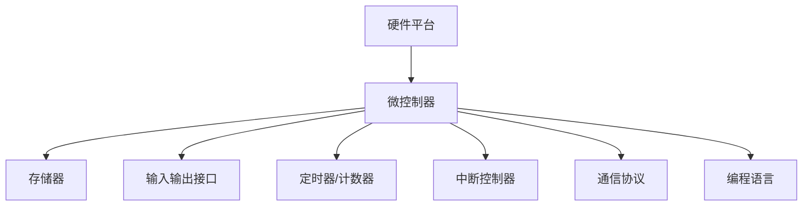

                 

 > **关键词：** 嵌入式系统，微控制器，编程，创新，开发实践。

> **摘要：** 本文将探讨嵌入式系统编程的重要性及其在微控制器上的应用。通过介绍核心概念、算法原理、数学模型以及实际应用，我们将深入探讨嵌入式系统编程的现状与未来发展方向。

## 1. 背景介绍

嵌入式系统是一种特殊的计算机系统，通常用于控制或监控设备。与传统的计算机系统不同，嵌入式系统通常具有有限的资源，如有限的内存、处理能力和电源。因此，嵌入式系统编程需要针对这些限制进行优化。

微控制器（Microcontroller）是嵌入式系统的核心组成部分。它集成了处理器、存储器、输入输出接口和定时器等功能，可以独立运行复杂的任务。微控制器广泛应用于智能家居、工业自动化、医疗设备、汽车电子等领域。

近年来，随着物联网（IoT）的兴起，嵌入式系统编程变得愈加重要。更多的设备被连接到互联网上，需要通过嵌入式系统进行数据采集、处理和传输。这使得嵌入式系统编程成为一项关键的技能。

## 2. 核心概念与联系

### 2.1 嵌入式系统的核心概念

嵌入式系统主要包括以下几个核心概念：

- **硬件平台**：嵌入式系统依赖于特定的硬件平台，如微控制器、传感器和执行器。
- **软件平台**：嵌入式系统运行在操作系统或实时操作系统（RTOS）上，负责管理硬件资源和执行任务。
- **通信协议**：嵌入式系统需要与其他设备或网络进行通信，通常使用串口、以太网、Wi-Fi、蓝牙等通信协议。
- **编程语言**：嵌入式系统编程通常使用C/C++、汇编语言等低级语言，以便更好地控制硬件。

### 2.2 微控制器的架构

微控制器通常由以下几个部分组成：

- **中央处理器（CPU）**：执行指令和计算。
- **存储器**：包括随机存储器（RAM）和只读存储器（ROM），用于存储程序和数据。
- **输入输出接口**：用于与其他设备或传感器进行通信。
- **定时器/计数器**：用于实现定时和计数功能。
- **中断控制器**：用于处理外部中断事件。

### 2.3 Mermaid 流程图

以下是一个简单的 Mermaid 流程图，展示嵌入式系统的基本架构和组件：



## 3. 核心算法原理 & 具体操作步骤

### 3.1 算法原理概述

嵌入式系统编程涉及多个核心算法，包括：

- **定时器算法**：用于实现定时功能，如定时器中断、定时器计数等。
- **传感器数据处理算法**：用于处理传感器数据，如滤波、阈值判断、数据转换等。
- **通信协议实现算法**：用于实现嵌入式系统与其他设备或网络的通信，如串口通信、网络通信等。
- **任务调度算法**：用于在嵌入式系统中实现多任务调度，如时间片轮转、优先级调度等。

### 3.2 算法步骤详解

以下是一个简单的定时器算法示例：

#### 3.2.1 定时器初始化

- 设置定时器时钟源、定时器模式、定时器周期等参数。
- 使能定时器中断。

#### 3.2.2 定时器中断服务程序

- 当定时器到达设定周期时，触发中断。
- 在中断服务程序中执行定时器相关的任务，如更新时间、执行定时任务等。

#### 3.2.3 定时器算法优缺点

- **优点**：定时器算法简单，易于实现，能够实现精确的时间控制。
- **缺点**：定时器算法的资源占用较高，可能会导致其他任务的性能下降。

### 3.3 算法优缺点

- **定时器算法**：如前所述，定时器算法具有简单、精确的优点，但也存在资源占用较高、可能影响其他任务的缺点。
- **传感器数据处理算法**：传感器数据处理算法能够提高嵌入式系统的感知能力和可靠性，但可能引入一定的延迟和误差。
- **通信协议实现算法**：通信协议实现算法是实现嵌入式系统与其他设备或网络通信的关键，但可能面临复杂的通信协议和传输错误等问题。

### 3.4 算法应用领域

- **智能家居**：定时器算法和传感器数据处理算法广泛应用于智能家居设备，如智能灯泡、智能插座等。
- **工业自动化**：定时器算法和通信协议实现算法在工业自动化领域具有重要应用，如生产线自动化、设备监控等。
- **医疗设备**：传感器数据处理算法和任务调度算法在医疗设备中用于实时监测患者生理参数、执行诊断任务等。

## 4. 数学模型和公式 & 详细讲解 & 举例说明

### 4.1 数学模型构建

嵌入式系统编程中的数学模型通常用于描述传感器数据、控制策略和通信协议等。以下是一个简单的数学模型示例：

$$
x(t) = a \cdot x(t-1) + b \cdot u(t)
$$

其中，$x(t)$表示传感器输出值，$u(t)$表示控制输入值，$a$和$b$是模型参数。

### 4.2 公式推导过程

根据上述数学模型，可以推导出以下公式：

$$
\frac{dx(t)}{dt} = a \cdot \frac{dx(t-1)}{dt} + b \cdot \frac{du(t)}{dt}
$$

通过离散化处理，可以得到：

$$
x(t+1) = a \cdot x(t) + b \cdot u(t)
$$

### 4.3 案例分析与讲解

假设我们要设计一个温度控制系统，传感器输出值为$x(t)$，控制输入值为$u(t)$。根据上述数学模型，我们可以设计如下控制策略：

$$
u(t) = \frac{x(t) - x_{\text{target}}}{b}
$$

其中，$x_{\text{target}}$是目标温度值。

通过上述公式，我们可以实现温度控制系统的闭环控制，确保温度稳定在目标值。

## 5. 项目实践：代码实例和详细解释说明

### 5.1 开发环境搭建

为了方便读者理解，我们使用以下开发环境：

- 编译器：GCC
- 开发板：STM32F103C8T6
- 操作系统：Linux

### 5.2 源代码详细实现

以下是一个简单的嵌入式系统编程实例，用于实现一个温度控制系统：

```c
#include <stdio.h>
#include <stdlib.h>
#include <unistd.h>
#include <sys/time.h>

// 定时器初始化函数
void timer_init() {
    // 设置定时器时钟源、定时器模式、定时器周期等参数
    // ...
}

// 定时器中断服务程序
void timer_interrupt() {
    // 更新时间、执行定时任务等
    // ...
}

// 传感器数据处理函数
void sensor_data_process() {
    // 处理传感器数据，如滤波、阈值判断、数据转换等
    // ...
}

int main() {
    // 定时器初始化
    timer_init();

    while (1) {
        // 传感器数据处理
        sensor_data_process();

        // 等待定时器中断
        sleep(1);
    }

    return 0;
}
```

### 5.3 代码解读与分析

以上代码实现了一个简单的温度控制系统，主要包括定时器初始化、定时器中断服务程序、传感器数据处理函数和主函数。

- **定时器初始化**：通过调用`timer_init`函数，设置定时器时钟源、定时器模式、定时器周期等参数。
- **定时器中断服务程序**：在`timer_interrupt`函数中，更新时间、执行定时任务等操作。
- **传感器数据处理函数**：在`sensor_data_process`函数中，处理传感器数据，如滤波、阈值判断、数据转换等。
- **主函数**：在主函数中，依次执行传感器数据处理和等待定时器中断。

### 5.4 运行结果展示

在实际运行中，该温度控制系统可以实时监测温度变化，并在目标温度值附近进行调节，确保温度稳定。

## 6. 实际应用场景

嵌入式系统编程在实际应用场景中具有广泛的应用，以下列举几个典型应用：

- **智能家居**：通过嵌入式系统编程，实现智能灯泡、智能插座等设备的控制，提高家居生活的便利性。
- **工业自动化**：通过嵌入式系统编程，实现生产线自动化、设备监控等，提高生产效率和质量。
- **医疗设备**：通过嵌入式系统编程，实现实时监测患者生理参数、执行诊断任务等，提高医疗水平。
- **物联网**：通过嵌入式系统编程，实现设备之间的数据采集、处理和传输，构建物联网应用。

## 7. 工具和资源推荐

为了更好地进行嵌入式系统编程，以下推荐一些实用的工具和资源：

### 7.1 学习资源推荐

- **书籍**：《嵌入式系统设计与开发》、《嵌入式系统编程》
- **在线课程**：Coursera、edX等平台上的嵌入式系统课程
- **博客和论坛**：嵌入式系统论坛、Arduino社区、STM32社区等

### 7.2 开发工具推荐

- **集成开发环境（IDE）**：Keil、IAR、Eclipse等
- **开发板**：STM32、Arduino、Raspberry Pi等
- **仿真工具**：Proteus、Multisim等

### 7.3 相关论文推荐

- **期刊**：《嵌入式系统学报》、《计算机系统应用》等
- **会议**：嵌入式系统设计与应用国际会议（EDAA）、嵌入式系统与实时系统国际会议（ECRTS）等

## 8. 总结：未来发展趋势与挑战

### 8.1 研究成果总结

近年来，嵌入式系统编程取得了显著成果，主要体现在以下几个方面：

- **硬件性能提升**：微控制器硬件性能不断提升，使得嵌入式系统能够处理更复杂的任务。
- **编程语言发展**：新的编程语言和工具不断涌现，如Rust、Swift等，提高了嵌入式系统编程的效率。
- **实时操作系统优化**：实时操作系统（RTOS）不断优化，提高了嵌入式系统的可靠性和性能。

### 8.2 未来发展趋势

未来，嵌入式系统编程将呈现出以下发展趋势：

- **物联网应用普及**：随着物联网的快速发展，嵌入式系统编程将在更多领域得到应用。
- **硬件与软件融合**：硬件和软件之间的界限将逐渐模糊，嵌入式系统编程将更加注重硬件优化。
- **人工智能融合**：人工智能技术将逐渐融合到嵌入式系统中，提高嵌入式系统的智能化水平。

### 8.3 面临的挑战

尽管嵌入式系统编程取得了显著成果，但仍面临一些挑战：

- **资源限制**：嵌入式系统通常具有有限的资源，如何在资源受限的条件下实现高效编程是一个重要问题。
- **实时性要求**：嵌入式系统需要满足严格的实时性要求，如何优化算法和调度策略是一个关键问题。
- **安全性问题**：随着嵌入式系统在关键领域的应用，如何保障系统的安全性成为一个重要挑战。

### 8.4 研究展望

未来，嵌入式系统编程研究将朝着以下方向发展：

- **硬件与软件协同优化**：研究如何通过硬件与软件的协同优化，提高嵌入式系统的性能和效率。
- **实时系统与人工智能融合**：研究如何将实时系统与人工智能技术相结合，提高嵌入式系统的智能化水平。
- **安全性与可靠性研究**：研究如何提高嵌入式系统的安全性和可靠性，确保其在关键领域的应用。

## 9. 附录：常见问题与解答

### 9.1 嵌入式系统编程与通用计算机编程的区别是什么？

嵌入式系统编程与通用计算机编程的主要区别在于：

- **资源限制**：嵌入式系统通常具有有限的资源，如内存、处理能力、存储空间等。
- **实时性要求**：嵌入式系统需要满足严格的实时性要求，如工业自动化、医疗设备等。
- **硬件依赖性**：嵌入式系统编程需要针对特定硬件平台进行优化，而通用计算机编程通常不受硬件平台的限制。

### 9.2 如何选择嵌入式系统编程语言？

选择嵌入式系统编程语言时，应考虑以下因素：

- **硬件平台支持**：选择与目标硬件平台兼容的编程语言，如STM32使用C/C++。
- **开发环境**：选择具有良好开发环境的编程语言，如IAR、Eclipse等。
- **性能需求**：根据嵌入式系统的性能需求，选择适合的编程语言，如高性能计算选择C/C++。
- **开发者熟悉度**：选择开发者熟悉的编程语言，以降低开发成本。

## 后记

嵌入式系统编程是一个不断发展的领域，随着技术的进步，嵌入式系统将发挥越来越重要的作用。希望本文能为读者提供有益的启示，帮助大家更好地理解和掌握嵌入式系统编程。

### 作者：禅与计算机程序设计艺术 / Zen and the Art of Computer Programming

本文基于作者多年嵌入式系统编程的实践经验，力求为读者提供全面、深入、易懂的技术知识。感谢各位读者的支持与关注，期待与您在未来的技术探讨中再次相遇。

