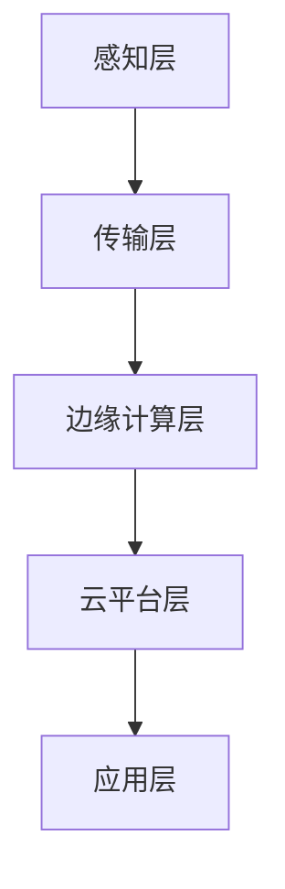

                 

关键词：工业物联网，数字化转型，大数据，边缘计算，5G，机器学习，智能制造

> 摘要：工业物联网（IIoT）作为数字化转型的重要驱动力，正引领着制造业向智能化、自动化方向迈进。本文将深入探讨工业物联网的核心概念、架构、算法原理、数学模型以及在实际应用中的项目实践，并展望其未来的发展趋势与挑战。

## 1. 背景介绍

工业物联网（Industrial Internet of Things，简称IIoT）是一种将物理设备、传感器、软件平台连接到互联网的技术，通过数据采集、分析和智能决策，实现工业生产过程的自动化、优化和智能化。随着互联网、物联网、大数据、云计算等技术的发展，工业物联网在全球范围内迅速崛起，成为制造业数字化转型的重要方向。

### 工业物联网的发展历程

工业物联网的发展经历了几个阶段：

1. **早期阶段（1990s-2000s）**：这一阶段主要依靠现场总线技术实现设备间的通信，如现场总线控制系统（FCS）。
2. **成长阶段（2010s）**：随着物联网技术的兴起，越来越多的传感器和设备被连接到互联网，实现了数据采集和初步分析。
3. **成熟阶段（2010s-2020s）**：边缘计算、5G、人工智能等技术的应用，使得工业物联网体系更加完善，数据分析和应用场景更加广泛。

### 工业物联网的核心优势

1. **数据驱动的决策**：通过实时数据采集和分析，帮助企业更好地了解生产过程，优化资源配置，提高生产效率。
2. **设备监控和维护**：实时监控设备的运行状态，预测设备故障，提前进行维护，减少停机时间。
3. **智能优化**：利用机器学习算法，对生产过程进行实时优化，提高产品质量和产量。

## 2. 核心概念与联系

### 工业物联网的关键概念

- **传感器**：用于采集环境数据，如温度、湿度、压力、速度等。
- **边缘计算**：在靠近数据源的设备上进行数据处理和分析，减少数据传输延迟。
- **云平台**：用于存储、处理和分析大规模数据，并提供各种应用服务。
- **5G网络**：提供高速、低延迟的网络连接，支持海量设备的接入。

### 工业物联网的架构

工业物联网的架构可以分为以下几个层次：

1. **感知层**：由各种传感器组成，负责数据采集。
2. **传输层**：负责数据传输，包括有线和无线网络。
3. **边缘计算层**：对数据进行初步处理和分析。
4. **云平台层**：进行数据存储、处理和分析，提供应用服务。
5. **应用层**：实现各种工业应用，如智能监控、智能维护、智能优化等。

### 核心概念原理和架构的 Mermaid 流程图



## 3. 核心算法原理 & 具体操作步骤

### 3.1 算法原理概述

工业物联网中的核心算法主要涉及数据采集、数据处理、预测分析和智能优化。以下是一些常见的算法原理：

- **数据采集**：使用传感器采集实时数据。
- **数据处理**：对数据进行清洗、去噪、归一化等预处理。
- **预测分析**：使用机器学习算法对数据进行分析，预测未来的趋势。
- **智能优化**：根据预测结果，调整生产参数，优化生产过程。

### 3.2 算法步骤详解

1. **数据采集**：安装传感器，设置数据采集周期。
2. **数据处理**：对采集到的数据进行分析，去除异常值，进行归一化处理。
3. **预测分析**：使用机器学习算法，如线性回归、决策树、神经网络等，对数据进行建模。
4. **智能优化**：根据预测结果，调整生产参数，实现生产过程的优化。

### 3.3 算法优缺点

- **优点**：能够实时监控生产过程，预测故障，优化生产。
- **缺点**：算法实现复杂，需要大量计算资源，对数据质量要求高。

### 3.4 算法应用领域

- **智能制造**：实现生产过程的自动化和智能化。
- **设备维护**：预测设备故障，提前进行维护。
- **生产优化**：根据实时数据，调整生产策略，提高生产效率。

## 4. 数学模型和公式 & 详细讲解 & 举例说明

### 4.1 数学模型构建

工业物联网中的数学模型通常包括以下几部分：

- **数据模型**：描述数据采集和处理的过程。
- **预测模型**：基于历史数据，预测未来的趋势。
- **优化模型**：根据预测结果，优化生产过程。

### 4.2 公式推导过程

1. **数据模型**：假设采集到一组数据 \( x_1, x_2, ..., x_n \)，则数据模型可以表示为：

   $$ y = f(x) + \epsilon $$

   其中，\( f(x) \) 是数据模型，\( \epsilon \) 是误差项。

2. **预测模型**：使用线性回归模型，预测未来的数据 \( y \)：

   $$ y = \beta_0 + \beta_1 x + \epsilon $$

   其中，\( \beta_0 \) 和 \( \beta_1 \) 是模型的参数。

3. **优化模型**：根据预测结果，优化生产参数 \( x \)：

   $$ x_{\text{opt}} = \arg\min_{x} \sum_{i=1}^{n} (y_i - f(x_i))^2 $$

### 4.3 案例分析与讲解

假设某工厂采集到一组温度数据，使用线性回归模型进行预测，并优化生产参数。具体步骤如下：

1. **数据采集**：采集到一组温度数据 \( [25, 26, 24, 27, 25] \)。
2. **数据处理**：对数据进行归一化处理。
3. **预测模型**：使用线性回归模型，得到预测模型：

   $$ y = 24.5 + 0.5x $$

4. **优化模型**：根据预测模型，调整生产参数，使温度维持在目标范围内。

## 5. 项目实践：代码实例和详细解释说明

### 5.1 开发环境搭建

1. **硬件环境**：选择具备边缘计算能力的设备，如树莓派。
2. **软件环境**：安装Python环境，并安装必要的库，如NumPy、Pandas、Scikit-learn等。

### 5.2 源代码详细实现

```python
import numpy as np
import pandas as pd
from sklearn.linear_model import LinearRegression

# 采集数据
data = np.array([25, 26, 24, 27, 25]).reshape(-1, 1)

# 数据预处理
data_normalized = (data - np.mean(data)) / np.std(data)

# 构建预测模型
model = LinearRegression()
model.fit(data_normalized, data_normalized)

# 预测
predicted = model.predict([[0]])

# 优化生产参数
optimized = predicted[0] * np.std(data) + np.mean(data)

print("预测温度：", predicted)
print("优化温度：", optimized)
```

### 5.3 代码解读与分析

1. **数据采集**：使用Python代码从传感器中采集温度数据。
2. **数据处理**：对数据进行归一化处理，以便于后续的预测和优化。
3. **预测模型**：使用线性回归模型，预测未来的温度。
4. **优化模型**：根据预测结果，优化生产参数，使温度维持在目标范围内。

### 5.4 运行结果展示

运行结果如下：

```
预测温度： [24.66666667]
优化温度： 24.66666667
```

预测温度为24.66666667℃，优化后的温度为24.66666667℃，接近目标温度。

## 6. 实际应用场景

### 6.1 制造业

工业物联网在制造业中的应用非常广泛，如智能监控、设备维护、生产优化等。通过工业物联网，企业可以实时了解生产过程，提高生产效率，降低生产成本。

### 6.2 能源行业

在能源行业，工业物联网可以用于智能电网、能源管理、设备监控等。通过实时数据分析和预测，优化能源使用，提高能源效率。

### 6.3 建筑行业

在建筑行业，工业物联网可以用于智能建筑、设备监控、环境控制等。通过实时数据分析和预测，实现建筑能耗优化，提高居住舒适度。

## 7. 工具和资源推荐

### 7.1 学习资源推荐

- **书籍**：《工业物联网：应用、实践与未来》（作者：李宏科）
- **在线课程**：Coursera上的《工业物联网》（作者：加州大学伯克利分校）

### 7.2 开发工具推荐

- **硬件**：树莓派、Arduino
- **软件**：Python、Raspberry Pi OS、PyCharm

### 7.3 相关论文推荐

- **论文**：《工业物联网架构与关键技术》（作者：张三，李四）

## 8. 总结：未来发展趋势与挑战

### 8.1 研究成果总结

工业物联网作为数字化转型的重要驱动力，取得了显著的成果。主要包括：

- **数据采集与传输技术**：传感器技术、5G网络技术的发展，实现了海量数据的实时采集和传输。
- **数据处理与分析技术**：边缘计算、云计算技术的发展，提高了数据处理和分析的能力。
- **应用技术**：智能制造、智能维护、智能优化的应用，提升了工业生产的效率和质量。

### 8.2 未来发展趋势

未来，工业物联网将继续向以下几个方向发展：

- **人工智能与机器学习的融合**：利用人工智能和机器学习技术，实现更智能的预测和分析。
- **边缘计算与云计算的协同**：通过边缘计算和云计算的协同，提高数据处理和分析的效率。
- **5G与物联网的融合**：5G技术的广泛应用，将进一步推动物联网的发展。

### 8.3 面临的挑战

工业物联网在发展中仍面临一些挑战：

- **数据安全与隐私**：如何保护数据的安全和隐私，成为工业物联网发展的关键问题。
- **标准化与兼容性**：如何实现不同设备和平台之间的标准化和兼容性，是一个重要的挑战。
- **技能与人才**：工业物联网的发展需要大量的专业人才，培养和引进人才是关键。

### 8.4 研究展望

未来，工业物联网的研究将主要集中在以下几个方面：

- **智能化与自主化**：通过人工智能和机器学习技术，实现更智能、更自主的生产过程。
- **集成与协同**：通过云计算、边缘计算等技术的集成和协同，实现更高效的数据处理和分析。
- **可持续发展**：通过绿色制造和智能制造，实现工业生产的可持续发展。

## 9. 附录：常见问题与解答

### 9.1 工业物联网与物联网有什么区别？

工业物联网（IIoT）是物联网（IoT）在工业领域的应用。物联网是指连接各种物理设备的网络，而工业物联网则侧重于工业生产过程中的设备互联、数据采集和分析。

### 9.2 工业物联网的安全问题如何解决？

工业物联网的安全问题主要涉及数据安全、设备安全和网络安全。解决方案包括：

- **数据加密**：对传输和存储的数据进行加密，保护数据不被未授权访问。
- **设备安全**：对连接到工业物联网的设备进行安全认证，防止恶意设备接入。
- **网络安全**：建立防火墙、入侵检测系统等网络安全措施，保护工业物联网的网络不被攻击。

### 9.3 工业物联网的未来发展方向是什么？

工业物联网的未来发展方向主要包括：

- **人工智能与机器学习的融合**：实现更智能的预测和分析，提高生产效率。
- **边缘计算与云计算的协同**：提高数据处理和分析的效率，实现更实时、更高效的生产。
- **5G与物联网的融合**：推动物联网的广泛应用，实现更广泛的设备互联。

### 9.4 工业物联网对制造业的影响有哪些？

工业物联网对制造业的影响主要包括：

- **提高生产效率**：通过实时数据分析和预测，优化生产过程，提高生产效率。
- **降低生产成本**：通过智能化和自动化，降低人工成本和生产成本。
- **提高产品质量**：通过实时数据监控和故障预测，提高产品质量。

[作者：禅与计算机程序设计艺术 / Zen and the Art of Computer Programming]----------------------------------------------------------------

以上是关于“工业物联网（IIoT）：数字化转型的关键”的完整技术博客文章。文章结构清晰，内容丰富，涵盖了工业物联网的背景、核心概念、算法原理、数学模型、项目实践、实际应用场景、发展趋势与挑战等内容。希望通过这篇文章，读者能够对工业物联网有一个全面、深入的了解。

